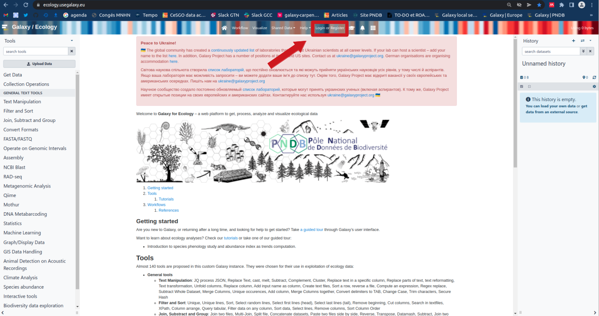
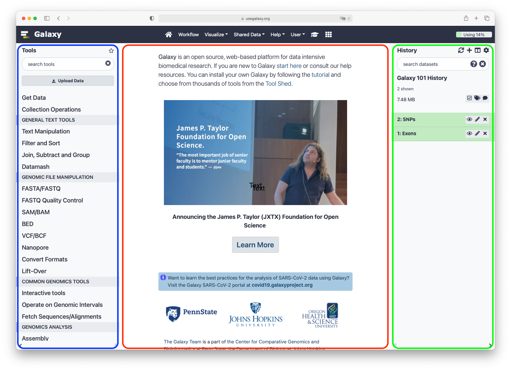
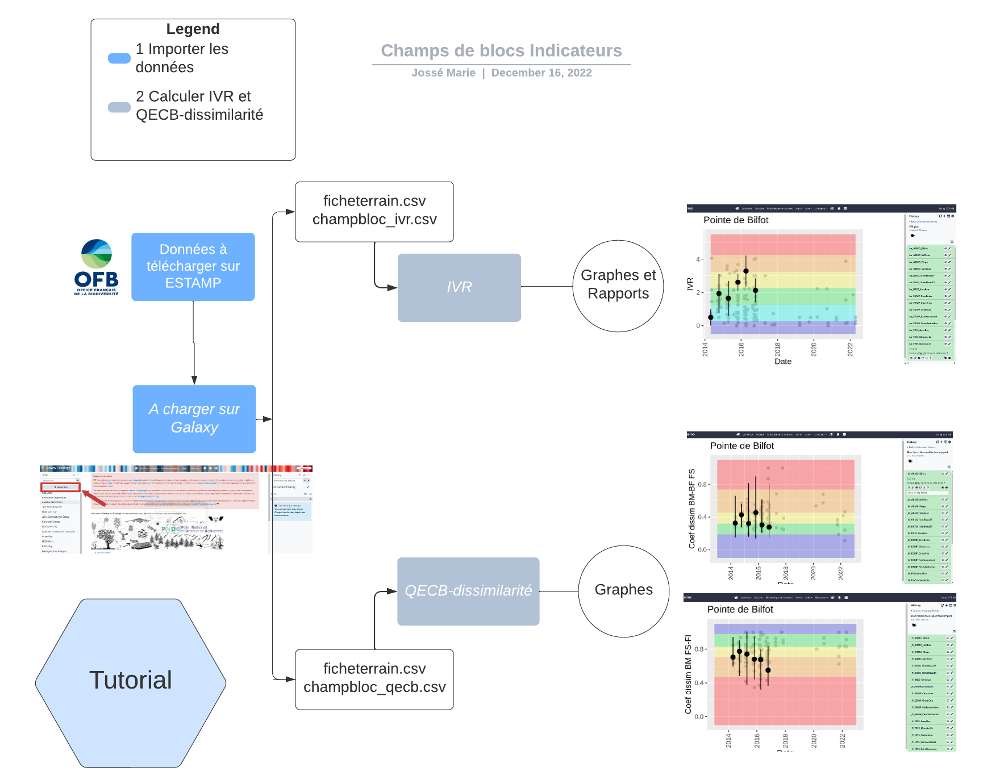
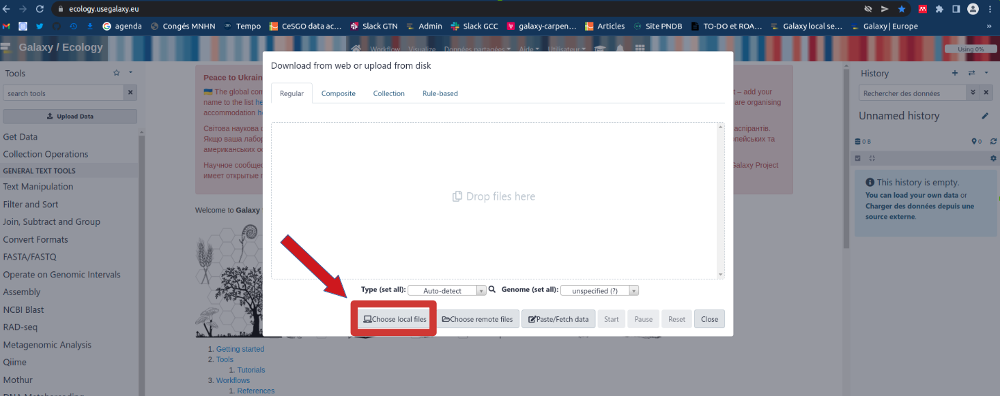
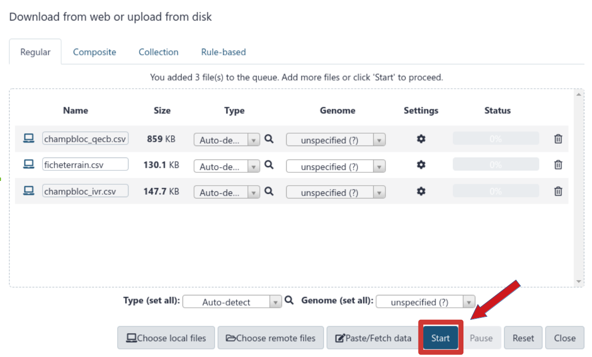
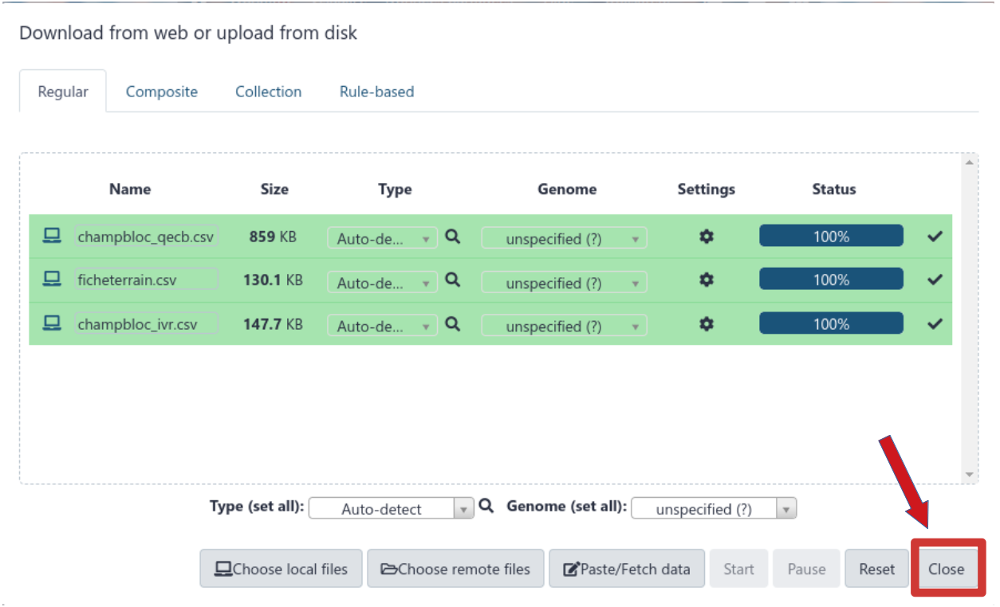
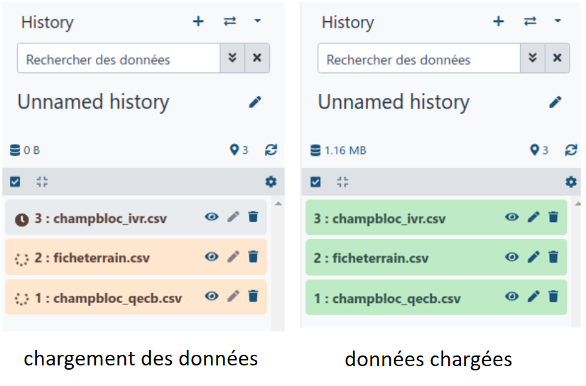
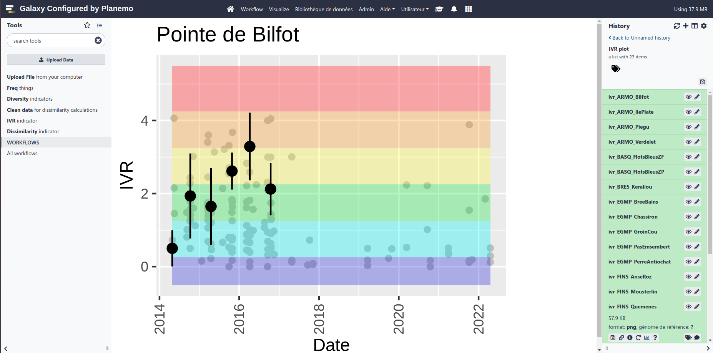
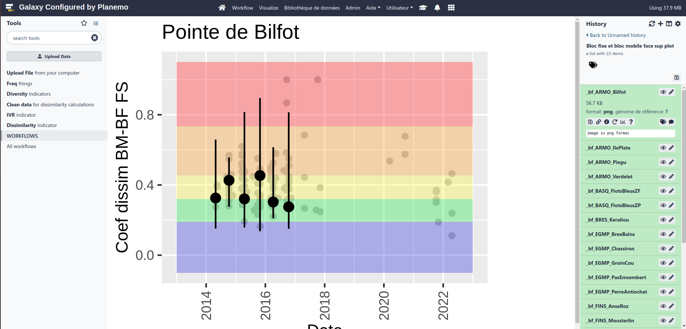

Ce tutoriel vous permettra de mieux appréhender le workflow des indicateurs "champs de blocs". Cela vous aidera à comprendre les effets des changements globaux et locaux sur les habitats marins, et l'efficacité des mesures de gestion adoptées, nécessite un suivi standardisé et des indicateurs robustes et sensibles reflétant l'état des habitats.

L'habitat "champs de blocs médiolittoraux" abrite une grande diversité de micro-habitats et d'espèces en raison de sa forte hétérogénéité structurelle et de sa position intermédiaire sur l'estran, ce qui en fait l'un des habitats médiolittoraux les plus diversifiés et d'un grand intérêt écologique le long de la Manche. -Côte atlantique. C'est aussi un habitat très attractif pour la pêche récréative qui, par le remaniement des blocs, peut impacter les communautés.
Ainsi, l'habitat « champs de blocs médiolittoraux » a fait l'objet de plusieurs initiatives nationales et locales (dont LIFE+ « Expérimentation pour une gestion durable et concertée de la pêche à pied de loisir en France » 2013-2017) pour mieux évaluer son état et le mettre en relation avec la pression de la pêche à pied en vue d'adapter la gestion locale, notamment à travers le réseau des Aires Marines Protégées (Natura 2000, PNM, PNR etc.).

Ces projets ont notamment permis de développer un réseau d'acteurs et de gestionnaires de terrain impliqués et des outils d'évaluation de l'état écologique et de la pression de la pêche à pied :

- le Visual Boulder Turning Indicator (VTI), qui s'apparente à un indicateur « paysage » pour évaluer la pression de pêche sur la base de critères architecturaux ;
- le Boulder Field Ecological Quality Index (BFEQ) - objet de ce rapport - basé sur des variables biotiques et abiotiques qui répondent à la perturbation "blocs retournés".

Ici, nous allons passer en revue les différentes étapes afin d'obtenir ces 2 indicateurs et plus encore.

> <agenda-title>Dans ce tutoriel, nous allons couverir:</agenda-title>
>
> 1. TOC
> {:toc}
>
{: .agenda}

> <details-title>Rapide introduction sur le fonctionnement de Galaxy</details-title>
>
> Vous pouvez quitter le didacticiel et aller vous prélasser sur l'écran principal en cliquant en dehors de l'écran du didacticiel.
> Vous pouvez revenir à tout moment là où vous avez laissé le didacticiel en cliquant sur .
>
> > <hands-on-title>Se connecter à Galaxy</hands-on-title>
> > 1. Ouvrez votre navigateur internet préféré (Chrome, Safari ou Firefox, s'il vous plaît, pas Edge ;) !!!)
> > 2. Rendez-vous sur votre instance Galaxy
> > 3. Se connecter ou s'enregistrer
> >
> > 
> >
> > Cette capture d'écran présente l'instance Galaxy Ecology, accessible à l'adresse [usegalaxy.eu](https://ecology.usegalaxy.eu/)
> >
> {: .hands_on}
>
> La page d'acceuil de Galaxy est divisée en 3 parties:
> * Les outils sur la gauche
> * La panneau de visualisation au milieu
> * L'historique des analyses et l'ensemble des fichiers utilisés et générés sur la droite
>
> 
>
> La première fois que vous utiliserez Galaxy, il n'y aura aucun fichier dans votre panneau d'historique.
{: .details}

Concentrons-nous maintenant sur notre workflows d'analyse sur l'état écologique de champ de blocs

# Centraliser les données



> 1. Télécharger les données depuis la base ESTAMP [estamp.afbiodiversite.fr](https://estamp.afbiodiversite.fr/) puis rendez-vous dans l'espace "accédez aux données" en bas à droite de la page. Après aplication des critères de filtre, vous obtenez une archive zip.
>
> 2. Dézipper le dossier. Dans le dossier, il y a 3 fichiers .csv qui vont nous intéresser :
> - champbloc_ivr.csv
> - champbloc_qecb.csv
> - ficheterrain.csv

> <hands-on-title>Télerversement des données dans Galaxy</hands-on-title>
> 1. Importer les données dans Galaxy
>
>  * Ouvrir l'outil Galaxy de téléversement de données 
>  * Sélectionner **Choose local files**
>    
>  * Naviguez dans votre ordinateur et récupérez vos fichiers ESTAMP (sélectionnez les trois fichiers mentionnés précédemment : champbloc_ivr.csv, champbloc_qecb.csv et ficheterrain.csv)
>
>  * Cliquer sur **Start**
>    
>  * Cliquer sur **Close**
>    
>  Vous devez attendre que les données de votre historique s'affichent en couleur verte sur le panneau de droite avant de pouvoir les utiliser.
>    
>
> > <tip-title>Création d'un nouvel historique analytique</tip-title>
> > Créez un nouvel historique pour ce tutoriel et donnez-lui un nom (exemple : "Indicateurs de blocs de champs") pour que vous puissiez le retrouver plus tard si besoin.
> >
> > 
> >
> {: .tip}
{: .hands_on}

# Calcul de l'indicateur visuel de retournement de blocs pour chaque site

Basé sur la proportion de blocs « tournés » et « non tournés », cet indicateur varie de 0 à 5 et peut être rapidement utilisé.

> <tip-title>Comment accéder à l'outil ?</tip-title>
>
> > <hands-on-title>Utilisation 'un outil Galaxy</hands-on-title>
> > 1.  cliquer sur le lien de l'outil  ou taper **ivr** dans le module de recherche du panneau d'outils (en haut à gauche)
> > L'outil sera affiché dans le panneau central Galaxy.
> {: .hands_on}
{: .tip}

## **IVR**

Rendez-vous sur le formulaire de l'outil **IVR**

> <hands-on-title>Calculer l'indice IVR</hands-on-title>
>
> 1.  avec ces paramètres :
>    -  *"Input champbloc_ivr.csv"*: `input` (champbloc_ivr.csv)
>    -  *"Input ficheterrain.csv"*: `input` (ficheterrain.csv)
>
> 2. Cliquer sur **Execute** (cela peut prendre quelques minutes à traiter c'est normal si vous devez attendre un peu surtout si votre connexion internet est faible)
>
> 3. Trois sorties apparaîtront dans votre panneau d'historique à droite.
>
> 4. Visualisation de graphiques
>  * Une fois que les jeux de données sont affichés en vert dans l'historique, cliquer sur **IVR plot**
>  * Puis, cliquer sur l'icone  (oeil) de votre fichier de sortie dans l'historique.
>
>  L'inforamtion est affichée dans le panneau du milieu
>
>   {:width="620px"}
>
> > <tip-title>Rechercher les résultats de votre site</tip-title>
> >
> > 1. En haut du panneau Historique (à droite) allez sur le champ de recherche
> > 2. Tapez le nom de votre site (par exemple "Bilfot")
> > 3. Si rien ne s'affiche, cliquez sur **show hidden** (juste sous le nom de l'historique dans le panneau Historique)
> >
> {: .tip}
> **Pour vos rapports, vous pouvez télécharger ceux que vous souhaitez. Vous ne pourrez pas les visualiser directement sur le panneau central Galaxy car le format docx n'est pas pris en charge !**
>
> 5. Téléchargement des résultats
>
> * Cliquez sur la sortie qui vous intéresse par exemple **Rapports**
> * Cliquez sur  (télécharger)
{: .hands_on}

# Calcul du coefficient de dissimilarité pour chaque site

## **Dissimilarité**
Nettoyez vos données, puis calculez le coefficient de dissimilarité.
Utiliser l'outil 

> <hands-on-title>Calculer des index de dissimilarité</hands-on-title>
>
> 1.  avec les paramètres suivants:
>    -  *"Input champbloc_qecb.csv"*: `input` (champbloc_qecb.csv)
>    -  *"Input ficheterrain.csv"*: `input` (ficheterrain.csv)
>
>    -  *"Do you have data after the year 2021 ?"*: `No`
>    -  *"Until when do you have data (write only the YEAR) ?"*: `2021`
>
>
> 2. Cliquer sur **Execute** (cela peut prendre quelques minutes à traiter c'est normal si vous devez attendre un peu surtout si votre connexion internet est faible)
>
> 3. Visualisation des graphiques
>  * Une fois que les jeux de données sont affichés en vert dans l'historique, choisissez les figures que vous souhaitez visualiser.
>  * Puis, cliquer sur l'icone  (oeil) de votre fichier de sortie dans l'historique.
>
>  Les informations sont affichées dans le panneau central
>
> {:width="620px"}
>
> {:width="620px"}
>
> 3. Téléchargez vos résultats
>
> * Cliquez sur la sortie qui vous intéresse
> * Cliquez sur  (download)
>
{: .hands_on}

# Conclusion
Voilà, vous avez terminé votre étude sur l'état de la biodiversité de vos champs blocs.
