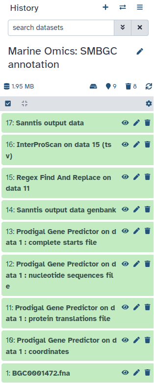
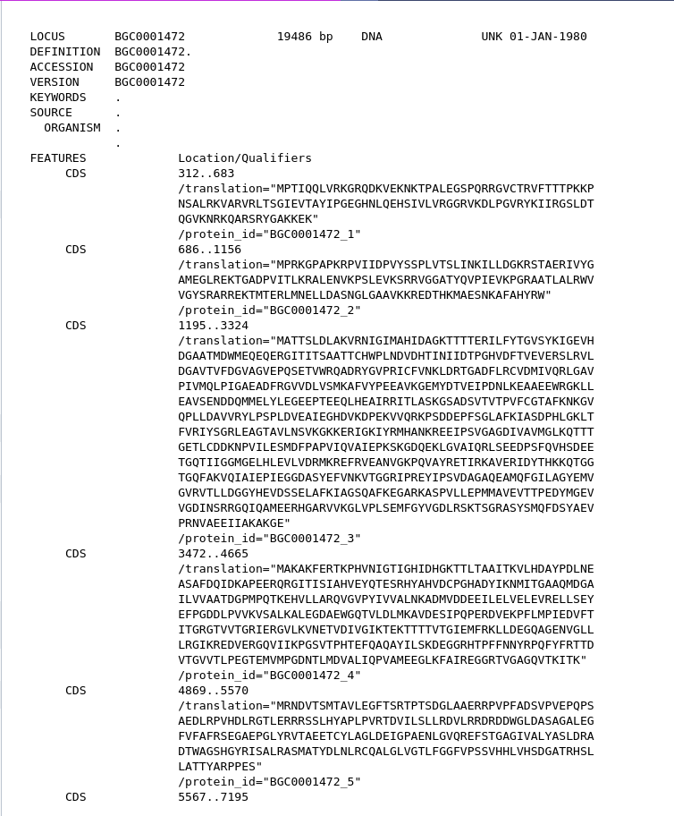
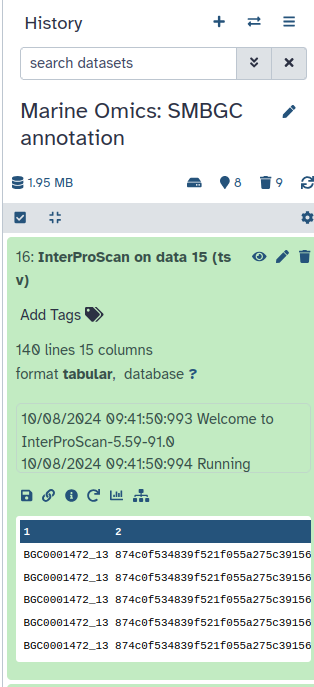

# Introduction
Through this tutorial, you will learn in the first part how to produce a protein fasta file from a nucleotide fasta file using Prodigal (Fast, reliable protein-coding gene prediction for prokaryotic genomes).

Then, you'll be using InterProscan to create a tabular. Interproscan is a batch tool to query the InterPro database. It provides annotations based on multiple searches of profile and other functional databases.

And finally, you will discover Sanntis both to build genbank and especially to conduct annotation using Neural Networks Trained on Interpro Signatures.

> <agenda-title></agenda-title>
>
> In this tutorial, we will cover:
>
> 1. TOC
> {:toc}
>
{: .agenda}

# Get data

> <hands-on-title> Data Upload </hands-on-title>
>
> 1. Create a new history for this tutorial and give it a name (for example “Marine Omics: SMBGC annotation”) for you to find it again later if needed.
>
>    
>
> 2. Import the files
>
>    
>
>
> 3. Rename the datasets
>
>
>
{: .hands_on}


       

# Import and launch the workflow
> <hands-on-title>Import the workflow</hands-on-title>
>   - Click on Workflow on the top menu bar of Galaxy. You will see a list of all your workflows.
>   - Option 1: use the URL
>   	- Click on  Import at the top-right of the screen
>   	- Paste the URL of the workflow into the box labelled “Archived Workflow URL” `https://earth-system.usegalaxy.eu/u/marie.josse/w/marine-omics-identifying-biosynthetic-gene-clusters`
>   - Option 2: use the workflow name
>   	- Click on **Public workflows** at the top-right of the screen
>       - Search for **Marine Omics identifying biosynthetic gene clusters** 
>       - In the workflow preview box click on  Import
>   - Click the Import workflow button
{: .hands_on}

> <hands-on-title>Run the workflow</hands-on-title>
>    - Click on Workflow on the top menu bar of Galaxy. You will see a list of all your workflows.
>    - Click on the  (Run workflow) button next to your workflow
>    - /!\ Select **Yes** for **Workflow semi automatic** 
>    - Configure the workflow as needed with the 2 datasets you uploaded right before (**BGC0001472.fna**)
>    - Click the Run Workflow button at the top-right of the screen
>    - You may have to refresh your history to see the queued jobs
{: .hands_on}

Now you don't have to do anything else. You should see all the different steps of the worklow appear in your history.
When the workflow is fully runned you should have the folowing history.

> <tip-title>Extract a RO-Crate</tip-title>
> Workflows are a powerful Galaxy feature that allows you to scale up your analysis by performing an end-to-end analysis with a single click of a button. In order to keep provenance of the workflow invocation (an invocation of a workflow means one run or execution of the workflow) it can be exported from Galaxy in the form of a Workflow Run Crate RO-Crate profile.
> 
>
> After the workflow has completed, we can export the RO-Crate. The crate does not appear in your history, but can be accessed from the User -> Workflow Invocations menu on the top bar.
> 
> > <hands-on-title> Extract a RO-Crate </hands-on-title>
> >
> > 1. In the top right of your history, go to  -> Show Invocations
> >
> > 
> >
> > Our latest workflow run should be listed at the top.
> >
> > 2. Click on it to expand it:
> >
> > 
> > 
> > 3. Click on the Export tab in the expanded view of the workflow invocation.
> > 	You should see a page that contains three download options:
> >		- Research Object Crate (RO-Crate) 
> >		- BioCompute Object
> >		- File
> > 4. Click on the **Generate**  option of the RO-Crate box (1st box)
> > 
> > 
> {: .hands-on}
> 
> 
> Great work! You have created a Workflow Run Crate. This makes it easy to track the provenance of the executed workflow.
{: .tip}

# Prodigal Gene Predictor: generate a protein fasta file

## Prodigal Gene Predictor

> <hands-on-title> Run prodigal </hands-on-title>
>
> 1.  with the following parameters:
>    -  *"Specify input file"*: `BGC0001472.fna` (Input the nucleotide fasta file)
>    - *"Specify mode"*: `Meta : Anonymous sequences, analyze using preset training files, ideal for metagenomic data or single short sequences`
>
>    You don't need to change any other parameters leave them on the default input.
>
> 2. Click on **Run Tool**
>
{: .hands_on}

You should have 4 new outputs appearing in your history. In these outputs you should have **Prodigal Gene Predictor on data 1 : protein translations file**.
You can click on it and then click on the  (eye).

You can notice here that at each end of the sequence there's a *. Later on we will need to remove this star. But, first we are going to use this protein file to build the Genbank that Sanntis need to make a SMBGC annotation. 

## Sanntis for building a Genbank file

> <hands-on-title> Build Genbank </hands-on-title>
>
> 1.  with the following parameters:
>    - *"Do you want to build a genbank or to make a SMBGC Annotation?"*: `Build genbank`
>        -  *"Input a nucleotide fasta file"*: `BGC0001472.fna` (Input the nucleotide fasta file)
>        -  *"Input a protein fasta file"*: `Prodigal Gene Predictor on data 1 : protein translations file` (output of **Prodigal Gene Predictor** )
> 2. Click on **Run Tool**
>
{: .hands_on}

## Regex Find And Replace
Remember earlier we noticed the star * in the protein fasta file ? 

Now is the time to remove it ! This is to simplify the next step with InterProScan.

> <hands-on-title> Remove * </hands-on-title>
>
> 1.  with the following parameters:
>    -  *"Select lines from"*: `Prodigal Gene Predictor on data 1 : protein translations file` (output of **Prodigal Gene Predictor** )
>    - In *"Check"*:
>        -  *"Insert Check"*
>            - *"Find Regex"*: `\*$`
>            - *"Replacement"*: `` (leave an empty box there)
>
> 2. Click on **Run Tool**
>
{: .hands_on}

Check if the * were well removed. 

# InterProScan

> <hands-on-title> Task description </hands-on-title>
>
> 1.  with the following parameters:
>    -  *"Protein FASTA File"*: `Regex Find And Replace on data **` (output of **Regex Find And Replace** )
>    - *"Use applications with restricted license, only for non-commercial use?"*: `No`
> You can leave all the other parameters on the default input.
>
> 2. Click on **Run Tool**
{: .hands_on}

# Sanntis for annotating biosynthetic gene clusters

> <hands-on-title> Identify biosynthetic gene clusters </hands-on-title>
>
> 1.  with the following parameters:
>    - *"Do you want to build a genbank or to make a SMBGC Annotation?"*: `Run sanntis`
>        -  *"Input the tabular file from InterProScan"*: `InterProScan on data **` (output of **InterProScan** )
>        -  *"Input a Genbank file"*: `Sanntis output data genbank` (output of **Sanntis biosynthetic gene clusters** )
>
> 2. Click on **Run Tool**
{: .hands_on}

Finally, you should have one gff3 file in your history under **Sanntis output data**

# Conclusion
Here you now know how to conduct a Marine Omics analysis

# Extra information

Coming up soon even more tutorials on and other Earth-System related trainings. Keep an  open if you are interested!
