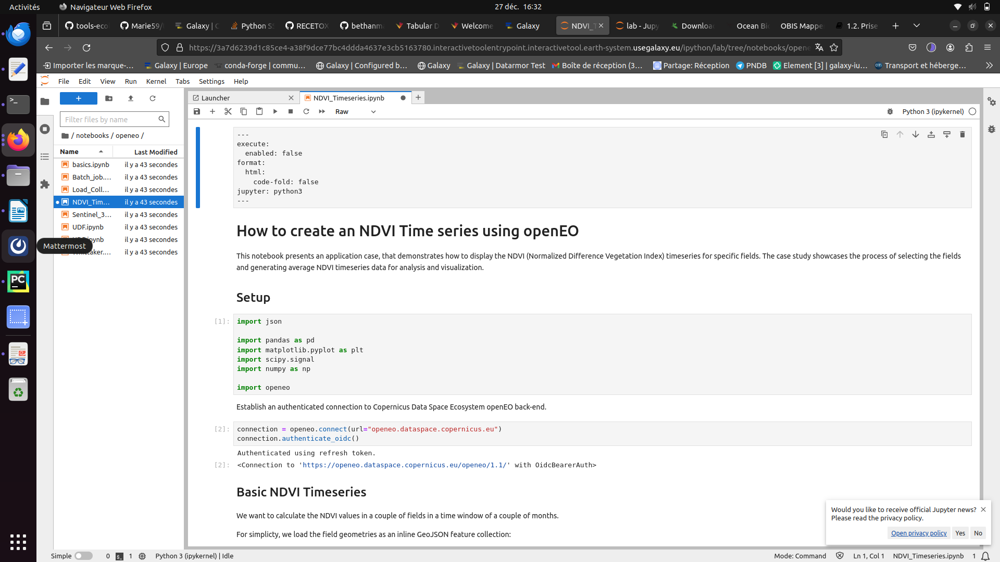
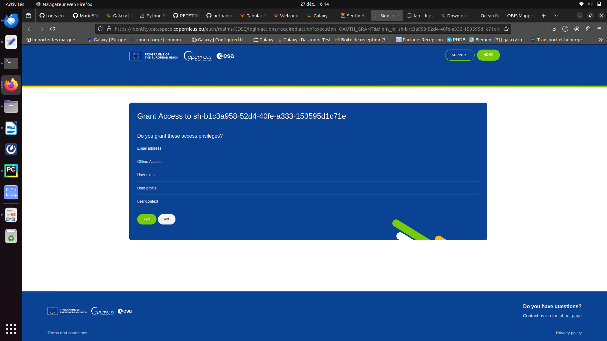
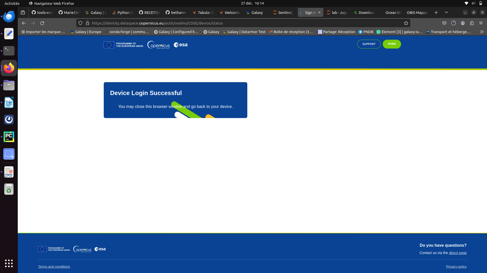
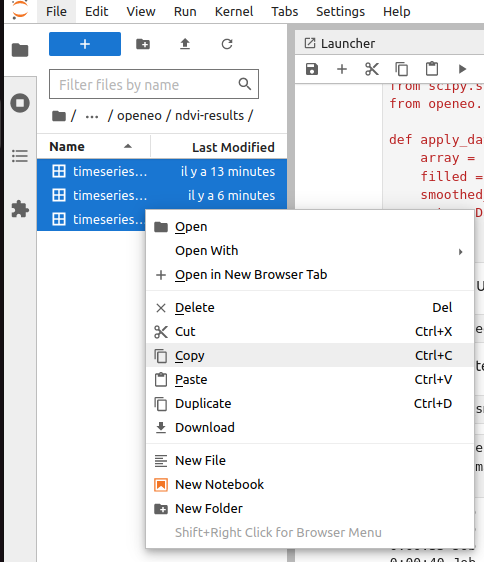
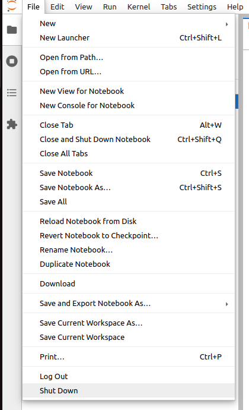

Through this tutorial you will learn here how to access and download Copernicus Data Space Ecosystem (CDSE) data through a jupyterlab Galaxy interactive tool :

This tool enables you to leverage the Copernicus Data Space Ecosystem services and access data effortlessly.
The JupyterLab service allows you to dive into data exploration, visualization, and analysis without the hassle of installing dependencies or downloading large data sets.

You will also apprehend how to use the Holoviz ecosysytem by plotting and visualising NDVI (from the CDSE) timeseries :
HoloViz provides high-level Python tools that are designed to work together to solve the entire problem of visualization, from conducting exploratory data analysis to deploying complex dashboards.

> <agenda-title></agenda-title>
>
> In this tutorial, we will cover:
>
> 1. TOC
> {:toc}
>
{: .agenda}

## Context on Galaxy
Interactive tools work differently than classical tools as it allows the user to interact with a dedicated graphical interface. This kind of tools is used to give access to Jupyter notebooks, RStudio or R Shiny apps for example. 

> <details-title>Short introduction on how Galaxy works</details-title>
>
> You can come back to where you left off the tutorial anytime by clicking .
>
> > <hands-on-title>Log in to Galaxy</hands-on-title>
> > 1. Open your favorite browser (Chrome, Safari or Firefox as your browser, not Internet Explorer!)
> > 2. Browse to your [Galaxy instance](https://earth-system.usegalaxy.eu/)
> > 3. On the top pannel go to **Login or Register**
> >
> >
> {: .hands_on}
>
> The Galaxy homepage is divided into three panels:
> * Tools on the left
> * Viewing panel in the middle
> * History of analysis and files on the right
>
> 
>
> The first time you use Galaxy, there will be no files in your history panel.
{: .details}

# Copernicus Data Space Ecosystem

> <hands-on-title> Launch the interactive tool </hands-on-title>
>
> 1.  with the following parameters:
>    - *"Do you already have a notebook?"*: `Start with a fresh notebook`
>    - *"Include data into the environment - optional "*: You don't need anything
> 2. Click on **Run Tool**
>
> 3. 
{: .hands_on}

> <hands-on-title> Navigate the jupyterlab </hands-on-title>
> 1. Once you are in the jupyterlab go to :
>    - **notebooks**
>    - Then, **openeo** 
>    - Open the notebook **NDVI_Timeseries.ipynb**
> 2. You can start running your notebook. To do so you can go on the pannel displaying button right above the notebook and click on the . 
>    Everytime you press this button you can excecute a one by one the cells. 
> 3. In the **Setup** section when you execute the connection cell you'll have some actions to conduct.
> 4. First click ont the link appearing, you're notebook should look like the following :
> 
> 5. Once you clicked a new window opens. If you don't have a copernicus account please create one and follow the instructions given. 
> 6. If you have an account sign in and then press the green **YES**
> 
> 7. You'll be redirected to a page letting you know the connection was a success
> 
> 8. Now, you can go back on your jupyterlab and execute the rest of the notebook.
> 9. Once you executed the entire notebook you should have a new folder in the left pannel named **ndvi-results** go in it.
> 10. Select the 3 files there and click right, and then copy
> 
> 11. Then go back to the root of your path and go in the **ouputs** folder. There you can click right and paste the 3 NDVI files. 
> 
> 12. This part is now finished you just have to correctly close this notebook. On the top left click on **files** and then on **Shut down**.
> 
{: .hands_on}

Go back on your Galaxy window. After a couple minutes you should see your outputs turning green in your history.

Check that your data are in csv format. 

> <tip-title> Check datatype </tip-title>
>
> , it should be `csv`
>
> 
{: .tip}


# Holoviz

> <hands-on-title> Launch Holoviz </hands-on-title>
>
> 1.  with the following parameters:
>    - *"Do you already have a notebook?"*: `Start with a fresh notebook`
>    - *"Include data into the environment - optional "*: Select `timeseries-basic`, `timeseries-masked` and `timeseries-smoothed`
> 2. Click on **Run Tool**
>
> 3. 
> 
> 4. Once, you are in the jupyterlab go in the the **notebooks** folder
> 5. Open a terminal in bash and write the following
> > <code-in-title>Download the notebook</code-in-title>
> > ```bash
> > wget https://raw.githubusercontent.com/fair-ease/Holoviz/main/Tabular_Datasets_NDVI.ipynb
> > ```
> {: .code-in}
> Now that you have your notebook you can just follow the instructions.
{: .hands_on}

Enjoy discovering the rest of the notebook. 

# Conclusion
The tutorial ends there and with that you have the basis on how to use jupyterlab tools and more particularly the copernicus and holoviz ones.
