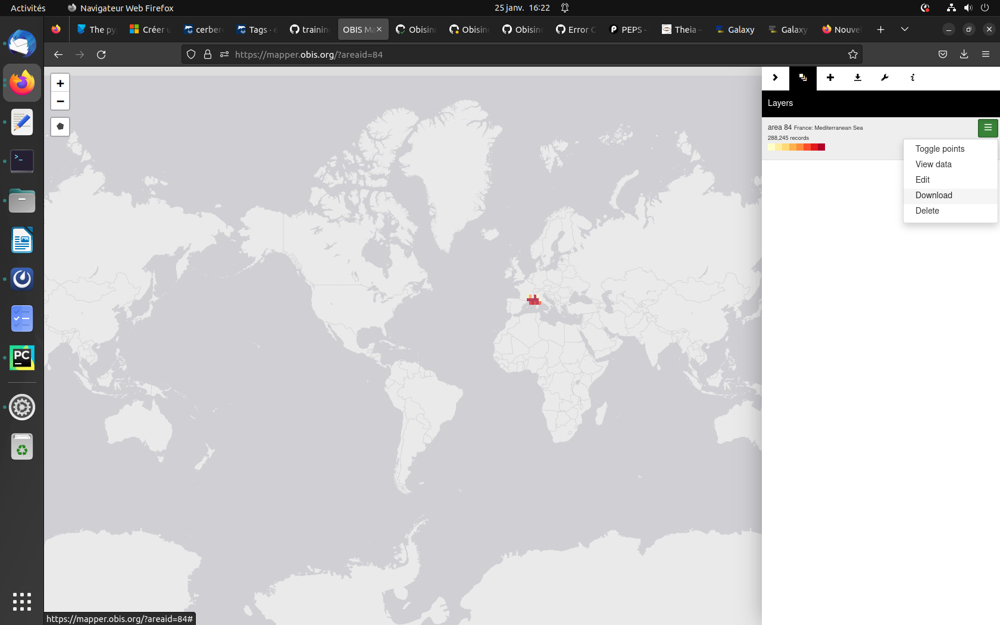
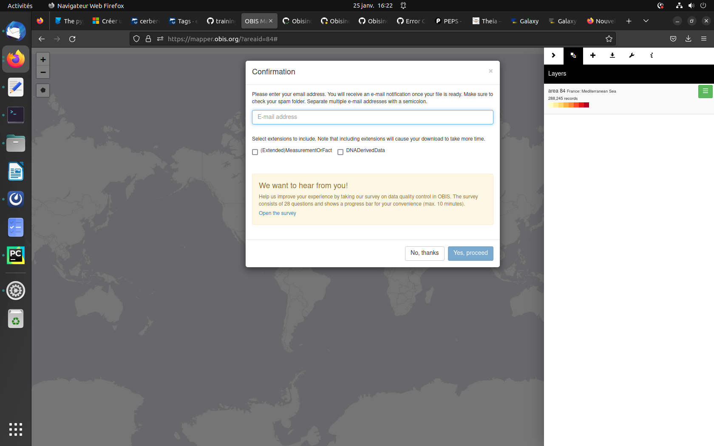

OBIS is a global open-access data and information clearing-house on marine biodiversity for science, conservation and sustainable development. In order to visualize their marine data OBIS created the package obisindicators.

Obisindicators is an R library developed during the 2022 IOOS Code Sprint. The purpose was to create an ES50 diversity index within hexagonal grids following the diversity indicators notebook by Pieter Provoost linked above. The package includes several examples, limited to 1M occurrences, that demonstrate uses of the package.
This tutorial will guide you on getting obis marine data and processing them in order to calculate and visualize multiple indicators. 

This tool for obisindicators is composed of 5 indicators : Number of record, Shannon, Simpson, Es50 and Hill which will be explained in more details later on.

In this tutorial, highly based on [OBIS indicators documentation](https://obis.org/indicators/documentation/) we'll be working on OBIS data extracted from [OBIS mapper](https://mapper.obis.org/). First those data will be prepared. 

> <agenda-title></agenda-title>
>
> In this tutorial, we will cover:
>
> 1. TOC
> {:toc}
>
{: .agenda}

## Upload of the data

This first step consist of downloading and uploading obis data onto galaxy.

> <hands-on-title>Data upload</hands-on-title>
>
> 1. Create a new history for this tutorial and give it a name (example: “Obisindicators tutorial”) for you to find it again later if needed.
>
>    
>
>
> 2. Download the files from [Obis](https://mapper.obis.org/) 
>
>    
>
>     > <details-title>Download data from the obis portal</details-title>
>     > * Go on the right panel and enter the criteria of your choise here in "Area" write down **Mediterranean** and select "France: Mediterranean Sea".
>     > * Click on save on the top right
>     > 
>     > * Then on the 3 green lines top right press download
>     > * Enter your email on the pop-up screen and press **Yes, procced**
>     > 
>     > * The download can take a while depending on the size of your dataset (here less than 15min) 
>     > * Then click on **Download ZIP file**
>     > * Don't forget to unzip your file on your machine.
>     {: .details}
>
> In the downloaded folder you should have your data either csv format (Occurence.csv) and you must have at least 4 columns containing: latitude, longitude, species and record.
>
> 3. Upload obis data
>
>     > <tip-title>Importing data from your computer</tip-title>
>     >
>     > * Open the Galaxy Upload Manager 
>     > * Select **Choose local files**
>     > * Browse in your computer and get the downloaded zip folder
>     >
>     > * Press **Start** (it can take a few seconds to get ready)
>     {: .tip}
>
> 4. Rename the datasets “obis data" for example and preview your dataset
>
> 5. Check the datatype must be csv or tabular
>
>    
>
>
{: .hands_on}

## Convert data **csv-to-tabular**

> <hands-on-title>Convert your data</hands-on-title>
>
> 1. On your data in your history pannel click on 
> 2. In the top click on  Convert
> 3. Press  Create Dataset
>
>    
{: .hands_on}

## Clean data **Advanced Cut**

> <hands-on-title>Clean your data</hands-on-title>
>
> 1.  with the following parameters:
>    - *"Cut by"*: `fields`
>        - *"List of Fields"*: `c['1', '3', '4', '9', '95']`
>
{: .hands_on}

You are now all set to use your obis data in order to do a diversity analysis. 

## **Ocean biodiversity indicators**

> <hands-on-title>Ocean biodiversity indicators</hands-on-title>
>
> 1.  with the following parameters:
>    - *"What character is the separator in your data? (Mostlikely a comma for a csv file and t for a tabular)"*: `Tabulator (\t)`
>    - *"Select column containing the decimal value of the longitude "*: `c2`
>    - *"Select column containing the decimal value of the latitude "*: `c3`
>    - *"Select column containing the species "*: `c4`
>    - *"Select column containing the number of records"*: `c5`
>    - *"Type of projection for the map : select your coordinate reference system (CRS)"*: Robinson Projection
>    - *"Choose a resolution for the discrete global grid"*: 9
>
> Note that you can rerun the tool and modify the resolution of the maps you want to create.
>
> 2. Click on **Execute** 
> 3. You will see 5 outputs appear on the history pannel. one for each of the indicators
>
{: .hands_on}

## Number of records

In the table index the records correspond to n.

## Shannon

The Shannon index expresses the uncertainty associated with the prediction of the species the next sampled individual belongs to. It assumes that individuals are randomly sampled from an infinitely large community, and that all species are represented in the sample.

Warning: OBIS uses records as a proxy for individuals and sampling is generally not random, the community is not infinitely large and not all species are represented in the sample.

The Shannon diversity index, also known as the Shannon-Wiener diversity index, is defined in OBIS as the sum over all species of $-fi*log(fi)$ with fi defined as $n/ni$ with n as the total number of records in the raster cell and ni as the total number of records for the ith-species in the raster cell.

## Simpson
The measure equals the probability that two entities taken at random from the dataset of interest represent the same type. It equals:

where is richness (the total number of types in the dataset) and is the proportional abundances of the types of interest.

Simpson’s index expresses the probability that any two individuals drawn at random from an infinitely large community belong to the same species. Note that small values are obtained in cells of high diversity and large values in cells of low diversity. This counterintuitive behavior is adressed with the Hill 2 number, which is the inverse of the Simpson index.

The Simpson biodiversity index is defined in OBIS as the sum over all species of $(ni/n)^2$ with n as the total number of records in the cell and ni the total number of records for the ith species.

Warning: The Simpson index has the same assumptions as the Shannon index.

## ES50

The expected number of marine species in a random sample of 50 individuals (records) is an indicator on marine biodiversity richness.

The ES50 is defined in OBIS as the $sum(esi)$ over all species of the following per species calculation:

    when $n$ - ni$ $\ge$ $50$ (with n as the total number of records in the cell and ni the total number of records for the ith-species)
        $$ esi = 1 - exp(lngamma(n-ni+1) + lngamma(n-50+1) - lngamma(n-ni-50+1) - lngamma(n+1)) $$
    when $n$ $\ge$ $50$
        $$ esi = 1 $$
    else
        $$ esi = NULL $$

Warning: ES50 assumes that individuals are randomly distributed, the sample size is sufficiently large, the samples are taxonomically similar, and that all of the samples have been taken in the same manner.

## Maxp

Maxp is the maximum of the total number of records for the ith-species ni divided by the total number of records in the cell n, ie, $$ Maxp = max(ni / n) $$.

## Hill

### **Hill 1**

The Hill biodiversity index accounts for species’ relative abundance (number of records in OBIS) and Hill1 can be roughly interpreted as the number of species with “typical” abundances, and is a commonly used indicator for marine biodiversity richness. It is defined as:

Warning: The Simpson index has the same assumptions as the Shannon index.

### **Hill 2**

The Hill biodiversity index accounts for species’ relative abundance (number of records in OBIS) and discounts rare species, so Hill2 can be interpreted as the equivalent to the number of more dominant species and so is less sensitive to sample size than Hill1. The Hill index is a commonly used indicator for marine biodiversity richness. It is defined as:

Warning: The Simpson index has the same assumptions as the Shannon index.

They are calculated as shown below:
     - $$ hill_1   = exp(shannon) $$
     - $$ hill_2   = 1 / simpson $$
     - $$ hill_inf = 1 / maxp $$

## Index file

You also have a tabular file that sums up each indicators.

Nb: the column sp is the count of the number of observations in a dataset. It is  the number of records in the dataset.

# Conclusion

You here learn how to select and download OBIS dataset for your region of interest, to handle data to finally compute diversity indicators and display it in maps.

