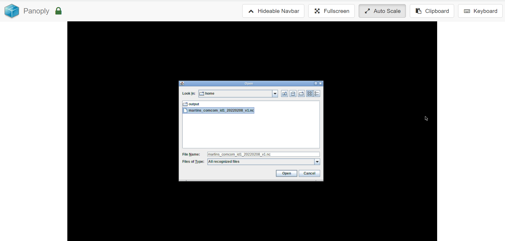
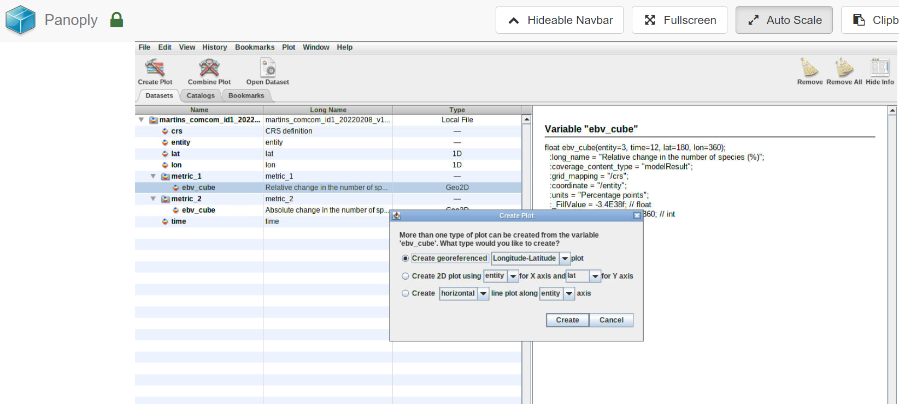
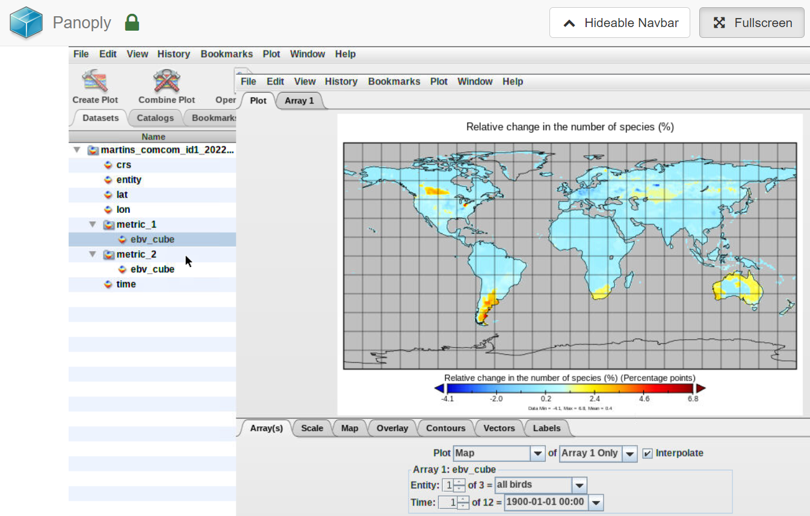
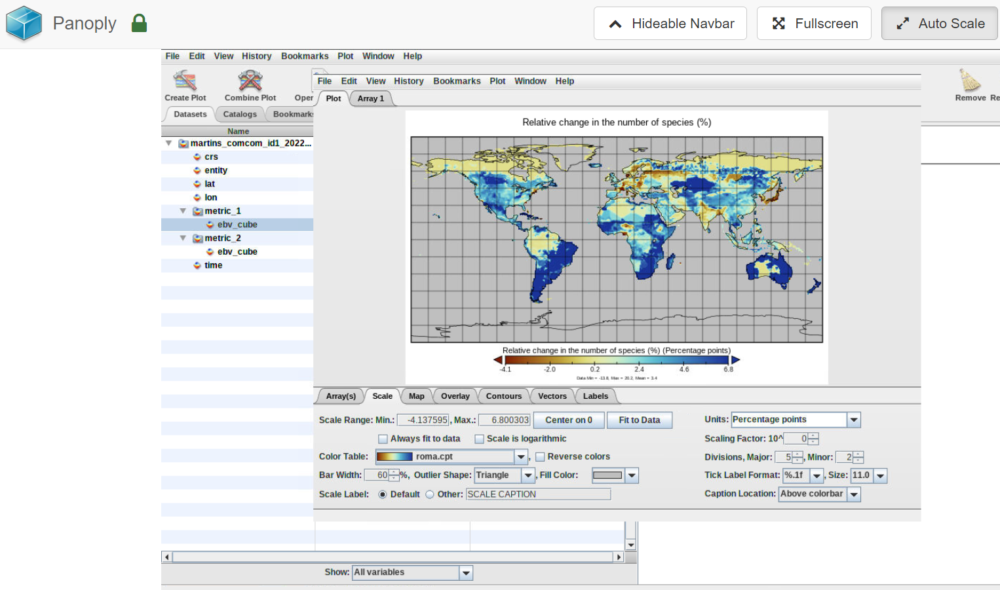
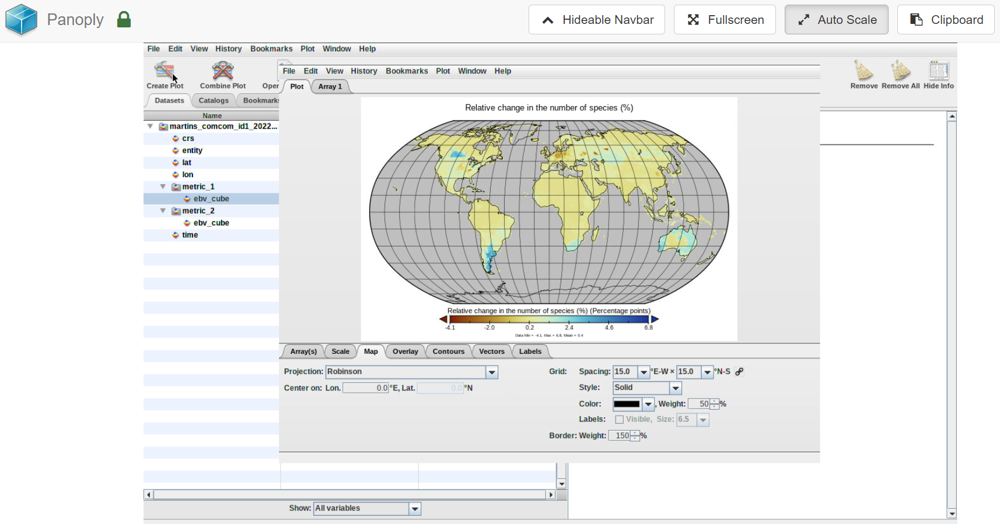
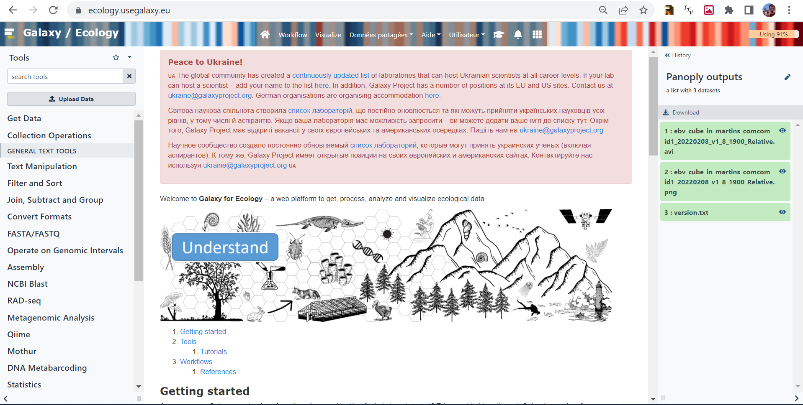

# Introduction


> <comment-title></comment-title>
>
> This tutorial is significantly based on [the Panoply documentation](https://www.giss.nasa.gov/tools/panoply/help/) and the [Galaxy climate dedicated tutorial]().
>
{: .comment}

The practical aims at familiarzing you with the [Panoply](https://www.giss.nasa.gov/tools/panoply/) Galaxy interactive tool. Panoply is among the most popular tool to visualize geo-referenced data stored in [Network Common Data Form](https://en.wikipedia.org/wiki/NetCDF) (netCDF). It provides a graphical interface for inspecting (show metadata) and visualizing netCDF data. It supports many features to customize your plots and we will introduce some of them in this lesson.

In this tutorial, you will learn to:
- Plot EBV cube arrays.
- Use any of numerous color tables for the scale colorbar
- Save plots to GIF, JPEG, PNG or TIFF bitmap images or as PDF or PostScript graphics files.
- Export animations as MOV or AVI videos


> <agenda-title></agenda-title>
>
> In this tutorial, we will cover:
>
> 1. TOC
> {:toc}
>
{: .agenda}

> <comment-title>Background</comment-title>
>
> In this tutorial, we will be focusing on the usage of Biodiversity data in [Network Common data Form](https://en.wikipedia.org/wiki/NetCDF) (netCDF) because it is the data format used to store data on the EBV data portal.
> We will be using a freely available dataset representing Essential Biodiversity Variables from [GEO BON data portal](https://portal.geobon.org/home). We will learn to use panoply to visualize the Local bird diversity for last century.
{:  .comment}

## NetCDF format

[NetCDF](https://en.wikipedia.org/wiki/NetCDF) data format is a binary format and to be able to read or visualize it, we would need to use dedicated software or libraries that can handle this "special" format. It is self-describing and machine-independent data format that supports the creation, access, and sharing of array-oriented scientific data. NetCDF files usually have the extension *.nc* or *.netcdf*.

For climate and forecast data stored in NetCDF format there are (non-mandatory) conventions on metadata ([CF Convention](http://cfconventions.org/)).

In this tutorial, we will be using data from the [GEO BON EBV data portal](https://portal.geobon.org/).

## Get data

> <hands-on-title>Data upload</hands-on-title>
>
> 1. Create a new history for this tutorial. If you are not inspired, you can name it *Panoply* for example...
>
>    
>
> 2. Import the file from [EBV data portal](https://portal.geobon.org/data/upload/1/public/martins_comcom_id1_20220208_v1.nc)
>
>    ```
>    https://portal.geobon.org/data/upload/1/public/martins_comcom_id1_20220208_v1.nc
>    ```
>
>    
>
>    
>
> 3. Check that the datatype is **netcdf**
>
>    Files you uploaded are in netcdf format. In Galaxy, Datatypes are, by default, automatically guessed. Here, as netcdf is a derivative of the h5 format, Galaxy automatically affect the h5 datatype to netcdf files. To cope with that, one can change the datatype manually, once datasets uploaded (as shown below) OR you can directly specify datatype on the upload tool form so Galaxy will not try to automatically guess it.
>
>    
>
> 4. **Rename Datasets** 
>
>    As the original name `martins_comcom_id1_20220208_v1.nc` can be not so good to use, don't hesitate to modify it in `Local bird diversity (cSAR/BES-SIM) martins dataset` for example.
>
>    
>
> 5. **Add a tag**  to the dataset corresponding to `#EBV`
>
>    
>
{: .hands_on}

# Panoply

## Opening up Panoply

> <hands-on-title>Launch Panoply</hands-on-title>
>
>  Panoply is available as a Galaxy interactive tool and may not be available on all Galaxy servers.
>
> > <tip-title>Launch Panoply in Galaxy</tip-title>
> > Currently Panoply in Galaxy is available on useGalaxy.eu instance, on the "Interactive tools" tool panel section.
> >
> > 1. Open the  by clicking [on the Panoply interactive tool shortcut](https://usegalaxy.eu/?tool_id=interactive_tool_panoply)
> > 2. Check **martins_comcom_id1_20220208_v1.nc** dataset selected in the netcdf input field
> > 3. Click Execute
> > 4. The tool will start running and will stay running permanently
> > 5. Click on the "User" menu at the top and go to "Active Interactive Tools" and locate the Panoply instance you started.
> > 6. Click on your Panoply instance
> >    
> > 7. Click on **martins_comcom_id1_20220208_v1.nc** dataset and **open**.
> {: .tip}
{: .hands_on}

## Inspect metadata

> <hands-on-title>Inspect dataset</hands-on-title>
>
> 1. Inspect dataset content
>
>    Here you can look at the dataset (martins_comcom_id1_20220208_v1.nc) and related variables (`crs`, `entity`, `lat`, `lon`, `metric_1`, `ebv_cube`, `time`)
>
>    > <question-title></question-title>
>    >
>    > what is the unit of the `ebv_cube` variable of `metric_1`and its shape?
>    >
>    > > <solution-title></solution-title>
>    > >
>    > > The unit of **ebv_cube** is "Percentage points". **ebv_cube** is a 4D array (entity, time, latitude, longitude).
>    > {: .solution}
>    {: .question}
>
>
> 2. Take a look at the general properties of the dataset
>
>    > <question-title></question-title>
>    >
>    > Can you find the title, summary, EBV class and EBV name informations?
>    >
>    > > <solution-title></solution-title>
>    > >
>    > > Double click on "martins_comcom_id1_2022..." element of the "Name" column to display these general information
>    > > Title: Local bird diversity (cSAR/BES-SIM).
>    > > Summary: Changes in bird diversity at 1-degree resolution caused by land use, estimated by the cSAR model for 1900-2015 using LUH2.0 historical reconstruction of land-use.
>    > > EBV Class: Community composition.
>    > > EBV name: Taxonomic and phylogenetic diversity.
>    > {: .solution}
>    {: .question}
>
>
>    > <question-title></question-title>
>    >
>    > Can you find the biodviersity metrics names?
>    >
>    > > <solution-title></solution-title>
>    > >
>    > > metric_1: Relative change in the number of species (%)
>    > > metric_2: Absolute change in the number of species
>    > {: .solution}
>    {: .question}
{: .hands_on}

## Create Geo-referenced Longitude-Latitude plot

> <hands-on-title>geographical map</hands-on-title>
>
> 1. Double click on the variable **ebv_cube** from `metric_1` and click on **Create**
>    
>
>    > <question-title></question-title>
>    >
>    > 1. What does it shows?
>    > 2. What is the date of the generated plot?
>    > 3. Can you plot other dates?
>    >
>    > > <solution-title></solution-title>
>    > >
>    > > 1. The plot represent the relative change in the number of species (%).
>    > >    
>    > >
>    > > 2. The date of the default plot is 1st January 1900 at 00:00.
>    > >
>    > > 3. To plot another date, change either:
>    > > - Initial time of forecast (give a value between 1 and 12, corresponding to years between 1900 and 2010.
>    > > - Click on the date and scroll down to select the date of your choice.
>    > {: .solution}
>    {: .question}
>
> 2. Save your plot
>    - Click on the tab **File** (from your plot window) to store your plot by selecting **Save Image As**
>    - Double click on the folder *outputs* to enter this folder and save your plot.
>    You need to make sure to save all your plot in the *outputs* folder otherwise you can loose all your plots once to close panoply.
>
> 3. Change colormap
>    **Always make sure you use color blind friendly palettes.**
>    - To change the default colormap, click on tab "**Scale**" (bottom of your plot window) and select another "**Color Table**" (you can scroll down to go through all the different available colormap).
>    - Save your plot using **Save Image As** and make sure to choose another name to avoid overwritting your preceding plot.
>    
{: .hands_on}


## Changing map projection

> <hands-on-title>Change projection</hands-on-title>
>
> From your previous plot window, click on Tab **Map** and change **Projection**. Try a few of them and save each of your plot with **File** --> **Save Image As**.
>
>    
>
{: .hands_on}

## Export Animation

> <hands-on-title>Export animation</hands-on-title>
>
> 1. From your previous plot window, click on **File** and select **Export Animation**. Save your plot using either **MOV** or **AVI** format.
>  It goes through each plot e.g. for each month and create an animation where you can see the evolution of sea-ice extent from January 1979 to December 1979.
> You will be able to download the resulting movie from Galaxy once you quit Panoply.
{: .hands_on}


## Quit Panoply


> <hands-on-title>Quit Panoply to keep your plots</hands-on-title>
>
> 1. To make sure all your plots stored in **outputs** folder get exported to Galaxy, you need to quit panoply:
>  **File** --> **Quit Panoply**.
> 2. Go back to your current Galaxy history and you should find **Panoply outputs**
>  
>
{: .hands_on}

# Conclusion


We have now learnt how to visualize EBV cube data using Panoply. We only use one of the two datasets so we strongly encourage you to do the same exercises with others datasets from EBV data portal.


