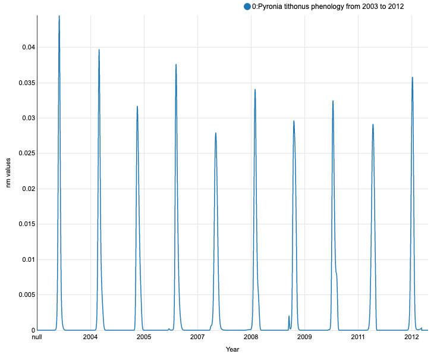
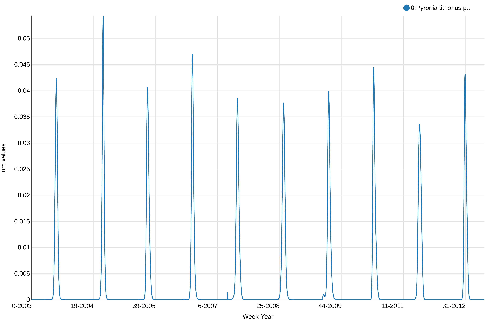
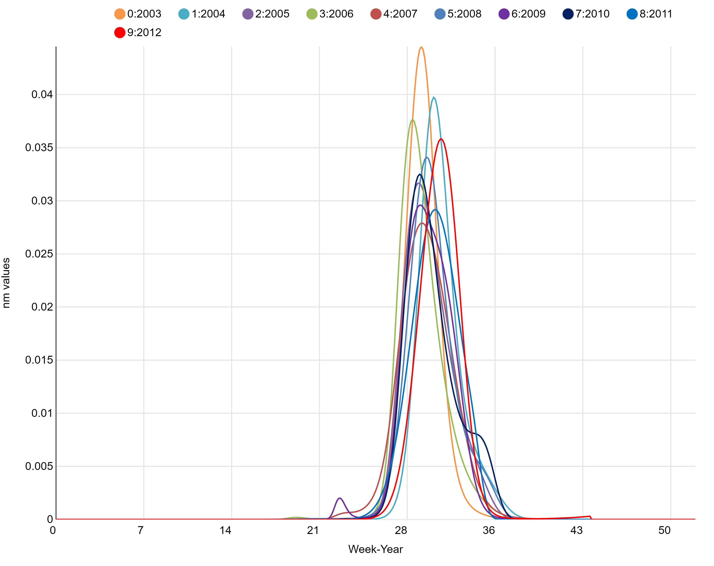
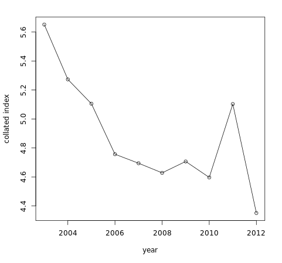
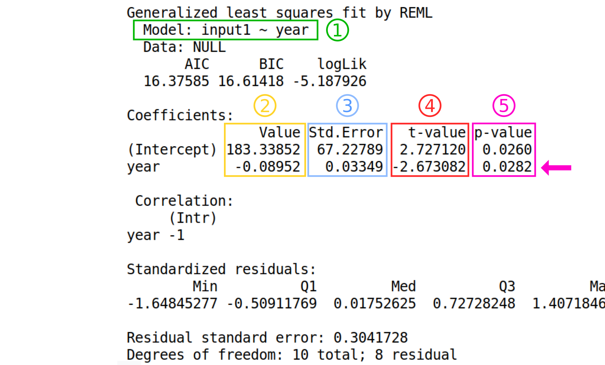
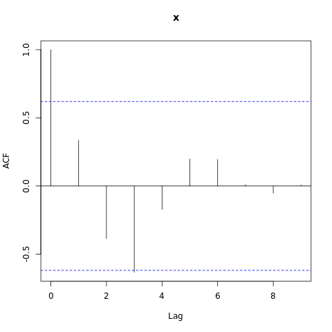
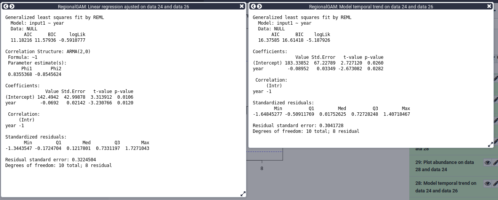
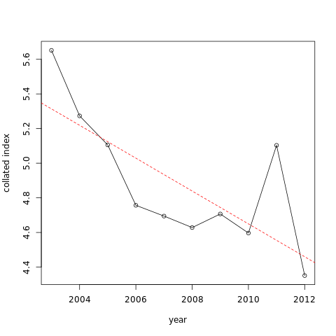

# Introduction


This tutorial will show you how to study species abundance through the computation of a flight curve, abundance index, and trends. It will explain you how to use different [regionalGAM](https://github.com/RetoSchmucki/regionalGAM) tools on Galaxy allowing you to deal with datasets containing abundance information for various species per site and per date through a couple of years.

After a certain number of steps, you will be able to extract single species data and study related abundance through the years. The goal of this exercise is to be able to create abundance trend over time and biodiversity indicators. Following these indicators allow to follow trends in terms of population dynamics. You could for example try to predict the occurrences of one specific species in a certain type of environment using the prediction model of climate evolution. Based on charts that you will generate, you could try to explain the evolution of a species with environmental data (temperatures variations, modifications of the environmental conditions).

You will basically learn how to create a file on the basis of which you can create a visual material that can be quite easily understood and therefore be efficient for a large audience.

> <agenda-title></agenda-title>
>
> In this tutorial, we will deal with:
>
> 1. TOC
> {:toc}
>
{: .agenda}

# Step 1: Pre-processing

The goal of the first step is to upload and prepare the file so that it will be usable for the *regional GAM* analysis.

## Data upload

> <hands-on-title>Data upload</hands-on-title>
>
> 1. Create a new history for this tutorial and give it a proper name like `regionalGAM tutorial`
>
>    
>
>    
>
> 2. Import the CSV dataset file with only one species from [Zenodo](https://zenodo.org/record/1324204#.W2BmRn7fNE4) or from the data library (ask your instructor)
>
>    ```
>    https://zenodo.org/record/1324204/files/regional%20GAM%20data.csv
>    ```
>
>    
>
>    
>
> 2. Check that the file contains a header corresponding to: ```"SPECIES","SITE","YEAR","MONTH","DAY","COUNT"```, and that all the non numeric content are between double quotes as "x" and that separators are ","
>
{: .hands_on}

This dataset gathers years of records of the presence of butterfly species per site and per day. Columns indicates species names ("SPECIES"), observation site ("SITE"), date of the observation ("YEAR","MONTH","DAY") and number of individuals ("COUNT"). It compiles counts for the Gatekeeper (Pironia tithonus) collected between 2003 and 2012 and extracted from five European BMSs (United Kingdom, Netherlands, France, Germany, and Catalonia-Spain). The Gatekeeper has one generation per year and feeds mainly on Poaceae. It is found in the Central and Southern Europe, North Africa Anatolia, and Caucasus.

 Charles J Sharp")


## Prepare the data

The current dataset contains a lot of data (exact site names for 5 butterfly monitoring scheme). Processing the file in this condition would require time and for the purpose of this tutorial, we will reduce the number of sites. The column with header `SITE` of the dataset you are using is really long and the `SITES` are classified into sub-sites (like `ESBMS.12`, `ESBMS.28`, `ESBMS.55`, etc).

Here, we will only keep the sites that are in the Netherlands (NLBMS.XX). We want to create a down-sampled file, by selecting the lines where NLBMS is found.

> <hands-on-title>Downsample and hide some information</hands-on-title>
> 1. **Text reformatting with awk**  with the following parameters:
>       -  *"Select cells from"*: Uploaded CSV dataset file 
>       - *"AWK Program"*:
>
>
>              NR == 1 { print }
>              /NLBMS/ { print }
>
>
> The first line will skip and print the header and the second will print all the lines where NLBMS is found
> Warning: depending on the Galaxy instance your are using, this tool can not appear on the tool panel. Another solution can be to use **Select lines that match an expression**  to select lines matching 'NLBMS' pattern in addition to **Select first lines from a dataset**  specifying keeping the first line, so the header, then **Concatenate datasets tail-to-head**  to recreate a CSV file from concatenating the header and NLBMS lines of the original csv file.
>
{: .hands_on}

> <question-title></question-title>
>
> How many sites do you have before and after removing the sites from outside the Netherlands?
>
>
> You may need to use a tool like **Count occurrences of each record** . If you want to run the same tool with same parameters to several input files, you can directly specify the  **Multiple datasets** option on the tool form for the *"from dataset"* parameter).
>
> 
>
> > <solution-title></solution-title>
> > The dataset contains 280 sites now against 1143 before down-sampling.
> {: .solution}
{: .question}

> <details-title>If your original data is in RData format</details-title>
>
> > <hands-on-title>Data upload.</hands-on-title>
> > 1. Import the RData
> >
> >    For example, you can upload:
> >
> >    ```
> >    https://zenodo.org/record/1324204/files/gatekeeper_CM%20.RData
> >    ```
> >
> > 2. **RData binary file reader**  with the following parameters:
> >    -   *"Rdata binary file to explore"*: imported RData
> >
> > 2. **RData parser**  with the following parameters
> >    -   *"Rdata file to explore"*: imported RData
> >    -   *"File with .Rdata content details"*: output of **RData binary file reader** 
> >    -  *"Select which attribute(s) you want to extract"*: select everything but "trend"
> >    -  *"Bind variables in a single tabular when its possible"*: `Yes`
> {: .hands_on}
>
> If the tool **RData parser**  don't succeed to create a single tabular file, it generates separate files, each of them containing one column. The file with the `TREND` header can be let aside as we don't need it for what will follow.
>
> > <question-title></question-title>
> >
> > If Rdata parser fails to generate a single unified tabular file, can you propose a way to regenerate such a dataset ?
> >
> > > <solution-title></solution-title>
> > > You can do that using:
> > > 1. **Paste two files side by side tool**  with the following parameters:
> >     -  *"paste"*: output from **RData parser**  headed with "SPECIES"
> >     - *"and"*: output from **RData parser**  with headed with "SITE"
> > > 2. Repeat **Paste two files side by side**  executions as many times as there are separated files in order to create a final dataset with all the columns:
> > >     1. Repeat **Paste two files side by side tool**  to paste the file containing 2 columns with the one headed by `YEAR`
> > >     1. Repeat **Paste two files side by side tool**  to paste the file containing 3 columns with the one headed by `MONTH`
> > >     1. Repeat **Paste two files side by side tool**  to paste the file containing 4 columns with the one headed by `DAY`
> > >     1. Repeat **Paste two files side by side tool**  to paste the file containing 5 columns with the one headed by `COUNT`
> > {: .solution}
> {: .question}
{: .details}

## Check that the dataset contains only one species

The second step of any Regional GAM data analysis is making sure to have a dataset of only one specific species that you will then be able to use. If you want to create a graph showing abundance evolution by years of several species, you will have to superimpose the graphs on one another.

As the dataset is quite big and may contain heterogeneous information, we need to know whether the data are about one species or more.

> <hands-on-title>How many species are taken into account in this dataset?</hands-on-title>
>
> 1. **Count occurrences of each record**  with the following parameters:
>    -  *"from dataset"*: output of **Text reformatting with awk**
>    - *"Count occurrences of values in column(s)"*: `Column: 1`, the `SPECIES` column
>    - *"Delimited by"*: `Tab`
>    - *"How should the results be sorted?"*: `With the most common values first`
> 2. Inspect the generated file by clicking on the  (eye) icon (**View data**)
> 3. Check that the dataset is for one species only
{: .hands_on}

> <details-title>Datasets containing information about more than one species</details-title>
>
> If your dataset contains information about more than one species, you can apply the previous steps and then run an extra-step to select one specific species and show all the data corresponding to it.
>
> As the dataset is quite big and contains heterogeneous information, you want to know whether the data are about one species or more. So the first step consists to count how many species are taken into account in this dataset.
>
>
> To test these steps, you can use the following dataset:
>
>   ```
>   https://zenodo.org/record/1324204/files/Dataset%20multispecies%20Regional%20GAM.csv
>   ```
>
> > <question-title></question-title>
> >
> > 1. How many species does your initial dataset take into account ?
> > 2. What are their names ?
> >
> > > <solution-title></solution-title>
> > >
> > > 1. The dataset contains information on 2 different species
> > > 2. Their names are "Pyronia tithonus" and "Aglais io".
> > >
> > {: .solution}
> {: .question}
>
> We now need to create a new file containing the data for only one species
>
> > <hands-on-title>Creating a new file containing only the data from one species</hands-on-title>
> > 1. Copy the name of the species you are interested in (for example: "Aglais io").
> > 2. **Filter data on any column using simple expressions** 
> >      -  *"Filter"*: output of **Text reformatting with awk** 
> >      - *"With following condition"*: `c1=='"Aglais io"'` or (another species name)
> >      - *"Number of header lines to skip"*: `1`
> >
> >    You can repeat this set of actions as much as necessary, changing only the name of the species taken into account. By doing this, you will obtain separated dataset, each of them containing a different species.
> >
> > 4. Repeat the last step on all the different `outputs` from **Filter data on any column using simple expressions**  that you have, one by species
> > 5. Tag your new dataset with an explicit tags as "Count" and "Aglais io" and/or rename this dataset like "Aglais io count file".
> {: .hands_on}
>
> If you want to create a graph showing abundance evolution by years of several species, you will have to superimpose the graphs on one another.
{: .details}

# Step 2: Analyze phenology of a species through the years

## Compute and visualize the phenology

[Phenology](https://en.wikipedia.org/wiki/Phenology), as described in Wikipedia, is the study of periodic plant and animal life cycle events and how these are influenced by seasonal and inter-annual variations in climate, as well as habitat factors (such as elevation).

Now you have a file containing all the data on the species of interest. The main goal of this step is to model one phenology per year using a general additive model (GAM) with time and sites as explanatory variables. This model will be used to predict values for missing counts at local sites in order to improve the quality of the abundance indices.

> <hands-on-title>Phenology</hands-on-title>
> 1. **Flight curve**  with the following parameters
>    -  *"Count file"*: output file you just generated with the **Text reformatting with awk** or **Filter data on any column using simple expressions** if your file was containing more than one species 
>
> 2. Generate the chart using the visualization
>    1. Inspect and expand the output data from **Flight curve** 
>    2. Click on the  (**Visualize**) icon
>    3. Select **Line chart (NVD3)** as visualization type
>    4. Give it a proper name, e.g. `Pyronia tithonus phenology raw simple vizu`
>    5. On **Select data** area, specify:
>       - *"Provide a label"*: `Pyronia tithonus phenology from 2003 to 2012` for example
>       - *"Pick a series color"*: Choose a color for the line
>       - *"Data point labels"*: `Column 1`
>       - *"Values for x-axis"*: `Column 2`
>       - *"Values for y-axis"*: `Column 6`
>    6. On **Change settings**, specify:
>       - *"X-Axis label"*: `Year`
>       - *"Y-Axis label"*: `nm values`
>    7. Click on **Save**
>
{: .hands_on}




This graph displays the modeled flight curve of *Pyronia tithonus* over the years. But the first year is "null", probably a left-over of the 1st line with the header, and the week number is not shown.

> <hands-on-title>Create a new column of the dataset containing the week and the year</hands-on-title>
> 1. **Count occurrences of each record**  with the following parameters
>    -  *"from dataset"*: output from **Flight curve**
>    - *"Select"*: `Column: 2` (the column with the year)
>    - *"Delimited by"*: `Tab`
>    - *"How should the results be sorted?"*: `By the values being counted`
> 2. Inspect and expand the output data from **Count occurrences of each record** 
>
>    > <question-title></question-title>
>    >
>    > What can you see in this file?
>    >
>    > > <solution-title></solution-title>
>    > > A list of the years and the number of occurrence for each year which should match the number of days for each year.
>    > {: .solution }
>    {: .question}
>
> 3. **Column Regex Find And Replace**  with the following parameters:
>    -  *"File to process"*: output file from **flight curve**.
>    - *"in column"*: `Column 2` (the column with the year)
>    - Click on *"Insert Check"*
>    - *"Find pattern"*: `(20[0-9][0-9])`
>    - *"Replace with"*: `-\1`
> 4. Inspect the file and check if all the years are now written with a `-` before the digits.
> 5. **Merge Columns together**  with the following parameters:
>    -  *"Select data"*: output from the last **Column Regex Find And Replace**.
>    - *"Merge column"*: `Column: 3` (the column with the week)
>    - *"with column"*: `Column: 2` (the column with the year)
> 6. **Column Regex Find And Replace**  to recreate the original content for the year column:
>    -  *"File to process"*: output file from **Merge Columns together**.
>    - *"in column"*: `Column 2` (the column with the year)
>    - *"Find pattern"*: `-(20[0-9][0-9])`
>    - *"Replace with"*: `\1`
> 7. **Remove beginning of a file**  to remove first line (to avoid header in the visualization)
>
>    > <comment-title>Dataset with information about more than one species</comment-title>
>    > If your dataset contains information about more than one species, you can apply the previous steps and then run an extra-step to select one specific species and show all the data corresponding to it.
>    {: .comment}
>
> 8. Generate the chart using the visualization with the x-axis corresponding to your column `"week""year"`.
>    1. Inspect and expand the output data from **Remove beginning of a file** 
>    2. Click on the  (**Visualize**) icon
>    3. Select **Line chart (NVD3)** as visualization type
>    4. Give it a proper name, e.g. `Pyronia tithonus phenology simple vizu`
>    5. On **Select data** area, specify:
>       - *"Provide a label"*: `Pyronia tithonus phenology from 2003 to 2012` for example
>       - *"Pick a series color"*: Choose a color for the line
>       - *"Data point labels"*: `Column 6` (the nm column) or another one
>       - *"Values for x-axis"*: `Column 7` (the "week-year" column)
>       - *"Values for y-axis"*: `Column 6` (the nm column)
>    6. On **Customize**, specify:
>       - *"X-Axis label"*: `Week-Year`
>       - *"Y-Axis label"*: `nm values`
>    7. Click on **Save**
>
{: .hands_on}



This shows the abundance of *Pyronia tithonus*, over the weeks. We can see there is a peak every year as expected and we can notice some differences in the values between the weeks and years, but not how the weeks overlap between the years. We will plot a stalked version of this visualization to check if there are no unexpected changes and have an idea of the quality of the reconstructed phenology.

> <hands-on-title>Visualize the years on a stacked graph</hands-on-title>
> 1. **Scatterplot w ggplot2**  with the following parameters
>    -  *"from dataset"*: output from **Flight curve**
>    - *"Column to plot on x-axis"*: `4` (the column with the year)
>    - *"Column to plot on y-axis"*: `6`
>    - *"Plot title"*: add a meaningful title (e.g. `Pyronia tithonus phenology stacked visualization`)
>    - *"Label for x axis"*: add a meaningful label (e.g. `Day number`)
>    - *"Label for y axis"*: add a meaningful label  (e.g. `nm value`)
>    - *"Type of plot"*: `Line only`
>    - *"Plotting multiple groups"*: `Plot multiple groups of data on one plot` to superimpose years
>    - *"column differentiating the different groups"*: `2` to affect one coulor by year
>    - *"Color schemes to differentiate your groups"*: `set 3` or any set of color with more than 10 colors as there are 10 years in our dataset.
>
{: .hands_on}



With this graph, we can see that *Pyronia tithonus* records are always around the same weeks every year. We can also see small differences between years but overall the phenology is quite stable and the results of this step seem good and allow us to continue with the calculation of the abundance index.

> <details-title>Working with more than one species</details-title>
>
> If you are working with more than one species, you should follow the next steps
>
> > <hands-on-title></hands-on-title>
> > 1. **Paste two files side by side**  with the following parameters:
> >     -  *"Paste"*: `the output` from **Merge Columns together** (with the dataset for species 1)
> >     -  *"and"*: `the output` from **Merge Columns together** (with the dataset for species 2)
> >     -  *"Delimited by"*: tabulation
> >
> >   >
> >   > <comment-title>You can add other species.</comment-title>
> >   > In order to do so you will have to do as explained below:
> >   > 1. **Paste two files side by side**  with the following parameters:
> >   >    -  *"Paste"*: the `output` from **Paste two files side by side** (with the dataset containing species 1 and 2)
> >   >    -  *"and"*: `the output` from **Merge Columns together** (with the dataset containing species 3)
> >   >    -  *"Delimited by"*: tabulation
> >   > 2. Repeat **Paste two files side by side**  with the output from **Paste two files side by side** (with the data containing species 1, 2 and 3) and with the output from **Merge Columns together** (with the dataset containing species 4) and so on.
> >   {: .comment}
> {: .hands_on}
>
> If your input dataset contains information about more than one species, you can now generate a chart for the multi-species dataset:
>
> > <hands-on-title></hands-on-title>
> > 1. Inspect and expand the output data from **flight curve** 
> > 2. Click on the  (**Visualize**) icon
> > 3. Select a visualization: `line chart (NVD3)`
> > 4. Give it a proper name like `Aglais io & Pyronia tithonus phenology`
> > 5. Select data
> >     -  *"Provide a label"*: The name of the first species, for example `Aglais io`
> >     -  *"Pick a series color"*: Choose a color
> >     -  *"Data point labels"*: `Column corresponding to the name of the species 1`
> >     -  *"Values for x-axis"*: `Column corresponding to the "week and year" of the species 1`
> >     -  *"Values for y-axis"*: `Column corresponding to nm of the species 1`
> > 6. Insert data series:
> >     -  *"Provide a label": he name of the second species, for example `Pyronia tithonus`
> >     -  *"Pick a series color"*: Choose a different color
> >     -  *"Data point labels"*: `Column corresponding to the name of the species 2`
> >     -  *"Values for x-axis"*: `Column corresponding to the "week and year" of the species 2`
> >     -  *"Values for y-axis"*: `Column corresponding to nm of the species 2`
> > 7. You may repeat "Insert data series" as many times as needed depending on the number of different species you want to represent on your chart.
> > 8. Click on **Customize**
> >     -  *"X-Axis label"*: `Week and Year`
> >     -  *"Y-Axis label"*: `nm values`
> >     -  *"Use multi-panels"*: click on `No`(or you will have separated charts, one for each species)
> > 9. Click on **Save** if you are willing to keep it
> >
> {: .hands_on}
>
{: .details}

## Compute Abundance Index across sites and years

We now would like to create a file showing the abundance index per year of a chosen species in a certain site.

> <hands-on-title>Generate an abundance index</hands-on-title>
> 1. **Abundance index**  with the following parameters:
>     -  *"Count file"*: output from **Text reformatting with awk**, that should be named `Counting file` and/or tagged `Count`
>     -  *"Flight curve output"*: output from **flight curve**
{: .hands_on}

**Abundance index**  generates a table with 5 columns:
- Site
- Species
- Year
- Regional GAM
- prop_pheno_sampled


## Compute a collated index for each year and estimates the temporal trend

The expected temporal trend allows you to have an overview of the evolution of a species in a certain type of environment in the future.

> <hands-on-title>Expected temporal trend</hands-on-title>
> 1. **Expected temporal trend**  with the following parameters:
>    -  *"Tabular file generated by the ab_index tool"*: output of **abundance index**
{: .hands_on}

**Expected temporal trend**  generates 2 files"
1. The graph like:

    

2. A table with values of "x", the collated index value by year

Sometimes the expected temporal trend can't be done on dataset. If you want this action to work, the occurrences on your dataset must lie between the month of April and the end of the month of September.

## Model temporal trend

We would like to know if the year has an influence on the abundance of a species. We will use a linear regression to do that.


> <details-title>More details about the statistics</details-title>
> The model fitted to the data is:
> $$ Y_i = \alpha + \beta x_i + \epsilon_i $$
> with $$Y_i$$ = value of the dependent variable for the unit $$i$$
> $$\alpha$$ = intercept
> $$\beta$$ = slope
> $$x_i$$ = value of the explanatory variable for the unit $$i$$
> $$e_i$$ = residual for the unit $$i$$
>
{: .details}

> <hands-on-title>Model temporal trend with linear regression</hands-on-title>
> 1. **Model temporal trend with a simple linear regression** 
>    -  *"File generated by the glmmpql/Expected temporal trend tool"*: tabular output of **temporal trend**
>    -  *"File generated by the ab_index tool"*: output from **abundance index**
{: .hands_on}

Have a look at the text file result. This is the output of the linear model.



Details about the output from the tool

1. The formula of the model following this format: "Model : dependent variable ~ explanatory variable"
2. The estimated values of the coefficients
3. The standard error of the coefficients
4. The value of the "hypothesis test statistic"
5. The probability value.

> <question-title></question-title>
>
> 1. What are the estimates of the regression coefficients?
> 2. Can we use this model to make good predictions?
> 3. Is the test p-value significant?
>
> > <solution-title></solution-title>
> >
> > 1. Intercept is 183.33852 and the slope (Year) is -0.08952.
> > 2. No, the residual standard error is high.
> > 3. Yes (0.0282 < 0.05).
> >
> {: .solution}
{: .question}

We can also test for autocorrelation in the data.

> <hands-on-title>Check if there is autocorrelation of residuals</hands-on-title>
> 1. **Autocorrelation test check for temporal autocorrelation in the residuals**  with the following parameters.
>    -  *"gls model"*: tabular output of **Model temporal trend**
{: .hands_on}




Have a look at this plot. We can see that one of the value is above the threshold (blue dashed line), therefore we observe autocorrelation in the data. We will now take into account the autocorrelation in the next model.

## Take into account the autocorrelation

> <hands-on-title>Model temporal trend taking into account autocorrelation of residuals</hands-on-title>
> 1. **Linear regression ajusted for autocorrelation in the residuals**  with the following parameters.
>    -  *"File generated by the glmmpql/Expected temporal trend tool"*: tabular output of **temporal trend**
>    -  *"File generated by the ab_index tool"*: output from **abundance index**
{: .hands_on}

For this step you can use the scratchbook function in order to see the results of both models at the same time.

> <details-title>How to use the scratchbook</details-title>
> You can follow this tutorial if you want to learn how to use the scratchbook.
> https://usegalaxy.org/tours/core.scratchbook
>
{: .details}



Here you can compare the models using the AIC for Akaike information criterion. We can see that the AIC is lower in the model taking the autocorrelation into account. A lower AIC value is associated with less information loss.
We will therefore, based on the AIC, select the model taking into account the autocorrelation.
We can now represent the data with the trend line from the model.

> <hands-on-title>Plot the data and the trend line from the model</hands-on-title>
> 1. **Plot abundance with trend line**  with the following parameters.
>    -  *"File generated by the ab_index tool"*: output from **abundance index**
>    -  *"gls model"*: outputs of **Model temporal trend with a simple linear regression**.
{: .hands_on}



You can see the trends is an apparent decrease. Here results are statistically significant so we can say that there is a significant decrease of the abundance.

# Conclusions


In this tutorial, you have analyzed regional GAM data to extract useful information in order to be able to show different tendencies of a chosen species. Therefore, you are now able to treat the dataset so that it shows only the data for one specific species of your choice. From there, you can show the phenology of this species through the years first on a dataset and then on a visual chart. You have also learned how to represent on a single chart the phenology of various species. Afterwards, we have shown you how to create a dataset containing the information on the abundance of a species per year and per site. Based on which you can henceforth visually represent the annual abundance trend on a chart. Thereafter, you have the possibility of showing the expected temporal trend, based on which you will be able to assess the abundance of species. The last part of this tutorial has shown you how to calculate the linear regression allowing you to determinate whether the year has an influence on the abundance of a species or not.
