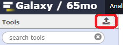

# Introduction
{:.no_toc}

This tutorial will show how to study species phenology through the computation of abundance index and trends. It will explain you how to use different [regionalGAM](https://github.com/RetoSchmucki/regionalGAM) tools on Galaxy-E allowing you to deal with datasets containing occurences informations for various species per site and per date through a couple of years.
After a certain numbers of steps, you will be able to extract single species data and study related phenology through the years. The goal of this exercise is to be able to create abundance trend over time and biodiversity indicators. Following these indicators allow to follow trends in terms of population dynamics. You could for example try to predict the occurences of one specific species in a certain type of environnement using the prediction model of climate evolution. Based on charts that you will generate, you could try to explain the evolution of a species with environmental data (temperatures variations, modifications of the environmental conditions).
You will basically learn how to create a file on the basis of which you can create a visual material that can be quite easily understood and therefore be efficient for a large audience.

> {: .comment}

> ### Agenda
> In this tutorial, we will cover:
1. Pre-processing
> {:pre-processing}
2. Analyze phenology of a species through the years
> {:Analyze phenology of a species through the years}

# Step 1: Pre-processing

The goal of the first step is to upload and prepare the file so that it will be usable for the *regional GAM* analysis (See [this warning](#inputdatawarning) for more information about the input file).
First of all, you need to use a Galaxy instance with related regionalGAM tools. You can deploy your own local instance through Docker as a  Galaxy flavour or use our [Galaxy-E test instance](https://openstack-192-168-100-96.genouest.org/). 
After uploading input files, you might have to use some data handling tools to be able to use *regional GAM* tools.

>  ###  Hands-on: Data upload
>
> 1. Create a new history for this tutorial and give it a proper name as `Tuto training regionalGAM`.
> 2. Import the following file from [Zenodo](https://zenodo.org/record/1324204#.W2BmRn7fNE4).
>
>    ```
>    CSV dataset with only one species:
>    https://zenodo.org/record/1324204/files/regional%20GAM%20data.csv?download=1
>    ```
>   
> ###  Tip: Importing data via links
>    > 1. Click on the Upload button: 
>    > 
>    > 
>    > 
>    > 2. To import the dataset:
>    > * Select **Paste/Fetch data**
>    > * Paste the link into the text field
>    > * Galaxy will normally automatically find the right format, here CSV, so you don't have to specify it
>    > * Press **Start** and **Close** the window

>    {: .tip}

> ###  Comment
>
> ⚠️ <a name="inputdatawarning"></a>Please note that the file must contain a header corresponding to: ```"SITES","SPECIES","YEAR","MONTH","DAY","COUNT"```, and that all the non numeric content must be between double quotes as "x" and that separators have to be ",". 

> {: .comment}

>    > ## <a name="resampling"></a> Re-sampling.  
When the dataset contains many details, it lengthens the file processing time therefore it can be very useful to learn how to hide the informations you don't need. For example, the list of sites (look at the column with header `SITE)` of the dataset you are using is really long and the SITES are classified into sub-sites (like ESBMS.12, ESBMS.28,ESBMS.55,...). Here, we will assume that your file doesn't really need be as precise and this is the reason why you have to specify you don't want the sub-sites. To create a new "down-sampled" file (so delete the ---.12, ---.28 mentions), you can follow these steps:   

> ###  Hands-on: hiding some informations

>    > 1. Use the `CSV to tabular` tool to first create a tabular file from your csv one (with only one species). This is a mandatory step as further tools are only working on tabular files!
>    > 2. Search for the tool `Column Regex Find And Replace` on the tabular file with the following  parameters.
>    >  * Select the input file & the column with the `SITE` header.
>    >  * "Find Regex": `(\.[0-9]+)` which specifies that you don't want the sub-sites (all suites of digits following a "." character) to be taken into account.
>    >  * "Replacement": leave it empty.

>   > ###  Questions
>   >
>    > 1. After having successfully deleted the sub-sites informations, can you look at the original dataset and this new one and say how many sites you had, and you have now? You will maybe need to use tools like `Count occurrences of each record` (don't forget that if you want to run the same tool with same parameters to several input files, you can directly specify the "multiple dataset" option on the tool form for the `from dataset` parameter).
>    >
>    >    <details>
>    >    <summary>Click to view answers</summary>
>    >    <ol type="1">
>    >    <li>The dataset contains 5 sites now against 1143 before "down-sampling". </li>
>    >    </ol>
>    >    </details>
>    {: .question}

> ### Making sure the dataset concerns only one species 
 
The second step of any Regional GAM data analysis is making sure to have a dataset of only one specific species that you will then be able to use. If you want to create a graph showing abundance evolution by years of several species, you will have to superimpose the graphs on one another. 

> ###  Hands-on: How many species are taken into account in this dataset
>
> As the dataset is quite big and may countain heterogeneous informations, you want to know wether the data are about one species or more. 
> 1. Search for the tool `Count occurrences of each record` with the following parameters:
> * "from dataset": `output` from **CSV to Tabular**
> * "Count occurrences of values in column(s)": Specify the `SPECIES` column, normally `column 1`
> * "Delimited by": `Tab`.
> * "How should the results be sorted?": `With the most common values first`.
> 2. Inspect the file by clicking on the `eye` icon to check that the dataset is on one species only.
> 3. Now, as regionalGAM tools use CSV files as input, you can regenerate a CSV file using the `tabular to CSV` tool on the output from **Column Regex Find And Replace**. Please, tag your new dataset with an explicit tag as "Count" and/or rename this dataset like "Count file".

> ###  Comment

❗In case the dataset contains informations one more than on species, you can follow the multispecies tutorial on regionalGAM which is a complement to this one from the second step. If you are interested in doing so, please click on the following link: [Selectionning one specific species](Multispecies_tutorial.md#selectionningonespecificspecies)

{: .hands_on}


# Step 2: <a name="analyzepheno"></a> Analyze phenology of a species through the years  
 
 
Now you have a file containing all the data on the species of interest. The main goal of this step is to treat phenology related informations and create a material that can be used to generate charts. What you could also do, for example, would be to compare the phenology through the years and sites.
>

> ##  Hands-on: Phenology

This step will allow you to compute and display the phenology of a species. In the second part, you will learn that it is possible to show the phenology of various species on a single chart allowing to compare them and analyse them more easily. 


> 1. Search for the tool `flight curve` on the "Phenology & Abundance Index tool section" and execute it specifying the following parameters: 
> * "Count file": output file you just generated with the **tabular to CSV** tool.
>
> 🔹 Based on the `output` from **flight curve**, you can create a line chart which shows species occurences through the years on a very visual material 

>
>    > ###  Visualization. 
>    > 1. Click on the name of output dataset from **flight curve** (something like `Flight curve on data 6`) to expand dataset related details and options
>    > 2. Click on the "Visualize" button then select `Charts` 
>    > 3. Select a visualization type: "line chart (NVD 3)"
>    > 4. Give it a proper name like `Pyronia tithonus phenology raw simple vizu` 
>    > 5. On  "Select data" area, specify:
>    > * "Provide a label": For example `Pyronia tithonus phenology from 2003 to 2012`
>    > * "Pick a series color": Choose a color for the line 
>    > * "Data point labels": `Column 1`
>    > * "Values for x-axis": `Column 2`
>    > * "Values for y-axis": `Column 6`
>    > 6. On  "change settings", specify:
>    > * "X-Axis label": `Year`
>    > * "Y-Axis label": `nm values`
>    > 7. Click on  `Visualize`
>    > 8. Click on  `save this visualization`if you are willing
>
>
> ###  Comments
>
> ⚠️ Please note, that if you want your chart to be more precise and to specify that the x-axis corresponds to "Week and year", it is possible. In order to do so, follow the tip below:
>    > ###  Tip: Creating a new column of the dataset containing the week and the year 
First of all, you have to know how many years are taken into account in your dataset.
>    > 1. Search for the tool `Count occurrences of each record` with the following parameters 
>    > * "from dataset": output from **Flight curve**.
>    > * "Select": `Column 2` (the on headed with `YEAR`)
>    > * "Delimited by": `Tab`.
>    > * "How should the results be sorted?": `By the values being counted`.
>    > 2. Inspect the file by clicking on the `eye` icon to check how many years are taken into account.
>    > 3. Use the `Column Regex Find And Replace` tool with the following parameters:
>    > * "File to process": output file from **flight curve**.
>    > * "in column": `Column 2` (corresponding to the one headed with `YEAR`)
>    > * Click on `Insert check`:
>    >   * "Find pattern": `(20[0-9][0-9])`
>    >   * "Replace with": `-\1` 
>    > 5. Inspect the file by clicking on the `eye` icon to check if all the years are now written with a "-" before the digits. 
>    > 6. Search for the tool `Merge Columns together` with the following parameters:
>    > * "Select data": output from the last **Column Regex Find And Replace**.
>    > * "Merge column": `Column 3`(corresponding to the one headed with `WEEK`)
>    > * "with column": `Column 2`(corresponding to the one headed with `YEAR`)
>    > 7. Use the **Remove beginning of a file** tool to remove first line, a mandatory step to avoid header to be part of the visualization

With the `output` from **Remove beginning of a file** you can now generate a new chart which will have a x-axis corresponding to your column `"week""year"`.
>    > ###  Visualize
>    > 1. With the  `output` from **Remove beginning of a file**.
>    > 2. Select `Charts`
>    > 3. Select a visualization type: "line chart (NVD 3)
>    > 4. Give it a proper name like `Pyronia tithonus phenology simple vizu` 
>    > 5. On  "Select data" area, specify:
>    > * "Provide a label": This can be `Pyronia tithonus phenology from 2003 to 2012`
>    > * "Pick a series color": Choose a color for the line 
>    > * "Data point labels": `Column 6` (the nm column) or another one
>    > * "Values for x-axis": `Column 7` (the "week-year" column)
>    > * "Values for y-axis": `Column 6` (the nm column)
>    > 6. On  "change settings", specify:
>    > * "X-Axis label": `Week-Year`
>    > * "Y-Axis label": `nm values`
>    > 7. Click on  `Visualize`
>    > 8. Click on  `save this visualization` if you are willing to save to chart.
>   
> {: .comment}


>
>
> ⚠️ Please note, that if you want to create a "stacked" visualization, overlapping each year, you can use several executions (one execution by year) of the `Filter data on any column using simple expressions` tool specifying the year you want on the `With following condition` parameter, `c2==2003` for 2003, then `c2==2004` for 2004, etc... then you can paste all resulting files side by side using one or several executions of the `Paste two files side by side` tool so you can specify on the "Select Data" tab of visualization, several Data series (one by year). ❗WARNING❗ The use of this `Paste two files side by side` tool must be done carefully as in case of differences in term of number of lines between datasets to paste, it will mix informations from columns. Here, as we are working on temporal series over years, and as some years have 365 days, others 366, and as in this case, phenology is not centered on winter, we can delete informations from the 366 days of some years without any problems so we will have the same number of lines between datasets to paste side by side. To do so, use the `Select first lines from a dataset` tool to select first 366 lines from filtered datasets. As it will be of interest to reuse this combination of tools in a next tutorial step, you can create a workflow that you can named something like `Phenology "stacked" visualization creation`.
>

With the `output` from **Remove beginning of a file** you can now generate a new 'stacked' chart which will have a x-axis corresponding to your column `"week"`.
>    > ###  Visualize
>    > 1. With the output from **Remove beginning of a file**.
>    > 2. Select `Charts`
>    > 3. Select a visualization type: "line chart (NVD 3)
>    > 4. Give it a proper name like `Pyronia tithonus phenology` 
>    > 5. On  "Select data" area, specify:
>    > * "Provide a label": This can be here the year, `2003`
>    > * "Pick a series color": Choose a color for the line 
>    > * "Data point labels": `Column 6` (the 2003 nm column) or another one
>    > * "Values for x-axis": `Column 3` (the 2003 "week" column)
>    > * "Values for y-axis": `Column 6` (the 2003 nm column)
>    > 6. Insert a new Data Series, choose a different color and specify:
>    > * "Provide a label": This can be here the year, `2004`
>    > * "Pick a series color": Choose a color for the line 
>    > * "Data point labels": `Column 12` (the 2004 nm column) or another one
>    > * "Values for x-axis": `Column 9` (the 2004 "week" column)
>    > * "Values for y-axis": `Column 12` (the 2004 nm column)
>    > 7. Insert a new Data Series, choose a different color and specify:
>    > * "Provide a label": This can be here the year, `2005`
>    > * "Pick a series color": Choose a color for the line 
>    > * "Data point labels": `Column 18` (the 2005 nm column) or another one
>    > * "Values for x-axis": `Column 15` (the 2005 "week" column)
>    > * "Values for y-axis": `Column 18` (the 2005 nm column)
>    > 8. Insert a new Data Series, choose a different color and specify:
>    > * "Provide a label": This can be here the year, `2006`
>    > * "Pick a series color": Choose a color for the line 
>    > * "Data point labels": `Column 24` (the 2006 nm column) or another one
>    > * "Values for x-axis": `Column 21` (the 2006 "week" column)
>    > * "Values for y-axis": `Column 24` (the 2006 nm column)
>    > 9. Insert a new Data Series, choose a different color and specify:
>    > * "Provide a label": This can be here the year, `2007`
>    > * "Pick a series color": Choose a color for the line 
>    > * "Data point labels": `Column 30` (the 2007 nm column) or another one
>    > * "Values for x-axis": `Column 27` (the 2007 "week" column)
>    > * "Values for y-axis": `Column 30` (the 2007 nm column)
>    > 10. Insert a new Data Series, choose a different color and specify:
>    > * "Provide a label": This can be here the year, `2008`
>    > * "Pick a series color": Choose a color for the line 
>    > * "Data point labels": `Column 36` (the 2008 nm column) or another one
>    > * "Values for x-axis": `Column 33` (the 2008 "week" column)
>    > * "Values for y-axis": `Column 36` (the 2008 nm column)
>    > 11. Insert a new Data Series, choose a different color and specify:
>    > * "Provide a label": This can be here the year, `2009`
>    > * "Pick a series color": Choose a color for the line 
>    > * "Data point labels": `Column 42` (the 2009 nm column) or another one
>    > * "Values for x-axis": `Column 39` (the 2009 "week" column)
>    > * "Values for y-axis": `Column 42` (the 2009 nm column)
>    > 12. Insert a new Data Series, choose a different color and specify:
>    > * "Provide a label": This can be here the year, `2010`
>    > * "Pick a series color": Choose a color for the line 
>    > * "Data point labels": `Column 48` (the 2010 nm column) or another one
>    > * "Values for x-axis": `Column 45` (the 2010 "week" column)
>    > * "Values for y-axis": `Column 48` (the 2010 nm column)
>    > 7. Insert a new Data Series, choose a different color and specify:
>    > * "Provide a label": This can be here the year, `2011`
>    > * "Pick a series color": Choose a color for the line 
>    > * "Data point labels": `Column 54` (the 2011 nm column) or another one
>    > * "Values for x-axis": `Column 51` (the 2011 "week" column)
>    > * "Values for y-axis": `Column 54` (the 2011 nm column)
>    > 8. Insert a new Data Series, choose a different color and specify:
>    > * "Provide a label": This can be here the year, `2012`
>    > * "Pick a series color": Choose a color for the line 
>    > * "Data point labels": `Column 60` (the 2012 nm column) or another one
>    > * "Values for x-axis": `Column 57` (the 2012 "week" column)
>    > * "Values for y-axis": `Column 60` (the 2012 nm column)
>    > 14. On  "change settings", specify:
>    > * "X-Axis label": `Week`
>    > * "Y-Axis label": `nm values`
>    > * "Use multi-panels": `No`
>    > 7. Click on  `Visualize`
>    > 8. Click on  `save this visualization` if you are willing to save to chart.
>   


>
>

 
> ##  <a name="Abundanceindex"></a>Compute Abundance Index across sites and years

This will allow you to create a file showing the abundance index per year of a chosen species in a certain site. Based on this file you will then learn how to represent this abundance on a chart. 
>
> 1. Look for the tool `Abundance index` with the following parameters:
> * "Count file": `output` from **tabular to CSV** (normally renamed "Counting file" and/or tagged "Count").  
> * "Flight curve output": `output` from **flight curve**.


> 🔹 Based on the  output from **abundance index**, we can create a chart showing the annual abundance trend of a certain species per site. 
>    > 1. Select `Charts`
>    > 2. Give it a proper name (`Pyronia tithonus abundance index ` for example)
>    > 3. Select a visualization type: "Bar diagram (NVD 3)" 
>    > 4. Select data 
>    > * "Data point labels": `Column 1` 
>    > * "Values for x-axis": `Column 3`
>    > * "Values for y-axis": `Column 4`
>    > 5. Customize 
>    > * "X-Axis label": `Year`
>    > * "Y-Axis label": `regional_gam`
>    > 5. Visualize
>    > 6. Click on  `save this visualization`if you are willing to keep it

>   > ###  Questions
>   >
>    > 1. What do you think about this visualization? Maybe not so good? Search a way to display the content of the file using charts in a more accurate manner... To do so, you can apply approaches used before on this tutotrial using tools like **Column Regex Find And Replace**, **Merge Columns together**, **Remove beginning of a file**, and **Sort data in ascending or descending order** on one hand to create a new column of more explicit identifiers (ie `Site-Year`) and/or  **Filter data on any column using simple expressions**, **Paste two files side by side**, **Remove beginning of a file** on another hand to create a stacked visualization.
>    >
>    >    <details>
>    >    <summary>Click to view answers</summary>
>    >    <ol type="1">
>    >    <li>You can use the **Column Regex Find And Replace** tool to first replace `(20[0-9][0-9])` on the column 3 (the "YEAR" one) by `-\1` then on the result of this tool execution, replace `"` by nothing on the column 1. Furthermore, you can merge column 1 and column 3 of the resulting dataset. Finally, after deleting the first line (the header) with **Remove beginning of a file**, you can sort the new dataset by column 1 (alphabetical/ascending) and column 3 (alphabetical/ascending). </li>
>    >    </ol>
>    >    </details>
>    {: .question}
> 🔹 If you choose to create a new column of more explicit identifiers (`Site-Year`), we can now display a better chart showing the annual abundance trend of a certain species per site. 
>    > 1. Select `Charts` from the **Sort data in ascending or descending order** execution
>    > 2. Select a visualization type: "Bar diagram (NVD 3)" 
>    > 3. Give it a proper name (`Pyronia tithonus abundance index` for example)
>    > 4. Select data 
>    > * "Data point labels": `Column 6` 
>    > * "Values for x-axis": `Column 6`
>    > * "Values for y-axis": `Column 4`
>    > 5. Customize 
>    > * "X-Axis label": `Site-Year`
>    > * "Y-Axis label": `regional_gam`
>    > 5. Visualize
>    > 6. Click on  `save this visualization`if you are willing to keep it


> 🔹 If you choose to create a stacked visualization, we can now display a better chart showing the annual abundance trend of a certain species per site. 
>    > 1. Select `Charts` from the last execution of **Remove beginning of a file**
>    > 2. Select a visualization type: "Bar diagram (NVD 3)" 
>    > 3. Give it a proper name (`Pyronia tithonus abundance index` for example)
>    > 4. Select data
>    > * "Provide a label": This can be here the site, `UKBMS`
>    > * "Data point labels": `Column 5` (the UKBMS prop_pheno_sampled column)
>    > * "Values for x-axis": `Column 3` (the UKBMS YEAR column)
>    > * "Values for y-axis": `Column 4` (the UKBMS regional_gam column)
>    > 5. Insert a new Data Series, choose a different color and specify:
>    > * "Provide a label": This can be here the site, `NLBMS`
>    > * "Pick a series color": Choose a color for the line 
>    > * "Data point labels": `Column 10` (the NLBMS prop_pheno_sampled column)
>    > * "Values for x-axis": `Column 8` (the NLBMS YEAR column)
>    > * "Values for y-axis": `Column 9` (the NLBMS regional_gam column)
>    > 6. Insert a new Data Series, choose a different color and specify:
>    > * "Provide a label": This can be here the site, `ESBMS`
>    > * "Pick a series color": Choose a color for the line 
>    > * "Data point labels": `Column 15` (the ESBMS prop_pheno_sampled column)
>    > * "Values for x-axis": `Column 13` (the ESBMS YEAR column)
>    > * "Values for y-axis": `Column 14` (the ESBMS regional_gam column)
>    > 7. Insert a new Data Series, choose a different color and specify:
>    > * "Provide a label": This can be here the site, `FRBMS`
>    > * "Pick a series color": Choose a color for the line 
>    > * "Data point labels": `Column 20` (the FRBMS prop_pheno_sampled column)
>    > * "Values for x-axis": `Column 18` (the FRBMS YEAR column)
>    > * "Values for y-axis": `Column 19` (the FRBMS regional_gam column)
>    > 8. Insert a new Data Series, choose a different color and specify:
>    > * "Provide a label": This can be here the site, `DEBMS`
>    > * "Pick a series color": Choose a color for the line 
>    > * "Data point labels": `Column 25` (the 2004 prop_pheno_sampled column)
>    > * "Values for x-axis": `Column 23` (the 2004 YEAR column)
>    > * "Values for y-axis": `Column 24` (the 2004 regional_gam column)


>    > 5. Customize 
>    > * "X-Axis label": `Year`
>    > * "Y-Axis label": `regional_gam`
>    > 5. Visualize
>    > 6. Click on  `save this visualization`if you are willing to keep it
{: .hands_on}

> ## Compute a collated index for each year and estimates the temporal trend

The expected temporal trend allows you to have an overview of the evolution of a species in a certain type of environment in the futur.

> ###  Hands-on: Expected temporal trend
>    > 1. Look for the tool `Expected temporal trend` with the the following parameters: 
>    > * "Tabular file generated by the ab_index tool": output from **abundance index**.
>    


> ⚠️ Please note that sometimes the expected temporal trend can't be done on dataset. If you want this action to work, the occurences on your dataset must lie between the month of April and the end of the month of September.

Note also that you will obtain two files resulting of the action above. The first one will be the graph and the second one will contains the values of "x".

> ## Model temporal trend with a simple linear regression 

The point of doing a linear regression is to determinate if the year has an influence on the abundance of a species. 

>    > 1. Look for the tool `Model temporal trend with a simple linear regression` with the following parameters.
>    > * "File generated by the glmmpql/Expected temporal trend tool": `output 2` from **temporal trend**. 
>    > * "File generated by the ab_index tool": `output` from **abundance index**.

> ## Model temporal trend taking into account autocorrelation of residuals

Here we apply the same approach than at the previous step with addition of a correslation structure (ARMA(2,0)) to adjust the model.

>    > 1. Look for the tool `Linear regression ajusted for autocorrelation in the residuals` with the following parameters.
>    > * "File generated by the glmmpql/Expected temporal trend tool": `output 2` from **temporal trend**. 
>    > * "File generated by the ab_index tool": `output` from **abundance index**.


> ## Plot collated abundance index with trend line

Finally, a global trend (over years) can be computed and displayed using the **Plot abundance with trend line** tool selecting outputs from **abundance index** and **Linear regression ajusted for autocorrelation in the residuals** or **Model temporal trend with a simple linear regression**.


{: .hands_on}
 
# Conclusions  

{:.no_toc}

In this tutorial, you have analyzed regional GAM data to extract useful informations in order to be able to show different tendencies of a chosen species. Therefore, you are now able to treat the dataset so that it shows only the data concerning one specific species of your choice. From there, you can show the occurrence of this species through the years first on a dataset and then on a visual chart. You have also learned how to represent on a single chart the occurences of various species. Afterwards, we have shown you how to create a dataset containing the informations on the abundance of a species per year and per site. Based on which you can henceforth visually represent the annual abundance trend on a chart. Thereafter, you have the possibility of showing the expected temporal trend, based on which you will be able to try predicting the future evolution a given species. The last part of this tutorial has shown you how to calculate the linear regression allowing you to determinate wether the year has an influence on the abundance of a species or not. 
