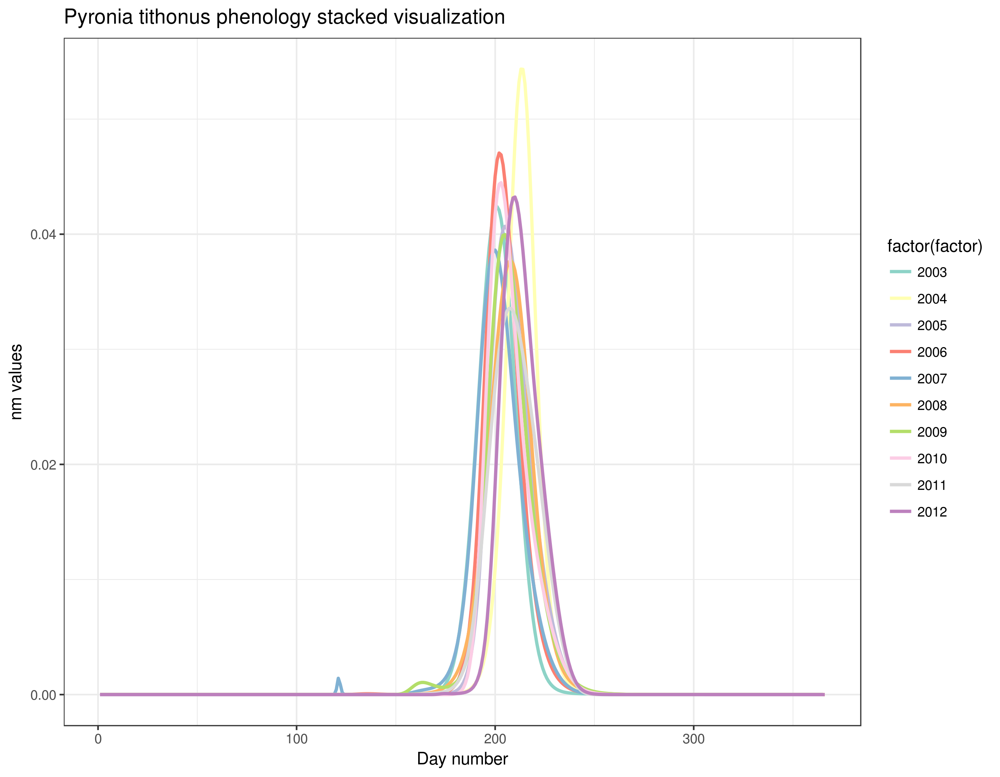

# Introduction
{:.no_toc}

This tutorial will show how to study species abundance through the computation of a flight curve, abundance index, and trends. It will explain you how to use different [regionalGAM](https://github.com/RetoSchmucki/regionalGAM) tools on Galaxy allowing you to deal with datasets containing abundance information for various species per site and per date through a couple of years.

After a certain numbers of steps, you will be able to extract single species data and study related abundance through the years. The goal of this exercise is to be able to create abundance trend over time and biodiversity indicators. Following these indicators allow to follow trends in terms of population dynamics. You could for example try to predict the occurrences of one specific species in a certain type of environment using the prediction model of climate evolution. Based on charts that you will generate, you could try to explain the evolution of a species with environmental data (temperatures variations, modifications of the environmental conditions).

You will basically learn how to create a file on the basis of which you can create a visual material that can be quite easily understood and therefore be efficient for a large audience.

> ### Agenda
>
> In this tutorial, we will deal with:
>
> 1. TOC
> {:toc}
>
{: .agenda}

# Step 1: Pre-processing

The goal of the first step is to upload and prepare the file so that it will be usable for the *regional GAM* analysis.

## Data upload

> ###  Hands-on: Data upload
>
> 1. Create a new history for this tutorial and give it a proper name like `regionalGAM tutorial`
>
>    
>    
>
> 2. Import the CSV dataset file with only one species from [Zenodo](https://zenodo.org/record/1324204#.W2BmRn7fNE4) or from the data library (ask your instructor)
>
>    ```
>    https://zenodo.org/record/1324204/files/regional%20GAM%20data.csv
>    ```
>   
>    
>    
>
> 2. Check that the file contains a header corresponding to: ```"SPECIES","SITE","YEAR","MONTH","DAY","COUNT"```, and that all the non numeric content are between double quotes as "x" and that separators are ","
>
{: .hands_on}

This dataset gathers years of records of the presence of butterfly species per site and per day. Columns indicates species names ("SPECIES"), observation site ("SITE"), date of the observation ("YEAR","MONTH","DAY") and number of indivudals ("COUNT"). It compiles counts for the Gatekeeper (Pironia tithonus) collected between 2003 and 2012 and extracted from five European BMSs (United Kingdom, Netherlands, France, Germany, and Catalonia-Spain). The Gatekeeper has one generation per year and feeds mainly on Poaceae.

")


## Prepare the data

The downstream tools require Tabular file and not CSV. So we need first to convert our CSV file to a tabular

> ###  Hands-on: Convert CSV to Tabular
> 1. Run **CSV to tabular**  with the following parameters:
>       -  *"CSV file"*: imported dataset
>       - *"Separator"*: ","
>       - *"Header in file"*: Yes
{: .hands_on}

The current dataset contains a lot of data (exact site names for 5 ). Processing the file is this condition would require time and for the purpose of this tutorial, we will reduce the number of sites. The column with header `SITE` of the dataset you are using is really long and the `SITES` are classified into sub-sites (like `ESBMS.12`, `ESBMS.28`, `ESBMS.55`, etc).

Here, we will delete the sub-sites ID and consider . We want to create a down-sampled file, deleting the `---.12, ---.28` mentions,

> ###  Hands-on: Downsample and hide some information   
> 1. **Column Regex Find And Replace**  with the following parameters:
>       -  *"Select cells from"*: output of **CSV to tabular** 
>       - *"using column"*: `Column: 2`, the column with the `SITE` header
>       - *"insert Check"*
>       - *"Find pattern"*: `(\.[0-9]+)`
>
>           It specifies that you don't want the sub-sites (all suites of digits following a "." character) to be taken into account.
>
>       - *"Replace with"*: leave it empty
{: .hands_on}

> ###  Questions
>
> How many sites do you have before and after deleting the sub-sites information?
>
>
> You may need to use a tool like **Count occurrences of each record** . If you want to run the same tool with same parameters to several input files, you can directly specify the  **Multiple datasets** option on the tool form for the *"from dataset"* parameter).
>
>    
>
> > ###  Solution
> > The dataset contains 5 sites now against 1143 before down-sampling.
> {: .solution}
{: .question}

> ###  If your original data is on RData format
>
> > ###  Hands-on: Data upload.
> > 1. Import the RData
> >
> >    For example, you can upload:
> >
> >    ```
> >    https://zenodo.org/record/1324204/files/gatekeeper_CM%20.RData
> >    ```
> >
> > 2. **RData binary file reader**  with the following parameters:
> >    -   *"Rdata binary file to explore"*: imported RData
> >
> > 2. **RData parser**  with the following parameters
> >    -   *"Rdata file to explore"*: imported RData
> >    -   *"File with .Rdata content details"*: output of **RData binary file reader** 
> >    -  *"Select which attribute(s) you want to extract"*: select everything but "trend"
> >    -  *"Bind variables in a single tabular when its possible"*: `Yes`
> {: .hands_on}
>
> If the tool **RData parser**  don't succeed to create a single tabular file, it generates separate files, each of them containing one column. The file with the `TREND` header can be let aside as we don't need it for what will follow.
>
> > ###  Questions
> >
> > If Rdata parser fails to generate a single unified tabular file, can you propose a way to regenerate such a dataset ?
> >
> > > ###  Solution
> > > You can do that using:
> > > 1. **Paste two files side by side tool**  with the following parameters:
> >     -  *"paste"*: output from **RData parser**  headed with "SPECIES"
> >     - *"and"*: output from **RData parser**  with headed with "SITE"
> > > 2. Repeat **Paste two files side by side**  executions as many times as there are separated files in order to create a final dataset with all the columns:
> > >     1. Repeat **Paste two files side by side tool**  to paste the file containing 2 columns with the one headed by `YEAR`
> > >     1. Repeat **Paste two files side by side tool**  to paste the file containing 3 columns with the one headed by `MONTH`
> > >     1. Repeat **Paste two files side by side tool**  to paste the file containing 4 columns with the one headed by `DAY`
> > >     1. Repeat **Paste two files side by side tool**  to paste the file containing 5 columns with the one headed by `COUNT`
> > {: .solution}
> {: .question}
{: .details}

## Check that the dataset concerns only one species

The second step of any Regional GAM data analysis is making sure to have a dataset of only one specific species that you will then be able to use. If you want to create a graph showing abundance evolution by years of several species, you will have to superimpose the graphs on one another.

As the dataset is quite big and may countain heterogeneous information, we need to know whether the data are about one species or more.

> ###  Hands-on: How many species are taken into account in this dataset?
>
> 1. **Count occurrences of each record**  with the following parameters:
>    -  *"from dataset"*: output of **Column Regex Find And Replace**
>    - *"Count occurrences of values in column(s)"*: `Column: 1`, the `SPECIES` column
>    - *"Delimited by"*: `Tab`
>    - *"How should the results be sorted?"*: `With the most common values first`
> 2. Inspect the generated file by clicking on the  (eye) icon (**View data**)
> 3. Check that the dataset is for one species only
{: .hands_on}

The regionalGAM tools require CSV files as input, we need to regenerate a CSV file using the `tabular to CSV` tool from

> ###  Hands-on: Regenerate a CSV file
> 1. **Tabular to CSV** 
>       -  *"tabular file"*: output of **Column Regex Find And Replace**
>       - *"Separator"*: ","
>       - *"Header in file"*: Yes
> 2. Tag your new dataset with an explicit tag as `Count` and/or rename this dataset like `Count file`
{: .hands_on}

> ###  Datasets containings information about more than one species
>
> If your dataset contains information about more than one species, you can apply the previous steps and then run an extra-step to select one specific species and show all the data corresponding to it.
>
> As the dataset is quite big and contains heterogeneous information, you want to know wether the data are about one species or more. So the first step consists to count how many species are taken into account in this dataset.
>
> > ###  Hands-on: How many species are taken into account
> > 1. **Count occurrences of each record**  with the following parameters:
> >      -   *"from dataset"*: `output` from **Column Regex Find And Replace**
> >      - *"Count occurrences of values in column(s)"*: the `SPECIES` column (normally `column 1`)
> >      - *"Delimited by"*: `Tab`
> >      - *"How should the results be sorted?": `With the most common values first`
> 2. Inspect the file by clicking on the  icon to check how many species are taken into account.
> {: .hands_on}
>
> To test these steps, you can use the following dataset:
>
>   ```
>   https://zenodo.org/record/1324204/files/Dataset%20multispecies%20Regional%20GAM.csv
>   ```
>
> > ###  Questions
> >
> > 1. How many species does your initial dataset take into account ?
> > 2. What are their names ?
> >
> > > ###  Solutions
> > >
> > > 1. The dataset contains information on 2 different species
> > > 2. Their names are "Pyronia tithonus" and "Aglais io".
> > >
> > {: .solution}
> {: .question}
>
> We now need to create a new file concerning only the data of one species
>
> > ###  Hands-on: Creating a new file concerning only the data of one species
> > 1. Copy the name of the species you are interested in (for example: "Aglais io").
> > 2. **Filter data on any column using simple expressions** 
> >      -  *"Filter"*: output of **Column Regex Find And Replace** 
> >      - *"With following condition"*: `c1=='"Aglais io"'` or (another species name)  
> >      - *"Number of header lines to skip"*: `1`
> >
> >    You can repeat this set of actions as much as necessary, changing only the name of the species taken into account. By doing this, you will obtain separated dataset, each of them concerning a different species.
> >
> > 3. **tabular to CSV** 
> >      -  *"tabular file"*: output of **Filter data on any column using simple expressions** 
> >      - *"output csv Separator"*: `,`
> >      - *"Header in file"*: `Yes`
> >
> > 4. Repeat the last step on all the different `outputs` from **Filter data on any column using simple expressions**  that you have, one by species
> > 5. Tag your new dataset with an explicit tags as "Count" and "Aglais io" and/or rename this dataset like "Aglais io count file".
> {: .hands_on}
>
> If you want to create a graph showing abundance evolution by years of several species, you will have to superimpose the graphs on one another.
{: .details}

# Step 2: Analyze phenology of a species through the years

## Visualize the phenology

[Phenology](https://en.wikipedia.org/wiki/Phenology), as described in Wikipedia, is the study of periodic plant and animal life cycle events and how these are influenced by seasonal and interannual variations in climate, as well as habitat factors (such as elevation)

Now you have a file containing all the data on the species of interest. The main goal of this step is to treat phenology related information and create a material that can be used to generate charts. What you could also do, for example, would be to compare the phenology through the years and sites.

This step will allow you to compute and display the phenology of a species. In the second part, you will learn that it is possible to show the phenology of various species on a single chart allowing to compare them and analyse them more easily.

> ###  Hands-on: Phenology
> 1. **Flight curve**  with the following parameters
>    -  *"Count file"*: output file you just generated with the **tabular to CSV** 
>
> 2. Generate the chart using the visualization
>    1. Inspect and expand the output data from **Flight curve** 
>    2. Click on the  (**Visualize**) icon
>    3. Select **Line chart (NVD 3)** as visualization type
>    4. Give it a proper name, i.e. `Pyronia tithonus phenology raw simple vizu`
>    5. On **Select data** area, specify:
>       - *"Provide a label"*: `Pyronia tithonus phenology from 2003 to 2012` for example
>       - *"Pick a series color"*: Choose a color for the line
>       - *"Data point labels"*: `Column 1`
>       - *"Values for x-axis"*: `Column 2`
>       - *"Values for y-axis"*: `Column 6`
>    6. On **Change settings**, specify:
>       - *"X-Axis label"*: `Year`
>       - *"Y-Axis label"*: `nm values`
>    7. Click on **Save**
>
{: .hands_on}


This graph displays the modeled flight curve of *Pyronia tithonus* over the years. But the first year is "null", probably a left-over of the 1st line with the header, and we do not know the weeks there.

> ###  Hands-on: Create a new column of the dataset containing the week and the year
> 1. **Count occurrences of each record**  with the following parameters
>    -  *"from dataset"*: output from **Flight curve**
>    - *"Select"*: `Column: 2` (the column with the year)
>    - *"Delimited by"*: `Tab`
>    - *"How should the results be sorted?"*: `By the values being counted`
> 2. Inspect and expand the output data from **Count occurrences of each record** 
>   
> > ###  Questions
> >
> > What can you see in this file?
> >
> > > ###  Solution
> > > A list of the years and the number of occurence for each year which should match the number of days for each year.
> > {: .solution }
>    {: .question}
>
> 3. **Column Regex Find And Replace**  with the following parameters:
>    -  *"File to process"*: output file from **flight curve**.
>    - *"in column"*: `Column 2` (the column with the year)
>    - *"Find pattern"*: `(20[0-9][0-9])`
>    - *"Replace with"*: `-\1`
> 4. Inspect the file and check if all the years are now written with a `-` before the digits.
> 5. **Merge Columns together**  with the following parameters:
>    -  *"Select data"*: output from the last **Column Regex Find And Replace**.
>    - *"Merge column"*: `Column: 3` (the column with the week)
>    - *"with column"*: `Column: 2` (the column with the year)
> 6. **Column Regex Find And Replace**  to recreate the original content for the year column:
>    -  *"File to process"*: output file from **Merge Columns together**.
>    - *"in column"*: `Column 2` (the column with the year)
>    - *"Find pattern"*: `-(20[0-9][0-9])`
>    - *"Replace with"*: `\1`
> 7. **Remove beginning of a file**  to remove first line (to avoid header in the visualization)
>
>    > ###  Dataset with information about more than one species
>    > If your dataset contains information about more than one species, you can apply the previous steps and then run an extra-step to select one specific species and show all the data corresponding to it.
>    {: .comment}
>
> 8. Generate the chart using the visualization with the x-axis corresponding to your column `"week""year"`.
>    1. Inspect and expand the output data from **Remove beginning of a file** 
>    2. Click on the  (**Visualize**) icon
>    3. Select **Line chart (NVD 3)** as visualization type
>    4. Give it a proper name, i.e. `Pyronia tithonus phenology simple vizu`
>    5. On **Select data** area, specify:
>       - *"Provide a label"*: `Pyronia tithonus phenology from 2003 to 2012` for example
>       - *"Pick a series color"*: Choose a color for the line
>       - *"Data point labels"*: `Column 6` (the nm column) or another one
>       - *"Values for x-axis"*: `Column 7` (the "week-year" column)
>       - *"Values for y-axis"*: `Column 6` (the nm column)
>    6. On **Customize**, specify:
>       - *"X-Axis label"*: `Week-Year`
>       - *"Y-Axis label"*: `nm values`
>    7. Click on **Save**
>
{: .hands_on}


This shows the occurrences of *Pyronia tithonus*, over the weeks. We can see there is a peak every year and we can already notice some differences in the values between the weeks and years, but not how the weeks overlap between the years. In this type of visualization, it's quite difficult to see when occurs maximum presence of butterflies and possible changes between years. We would like to visualize these differences using a stacked visualization. Here we can see global differences year by year like evolution of the maximum number of observations or some specific patterns as presence of more than only one peak in 2007, 2009 and 2012.

To do that, we need to first create a table with the columns:
1. Day
2. Species
3. nm for 2003
4. Week for 2003
5. nm for 2004
6. Week for 2004
7. nm for 2005
8. Week for 2005
9. nm for 2006
10. Week for 2006
11. nm for 2007
12. Week for 2007
13. nm for 2008
14. Week for 2008
15. nm for 2009
16. Week for 2009
17. nm for 2010
18. Week for 2010
19. nm for 2011
20. Week for 2011
21. nm for 2012
22. Week for 2012

> ###  Hands-on: Generate a stacked chart, overlapping each year
> 1. **Filter data on any column using simple expressions** to select values for 2003
>    -  *"Filter"*: output of **Column Regex Find And Replace** 
>    - *"With following condition"*: `c2==2003`  
>    - *"Number of header lines to skip"*: `0`
> 2. Repeat the previous steps with:
>    - `c2==2004`
>    - `c2==2005`
>    - `c2==2006`
>    - `c2==2007`
>    - `c2==2008`
>    - `c2==2009`
>    - `c2==2010`
>    - `c2==2011`
>    - `c2==2012`
>   
>    You should now have 10 files in the history
>
> 3. **Cut columns from a table** to keep species, day, week and value columns
>    -  *"File to cut"*: all the outputs of **Filter data on any column using simple expressions**
>    - *"Operation"*: `Keep`
>    - *"Delimited"*: `Tab`
>    - *"Cut by"*: `fields`
>       - *"List of Fields"*: `c1`, `c3`, `c4`, `c6`
>
> 4. **Multi-Join (combine multiple files)** to paste the 9 files
>    -  *"File to join"*: the first output of **Cut**
>    -  *"add additional file"*: All the other output of **Cut**
>    - *"Common key column"*: `3`
>    - *"Column with values to preserve"*: All
>    - *"Add header line to the output file"*: Yes
>    - *"Input files contain a header line (as first line)"*: Yes
>    - *"Ignore duplicated keys"*: Yes
>
> 5. **Sort data in ascending or descending order** to get your data in chronological order
>    -  *"File"*: the output of **Multi-Join**
>    - *"column"*: `Column: 1`
>    - *"order"*: `ascending`
>
> 6. **Cut columns from a table** to remove repeated columns
>    -  *"File to cut"*: output of **Sort**
>    - *"Operation"*: `Keep`
>    - *"Delimited by"*: `Tab`
>    - *"Cut by"*: `fields`
>      - *"List of Fields"*: `Column: 1`, `Column: 2`, `Column: 3`, `Column: 5`, `Column: 7`, `Column: 9`, `Column: 11`, `Column: 13`, `Column: 15`, `Column: 17`, `Column: 19`, `Column: 21`, `Column: 23`, `Column: 25`, `Column: 27`, `Column: 31`, `Column: 33`, `Column: 35`, `Column: 37`, `Column: 39`, `Column: 41`
>
>    We have now a table as wanted that we can plot
>
> 7. Generate the chart using the stacked visualization
>    1. Inspect and expand the output data from **Cut** 
>    2. Click on the  (**Visualize**) icon
>    3. Select **Line chart (NVD 3)** as visualization type
>    4. Give it a proper name, i.e. `Pyronia tithonus phenology`
>    5. On **Select data** area, specify:
>       - In *"1: Data series"*:
>           - *"Provide a label"*: `2003` for example
>           - *"Pick a series color"*: Choose a color for the line
>           - *"Data point labels"*: `Column: 4` (the 2003 nm column)
>           - *"Values for x-axis"*: `Column: 3` (the 2003 "week" column)
>           - *"Values for y-axis"*: `Column: 4` (the 2003 nm column)
>       -  *"Insert Data series"*
>       - In *"2: Data series"*:
>           - *"Provide a label"*: `2004` for example
>           - *"Pick a series color"*: Choose a color for the line
>           - *"Data point labels"*: `Column: 6` (the 2004 nm column)
>           - *"Values for x-axis"*: `Column: 5` (the 2004 "week" column)
>           - *"Values for y-axis"*: `Column: 6` (the 2004 nm column)
>       -  *"Insert Data series"*
>       - In *"3: Data series"*:
>           - *"Provide a label"*: `2005` for example
>           - *"Pick a series color"*: Choose a color for the line
>           - *"Data point labels"*: `Column: 8`
>           - *"Values for x-axis"*: `Column: 7`
>           - *"Values for y-axis"*: `Column: 8`
>       -  *"Insert Data series"*
>       - In *"4: Data series"*:
>           - *"Provide a label"*: `2006` for example
>           - *"Pick a series color"*: Choose a color for the line
>           - *"Data point labels"*: `Column: 10`
>           - *"Values for x-axis"*: `Column: 9`
>           - *"Values for y-axis"*: `Column: 10`
>       -  *"Insert Data series"*
>       - In *"5: Data series"*:
>           - *"Provide a label"*: `2007` for example
>           - *"Pick a series color"*: Choose a color for the line
>           - *"Data point labels"*: `Column: 12`
>           - *"Values for x-axis"*: `Column: 11`
>           - *"Values for y-axis"*: `Column: 12`
>       -  *"Insert Data series"*
>       - In *"6: Data series"*:
>           - *"Provide a label"*: `2008` for example
>           - *"Pick a series color"*: Choose a color for the line
>           - *"Data point labels"*: `Column: 14`
>           - *"Values for x-axis"*: `Column: 13`
>           - *"Values for y-axis"*: `Column: 14`
>       -  *"Insert Data series"*
>       - In *"7: Data series"*:
>           - *"Provide a label"*: `2009` for example
>           - *"Pick a series color"*: Choose a color for the line
>           - *"Data point labels"*: `Column: 16`
>           - *"Values for x-axis"*: `Column: 15`
>           - *"Values for y-axis"*: `Column: 16`
>       -  *"Insert Data series"*
>       - In *"8: Data series"*:
>           - *"Provide a label"*: `2010` for example
>           - *"Pick a series color"*: Choose a color for the line
>           - *"Data point labels"*: `Column: 18`
>           - *"Values for x-axis"*: `Column: 17`
>           - *"Values for y-axis"*: `Column: 18`
>       -  *"Insert Data series"*
>       - In *"9: Data series"*:
>           - *"Provide a label"*: `2011` for example
>           - *"Pick a series color"*: Choose a color for the line
>           - *"Data point labels"*: `Column: 20`
>           - *"Values for x-axis"*: `Column: 19`
>           - *"Values for y-axis"*: `Column: 20`
>       -  *"Insert Data series"*
>       - In *"9: Data series"*:
>           - *"Provide a label"*: `2012` for example
>           - *"Pick a series color"*: Choose a color for the line
>           - *"Data point labels"*: `Column: 22`
>           - *"Values for x-axis"*: `Column: 21`
>           - *"Values for y-axis"*: `Column: 22`
>    6. On **Customize**, specify:
>       - *"X-Axis label"*: `Week`
>       - *"Y-Axis label"*: `nm values`
>       - *"Use multi-panels"*: `No`
>    7. Click on **Save**
>    
{: .hands_on}



With this graph, we can see that occurrences of *Pyronia tithonus* are always around the same weeks every year. We can also see differences between years, for example 2005 and 2007 show earlier observation than others years maybe due to climatic particularities or due to observations bias. Further tests can be made on these data to evaluate differences between years and relation to climatic, environmental or others factors. Earliest peak is found for year 2006 when latest for year 2012, and this can also be explained by different types of environmental factors or bias. This can be tested through further modeling steps.

> ###  Working with more than one species
>
> If you are working with more than one species, you should follow the next steps
>
> > ###  Hands-on:
> > 1. **Paste two files side by side**  with the following parameters:
> >     -  *"Paste"*: `the output` from **Merge Columns together** (with the dataset concerning species 1)
> >     -  *"and"*: `the output` from **Merge Columns together** (with the dataset concerning species 2)
> >     -  *"Delimited by"*: tabulation
> >
> >   >
> >   > ###  Comment: You can add other species.
> >   > In order to do so you will have to do as explained below:
> >   > 1. **Paste two files side by side**  with the following parameters:
> >   >    -  *"Paste"*: the `output` from **Paste two files side by side** (with the dataset concerning species 1 and 2)
> >   >    -  *"and"*: `the output` from **Merge Columns together** (with the dataset concerning species 3)
> >   >    -  *"Delimited by"*: tabulation
> >   > 2. Repeat **Paste two files side by side**  with the output from **Paste two files side by side** (with the data concerning species 1, 2 and 3) and with the output from **Merge Columns together** (with the dataset concerning species 4) and so on.
> >   {: .comment}
> {: .hands_on}
>
> If your input dataset contains information about more than one species, you can now generate char for the multispecies:
>
> > ###  Hands-on:
> > 1. Inspect and expand the output data from **flight curve** 
> > 2. Click on the  (**Visualize**) icon
> > 3. Select a visualization: `line chart (NVD 3)`
> > 4. Give it a proper name like `Aglais io & Pyronia tithonus phenology`
> > 5. Select data
> >     -  *"Provide a label"*: The name of the first species, for example `Aglais io`
> >     -  *"Pick a series color"*: Choose a color
> >     -  *"Data point labels"*: `Column corresponding to the name of the species 1`
> >     -  *"Values for x-axis"*: `Column corresponding to the "week and year" of the species 1`
> >     -  *"Values for y-axis"*: `Column corresponding to nm of the species 1`
> > 6. Insert data series:
> >     -  *"Provide a label": he name of the second species, for example `Pyronia tithonus`
> >     -  *"Pick a series color"*: Choose a different color
> >     -  *"Data point labels"*: `Column corresponding to the name of the species 2`
> >     -  *"Values for x-axis"*: `Column corresponding to the "week and year" of the species 2`
> >     -  *"Values for y-axis"*: `Column corresponding to nm of the species 2`
> > 7. You may repeat "Insert data series" as many times as needed depending on the number of different species you want to represent on your chart.
> > 8. Click on **Customize**
> >     -  *"X-Axis label"*: `Week and Year`  
> >     -  *"Y-Axis label"*: `nm values`
> >     -  *"Use multi-panels"*: click on `No`(or you will have separated charts, one for each species)
> > 9. Click on **Save** if you are willing to keep it
> >
> {: .hands_on}
>
{: .details}

## Compute Abundance Index across sites and years

We now would like to create a file showing the abundance index per year of a chosen species in a certain site. Based on this file we will then learn how to represent this abundance on a chart.

> ###  Hands-on: Generate an adundance index
> 1. **Abundance index**  with the following parameters:
>     -  *"Count file"*: output from **Tabular to CSV**, that should be named `Counting file` and/or tagged `Count`  
>     -  *"Flight curve output"*: output from **flight curve**
{: .hands_on}

**Abundance index**  generates a table with 5 columns:
- Site
- Species
- Year
- Regional GAM
- prop_pheno_sampled

We now would like to create a chart showing the annual abundance trend of a certain species per site:
- Sites as labels
- Year as X-axis
- Regional GAM as Y-axis

> ###  Hands-on: Visualize the adundance index
> 1. Inspect and expand the output data from **Abundance index** 
> 2. Click on the  (**Visualize**) icon
> 3. Select **Bar diagram (NVD 3)** as visualization type
> 4. Give it a proper name, i.e. `Pyronia tithonus abundance index`
> 5. On **Select data** area, specify:
>     -  *"Data point labels"*: `Column 1`
>     -  *"Values for x-axis"*: `Column 3`
>     -  *"Values for y-axis"*: `Column 4`
> 5. Click on **Customize**
>    -  *"X-Axis label"*: `Year`
>    -  *"Y-Axis label"*: `regional_gam`
>    -  *"Show legend"*: `No`
> 9. Click on **Save** if you are willing to keep it
{: .hands_on}


What do you think about this visualization?

It is maybe not so good. We can not quickly see the different sites. As before, we could create a stacked visualization. But here, we will now plot the barplot with bar colored by sites.

As before, we need first to create a table with the column:
1. Year
2. Species
3. RegionalGAM for site1
4. prop_pheno_sampled for site1
5. RegionalGAM for site2
6. prop_pheno_sampled for site2
7. etc for all sites that we need to identify

> ###  Hands-on: Expected temporal trend
> 1. **Count occurrences of each record** 
>     -  *"Dataset"*: the output of **Abundance index**
>     -  *"Count occurrences of values in column(s)"*: `Column: 1`
> 2. Check the generated output to identify the different sites
> 1. **Filter data on any column using simple expressions**  to select values for 2003
>    -  *"Filter"*: output of **Abundance index** 
>    - *"With following condition"*: `c1=='"DEBMS"'`  
>    - *"Number of header lines to skip"*: `1`
> 2. Repeat the previous step with:
>    - `c1=='"ESBMS"'`
>    - `c1=='"FRBMS"'`
>    - `c1=='"NLBMS"'`
>    - `c1=='"UKBMS"'`
>   
>    You should now have new 5 files in the history
>
> 4. **Multi-Join (combine multiple files)** to paste the 5 files
>    -  *"File to join"*: the first output of **Filter**
>    -  *"add additional file"*: the other 4 output of **Filter**
>    - *"Common key column"*: `3`
>    - *"Column with values to preserve"*: `Column: 2`, `Column: 3`, `Column: 4`, `Column: 5`
>
> 6. **Cut columns from a table**
>    -  *"File to cut"*: output of **Multi-Join**
>    - *"Cut by"*: `fields`
>      - *"List of Fields"* corresponding to YEAR and regional_gam values: `Column: 1`, `Column: 4`, `Column: 8`, `Column: 12`, `Column: 16`, `Column: 20`
>
> 7. **Remove beginning or a file** to remove the header to have a better chart
>    -  *"Remove first"*: 1
>    -  *"from"*: the output of previous **Cut**
>
>    We have now a table as wanted that we can plot
>
> 8. Generate the chart using the stacked visualization
>    1. Inspect and expand the output data from **Cut** 
>    2. Click on the  (**Visualize**) icon
>    3. Select **Bar diagram (NVD 3)** as visualization type
>    4. Give it a proper name, i.e. `Pyronia tithonus abundance index`
>    5. On **Select data** area, specify:
>       - In *"1: Data series"*:
>           - *"Provide a label"*: `DEBMS` for example
>           - *"Pick a series color"*: Choose a color for the line
>           - *"Data point labels"*: `Column: 2` (the DEBMS prop_pheno_sampled column)
>           - *"Values for x-axis"*: `Column: 1` (the "year" column)
>           - *"Values for y-axis"*: `Column: 2` (the DEBMS regional_gam column)
>       -  *"Insert Data series"*
>       - In *"2: Data series"*:
>           - *"Provide a label"*: `ESBMS` for example
>           - *"Pick a series color"*: Choose a color for the line
>           - *"Data point labels"*: `Column: 3`
>           - *"Values for x-axis"*: `Column: 1`
>           - *"Values for y-axis"*: `Column: 3`
>       -  *"Insert Data series"*
>       - In *"3: Data series"*:
>           - *"Provide a label"*: `FRBMS` for example
>           - *"Pick a series color"*: Choose a color for the line
>           - *"Data point labels"*: `Column: 4`
>           - *"Values for x-axis"*: `Column: 1`
>           - *"Values for y-axis"*: `Column: 4`
>       -  *"Insert Data series"*
>       - In *"4: Data series"*:
>           - *"Provide a label"*: `NLBMS` for example
>           - *"Pick a series color"*: Choose a color for the line
>           - *"Data point labels"*: `Column: 5`
>           - *"Values for x-axis"*: `Column: 1`
>           - *"Values for y-axis"*: `Column: 5`
>       -  *"Insert Data series"*
>       - In *"5: Data series"*:
>           - *"Provide a label"*: `UKBMS` for example
>           - *"Pick a series color"*: Choose a color for the line
>           - *"Data point labels"*: `Column: 6`
>           - *"Values for x-axis"*: `Column: 1`
>           - *"Values for y-axis"*: `Column: 6`
>    6. On **Customize**, specify:
>       - *"X-Axis label"*: `Year`
>       - *"Y-Axis label"*: `Regional GAM`
>       - *"Use multi-panels"*: `No`
>    7. Click on **Save**
{: .hands_on}


With this graph, we can see *Pyronia tithonus* abundance index through years by sites. Results can be different from one site to each other. Regarding overal patterns through years, DEBMS and NLBMS seems to be correlate and maybe due to the relative geographical proximity (DE=German / NL=Netherland). Considering min/max abundance, ESBMS show highest regionalGAM score when DEBMS show lowest. This can also be explained by different types of environmental factors or bias and have to be tested through further modeling steps.


## Compute a collated index for each year and estimates the temporal trend

The expected temporal trend allows you to have an overview of the evolution of a species in a certain type of environment in the futur.

> ###  Hands-on: Expected temporal trend
> 1. **Expected temporal trend**  with the the following parameters:
>    -  *"Tabular file generated by the ab_index tool"*: output of **abundance index**
{: .hands_on}

**Expected temporal trend**  generates 2 files"
1. The graph like:

    

2. A table with values of "x", the collated index value by year

Sometimes the expected temporal trend can't be done on dataset. If you want this action to work, the occurences on your dataset must lie between the month of April and the end of the month of September.

## Model temporal trend

We would like to know if the year has an influence on the abundance of a species. We will first use a linear regression to do that.

> ###  Hands-on: Model temporal trend with linear regression
> 1. **Model temporal trend with a simple linear regression** 
>    -  *"File generated by the glmmpql/Expected temporal trend tool"*: tabular output of **temporal trend**
>    -  *"File generated by the ab_index tool"*: output from **abundance index**
{: .hands_on}

Have a look at the text file result. This is the output of the linear model applied in R.

>
> > ###  Questions
> >
> > 1. Is the effect weak or strong?
> > 2. Seems the model closed to the reality or not?
> > 3. Is the test p-value significant?
> >
> > > ###  Solutions
> > >
> > > 1. Weak.
> > > 2. No, the standard deviation is really bad.
> > > 3. Yes
> > >
> > {: .solution}
> {: .question}
>


As we are applying here a very simple model, we need to test a more complex one to have more evidence about the relevance of the year effect on our data.

We would like now to apply the same approach with addition of an autocorrelation structure (ARMA(2,0)) to adjust the model.

> ###  Hands-on: Model temporal trend taking into account autocorrelation of residuals
> 1. **Linear regression ajusted for autocorrelation in the residuals**  with the following parameters.
>    -  *"File generated by the glmmpql/Expected temporal trend tool"*: tabular output of **temporal trend**
>    -  *"File generated by the ab_index tool"*: output from **abundance index**
{: .hands_on}

Have a look at this new text file result.

>
> > ###  Questions
> >
> > 1. Is the test p-value still significant?
> > 2. Seems the model closed to the reality or not?
> > 3. Can you explain why?
> >
> > > ###  Solutions
> > >
> > > 1. No.
> > > 2. No, the standard deviation is really bad.
> > > 3. This is due to a strong autocorrelation in the residuals
> > >
> > {: .solution}
> {: .question}
>

To compare the 2 models, we can compute and plot the global trend (over years).

> ###  Hands-on: Model temporal trend taking into account autocorrelation of residuals
> 1. **Plot abundance with trend line**  with the following parameters.
>    -  *"File generated by the ab_index tool"*: output from **abundance index**
>    -  *"gls model"*: outputs of **Linear regression ajusted for autocorrelation in the residuals** and **Model temporal trend with a simple linear regression**.
{: .hands_on}


Here you can see the temporal trends modeled from the simple regression vs using autocorrelation in residuals. You can see the trends are similar (apparently decrease) even if different (origin and slope are different). Here results are not significant so we can say that there is a significant decrease of the abundance.

# Conclusions
{:.no_toc}

In this tutorial, you have analyzed regional GAM data to extract useful information in order to be able to show different tendencies of a chosen species. Therefore, you are now able to treat the dataset so that it shows only the data concerning one specific species of your choice. From there, you can show the phenology of this species through the years first on a dataset and then on a visual chart. You have also learned how to represent on a single chart the phenology of various species. Afterwards, we have shown you how to create a dataset containing the information on the abundance of a species per year and per site. Based on which you can henceforth visually represent the annual abundance trend on a chart. Thereafter, you have the possibility of showing the expected temporal trend, based on which you will be able to try predicting the future evolution a given species. The last part of this tutorial has shown you how to calculate the linear regression allowing you to determinate whether the year has an influence on the abundance of a species or not.
