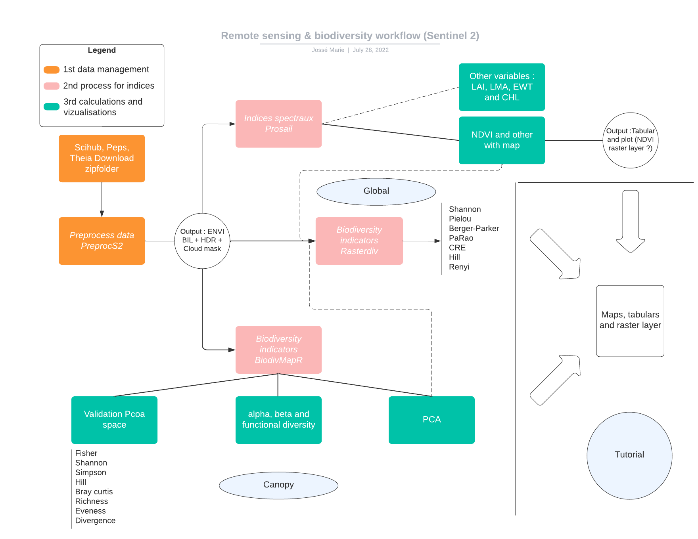
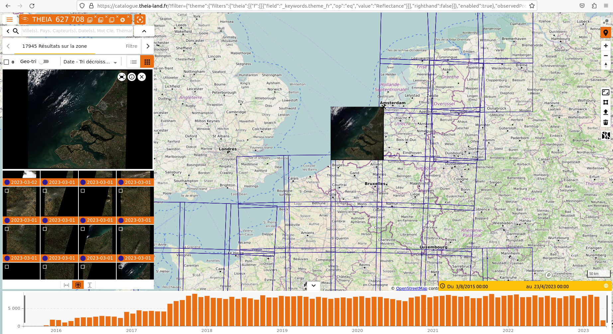
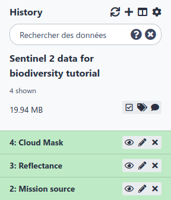
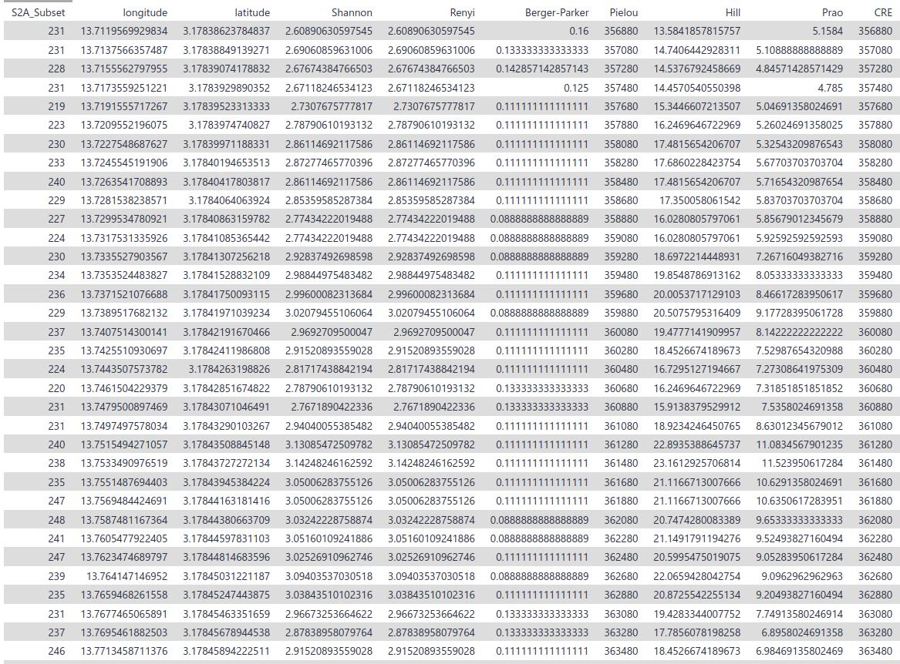
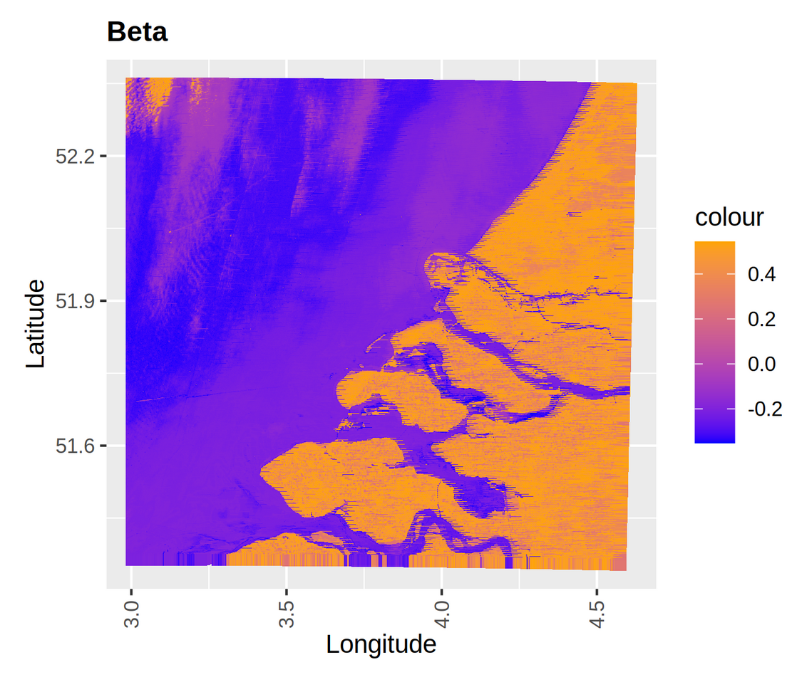
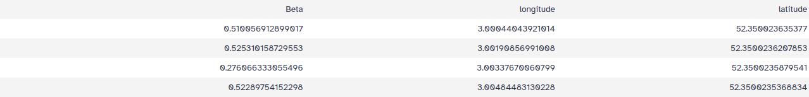
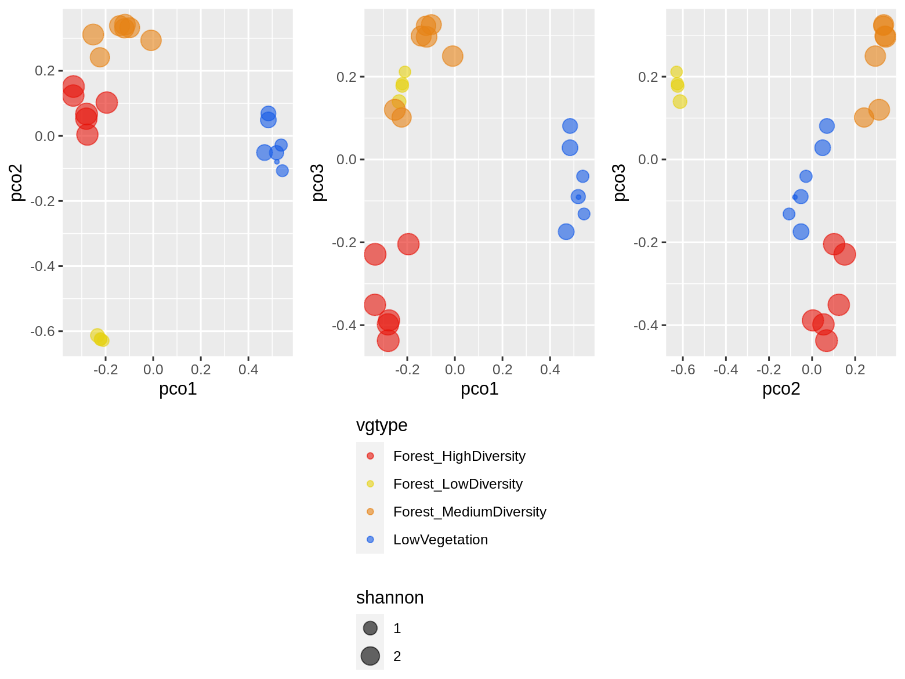
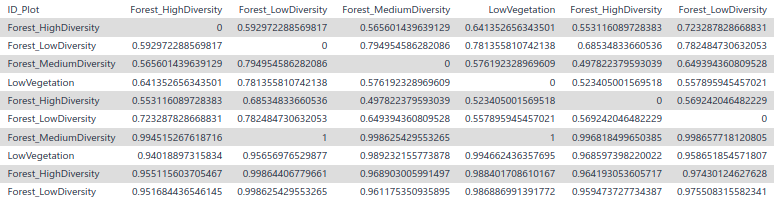
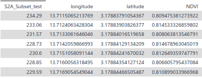
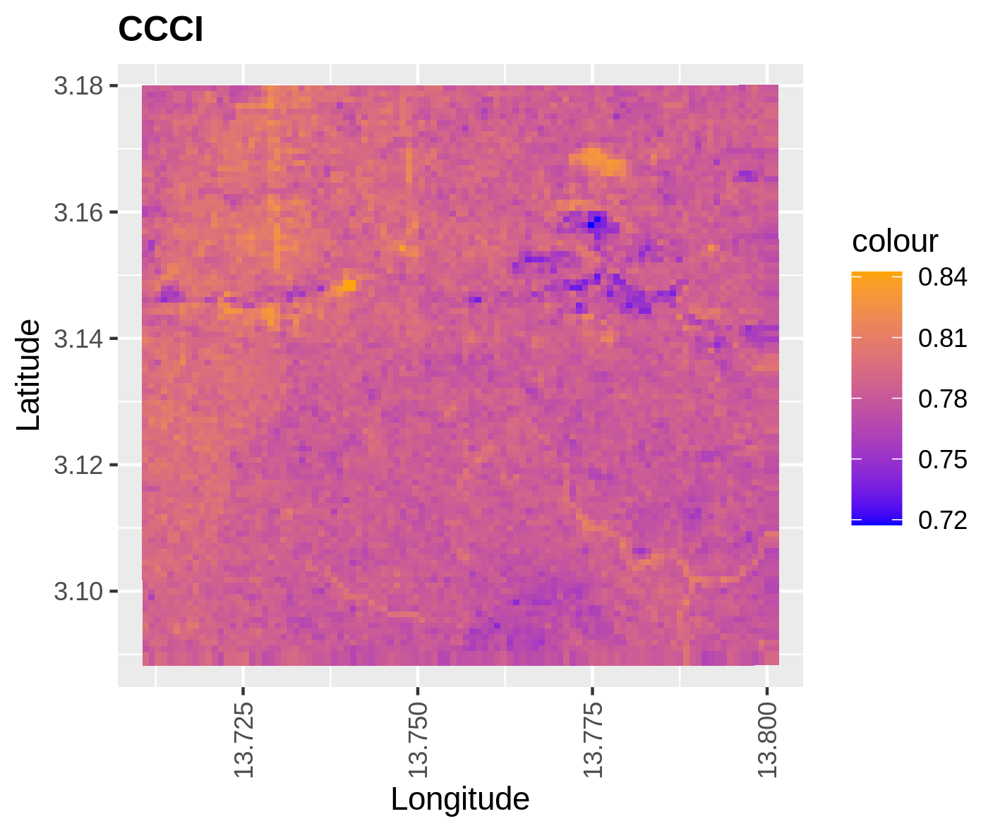

This tutorial will guide you on getting Sentinel 2 data and processing them in order to calculate and visualize biodiversity indicators. This workflow made of 6 tools will allow you to explore Sentinel 2 data in the view of making biodiversity analyses.

Spatial diversity measurements should not replace in situ biodiversity data, but rather complement existing data and approaches. Spatial diversity estimates are currently based on long time scales, allowing more general predictions about rates of change in diversity. In practice, spatial data incorporate information on surface properties, including functional aspects, taxonomy, phylogeny and genetic diversity. 

The tools explained here are useful for observing variations in spatial and temporal ecosystem properties given the intrinsic relationship between spatial variations in ecosystems and pixel values of spectral signals. A single measurement cannot provide a complete description of all the different aspects of ecosystem heterogeneity. Therefore, the combination of multiple tools in a Galaxy-Ecology workflow offers multiple approaches to unravel the complexity of ecosystem heterogeneity in space and time.

So, we will compute biodiversity and spectral indices mainly using reflectance information.

> <details-title>Definition of reflectance</details-title>
>
> The reflectance is a proportion on reflected light on an area. It's the ratio between the electromagnetic incident wave on the area and the reflected wave. It's often a percentage between reflected intensity and incident intensity assumed as energy quantity.
>
{: .details}

Each part of this workflow has elementary steps :
 - **A first step** to preprocess Sentinel 2 data:
   - Preprocess Sentinel 2 data
 - **A second step** to compute biodiversity indicators
   - Global overview
   - For Canopy
 - **A third step** to compute spectral indices:
   - Spectral indices
   - EBV

> <details-title>Details about spectral indices</details-title>
>
> Spectral indices are used to highlight particular features or properties of the earth's surface, e.g. vegetation, soil, water. They are developed on the basis of the spectral properties of the object of interest.
>
> Knowledge of the leaf cell, plant structure, state, condition and spectral properties is essential to perform vegetation analysis using remote sensing data.  
> Spectral indices dedicated to vegetation analysis are developed on the basis that healthy vegetation reflects strongly in the near infrared (NIR) spectrum while absorbing strongly in the visible red.  
>
{: .details}

In this tutorial, we'll be working on Sentinel 2 data extracted from the Theia Land portal.  First those data will be prepared. After pre-processing to fit the input format of the tools, we'll see how to calculate biodiversity metrics.

> <agenda-title></agenda-title>
>
> In this tutorial, we will cover:
>
> 1. TOC
> {:toc}
>
{: .agenda}

> <warning-title>It can take a bit of time</warning-title>
> As your processing heavy data some of the steps can take some time. Notably, the step **Create Biodiversity maps** can run for 2 days. We advise to let it run and proceed with the tutorial. Once, the **pre-processing** part is done all the steps can be done separately. Thus, no need for you to wait the end of each tool before running another one.
{: .warning}

## Upload and pre-processing of the data

This first step consist of downloading and properly prepare the data to use it in Sentinel 2 toolsuite.

> <hands-on-title>Data upload</hands-on-title>
>
> 1. Create a new history for this tutorial and give it a name (example: “Sentinel 2 data for biodiversity tutorial”) for you to find it again later if needed.
>
>    
>
>
> 2. Download the files from [Scihub](https://scihub.copernicus.eu/dhus/#/home), [PEPS](https://peps.cnes.fr/rocket/#/search?maxRecords=50&page=1) or [Theia](https://catalogue.theia-land.fr) :
>
>    You will have to to create an account for either of these platform.
>    Select Reflectance, Sentinel 2 and "Niveau 2A" (level 2A).
>
>    
>
>    This an example of the Theia land portal. You need to download a zip folder. Keep it that way.
>
> 3. Upload the zip folder
>
>    
>
> 4. You can **rename**  the dataset, `sentinel_2_data.zip` for example, and to keep informations about the original name `SENTINEL2A.....zip`
>
>    
>
{: .hands_on}

# Preparing data

Using preprocS2 R package, this step provides a unique tool to read, crop, resample the original image directory, and write it as a raster stack

## Preprocessing sentinel 2 data

> <hands-on-title>Preprocess</hands-on-title>
>
> 1.  with the following parameters:
>    -  *"Input data"*: `sentinel_2_data.zip` (Input dataset)
>    -  *"Where does your data come from ?"*: 'From Theia'
>
> 2. Click on **Execute**
>
>    > <comment-title></comment-title>
>    >
>    > The interesting output is the ENVI image format which is a binary raster file with an accompanying header file. The data are stored as a binary stream of bytes in a BIL file without extension and the metadata are stored in the .hdr file. These data are in the output **Reflectance**. You can directly use the output **Reflectance** for the rest of the analysis.
>    {: .comment}
>
{: .hands_on}

> <question-title></question-title>
>
> 1. What are the files you are interested in for the following tools ?
>
> > <solution-title></solution-title>
> >
> > 1. The 2 files in the **Reflectance** folder that finish by "_Refl" and "_Refl.hdr"
> >
> {: .solution}
>
{: .question}

# Producing biodiversity indicators

You can choose to compute spectral and biodiversity indicators either for global remote sensing data or for a canopy.



<!-- Choose your own adventure path -->

## Compute a PCA

> <hands-on-title>Principal components analysis for remote sensing data</hands-on-title>
>
> 1.  with the following parameters:
>    -  *"In which format are your data ?"*: 'The data you are using are in a zip folder Reflectance'
>      -  *"Input data"*: `Reflectance` (output of **Preprocessing sentinel 2 data** )
>    -  *"Do you want to do a PCA or a SPCA ?"*: 'PCA'
>
>
>    > <tip-title>If you want to use your own files ENVI BIL</tip-title>
>    >
>    > Check that the "Input raster" datatype is bil and that "Input raster header" datatype is hdr
>    >
>    > * Go on your raster data
>    > * Click on  to edit it
>    > * Click on  Datatypes
>    > * On "New Type" **Select** bil
>    > * Press **Save**
>    >
>    >
>    >    > <comment-title></comment-title>
>    >    >
>    >    > Do the same for the raster header with the datatype hdr
>    >    {: .comment}
>    >
>    {: .tip}
>
{: .hands_on}

## Compute biodiversity indices

> <hands-on-title>Biodiversity indicators for global remote sensing data</hands-on-title>
>
> 1.  with the following parameters:
>    -  *"In which format are your data ?"*: 'The data you are using are in a zip folder Reflectance'
>      -  *"Input data"*: `Reflectance` (output of **Preprocessing sentinel 2 data** )
>    -  *"Write a number of the value of alpha"*: '1'
>
>
>    > <tip-title>If you want to use your own files ENVI BIL</tip-title>
>    >
>    > Check that the "Input raster" datatype is bil and that "Input raster header" datatype is hdr
>    >
>    > * Go on your raster data
>    > * Click on  to edit it
>    > * Click on  Datatypes
>    > * On "New Type" **Select** bil
>    > * Press **Save**
>    >
>    >
>    >    > <comment-title></comment-title>
>    >    >
>    >    > Do the same for the raster header with the datatype hdr
>    >    {: .comment}
>    >
>    {: .tip}
>
>
>    > <tip-title>You can use the output of **Compute a PCA**</tip-title>
>    >
>    > -  *"In which format are your data ?"*: 'Your already have the files in ENVI BIL format'
>    > -  *"Input raster"*: `PCA raster` (output of **Compute a PCA** )
>    > -  *"Input header"*: `PCA header` (output of **Compute a PCA** )
>    > -  *"Write a number of the value of alpha"*: '1'
>    >
>    >
>    > Here again check that the "Input raster" datatype is bil and that "Input raster header" datatype is hdr
>    >
>    {: .tip}
>
{: .hands_on}

These 2 pictures are only exemple it is normal if you don't have exactly the same output.

> <question-title></question-title>
>
> 1. How many biodiversity indicators do you have ?
>
> > <solution-title></solution-title>
> >
> > 1. You should have 7 of them (Shannon, Renyi, Prao, Pielou, Hill, CRE, Berger-Parker). If you have only 5 of them, no problem, it just means you data are too small to compute CRE and Pielou but you can still continue your analysis.
> >
> {: .solution}
>
{: .question}

 <!-- end CYOA path -->

<!-- Choose your own adventure path -->

## Compute a PCA

> <hands-on-title>Principal components analysis for remote sensing data</hands-on-title>
>
> 1.  with the following parameters:
>    -  *"In which format are your data ?"*: 'The data you are using are in a zip folder Reflectance'
>      -  *"Input data"*: `Reflectance` (output of **Preprocessing sentinel 2 data** )
>    -  *"Do you want to do a PCA or a SPCA ?"*: 'PCA'
>
>
>    > <tip-title>If you want to use your own files ENVI BIL</tip-title>
>    >
>    > Check that the "Input raster" datatype is bil and that "Input raster header" datatype is hdr
>    >
>    > * Go on your raster data
>    > * Click on  to edit it
>    > * Click on  Datatypes
>    > * On "New Type" **Select** bil
>    > * Press **Save**
>    >
>    >
>    >    > <comment-title></comment-title>
>    >    >
>    >    > Do the same for the raster header with the datatype hdr
>    >    {: .comment}
>    >
>    {: .tip}
>
>
{: .hands_on}

## Create Biodiversity maps

> <hands-on-title>Biodiversity indicators for canopy remote sensing data</hands-on-title>
>
> 1.  with the following parameters:
>    -  *"In which format are your data ?"*: 'The data you are using are in a zip folder Reflectance'
>      -  *"Input data"*: `Reflectance` (output of **Preprocessing sentinel 2 data** )
>    -  *"Alpha, beta, functional diversity and comparison plot and map"*: 'All of the above'
>
>
>    > <tip-title>If you want to use your own files ENVI BIL</tip-title>
>    >
>    > Check that the "Input raster" datatype is bil and that "Input raster header" datatype is hdr
>    >
>    > * Go on your raster data
>    > * Click on  to edit it
>    > * Click on  Datatypes
>    > * On "New Type" **Select** bil
>    > * Press **Save**
>    >
>    >
>    >    > <comment-title></comment-title>
>    >    >
>    >    > Do the same for the raster header with the datatype hdr
>    >    {: .comment}
>    >
>    {: .tip}
>
{: .hands_on}

## Processing remote sensing data

> <hands-on-title>Comparing biodiversity indicators for canopy</hands-on-title>
> 1.  with the following parameters:
>    -  *"In which format are your data ?"*: 'The data you are using are in a zip folder Reflectance'
>      -  *"Input data"*: `Reflectance` (output of **Preprocessing sentinel 2 data** )
>    -  *"Plots folder zip"*: `output` (Input dataset)
>
>    > <comment-title>Shapefiles</comment-title>
>    >
>    > Here you must provide your folder of shapefiles (at least 2 in order to have the beta diversity).
>    {: .comment}
>
>
>    > <comment-title>Check datatype if you use your own ENVI BIL files</comment-title>
>    >
>    > Same as the compute spectral indices make sure you have the right datatypes bil and hdr.
>    {: .comment}
>
{: .hands_on}

> <question-title></question-title>
>
> 1. What kind of data do you need to use these tools ?
> 2. Do you need a shapefile for mapping the diversity ?
> 3. Why do you need multiple locations for comparing biodiversity ?
>
> > <solution-title></solution-title>
> >
> > 1. This analisys is for data on forest, it's a canopy study.
> > 2. No, only for the comparison with in situ data.
> > 3. The Bray curtis table compare the diversity between locations.
> >
> {: .solution}
>
{: .question}

 <!-- end CYOA path -->

# Spectral indices

> <hands-on-title>Compute spectral indices</hands-on-title>
>
> 1.  with the following parameters:
>    -  *"In which format are your data ?"*: 'The data you are using are in a zip folder Reflectance'
>      -  *"Input data"*: `Reflectance` (output of **Preprocessing sentinel 2 data** )
>
>    -  *"Input the type of indice you want"*: 'NDVI'
>
>    -  *"Do you want the raster layer of the indice as an output ?"*: 'No'
>
>
>    > <tip-title>If you want to use your own files ENVI BIL</tip-title>
>    >
>    > Check that the "Input raster" datatype is bil and that "Input raster header" datatype is hdr
>    >
>    > * Go on your raster data
>    > * Click on  to edit it
>    > * Click on  Datatypes
>    > * On "New Type" **Select** bil
>    > * Press **Save**
>    >
>    >
>    >    > <comment-title></comment-title>
>    >    >
>    >    > Do the same for the raster header with the datatype hdr
>    >    {: .comment}
>    >
>    {: .tip}
>
>    > <comment-title></comment-title>
>    >
>    > You can choose whichever indice you want
>    >
>    {: .comment}
>
{: .hands_on}

> <details-title>Spectral indices and Essential Biodiversity Variables</details-title>
>
> Remotely sensed diversity is consistent with most of the essential spatially constrained biodiversity variables proposed by Skidmore et al. (2015). This highlights the need for increased dialogue and collaboration between the biodiversity monitoring community and the remote sensing community to make satellite remote sensing a tool of choice for conservation. Increased dialogue is also essential within the biodiversity monitoring community to achieve this. From this point of view multiple Satellite Remote Sensing EBV (SRS EBV) were created.
> Some of the indices proposed here will allow you to compute  SRS EBV.
> For instance it allows you to compute one of GEO BON EBV [Canopy Chlorophyll Content](https://portal.geobon.org/ebv-detail?id=13). This EBV is computed by GEO BON on the Netherlands, here you can compute it on which ever Sentinel 2 data you want by chosing to calculate the indice CCCI.
{: .details}

> <question-title></question-title>
>
> 1. What's the difference between biodiversity indicators and spectral indices ?
>
> > <solution-title></solution-title>
> >
> > 1. Biodiversity indicators give us informations on the heterogeneity of the landscape whereas spectral indices inform us on the well being of the vegetation.
> >
> {: .solution}
>
{: .question}

# Conclusion

You are now all set to use your remote sensing data in order to do a biodiversity analysis. Before you go on one last reflexion.

> <question-title></question-title>
>
> 1. Should remote sensing replace in-situ data ?
>
> > <solution-title></solution-title>
> >
> > 1. NO ! remote sensing and in-situ data should come and complete one another to have the most complete view of the state of biodiversity.
> >
> {: .solution}
>
{: .question}
