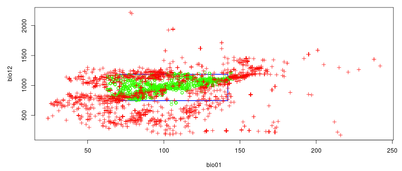

# Introduction

Species Distribution Modeling (SDM) can help understand the distribution of a species depending on its environment. It can also attempt to quantify the impact of climate change on the species habitat, direct conservation efforts and predict invasive species distributions. This is done by associating data of species occurrences (observations) with a set of environmental data (such as temperature and precipitation).

The goal of this tutorial is to model a theoretical ecological niche and predict species distribution in a future climate scenario by using SDM with the Wallace interactive environment on Galaxy. We'll use the data occurrences of US *Chrysemys picta* ([Painted turtle](https://en.wikipedia.org/wiki/Painted_turtle)) from the North America region.

> <agenda-title></agenda-title>
>
> In this tutorial, we will deal with:
>
> 1. TOC
> {:toc}
>
{: .agenda}

# Step 1: Import data from public databank

In this study the datasets are all imported from the [GBIF](https://www.gbif.org/) databanks. It is also possible to import from [bison](https://www.gbif.org/), [iNaturalist](https://www.inaturalist.org/) and others.

> <hands-on-title>Import the data</hands-on-title>
> 1. Create a new history for this tutorial and give it a proper name
>
>    
>    
>
> 2. **Get species occurrences data**  with the following parameters
>    - *"Scientific name"*: `chrysemys picta`
>    - *"Data source"*: `gbif`
>    - *"Number of records to return"*: `10000`
>
> 3. Inspect the generated file with the Scratchbook
{: .hands_on}

We have now a tabular file with about 10,001 lines and many columns.

> <question-title></question-title>
> 1. What do the lines in the files represent?
> 2. What are the columns 1, 2, 3 and 54 of the generated file?
>
> > <solution-title></solution-title>
> > 1. Each line represent an observation of Chrysemys picta, with its location, and some other metadata
> > 2. Column 1 is the name, column 2 the longitude of the observation of Chrysemys picta, column 3 the latitude and column 50 the country code of the location
> {: .solution }
{: .question }

We would to extraction the 4 columns previously cited and keep only occurrence records from US.

> <hands-on-title>Import the data</hands-on-title>
> 1. **Cut columns**  with the following parameters
>    - *"Cut columns"*: `c1,c2,c3,c54`
>    - *"Delimited by"*: `Tab`
>    -  *"From"*: output of **Get species occurrences data**
>
> 2. Inspect the generated file and check the 4 columns
> 3. **Filter data**  with the following parameters
>    -  *"Filter"*: output of **Cut columns**
>    - *"With following condition"*: `c4=='US'`
>    - *"Number of header lines to skip"*: `1`
> 3. Inspect the generated files
>
>    > <question-title></question-title>
>    >
>    > How many occurrences have been conserved?
>    >
>    > > <solution-title></solution-title>
>    > > 63.06% of the occurrences (6,306) are conserved
>    > {: .solution }
>    {: .question}
>
> 4. **Tabular to CSV** 
>    -  *"tabular file"*: output of **Filter**
>    - *"output csv Separator"*: `,`
>    - *"Header in file"*: `Yes`
> 5. Due to an issue related to the actual tabular to csv converter application to GBIF format, each `"` sign is triplicated on the resulting file. You need to replace `"""` by `"` using for example the **Replace**  parts of text tool.
{: .hands_on}

# Step 2: Development and evaluation of SDM using Wallace

[Wallace](https://wallaceecomod.github.io/) is a R Shiny app integrated into Galaxy. It provides an interactive environment for the rapid and effective development and evaluation of SDM, including data download, cleaning, partitioning, modeling, visualisation and predictions.

## Transmit occurrence data from Galaxy to Wallace

With this you can either upload file you've loaded earlier from Galaxy data or you can download data directly from Wallace. Let's use the data from your Galaxy history:

> <hands-on-title>Launch Wallace</hands-on-title>
> 1. Verify your current history is the history containing previous filtered occurences data.
> 2. Open  in Galaxy or click here to [open the tool](https://ecology.usegalaxy.eu/root?tool_id=interactive_tool_wallace) and click on execute
> 3. Go to User > Active InteractiveTools, then click on the active InteractiveTool named `Wallace visualisation`
> 4. In Wallace
>    0. Due to an issue related to last wallace Docker update, a manual fix is proposed waiting for a better solution. You first have to go to the **5 Partition Occs**, selecting *"Spatial Partition"* then for *"Options available"* selecting `Checkerboard 2 (k=4)` then click on the **Partition** button. This will fix the issue so now you have the *"Aggregation Factor"* displayed. Sorry for the inconvenience.
>    1. Go to **1 Occ Data**
>    2. In **Obtain Occurrence Data**
>       - *"Modules Available"*: `Galaxy History User`
>       - *"Select from your Galaxy History User csv file"*: output of **Tabular to CSV**
>       - Click on **Load Occurrences**
{: .hands_on}

In the main panel of Wallace, the data will load. They can now be inspected using the map, the table, etc

You now have your occurrence records on Wallace!

<!--
> <question-title></question-title>
>
> *TODO: Add a questio<F4>n related to the data there*
>
> > <solution-title></solution-title>
> >
> {: .solution }
{: .question}
-->

## Process occurrence data

For the modelling, we need to the choose the occurrences we want to use. There is 4 ways to do it in Wallace in the **2 Process Occ** panel:

1. Selecting occurrences on the map by delimiting an interesting geographic area
2. Removing occurrences by ID
3. Delimiting a spacial thin

   This allow to select occurrences by setting a minimum distance (in km) between the different occurrences. For example, by typing 30km, we will get all the occurrences on the map which are at minimum 30km from each other.

4. Considering all the occurrences

We want to work on the data from the US, we will select the occurrences with the 1st option

> <hands-on-title>Select interesting occurrences</hands-on-title>
> 1. Go to **2 Process Occ**
> 2. In **Process Occurrence Data**
>    - *"Modules Available"*: ` Select Occurrences On Map`
> 3. In the middle panel,
>    1. Click on the polygon icon on the map
>    2. Draw a polygon to delimit the area
> 4. On the left panel, click on **Select Occurrences**
{: .hands_on}

## Obtain Environmental Data

We would like now to provide environmental variables, that are considered relevant for biological purposes. The [Bioclimatic variables](http://www.worldclim.org/bioclim) consist of such original and derived variables. We will associate them with the occurrence data, using the WorldClim Bioclims module.

This module provides a raster with environmental variables from online sources. The raster is composed of environmental information. Each layer of the raster contains a climatic variable: starting from BIO1 = Annual mean temperature, to BIO19 = Precipitation of Coldest Quarter.

> <hands-on-title>Obtain Environmental Data</hands-on-title>
> 1. Go to **3 Env Data**
> 2. In **Obtain Environmental Data**
>    - *"Modules Available"*: `WorldClim Bioclims`
>
>      > <comment-title>Using your own raster</comment-title>
>      > If you prefer to load your own raster:
>      > 1. Import it into Galaxy in the GeoTIFF format
>      > 2. In **Obtain Environmental Data**
>      >    - *"Modules Available"*: `Galaxy History User`
>      >    - *"Select from your Galaxy History User csv file"*: imported GeoTIFF file
>      {: .comment}
>
>    - *"Select WorldClim bioclimatic variable resolution"*: `10 arcmin`
>
>      This is the lowest resolution.
>
> 3. Click on the **Load Env Data**
{: .hands_on}

<!-- **TODO: comment the output / add a question to explain why the next step** -->

## Process environmental Data

Wallace will now associate environmental data and occurrences data to train a model.

1. It first creates a buffer zone around the occurrences

    We can choose the size of the buffer zone to control the area we will be working with and on which a map of suitability will be made.

    Several background extent can be used:
    - Bounding box will define an area where the occurrences centered
    - Minimum convex polygon will make an area considering the repartition of the occurrences
    - Point buffers will use occurrences localities to build a buffer zone around each occurrence

2. It samples Background Points

> <hands-on-title>Obtain Environmental Data</hands-on-title>
> 1. Go to **4 Process Envs**
> 2. In **Process Environmental Data**
>    - *"Modules Available"*: `Select Study Region`
> 3. In **Step 1: Choose Background Extent**
>    - *"Background Extents"*: `Minimum convex polygon`
>    - *"Study region buffer distance (degree)"*: `1`
> 4. Click on **Select**
> 5. In **Step 2: Sample Background Points**
>    - *"No. of background points"*: `100000`
> 6. Click on **Sample**
{: .hands_on}

<!-- **TODO: comment the output / add a question to explain why the next step** -->

## Partition Occurrence Data

By partitioning data, a dataset is divided into subsets (i.e. bins). A model is then built on each of subsets but one and test it on the last one (assuming that all the groups are independent).

There is 2 possible way to partition data:

1. **Non-spatial Partition**: a partition used when there is no bias due to space, time or sampling method
    1. Jakknife (k=n): each occurrence in the dataset is considered as equal to a bin. This is usually used when you have a small dataset with no known bias
    2. Random k-fold: partition the data randomly in a number of bins set by the user with the option `Number of Folds`
2. **Spatial Partition**: a partition used when there could be bias due to time, space or sampling method
    1. Block (k=4): the area is divided in four and the different occurrences are put equally into four bins
    2. Checkerboard 1 (k=2): two bins are used according to the position of the occurrence on the grid
    3. Checkerboard 2 (k=4): four bins are used according to the position of the occurrence on the grid. This require an aggregation factor, which is the size of a second grid put on a first one. For example, with a factor 4, the grids size will be 4x4

         with a factor 4. Source: doi:10.0.4.87/2041-210X.12261")

For both of these techniques the number of occurrences into each bin may vary.

> <hands-on-title>Partition Occurrence Data</hands-on-title>
> 1. Go to **5 Partition Occs**
> 2. In **Partition Occurrence Data**
>    - *"Modules Available"*: `Spatial Partition`
>    - *"Options Available:"*: `Checkerboard 2 (k=4)`
>    - *"Aggregation Factor"*: `6`
> 4. Click on **Partition**
{: .hands_on}

<!-- **TODO: comment the output / add a question to explain why the next step** -->

## Build and Evaluate Niche Model

Wallace can build different models using either:

1. The presence-only approach BIOCLIM (Module BIOCLIM) ()
2. The presence-background (presence-pseudo absence) algorithm Maxent (Module Maxent)

To evaluate these models, Wallace computes the performance on a hold-out dataset (data not used for training) and provide evaluation metrics as the AUC (Area Under the Curve) mean. As a rule of thumb, an AUC of 0.75 and above is considered good, and closer to 1 is better.

> <hands-on-title>Build and evaluate the niche model</hands-on-title>
> 1. Go to **6 Model**
> 2. In **Build and Evaluate Niche Model**
>    - *"Modules Available"*: `BIOCLIM`
> 4. Click on **Run**
{: .hands_on}

<!-- **TODO: comment the output / add a question to explain why the next step** -->

## Visualize Model Results

We would like now to visualize the model of the theoretical niche. First we will make a chart to simulate an ecological niche:
- X-axis: temperature
- Y-axis: the annual precipitation

> <hands-on-title>Visualize Model Results</hands-on-title>
> 1. Go to **7 Visualize**
> 2. In **Visualize Model Results**
>    - *"Modules Available"*: `BIOCLIM Envelope Plots`
>    - *"Axis 1"*: `1`
>    - *"Axis 1"*: `12`
>    - *"Set threshold"*: `0.75`
{: .hands_on}

The optimum environmental parameters for this species (represented in green) is between 5°C and 15°C (on the graph, values are x10) with an annual precipitation between approximately 700mm and 1250mm.

To visualize the suitability on the map, we can use the map prediction module.

> <hands-on-title>Visualize Model Results</hands-on-title>
> 2. In **Visualize Model Results**
>    - *"Modules Available"*: `Map Prediction`
>    - *"Set threshold"*: `No threshold`
>
>      It will display a gradient of predicted presence or use. If you prefer a map with the predicted presence and predicted absence, select `minimum training presence`.
>
> 2. Click on **Plot**
{: .hands_on}

<!-- **TODO: comment the output / add a question to explain why the next step** -->

## Project Model

Wallace can use the trained model to predict possible species distributions in a different area, outside of the sampled one. Here, we will try it for the Canada.

> <hands-on-title>Visualize Model Results</hands-on-title>
> 1. Go to **8 Project**
> 2. In **Project Model**
>    - *"Modules Available"*: `Project to New Extent`
> 3. In the middle panel,
>    1. Click on the polygon icon on the map
>    2. Draw a polygon around a part of Canada
> 2. In **Project Model**
>    - *"Set threshold"*: `Minimum Training Presence`
> 4. Click on **Project**
{: .hands_on}

We can also predict not only for a different area, but also different timing and climate. The [Global Circulation Model (GCM)](https://en.wikipedia.org/wiki/General_circulation_model#Atmospheric_and_oceanic_models) are used here to predict atmospheric fluctuation and then study climate change. Each model is different and use parameters like ocean atmosphere and others. The prediction need also a RCP scenario, a scenarios about the amount of greenhouse gases emitted in the near future. This scenario may have different predicted presence models.

We would like to predict the presence of Chrysemys Picta in Canada in 2050, given the model [CCSM4](http://www.cesm.ucar.edu/models/ccsm4.0/), a US model based on earth circulation, and a RCP value of 2.6 <!--(**TODO: what does that represent?**)-->

> <hands-on-title>Visualize Model Results with a 2.6 RCP</hands-on-title>
> 2. In **Project Model**
>    - *"Modules Available"*: `Project to New Time`
>    - *"Select time period"*: `2050`
>    - *"Select global circulation model"*: `CCSM4`
>    - *"Select RCP"*: `2.6`
>    - *"Select threshold"*: `Minimum Training Presence`
> 4. Click on **Project**
{: .hands_on}

We would like now to compare the prediction for RCP value of 8.5 <!--(**TODO: what does that represent?**)-->.

> <hands-on-title>Visualize Model Results with a 8.5 RCP</hands-on-title>
> 2. In **Project Model**
>    - *"Modules Available"*: `Project to New Time`
>    - *"Select time period"*: `2050`
>    - *"Select global circulation model"*: `CCSM4`
>    - *"Select RCP"*: `8.5`
>    - *"Select threshold"*: `Minimum Training Presence`
> 4. Click on **Project**
{: .hands_on}

<!-- **TODO: comment the output / add a question to compare the 2 predictions**

**TODO: add a section on how to save / download** -->

# Conclusion

Following this tutorial, we have been able here to load a dataset of occurrences used in the shiny app Wallace and model the repartition of *Chrysemys picta* (Painted turtle) with the Species Distribution Modeling (SDM) method. It allowed us to visualize it’s ecological niche and how climate change can influence it’s future repartition on North America. The project saved can help for future similar studies.

> <details-title>Some useful references</details-title>
>
> - Predicting species distributions for conservation decisions ().
> - BIOCLIM: the first species distribution modelling package, its early applications and relevance to most current MAXENT studies. Diversity and Distributions ().
> - ENMeval: An R package for conducting spatially independent evaluations and estimating optimal model complexity for MAXENT ecological niche models. ().
>
> [GCM Guidelines](http://www.ipcc-data.org/guidelines/pages/gcm_guide.html) for informations on Global Circulation Model(GCM), how it's done what is taken in consideration and more.
{: .details}

