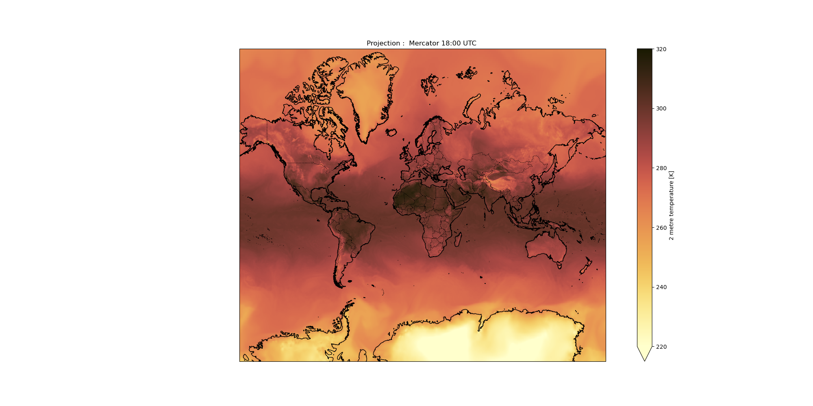
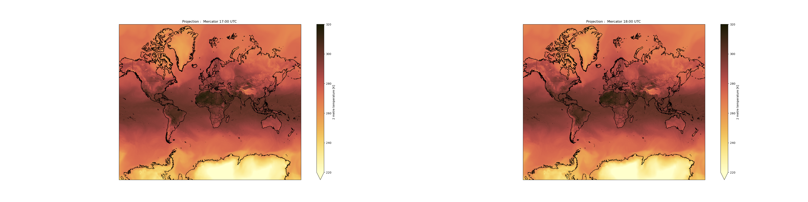

# Introduction
{:.no_toc}

<!-- This is a comment. -->
>###  Comment
>
> The tutorial aims for establishing a good knowledge about meaningful visualization of climate data.
>
{: .comment}

 It is beginner friendly and does not require much knowledge about the tool.

> ### Agenda
>
> In this tutorial we will deal with:
>
> 1. TOC
> {:toc}
>
{: .agenda}

>###  Background
>
>According to [UN](https://www.un.org/en/climatechange/what-is-climate-change) , Climate is the long term shift in temperature and weather patterns which may be due to natural or artificial causes. To learn more about climate, refer this [tutorial](https://training.galaxyproject.org/training-material/topics/climate/tutorials/climate-101/tutorial.html) from the GTN. Due to the frequently changing nature of the weather patterns, the size of the collected data is huge.
The climate data is mainly represented in these three categories : NetCDF (Network Common Data Form), HDF (Hierarchical Data Format) , GRIB (GRIdded Binary or General Regularly-distributed Information in Binary form).
>
>The NetCDF file format is basically used for storing multidimensional data which generally consists of variables such as temperature, precipitation, wind direction, etc. The variation of climate variables over a period of time is suitably plotted using this dataset. The entire earth is divided into both horizontal as well as vertical coordinates which makes plotting of the variables such as the ocean temperatures possible.
>
>The coordinate system, types of projections and colormaps are some of the very important considerations in achieving the most suitable visualization option.


# Plotting air temperature at 2 metres using the ECMWF Reanalysis Data

The data used in this tutorial is ECMWF Reanalysis. We are interested in the following variables: air temperature at 2 metres, latitude, longitude and time. Our main objective is to plot the global air temperature at 2 metres with respect to time. For this we will be using the netCDF xarray tool available in the Galaxy Europe (or your favorite Galaxy Instance) server.

It will be a fun learning experience for anyone who loves visualization ! 

## Get data

> ###  Hands-on: Data upload
>
> 1. Create a new history for this tutorial. Name it as per your choice. My suggestions : *ECMWF_Reanalysis*.
>
>   
>    
>
> 2. Import the files from
>    the remote files
>    ```
>    (`Upload Data` -> `Choose remote files` -> `ECMWF ERA5 Reanalysis` >   ->`2022` -> `05` -> `data` -> `air_temperature_at_2_metres.nc`)
>    ```
>
> 3. Check that the datatype of uploaded data is **netCDF**. 
>
>    
>
>    If it is not `netCDF` make sure to convert it using the Galaxy built-in format converters.
>
>    
>
> 4. Rename Datasets if you find the name to be too long or you have somthing more meaningful in your mind.
>
> 5. Add to each database a tag corresponding to `ecmwf`
>
>    
>
{: .hands_on}

# What is Xarray?
Xarray, formerly known as xray, is a python package which enables us to play with gridded data. This package shares most of its features from numpy, but in a more convenient manner by keeping track of labels in arrays. The gridded data is mainly available in netCDF data format. Thus **xarray comes very handy while dealing with netCDF files.**


## What is Visualisation in Xarray?
Xarray uses **Cartopy** and **Matplotlib** as the two main tools for creating detailed and informative plots.
Cartopy is a python package used for geospatial data analysis. In the Python library, matplotlib is the most used scientific plotting library.
For a multidimensional data consisting of latitudes and longitudes along with the other variables, xarray has the capability of appling cartopy map projections.

# Splitting the dataset  using  seltimestep, splithour and plotting 

After loading the required data, the following stage is to obtain the meta info or meta data of the file. The very purpose of these steps are to obtain the information about dimensions, variables, global attributes, etc. The coordinate info helps to know about the actual data entries present under the various variables.  

Follow the below steps :

## **NetCDF xarray Metadata Info**

> ###  Hands-on: netCDF dataset with Xarray metadata Galaxy Tool
>
> 1.  with the following parameters:
>    -  *"Netcdf file"*: `air_temperature_at_2_metres.nc` .
>
>
> 2. View  the two generated outputs:
>    - `Metadata infos` is a `tabular` providing the list of variables, their dimension names and number of elements per dimension. This file is used by other Xarray Tools. 
>    - The second file `info file` provide a summary of the **Xarray Dataset** contained in your netCDF file.
{: .hands_on}

There are four distinct sections in the `info file` output file:
1. **Dimensions**: the name of the dimension and the number of components that correspond to it;
2. **Coordinates**:  holds the values of coordinate arrays (longitude, latitude, level, and time).
3. **Data variables**: this section provides all of the variables in the dataset. We only have one variable here. We acquire information on the shape and values of each variable.
4. **Global Attributes**:  At this level, we acquire the dataset's global attributes. There is a name and a value for each attribute.


> ###  Questions 
>
> 1. What is the name of the variable for air temperature at 2 metres. What are its physical units?
>
>
> > ###  Solution
> > 1. Information about variable names and units can be found in **info file** that was generated by Xarray metadata Galaxy Tool. 
> >      - Variable name: `air_temperature_at_2_metres`
> >      - Units: `K`
> >
> > 
> > > ###  Output
> > > ```bash
> > > xarray.Dataset {
> > > dimensions:
> > > lat = 721 ;
> > > lon = 1440 ;
> > > time0 = 595 ;
> > > 
> > > 
> > > variables:
> > >   float32 lon(lon) ;
> > >     lon:standard_name = longitude ;
> > >     lon:long_name = longitude ;
> > >     lon:units = degrees_east ;
> > >  
> > >   float32 lat(lat) ;
> > >     lat:standard_name = latitude ;
> > >     lat:long_name = latitude ;
> > >     lat:units = degrees_north ;
> > >  
> > >   datetime64[ns] time0(time0) ;
> > >  		time0:standard_name = time ;
> > >  
> > >  	float32 air_temperature_at_2_metres(time0, lat, lon) ;
> > >  		air_temperature_at_2_metres:standard_name = air_temperature ;
> > >  		air_temperature_at_2_metres:units = K ;
> > >  		air_temperature_at_2_metres:long_name = 2 metre temperature ;
> > >  		air_temperature_at_2_metres:nameECMWF = 2 metre temperature ;
> > >  		air_temperature_at_2_metres:shortNameECMWF = 2t ;
> > >  		air_temperature_at_2_metres:nameCDM = 2_metre_temperature_surface;
> > >  		air_temperature_at_2_metres:product_type = analysis ;
> > >  
> > >  
> > > // global attributes:
> > >  
> > >   :source = Reanalysis ;
> > >   :institution = ECMWF ;
> > > 	:title = ERA5 forecasts ;
> > > }
> > > ```
> > {: .code-out}
> {: .solution }
{: .question }

## Sub-step with **NetCDF xarray Coordinate Info**

> ###  Hands-on:  Get Coordinate information with Xarray Coordinate
>
> 1.  with the following parameters:
>    -  *"Netcdf file"*: `air_temperature_at_2_metres.nc`.
>2. View  the 4 generated outputs:
>    - `lat`: a tabular file containing all the latitude values of our Xarray dataset;
>    - `lon`: a tabular file containing all the longitudes values;
>    - `time0`: this tabular file contains all the forecast times. In our case, these are relative to 25/05/2022, 18:00:00 UTC.;
>    - `version`: this is a text file returning the Xarray package version. It is useful when publishing your Galaxy workflow.
>
>
>    > ###  Comment
>    >
>    >The number of tabular files returned by this programme is proportional to the number of coordinate variables in your input file. No further processing is done after decoding the values from the netCDF input file. As a result, depending on how the original input file was coded, units for latitudes, longitudes, level, and time may differ from one file to the next.
>   
> {: .comment}
>
{: .hands_on}


> ###  Understanding air temperature coordinates at 2 metres
>
>
> 1. What is the format of time coordinate?
> 2. What is the range of values for latitude and longitude?
>
> > ###  Solution
> > 1. The `info file` tells us that `time0` is coded as `timedelta64[ns]` i.e. the time differences are in ns (here in nanoseconds). The format of time is ` sl.no  yy-mm-dd  hh:mm:ss `. If we look at the tabular file named `time0` (generated by `NetCDF xarray Coordinate Info`), we see that these times are automatically converted to human readable time format when printed:
> >
> > > ###  Output
> > > ```bash
> > > 
> > > 0 2022-05-01 00:00:00
> > > 1	2022-05-01 01:00:00
> > > 2	2022-05-01 02:00:00
> > > 3	2022-05-01 03:00:00
> > > 4	2022-05-01 04:00:00
> > > 
> > > ```
> >
> > {: .code-out}
> >
> > This tells us that we have hourly forecast data.
> >
> > 2.If we look at the tabular file named `lat` and `lon` (generated by `NetCDF xarray Coordinate Info`), we see that these files are displayed with sl. nos and corresponding values. From these , we infer that the range of values for `lat` is  `90.0`  to `-90.0`and for `lon` is `0` to ` 359.75`.  
> >
> {: .solution }
{: .question }

## Operations on Climate data using **CDO Operations**

> ###  Hands-on: Defining a particular time range using seltimestep 
>
> 1.  with the following parameters:
>    - In *"CDO Operators"*:
>        -  *"Insert CDO Operators"*
>            - *"Select cdo operator"*: `seltimestep (Select timesteps)`
>                - *"Timesteps for selection"*: `594/595`
>                -  *"Additional input file"*: `air_temperatures_at_2_metres.nc`
>
>   Our main aim is to plot the last two hour data on the last day present in the dataset. The data present is in the form of daily hourly time frame. Thus we need to split the dataset into smaller part upto which we want to plot. 
>
>
>
>    > ###  Comment
>    >
>    > The syntax of using the `seltimestep` is `(initial data number / final data entry)`. An important thing to pay attention is how your data entries are number: are they numbered starting from 0 or 1. Accordingly we can add or skip adding 1 to the data number to attain the desired result.
> {: .comment}
>
{: .hands_on}


>###  Splitting the dataset into individual datasets
>
> 1. How will you plot the last two hours separately?
> 
>
> > ###  Splithour
> >
> > 1.  with the following parameters:
> >- In *"CDO Operators"*:
> >       -  *"Insert CDO Operators"*
> >  - *"Select cdo operator"*: `splithour (Split hours)`
> >               -  *"Additional input file"*: `outfile.netcdf` generated from the previous step.
> >
> >
> {: .solution}
>
{: .question}


## Finding the  **NetCDF xarray Metadata Info**

> ###  Hands-on: netCDF dataset with Xarray metadata Galaxy Tool for the hourly plots
>
> 1.  with the following parameters:
>    -  *"Netcdf file"*: `outfile_17.nc`. The meta data generated from this step can be used for second file too due to same meta-data of both the datasets(which is quite obvious).
>
>
> 2. View  the two generated outputs:
>    - `Metadata infos` is a `tabular` providing the list of variables, their dimension names and number of elements per dimension. This file is used by other Xarray Tools. 
>    - The second file `info file` provide a summary of the **Xarray Dataset** contained in your netCDF file.
{: .hands_on}
## Map Plotting using **NetCDF xarray map plotting**

> ###  Hands-on: Map Plotting
> The air temperatures in the last two hours of the day are plotted here : 
>
> 1.  with the following parameters:
>    - 
*"Netcdf file"*: `outfile_17.nc`
>    -  *"Tabular of variables"*: `Metadata infos from outfile_17.nc` (output of **NetCDF xarray Metadata Info** >)
>    - *"Choose the variable to plot"*: `air_temperature_at_2_metres`
>    - *"Name of latitude coordinate"*: `lat`
>    - *"Name of longitude coordinate"*: `lon`
>    - *"Datetime selection"*: `No`
>    - *"Range of values for plotting e.g. minimum value and maximum value (minval,maxval) (optional)"*: `220,320`
>    - *"Add country borders with alpha value [0-1] (optional)"*: `1.0`
>    - *"Add coastline with alpha value [0-1] (optional)"*: `1.0`
>    - *"Add ocean with alpha value [0-1] (optional)"*: `1.0`
>    - *"Specify plot title (optional)"*: `Projection :  Mercator 17:00 UTC `
>    - *"Specify which colormap to use for plotting (optional)"*: `lajolla`
>    - *"Specify the projection (proj4) on which we draw e.g. {"proj":"PlateCarree"} with double quote (optional)"*: `{'proj': 'Mercator', 'central_longitude': 12.0}`
>
>
>
>    > ###  Why shifting longitudes?
>    >
>    > Longitudes are measured in degrees from 0 to 360. We need to change longitudes so that `NetCDF xarray map plotting` can properly plot our dataset because we don't have worldwide data but only cover Europe.
>    {: .comment}
>
> 
{: .hands_on}


> ###  Questions
>
> 1. What are the different kinds of projections and colormaps that can be used?
>
> > ###  Solution
> >
> > 1.There are many projections which can be used in the `NetCDF xarray map plotting` tool. Find here a list of valid projections. Different projections have different purposes and need to be carefully chosen. Follow this sheet to [find the syntax for projections](https://github.com/Quickbeasts51429/xarray_projection). 
> > 
>> When it comes to conveying the correct information, through visualisation, colors play a major role. Suppose you want to display a cold region, its an obvious practice of using cooler tones such as a `blue`. Thus it is important to understand the choices we have. Find the [complete documentation of ColorMaps available here](https://github.com/Quickbeasts51429/Xarray_ColorMaps/blob/main/index.md)
> >
> {: .solution}
>
{: .question}

## Sub-step with **NetCDF xarray map plotting**

> ###  Hands-on: Task description
>
> 1.  with the following parameters:
>    - 
*"Netcdf file"*: `outfile_18.nc`
>    -  *"Tabular of variables"*: `Metadata infos from outfile_17.nc` (output of **NetCDF xarray Metadata Info** )
>    - *"Choose the variable to plot"*: `air_temperature_at_2_metres`
>    - *"Name of latitude coordinate"*: `lat`
>    - *"Name of longitude coordinate"*: `lon`
>    - *"Datetime selection"*: `No`
>    - *"Range of values for plotting e.g. minimum value and maximum value (minval,maxval) (optional)"*: `220,320`
>    - *"Add country borders with alpha value [0-1] (optional)"*: `1.0`
>    - *"Add coastline with alpha value [0-1] (optional)"*: `1.0`
>    - *"Add ocean with alpha value [0-1] (optional)"*: `1.0`
>    - *"Specify plot title (optional)"*: `Projection :  Mercator 18:00 UTC `
>    - *"Specify which colormap to use for plotting (optional)"*: `lajolla`
>    - *"Specify the projection (proj4) on which we draw e.g. {"proj":"PlateCarree"} with double quote (optional)"*: `{'proj': 'Mercator', 'central_longitude': 12.0}`
>
>
>
{: .hands_on}


> ###  Questions
>
> 1. What insights can be driven from the data and how is the data important on a local level?
> 2. What are some giveaways from the tutorial ?
>
> > ###  Solution
> >
> > 1. Every piece of data recites a story. The air temperature at a certain height has a lot of significance in major commercial and day to day activities. Read this data-blog on the above analysis. [Click Here](https://quickbeasts51429.github.io/Outreachy_Galaxy_Community_contributor/).
> > 2. The tutorial has summed up a proper way of plotting data from a netcdf file. It has discussed everything from loading of data to its final display. Some other key points to keep in mind are : 
> > > 1. It may take some time while plotting the maps. It depends on traffic / load on the Galaxy server. It is suggested to have a 64-bit processor with 8GB RAM storage. Be patient.
> > > 2.  You can view as well as download the generated plots to use further. 
> > > 3. Plotting over global maps is very convinient as you saw above. But many a times,  you want to plot a specific region, it becomes very easy using CDO tool.Refer to [this tutorial](https://training.galaxyproject.org/training-material/topics/climate/tutorials/pangeo/tutorial.html) for more info.
> >
> > 3. If you wish to present all the plotted maps at one place for comparision or analysis. It is a short and simple step and can be dne as shown below. 
> > 
> >  with the following parameters:
> >   -  *"Images"*: `Map plots`
> >   -  *"# of images wide"*: `2`
> > 
> > 
> >
> >Not much of changes can be seen in the both plots as they are just an hour apart but one thing can be concluded that African- Saharan regions have high temperatures during the dusk.
> {: .solution}
>
{: .question}


# Conclusion
{:.no_toc}

We have learnt about the `xarray map plotting tool` dealing with the `netcdf data set`. The tutorial also discussed about the types of climate datasets. One of the tutorial is info about usage of different [colormaps](https://github.com/Quickbeasts51429/Xarray_ColorMaps/blob/main/index.md#color-maps) and [projections](https://github.com/Quickbeasts51429/xarray_projection) in xarray. 
