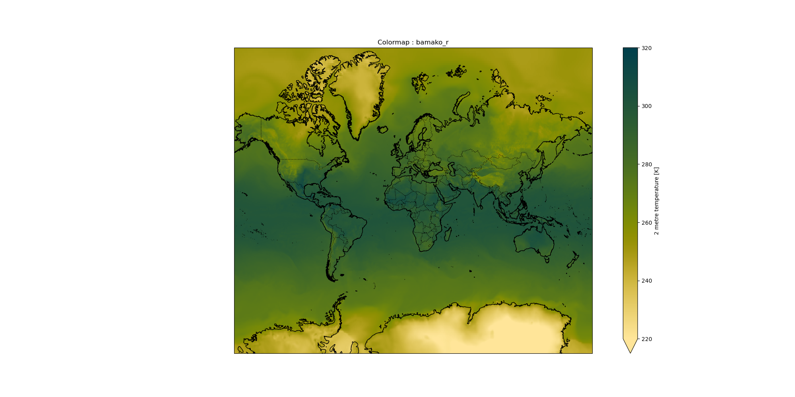
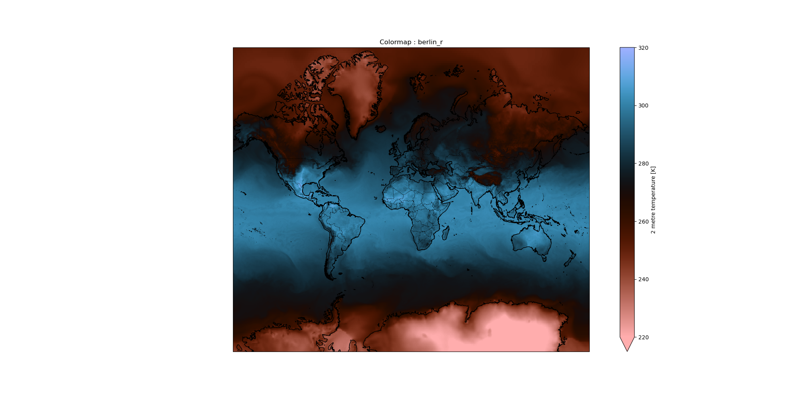
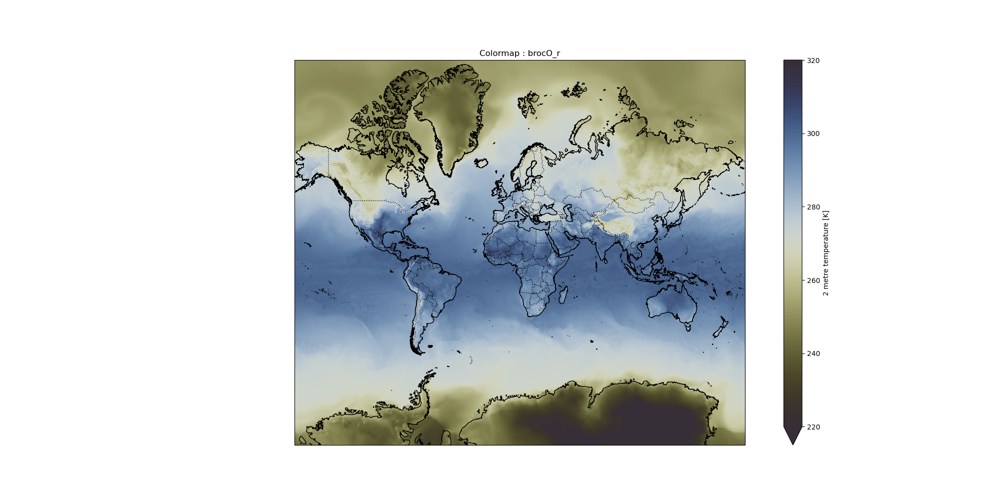
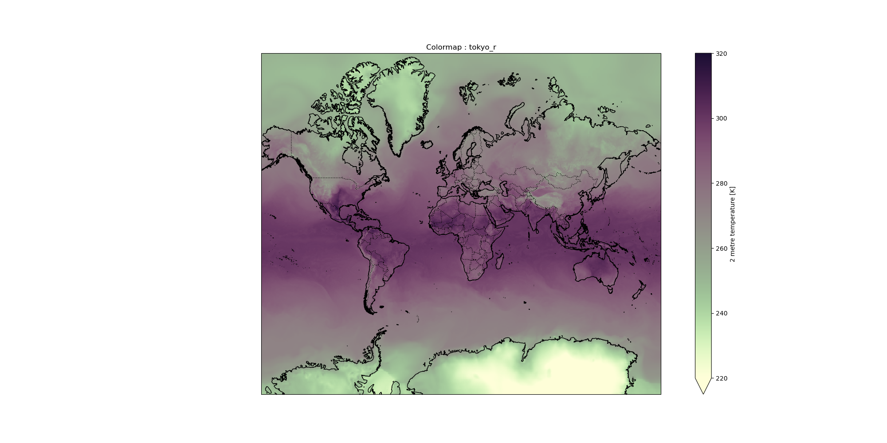

><comment-title></comment-title>
>
> The tutorial aims for establishing a good knowledge about meaningful visualization of climate data.
>
{: .comment}

 It is beginner friendly and does not require much knowledge about the tool.

> <agenda-title></agenda-title>
>
> In this tutorial we will deal with:
>
> 1. TOC
> {:toc}
>
{: .agenda}

><comment-title>Background</comment-title>
>
>According to [UN](https://www.un.org/en/climatechange/what-is-climate-change) , Climate is the long term shift in temperature and weather patterns which may be due to natural or artificial causes. To learn more about climate, refer this [tutorial]() from the GTN. Due to the frequently changing nature of the weather patterns, the size of the collected data is huge.
The climate data is mainly represented in these three categories : [NetCDF](https://en.wikipedia.org/wiki/NetCDF) (Network Common Data Form), [HDF](https://en.wikipedia.org/wiki/Hierarchical_Data_Format) (Hierarchical Data Format) , [GRIB](https://en.wikipedia.org/wiki/GRIB) (GRIdded Binary or General Regularly-distributed Information in Binary form).
>
>The NetCDF file format is basically used for storing multidimensional data which generally consists of variables such as temperature, precipitation, wind direction, etc. The variation of climate variables over a period of time is suitably plotted using this dataset. The entire earth is divided into both horizontal as well as vertical coordinates which makes plotting of the variables such as the ocean temperatures possible.
>
>The coordinate system, types of projections and colormaps are some of the very important considerations in achieving the most suitable visualization option.
{: .comment}


# Introduction

The data used in this tutorial is [ECMWF Reanalysis 5 hourly data on single levels](https://cds.climate.copernicus.eu/cdsapp#!/dataset/reanalysis-era5-single-levels?tab=overview). We are interested in the following variables: air temperature at 2 metres, latitude, longitude and time. Our main objective is to plot the global air temperature at 2 metres with respect to time. For this we will be using the netCDF xarray tool available in the Galaxy Europe (or your favourite Galaxy Instance) server.

It will be a fun learning experience for anyone who loves visualization !

# Get data

> <hands-on-title>Data upload</hands-on-title>
>
> 1. Create a new history for this tutorial. Name it as per your choice. My suggestions : *ECMWF_Reanalysis*.
>
>    
>
> 2. **Import remote files**
>    - location: `ECMWF ERA5 Reanalysis` ->`2022` -> `05` -> `data` -> `air_temperature_at_2_metres.nc`
>
>    
>
>    **or**, if this is not available, you can import from [Zenodo]({{page.zenodo_link}}):
>
>     ```
>     https://zenodo.org/record/6621460/files/air_temperature_at_2_metres.netcdf
>     ```
>
>    
>
>
> 3. **Check the datatype** of uploaded data, it should be `netCDF`.
>    -  If it is not `netCDF`, make sure to convert it using the Galaxy built-in format converters.
>
>    
>
> 4. **Rename Datasets**  if you find the name to be too long or you have something more meaningful in your mind.
>
> 5. **Tag Datasets**  with the tag `#ecmwf`
>
>    
>
{: .hands_on}

# What is xarray?

[xarray](https://docs.xarray.dev/en/stable/), formerly known as xray, is a python package which enables us to play with gridded data. This package shares most of its features from [numpy](https://numpy.org/), but in a more convenient manner by keeping track of labels in arrays. The gridded data is mainly available in netCDF data format. Thus **xarray comes very handy while dealing with netCDF files.**


## What is Visualisation in xarray?

xarray uses **[Cartopy](https://scitools.org.uk/cartopy/docs/latest/)** and **[Matplotlib](https://matplotlib.org/)** as the two main tools for creating detailed and informative plots.
Cartopy is a python package used for geospatial data analysis. In the Python library, matplotlib is the most used scientific plotting library.
For a multidimensional data consisting of latitudes and longitudes along with the other variables, xarray has the capability of appling cartopy map projections.

# Splitting the dataset  using  seltimestep, splithour and plotting

After loading the required data, the following stage is to obtain the meta info or meta data of the file. The very purpose of these steps are to obtain the information about dimensions, variables, global attributes, etc. The coordinate info helps to know about the actual data entries present under the various variables.

Follow the below steps:

## **NetCDF xarray Metadata Info**

> <hands-on-title>netCDF dataset with xarray metadata Galaxy Tool</hands-on-title>
>
> 1. In the tools search for  with the following parameter:
>    -  *"Netcdf file"*: `air_temperature_at_2_metres.nc`
>  and click on `Execute`.
>
> 2. View  the two generated outputs:
>    - `Metadata infos` is a `tabular` providing the list of variables, their dimension names and number of elements per dimension. This file is used by other xarray Tools.
>    - The second file `info file` provides a summary of the **xarray Dataset** contained in your netCDF file.
{: .hands_on}


> <question-title></question-title>
>
> 1. What is the name of the variable for air temperature at 2 metres. What are its physical units?
>
>
> > <solution-title></solution-title>
> > 1. Information about variable names and units can be found in **info file** that was generated by xarray metadata Galaxy Tool.
> >      - Variable name: `air_temperature_at_2_metres`
> >      - Units: `K`
> >
> >
> > > <code-out-title></code-out-title>
> > > ```bash
> > > xarray.Dataset {
> > > dimensions:
> > > lat = 721 ;
> > > lon = 1440 ;
> > > time0 = 595 ;
> > >
> > >
> > > variables:
> > >   float32 lon(lon) ;
> > >     lon:standard_name = longitude ;
> > >     lon:long_name = longitude ;
> > >     lon:units = degrees_east ;
> > >
> > >   float32 lat(lat) ;
> > >     lat:standard_name = latitude ;
> > >     lat:long_name = latitude ;
> > >     lat:units = degrees_north ;
> > >
> > >   datetime64[ns] time0(time0) ;
> > >  		time0:standard_name = time ;
> > >
> > >  	float32 air_temperature_at_2_metres(time0, lat, lon) ;
> > >  		air_temperature_at_2_metres:standard_name = air_temperature ;
> > >  		air_temperature_at_2_metres:units = K ;
> > >  		air_temperature_at_2_metres:long_name = 2 metre temperature ;
> > >  		air_temperature_at_2_metres:nameECMWF = 2 metre temperature ;
> > >  		air_temperature_at_2_metres:shortNameECMWF = 2t ;
> > >  		air_temperature_at_2_metres:nameCDM = 2_metre_temperature_surface;
> > >  		air_temperature_at_2_metres:product_type = analysis ;
> > >
> > >
> > > // global attributes:
> > >
> > >   :source = Reanalysis ;
> > >   :institution = ECMWF ;
> > > 	:title = ERA5 forecasts ;
> > > }
> > > ```
> > {: .code-out}
> {: .solution }
{: .question }

## Sub-step with **NetCDF xarray Coordinate Info**

> <hands-on-title> Get Coordinate information with xarray Coordinate</hands-on-title>
>
> 1.  with the following parameters:
>    -  *"Netcdf file"*: `air_temperature_at_2_metres.nc`.
>2. View  the 4 generated outputs:
>    - `lat`: a tabular file containing all the latitude values of our Xarray dataset;
>    - `lon`: a tabular file containing all the longitudes values;
>    - `time0`: this tabular file contains all the times extracted from the netCDF file. In our case, these are relative to 01/05/2022, 00:00:00 UTC;
>    - `version`: this is a text file returning the xarray package version. It is useful when publishing your Galaxy workflow.
>
{: .hands_on}

> <comment-title></comment-title>
>
>The number of tabular files returned by this programme is proportional to the number of coordinate variables in your input file. No further processing is done after decoding the values from the netCDF input file. As a result, depending on how the original input file was coded, units for latitudes, longitudes, (level, if this dimension was present, which is not the case in this particular case) and time may differ from one file to the next.
>
{: .comment}


> <question-title>Understanding air temperature coordinates at 2 metres</question-title>
>
>
> 1. What is the format of time coordinate?
> 2. What is the range of values for latitude and longitude?
>
> > <solution-title></solution-title>
> > 1. The `info file` tells us that `time0` is coded as `timedelta64[ns]` i.e. the time differences are in ns (here in nanoseconds). The format of time is `yy-mm-dd  hh:mm:ss`. If we look at the tabular file named `time0` (generated by `NetCDF xarray Coordinate Info`), we see that these times are automatically converted to human readable time format when printed:
> >
> > > <code-out-title></code-out-title>
> > > ```
> > > 0  2022-05-01 00:00:00
> > > 1  2022-05-01 01:00:00
> > > 2  2022-05-01 02:00:00
> > > 3  2022-05-01 03:00:00
> > > 4  2022-05-01 04:00:00
> > > ```
> > >
> > {: .code-out}
> >
> > This tells us that we have hourly forecast data.
> >
> > 2.If we look at the tabular file named `lat` and `lon` (generated by `NetCDF xarray Coordinate Info`), we see that these files are displayed with two columns e.g. index numbers and corresponding values. From these, we infer that the range of values for `lat` is  `90.0`  to `-90.0`and for `lon` is `0` to `359.75`.
> >
> {: .solution }
{: .question }


## Operations on Climate data using **CDO Operations**

We have hourly data. In order to plot it, we must first extract the hours from the bigger dataset. This is done using the `seltimestep` and the `splithour` options available in the `CDO Operations` tool. `splithour` is used when we wish to plot more than an hour. Our main aim is to plot the last hour data on the last day present in the dataset.

> <hands-on-title>Defining a particular time range using seltimestep </hands-on-title>
>
> 1.  with the following parameters:
>    - In *"CDO Operators"*:
>        -  *"Insert CDO Operators"*
>            - *"Select cdo operator"*: `seltimestep (Select timesteps)`
>            - *"Timesteps for selection"*: `744/744`
>            -  *"Additional input file"*: `air_temperatures_at_2_metres.nc`
>
>
>
> > <comment-title></comment-title>
> >
> > The syntax of using the `seltimestep` is `(initial data number / final data entry)`. An important thing to pay attention to is how the data entries are numbered: are they numbered starting from 0 or 1. Accordingly we can add or skip adding 1 to the data number to achieve the desired result.
> >
Although we are not using `splithour` here, you can find below the syntax for future uses.
> >
> >1.  with the following parameters:
> >- In *"CDO Operators"*:
> >-  *"Insert CDO Operators"*
> >- *"Select cdo operator"*: `splithour (Split hours)`
> >-  *"Additional input file"*: `outfile.netcdf` generated from the previous step.
> >
> > This step generates that `N` number of `outfiles.netcdf` files where `N` is the range of selection.
> > Suppose your selected range was `744/744` for the `seltimestep` , then it will generate `2` files which can be plotted further.
> >
> {: .comment}
>
{: .hands_on}


## Finding the  **NetCDF xarray Metadata Info**

> <hands-on-title>netCDF dataset with xarray metadata Galaxy Tool for the hourly plots</hands-on-title>
>
> 1.  with the following parameters:
>    -  *"Netcdf file"*: `outfile.netcdf`. .
>
> 2. View  the two generated outputs:
>    - `Metadata infos` is a `tabular` providing the list of variables, their dimension names and number of elements per dimension. This file is used by other xarray Tools.
>    - The second file `info file` provide a summary of the **xarray Dataset** contained in your netCDF file.
{: .hands_on}

# Map Plotting using **NetCDF xarray map plotting**

> <hands-on-title>Plotting the data of the last hour of the day</hands-on-title>
> The air temperatures corresponding to the 744th time step from the original netCDF file, namely `23:00:00` for 31st May 2022 is plotted here :
>
> 1.  with the following parameters:
>    -  *"Netcdf file"*: `outfile.netcdf`
>    -  *"Tabular of variables"*: `Metadata infos from outfile.netcdf` (output of **NetCDF xarray Metadata Info** >)
>    - *"Choose the variable to plot"*: `air_temperature_at_2_metres`
>    - *"Name of latitude coordinate"*: `lat`
>    - *"Name of longitude coordinate"*: `lon`
>    - *"Datetime selection"*: `No`
>    - *"Range of values for plotting e.g. minimum value and maximum value (minval,maxval) (optional)"*: `220,320`
>    - *"Add country borders with alpha value [0-1] (optional)"*: `1.0`
>    - *"Add coastline with alpha value [0-1] (optional)"*: `1.0`
>    - *"Add ocean with alpha value [0-1] (optional)"*: `1.0`
>    - *"Specify plot title (optional)"*: `Air_temperature_at_2_metres___23:00:00_UTC`
>    - *"Specify which colormap to use for plotting (optional)"*: `lajolla`
>    - *"Specify the projection (proj4) on which we draw e.g. {"proj":"PlateCarree"} with double quote (optional)"*: `{'proj': 'Mercator'}`
>
> 
>
>
{: .hands_on}

> <details-title>Syntax for Projections</details-title>
> **Xarray Map Plotting** comes with a variety of projections. There are basically four types of projections available namely **Azimuthal, Conic, Cylindrical and Pseudo-cylindrical.**
>
>The **Azimuthal projection** depicts the surface of the earth with the help of a flat plane. It is also known as '**Plane Projection**.' This simple projection type forms a family of projections by considering the poles in "normal aspect." Another form of this projection is **Azimuthal Equidistant Projection**. It preserves both directions and distance from the central point of the earth. The **stereographic projection** which is a type of azimuthal projection was created before 150AD and deployed while mapping areas over the poles.
> The **conic type** is based on the concept of projecting the surface of the Earth on a conical surface which is unrolled into a plane  surfaced map. Some of the examples of conic type of projections are : **Albers Equal Area Conic, Equidistant Conic, Lambert Conformal Conic, and Polyconic**. This type of projection basically has a big implementation in aviation navigation.
>
>
> The **cylindrical type** is based on the concept of plotting the geographical features on the surface of the cylinder and then it is unrolled to present as a **flat projection**. Some examples of cylindrical projections are : **Cylindrical Equal Area, Behrmann Cylindrical Equal-Area , Stereographic Cylindrical, Peters, Mercator, and Transverse Mercator**. **Mercator** is one of the most famous and preferred type of projection. The straight lines (Rhumb Lines) are best for the navigation process.
>
> In the **pseudo cylindrical** type of projection , the meridians are straight instead of being curved. These kinds of projections are characterised by straight horizontal lines for parallels of latitude and (usually) equally-spaced curved meridians of longitude. **Oval projections** pinched or flattened at the poles are its identifying features.
>
>
> **Projections**:
>
> There are about **30** different kinds of projections available in the proj option. The basic knowledge of projections is very essential in plotting out the best fit map. Below is the list of plots deployed using the various kinds of projections supported by the NetCDF xarray mapplotting tool.
>
>
> **PlateCarree**
>**Syntax: {"proj":"PlateCarree"}**
>
>
> **EquidistantConic**
>**Syntax: {"proj":"EquidistantConic", "central_longitude": 20.0, "central_latitude": 70.0 }**
>
>
> **AlbersEqualArea**
> **Syntax: {"proj":"AlbersEqualArea", "central_longitude": 20.0, "central_latitude": 70.0 }**
> 
>
> **EuroPP**
> **Syntax: {"proj":"EuroPP"}**
> 
>
> **LambertConformal**
> **Syntax:{"proj":"LambertConformal"  }**
> 
>
> **AzimuthalEquidistant**
> **Syntax: {"proj":"AzimuthalEquidistant" }**
> 
>
> **LambertCylindrical**
> **Syntax:{"proj":"LambertCylindrical"}**
> 
>
> **Mercator**
> **Syntax: {"proj":"Mercator" }**
> 
>
> **Miller**
> **Syntax: {"proj":"Miller"  }**
> 
>
> **Mollweide**
> **Syntax: {"proj":"Mollweide" }**
> 
>
> **Orthographic**
> **Syntax:{"proj":"Orthographic"  }**
> 
>
> **Robinson**
> **Syntax: {"proj":"Robinson"  }**
> 
>
> **Sinusoidal**
> **Syntax: {"proj":"Sinusoidal"  }**
> 
>
> **Stereographic**
> **Syntax: {"proj":"Stereographic"  }**
> 
>
> **TransverseMercator**
> **Syntax:{"proj":"TransverseMercator"  }**
> 
>
> **InterruptedGoodeHomolosine**
> **Syntax: {"proj":"InterruptedGoodeHomolosine"  }**
> 
>
> **RotatedPole**
> **Syntax: {"proj":"RotatedPole"  }**
> 
>
> **OSGB**
> **Syntax:{"proj":"OSGB"  }**
> 
>
> **Geostationary**
> **Syntax: {"proj":"Geostationary"  }**
> 
>
> **NearsidePerspective**
> **Syntax:{"proj":"NearsidePerspective" }**
> 
>
> **EckertI**
> **Syntax: {"proj":"EckertI" }**
> 
>
> **EckertII**
> **Syntax: {"proj":"EckertII" }**
> 
>
> **EckertIII**
> **Syntax: {"proj":"EckertIII" }**
> 
>
> **EckertIV**
> **Syntax: {"proj":"EckertIV" }**
> 
>
> **EckertV**
> **Syntax: {"proj":"EckertV" }**
> 
>
> **EckertVI**
> **Syntax: {"proj":"EckertVI" }**
> 
>
> **EqualEarth**
> **Syntax:{"proj":"EqualEarth" }**
> 
>
> **Gnomonic**
> **Syntax: {"proj":"Gnomonic" }**
> 
>
> **LambertAzimuthalEqualArea**
> **Syntax: {"proj":"LambertAzimuthalEqualArea" }**
> 
>
> **NorthPolarStereo**
> **Syntax: {"proj":"NorthPolarStereo" }**
> 
>
> **OSNI**
> **Syntax: {"proj":"OSNI" }**
> 
>
> **SouthPolarStereo**
> **Syntax: {"proj":"SouthPolarStereo" }**
> 
>
{: .details}


> <question-title></question-title>
>
> What are the different kinds of projections that can be used?
>
> > <solution-title></solution-title>
> >
> > There are many projections which can be used in the `NetCDF xarray map plotting` tool. Different projections have different purposes and need to be carefully chosen.
> >
> > Plotting different projections using **NetCDF xarray map plotting**:
> > > <hands-on-title>Plotting the major projections using the xarray tool.</hands-on-title>
> > >
> > > 1.  with the following parameters:
> > >    -  *"Netcdf file"*: `outfile.netcdf`
> > >    -  *"Tabular of variables"*: `Metadata infos from outfile.netcdf` (output of **NetCDF xarray Metadata Info** )
> > >    - *"Choose the variable to plot"*: `air_temperature_at_2_metres`
> > >    - *"Name of latitude coordinate"*: `lat`
> > >    - *"Name of longitude coordinate"*: `lon`
> > >    - *"Datetime selection"*: `No`
> > >    - *"Range of values for plotting e.g. minimum value and maximum value (minval,maxval) (optional)"*: `220,320`
> > >    - *"Add country borders with alpha value [0-1] (optional)"*: `1.0`
> > >    - *"Add coastline with alpha value [0-1] (optional)"*: `1.0`
> > >    - *"Add ocean with alpha value [0-1] (optional)"*: `1.0`
> > >    - *"Specify plot title (optional)"*: `Air_temperature_at_2_metres___23:00:00_UTC_InterruptedGoodeHomolosine`
> > >    - *"Specify which colormap to use for plotting (optional)"*: `lajolla`
> > >    - *"Specify the projection (proj4) on which we draw e.g. {"proj":"PlateCarree"} with double quote (optional)"*: `{"proj":"InterruptedGoodeHomolosine" }`
> > >
> > >
> > >
> > > The final plot is shown below:
> > >
> > > 
> > >
> > >
> > >
> > > Some other potentially interesting types of projections can be found below :
> > >
> > > *{"proj":"LambertCylindrical" }*
> > > 
> > > *{"proj":"Orthographic"  }*
> > > 
> > > *{"proj":"Sinusoidal" }*
> > > 
> > > *{"proj":"EquidistantConic"}*
> > > 
> > > *{"proj":"LambertConformal" }*
> > > 
> > > *{"proj":"AzimuthalEquidistant" }*
> > > 
> > {: .hands_on}
> {: .solution}
{: .question}


> <details-title>Available ColorMaps</details-title>
> There are about **150 different kinds of maps available in the  colormaps** options. This document contains a list of all the types of projections and colormaps available to the users while using the Xarray Map Plotting. These depict the global air temperature at 2 metres on a Kelvin Scale of range 220 K TO 320 K. Let's get started!
> Below is the complete list for reference.
>
> **ACCENT**
> 
>  **BLUES**
> 
>  **BrBg**
> 
>  **BuGn**
> 
>  **BuPu**
> 
>  **CMRmap**
> 
>  **Dark2**
> 
>  **Acton**
> 
>  **Acton_r**
> 
>  **Afmhot**
> 
>  **Autumn**
> 
>  **Bam**
> 
>  **BamO**
> 
>  **BamO_r**
> 
>  **Bamako**
> 
>  **Bamako_r**
> 
>  **Batlow**
> 
>  **BatlowK**
> 
>  **BatlowK_r**
> 
>  **BatlowW**
> 
>  **BatlowW_r**
> 
>  **Batlow_r**
> 
>  **Berlin**
> 
>  **berlin_r**
> 
>  **Bilbao**
> 
>  **Bilbao_r**
> 
>  **Binary**
> 
>  **Bone**
> 
>  **Brg**
> 
>  **Broc**
> 
>  **BrocO**
> 
>  **BrocO_r**
> 
>  **Broc_r**
> 
>  **Buda**
> 
>  **Buda_r**
> 
>  **Bukavu**
> 
>  **Bukavu_r**
> 
>  **Bwr**
> 
>  **Cool**
> 
>  **Coolwarm**
> 
>  **Copper**
> 
>  **Cork**
> 
>  **CorkO**
> 
>  **CorkO_r**
> 
>  **Cork_r**
> 
>  **Cubehelix**
> 
>  **Davos**
> 
>  **GnBu**
> 
>  **Greens**
> 
>  **Greys**
> 
>  **Imola**
> 
>  **OrRd**
> 
>  **Oranges**
> 
>  **Paired**
> 
>  **Pastel1**
> 
>  **Pastel2**
> 
>  **Davos_r**
> 
>  **Devon_r**
> 
>  **Devon**
> 
>  **Fes**
> 
>  **Fes_r**
> 
>  **Flag**
> 
>  **Gist_earth**
> 
>  **Gist_gray**
> 
>  **Gist_heat**
> 
>  **Gist_ncar**
> 
>  **Gist_rainbow**
> 
>  **Gist_stern**
> 
>  **Gist_yarg**
> 
>  **Gnuplot**
> 
>  **Gnuplot2**
> 
>  **Gray**
> 
>  **GrayC**
> 
>  **GrayC_r**
> 
>  **Hawaii**
> 
>  **Hawaii_r**
> 
>  **Hot**
> 
>  **Hsv**
> 
>  **Imola_r**
> 
>  **Jet**
> 
>  **Lajolla**
> 
>  **Lajolla_r**
> 
>  **Lapaz**
> 
>  **Lapaz_r**
> 
>  **Lisbon**
> 
>  **Lisbon_r**
> 
>  **Nipy_spectral**
> 
>  **Nuuk**
> 
>  **Nuuk_r**
> 
>  **Ocean**
> 
>  **Oleron**
> 
>  **Oslo**
> 
>  **Oslo_r**
> 
>  **Pink**
> 
>  **PRGn**
> 
>  **PiYG**
> 
>  **PuBu**
> 
>  **PuBuGn**
> 
>  **PuOr**
> 
>  **PuRd**
> 
>  **Purples**
> 
>  **RdBu**
> 
>  **RdBu_r**
> 
>  **RdBu_r**
> 
>  **RdGy_r**
> 
>  **RdPu**
> 
> **RdPu_r**
> 
> **RdYIBu**
> 
> **RdYIGn**
> 
> **Reds**
> 
> **Set1**
> 
> **Set2**
> 
> **Set3**
> 
> **Spectral**
> 
> **Wistia**
> 
> **YIGn**
> 
> **YIGnBu**
> 
> **YIOrBr**
> 
> **YIOrRd**
> 
> **Prism**
> 
> **Rainbow**
> 
> **Roma**
> 
> **RomaO**
> 
> **RomaO_r**
> 
> **Roma_r**
> 
> **Seismic**
> 
> **Spring**
> 
> **Summer**
> 
> **Tab10**
> 
> **Tab20**
> 
> **Tab20b**
> 
> **Tab20c**
> 
> **Terrain**
> 
> **Tofino**
> 
> **Tofino_r**
> 
> **Tokyo**
> 
> **Tokyo_r**
> 
> **Turku**
> 
> **Turku_r**
> 
> **Vanimo**
> 
> **Vanimo_r**
> 
> **Vik**
> 
> **VikO**
> 
> **VikO_r**
> 
> **Vik_r**
> 
> **Winter**
> 
>
{: .details}

> <question-title></question-title>
>
> 1. What are the different kinds of colormaps that can be used?
>
> > <solution-title></solution-title>
> >
> >When it comes to conveying the correct information, through visualisation, colors play a major role. Suppose you want to display a cold region, its an obvious practice of using cooler tones such as a `blue`. Thus it is important to understand the choices we have.
> >
> >
> >## Plotting different colormaps using **NetCDF xarray map plotting**
 > > > <hands-on-title>Plotting the major colormaps using the xarray tool.</hands-on-title>
> > >
> > > 1.  with the following parameters:
> > >    -  *"Netcdf file"*: `outfile.netcdf`
> > >    -  *"Tabular of variables"*: `Metadata infos from outfile.netcdf` (output of **NetCDF xarray Metadata Info** )
> > >    - *"Choose the variable to plot"*: `air_temperature_at_2_metres`
> > >    - *"Name of latitude coordinate"*: `lat`
> > >    - *"Name of longitude coordinate"*: `lon`
> > >    - *"Datetime selection"*: `No`
> > >    - *"Range of values for plotting e.g. minimum value and maximum value (minval,maxval) (optional)"*: `220,320`
> > >    - *"Add country borders with alpha value [0-1] (optional)"*: `1.0`
> > >    - *"Add coastline with alpha value [0-1] (optional)"*: `1.0`
> > >    - *"Add ocean with alpha value [0-1] (optional)"*: `1.0`
> > >    - *"Specify plot title (optional)"*: `Air_temperature_at_2_metres___23:00:00_UTC_batlow`
> > >    - *"Specify which colormap to use for plotting (optional)"*: `batlow`
> > >
> > >    - *"Specify the projection (proj4) on which we draw e.g. {"proj":"PlateCarree"} with double quote (optional)"*: `{'proj': 'Mercator'}`
> > >
> > >
> > > The final plot is shown below:
> > >    
> > >Some other important color variants of the same map can be found below :
> > > - *colormap : oslo*
> > >
> > >  - *colormap : bamako*
> > >
> > >  - *colormap : vik*
> > >
> > > - *colormap : tokyo*
> > >
> > > - *colormap : hawaii*
> > >
> > {: .hands_on}
> >
> >
> >
> {: .solution}
>
{: .question}


> <question-title></question-title>
>
> 1. What insights can be driven from the data and how is the data important on a local level?
> 2. What are some giveaways from the tutorial ?
>
> > <solution-title></solution-title>
> >
> > 1. Every piece of data recites a story. The air temperature at a certain height has a lot of significance in major commercial and day to day activities. Read this data-blog on the above analysis. [Click Here](https://quickbeasts51429.github.io/Outreachy_Galaxy_Community_contributor/).
> > 2. The tutorial has summed up a proper way of plotting data from a netcdf file. It has discussed everything from loading of data to its final display. Some other key points to keep in mind are :
> > > 1. It may take some time while plotting the maps. It depends on traffic / load on the Galaxy server. It is suggested to have a 64-bit processor with 8GB RAM storage. Be patient.
> > > 2.  You can view as well as download the generated plots to use further.
> > > 3. Plotting over global maps is very convinient as you saw above. But many a times,  you want to plot a specific region, it becomes very easy using CDO tool. Refer to [this tutorial]() for more info.
> >
> > 3. If you wish to present all the plotted maps at one place for comparision or analysis. It is a short and simple step and can be doe using the tool name `Image Montage`.
> >
> >  with the following parameters:
> >   -  *"Images"*: `Map plots`
> >   -  *"# of images wide"*: `4`
> > Here you can see that all the projections we plotted above have been shown in a single image using `Image Montage`.
> > 
> {: .solution}
>
{: .question}


# Conclusion

We have learnt about the `xarray map plotting tool` dealing with the `netcdf data set`. The tutorial also discussed about the types of climate datasets. One of the tutorial is info about usage of different [colormaps](https://github.com/Quickbeasts51429/Xarray_ColorMaps/blob/main/index.md#color-maps) and [projections](https://github.com/Quickbeasts51429/xarray_projection) in xarray.
