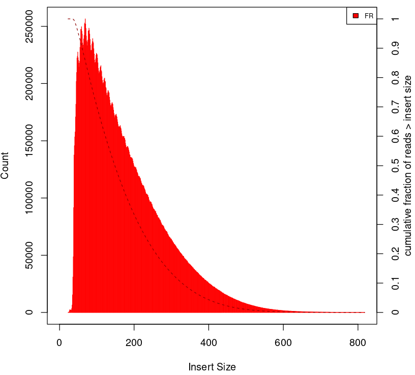

# Introduction
{:.no_toc}

In many eukaryotic organisms, such as humans, the genome is tightly packed and organized with the help of nucleosomes (heterochromatin). A nucleosome is a complex formed by eight histone proteins that is wrapped with DNA. If the DNA is transcribed into RNA, the DNA will be opened and loosened from the nucelosome complex (euchromatin). Many factors, such as the chromatin structure, the position of the nucleosomes, and histone modifications, play an important role in the organization and accessibility of the DNA. Consequently, these factors are also important for the activation and inactivation of genes. **Assay for Transposase-Accessible Chromatin with high-throughput sequencing (ATAC-Seq)** is a method to investigate the accessibility of the chromatin and thus a method to fathom regulatory mechanisms of the gene expression. The method can help to find potential promoter regions including enhancers and silences. A promoter is the potential starting and regulatory site of the gene. An enhancer, often located in the promoter or the downstream area of the gene, can increase the transcription of a gene. In contrast, a silencer decreases or inhibits the gene expression.


In order to find chromatin accesible (open) region, the genome is treated with an enzmye called Tn5, which is a transposase. A [transposase](https://en.wikipedia.org/wiki/Transposase) can bind to a [transposable element](https://en.wikipedia.org/wiki/Transposable_element), which is DNA sequence that can change its position within a genome. Read the two links to get a deeper insight. Intutively these are sequences that jump in t he genome. With the help of Tn5 we introduce adapters to genome. Concurrently, the DNA is sheared by the transposase activity. As a result, we obtain reads from an open chromatin regions. ATAC-Seq uses paired end reads. That means, two reads with two different adapters span a certain distance. However, we also have reads from closed chromatin regions, that is to say, read pairs that span at least one nucleosome or more. As you can imagine these read pairs span a bigger distance that the read pairs from open chromatin regions. Thus, we can filter based on this distance later on. After the Tn5 treatment, the read library is prepared for sequencing, including PCR amplification and purification steps.

## Data
In this training material we will use data from human. The original dataset had 2 x 200 million reads. This would be too long to be processed in a training session. So, we downsampled the original dataset to 200,000 reads but added about 200,000 reads pairs that will map to chr22 to have a good profile on this chromosome similar to a 2 x 20 million reads original fastq. Furthermore, we want to compare the predicted open chromatin regions to known binding sites of a transcriptional repressor called [CTCF](https://en.wikipedia.org/wiki/CTCF). This will help us to find potential sites that are in accordance to potential silencer regions. For that reason, we will download predicted sites of CTCF from ENCODE (ENCSR361KVZ, dataset ENCFF049IPS).


> ### Agenda
>
> In this tutorial, we will cover:
>
> 1. TOC
> {:toc}
>
{: .agenda}

# Title for your first section

## Get Data

We first need to download the dataset that we downsampled as well as other annotations files. Then, to increase the number of reads that will map to the assembly (here Human genome version 38), we need to preprocess the reads.


> ###  Hands-on: Data upload
>
> 1. Create a new history for this tutorial
>
>    
>
> 2. Import the files from [Zenodo](https://zenodo.org/record/3270536) and [ENCODE](https://www.encodeproject.org/experiments/ENCSR361KVZ/) or from the shared data library
>
>    ```
>    https://zenodo.org/record/3270536/files/SRR891268_R1.fastq.gz
>    https://zenodo.org/record/3270536/files/SRR891268_R2.fastq.gz
>    https://www.encodeproject.org/files/ENCFF049IPS/@@download/ENCFF049IPS.bed.gz
>    ```
>
>    
>    
>
> 3. Rename the datasets
> 4. Check that the datatype
>
>    
>
> 4. Check that the datatype of the 2 fastq files is fasqsanger.gz
>
>    
>
{: .hands_on}

> ###  FASTQ format
> If you are not familiar with FASTQ format, see the [Quality Control tutorial]({{ site.baseurl }})
{: .comment}
>
> ###  BED format
> If you are not familiar with bed format, see the [BED Format](https://genome.ucsc.edu/FAQ/FAQformat.html)
{: .comment}

> ###  Hands-on: Obtain Annotation of hg38 (bed file of genes)
>
> 1. **UCSC Main**  with the following parameters:
>    - *"clade"*: `Mammal`
>    - *"genome"*: `Human`
>    - *"assembly"*: `Dec. 2013 (GRCh38/hg38)`
>    - *"group"*: `Genes and Gene Prediction`
>    - *"track"*: `GENCODE v29`
>    - *"table"*: `knownGene`
>    - *"output format"*: `BED - browser extensible data`
>    - *"Send output to"*: `Galaxy`
> 2. Click **get output**
> 3. Click **Send query to Galaxy**
{: .hands_on}

## Quality Control

The first step is to check the quality of the reads and the presence of the Nextera adapters. When we do ATAC-Seq, two transposase could cut the DNA about 40 bp apart. This can be smaller than the sequencing length so we expect to have Nextera adapters at the end of those reads. We can do this with `FastQC`. The FastQC web page **Adapter Content** section shows the presence of Nextera Transposase Sequence in the reads. We will remove the adapters with Cutadapt.

> ###  Hands-on: Task description
>
> 1. **FastQC**  with the default parameters:
>       - *"Short read data from your current history"*: Choose here either only the `SRR891268_R1.fastq.gz` file with  or use  **Multiple datasets** to choose both `SRR891268_R1.fastq.gz` and `SRR891268_R2.fastq.gz`.
> 2. Inspect the web page output of **FastQC**  for the `SRR891268_R1` sample. Check which are the adapters found at the end of the reads.
>
>    > ###  Comment
>    >
>    > How many reads are in the FASTQ?
>    >
>    > > ###  Solution
>    > >
>    > > There are 285247 reads.
>    > >
>    > {: .solution}
>    >
>    >
>    > Which are the steps which have a warning?
>    >
>    > > ###  Solution
>    > >
>    > > 1) Per base sequence content
>    > > > ###  Tn5 sequence bias
>    > > > It is well known that the tn5 have a strong sequence bias at the insertion site. You can have more information about it reading [Green et al. 2012](https://mobilednajournal.biomedcentral.com/articles/10.1186/1759-8753-3-3)
>    > > {: .comment}
>    > >
>    > > 2) Sequence Duplication Levels
>    > > > ###  PCR Duplicates
>    > > > The read library quite often has PCR duplicates that are introduced
>    > > > simply by the PCR itself. We will remove these duplicates later on.
>    > > {: .comment}
>    > >
>    > > 3) Overrepresented sequences
>    > > > ###  Adapter Sequences
>    > > > Adapter sequences that are also observable in the **Adapter Content**
>    > > > are registered by FastQC.
>    > > {: .comment}
>    > >
>    > {: .solution}
>    >
>    {: .question}
{: .hands_on}

> ###  FastQC Results
> This is what you should expect from the adapter section:
> 
{: .comment}

## Trimming Reads

To trim the adapters we provide the Nextera adapter sequences to `Cutadapt`. These adapters are shown in the image below.


The forward and reverse adapters are slightly different. We will also trim low quality bases at the ends of the reads (quality less than 20). We will only keep reads that are at least 20 bases long. Shorter reads will either be thrown out by the mapping or disturb our results at
the end.


> ###  Hands-on: Task description
>
> 1. **Cutadapt**  with the following parameters:
>    - *"Single-end or Paired-end reads?"*: `Paired-end`
>        -  *"FASTQ/A file #1"*: select `SRR891268_R1.fastq.gz`
>        -  *"FASTQ/A file #2"*: select `SRR891268_R2.fastq.gz`
>        - In *"Read 1 Options"*:
>            - In *"3' (End) Adapters"*:
>                -  *"Insert 3' (End) Adapters"*
>                    - *"Source"*: `Enter custom sequence`
>                        -  *"Enter custom 3' adapter name (Optional if Multiple output is 'No')"*: `Nextera R1`
>                        -  *"Enter custom 3' adapter sequence"*: `CTGTCTCTTATACACATCTCCGAGCCCACGAGAC`
>        - In *"Read 2 Options"*:
>            - In *"3' (End) Adapters"*:
>                -  *"Insert 3' (End) Adapters"*
>                    - *"Source"*: `Enter custom sequence`
>                        -  *"Enter custom 3' adapter name (Optional)"*: `Nextera R2`
>                        -  *"Enter custom 3' adapter sequence"*: `CTGTCTCTTATACACATCTGACGCTGCCGACGA`
>    - In *"Filter Options"*:
>        -  *"Minimum length"*: `20`
>    - In *"Read Modification Options"*:
>        -  *"Quality cutoff"*: `20`
>    - In *"Output Options"*:
>        - *"Report"*: `Yes`
>
> 2. Click on the  (eye) icon of the report and read the first lines.
{: .hands_on}

> ###  Cutadapt Results
> This is what you should get from Cutadapt in the log:
> 
{: .comment}

> ###  Questions
>
> 1. Which portion of reads contains adapters?
> 2. How many reads were still longer than 20 after the trimming?
>
> > ###  Solution
> >
> > 1. 15%
> > 2. 284,864 (99.9%)
> >
> {: .solution}
>
{: .question}

> ###  Hands-on: Check Adapter Removal with FastQC
>
> 1. **FastQC**  with the default parameters:
>       - *"Short read data from your current history"*: select the output of **Cutadapt**  **Multiple datasets** to choose both `Read 1 Output` and `Read 2 Output`.
>
> 2. Click on the  (eye) icon of the report and read the first lines.
{: .hands_on}

> ###  FastQC Results
> If we run `FastQC` again we should see under **Adapter Content** that the Nextera adapters are no longer present. Indeed this is what we have obtained when we ran it:
> 
{: .comment}

# Mapping

## Mapping Reads to Reference Genome

Next we map the trimmed reads to the human reference genome. Here we will use `Bowtie2`. We use extended the maximum fragment length from 500 to 1000 because we know some valid pairs goes to this fragment length. We use the present **--very-sensitive** to have more chance to get the best match even if it is a bit longer. We run the **end-to-end** mode because we trimmed the adapters so we do not expect the read not to map fully.

> ###  Hands-on: Mapping reads to reference genome
>
> 1. **Bowtie2**  with the following parameters:
>    - *"Is this single or paired library"*: `Paired-end`
>        -  *"FASTQ/A file #1"*: select the output of **Cutadapt**  *"Read 1 Output"*
>        -  *"FASTQ/A file #2"*: select the output of **Cutadapt**  *"Read 2 Output"*
>        - *"Do you want to set paired-end options?"*: `Yes`
>            - *"Set the maximum fragment length for valid paired-end alignments"*: `1000`
>            - *"Allow mate dovetailing"*: `Yes`
>    - *"Will you select a reference genome from your history or use a built-in index?"*: `Use a built-in genome index`
>        - *"Select reference genome"*: ``
>    - *"Set read groups information?"*: `Do not set`
>    - *"Select analysis mode"*: `1: Default setting only`
>        - *"Do you want to use presets?"*: `Very sensitive end-to-end (--very-sensitive)`
>    - *"Do you want to tweak SAM/BAM Options?"*: `No`
>    - *"Save the bowtie2 mapping statistics to the history"*: `Yes`
>
> 2. Click on the  (eye) icon of the mapping stats.
{: .hands_on}

> ###  Bowtie2 Results
> This is what you should get from the Bowtie2 log:
> 
{: .comment}

> ###  Questions
>
> 1. What is the proportion of pairs which mapped concordantly?
>
> > ###  Solution
> >
> > 1. 53.85+43.40=97.25%
> >
> {: .solution}
>
{: .question}

> ###  Comment on the number of uniquely mapped.
>
> You could be surprised by the number of uniquely mapped compared to the number of multi-mapped reads.
> One of the reason is that we have used the parameter **--very-sensitive**. Bowtie2 considers a read as multi-mapped even if the second hit has a much lower quality than the first one.
> Another reason is, that we have reads that map to the mitochondrial genome. The mitochondrial genome has a lot of other places where a read could map.
>
{: .comment}

# Filtering Mapped Reads

## Filter Reads

We apply some filters to the reads after the mapping. ATAC-seq datasets can have a lot of reads that map to the mitchondrial genome. The mitchondrial genome is uninteresting for ATAC-Seq, thus we remove these reads. We also remove reads with low mapping quality and reads that are not properly paired.

> ###  Hands-on: Task description
>
> 1. **Filter** BAM datasets on a variety of attributes  with the following parameters:
>    -  *"BAM dataset(s) to filter"*: Select the output of  **Bowtie2**  *"alignments"*
>    - In *"Condition"*:
>        -  *"Insert Condition"*
>            - In *"Filter"*:
>                -  *"Insert Filter"*
>                    - *"Select BAM property to filter on"*: `mapQuality`
>                        - *"Filter on read mapping quality (phred scale)"*: `>=30`
>                -  *"Insert Filter"*
>                    - *"Select BAM property to filter on"*: `isProperPair`
>                        - *"Select properly paired reads"*: `Yes`
>                -  *"Insert Filter"*
>                    - *"Select BAM property to filter on"*: `reference`
>                        - *"Filter on the reference name for the read"*: `!chrM`
>    - *"Would you like to set rules?"*: `No`
>
>
> 2. Click on the input and the output BAM files of the filtering step. Check the size of the files.
>
{: .hands_on}

> ###  Questions
>
> 1. Based on the files size, what proportion of alignment were removed?
> 2. Which parameter should be modified if I am interested in repetitive regions?
>
> > ###  Solution
> >
> > 1. The original BAM file is 28 MB, the filtered one is 14.8 MB. Approximately half of the alignments were removed.
> > > ###  Tip: Getting the number of reads which mapped on chrM
> > >
> > > To get the number of reads per chromosome you can run **Samtools idxstats**  on the output of  **Bowtie2**  *"alignments"*.
> > > The columns of the output are: chromosome name, chromosome length, number of reads mapping to the chromosome, number of unaligned mate whose mate is mapping to the chromosome.
> > > The first 2 lines of the result would be (after sorting):
> > >
> > > 
> > >
> > > There are 221 000 reads which map to chrM and 170 000 which map to chr22.
> > {: .tip}
> >
> > 1. Most of these removed alignments mapped to chrM.
> > 2. You should modify the mapQuality criteria and decrease the threshold.
> >
> {: .solution}
>
{: .question}

## Filter Duplicate Reads

Because of the PCR amplification, there might be PCR duplicates which would over amplify some genomic regions. As the Tn5 insertion is random within an accessible region, we do not expect to see fragments with the same coordinates. We consider that such fragments to be PCR duplicates. We will remove them with `Picard`.

> ###  Hands-on: Remove duplicates
>
> 1. **MarkDuplicates**  with the following parameters:
>    -  *"Select SAM/BAM dataset or dataset collection"*: Select the output of  **Filter**  *"BAM"*
>    - *"If true do not write duplicates to the output file instead of writing them with appropriate flags set"*: `Yes`
>
>    > ###  Comment: Default of  **MarkDuplicates** 
>    >
>    > By default, the tool will only "Mark" the duplicates. This means that it will change the Flag of the duplicated reads to be able to filter them afterwards. We use the parameter *"If true do not write duplicates to the output file instead of writing them with appropriate flags set"* to directly remove the duplicates.
>    {: .comment}
>
> 2. Click on the  (eye) icon of the MarkDuplicate metrics.
{: .hands_on}

> ###  MarkDuplicates Results
> This is what you should get from the MarkDuplicates log:
> 
{: .comment}

> ###  Tip: Getting the header for the data of the MarkDuplicate metrics
> You can copy/paste the 2 lines with header and data in an excel sheet.
> Replace `Unknown Library` by `Unknown_Library` in the second line.
> Then do Text to Columns (it is space delimited data). You should check the box for Treat consecutive delimiters as one.
> Now you should have:
>
> 
>
{: .tip}

> ###  Questions
>
> 1. How many pairs were in the input?
> 2. How many pairs are duplicates?
>
> > ###  Solution
> >
> > 1. 132911
> > 2. 3515
> >
> {: .solution}
>
{: .question}

## Check Insert Sizes

We will check the insert sizes (the distance between the first and second read) with `Picard CollectInsertSizeMetrics`. This is a very good indication of the quality of the ATAC-Seq.

> ###  Hands-on: Plot the distribution of fragment sizes.
>
> 1. **CollectInsertSizeMetrics**  with the following parameters:
>    -  *"Select SAM/BAM dataset or dataset collection"*: Select the output of  **MarkDuplicates**  *"BAM output"*
>    - *"Load reference genome from"*: `Local cache`
>        - *"Using reference genome"*: `Human Dec. 2013 (GRCh38/hg38) (hg38)`
>
> 2. Click on the  (eye) icon of the upper one of the 2 outputs (the pdf file).
{: .hands_on}

> ###  CollectInsertSizeMetrics Results
> This is what you get from CollectInsertSizeMetrics:
> 
{: .comment}

> ###  Questions
>
> 1. Except the first peak, which peak corresponds to our insert size? Could you guess the size of the DNA protected by a nucleosome?
>
> > ###  Solution
> >
> > 1. A bit less than 200bp. This is exactly the distance where both Tn5 cuts were in the same accessible chromatin depleted region of the nucleosome. Other peaks correspond to events where at least one nucleosome was between the 2 cuts of Tn5.
> >
> {: .solution}
>
{: .question}

This fragment size distribution is a good indication if your experiment worked or not.
In absence of chromatin (without nucleosome), this is the profiles you would get:




Here are examples of Fragment size distributions of ATAC-Seq which were very noisy:


A final example of a Fragment size distribution of a very good ATAC-Seq, even if we cannot see the third nucleosome "peak".


> ###  Comment on fr and rf
>
> FR stands for forward reverse orientation of the read pairs, meaning, your reads are oriented as -> <- so the first read is on the forward and the second on the reverse strand. RF stands for reverse forward oriented, i.e., <- ->. It really depends on your experiment, how your reads are oriented and if the orientation plays a role.
{: .comment}

# Peak calling

## Call Peaks

We are now finished with the data preprocessing. Now, in order to find regions corresponding to potential open chromatin regions, we need a tool that can identify differntial covered regions. That is to say, we have to estimate the background read coverage and compare it
with each read stack to find out if some read stacks (peaks) are bigger than the background (enriched). We use `Genrich` for that reason. It is very important at this point that we center the reads on the 5' extermity (where the Tn5 cut). You want actually your peaks around the nucleosomes and not directly on the nucleosome:


If we only make a coverage of 5' extremities, the data would be too parse and it would be impossible to call peaks. Thus, we will make a coverage of 5' extremities extended to 100 bp in each direction.

> ###  Comment on Tn5 insertion
>
> When Tn5 staggers to an accessible chromatin locus, it will join the Mosaic Ends (which will be used to make the library) to the top and bottom 3'OH extremity of a 9 bp DNA molecule  [Kia et al. 2017](https://bmcbiotechnol.biomedcentral.com/track/pdf/10.1186/s12896-016-0326-1):
> 
>
> This means that the 5' extremity of the read is not really the center of the staggered position but reads on the positive strand should be shifted 5 bp to the right and reads on the negative strands should be shifted 4 bp to the left. Here we are focusing on broad regions so we will not apply these shifts.
{: .comment}

> ###  Hands-on: Task description
>
> 1. **Genrich**  with the following parameters:
>    - *"Are you pooling Treatment Files?"*: `No`
>    -  *"Treatment File(s)"*: Select the output of  **MarkDuplicates** 
>    - *"Do you have a Control File?"*: `No`
>    - *"Filter Options"*:
>        - *"Remove PCR duplicates"*: `Yes`
>    - *"ATAC Options"*:
>        - *"Use ATAC-seq mode."*: `Yes`
>        - *"Expand cut sites."*: `100`
>
>
{: .hands_on}

# Visualisation of Coverage

## Prepare the Datasets

Thanks to `Genrich` we now have a coverage which represent the coverage of the 5' extremities extended 100 bp to each side.
The output of `Genrich` is in a bedgraph format. It is easily readable for human (4 columns text format) but it can be very large and the access to a specific region is quite slow.
We will change it to bigwig format which is a binary format, where we can access very quickly any region of the genome.

### Convert BedGraph to bigWig

> ###  Hands-on: Convert the MACS2 coverage to bigWig.
>
> 1. **Text reformatting with awk**  with the following parameters:
>    -  *"File to process"*: Select the output of **Genrich**  *"Bedgraph Pileups"*.
>    - *"AWK Program"*: `NR>=3 {print $1,$2,$3,$4}`
>
> 2. **Wig/BedGraph-to-bigWig**  with the following parameters:
>    -  *"Convert"*: Select the output of **Text reformatting with awk**  *"Bedgraph"*.
>    - *"Converter settings to use"*: `Default`
>
{: .hands_on}

### Convert NarrowPeak to BED3
In order to visualize a specific region (e.g., the gene *YDJC*), we can either use a genome browser like `IGV` or `UCSC browser`, or use `pyGenomeTracks` to make publishable figures. For the moment, `pyGenomeTracks` require specific formats. To be able to display peaks, we will convert the narrowPeak file from **Genrich callpeak**  into a BED3 format (only 3 columns).

> ###  Hands-on: Convert peaks to BED3 format
>
> 1. **Cut** columns from a table  with the following parameters:
>    - *"Cut columns"*: `c1,c2,c3`
>    - *"Delimited by"*: `Tab`
>    -  *"From"*: Select the output of **Genrich**  *"Peaks (encodepeak)"*.
>
> 2. **bedtools SortBED** order the intervals   with the following parameters:
>    -  *"Sort the following bed,bedgraph,gff,vcf file"*: Select the output of **Cut**  *"interval"*.
>
{: .hands_on}

### Sort Annotation and CTCF Regions
The tool **pyGenomeTracks** needs all bed files sorted, thus we sort the annotation file and the CTCF regions.

> ###  Hands-on: Convert peaks to BED3 format
>
> 1. **bedtools SortBED** order the intervals  with the following parameters:
>    -  *"hg38.bed"*.
>
> 2. **bedtools SortBED** order the intervals   with the following parameters:
>    -  *"CTCF.bed"*.
>
{: .hands_on}

## Visualise Regions with **pyGenomeTracks**

> ###  Hands-on: Task description
>
> 1. **pyGenomeTracks**  with the following parameters:
>    - *"Region of the genome to limit the operation"*: `chr22:21,620,000-21,660,000`
>    - In *"Include tracks in your plot"*:
>        -  *"Insert Include tracks in your plot"*
>            - *"Choose style of the track"*: `Bigwig track `
>                - *"Plot title"*: `Coverage from macs2 (extended +/-100bp)`
>                -  *"Track file bigwig format"*: Select the output of **Wig/BedGraph-to-bigWig** .
>                - *"Color of track"*: Select the color of your choice
>                - *"Minimum value"*: `0`
>                - *"Maximum value"*: `40.0`
>                - *"height"*: `5.0`
>                - *"data_range"*: `Yes`
>        -  *"Insert Include tracks in your plot"*
>            - *"Choose style of the track"*: `Gene track / Bed track`
>                - *"Plot title"*: `Peaks from macs2 (extended +/-100bp)`
>                -  *"Track file bed format"*: Select the output of **bedtools SortBED** .
>                - *"Color of track"*: Select the color of your choice
>                - *"Plot labels"*: `No`
>        -  *"Insert Include tracks in your plot"*
>            - *"Choose style of the track"*: `Gene track / Bed track`
>                - *"Plot title"*: `Genes`
>                -  *"Track file bed format"*: Select the dataset `bedtools SortBED of hg38.bed`
>                - *"Color of track"*: Select the color of your choice
>                - *"height"*: `5.0`
>                - *"Type"*: `genes`
>        -  *"Insert Include tracks in your plot"*
>            - *"Choose style of the track"*: `Gene track / Bed track`
>                - *"Plot title"*: `CTCF peaks`
>                -  *"Track file bed format"*: Select the dataset `bedtools SortBED of CTCF.bed`
>                - *"Color of track"*: Select the color of your choice
>                - *"Plot labels"*: `No`
>    - *"Configure x-axis"*: `Yes`
>        - *"Where to place the x-axis"*: `Bottom`
>
> 2. Click on the  (eye) icon of the output.
>
{: .hands_on}

> ###  pyGenomeTracks Results
> This is what you get from pyGenomeTracks:
> 
{: .comment}

> ###  Questions
> On this selected regions we see peaks on both TSS (middle track) and CTCF binding loci (bottom track).
>
> 1. How many TSS are accessible in the displayed region?
> 2. How many CTCF binding loci are accessible in the displayed region?
>
> > ###  Solution
> >
> > 1. We can see 7 TSS for 9 transcripts. 2 of them correspond to ATAC-Seq peaks and the TSS of YDJC has a high signal even though it is not significant.
> > 2. We can see 8 CTCF peaks. Only 1 of them is also called significantly by MACS2 in the ATAC-Seq dataset. The TSS of YDJC has high signal and is also a CTCF bound locus but it is not called a peak by the MACS2 algorithm.
> >
> {: .solution}
>
{: .question}

## Create heatmap of genes

You might also be interested in specific regions. For this, you can compute a heatmap. We will use the `deepTools plotHeatmap`. As an example, we will here make a heatmap centered on the transcription start sites (TSS).

### Generate computeMatrix

The input of `plotHeatmap` is a matrix in a hdf5 format. To generate it you will use the tool `computeMatrix` that will evaluate the coverage at each locus you are interested in.

> ###  Hands-on: Generate the matrix
>
> 1. **computeMatrix**  with the following parameters:
>    - In *"Select regions"*:
>        - 1. *"Select regions"*
>            -  *"Regions to plot"*: Select the dataset `hg38_Gencode_V28_chr22_geneName.bed`
>    - *"Sample order matters"*: `No`
>        -  *"Score file"*: Select the output of **Wig/BedGraph-to-bigWig** .
>    - *"computeMatrix has two main output options"*: `reference-point`
>    - *"The reference point for the plotting"*: `beginning of region (e.g. TSS)`
>    - *"Show advanced output settings"*: `no`
>    - *"Show advanced options"*: `yes`
>        - *"Convert missing values to 0?"*: `yes`
>        - *"Labels for the samples (each bigwig)"*: `ATAC-seq`
>
{: .hands_on}


## Sub-step with **plotHeatmap**

We will now generate a heatmap. Each line will be a transcript. The coverage, will be summarized with a color code from red (no coverage) to blue (maximum coverage). All TSS will be aligned in the middle of the figure and only the 2 kb around the TSS will be displayed. Another plot, on top the of heatmap, will show the mean signal at the TSS.

> ###  Hands-on: Generate the heatmap
>
> 1. **plotHeatmap**  with the following parameters:
>    -  *"Matrix file from the computeMatrix tool"*: Select the output of **computeMatrix** .
>    - *"Show advanced output settings"*: `no`
>    - *"Show advanced options"*: `no`
{: .hands_on}

> ###  plotHeatmap Results
> This is what you get from plotHeatmap:
> 
{: .comment}

> ###  Questions
>
> 1. What is the mean value in genes?
> 2. Is the coverage symetric?
>
> > ###  Solution
> >
> > 1. A bit more than 5.
> > 2. No it is higher on the left which is expected as usually the promoter is accessible.
> >
> {: .solution}
>
{: .question}


# Conclusion

In this training you should have learned about the general idea of ATAC-Seq. ATAC-Seq
is a method to investigate the chromatin accessibility. The genome is treated with
a transposase (enzyme) called Tn5. It marks open chromatin regions by cutting and
inserting adapters for sequencing. The training material gave you an insight into the
quality control of the data. You should look for low quality bases, adapter contamination, correct insert size and PCR duplicates (duplication level). We showed you how to remove adapters and PCR duplicates, if `FastQC`, shows a warning in these areas. We mapped the reads
with `Bowtie2`, filtered our reads for properly paired, good quality and reads that do not
map to the mitochondrial genome. We found open chromatin regions with `Genrich`, which
is a tool to find differential covered regions (peak calling). We visualized the peaks and other informative tracks, such as CTCF binding regions and hg38 genes, with the help of `pyGenomeTracks`. Last but not least, we investigated the read coverage of our ATAC-Seq experiment around TSS with the help of `computeMatrix` and `plotHeatmap`. At the end, we found
open chromatin regions that overlapped with CTCF sites, which pronounce potential silencer regions that we have covered with our ATAC-Seq experiment. These regions are located in genes, but could also be upstream or downstream for some other genes.


