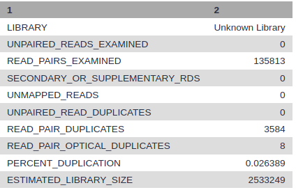
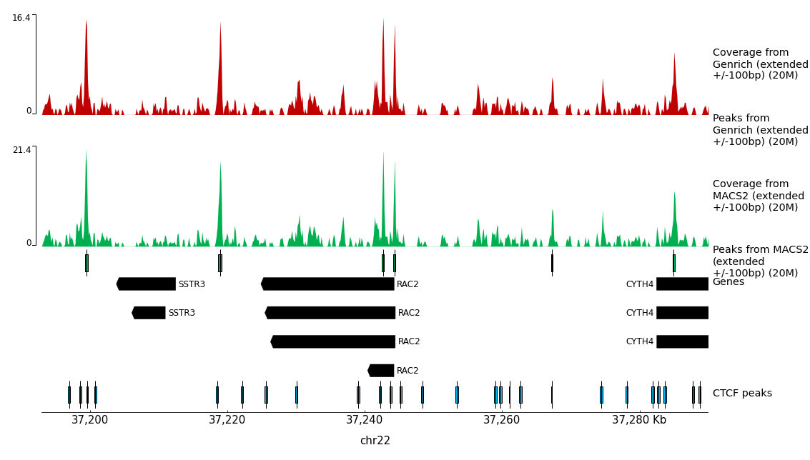

# Introduction
{:.no_toc}

In many eukaryotic organisms, such as humans, the genome is tightly packed and organized with the help of nucleosomes (chromatin). A nucleosome is a complex formed by eight histone proteins that is wrapped with ~147bp of DNA. When the DNA is being actively transcribed into RNA, the DNA will be opened and loosened from the nucleosome complex. Many factors, such as the chromatin structure, the position of the nucleosomes, and histone modifications, play an important role in the organization and accessibility of the DNA. Consequently, these factors are also important for the activation and inactivation of genes. **A**ssay for **T**ransposase-**A**ccessible **C**hromatin using **seq**uencing ([ATAC-Seq](https://en.wikipedia.org/wiki/ATAC-seq)) is a method to investigate the accessibility of chromatin and thus a method to determine regulatory mechanisms of gene expression. The method can help identify promoter regions and potential enhancers and silencers. A promoter is the DNA region close to the transcription start site (TSS). It contains binding sites for transcription factors that will recruit the RNA polymerase. An enhancer is a DNA region that can be located up to 1 Mb downstream or upstream of the promoter. When transcription factors bind an enhancer and contact a promoter region, the transcription of the gene is increased. In contrast, a silencer decreases or inhibits the gene's expression. ATAC-Seq has become popular for identifying accessible regions of the genome as it's easier, faster and requires less cells than alternative techniques, such as FAIRE-Seq and DNase-Seq.


With ATAC-Seq, to find accessible (open) chromatin regions, the genome is treated with a hyperactive derivative of the Tn5 transposase. A [transposase](https://en.wikipedia.org/wiki/Transposase) can bind to a [transposable element](https://en.wikipedia.org/wiki/Transposable_element), which is a DNA sequence that can change its position (jump) within a genome (read the two links to get a deeper insight). During ATAC-Seq, the modified Tn5 inserts DNA sequences corresponding to truncated Nextera adapters into open regions of the genome and concurrently, the DNA is sheared by the transposase activity. The read library is then prepared for sequencing, including PCR amplification with full Nextera adapters and purification steps. Paired-end reads are recommended for ATAC-Seq for the reasons described [here](https://informatics.fas.harvard.edu/atac-seq-guidelines.html).

In this tutorial we will use data from the study of , the first paper on the ATAC-Seq method. The data is from a human cell line of purified CD4+ T cells, called GM12878. The original dataset had 2 x 200 million reads and would be too big to process in a training session, so we downsampled the original dataset to 200,000 randomly selected reads. We also added about 200,000 reads pairs that will map to chromosome 22 to have a good profile on this chromosome, similar to what you might get with a typical ATAC-Seq sample (2 x 20 million reads in original FASTQ). Furthermore, we want to compare the predicted open chromatin regions to the known binding sites of CTCF, a DNA-binding protein implicated in 3D structure: [CTCF](https://en.wikipedia.org/wiki/CTCF). CTCF is known to bind to thousands of sites in the genome and thus it can be used as a positive control for assessing if the ATAC-Seq experiment is good quality. Good ATAC-Seq data would have accessible regions both within and outside of TSS, for example, at some CTCF binding sites. For that reason, we will download binding sites of CTCF identified by ChIP in the same cell line from ENCODE (ENCSR000AKB, dataset ENCFF933NTR).

### When working with real data
{:.no_toc}
When you use your own data we suggest you to use [this workflow](https://usegalaxy.eu/u/heylf/w/atac-seq-gtm-with-control) which includes the same steps but is compatible with replicates. If you do not have any control data you can import and edit this workflow, removing all steps with the controls. Controls for the ATAC-Seq procedure are not commonly performed, as discussed [here](https://informatics.fas.harvard.edu/atac-seq-guidelines.html), but could be ATAC-Seq of purified DNA.

> ### Agenda
>
> In this tutorial, we will cover:
>
> 1. TOC
> {:toc}
>
{: .agenda}




# Preprocessing

## Get Data

We first need to download the sequenced reads (FASTQs) as well as other annotation files. Then, to increase the number of reads that will map to the reference genome (here human genome version 38, GRCh38/hg38), we need to preprocess the reads.


> ###  Hands-on: Data upload
>
> 1. Create a new history for this tutorial
>
>    
>
> 2. Import the files from [Zenodo](https://zenodo.org/record/3270536) and [ENCODE](https://www.encodeproject.org/) or from the shared data library
>
>    ```
>    https://zenodo.org/record/3270536/files/SRR891268_R1.fastq.gz
>    https://zenodo.org/record/3270536/files/SRR891268_R2.fastq.gz
>    https://www.encodeproject.org/files/ENCFF933NTR/@@download/ENCFF933NTR.bed.gz
>    ```
>
>    
>    
>
> 3. Add a tag called `#SRR891268_R1` to the R1 file and a tag called `#SRR891268_R2` to the R2 file.
>
>    
>
> 4. Check that the datatype of the 2 FASTQ files is `fastqsanger.gz` and the BED file is `bed`. If they are not then change the datatype as described below.
>
>    
>
{: .hands_on}

> ###  FASTQ format
> If you are not familiar with FASTQ format, see the [Quality Control tutorial]()
{: .comment}
>
> ###  BED format
> If you are not familiar with BED format, see the [BED Format](https://genome.ucsc.edu/FAQ/FAQformat.html)
{: .comment}

We will visualise regions later in the analysis and obtain the gene information now. We will get information for chromosome 22 genes (names of transcripts and genomic positions) using the UCSC tool.

> ###  Hands-on: Obtain Annotation for hg38 genes
>
> 1. **UCSC Main**  with the following parameters:
>    - *"clade"*: `Mammal`
>    - *"genome"*: `Human`
>    - *"assembly"*: `Dec. 2013 (GRCh38/hg38)`
>    - *"group"*: `Genes and Gene Prediction`
>    - *"track"*: `All GENCODE V31`
>    - *"table"*: `Basic`
>    - *"region"*: `position` `chr22`
>    - *"output format"*: `all fields from selected table`
>    - *"Send output to"*: `Galaxy`
> 2. Click **get output**
> 3. Click **Send query to Galaxy**
>
>    This table contains all the information but is not in a BED format. To transform it into BED format we will cut out the required columns and rearrange:
> 4. **Cut** columns from a table  with the following parameters:
>    -  *"Cut columns"*: `c3,c5,c6,c13,c12,c4`
>    -  *"Delimited by"*: `Tab`
>    -  *"From"*: `UCSC Main on Human: wgEncodeGencodeBasicV31 (chr22:1-50,818,468)`
> 5. Rename the dataset as `chr22 genes`
>
>    
>
> 6. Change its datatype to BED
>
>    
>
{: .hands_on}

>
> ###  Gene file
> The chr22 genes BED we produced only contains the start, the end, the name, and the strand of each transcript. It does not contain exon information.
> To be able to have the exon information, you could use a GTF file which can be downloaded from the [gencode website](ftp://ftp.ebi.ac.uk/pub/databases/gencode/Gencode_human/release_31/gencode.v31.annotation.gtf.gz) but this file would include the information for the whole genome and would slow the analysis.
{: .comment}

## Quality Control

The first step is to check the quality of the reads and the presence of the Nextera adapters. When we perform ATAC-Seq, we can get DNA fragments of about 40 bp if two adjacent Tn5 transposases cut the DNA . This can be smaller than the sequencing length so we expect to have Nextera adapters at the end of those reads. We can assess the reads with **FastQC**.

> ###  Hands-on: Task description
>
> 1. **FastQC**  with the default parameters:
>       - *"Short read data from your current history"*: Choose here either only the `SRR891268_R1` file with  or use  **Multiple datasets** to choose both `SRR891268_R1` and `SRR891268_R2`.
> 2. Inspect the web page output of **FastQC**  for the `SRR891268_R1` sample. Check what adapters are found at the end of the reads.
>
> > ###  Questions
> >
> > 1. How many reads are in the FASTQ?
> > 2. Which sections have a warning?
> >
> > > ###  Solution
> > >
> > > 1. There are 285247 reads.
> > > 2. The 3 steps below have warnings:
> > >
> > >    1. **Per base sequence content**
> > >
> > >       It is well known that the Tn5 has a strong sequence bias at the insertion site. You can read more about it in .
> > >
> > >    2. **Sequence Duplication Levels**
> > >
> > >       The read library quite often has PCR duplicates that are introduced
> > >       simply by the PCR itself. We will remove these duplicates later on.
> > >
> > >    3. **Overrepresented sequences**
> > >
> > >       Nextera adapter sequences are observable in the **Adapter Content** section.
> > >
> > {: .solution}
> >
>    {: .question}
{: .hands_on}

> ###  FastQC Results
> This is what you should expect from the **Adapter Content** section:
> 
{: .comment}

The FastQC web page **Adapter Content** section shows the presence of Nextera Transposase Sequence in the reads. We will remove the adapters with Cutadapt.

## Trimming Reads

To trim the adapters we provide the Nextera adapter sequences to **Cutadapt**. These adapters are shown in the image below.


The forward and reverse adapters are slightly different. We will also trim low quality bases at the ends of the reads (quality less than 20). We will only keep reads that are at least 20 bases long. We remove short reads (< 20bp) as they are not useful, they will either be thrown out by the mapping or may interfere with our results at the end.


> ###  Hands-on: Task description
>
> 1. **Cutadapt**  with the following parameters:
>    - *"Single-end or Paired-end reads?"*: `Paired-end`
>        -  *"FASTQ/A file #1"*: select `SRR891268_R1`
>        -  *"FASTQ/A file #2"*: select `SRR891268_R2`
>        - In *"Read 1 Options"*:
>            - In *"3' (End) Adapters"*:
>                -  *"Insert 3' (End) Adapters"*
>                    - *"Source"*: `Enter custom sequence`
>                        -  *"Enter custom 3' adapter name (Optional if Multiple output is 'No')"*: `Nextera R1`
>                        -  *"Enter custom 3' adapter sequence"*: `CTGTCTCTTATACACATCTCCGAGCCCACGAGAC`
>        - In *"Read 2 Options"*:
>            - In *"3' (End) Adapters"*:
>                -  *"Insert 3' (End) Adapters"*
>                    - *"Source"*: `Enter custom sequence`
>                        -  *"Enter custom 3' adapter name (Optional)"*: `Nextera R2`
>                        -  *"Enter custom 3' adapter sequence"*: `CTGTCTCTTATACACATCTGACGCTGCCGACGA`
>    - In *"Filter Options"*:
>        -  *"Minimum length"*: `20`
>    - In *"Read Modification Options"*:
>        -  *"Quality cutoff"*: `20`
>    - In *"Output Options"*:
>        - *"Report"*: `Yes`
>
> 2. Click on the  (eye) icon of the report and read the first lines.
{: .hands_on}

> ###  Cutadapt Results
> You should get similar output to this from Cutadapt:
> 
{: .comment}


> ###  Questions
>
> 1. What percentage of reads contain adapters?
> 2. What percentage of reads are still longer than 20bp after the trimming?
>
> > ###  Solution
> >
> > 1. ~14%
> > 2. ~99%
> >
> {: .solution}
>
{: .question}

> ###  Hands-on: Check Adapter Removal with FastQC
>
> 1. **FastQC**  with the default parameters:
>       - *"Short read data from your current history"*: select the output of **Cutadapt**  **Multiple datasets** to choose both `Read 1 Output` and `Read 2 Output`.
>
> 2. Click on the  (eye) icon of the report and read the first lines.
{: .hands_on}

> ###  FastQC Results
> If we run FastQC again we should see under **Adapter Content** that the Nextera adapters are no longer present.
> 
{: .comment}

# Mapping

## Mapping Reads to Reference Genome

Next we map the trimmed reads to the human reference genome. Here we will use **Bowtie2**. We will extend the maximum fragment length (distance between read pairs) from 500 to 1000 because we know some valid read pairs are from this fragment length. We will use the `--very-sensitive` parameter to have more chance to get the best match even if it takes a bit longer to run. We will run the **end-to-end** mode because we trimmed the adapters so we expect the whole read to map, no clipping of ends is needed. Regarding the genome to choose. The hg38 version of the human genome contains [alternate loci](https://www.ncbi.nlm.nih.gov/grc/help/definitions/#ALTERNATE). This means that some region of the genome are present both in the canonical chromosome and on its alternate loci. The reads that map to these regions would map twice. To be able to filter reads falling into repetitive regions but keep reads falling into regions present in alternate loci, we will map on the Canonical version of hg38 (only the chromosome with numbers, chrX, chrY, and chrM).

> ###  Dovetailing
> We will allow dovetailing of read pairs with Bowtie2. This is because adapters are removed by Cutadapt only when at least 3 bases match the adapter sequence, so it is possible that after trimming a read can contain 1-2 bases of adapter and go beyond it's mate start site. For example, if the first mate in the read pair is: `GCTATGAAGAATAGGGCGAAGGGGCCTGCGGCGTATTCGATGTTGAAGCT` and the second mate is `CTTCAACATCGAATACGCCGCAGGCCCCTTCGCCCTATTCTTCATAGCCT`, where both contain 2 bases of adapter sequence, they will not be trimmed by Cutadapt and will map this way:
> ```
<--------------------Mate 1-----------------------
AGCTTCAACATCGAATACGCCGCAGGCCCCTTCGCCCTATTCTTCATAGC
  CTTCAACATCGAATACGCCGCAGGCCCCTTCGCCCTATTCTTCATAGCCT
  ----------------------Mate 2--------------------->
```
This is what we call dovetailing and we want to consider this pair as a valid concordant alignment.
{: .comment}


> ###  Hands-on: Mapping reads to reference genome
>
> 1. **Bowtie2**  with the following parameters:
>    - *"Is this single or paired library"*: `Paired-end`
>        -  *"FASTQ/A file #1"*: select the output of **Cutadapt**  *"Read 1 Output"*
>        -  *"FASTQ/A file #2"*: select the output of **Cutadapt**  *"Read 2 Output"*
>        - *"Do you want to set paired-end options?"*: `Yes`
>            - *"Set the maximum fragment length for valid paired-end alignments"*: `1000`
>            - *"Allow mate dovetailing"*: `Yes`
>    - *"Will you select a reference genome from your history or use a built-in index?"*: `Use a built-in genome index`
>        - *"Select reference genome"*: `Human (Homo sapiens): hg38 Canonical`
>    - *"Select analysis mode"*: `1: Default setting only`
>        - *"Do you want to use presets?"*: `Very sensitive end-to-end (--very-sensitive)`
>    - *"Save the bowtie2 mapping statistics to the history"*: `Yes`
>
> 2. Click on the  (eye) icon of the mapping stats.
{: .hands_on}

> ###  Bowtie2 Results
> You should get similar results to this from Bowtie2:
> 
{: .comment}

> ###  Questions
>
> What percentage of read pairs mapped concordantly?
>
> > ###  Solution
> >
> > 54.8+42.87=97.67%
> >
> {: .solution}
>
{: .question}

> ###  Comment on the number of uniquely mapped.
>
> You might be surprised by the number of uniquely mapped compared to the number of multi-mapped reads (reads mapping to more than one location in the genome).
> One of the reasons is that we have used the parameter `--very-sensitive`. Bowtie2 considers a read as multi-mapped even if the second hit has a much lower quality than the first one.
> Another reason is that we have reads that map to the mitochondrial genome. The mitochondrial genome has a lot of regions with similar sequence.
>
{: .comment}

# Filtering Mapped Reads

## Filter Uninformative Reads

We apply some filters to the reads after the mapping. ATAC-Seq datasets can have a lot of reads that map to the mitchondrial genome because it is nucleosome-free and thus very accessible to Tn5 insertion. The mitchondrial genome is uninteresting for ATAC-Seq so we remove these reads. We also remove reads with low mapping quality and reads that are not properly paired.


> ###  Hands-on: Filtering of uninformative reads
>
> 1. **Filter** BAM datasets on a variety of attributes  with the following parameters:
>    -  *"BAM dataset(s) to filter"*: Select the output of  **Bowtie2**  *"alignments"*
>    - In *"Condition"*:
>        - *"1: Condition"*
>            - In *"Filter"*:
>                - *"1: Filter"*
>                    - *"Select BAM property to filter on"*: `mapQuality`
>                        - *"Filter on read mapping quality (phred scale)"*: `>=30`
>                -  *"Insert Filter"*
>                    - *"Select BAM property to filter on"*: `isProperPair`
>                        - *"Select properly paired reads"*: `Yes`
>                -  *"Insert Filter"*
>                    - *"Select BAM property to filter on"*: `reference`
>                        - *"Filter on the reference name for the read"*: `!chrM`
>    - *"Would you like to set rules?"*: `No`
>
>
> 2. Click on the input and the output BAM files of the filtering step. Check the size of the files.
>
{: .hands_on}

> ###  Questions
>
> 1. Based on the file size, what proportion of alignments was removed (approximately)?
> 2. Which parameter should be modified if you are interested in repetitive regions?
>
> > ###  Solution
> >
> > 1. The original BAM file is 28 MB, the filtered one is 15.1 MB. Approximately half of the alignments were removed.
> >
> > 2. You should modify the mapQuality criteria and decrease the threshold.
> >
> {: .solution}
>
{: .question}

High numbers of mitochondrial reads can be a problem in ATAC-Seq. Some ATAC-Seq samples have been reported to be 80% mitochondrial reads and so wet-lab methods have been developed to deal with this issue  and . It can be a useful QC to assess the number of mitochondrial reads.

> ###  Tip: Getting the number of mitochondrial reads
>
> To get the number of reads that mapped to the mitochondrial genome (chrM) you can run **Samtools idxstats**  on the output of  **Bowtie2**  *"alignments"*.
> The columns of the output are: chromosome name, chromosome length, number of reads mapping to the chromosome, number of unaligned mate whose mate is mapping to the chromosome.
> The first 2 lines of the result would be (after using **Sort** ):
>
> 
>
> There are 221 000 reads which map to chrM and 170 000 which map to chr22.
{: .tip}

## Filter Duplicate Reads

Because of the PCR amplification, there might be read duplicates (different reads mapping to exactly the same genomic region) from overamplification of some regions. As the Tn5 insertion is random within an accessible region, we do not expect to see fragments with the same coordinates. We consider such fragments to be PCR duplicates. We will remove them with **Picard MarkDuplicates**.

> ###  Hands-on: Remove duplicates
>
> 1. **MarkDuplicates**  with the following parameters:
>    -  *"Select SAM/BAM dataset or dataset collection"*: Select the output of  **Filter**  *"BAM"*
>    - *"If true do not write duplicates to the output file instead of writing them with appropriate flags set"*: `Yes`
>
>    > ###  Comment: Default of  **MarkDuplicates** 
>    >
>    > By default, the tool will only "Mark" the duplicates. This means that it will change the Flag of the duplicated reads to enable them to be filtered afterwards. We use the parameter *"If true do not write duplicates to the output file instead of writing them with appropriate flags set"* to directly remove the duplicates.
>    {: .comment}
>
> 2. Click on the  (eye) icon of the MarkDuplicate metrics.
{: .hands_on}

> ###  MarkDuplicates Results
> You should get similar output to this from MarkDuplicates:
> 
{: .comment}

> ###  Tip: Formatting the MarkDuplicate metrics for readability
>
> 1. **Select** lines that match an expression  with the following parameters:
>    -  *"Select lines from"*: Select the output of  **MarkDuplicates** 
>    - *"that*: `Matching`
>    - *"the pattern*: `(Library|LIBRARY)`
> 2. Check that the datatype is tabular. If not, change the datatype as described above.
> 3. **Transpose** :
>    -  *"Select lines from"*: Select the output of **Select** 
>
> 
>
{: .tip}

> ###  Questions
>
> 1. How many pairs were in the input?
> 2. How many pairs are duplicates?
>
> > ###  Solution
> >
> > 1. 135813
> > 2. 3584
> >
> {: .solution}
>
{: .question}

## Check Insert Sizes

We will check the insert sizes with **Picard CollectInsertSizeMetrics**. The insert size is the distance between the R1 and R2 read pairs. This tells us the size of the DNA fragment the read pairs came from. The fragment length distribution of a sample gives a very good indication of the quality of the ATAC-Seq.

> ###  Hands-on: Plot the distribution of fragment sizes.
>
> 1. **CollectInsertSizeMetrics**  with the following parameters:
>    -  *"Select SAM/BAM dataset or dataset collection"*: Select the output of  **MarkDuplicates**  *"BAM output"*
>    - *"Load reference genome from"*: `Local cache`
>        - *"Using reference genome"*: `Human Dec. 2013 (GRCh38/hg38) (hg38)`
>
> 2. Click on the  (eye) icon of the upper one of the 2 outputs (the pdf file).
{: .hands_on}

> ###  CollectInsertSizeMetrics Results
> This is what you get from CollectInsertSizeMetrics:
> 
{: .comment}

> ###  Questions
>
> Could you guess what the peaks at approximately 50bp, 200bp, 400bp and 600bp correspond to?
>
> > ###  Solution
> >
> > The first peak (50bp) corresponds to where the Tn5 transposase inserted into nucleosome-free regions. The second peak (a bit less than 200bp) corresponds to where Tn5 inserted around a single nucleosome. The third one (around 400bp) is where Tn5 inserted around two adjacent nucleosomes and the fourth one (around 600bp) is where Tn5 inserted around three adjacent nucleosomes.
> >
> {: .solution}
>
{: .question}

This fragment size distribution is a good indication if your experiment worked or not.
In absence of chromatin (without nucleosome), this is the profile you would get:


Here are examples of Fragment size distributions of ATAC-Seq which were very noisy:


A final example of a Fragment size distribution of a very good ATAC-Seq, even if we cannot see the third nucleosome "peak".


> ###  Comment on FR and RF
>
> FR stands for forward reverse orientation of the read pairs, meaning, your reads are oriented as -> <- so the first read is on the forward and the second on the reverse strand. RF stands for reverse forward oriented, i.e., <- ->. It really depends on your experiment, how your reads are oriented and if the orientation plays a role.
> Here, we expected FR and we got some RF for small reads. This is because when reads fully overlap:
> ```
>    ------>
>    <------
> ```
> Bowtie2 gives a negative fragment size (8th field of SAM files) thus the Picard tool **CollectInsertSizeMetrics**  attribute them to FR if the first read in the pair is forward and RF if the first read in the pair is reverse.
{: .comment}

# Peak calling

## Call Peaks

We have now finished the data preprocessing. Next, in order to find regions corresponding to potential open chromatin regions, we want to identify regions where reads have piled up (peaks) greater than the background read coverage. The tools which are currently used are [Genrich](https://github.com/jsh58/Genrich) and [MACS2](https://github.com/taoliu/MACS). Genrich has a mode dedicated to ATAC-Seq but is still not published, so both are presented here. It is very important at this point that we center the reads on the 5' extremity (read start site) as this is where Tn5 cuts. You want your peaks around the nucleosomes and not directly on the nucleosome:


> ###  Comment on Tn5 insertion
>
> When Tn5 cuts an accessible chromatin locus it inserts adapters separated by 9bp :
> 
>
> This means that to have the read start site reflect the centre of where Tn5 bound, the reads on the positive strand should be shifted 4 bp to the right and reads on the negative strands should be shifted 5 bp to the left as in [Buenrostro et al. 2013](https://www.ncbi.nlm.nih.gov/pmc/articles/PMC3959825). **Genrich** can apply these shifts when ATAC-seq mode is selected.
{: .comment}

If we only assess the coverage of the start sites of the reads, the data would be too sparse and it would be impossible to call peaks. Thus, we will extend the start sites of the reads by 100bp (50 bp in each direction) to assess coverage.

### Using Genrich

> ###  Comment on Genrich filters
>
> Using **Genrich**, you can do most of the filtering we did previously:
>
> Remove PCR duplicates: Yes
>
> Comma-separated list of chromosomes to exclude:
> chrM
>
> Minimum MAPQ to keep an alignment.
> 30
>
> However, you cannot filter the unconcordant pairs, and you cannot get the fragment size histogram on filtered reads, that's why in this training we performed all filtering step prior to the use of Genrich.
{: .comment}


> ###  Hands-on: Identifying enriched genomic regions
>
> 1. **Genrich**  with the following parameters:
>    - *"Are you pooling Treatment Files?"*: `No`
>    -  *"Treatment File(s)"*: Select the output of  **MarkDuplicates** 
>    - *"Do you have a Control File?"*: `No`
>    - *"ATAC Options"*:
>        - *"Use ATAC-seq mode."*: `Yes`
>        - *"Expand cut sites."*: `100`
>    - *"Output Options"*:
>        - *"Bedgraph-ish Pileups"*: `Yes`
>
{: .hands_on}

### Using MACS2

We convert the BAM file to BED format because when we shift the reads with MACS2, it will only consider one of the read pairs.

> ###  Hands-on: Convert the BAM to BED
>
> 1. **bedtools BAM to BED** converter  with the following parameters:
>    -  *"Convert the following BAM file to BED"*: Select the output of **MarkDuplicates** 
>
{: .hands_on}

We call peaks with MACS2. Usually people expand 200bp around cut sites (+/-100bp). Here, to be able to compare with **Genrich**, we will use 100bp.

> ###  Hands-on: Call peaks with MACS2
>
> 1. **MACS2 callpeak**  with the following parameters:
>    - *"Are you pooling Treatment Files?"*: `No`
>    - *"Do you have a Control File?"*: `No`
>    - *"Format of Input Files"*: `Single-end BED`
>    - *"Effective genome size"*: `H. sapiens (2.7e9)`
>    - *"Build Model"*: `Do not build the shifting model (--nomodel)`
>        - *"Set extension size"*: `100`, people usually put `200`
>        - *"Set shift size"*: `-50`, people usually put `-100`. It needs to be - half the extension size to be centered on the 5'.
>    - *"Additional Outputs"*:
>        - Check `Peaks as tabular file`
>        - Check `Peak summits`
>        - Check `Scores in bedGraph files`
>    - In *"Advanced Options"*:
>        - *"Composite broad regions"*: `No broad regions`
>            - *"Use a more sophisticated signal processing approach to find subpeak summits in each enriched peak region"*: `Yes`
>        - *"How many duplicate tags at the exact same location are allowed?"*: `all`
>
>    > ###  Why keeping all duplicates is important
>    >
>    > We previously removed duplicates using **MarkDuplicates**  using paired-end information. If two pairs had identical R1 but different R2, we knew it was not a PCR duplicate. Because we converted the BAM to BED we lost the pair information. If we keep the default (removing duplicates) one of the 2 identical R1 would be filtered out as duplicate.
>    {: .comment}
>
> 2. Add a tag called `#MACS2_cov` to the output called MACS2 callpeak ...(Bedgraph Treatment).
>
>
{: .hands_on}

# Visualisation of Coverage

## Prepare the Datasets

Thanks to **Genrich** we now have a coverage file which represents the coverage of the read start sites extended 50 bp to each side.
The output of **Genrich** is a BedGraph-ish pileup (6 columns text format with a comment line and a header). We will first need to convert it to a bedgraph format (4 columns text format with no header) to be able to visualise it. 

### Convert BedGraph-ish pileup of **Genrich** to bedgraph

First, we need to remove the 2 header lines. Then, we select the first 4 columns.

> ###  Hands-on: Convert bedgraph-ish pileup to bedgraph.
>
> 1. **Remove beginning** of a file  with the following parameters:
>    - *"Remove first"*: `2`
>    -  *"from"*: Select the output of **Genrich**  *"Bedgraph Pileups"*.
>
> 2. **Cut** columns from a table  with the following parameters:
>    -  *"Cut columns"*: `c1,c2,c3,c4`
>    -  *"Delimited by"*: `Tab`
>    -  *"From"*: Select the output of **Remove beginning** 
>
> 3. Chage the datatype from interval to bedgraph.
>
> 4. Add a tag called `#Genrich_cov` to the output of **Cut**.
{: .hands_on}

### Convert bedgraph from **Genrich** and **MACS2** to bigwig
The bedgraph format is easily readable for human but it can be very large and visualising a specific region is quite slow. We will change it to bigwig format which is a binary format, so we can visualise any region of the genome very quickly.

> ###  Hands-on: Convert bedgraphs to bigWig.
>
> 1. **Wig/BedGraph-to-bigWig** converter  with the following parameters:
>    -  *"Convert"*: Select both the output of **Cut**  and the output of **MACS2**  (Bedgraph Treatment).
>    - *"Converter settings to use"*: `Default`
>
> 2. Rename the datasets `MACS2 bigwig` and `Genrich bigwig` (you can use the tags to know which one is which one).
{: .hands_on}

### Sort CTCF Peaks
In order to visualise a specific region (e.g. the gene *RAC2*), we can either use a genome browser like **IGV** or **UCSC browser**, or use **pyGenomeTracks** to make publishable figures. We will use **pyGenomeTracks**. The **pyGenomeTracks** tool needs all BED files sorted, thus we sort the CTCF peaks.

> ###  Hands-on: Sort the BED files
>
> 2. **bedtools SortBED** order the intervals   with the following parameters:
>    -  *"Sort the following BED/bedGraph/GFF/VCF file"*: `ENCFF933NTR.bed.gz`
>    -  *"Sort by"*: `chromosome, then by start position (asc)`
>
{: .hands_on}

### Convert the Genrich peaks to BED
At the moment, **pyGenomeTracks** does not deal with the datatype encodepeak which is a special bed.

> ###  Hands-on: Change the datatype
> 1. Change the datatype of the output of **Genrich** from encodepeak to bed.
>
>    
>
{: .hands_on }

## Create heatmap of coverage at TSS with deepTools

You might also be interested in specific regions. For this, you can compute a heatmap. We will use the **deepTools plotHeatmap**. As an example, we will here make a heatmap centered on the transcription start sites (TSS).

### Generate computeMatrix

The input of **plotHeatmap** is a matrix in a hdf5 format. To generate it we use the tool **computeMatrix** that will evaluate the coverage at each locus we are interested in.

> ###  Hands-on: Generate the matrix
>
> 1. **computeMatrix**  with the following parameters:
>    - In *"Select regions"*:
>        - 1. *"Select regions"*
>            -  *"Regions to plot"*: Select the dataset `chr22 genes`
>    - *"Sample order matters"*: `No`
>        -  *"Score file"*: Select the both outputs of **Wig/BedGraph-to-bigWig**  that should be named `MACS2 bigwig` and `Genrich bigwig`.
>    - *"computeMatrix has two main output options"*: `reference-point`
>    - *"The reference point for the plotting"*: `beginning of region (e.g. TSS)`
>    - *"Show advanced output settings"*: `no`
>    - *"Show advanced options"*: `yes`
>        - *"Convert missing values to 0?"*: `yes`
>
{: .hands_on}


### Plot with **plotHeatmap**

We will now generate a heatmap. Each line will be a transcript. The coverage will be summarized with a color code from red (no coverage) to blue (maximum coverage). All TSS will be aligned in the middle of the figure and only the 2 kb around the TSS will be displayed. Another plot, on top of the heatmap, will show the mean signal at the TSS. There will be one heatmap per bigwig.

> ###  Hands-on: Generate the heatmap
>
> 1. **plotHeatmap**  with the following parameters:
>    -  *"Matrix file from the computeMatrix tool"*: Select the output of **computeMatrix** .
>    - *"Show advanced output settings"*: `no`
>    - *"Show advanced options"*: `no`
{: .hands_on}

> ###  plotHeatmap Results
> This is what you get from plotHeatmap:
> 
{: .comment}

> ###  Questions
>
> 1. Is the coverage symmetric?
> 2. What is the mean value in genes?
>
> > ###  Solution
> >
> > 1. No, it is higher on the left which is expected as usually the promoter of active genes is accessible.
> > 2. Around 2.5 for Genrich and 3 for MACS2.
> >
> > > ###  Tip: Why the height is different
> > >
> > > MACS2 coverage is very simple, each 5' is extended 100bp (+/-50bp).
> > > Genrich coverage is evaluated in a more subtle way: if the fragment length is above 100 (the expension size), the coverage will be each 5' extended 100bp (+/-50bp), but if it is less, the coverage will be between each 5' extended 50bp (-50bp - fragment size - + 50bp):
> > > 
> > > In this example, we see on the left a pair with a long fragment size: both algorithm behave the same.
> > > On the left a pair with a short fragment size: Genrich reports only one interval joining both extremities wheareas macs2 will still report 2 intervals even if they overlap.
> > {: .tip}
> {: .solution}
>
{: .question}

## Visualise Regions with pyGenomeTracks

> ###  Hands-on: Task description
>
> 1. **pyGenomeTracks**  with the following parameters:
>    - *"Region of the genome to limit the operation"*: `chr22:37,193,000-37,252,000`
>    - In *"Include tracks in your plot"*:
>        - *"1. Include tracks in your plot"*
>            - *"Choose style of the track"*: `Bigwig track `
>                - *"Plot title"*: `Coverage from Genrich (extended +/-50bp)`
>                -  *"Track file bigwig format"*: Select the output of **Wig/BedGraph-to-bigWig**  called `Genrich bigwig`.
>                - *"Color of track"*: Select the color of your choice
>                - *"height"*: `5`
>                - *"Show visualization of data range"*: `Yes`
>                - *"Include spacer at the end of the track"*: `0.5`
>        -  *"Insert Include tracks in your plot"*
>            - *"Choose style of the track"*: `Gene track / Bed track`
>                - *"Plot title"*: `Peaks from Genrich (extended +/-50bp)`
>                -  *"Track file bed format"*: Select the output of **Genrich**  (the one you converted from encodepeak to bed).
>                - *"Color of track"*: Select the color of your choice
>                - *"height"*: `3`
>                - *"Plot labels"*: `No`
>                - *"Include spacer at the end of the track"*: `0.5`
>        -  *"Insert Include tracks in your plot"*
>            - *"Choose style of the track"*: `Bigwig track `
>                - *"Plot title"*: `Coverage from macs2 (extended +/-50bp)`
>                -  *"Track file bigwig format"*: Select the output of **Wig/BedGraph-to-bigWig**  called `MACS2 bigwig`.
>                - *"Color of track"*: Select the color of your choice
>                - *"height"*: `5`
>                - *"Show visualization of data range"*: `Yes`
>                - *"Include spacer at the end of the track"*: `0.5`
>        -  *"Insert Include tracks in your plot"*
>            - *"Choose style of the track"*: `Gene track / Bed track`
>                - *"Plot title"*: `Peaks from macs2 (extended +/-50bp)`
>                -  *"Track file bed format"*: Select the output of **MACS2**  (narrow Peaks).
>                - *"Color of track"*: Select the color of your choice
>                - *"height"*: `3`
>                - *"Plot labels"*: `No`
>                - *"Include spacer at the end of the track"*: `0.5`
>        -  *"Insert Include tracks in your plot"*
>            - *"Choose style of the track"*: `Gene track / Bed track`
>                - *"Plot title"*: `Genes`
>                -  *"Track file bed format"*: `chr22 genes`
>                - *"Color of track"*: Select the color of your choice
>                - *"height"*: `5`
>                - *"Include spacer at the end of the track"*: `0.5`
>        -  *"Insert Include tracks in your plot"*
>            - *"Choose style of the track"*: `Gene track / Bed track`
>                - *"Plot title"*: `CTCF peaks`
>                -  *"Track file bed format"*: Select the dataset `bedtools SortBED of ENCFF933NTR.bed.gz`
>                - *"Color of track"*: Select the color of your choice
>                - *"Plot labels"*: `No`
>                - *"Include spacer at the end of the track"*: `0.5`
>    - *"Configure x-axis"*: `Yes`
>        - *"Where to place the x-axis"*: `Bottom`
>
> 2. Click on the  (eye) icon of the output.
>
{: .hands_on}


> ###  pyGenomeTracks Results
> You should get similar to results to this from pyGenomeTracks:
> 
{: .comment}

Unfortunately, Genrich does not work very well with our small training dataset (every covered region is called a peak). This is because most of the data is on chr22 whereas the background model was built on the whole genome. When the pipeline described here was run on 20 million of pairs from the original dataset, this is the output of pyGenomeTracks:
.


> ###  Questions
> In the ATAC-Seq sample in this selected region we see four peaks detected by Genrich.
>
> 1. How many TSS are accessible in the sample in the displayed region?
> 2. How many CTCF binding loci are accessible?
> 3. Can you spot peaks with no TSS and no CTCF peak?
>
> > ###  Solution
> >
> > 1. In total, we can see 3 TSS for 6 transcripts for 2 genes. The TSS of RAC2 corresponds to an ATAC-Seq peak whereas there is no significant coverage on both TSS of SSTR3.
> >
> > 2. Only the first peak on the left overlaps with a CTCF binding site.
> >
> > 3. Amongst the 4 peaks in this region, the 2 in the middle do not correspond to CTCF peaks or TSS.
> >
> {: .solution}
>
{: .question}

We can see that in this region both peak calling perform the same. However, when zooming out, we see that macs2 is more sensitive:
.

As CTCF binds so ubiquitously and by itself can displace the nucleosome creating accessible regions, a region containing a peak with no corresponding CTCF peak or TSS could be a putative enhancer. In the pyGenomeTracks plot we see a region like this located in the intron of a gene and another one between genes. However, it is impossible to guess from the position which would be the gene controlled by this region. And of course, more analyses are needed to assess if it is a real enhancer, for example, histone ChIP-seq, 3D structure, transgenic assay, etc.


# Conclusion

In this training you have learned the general principles of ATAC-Seq data analysis. ATAC-Seq
is a method to investigate the chromatin accessibility and the genome is treated with
a transposase (enzyme) called Tn5. It marks open chromatin regions by cutting and
inserting adapters for sequencing. The training material gave you an insight into how to quality control the data. You should look for low quality bases, adapter contamination, correct insert size and PCR duplicates (duplication level). We showed you how to remove adapters and PCR duplicates, if **FastQC**, shows a warning in these areas. We mapped the reads
with **Bowtie2**, filtered our reads for properly paired, good quality and reads that do not
map to the mitochondrial genome. We found open chromatin regions with **Genrich**, a tool to find regions of genomic enrichment (peaks). We investigated the read coverage around TSS with the help of **computeMatrix** and **plotHeatmap**. Last but not least, we visualised the peaks and other informative tracks, such as CTCF binding regions and hg38 genes, with the help of **pyGenomeTracks**. At the end, we found open chromatin regions that did not overlap with CTCF sites or TSS, which could be potential putative enhancer regions detected by the ATAC-Seq experiment.


