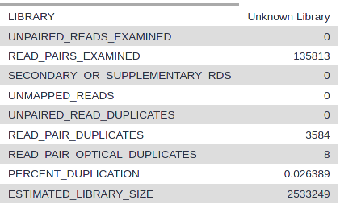

# Introduction
{:.no_toc}

<!-- This is a comment. -->

General introduction about the topic and then an introduction of the
tutorial (the questions and the objectives). It is nice also to have a
scheme to sum up the pipeline used during the tutorial. The idea is to
give to trainees insight into the content of the tutorial and the (theoretical
and technical) key concepts they will learn.

**Please follow our
[tutorial to learn how to fill the Markdown]({{ site.baseurl }}/topics/contributing/tutorials/create-new-tutorial-content/tutorial.html)**


The original dataset had 2 x 200 million reads. This would be too long to be processed in a training session. So, we downsampled the original dataset to 200 000 reads but added about 200 000 reads pairs that will map to chr22 to have a good profile on this chromosome similar to a 2 x 20 million reads original fastq.

> ### Agenda
>
> In this tutorial, we will cover:
>
> 1. TOC
> {:toc}
>
{: .agenda}

# Preprocessing

We first need to download the dataset that we downsampled as well as other annotations files. Then, to increase the number of reads that will map to the assembly (here Human genome version 38), we need to preprocess the reads.

## Get data

> ###  Hands-on: Data upload
>
> 1. Create a new history for this tutorial
>
>    
>
> 2. Import the files from [Zenodo](https://zenodo.org/record/3270536) or from the shared data library
>
>    ```
>    https://zenodo.org/record/3270536/files/SRR891268_R1.fastq.gz
>    https://zenodo.org/record/3270536/files/SRR891268_R2.fastq.gz
>    ```
>
>    
>    
>
> 3. By default, galaxy will give as name the full path. Rename the datasets to keep only the file names.
>
>    
>
> 4. Check that the datatype of the 2 fastq files is fasqsanger.gz
>
>    
>
> > ###  FASTQ format
> > If you are not familiar with FASTQ format, see the [Quality Control tutorial]({{ site.baseurl }})
{: .details}
{: .hands_on}

***TODO***: Add the bed files links.


## Quality control

The first step is to check the quality of the reads and the presence of the Nextera adapters.
> ###  Presence of adapters
> When we do ATAC-Seq, two transposase could cut the DNA about 40 bp apart. This can be smaller than the sequencing length so we expect to have Nextera adapters at the end these reads. 
{: .details}

We can do this with FastQC. The FastQC web page Adapter Content section shows the presence of Nextera Transposase Sequence in the reads. We will remove the adapters with Cutadapt.

> ###  Hands-on: Task description
>
> 1. **FastQC**  with the default parameters:
>       - *"Short read data from your current history"*: Choose here either only the `SRR891268_R1.fastq.gz` file with  or use  **Multiple datasets** to choose both `SRR891268_R1.fastq.gz` and `SRR891268_R2.fastq.gz`.
>
>    
>
> 2. Inspect the webpage output of **FastQC**  for the `SRR891268_R1` sample. Check which are the adaptors found at the end of the reads.
>
>    > ###  Questions
>    >
>    > What is the read length?
>    >
>    > > ###  Solution
>    > >
>    > > The read length is 50 bp.
>    > >
>    > {: .solution}
>    >
>    >
>    > How many reads are in the fastq?
>    >
>    > > ###  Solution
>    > >
>    > > There are 285247 reads.
>    > >
>    > {: .solution}
>    >
>    >
>    > Which are the steps which have a warning?
>    >
>    > > ###  Solution
>    > >
>    > > 1) Per base sequence content
>    > > > ###  Tn5 sequence bias
>    > > > It is well known that the tn5 have a strong sequence bias at the insersion site. You can have more information about it reading [Green et al. 2012]()
{: .details}
>    > > 2) Sequence Duplication Levels
>    > > 3) Overrepresented sequences
>    > >
>    > {: .solution}
>    >
>    {: .question}

This is what you should expect from the adapter section:


## Trimming reads

To trim the adapters we provide the Nextera adapter sequences to Cutadapt. These adapters are shown in the image below.


The forward and reverse adapters are slightly different.We will also trim low quality bases at the ends of reads (quality less than 20). We will only keep reads that are 20 bases or more after trimming so we don't have reads that are too short to be mapped.

> ###  Hands-on: Trim reads
>
> 1. **Cutadapt**  with the following parameters:
>    - *"Single-end or Paired-end reads?"*: `Paired-end`
>        -  *"FASTQ/A file #1"*: select `SRR891268_R1.fastq.gz`
>        -  *"FASTQ/A file #2"*: select `SRR891268_R2.fastq.gz`
>        - In *"Read 1 Options"*:
>            - In *"3' (End) Adapters"*:
>                -  *"Insert 3' (End) Adapters"*
>                    - *"Source"*: `Enter custom sequence`
>                        -  *"Enter custom 3' adapter name (Optional if Multiple output is 'No')"*: `Nextera R1`
>                        -  *"Enter custom 3' adapter sequence"*: `CTGTCTCTTATACACATCTCCGAGCCCACGAGAC`
>        - In *"Read 2 Options"*:
>            - In *"3' (End) Adapters"*:
>                -  *"Insert 3' (End) Adapters"*
>                    - *"Source"*: `Enter custom sequence`
>                        -  *"Enter custom 3' adapter name (Optional)"*: `Nextera R2`
>                        -  *"Enter custom 3' adapter sequence"*: `CTGTCTCTTATACACATCTGACGCTGCCGACGA`
>    - In *"Filter Options"*:
>        -  *"Minimum length"*: `20`
>    - In *"Read Modification Options"*:
>        -  *"Quality cutoff"*: `20`
>    - In *"Output Options"*:
>        - *"Report"*: `Yes`
>
> 2. Click on the  (eye) icon of the report and read the first lines.
{: .hands_on}

This is what you should see:


> ###  Questions
>
> 1. Which portion of reads contains adapters?
> 2. How many reads were still longer than 20 after the trimming?
>
> > ###  Solution
> >
> > 1. 15%
> > 2. 284,864 (99.9%)
> >
> {: .solution}
>
{: .question}

 If we run FastQC again we should see under Adapter Content that the Nextera adapters are no longer present. Indeed this is what we got when we ran it:

 


# Mapping

## Mapping reads to reference genome

Next we map the trimmed reads to the human reference genome. We could use BWA or Bowtie to do this, here we will use Bowtie2. We use extended the maximum fragment length from 500 to 1000 because we know some valid pairs goes to this fragment length. We use the present `--very-sensitive` to have more chance to get the best match even if it is a bit longer. We run the end-to-end mode because we trimmed the adapters so we do not expect the read not to map fully.


> ###  Hands-on: Mapping reads to reference genome
>
> 1. **Bowtie2**  with the following parameters:
>    - *"Is this single or paired library"*: `Paired-end`
>        -  *"FASTQ/A file #1"*: select the output of **Cutadapt**  *"Read 1 Output"*
>        -  *"FASTQ/A file #2"*: select the output of **Cutadapt**  *"Read 2 Output"*
>        - *"Do you want to set paired-end options?"*: `Yes`
>            - *"Set the maximum fragment length for valid paired-end alignments"*: `1000`
>            - *"Allow mate dovetailing"*: `Yes`
>    - *"Will you select a reference genome from your history or use a built-in index?"*: `Use a built-in genome index`
>        - *"Select reference genome"*: `Human Dec. 2013 (GRCh38/hg38) (hg38)`
>    - *"Set read groups information?"*: `Do not set`
>    - *"Select analysis mode"*: `1: Default setting only`
>        - *"Do you want to use presets?"*: `Very sensitive end-to-end (--very-sensitive)`
>    - *"Do you want to tweak SAM/BAM Options?"*: `No`
>    - *"Save the bowtie2 mapping statistics to the history"*: `Yes`
>
> 2. Click on the  (eye) icon of the mapping stats.
{: .hands_on}

This is what you should see:


> ###  Questions
>
> 1. What is the proportion of pairs which mapped concordantly?
>
> > ###  Solution
> >
> > 1. 53.85+43.40=97.25%
> >
> {: .solution}
>
{: .question}

> ###  Comment on the number of uniquely mapped.
>
> You could be surprised by the number of uniquely mapped compared to the number of multi-mapped reads.
> One of the reason why is because we used the parameter `--very-sensitive`. Bowtie2 consider a read as multi-mapped even if the second hit has a much lower quality than the first one.
> The second one is that reads that map to mitochondria has a lot of other places where they can map so they mostly are multimapped reads.
>
{: .comment}

# Filtering mapped reads

## Filter uninformative reads

We apply some filters to the reads after mapping. ATAC-seq datasets can have a lot of reads mapping to mitchondria and we remove these reads. We also remove reads with low mapping quality and that are not properly paired.

> ###  Hands-on: Task description
>
> 1. **Filter** BAM datasets on a variety of attributes  with the following parameters:
>    -  *"BAM dataset(s) to filter"*: Select the output of  **Bowtie2**  *"alignments"*
>    - In *"Condition"*:
>        -  *"Insert Condition"*
>            - In *"Filter"*:
>                -  *"Insert Filter"*
>                    - *"Select BAM property to filter on"*: `mapQuality`
>                        - *"Filter on read mapping quality (phred scale)"*: `>=30`
>                -  *"Insert Filter"*
>                    - *"Select BAM property to filter on"*: `isProperPair`
>                        - *"Select properly paired reads"*: `Yes`
>                -  *"Insert Filter"*
>                    - *"Select BAM property to filter on"*: `reference`
>                        - *"Filter on the reference name for the read"*: `!chrM`
>    - *"Would you like to set rules?"*: `No`
>
>    > ###  Comment
>    >
>    > It would be maybe interesting to remove reads which mapped to different locations with the same score but we did not find a proper tool to do it. So we used the MAPQ threshold of 30 to greatly reduce them.
>    {: .comment}
> 2. Click on the input and the output BAM files of the filtering step. Check the size of the files.
>
{: .hands_on}

> ###  Questions
>
> 1. Based on the files size what proportion of alignment were removed?
> 2. Which parameter should be modified if I am interested in repetitive regions?
>
> > ###  Solution
> >
> > 1. The original BAM file is 28 MB, the filtered one is 14.8 MB. Approximately half of the alignments were removed.
> > > ###  Tip: Getting the number of reads which mapped on chrM
> > >
> > > To get the number of reads per chromosome you can run **Samtools idxstats**  on the output of  **Bowtie2**  *"alignments"*.
> > > The columns of the output are: chromosome name, chromosome length, number of reads mapping to the chromosome, number of unaligned mate whose mate is mapping to the chromosome.
> > > The first 2 lines of the result would be (after sorting):
> > >
> > > 
> > >
> > > There are 221 000 reads which map to chrM and 170 000 which map to chr22.
> > {: .tip}
> >
> > Most of these alignments removed are chrM mapped reads.
> > 
> > 2. You should modify the mapQuality criteria and decrease the threshold.
> >
> {: .solution}
>
{: .question}

## Filter duplicate reads

As the library is made by PCR, there might be PCR biases which would over amplifies some products. As the Tn5 insertion is random within an accessible region we do not expect to see fragments with the exact same extremities. We consider that such fragments would be PCR duplicates artefacts. We will remove them using a tool of the Picard tool suite.

> ###  Hands-on: Remove duplicates
>
> 1. **MarkDuplicates**  with the following parameters:
>    -  *"Select SAM/BAM dataset or dataset collection"*: Select the output of  **Filter**  *"BAM"*
>    - *"If true do not write duplicates to the output file instead of writing them with appropriate flags set"*: `Yes`
>
>    > ###  Comment: Default of  **MarkDuplicates** 
>    >
>    > By default, the tool will only "Mark" the duplicates. This means that it will change the Flag of the duplicated reads to be able to filter them afterward. We use the parameter *"If true do not write duplicates to the output file instead of writing them with appropriate flags set"* to directly remove the duplicates.
>    {: .comment}
>
> 2. Click on the  (eye) icon of the MarkDuplicate metrics.
{: .hands_on}

This is what you should see:


Unfortunately, the header does not align with the data...

> ###  Tip: Getting the header for the data of the MarkDuplicate metrics
> You can copy/paste the 2 lines with header and data on an excel sheet.
> Replace `Unknown Library` by `Unknown_Library` in the second line.
> Then do Text to Columns, it is delimited data, the delimiter is Space and you should check the box for Treat consecutive delimiters as one.
> To make is easy to read, you can copy and paste special to transpose the table.
> Now you should have:
>
> 
>
{: .tip}

> ###  Questions
>
> 1. How many pairs were in the input?
> 2. How many pairs are duplicates?
>
> > ###  Solution
> >
> > 1. 132911
> > 2. 3515
> >
> {: .solution}
>
{: .question}

## Check fragment sizes

We check the fragment sizes (the sizes of the pieces of DNA that were sequenced) with Picard CollectInsertSizeMetrics. This is a very good indication of the quality of the ATAC-Seq.

> ###  Hands-on: Plot the distribution of fragment sizes.
>
> 1. **CollectInsertSizeMetrics**  with the following parameters:
>    -  *"Select SAM/BAM dataset or dataset collection"*: Select the output of  **MarkDuplicates**  *"BAM output"*
>    - *"Load reference genome from"*: `Local cache`
>        - *"Using reference genome"*: `Human Dec. 2013 (GRCh38/hg38) (hg38)`
>
> 2. Click on the  (eye) icon of the upper one of the 2 outputs (the pdf file).
{: .hands_on}

This is what you should see:


> ###  Questions
>
> 1. Except the first peak which corresponds to fragments where both Tn5 cuts were in the same accessible chromatin depleted of nucleosome, other peaks correspond to events where there was at least one nucleosome in between the 2 cuts of Tn5. Could you guess the size of the DNA protected by a nucleosome?
>
> > ###  Solution
> >
> > 1. A bit less than 200bp 
> >
> {: .solution}
>
{: .question}

This fragment size distribution is a good indication if your experiment worked or not.
In absence of chromatin (without nucleosome), this is the profiles you would get:

 | 

Here are examples of Fragment size distributions of ATAC-Seq which were very noisy:

 | 

A final example of a Fragment size distribution of a very good ATAC-Seq even if we cannot see the third nucleosome "peak".


> ###  Comment on fr and rf
>
> You may wonder how it is possible to have rf reads which means that instead of beeing -> <- the paired reads were <- ->. It is just that for the small insert size a lot of pairs have the R1 and the R2 which are mapping exactly to the same place (in reverse orientation). Bowtie2 considered them as concordant but the Picard tools did not know what was the expectation so it classifies half of the reads as fr and half as rf.
> You should just ignore this part or imagine it is the double of what you see.
{: .comment}

# Peak calling

## Prepare input reads

We convert the BAM file to BED format because when shifting reads with MACS2 will only consider one of the read pairs.

> ###  Hands-on: Convert BAMPE to BED file
>
> 1. **Convert, Merge, Randomize** BAM datasets  with the following parameters:
>    -  *"BAM dataset(s) to filter"*: Select the output of  **MarkDuplicates**  *"BAM output"*
>    - *"Select BAM manipulation"*: `Convert`
>        - *"format_type_selector"*: `BED`
> 2. Click on the  (eye) icon of the output.
>
{: .hands_on}

> ###  Questions
>
> 1. Why each read name (for example `HWI-ST281:266:C1LTTACXX:4:1305:8913:58531`) appears twice?
>
> > ###  Solution
> >
> > 1. Because we have one line for R1 and one line for R2, they have the same read name.
> >
> {: .solution}
>
{: .question}

## Call peaks

We call peaks with a peak caller such as MACS2 or Genrich. Here we will use MACS2. What is very important here is that we will specify to MACS2 that the coverage to use to determine peaks should be centered on the 5' extermity of the read (where the Tn5 cut). This is very important because if a fragment overlap a nucleosome, you want your peaks around the nucleosomes and not on the nucleosomes:

If we only make a coverage of 5' extremities, the data would be too parse and it would be impossible to call peaks except if you sequence billions of reads... Thus, we will make a coverage of 5' extremities extended to 100 bp in each direction.

> ###  Comment on Tn5 insertion
>
> When Tn5 staggers to an accessible chromatin locus, it will join the Mosaic Ends (which will be used to make the library) to the top and bottom 3'OH extremity of a 9 bp DNA molecule  [Kia et al. 2017]():
> 
> This means that the 5' extremity of the read is not really the center of the staggered position but reads on the positive strand should be shifted 5 bp to the right and reads on the negative strands should be shifted 4 bp to the left. Here we are focusing on broad regions so we will not apply these shifts.
{: .comment}

> ###  Hands-on: Task description
>
> 1. **MACS2 callpeak**  with the following parameters:
>    - *"Are you pooling Treatment Files?"*: `No`
>    -  *"ChIP-Seq Treatment File"*: Select the output of  **Convert, Merge, Randomize** 
>    - *"Do you have a Control File?"*: `No`
>    - *"Format of Input Files"*: `Single-end BED`
>    - *"Effective genome size"*: `H. sapiens (2.7e9)`
>    - *"Build Model"*: `Do not build the shifting model (--nomodel)`
>        - *"Set extension size"*: `200`
>        - *"Set shift size"*: `-100`
>    - *"Additional Outputs"*: ``
>        -  *"Peaks as tabular file"*: `yes`
>        -  *"Peak summits"*: `yes`
>        -  *"Scores in bedGraph files (--bdg)"*: `yes`
>    - In *"Advanced Options"*:
>        - *"Composite broad regions"*: `No broad regions`
>            - *"Use a more sophisticated signal processing approach to find subpeak summits in each enriched peak region"*: `Yes`
>        - *"How many duplicate tags at the exact same location are allowed?"*: `all`
>
>    > ###  Comments on MACS2 options
>    >
>    > MACS2 uses the 5' of the read as the reference for shifting and extending.
>    > 
>    >
>    > We need to set --keep-dup to `all` because by default MACS would eliminate reads which have the same 5' end to keep only one. Whereas here we had the R1/R2 information and we used these 2 information to filter duplicates with **MarkDuplicates**  in a previous step.
>    >
>    {: .comment}
>
{: .hands_on}

> ###  Comment on MACS2 narrowPeak
>
> The ENCODE narrowPeak format is a BED6+4 format. It includes classical 6 first BED columns (chrom, start, end, name, score, strand).
> The score is `int(-10*log10qvalue)`.
> The 7th column is fold-change, the 8th: -log10pvalue, the 9th: -log10qvalue and the 10th is the relative summit position to peak start.
> When multiple summits are found into the same peak, there will be multiple lines for the same chrom, start, end and the names will be suffixed by a, b, c...
> 
{: .comment}


# Visualisation of coverage

## Prepare the datasets

Thanks to MACS2 output we now have a coverage which represent the coverage of the 5' reads extremities extended 100 bp each side.
The output of MACS2 is in a bedgraph format. It is easily readable for human (4 columns text format) but it can be very large and the access to a specific region is quite slow.
We will change it to bigwig format which is a binary format where we can access very quickly any region of the genome.

### Convert BedGraph to bigWig

> ###  Hands-on: Convert the MACS2 coverage to bigWig.
>
> 1. **Wig/BedGraph-to-bigWig**  with the following parameters:
>    -  *"Convert"*: Select the output of **MACS2 callpeak**  *"Bedgraph Treatment"*.
>    - *"Converter settings to use"*: `Default`
>
{: .hands_on}

### Convert narrowPeak to BED3
In order to visualize a specific region (here *YDJC* surroundings), we can either use a genome browser like IGV or UCSC browser or use pyGenomeTracks to make publishable figures. For the moment, pyGenomeTracks require specific formats. To be able to display peaks, we will convert the narrowPeak file from **MACS2 callpeak**  into a BED3 format (only 3 columns).

> ###  Hands-on: Convert peaks to BED3 format
>
> 1. **Cut** columns from a table  with the following parameters:
>    - *"Cut columns"*: `c1,c2,c3`
>    - *"Delimited by"*: `Tab`
>    -  *"From"*: Select the output of **MACS2 callpeak**  *"narrow Peaks"*.
>
> 2. Change the datatype from intervals to bed.
>
>    
{: .hands_on}

## Visualise region with **pyGenomeTracks**

> ###  Hands-on: Task description
>
> 1. **pyGenomeTracks**  with the following parameters:
>    - *"Region of the genome to limit the operation"*: `chr22:21,620,000-21,660,000`
>    - In *"Include tracks in your plot"*:
>        -  *"Insert Include tracks in your plot"*
>            - *"Choose style of the track"*: `Bigwig track `
>                - *"Plot title"*: `Coverage from macs2 (extended +/-100bp)`
>                -  *"Track file bigwig format"*: Select the output of **Wig/BedGraph-to-bigWig** .
>                - *"Color of track"*: Select the color of your choice
>                - *"Minimum value"*: `0`
>                - *"Maximum value"*: `40.0`
>                - *"height"*: `5.0`
>                - *"data_range"*: `Yes`
>        -  *"Insert Include tracks in your plot"*
>            - *"Choose style of the track"*: `Gene track / Bed track`
>                - *"Plot title"*: `Peaks from macs2 (extended +/-100bp)`
>                -  *"Track file bed format"*: Select the output of **Cut** .
>                - *"Color of track"*: Select the color of your choice
>                - *"Plot labels"*: `No`
>        -  *"Insert Include tracks in your plot"*
>            - *"Choose style of the track"*: `Gene track / Bed track`
>                - *"Plot title"*: `Genes`
>                -  *"Track file bed format"*: Select the dataset `hg38_Gencode_V28_chr22_geneName.bed`
>                - *"Color of track"*: Select the color of your choice
>                - *"height"*: `5.0`
>                - *"Type"*: `genes`
>        -  *"Insert Include tracks in your plot"*
>            - *"Choose style of the track"*: `Gene track / Bed track`
>                - *"Plot title"*: `CTCF peaks`
>                -  *"Track file bed format"*: Select the dataset `CTCF_peaks.bed.gz`
>                - *"Color of track"*: Select the color of your choice
>                - *"Plot labels"*: `No`
>    - *"Configure x-axis"*: `Yes`
>        - *"Where to place the x-axis"*: `Bottom`
>
> 2. Click on the  (eye) icon of the output.
>
{: .hands_on}

This is what you could see:


> ###  Questions
> On this selected regions we see peaks on both TSS (middle track) and CTCF binding loci (bottom track).
>
> 1. How many TSS are accessible in the displayed region?
> 2. How many CTCF binding loci are accessible in the displayed region?
>
> > ###  Solution
> >
> > 1. We can see 7 TSS for 9 transcripts. 2 of them correspond to ATAC-Seq peaks and the TSS of YDJC has a high signal even though it is not significant.
> > 2. We can see 8 CTCF peaks. Only 1 of them is also called significantly by MACS2 in the ATAC-Seq dataset. The TSS of YDJC has high signal and is also a CTCF bound locus but it is not called a peak by the MACS2 algorithm.
> >
> {: .solution}
>
{: .question}

## Create heatmap of genes

You might also be interested in summarizing what is happening at a specific category of locus in only one figure. For this, you can compute a heatmap. We will use the deepTools tool plotHeatmap. As an example, we will here make a heatmap centered on the TSS and using the orientation of the gene (if the gene is coded on the reverse strand, the coverage will be plotted in the orientation of the gene not in the orientation of the chromosome).

### Generate computeMatrix

The input of plotHeatmap is a matrix in a hdf5 format. To generate it you will use the tool compute Matrix which will evaluate the coverage at each locus you are interested in.

> ###  Hands-on: Generate the matrix
>
> 1. **computeMatrix**  with the following parameters:
>    - In *"Select regions"*:
>        - 1. *"Select regions"*
>            -  *"Regions to plot"*: Select the dataset `hg38_Gencode_V28_chr22_geneName.bed`
>    - *"Sample order matters"*: `No`
>        -  *"Score file"*: Select the output of **Wig/BedGraph-to-bigWig** .
>    - *"computeMatrix has two main output options"*: `reference-point`
>    - *"The reference point for the plotting"*: `beginning of region (e.g. TSS)`
>    - *"Show advanced output settings"*: `no`
>    - *"Show advanced options"*: `yes`
>        - *"Convert missing values to 0?"*: `yes`
>        - *"Labels for the samples (each bigwig)"*: `ATAC-seq`
>
{: .hands_on}


### Run **plotHeatmap**

We will now generate a heatmap. Each line will be a transcript. The coverage, will be summarized with a color code from red (no coverage) to blue (maximum coverage). All TSS will be aligned in the middle of the figure and only the 2 kb around the TSS will be displayed. On top the of heatmap will be represented the mean signal at TSS.

> ###  Hands-on: Generate the heatmap
>
> 1. **plotHeatmap**  with the following parameters:
>    -  *"Matrix file from the computeMatrix tool"*: Select the output of **computeMatrix** .
>    - *"Show advanced output settings"*: `no`
>    - *"Show advanced options"*: `no`
{: .hands_on}

This is what you could see:


> ###  Questions
>
> 1. What is the mean value in genes?
> 2. Is the coverage symetric?
>
> > ###  Solution
> >
> > 1. A bit more than 5.
> > 2. No it is higher on the left which is expected as usually the promoter is accessible.
> >
> {: .solution}
>
{: .question}


# Conclusion
{:.no_toc}

Sum up the tutorial and the key takeaways here. We encourage adding an overview image of the
pipeline used.


