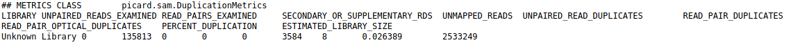
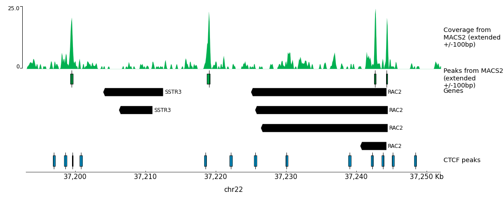
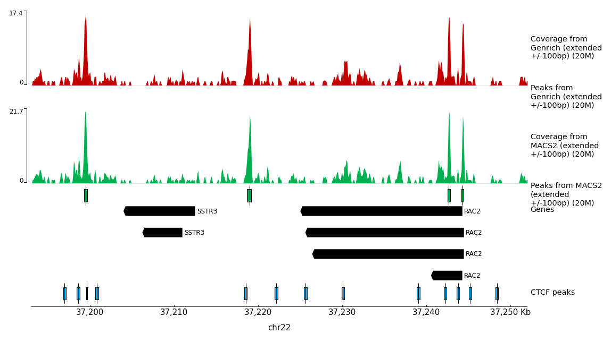

# Introduction
{:.no_toc}

In many eukaryotic organisms, such as humans, the genome is tightly packed and organized with the help of nucleosomes (heterochromatin). A nucleosome is a complex formed by eight histone proteins that is wrapped with DNA. If the DNA is transcribed into RNA, the DNA will be opened and loosened from the nucleosome complex (euchromatin). Many factors, such as the chromatin structure, the position of the nucleosomes, and histone modifications, play an important role in the organization and accessibility of the DNA. Consequently, these factors are also important for the activation and inactivation of genes. **A**ssay for **T**ransposase-**A**ccessible **C**hromatin using **seq**uencing ([ATAC-Seq](https://en.wikipedia.org/wiki/ATAC-seq)) is a method to investigate the accessibility of chromatin and thus a method to determine regulatory mechanisms of gene expression. The method can help identify promoter regions and potential enhancers and silencers. A promoter is the DNA region close to the transcription start site (TSS). It contains binding sites for transcription factors that will recruit the RNA polymerase. An enhancer is a DNA region that can be located up to 1 Mb downstream or upstream of the promoter. When transcription factors bind an enhancer and contact a promoter region, the transcription of the gene is increased. In contrast, a silencer decreases or inhibits the gene's expression. ATAC-Seq has become popular as it's easier, faster and requires less cells than alternative techniques for assaying accessible regions of the genome, such as FAIRE-Seq and DNase-Seq.


With ATAC-Seq, to find accessible (open) chromatin regions, the genome is treated with an enzyme called Tn5, which is a transposase. A [transposase](https://en.wikipedia.org/wiki/Transposase) can bind to a [transposable element](https://en.wikipedia.org/wiki/Transposable_element), which is a DNA sequence that can change its position (jump) within a genome (read the two links to get a deeper insight). During ATAC-Seq, the Tn5 inserts DNA sequences which corresponds to truncated Nextera adapters into open regions of the genome and concurrently, the DNA is sheared by the transposase activity. The read library is then prepared for sequencing, including PCR amplification with full Nextera adapters and purification steps. Paired-end reads are recommended for ATAC-Seq for the reasons described [here](https://informatics.fas.harvard.edu/atac-seq-guidelines.html). 

In this tutorial we will use data from the study of [Buenrostro et al. 2013](https://www.ncbi.nlm.nih.gov/pmc/articles/PMC3959825), the first paper on ATAC-Seq. The data is from a human cell line of purified CD4+ T cells, called GM12878. The original dataset had 2 x 200 million reads and this would be too big to process in a training session. So, we downsampled the original dataset to 200,000 randomly selected reads. We also added about 200,000 reads pairs that will map to chromosome 22 to have a good profile on this chromosome, similar to what you might get with a typical ATAC-Seq sample (2 x 20 million reads in original fastq). Furthermore, we want to compare the predicted open chromatin regions to the known binding sites of CTCF, a DNA-binding protein implicated in 3D structure: [CTCF](https://en.wikipedia.org/wiki/CTCF). CTCF is known to bind to thousands of sites in the genome and thus it can be used as a positive control for assessing if the ATAC-Seq experiment is good quality. Indeed, the accessibility generated by CTCF binding is much lower than the accessibility around TSS. A good ATAC-Seq data, would have accessible regions outside of TSS, for example, at some CTCF binding sites. For that reason, we will download binding sites of CTCF identified by ChIP in the same cell line from ENCODE (ENCSR000AKB, dataset ENCFF933NTR).


> ### Agenda
>
> In this tutorial, we will cover:
>
> 1. TOC
> {:toc}
>
{: .agenda}




# Preprocessing

## Get Data

We first need to download the sequenced reads (FASTQs) as well as other annotation files. Then, to increase the number of reads that will map to the reference genome (here Human genome version 38), we need to preprocess the reads.


> ###  Hands-on: Data upload
>
> 1. Create a new history for this tutorial
>
>    
>
> 2. Import the files from [Zenodo](https://zenodo.org/record/3270536) and [ENCODE](https://www.encodeproject.org/) or from the shared data library
>
>    ```
>    https://zenodo.org/record/3270536/files/SRR891268_R1.fastq.gz
>    https://zenodo.org/record/3270536/files/SRR891268_R2.fastq.gz
>    https://www.encodeproject.org/files/ENCFF933NTR/@@download/ENCFF933NTR.bed.gz
>    ```
>
>    
>    
>
> 3. Add a tag called `#SRR891268_R1` to the R1 file and a tag called `#SRR891268_R2` to the R2 file.
>
>    
>
> 4. Check that the datatype of the 2 FASTQ files is `fastqsanger.gz` and the BED file is `bed`. If they are not then change the datatype as described below.
>
>    
>
{: .hands_on}

> ###  FASTQ format
> If you are not familiar with FASTQ format, see the [Quality Control tutorial]({{ site.baseurl }})
{: .comment}
>
> ###  BED format
> If you are not familiar with BED format, see the [BED Format](https://genome.ucsc.edu/FAQ/FAQformat.html)
{: .comment}

> ###  Hands-on: Obtain Annotation of hg38 (bed file of genes)
>
> 1. **UCSC Main**  with the following parameters:
>    - *"clade"*: `Mammal`
>    - *"genome"*: `Human`
>    - *"assembly"*: `Dec. 2013 (GRCh38/hg38)`
>    - *"group"*: `Genes and Gene Prediction`
>    - *"track"*: `All GENCODE V31`
>    - *"table"*: `Basic`
>    - *"region"*: `position` `chr22`
>    - *"output format"*: `all fields from selected table`
>    - *"Send output to"*: `Galaxy`
> 2. Click **get output**
> 3. Click **Send query to Galaxy**
> This table contains all the information but is not in a BED format. To transform it into a bed format we will rearrange the columns:
> 4. **Cut columns from a table**  with the following parameters:
>    -  *"Cut columns"*: `c3,c5,c6,c13,c12,c4`
>    -  *"Delimited by"*: `Tab`
>    -  *"From"*: `UCSC Main on Human: wgEncodeGencodeBasicV31 (chr22:1-50,818,468)`
> 5. Rename the dataset as genes.bed
>
>    
>
> 6. Change its datatype to bed
>
>    
>
{: .hands_on}

>
> ###  gene file
> The gene bed we produced only contains the start, the end, the name, and the strand of each transcript. It does not contains exon information.
> To be able to have the exon information, you could use a gtf file which can be downloaded from the gencode website (ftp://ftp.ebi.ac.uk/pub/databases/gencode/Gencode_human/release_31/gencode.v31.annotation.gtf.gz) but this file would get the information for the whole genome. It would slow the analysis.
{: .comment}

## Quality Control

The first step is to check the quality of the reads and the presence of the Nextera adapters. When we perform ATAC-Seq, two transposases could cut the DNA about 40 bp apart. This would happen when two adjacent homodimers would cut DNA due to steric constrains [Adey et al. 2010](https://genomebiology.biomedcentral.com/articles/10.1186/gb-2010-11-12-r119). This can be smaller than the sequencing length so we expect to have Nextera adapters at the end of those reads. We can do this with `FastQC`. The FastQC web page **Adapter Content** section shows the presence of Nextera Transposase Sequence in the reads. We will remove the adapters with Cutadapt.

> ###  Hands-on: Task description
>
> 1. **FastQC**  with the default parameters:
>       - *"Short read data from your current history"*: Choose here either only the `SRR891268_R1` file with  or use  **Multiple datasets** to choose both `SRR891268_R1` and `SRR891268_R2`.
> 2. Inspect the web page output of **FastQC**  for the `SRR891268_R1` sample. Check what adapters are found at the end of the reads.
>
>    > ###  Questions
>    >
>    > How many reads are in the FASTQ?
>    >
>    > > ###  Solution
>    > >
>    > > There are 285247 reads.
>    > >
>    > {: .solution}
>    >
>    >
>    > Which are the steps which have a warning?
>    >
>    > > ###  Solution
>    > >
>    > > 1) Per base sequence content
>    > > > ###  Tn5 sequence bias
>    > > > It is well known that the Tn5 has a strong sequence bias at the insertion site. You can read more about it in [Green et al. 2012](https://mobilednajournal.biomedcentral.com/articles/10.1186/1759-8753-3-3)
>    > > {: .comment}
>    > >
>    > > 2) Sequence Duplication Levels
>    > > > ###  PCR Duplicates
>    > > > The read library quite often has PCR duplicates that are introduced
>    > > > simply by the PCR itself. We will remove these duplicates later on.
>    > > {: .comment}
>    > >
>    > > 3) Overrepresented sequences
>    > > > ###  Adapter Sequences
>    > > > Nextera adapter sequences are observable in the **Adapter Content** section.
>    > > {: .comment}
>    > >
>    > {: .solution}
>    >
>    {: .question}
{: .hands_on}

> ###  FastQC Results
> This is what you should expect from the Adapter Content section:
> 
{: .comment}

## Trimming Reads

To trim the adapters we provide the Nextera adapter sequences to `Cutadapt`. These adapters are shown in the image below.


The forward and reverse adapters are slightly different. We will also trim low quality bases at the ends of the reads (quality less than 20). We will only keep reads that are at least 20 bases long. We remove short reads (< 20bp) as they are not useful, they will either be thrown out by the mapping or may interfere with our results at the end.


> ###  Hands-on: Task description
>
> 1. **Cutadapt**  with the following parameters:
>    - *"Single-end or Paired-end reads?"*: `Paired-end`
>        -  *"FASTQ/A file #1"*: select `SRR891268_R1`
>        -  *"FASTQ/A file #2"*: select `SRR891268_R2`
>        - In *"Read 1 Options"*:
>            - In *"3' (End) Adapters"*:
>                -  *"Insert 3' (End) Adapters"*
>                    - *"Source"*: `Enter custom sequence`
>                        -  *"Enter custom 3' adapter name (Optional if Multiple output is 'No')"*: `Nextera R1`
>                        -  *"Enter custom 3' adapter sequence"*: `CTGTCTCTTATACACATCTCCGAGCCCACGAGAC`
>        - In *"Read 2 Options"*:
>            - In *"3' (End) Adapters"*:
>                -  *"Insert 3' (End) Adapters"*
>                    - *"Source"*: `Enter custom sequence`
>                        -  *"Enter custom 3' adapter name (Optional)"*: `Nextera R2`
>                        -  *"Enter custom 3' adapter sequence"*: `CTGTCTCTTATACACATCTGACGCTGCCGACGA`
>    - In *"Filter Options"*:
>        -  *"Minimum length"*: `20`
>    - In *"Read Modification Options"*:
>        -  *"Quality cutoff"*: `20`
>    - In *"Output Options"*:
>        - *"Report"*: `Yes`
>
> 2. Click on the  (eye) icon of the report and read the first lines.
{: .hands_on}

> ###  Cutadapt Results
> You should get similar output to this from Cutadapt:
> 
{: .comment}

> ###  Questions
>
> 1. What percentage of reads contain adapters?
> 2. What percentage of reads are still longer than 20bp after the trimming?
>
> > ###  Solution
> >
> > 1. ~14%
> > 2. ~99%
> >
> {: .solution}
>
{: .question}

> ###  Hands-on: Check Adapter Removal with FastQC
>
> 1. **FastQC**  with the default parameters:
>       - *"Short read data from your current history"*: select the output of **Cutadapt**  **Multiple datasets** to choose both `Read 1 Output` and `Read 2 Output`.
>
> 2. Click on the  (eye) icon of the report and read the first lines.
{: .hands_on}

> ###  FastQC Results
> If we run `FastQC` again we should see under **Adapter Content** that the Nextera adapters are no longer present.
> 
{: .comment}

# Mapping

## Mapping Reads to Reference Genome

Next we map the trimmed reads to the human reference genome. Here we will use `Bowtie2`. We will extend the maximum fragment length (distance between read pairs) from 500 to 1000 because we know some valid read pairs are from this fragment length. We will use the **--very-sensitive** parameter to have more chance to get the best match even if it takes a bit longer to run. We will run the **end-to-end** mode because we trimmed the adapters so we expect the whole read to map, no clipping of ends is needed.

> ###  Hands-on: Mapping reads to reference genome
>
> 1. **Bowtie2**  with the following parameters:
>    - *"Is this single or paired library"*: `Paired-end`
>        -  *"FASTQ/A file #1"*: select the output of **Cutadapt**  *"Read 1 Output"*
>        -  *"FASTQ/A file #2"*: select the output of **Cutadapt**  *"Read 2 Output"*
>        - *"Do you want to set paired-end options?"*: `Yes`
>            - *"Set the maximum fragment length for valid paired-end alignments"*: `1000`
>            - *"Allow mate dovetailing"*: `Yes`
>    - *"Will you select a reference genome from your history or use a built-in index?"*: `Use a built-in genome index`
>        - *"Select reference genome"*: `Human Dec. 2013 (GRCh38/hg38 (hg38)`
>    - *"Select analysis mode"*: `1: Default setting only`
>        - *"Do you want to use presets?"*: `Very sensitive end-to-end (--very-sensitive)`
>    - *"Save the bowtie2 mapping statistics to the history"*: `Yes`
>
> 2. Click on the  (eye) icon of the mapping stats.
{: .hands_on}

> ###  Bowtie2 Results
> You should get similar results to this from Bowtie2:
> 
{: .comment}

> ###  Questions
>
> What percentage of read pairs mapped concordantly?
>
> > ###  Solution
> >
> > 54.07+43.63=97.7%
> >
> {: .solution}
>
{: .question}

> ###  Comment on the number of uniquely mapped.
>
> You might be surprised by the number of uniquely mapped compared to the number of multi-mapped reads (reads mapping to more than one location in the genome).
> One of the reasons is that we have used the parameter **--very-sensitive**. Bowtie2 considers a read as multi-mapped even if the second hit has a much lower quality than the first one.
> Another reason is that we have reads that map to the mitochondrial genome. The mitochondrial genome has a lot of regions with similar sequence.
>
{: .comment}

# Filtering Mapped Reads

## Filter Uninformative Reads

We apply some filters to the reads after the mapping. ATAC-Seq datasets can have a lot of reads that map to the mitchondrial genome because it is nucleosome-free and thus very accessible to Tn5 insertion. The mitchondrial genome is uninteresting for ATAC-Seq, thus we remove these reads. We also remove reads with low mapping quality and reads that are not properly paired.

> ###  Hands-on: Filtering of uninformative reads
>
> 1. **Filter** BAM datasets on a variety of attributes  with the following parameters:
>    -  *"BAM dataset(s) to filter"*: Select the output of  **Bowtie2**  *"alignments"*
>    - In *"Condition"*:
>        - *"1: Condition"*
>            - In *"Filter"*:
>                - *"1: Filter"*
>                    - *"Select BAM property to filter on"*: `mapQuality`
>                        - *"Filter on read mapping quality (phred scale)"*: `>=30`
>                -  *"Insert Filter"*
>                    - *"Select BAM property to filter on"*: `isProperPair`
>                        - *"Select properly paired reads"*: `Yes`
>                -  *"Insert Filter"*
>                    - *"Select BAM property to filter on"*: `reference`
>                        - *"Filter on the reference name for the read"*: `!chrM`
>    - *"Would you like to set rules?"*: `No`
>
>
> 2. Click on the input and the output BAM files of the filtering step. Check the size of the files.
>
{: .hands_on}

> ###  Questions
>
> 1. Based on the file size, what proportion of alignments was removed (approximately)?
> 2. Which parameter should be modified if you are interested in repetitive regions?
>
> > ###  Solution
> >
> > 1. The original BAM file is 28 MB, the filtered one is 14.8 MB. Approximately half of the alignments were removed.
> >
> > 2. You should modify the mapQuality criteria and decrease the threshold.
> >
> {: .solution}
>
{: .question}

> ###  Tip: Getting the number of reads which mapped to chrM
>
> To get the number of reads that mapped to the mitochondrial genome (or for each chromosome) you can run **Samtools idxstats**  on the output of  **Bowtie2**  *"alignments"*.
> The columns of the output are: chromosome name, chromosome length, number of reads mapping to the chromosome, number of unaligned mate whose mate is mapping to the chromosome.
> The first 2 lines of the result would be (after sorting):
>
> 
>
> There are 221 000 reads which map to chrM and 170 000 which map to chr22.
{: .tip}

## Filter Duplicate Reads

Because of the PCR amplification, there might be duplicates (different reads mapping to exactly the same genomic region) from overamplification of some regions. As the Tn5 insertion is random within an accessible region, we do not expect to see fragments with the same coordinates. We consider such fragments to be PCR duplicates. We will remove them with `Picard`.

> ###  Hands-on: Remove duplicates
>
> 1. **MarkDuplicates**  with the following parameters:
>    -  *"Select SAM/BAM dataset or dataset collection"*: Select the output of  **Filter**  *"BAM"*
>    - *"If true do not write duplicates to the output file instead of writing them with appropriate flags set"*: `Yes`
>
>    > ###  Comment: Default of  **MarkDuplicates** 
>    >
>    > By default, the tool will only "Mark" the duplicates. This means that it will change the Flag of the duplicated reads to enable them to be filtered afterwards. We use the parameter *"If true do not write duplicates to the output file instead of writing them with appropriate flags set"* to directly remove the duplicates.
>    {: .comment}
>
> 2. Click on the  (eye) icon of the MarkDuplicate metrics.
{: .hands_on}

> ###  MarkDuplicates Results
> You should get similar output to this from MarkDuplicates:
> 
{: .comment}

> ###  Tip: Formatting the MarkDuplicate metrics for readability
> You can copy/paste the 2 lines with header and data into an Excel sheet.
> Replace `Unknown Library` by `Unknown_Library` in the second line.
> Then do Text to Columns (it is space delimited data). You should check the box for Treat consecutive delimiters as one.
> Finally you copy and paste special your table to transpose it.
> Now you should have:
>
> 
>
{: .tip}

> ###  Questions
>
> 1. How many pairs were in the input?
> 2. How many pairs are duplicates?
>
> > ###  Solution
> >
> > 1. 133284
> > 2. 3549
> >
> {: .solution}
>
{: .question}

## Check Insert Sizes

We will check the insert sizes with `Picard CollectInsertSizeMetrics`. The insert size is the distance between the R1 and R2 read pairs. This tells us the size of the DNA fragment the read pairs came from. The fragment length distribution of a sample gives a very good indication of the quality of the ATAC-Seq.

> ###  Hands-on: Plot the distribution of fragment sizes.
>
> 1. **CollectInsertSizeMetrics**  with the following parameters:
>    -  *"Select SAM/BAM dataset or dataset collection"*: Select the output of  **MarkDuplicates**  *"BAM output"*
>    - *"Load reference genome from"*: `Local cache`
>        - *"Using reference genome"*: `Human Dec. 2013 (GRCh38/hg38) (hg38)`
>
> 2. Click on the  (eye) icon of the upper one of the 2 outputs (the pdf file).
{: .hands_on}

> ###  CollectInsertSizeMetrics Results
> This is what you get from CollectInsertSizeMetrics:
> 
{: .comment} 

> ###  Questions
>
> 1. Could you guess what the peaks at approximately 50bp, 200bp, 400bp and 600bp correspond to?
>
> > ###  Solution
> >
> > The first peak (50bp) corresponds to where the Tn5 transposase inserted into nucleosome-free regions. The second peak (a bit less than 200bp) corresponds to where Tn5 inserted around a single nucleosome. The third one (around 400bp) is where Tn5 inserted around two adjacent nucleosomes and the fourth one (around 600bp) is where Tn5 inserted around three adjacent nucleosomes.
> >
> {: .solution}
>
{: .question}

This fragment size distribution is a good indication if your experiment worked or not.
In absence of chromatin (without nucleosome), this is the profile you would get:


Here are examples of Fragment size distributions of ATAC-Seq which were very noisy:


A final example of a Fragment size distribution of a very good ATAC-Seq, even if we cannot see the third nucleosome "peak".


> ###  Comment on FR and RF
>
> FR stands for forward reverse orientation of the read pairs, meaning, your reads are oriented as -> <- so the first read is on the forward and the second on the reverse strand. RF stands for reverse forward oriented, i.e., <- ->. It really depends on your experiment, how your reads are oriented and if the orientation plays a role.
{: .comment}

# Peak calling

## Call Peaks

We have now finished the data preprocessing. Next, in order to find regions corresponding to potential open chromatin regions, we need a tool that can identify differentially covered regions of the genome. That is to say, we want to identify regions where reads have piled up (peaks) greater than the background read coverage. We use [Genrich](https://github.com/jsh58/Genrich) for that reason. It is very important at this point that we center the reads on the 5' extremity (where the Tn5 cut). You want your peaks around the nucleosomes and not directly on the nucleosome:


If we only assess the coverage of the start sites of the reads, the data would be too sparse and it would be impossible to call peaks. Thus, we will extend the start sites of the reads to 50 bp in each direction to assess coverage.

> ###  Comment on Tn5 insertion
>
> When Tn5 cuts an accessible chromatin locus it inserts adapters separated by 9bp [Kia et al. 2017](https://bmcbiotechnol.biomedcentral.com/track/pdf/10.1186/s12896-016-0326-1):
> 
>
> This means that to have the read start site reflect the centre of where Tn5 bound, the reads on the positive strand should be shifted 4 bp to the right and reads on the negative strands should be shifted 5 bp to the left as in [Buenrostro et al. 2013](https://www.ncbi.nlm.nih.gov/pmc/articles/PMC3959825). Here, `Genrich` is applying this shift.
{: .comment}

> ###  Hands-on: Identifying enriched genomic regions
>
> 1. **Genrich**  with the following parameters:
>    - *"Are you pooling Treatment Files?"*: `No`
>    -  *"Treatment File(s)"*: Select the output of  **MarkDuplicates** 
>    - *"Do you have a Control File?"*: `No`
>    - *"Filter Options"*:
>        - *"Remove PCR duplicates"*: `Yes`
>    - *"ATAC Options"*:
>        - *"Use ATAC-seq mode."*: `Yes`
>        - *"Expand cut sites."*: `100`
>    - *"Output Options"*:
>        - *"Bedgraph-ish Pileups"*: `Yes`
>
{: .hands_on}

# Visualisation of Coverage

## Prepare the Datasets

Thanks to `Genrich` we now have a coverage file which represents the coverage of the read start sites extended 50 bp to each side.
The output of `Genrich` is a BedGraph-ish pileup (6 columns text format with a comment line and a header). We will first need to convert it to a bedgraph format (4 columns text format with no header) to be able to visualize it. The bedgraph format is easily readable for human but it can be very large and visualising a specific region is quite slow. We will change it to bigwig format which is a binary format, where we can visualise any region of the genome very quickly.

### Convert BedGraph-ish pileup to bigWig

> ###  Hands-on: Convert bedgraph-ish pileup to bigWig.
>
> 1. **Text reformatting with awk**  with the following parameters:
>    -  *"File to process"*: Select the output of **Genrich**  *"Bedgraph Pileups"*.
>    - *"AWK Program"*: `NR>=3 {print $1,$2,$3,$4}`
>
>    > ###  Comment: From BedGraph-ish pileup to bedgraph
>    >
>    > The awk program will read each line of the output of **Genrich** , when the number of the line is greater or equal to 3 (NR>=3), it will write the first 4 columns (print $1,$2,$3,$4) into a new file.
>    {: .comment}
>
> 2. **Wig/BedGraph-to-bigWig**  with the following parameters:
>    -  *"Convert"*: Select the output of **Text reformatting with awk**  *"Bedgraph"*.
>    - *"Converter settings to use"*: `Default`
>
{: .hands_on}

### Sort CTCF Peaks
In order to visualize a specific region (e.g., the gene *RAC2*), we can either use a genome browser like `IGV` or `UCSC browser`, or use `pyGenomeTracks` to make publishable figures. We will use `pyGenomeTracks`. The tool **pyGenomeTracks**  needs all bed files sorted, thus we sort the CTCF peaks.

> ###  Hands-on: Sort the BED files
>
> 2. **bedtools SortBED** order the intervals   with the following parameters:
>    -  *"ENCFF933NTR.bed.gz"*.
>
{: .hands_on}

### Convert the Genrich peaks in bed
For the moment, the wrapper of **pyGenomeTracks**  does not deal with the datatype encodepeak which is a special bed. So we need to change the datatype of the output of **Genrich**  from encodepeak to bed.



## Visualise Regions with **pyGenomeTracks**

> ###  Hands-on: Task description
>
> 1. **pyGenomeTracks**  with the following parameters:
>    - *"Region of the genome to limit the operation"*: `chr22:37,193,000-37,252,000`
>    - In *"Include tracks in your plot"*:
>        - *"1. Include tracks in your plot"*
>            - *"Choose style of the track"*: `Bigwig track `
>                - *"Plot title"*: `Coverage from Genrich (extended +/-50bp)`
>                -  *"Track file bigwig format"*: Select the output of **Wig/BedGraph-to-bigWig** .
>                - *"Color of track"*: Select the color of your choice
>                - *"height"*: `5`
>                - *"Show visualization of data range"*: `Yes`
>                - *"Include spacer at the end of the track"*: `0.5`
>        -  *"Insert Include tracks in your plot"*
>                - *"Plot title"*: `Peaks from Genrich (extended +/-50bp)`
>                -  *"Track file bed format"*: Select the output of **Genrich**  (the one you converted from encodepeak to bed).
>                - *"Color of track"*: Select the color of your choice
>                - *"height"*: `3`
>                - *"Plot labels"*: `No`
>                - *"Include spacer at the end of the track"*: `0.5`
>        -  *"Insert Include tracks in your plot"*
>            - *"Choose style of the track"*: `Gene track / Bed track`
>                - *"Plot title"*: `Genes`
>                -  *"Track file bed format"*: Select the output of **Cut columns from a table** .
>                - *"Color of track"*: Select the color of your choice
>                - *"height"*: `5`
>                - *"Include spacer at the end of the track"*: `0.5`
>        -  *"Insert Include tracks in your plot"*
>            - *"Choose style of the track"*: `Gene track / Bed track`
>                - *"Plot title"*: `CTCF peaks`
>                -  *"Track file bed format"*: Select the dataset `bedtools SortBED of ENCFF933NTR.bed.gz`
>                - *"Color of track"*: Select the color of your choice
>                - *"Plot labels"*: `No`
>                - *"Include spacer at the end of the track"*: `0.5`
>    - *"Configure x-axis"*: `Yes`
>        - *"Where to place the x-axis"*: `Bottom`
>
> 2. Click on the  (eye) icon of the output.
>
{: .hands_on}


> ###  pyGenomeTracks Results
> This is what you get from pyGenomeTracks:
> 
{: .comment}

Unfortunately, Genrich did not work with our training dataset (every covered region is called a peak). This is because most of the data is on chr22 whereas the background model was built on the whole genome.
When, the pipeline was run on 20 million of pairs from the original dataset.
This is the output of pyGenomeTracks:



> ###  Questions
> On this selected region we see four peaks on TSS (middle track) or CTCF binding loci (bottom track).
>
> 1. How many TSS are accessible in the displayed region?
> 2. How many CTCF binding loci are accessible in the displayed region?
> 3. Can you spot peaks with no TSS and no CTCF peak?
>
> > ###  Solution
> >
> > 1. In total, we can see 3 TSS for 6 transcripts for 2 genes. The TSS of RAC2 correspond to an ATAC-Seq peak whereas there is no significant coverage on both TSS of SSTR3.
> >
> > 2. Only the first peak overlap with a CTCF.
> >
> > 3. Among, the 4 peaks, the two in the middle does neither correspond to CTCF peaks nor to TSS. These two regions could be putative enhancers. Indeed, even if some enhancers overlap with CTCF peaks, only a few proportion of CTCF peaks correspond to enhancers. As CTCF, by itself, can deplace the nucleosome and create accessible regions it is more likely that a region with no CTCF peak and no TSS would be a putative enhancer. Of course, more analyses are needed to assess its role, for example, histone ChIP-seq, 3D structure, transgenic assay, etc.
> >
> {: .solution}
>
{: .question}

## Create heatmap of genes

You might also be interested in specific regions. For this, you can compute a heatmap. We will use the `deepTools plotHeatmap`. As an example, we will here make a heatmap centered on the transcription start sites (TSS).

### Generate computeMatrix

The input of `plotHeatmap` is a matrix in a hdf5 format. To generate it you will use the tool `computeMatrix` that will evaluate the coverage at each locus you are interested in.

> ###  Hands-on: Generate the matrix
>
> 1. **computeMatrix**  with the following parameters:
>    - In *"Select regions"*:
>        - 1. *"Select regions"*
>            -  *"Regions to plot"*: Select the dataset `hg38_Gencode_V28_chr22_geneName.bed`
>    - *"Sample order matters"*: `No`
>        -  *"Score file"*: Select the output of **Wig/BedGraph-to-bigWig** .
>    - *"computeMatrix has two main output options"*: `reference-point`
>    - *"The reference point for the plotting"*: `beginning of region (e.g. TSS)`
>    - *"Show advanced output settings"*: `no`
>    - *"Show advanced options"*: `yes`
>        - *"Convert missing values to 0?"*: `yes`
>        - *"Labels for the samples (each bigwig)"*: `ATAC-Seq`
>
{: .hands_on}


## Plot with **plotHeatmap**

We will now generate a heatmap. Each line will be a transcript. The coverage will be summarized with a color code from red (no coverage) to blue (maximum coverage). All TSS will be aligned in the middle of the figure and only the 2 kb around the TSS will be displayed. Another plot, on top of the heatmap, will show the mean signal at the TSS.

> ###  Hands-on: Generate the heatmap
>
> 1. **plotHeatmap**  with the following parameters:
>    -  *"Matrix file from the computeMatrix tool"*: Select the output of **computeMatrix** .
>    - *"Show advanced output settings"*: `no`
>    - *"Show advanced options"*: `no`
{: .hands_on}

> ###  plotHeatmap Results
> This is what you get from plotHeatmap:
> 
{: .comment}

> ###  Questions
>
> 1. What is the mean value in genes?
> 2. Is the coverage symmetric?
>
> > ###  Solution
> >
> > 1. Around 2.5.
> > 2. No it is higher on the left which is expected as usually the promoter of active genes is accessible.
> >
> {: .solution}
>
{: .question}


# Conclusion

In this training you should have learned about the general idea of ATAC-Seq. ATAC-Seq
is a method to investigate the chromatin accessibility. The genome is treated with
a transposase (enzyme) called Tn5. It marks open chromatin regions by cutting and
inserting adapters for sequencing. The training material gave you an insight into the
quality control of the data. You should look for low quality bases, adapter contamination, correct insert size and PCR duplicates (duplication level). We showed you how to remove adapters and PCR duplicates, if `FastQC`, shows a warning in these areas. We mapped the reads
with `Bowtie2`, filtered our reads for properly paired, good quality and reads that do not
map to the mitochondrial genome. We found open chromatin regions with `Genrich`, which
is a tool to find differential covered regions (peak calling). We visualized the peaks and other informative tracks, such as CTCF binding regions and hg38 genes, with the help of `pyGenomeTracks`. Last but not least, we investigated the read coverage of our ATAC-Seq experiment around TSS with the help of `computeMatrix` and `plotHeatmap`. At the end, we found
open chromatin regions that did not overlap with CTCF sites or TSS, which pronounce potential putative enhancer regions that we have covered with our ATAC-Seq experiment. One of these regions are located in the intron of a gene, the other one was in between genes. However, it is impossible to guess from the position which would be the gene controlled by this region.


