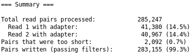

# Introduction
{:.no_toc}


In many organism transcription factors (TF) play an important tole in the regulation of the gene expression. In human we have up to 2,800 proteins and more than 1,600 are TF ([list of transcription factors](https://en.wikipedia.org/wiki/List_of_human_transcription_factors)), although the number might change over timer. Investigating the role of TFs, such as [GATA1](https://en.wikipedia.org/wiki/GATA1), is a very important task to understand the regulatory mechanisms in the cell and thus ascertain the source of a disease, such as [myelofibrosis](https://en.wikipedia.org/wiki/Primary_myelofibrosis) a type of blood cancer.  


**C**leavage **U**nder **T**argets and **R**elease **U**sing **N**uclease (CUT&RUN) became the new and advanced method to analyse DNA-associated proteins. CUT&RUN uses an antibody just as [ChIP-Seq](https://en.wikipedia.org/wiki/ChIP_sequencing) to select the protein of interest (POI). The big difference, CUT&RUN couples the antibody with a protein A-micrococcal nuclease (pA-MNase), which you can see in **Figure 1**. The [enzyme](https://en.wikipedia.org/wiki/Micrococcal_nuclease) is an endo-exonuclease that cleaves and shortens the bound DNA of the selected POI *in-situ*. CUT&RUN allows to fragment the DNA in intact cells and thus allows to study protein-DNA interactions in a more natural state. The added pA-MNase thus creates shorted fragments that lead to a higher resolution for the mapping in comparison to your standard ChIP-Seq protocol. CUT&RUN follows four fundamental steps: (1) fixate and make the nuceli or cells permeable, (2) add selective antibody of the POI, (3) add and activate pA-MNas, (4) release DNA complex and collect the DNA from the supernatant. Afterwards, the DNA can be PCR amplified and prepared for sequencing.

In this tutorial we will use data from the study of . The article introduces a CUT&RUN pipeline that we are **not** completely follow. It is important to note at this point that a CUT&RUN data analysis is more similar to an ATAC-Seq experiment than a standard ChIP-Seq. We will analyze the two biological replicates from an CUT&RUN experiment for the aforementioned TF GATA1 in human. We downsampled the data to speed up the run times in this tutorial. Our results will be compared to identified binding sites of GATA1 of a ChIP-Seq experiment.

### When working with real data
{:.no_toc}
The workflow for this training material can be found [here](https://usegalaxy.eu/u/heylf/w/copy-of-cutandrunlong). When you use your own data we suggest to use [this workflow](https://usegalaxy.eu/u/heylf/w/cutandrunlong) which includes additional steps for your data analysis. Both worklfows do not support a peak calling with controls as CUT&RUN has a low background. It is often recommended to use a positive or negative control as a comparison. Spike-in controls can be done for CUT&RUN but need then additional steps in the provided workflows to take them into consideration.    

> ### Agenda
>
> In this tutorial, we will cover:
>
> 1. TOC
> {:toc}
>
{: .agenda}



# Preprocessing

## Get Data

We first need to download the sequenced reads (FASTQs) as well as other annotation files. Then, to increase the number of reads that will map to the reference genome (here human genome version 38, GRCh38/hg38), we need to preprocess the reads.


> ###  Hands-on: Data upload
>
> 1. Create a new history for this tutorial
>
>    
>
> 2. Import the files from [Zenodo](https://doi.org/10.5281/zenodo.3862792) or from
>    the shared data library (`GTN - Material` -> `{{ page.topic_name }}`
>     -> `{{ page.title }}`):
>
>    ```
>    https://zenodo.org/record/3862793/files/ENCFF933NTR.bed.gz
>    https://zenodo.org/record/3862793/files/SRR891268_chr22_enriched_R1.fastq.gz
>    https://zenodo.org/record/3862793/files/SRR891268_chr22_enriched_R2.fastq.gz
>    ```
>
>    
>    
>
> 3. Add a tag called `#SRR891268_R1` to the R1 file and a tag called `#SRR891268_R2` to the R2 file.
>
>    
>
> 4. Check that the datatype of the 2 FASTQ files is `fastqsanger.gz` and the peak file (ENCFF933NTR.bed.gz) is `encodepeak`. If they are not then change the datatype as described below.
>
>    
>
{: .hands_on}

> ###  FASTQ format
> If you are not familiar with FASTQ format, see the [Quality Control tutorial]()
{: .comment}
>
> ###  BED / encode narrowPeak format
> If you are not familiar with BED format or encode narrowPeak format, see the [BED Format](https://genome.ucsc.edu/FAQ/FAQformat.html)
{: .comment}

## Quality Control

We first have to check if our data contains adapter sequences that we have to remove. A typical CUT&RUN experiment has a read length of 30-80 nt. We can check the raw data quality with **FastQC**.

> ###  Hands-on: Task description
>
> 1.  with the following parameters:
>       - *"Short read data from your current history"*: Choose here either only the `SRR891268_R1` file with  or use  **Multiple datasets** to choose both `SRR891268_R1` and `SRR891268_R2`.
> 2. Inspect the web page output of **FastQC**  for the `SRR891268_R1` sample. Check what adapters are found at the end of the reads.
>
> > ###  Questions
> >
> > 1. How many reads are in the FASTQ?
> > 2. Which sections have a warning?
> >
> > > ###  Solution
> > >
> > > 1. There are 300,000 reads.
> > > 2. The 3 steps below have warnings:
> > >
> > >    1. **Per base sequence content**
> > >
> > >       CUT&RUN has some base biases at the start of every read.
> > >
> > >    2. **Sequence Duplication Levels**
> > >
> > >       The read library quite often has PCR duplicates that are introduced
> > >       simply by the PCR itself. We will remove these duplicates later on.
> > >
> > >    3. **Adapter Content**
> > >
> > >       Our data contains adapter that we still have to remove.
> > >
> > {: .solution}
> >
>    {: .question}
{: .hands_on}

> ###  FastQC Results
> This is what you should expect from the **Adapter Content** section:
> 
{: .comment}

The FastQC report pointed out that we have in our data some standard Illumina adapter sequences, which we will remove with Trim Galore!.

## Trimming Reads

**Trim Galore!** is a handy tool that can automatically detect and trim standard Illumina adapters.

> ###  Hands-on: Task description
>
> 1.  with the following parameters:
>    - *"Is this library paired- or single-end?"*: `Paired-end`
>        -  *"Reads in FASTQ format"*: select `SRR891268_R1`
>        -  *"Reads in FASTQ format (second)"*: select `SRR891268_R2`
>    - In *"Adapter sequence to be trimmed"*: `Illumina universal`
>    - In *"Trim low-quality ends from reads in addition to adapter removal (Enter phred quality score threshold)"*: `30`
>    - In *"Discard reads that became shorter than length N"*: `15`
>    - In *"Generate a report file"*:   `Yes`
>
> 2. Click on the  (eye) icon of the report and read the first lines.
{: .hands_on}

> ###  Trim Galore Results
> You should get similar output to this from Trim Galore:
> 
{: .comment}


> ###  Questions
>
> 1. What percentage of reads contain adapters?
> 2. What percentage of reads are still longer than 20bp after the trimming?
>
> > ###  Solution
> >
> > 1. ~14%
> > 2. ~99%
> >
> {: .solution}
>
{: .question}

> ###  Hands-on: Check Adapter Removal with FastQC
>
> 1.  with the following parameters:
>       - *"Short read data from your current history"*: select the output of **Trim Galore!**  **Multiple datasets** to choose both `Read 1 Output` and `Read 2 Output`.
>
> 2. Click on the  (eye) icon of the report and read the first lines.
{: .hands_on}

> ###  FastQC Results
> Now, you should see under **Overrepresented sequences** that there is no more overrepresented sequences and under **Adapter Content** that the Nextera adapters are no longer present.
> 
> However, you may have noticed that you have a new section with warning: **Sequence Length Distribution**. This is expected as you trimmed part of the reads.
{: .comment}

It can happen that a read library contains double adapter ligations, which means that the read as two adapter sequences. Thus, we have to do a second adapter trimming.


> ###  Hands-on: Task description
>
> 1.  with the following parameters:
>    - *"Is this library paired- or single-end?"*: `Paired-end`
>        -  *"Reads in FASTQ format"*: select `Trim Galore! R1`
>        -  *"Reads in FASTQ format (second)"*: select `Trim Galore! R2`
>    - In *"Adapter sequence to be trimmed"*: `Illumina universal`
>    - In *"Trim low-quality ends from reads in addition to adapter removal (Enter phred quality score threshold)"*: `30`
>    - In *"Discard reads that became shorter than length N"*: `15`
>    - In *"Generate a report file"*:   `Yes`
>
> 2. Click on the  (eye) icon of the report and read the first lines.
{: .hands_on}

> ###  Trim Galore Results
> You should get similar output to this from Trim Galore:
> 
{: .comment}


> ###  Questions
>
> 1. What percentage of reads contain adapters?
> 2. What percentage of reads are still longer than 20bp after the trimming?
>
> > ###  Solution
> >
> > 1. ~14%
> > 2. ~99%
> >
> {: .solution}
>
{: .question}

> ###  Hands-on: Check Adapter Removal with FastQC
>
> 1.  with the following parameters:
>       - *"Short read data from your current history"*: select the output of **Trim Galore!**  **Multiple datasets** to choose both `Read 1 Output` and `Read 2 Output`.
>
> 2. Click on the  (eye) icon of the report and read the first lines.
{: .hands_on}

> ###  FastQC Results
> Now, you should see under **Overrepresented sequences** that there is no more overrepresented sequences and under **Adapter Content** that the Nextera adapters are no longer present.
> 
> However, you may have noticed that you have a new section with warning: **Sequence Length Distribution**. This is expected as you trimmed part of the reads.
{: .comment}


# Mapping

## Mapping Reads to Reference Genome

Next we map the trimmed reads to the human reference genome. Here we will use **Bowtie2**. We will extend the maximum fragment length (distance between read pairs) from 500 to 1000 because we know some valid read pairs are from this fragment length. We will use the `--very-sensitive` parameter to have more chance to get the best match even if it takes a bit longer to run. We will run the **end-to-end** mode because we trimmed the adapters so we expect the whole read to map, no clipping of ends is needed. Regarding the genome to choose. The hg38 version of the human genome contains [alternate loci](https://www.ncbi.nlm.nih.gov/grc/help/definitions/#ALTERNATE). This means that some region of the genome are present both in the canonical chromosome and on its alternate loci. The reads that map to these regions would map twice. To be able to filter reads falling into repetitive regions but keep reads falling into regions present in alternate loci, we will map on the Canonical version of hg38 (only the chromosome with numbers, chrX, chrY, and chrM).

> ###  Dovetailing
> We will allow dovetailing of read pairs with Bowtie2. This is because adapters are removed by Cutadapt only when at least 3 bases match the adapter sequence, so it is possible that after trimming a read can contain 1-2 bases of adapter and go beyond it's mate start site. This occurs especially for CUT&RUN because the read length is quite short. Bowtie thus discards reads such as:
> ```
---------------------Mate 1--------------------------------->
<---------------------Mate 2----------------------
```

or

> ```
---------------------Mate 1--------------------------------->
<---------------------Mate 2---------------------------------
```

> This is what we call dovetailing and we want to consider this pair as a valid concordant alignment.
{: .comment}


> ###  Hands-on: Mapping reads to reference genome
>
> 1.  with the following parameters:
>    - *"Is this single or paired library"*: `Paired-end`
>        -  *"FASTQ/A file #1"*: select the output of **Trim Galore!**  *"Read 1 Output"*
>        -  *"FASTQ/A file #2"*: select the output of **Trim Galore!**  *"Read 2 Output"*
>        - *"Do you want to set paired-end options?"*: `Yes`
>            - *"Set the maximum fragment length for valid paired-end alignments"*: `1000`
>            - *"Allow mate dovetailing"*: `Yes`
>    - *"Will you select a reference genome from your history or use a built-in index?"*: `Use a built-in genome index`
>        - *"Select reference genome"*: `Human (Homo sapiens): hg38 Canonical`
>    - *"Set read groups information?"*: `Do not set`
>    - *"Select analysis mode"*: `1: Default setting only`
>        - *"Do you want to use presets?"*: `Very sensitive end-to-end (--very-sensitive)`
>    - *"Do you want to tweak SAM/BAM Options?"*: `No`
>    - *"Save the bowtie2 mapping statistics to the history"*: `Yes`
>
> 2. Click on the  (eye) icon of the mapping stats.
{: .hands_on}

> ###  Bowtie2 Results
> You should get similar results to this from Bowtie2:
> 
{: .comment}

> ###  Questions
>
> What percentage of read pairs mapped concordantly?
>
> > ###  Solution
> >
> > 54.8+42.87=97.67%
> >
> {: .solution}
>
{: .question}

> ###  Comment on the number of uniquely mapped.
>
> You might be surprised by the number of uniquely mapped compared to the number of multi-mapped reads (reads mapping to more than one location in the genome).
> One of the reasons is that we have used the parameter `--very-sensitive`. Bowtie2 considers a read as multi-mapped even if the second hit has a much lower quality than the first one.
> Another reason is that we have reads that map to the mitochondrial genome. The mitochondrial genome has a lot of regions with similar sequence.
>
{: .comment}

# Filtering Mapped Reads

## Filter Uninformative Reads

We apply some filters to the reads after the mapping. CUT & RUN datasets can have a lot of reads that map to the mitchondrial genome because it is nucleosome-free and thus very accessible to the pA-MNase. CUT & RUN inserts adapter more easily in open chromatin regions due to the pA-MNase activity. The mitchondrial genome is uninteresting for CUT&RUN so we remove these reads. We also remove reads with low mapping quality and reads that are not properly paired.


> ###  Hands-on: Filtering of uninformative reads
>
> 1.  with the following parameters:
>    -  *"BAM dataset(s) to filter"*: Select the output of  **Bowtie2**  *"alignments"*
>    - In *"Condition"*:
>        -  *"Insert Condition"*
>            - In *"Filter"*:
>                -  *"Insert Filter"*
>                    - *"Select BAM property to filter on"*: `mapQuality`
>                        - *"Filter on read mapping quality (phred scale)"*: `>=30`
>                -  *"Insert Filter"*
>                    - *"Select BAM property to filter on"*: `isProperPair`
>                        - *"Select properly paired reads"*: `Yes`
>                -  *"Insert Filter"*
>                    - *"Select BAM property to filter on"*: `reference`
>                        - *"Filter on the reference name for the read"*: `!chrM`
>    - *"Would you like to set rules?"*: `No`
>
>
> 2. Click on the input and the output BAM files of the filtering step. Check the size of the files.
>
{: .hands_on}

> ###  Questions
>
> 1. Based on the file size, what proportion of alignments was removed (approximately)?
> 2. Which parameter should be modified if you are interested in repetitive regions?
>
> > ###  Solution
> >
> > 1. The original BAM file is 28.1 MB, the filtered one is 15.2 MB. Approximately half of the alignments were removed.
> >
> > 2. You should modify the mapQuality criteria and decrease the threshold.
> >
> {: .solution}
>
{: .question}

## Filter Duplicate Reads

Because of the PCR amplification, there might be read duplicates (different reads mapping to exactly the same genomic region) from overamplification of some regions. We will remove them with **Picard MarkDuplicates**.

> ###  Hands-on: Remove duplicates
>
> 1.  with the following parameters:
>    -  *"Select SAM/BAM dataset or dataset collection"*: Select the output of  **Filter**  *"BAM"*
>    - *"If true do not write duplicates to the output file instead of writing them with appropriate flags set"*: `Yes`
>
>    > ###  Comment: Default of  **MarkDuplicates** 
>    >
>    > By default, the tool will only "Mark" the duplicates. This means that it will change the Flag of the duplicated reads to enable them to be filtered afterwards. We use the parameter *"If true do not write duplicates to the output file instead of writing them with appropriate flags set"* to directly remove the duplicates.
>    {: .comment}
>
> 2. Click on the  (eye) icon of the MarkDuplicate metrics.
{: .hands_on}

> ###  MarkDuplicates Results
> You should get similar output to this from MarkDuplicates:
> 
{: .comment}

> ###  Tip: Formatting the MarkDuplicate metrics for readability
>
> 1.  with the following parameters:
>    -  *"Select lines from"*: Select the output of  **MarkDuplicates** 
>    - *"that*: `Matching`
>    - *"the pattern*: `(Library|LIBRARY)`
> 2. Check that the datatype is tabular. If not, change it.
>    
> 3. :
>    -  *"Select lines from"*: Select the output of **Select** 
>
> 
>
{: .tip}

> ###  Questions
>
> 1. How many pairs were in the input?
> 2. How many pairs are duplicates?
>
> > ###  Solution
> >
> > 1. 135813
> > 2. 3584
> >
> {: .solution}
>
{: .question}

Once again, if you have a high number of replicates it does not mean that your data are not good, it just means that you sequenced too much compared to the diversity of the library you generated. Consequently, libraries with a high portion of duplicates should not be resequenced as this would not increase the amount of data.

## Check Insert Sizes

We will check the insert sizes with **Paired-end histogram** of insert size frequency. The insert size is the distance between the R1 and R2 read pairs. This tells us the size of the DNA fragment the read pairs came from. The fragment length distribution of a sample gives a very good indication of the quality of the CUT and RUN experiment.

> ###  Hands-on: Plot the distribution of fragment sizes.
>
> 1.  with the following parameters:
>    -  *"BAM file"*: Select the output of  **MarkDuplicates**  *"BAM output"*
>    - *"Lower bp limit (optional)"*: `0`
>    - *"Upper bp limit (optional)"*: `1000`
>
> 2. Click on the  (eye) icon of the lower one of the 2 outputs (the png file).
{: .hands_on}

> ###  CollectInsertSizeMetrics Results
> This is what you get from CollectInsertSizeMetrics:
> 
{: .comment}

> ###  Questions
>
> Could you guess what the peaks at approximately 30bp correspond to?
>
> > ###  Solution
> >
> > The first peak (30bp) corresponds to where the cleavage around our ROI. Nevertheless, the cutting of our pA-MNase-antibody-protein complex is not perfect. The arms can actually cut further away from the protein. Little bumps int the distribution are an indication for another protein(complex), such as, a nucelosome that is located between the two cleavage sites.
> >
> {: .solution}
>
{: .question}

This fragment size distribution is a good indication if your experiment worked or not. The CUT & RUN yield can graduately increase over the digestion time , which of course depends on the enzyme used for the cleavage of the DNA.

# Peak calling

## Call Peaks

We have now finished the data preprocessing. Next, in order to find regions corresponding to potential binding sites, we want to identify regions where reads have piled up (peaks) greater than the background read coverage. [MACS2](https://github.com/taoliu/MACS) is widely used for CUT & RUN.

At this step, two approaches exists:

Like in ATAC-Seq, we have to take a few things into account. The pA-MNase does not need to bind the protein it can create fragments unpsecifically a few bases downtream and upstream away from the true binding site. This is to the *"long"* arms of the proteins. A big jump can happen if a nucelosome is between the protein binding site and the cutting site.

It is very important to re-center the signal since the pA-MNase cuts in different distances. Since some read pairs are not symmetric (i.e., the first mate might be further away from the binding site than the second mate) we will turn off the shifting mode of MACS2 and apply a direct shift.

If we only assess the coverage of the 5' extremity of the reads, the data would be too sparse and it would be impossible to call peaks. Thus, we will extend the start sites of the reads by 200bp (100bp in each direction) to assess coverage.

### Using MACS2

We convert the BAM file to BED format because when we set the extension size in MACS2, it will only consider one read of the pair while here we would like to use the information from both.

> ###  Hands-on: Convert the BAM to BED
>
> 1.  with the following parameters:
>    -  *"Convert the following BAM file to BED"*: Select the output of **MarkDuplicates** 
>
{: .hands_on}

We call peaks with MACS2. In order to get the coverage centered on the 5' extended 100bp each side we will use `--shift -100` and `--extend 200`:


> ###  Hands-on: Call peaks with MACS2
>
> 1.  with the following parameters:
>    - *"Are you pooling Treatment Files?"*: `No`
>        -  Select the output of **bedtools BAM to BED** converter 
>    - *"Do you have a Control File?"*: `No`
>    - *"Format of Input Files"*: `Single-end BED`
>    - *"Effective genome size"*: `H. sapiens (2.7e9)`
>    - *"Build Model"*: `Do not build the shifting model (--nomodel)`
>        - *"Set extension size"*: `200`
>        - *"Set shift size"*: `-100`. It needs to be - half the extension size to be centered on the 5'.
>    - *"Additional Outputs"*:
>        - Check `Peaks as tabular file (compatible with MultiQC)`
>        - Check `Peak summits`
>        - Check `Scores in bedGraph files`
>    - In *"Advanced Options"*:
>        - *"Composite broad regions"*: `No broad regions`
>            - *"Use a more sophisticated signal processing approach to find subpeak summits in each enriched peak region"*: `Yes`
>        - *"How many duplicate tags at the exact same location are allowed?"*: `all`
>
>    > ###  Why keeping all duplicates is important
>    >
>    > We previously removed duplicates using **MarkDuplicates**  using paired-end information. If two pairs had identical R1 but different R2, we knew it was not a PCR duplicate. Because we converted the BAM to BED we lost the pair information. If we keep the default (removing duplicates) one of the 2 identical R1 would be filtered out as duplicate.
>    {: .comment}
>
{: .hands_on}

# Identifying Binding Motifs

## Prepare the Datasets

### Extract Robust and Positive Peaks
MACS helped us to identify potential bindings sites for GATA1. Yet, our peak set will contain false positives because of technical and biological noise. We can remove some noise with a positive control, that is why we have downloaded a peak set from a ChIP experiment of GATA1. 

> ###  Hands-on: Select CTCF peaks from chr22 in intergenic regions:
>
> 1.  with the following parameters:
>    -  *"Filter"*: Select the first dataset: `ENCFF933NTR.bed.gz`
>    - *"With following condition"*: `c1=='chr22'`
>
> 1.  with the following parameters:
>    -  *"File A to intersect with B"*: Select the output of **Filter** data on any column using simple expressions 
>    - *"Combined or separate output files"*: `One output file per 'input B' file`
>        -  *"File B to intersect with A"*:  Select the dataset `chr22 genes`
>    - *"What should be written to the output file?"*: `Write the original entry in A for each overlap (-wa)`
>    - *"Required overlap"*: `Default: 1bp`
>    - *"Report only those alignments that **do not** overlap with file(s) B"*: `Yes`
>
> 3. Rename the datasets `intergenic CTCF peaks chr22`.
{: .hands_on}


### Convert bedgraph from **MACS2** to bigwig
The bedgraph format is easily readable for human but it can be very large and visualising a specific region is quite slow. We will change it to bigwig format which is a binary format, so we can visualise any region of the genome very quickly.

> ###  Tip: Speed-up the bedgraph to bigwig conversion
>
> In this tutorial we focus on chr22, thus we could restrict our bedgraph to chr22 before doing the conversion. This will both speed-up the conversion and decrease the amount of memory needed.
>
> To do so, we will use  with the following parameters:
> -  *"Filter"*: Select the output of **MACS2**  (Bedgraph Treatment).
> - *"With following condition"*: `c1=='chr22'`
>
> This will decrease by half the size of the file.
> In the next step, choose the output of **Filter** instead of the output of **MACS2**.
>
{: .tip}

> ###  Hands-on: Convert bedgraphs to bigWig.
>
> 1.  with the following parameters:
>    -  *"Convert"*: Select the output of **MACS2**  (Bedgraph Treatment).
>    - *"Converter settings to use"*: `Default`
>
> 2. Rename the datasets `MACS2 bigwig`.
{: .hands_on}


## Create heatmap of coverage at TSS with deepTools

You might be interested in checking the coverage on specific regions. For this, you can compute a heatmap. We will use the **deepTools plotHeatmap**. As an example, we will here make a heatmap centered on the transcription start sites (TSS) and another one centered on intergenic CTCF peaks. First, on the TSS:

### Generate computeMatrix

The input of **plotHeatmap** is a matrix in a hdf5 format. To generate it we use the tool **computeMatrix** that will evaluate the coverage at each locus we are interested in.

> ###  Hands-on: Generate the matrix
>
> 1.  with the following parameters:
>    - In *"Select regions"*:
>        -  *"Insert Select regions"*
>            -  *"Regions to plot"*: Select the dataset `chr22 genes`
>    - *"Sample order matters"*: `No`
>        -  *"Score file"*: Select the output of **Wig/BedGraph-to-bigWig**  that should be named `MACS2 bigwig`.
>    - *"computeMatrix has two main output options"*: `reference-point`
>    - *"The reference point for the plotting"*: `beginning of region (e.g. TSS)`
>    - *"Show advanced output settings"*: `no`
>    - *"Show advanced options"*: `yes`
>        - *"Convert missing values to 0?"*: `Yes`
>
{: .hands_on}


### Plot with **plotHeatmap**

We will now generate a heatmap. Each line will be a transcript. The coverage will be summarized with a color code from red (no coverage) to blue (maximum coverage). All TSS will be aligned in the middle of the figure and only the 2 kb around the TSS will be displayed. Another plot, on top of the heatmap, will show the mean signal at the TSS. There will be one heatmap per bigwig.

> ###  Hands-on: Generate the heatmap
>
> 1.  with the following parameters:
>    -  *"Matrix file from the computeMatrix tool"*: Select the output of **computeMatrix** .
>    - *"Show advanced output settings"*: `no`
>    - *"Show advanced options"*: `no`
{: .hands_on}

> ###  plotHeatmap Results
> This is what you get from plotHeatmap:
> 
{: .comment}

> ###  Questions
>
> 1. Is the coverage symmetric?
> 2. What is the mean value in genes?
>
> > ###  Solution
> >
> > 1. No, it is higher on the left which is expected as usually the promoter of active genes is accessible.
> > 2. Around 5.5.
> >
> {: .solution}
>
{: .question}

Now we will repeat the procedure for CTCF peaks of chr22 in intergenic regions:

> ###  Hands-on: Generate the matrix
>
> 1.  with the following parameters:
>    - In *"Select regions"*:
>        -  *"Insert Select regions"*
>            -  *"Regions to plot"*: Select the dataset `intergenic CTCF peaks chr22`
>    - *"Sample order matters"*: `No`
>        -  *"Score file"*: Select the output of **Wig/BedGraph-to-bigWig**  that should be named `MACS2 bigwig`.
>    - *"Would you like custom sample labels?"*: `No, use sample names in the history`
>    - *"computeMatrix has two main output options"*: `reference-point`
>        - *"The reference point for the plotting"*: `center of region`
>    - *"Show advanced output settings"*: `no`
>    - *"Show advanced options"*: `yes`
>        - *"Convert missing values to 0?"*: `Yes`
>
> 1.  with the following parameters:
>    -  *"Matrix file from the computeMatrix tool"*:  Select the output of **computeMatrix** .
>    - *"Show advanced output settings"*: `no`
>    - *"Show advanced options"*: `yes`
>        - In *"Colormap to use for each sample"*:
>            -  *"Insert Colormap to use for each sample"*
>                - *"Color map to use for the heatmap"*: `Blues` # Or what you want
>        - *"The x-axis label"*: `distance from peak center (bp)`
>        - *"The y-axis label for the top panel"*: `CTCF peaks`
>        - *"Reference point label"*: `peak center`
>        - *"Labels for the regions plotted in the heatmap"*: `CTCF_peaks`
>        - *"Did you compute the matrix with more than one groups of regions?"*: `Yes, I used multiple groups of regions`
>
{: .hands_on}

> ###  plotHeatmap Results
> This is what you get from plotHeatmap, this is much more symetric:
> 
{: .comment}


## Visualise Regions with pyGenomeTracks

In order to visualise a specific region (e.g. the gene *RAC2*), we can either use a genome browser like **IGV** or **UCSC browser**, or use **pyGenomeTracks** to make publishable figures. We will use **pyGenomeTracks**.

> ###  Hands-on: Task description
>
> 1.  with the following parameters:
>    - *"Region of the genome to limit the operation"*: `chr22:37,193,000-37,252,000`
>    - In *"Include tracks in your plot"*:
>        -  *"Insert Include tracks in your plot"*
>            - *"Choose style of the track"*: `Bigwig track`
>                - *"Plot title"*: `Coverage from MACS2 (extended +/-100bp)`
>                -  *"Track file(s) bigwig format"*: Select the output of **Wig/BedGraph-to-bigWig**  called `MACS2 bigwig`.
>                - *"Color of track"*: Select the color of your choice
>                - *"Minimum value"*: `0`
>                - *"height"*: `5`
>                - *"Show visualization of data range"*: `Yes`
>        -  *"Insert Include tracks in your plot"*
>            - *"Choose style of the track"*: `NarrowPeak track`
>                - *"Plot title"*: `Peaks from MACS2 (extended +/-100bp)`
>                -  *"Track file(s) encodepeak or bed format"*: Select the output of **MACS2**  (narrow Peaks).
>                - *"Color of track"*: Select the color of your choice
>                - *"display to use"*: `box: Draw a box`
>                - *"Plot labels (name, p-val, q-val)"*: `No`
>        -  *"Insert Include tracks in your plot"*
>            - *"Choose style of the track"*: `Gene track / Bed track`
>                - *"Plot title"*: `Genes`
>                -  *"Track file(s) bed or gtf format"*: `chr22 genes`
>                - *"Color of track"*: Select the color of your choice
>                - *"height"*: `5`
>                - *"Plot labels"*: `yes`
>                    - *"Put all labels inside the plotted region"*: `Yes`
>                    - *"Allow to put labels in the right margin"*: `Yes`
>        -  *"Insert Include tracks in your plot"*
>            - *"Choose style of the track"*: `NarrowPeak track`
>                - *"Plot title"*: `CTCF peaks`
>                -  *"Track file(s) encodepeak or bed format"*: Select the first dataset: `ENCFF933NTR.bed.gz`
>                - *"Color of track"*: Select the color of your choice
>                - *"display to use"*: `box: Draw a box`
>                - *"Plot labels (name, p-val, q-val)"*: `No`
>        -  *"Insert Include tracks in your plot"*
>            - *"Choose style of the track"*: `X-axis`
>
> 2. Click on the  (eye) icon of the output.
>
{: .hands_on}

> ###  pyGenomeTracks Results
> You should get similar to results to this from pyGenomeTracks:
> 
{: .comment}

> ###  Questions
> In the ATAC-Seq sample in this selected region we see four peaks detected by MACS2.
>
> 1. How many TSS are accessible in the sample in the displayed region?
> 2. How many CTCF binding loci are accessible?
> 3. Can you spot peaks with no TSS and no CTCF peak?
>
> > ###  Solution
> >
> > 1. In total, we can see 3 TSS for 6 transcripts for 2 genes. The TSS of RAC2 corresponds to an ATAC-Seq peak whereas there is no significant coverage on both TSS of SSTR3.
> >
> > 2. Only the first peak on the left overlaps with a CTCF binding site.
> >
> > 3. Amongst the 4 peaks in this region, the 2 in the middle do not correspond to CTCF peaks or TSS.
> >
> {: .solution}
>
{: .question}

As CTCF creates accessible regions, a region containing a peak with no corresponding CTCF peak or TSS could be a putative enhancer. In the pyGenomeTracks plot we see a region like this located in the intron of a gene and another one between genes. However, it is impossible to guess from the position which would be the gene controlled by this region. And of course, more analyses are needed to assess if it is a real enhancer, for example, histone ChIP-seq, 3D structure, transgenic assay, etc.


# Conclusion

In this training you have learned the general principles of ATAC-Seq data analysis. ATAC-Seq
is a method to investigate the chromatin accessibility and the genome is treated with
a transposase (enzyme) called Tn5. It marks open chromatin regions by cutting and
inserting adapters for sequencing. The training material gave you an insight into how to quality control the data. You should look for low quality bases, adapter contamination, correct insert size and PCR duplicates (duplication level). We showed you how to remove adapters and PCR duplicates, if **FastQC**, shows a warning in these areas. We mapped the reads
with **Bowtie2**, filtered our reads for properly paired, good quality and reads that do not
map to the mitochondrial genome. We found open chromatin regions with **MACS2**, a tool to find regions of genomic enrichment (peaks). We investigated the read coverage around TSS with the help of **computeMatrix** and **plotHeatmap**. Last but not least, we visualised the peaks and other informative tracks, such as CTCF binding regions and hg38 genes, with the help of **pyGenomeTracks**. At the end, we found open chromatin regions that did not overlap with CTCF sites or TSS, which could be potential putative enhancer regions detected by the ATAC-Seq experiment.


