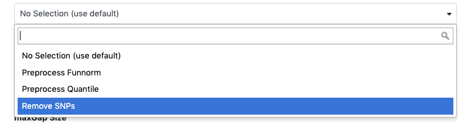

> <agenda-title></agenda-title>
> In this tutorial we will do:
> 1. TOC
> {:toc}
> We will use a small subset of the original data. If we run the tutorial on the orginal dataset, analysis will be time consuming and not reproducible Infinium Human Methylation BeadChip computation on the orginal data can be found at [case study](https://github.com/kpbioteam/case_study).
>
>
{: .agenda}

This tutorial is based on [Hugo W, Shi H, Sun L, Piva M et al.: Non-genomic and Immune Evolution of Melanoma Acquiring MAPKi Resistance.](https://doi.org/10.1016/j.cell.2015.07.061).

The data we use in this tutorial are available at [Zenodo](https://zenodo.org/record/1251211).

---

# Introduction


The field of cancer genomics has demonstrated the power of massively parallel sequencing techniques to inform on genes and specific alterations that drive tumor onset and progression. Although large comprehensive sequence data sets continue to be made increasingly available, data analysis remains an ongoing challenge, particularly for laboratories lacking dedicated resources and bioinformatics expertise. To address this, we have provided training based on Galaxy Infinium Human Methylation BeadChip tool that represents many popular algorithms for detecting somatic genetic alterations from genome and exome data.

")

This exercise uses datasets from the Cell publication by . with the goal being the identification of differentially methylated regions and positions associated with treatment resistant melanomas.
Datasets include the Infinium Human Methylation BeadChip array performed in melanoma tumors in a sample of patients pre and post MAPKi and BRAFi treatment with different outcomes (sensitive and resistant). For each sample there is raw green (methylated) and red (unmethylated) colour arrays containing the summarised bead information generated by the Infinium Human Methylation BeadChip scanner.

The Infinium Human Methylation BeadChip uses two different bead types to detect changes in DNA methylation levels. In the figure we can see M - methylated and U - unmethylated bead types. In our study unmethylated and methylated bead signals are reported as green and red colors respectively.

")


Accession  | Sensitivity | Treatment
--- | ---  | ---
GSM1588704 | baseline    | pre-treatment
GSM1588705 | baseline    | pre-treatment
GSM1588706 | resistant   | BRAFi
GSM1588707 | resistant   | BRAFi

The workflow combines 5 main steps, starting with raw intensity data loading (.idat) and then optional preprocessing and normalisation of the data. The next quality control step performs an additional sample check to remove low-quality data, which normalisation cannot detect. The workflow gives the user the opportunity to perform any of these preparation and data cleaning steps, including a highly recommended genetic variation annotation step resulting in single nucleotide polymorphism identification and removal. Finally, the dataset generated through all of these steps can be used to hunt (find) differentially-methylated positions (DMP) and regions (DMR) with respect to a phenotype covariate.

# Raw intensity data loading

The first step of the Infinium Human Methylation BeadChip array analysis is raw methylation data loading (intensity information files for each two colour micro array)

> <hands-on-title>Data Loading</hands-on-title>
>
> 1. Create a new history for this tutorial and give it a proper name
>
>    
>
> 2. Import the following IDAT files from [Zenodo](https://zenodo.org/record/1251211#.WwREQ1Mvz-Y) or from the data library (ask your instructor)
>    - `GSM1588704_8795207135_R01C02_Red.idat`
>    - `GSM1588705_8795207119_R05C02_Red.idat`
>    - `GSM1588706_8795207135_R02C02_Red.idat`
>    - `GSM1588707_8795207119_R06C02_Red.idat`
>    - `GSM1588704_8795207135_R01C02_Grn.idat`
>    - `GSM1588705_8795207119_R05C02_Grn.idat`
>    - `GSM1588706_8795207135_R02C02_Grn.idat`
>    - `GSM1588707_8795207119_R06C02_Grn.idat`
>
>    > <details-title>List of Zenodo URLs</details-title>
>    > ```
>    > https://zenodo.org/record/1251211/files/GSM1588704_8795207135_R01C02_Red.idat
>    > https://zenodo.org/record/1251211/files/GSM1588706_8795207135_R02C02_Red.idat
>    > https://zenodo.org/record/1251211/files/GSM1588705_8795207119_R05C02_Red.idat
>    > https://zenodo.org/record/1251211/files/GSM1588707_8795207119_R06C02_Red.idat
>    > https://zenodo.org/record/1251211/files/GSM1588704_8795207135_R01C02_Grn.idat
>    > https://zenodo.org/record/1251211/files/GSM1588706_8795207135_R02C02_Grn.idat
>    > https://zenodo.org/record/1251211/files/GSM1588705_8795207119_R05C02_Grn.idat
>    > https://zenodo.org/record/1251211/files/GSM1588707_8795207119_R06C02_Grn.idat
>    > ```
>    {: .details}
>
>    
>
>    
>
> 3. Run **Infinium Human Methylation BeadChip**  with the following parameters:
>    -  *"red channel files"*: all files ending in `_Red`
>    -  *"green channel files"*: all files ending in `Grn`
> 
{: .hands_on}

# .idat preprocessing

Preprocessing and data quality assurance is an important step in Infinium Methylation Assay analysis. Idat dataset represents two colour data with a green and a red channel and can be converted into methylated and unmethylated signals or into Beta values. The Infinium Human Methylation BeadChip tool extracts and plots the quality control data frame with two columns mMed and uMed which are the medians of methylation signals (Meth and Unmeth). Comparing them against one another allows users to detect and remove low-quality samples.


> <hands-on-title>Preprocessing</hands-on-title>
> Ilumina methylation array data can be mapped to the genome with or without additional preprocessing methods. Incomplete annotation of genetic variations such as single nucleotide polymorphism (SNP) may affect DNA measurements and disrupt downstream analysis of results.   It is highly recommended to remove the probes that contain either an SNP at the methylated loci interrogation or at the single nucleotide extension. In this tutorial we will remove probes affected by genetic variation by selecting **(Optional) Preprocessing Method** .
> 
>
{: .hands_on}

> <comment-title>Normalisation of the data</comment-title>
> If your files require normalisation, you might prefer to use one of the other preprocessing tools provided in Infinium Human Methylation BeadChip tool i.e. Preprocess Funnorm or Preprocess Quantile look for recommendation at .
>
{: .comment}

# Differentially methylated regions and positions analysis

The main goal of the **Infinium Human Methylation BeadChip** analysis is to simplify the way differentially methylated loci sites are detected. The **Infinium Human Methylation BeadChip** pipeline contains differentially methylated positions (DMPs) detection with respect to a phenotype covariate, and more complex solutions for finding differentially methylated regions (DMRs). Genomic regions that are differentially methylated between two conditions can be tracked using a bumphunting algorithm. The algorithm first implements a t-statistic at each methylated loci location, with optional smoothing, then groups probes into clusters with a maximum location gap and a cutoff size to refer the lowest possible value of genomic profile hunted by our tool.
> <comment-title>Phenotype table</comment-title>
> Phenotype table can be in different sizes with different arguments, however the second column is required to contain phenotype covariate information for each sample.
{: .comment}

However, for the purpose of this tutorial we would like you to upload phenotype table from [Zenodo](https://zenodo.org/record/1251211#.WwREQ1Mvz-Y) repository.

> <hands-on-title>Import `phenotypeTable.txt` from [Zenodo](https://zenodo.org/record/1251211#.WwREQ1Mvz-Y) or data library:</hands-on-title>
>    ```
>    https://zenodo.org/record/1251211/files/phenotypeTable.txt
>    ```
> 
> Set the following parameters:
>    - *"maxGap Size"*:`250`
>    We will use the default gap of 250 base pairs (bps), i.e. any two points more than 250 bps away are put in a new cluster.
>    - *"Cutoff Size"*:`0.1`
>    In order to find segments that are positive, near zero, and negative. We need a cutoff which is one number in which case “near zero” default 0.1
>
> 
>    - *"Number of Resamples"*:`0`
> Default value 0 for permutation method apply selection of randomized cases with replacement from the original data while using 'bootstrap' method.
>    - *"nullMethod"*:`permutation`
> Method used to generate null candidate regions, must be one of ‘bootstrap’ or
> ‘permutation’ (defaults to ‘permutation’).
>    - *"Phenotype Type"*:`categorical`
> Identify regions where methylation is associated with a continuous or categorical phenotype.
>
> Search for `UCSC Main` in the tool search bar (top left)
> 
>    - *"qCutoff Size"*:`0.5`
> Diffrentialy methylated positions with an FDR q-value greater than this value will not be returned.
>    - *"Variance Shrinkage"*:` TRUE`
> Default TRUE as it is recommended when sample sizes are small <10
>    - *"Genome Table"*: `wgEncodeHaibMethyl450 ... `
> Click on `UCSC Main` . You will be taken to the **UCSC table browser**
> 
> Set the following options:
>     - *"clade"*: `Mammal`
>     - *"genome"*: `Human`
>     - *"assembly"*: `Feb. 2009 (GRCh37/hg19)`
>     - *"group"*: `Regulation`
>     - *"track"*: `HAIB Methyl450`
>     - *"table"*: `GM12878 (wgEncodeHaibMethyl450Gm12878SitesRep1)`
>     - *"region"*: `genome`
>     - *"output format"*: `GTF - gene transfer (limited)`
>     - *"Send output to"*: `Galaxy` (only)
> Click on the **get output** button at the bottom of the screen
> On the next page, click on the **Send Query to Galaxy** button
> Wait for the upload to finish
> We will now map the imported datasets against phenotype covariate and reference genome obtained from UCSC.
> Click on the **Differentially_Methylated_Positions.bed** output in your history to expand it.
> Set the database build of your dataset to `Human Feb. 2009 (GRCh37/hg19) (hg19)`(if it is not set automatically)
>
> 
>
> Click on `display at UCSC` towards the bottom of the history item.
> This will launch UCSC Genome Browser with your Custom Track
{: .hands_on}


> <question-title></question-title>
> How do we define phenotype covariate?
> > <solution-title></solution-title>
> > Phenotype covariate is the set of observable characteristics of an individual resulting from the gene-environment interactions
> {: .solution}
{: .question}

# Annotation and visualization

In addition to downstream analysis users can annotate the differentially methylated loci at the promoter regions of genes with gene function descriptions, and relationships between these concepts.

> <hands-on-title> Annotate Differentially Methylated Position</hands-on-title>
> 1. Run **chipeakanno annopeaks** on the output of minfi_dmp with the following parameters
>   -  *"Differentialy methylated data"*: output of **minfi dmp** 
>   - *"bindingType"*: `StartSite`
>   - *"bindingRegionStart"*:`-5000`
>   - *"bindingRegionEnd"*:`3000`
>   - *"Additional Column of Score"*:`8`
>
>        Position of column of score optional value if it is required
>
> 2. **Cut**  on the previous output adjusting the following parameters to cut "gene_name" column from table of annotated peaks and then get a list of genes
>   - *"Cut columns"*: `c16`hhh
>   - *"Delimited by"*: `Tab`
>   -  *"From"*: output of **chipeakanno annopeaks** 
>
> 3. **Remove beginning**  of `Gene List` with the following parameters
>   - *"Remove first"*: `1`
>   -  *"from"*: output of **Cut** 
>
> 4. Run  **clusterProfiler bitr**  on the previous output adjusting the following parameters to convert the list of genes to list of entrez ID
>   - *"Input Type Gene ID"*: `SYMBOL`
>   - *"Output Type Gene ID"*: `ENTREZID`
>
> 5. Use the output of the  clusterProfiler bitr  to run a GO Enrichment Analysis using **clusterProfiler go**
{: .hands_on}


ID  | Description | pvalue | qvalue | geneID | Count
--- | ---  | --- | --- | --- | ---
GO:0048732 | gland development  | 1.38E-58 | 4.23E-55 | PTGS2 / KCNC1 / FZD1 /SLC22A18 /SLC22A3 (...) | 372
GO:1901652 | response to peptide | 3.99E-57 | 8.13E-54 | SULF1/ LAMA5/ MED1 /CFLAR/ MSX2 (...) | 359
GO:0048545 | response to steroid hormone | 1.38EE-54 | 2.11E-51 | HDAC9/ RAB10/ CFLAR/ WDTC1 (...) | 394

# Conclusion


Epigenetic aberrations which involve DNA modifications give researchers an interest in identifying novel non-genetic factors responsible for complex human phenotypes such as height, weight, and disease. To identify methylation changes researchers need to perform complicated and time consuming computational analysis. Here, the EWAS suite becomes a solution for this inconvenience and provides a simplified downstream analysis available as a ready to run pipline in supplementary materials.
