# Introduction


Within a cell nucleus, the DNA is tightly-packed and the chromatin is spatially distributed with different levels and scales of organizations.

At the smallest scale, DNA is packaged into units called nucleosomes, made of eight histone proteins.

On a larger scale than nucleosomes, DNA is forming loops. DNA elements that would be otherwise separated by large distances can interact. The corresponding self-interacting (or self-associating) domains are found in many organisms: they are called Topologically Associating Domains (TADs) in mammalian cells. Mammalian chromosomes are also partitioned into two spatial compartments, labeled "A" and "B", where regions in compartment A tend to interact preferentially with A compartment-associated regions than B compartment-associated ones. Similarly, regions in compartment B tend to associate with other B compartment-associated regions.

> <comment-title>Tip: Learn more about chromosome conformation</comment-title>
> To learn more about chromosome conformation and TADs, you can follow our [HiC tutorial]({{site.baseurl}}/topics/epigenetics/tutorials/hicexplorer/tutorial.html)
{: .comment}

In mammals, the X chromosome inactivation (XCI) balances the dosage of X-linked genes between females and males. The genes on the inactive X (Xi) chromosome are not expressed.

Binding certain proteins to each of the eight histone proteins may modify the chromatin structure and may result in changes in transcription level. For example, the H3K4me3 is adding 3 methyl-group of the 4th Lysine in the histone 3 amino-acid. This modification is known to activate the transcription on nearby genes by opening the chromatin. The H3K27me3 on the other hand is inactivating the transcription of the nearby genes:

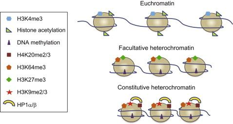

More H3K27me3 and less H3K4me3 on the Xi could explain a lower expression of the genes there.

It has been also observed that the Xi reconfigures uniquely into a specific chromosomal conformation. cohesins, condensins and CCCTC-binding factor (CTCF) play key roles in chromosomal architectures and TAD formation which are other potential cause of the repression of the expression of the genes on Xi.

The structural-maintenance-of-chromosomes hinge domain containing 1 (SMCHD1) has been found enriched on the Xi. It may be the potential actor in the shape of Xi and the change in gene expression there.

 investigates the mechanism by which the SMCHD1 gene shapes the Xi and represses the expression of the genes on Xi in mouse.

Their idea was to identify the differences which could be observed between the Xi and activated X chromosome, on both wild-type and SMCHD1 gene knockdown samples to study the SMCHD1 effect.
In different experiments, they targeted histones with H3K27me3 or H3K4me3 and CTCF using ChIP-seq experiments.

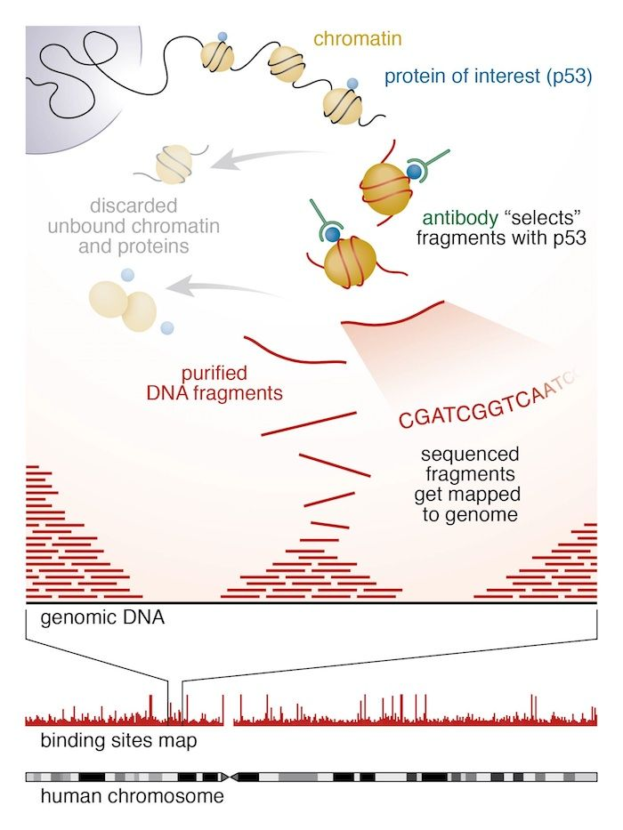

They obtained sequences corresponding to a portion of DNA linked to histones with H3K27me3, H3K4me3 or CTCF. Using this information, they could identify if there are differences in the H3K27me3, H3K4me3 and CTCF between the X (active or inactive) chromosomes and the potentially influenced genes.

In the upcoming tutorial, we will only use the wild type data from  and analyze the ChIP-seq data step by step:

- CTCF with 2 replicates: `wt_CTCF_rep1` and `wt_CTCF_rep2`
- H3K4me3 with 2 replicates: `wt_H3K4me3_rep1` and `wt_H3K4me3_rep2`
- H3K27me3 with 2 replicates: `wt_H3K27me3_rep1` and `wt_H3K27me3_rep2`
- 'input' with 2 replicates: `wt_input_rep1` and `wt_input_rep2`

    In 'input' samples, the same treatment as the ChIP-seq samples was done except for the immunoprecipitation step.
    They are also used along with the 'ChIP-seq' samples to identify the potential sequencing bias and help for differential analysis.


> <agenda-title></agenda-title>
>
> 1. TOC
> {:toc}
>
{: .agenda}

# Step 1: Quality control and treatment of the sequences

The first step of any ChIP-Seq data analysis is quality control of the raw sequencing data.

To save time, we will do it only on the data of one sample `wt_H3K4me3_rep1` which has been already down-sampled. keep in mind that with real data this should be done on each and every sample.

> <hands-on-title>Import the data</hands-on-title>
>
> 1. Create a new history for this tutorial and give it a proper name
>
>    
>    
>
> 2. Import `wt_H3K4me3_read1.fastq.gz` and `wt_H3K4me3_read2.fastq.gz` from [Zenodo](https://zenodo.org/record/1324070) or from the data library (ask your instructor)
>
>    ```
>    https://zenodo.org/record/1324070/files/wt_H3K4me3_read1.fastq.gz
>    https://zenodo.org/record/1324070/files/wt_H3K4me3_read2.fastq.gz
>    ```
>
>    
>    
>
>    As default, Galaxy takes the link as name, so rename them.
>
> 4. Rename the files `wt_H3K4me3_read1` and `wt_H3K4me3_read2`
>
>    
>
> 3. Inspect the first file by clicking on the  (eye) icon (**View data**)
>
{: .hands_on}



During sequencing, errors are introduced, such as incorrect nucleotides being called. These are due to the technical limitations of each sequencing platform. Sequencing errors might bias the analysis and can lead to a misinterpretation of the data.

Sequence quality control is therefore an essential first step in your analysis. We use here similar tools as described in ["Quality control" tutorial]({{site.baseurl}}/topics/sequence-analysis): [FastQC](https://www.bioinformatics.babraham.ac.uk/projects/fastqc/) and [Trim Galore](https://www.bioinformatics.babraham.ac.uk/projects/trim_galore/).

> <hands-on-title>Quality control</hands-on-title>
>
> 1. Run **FastQC**  with the following parameters
>    -  *"Short read data from your current history"*: `wt_H3K4me3_read1` and `wt_H3K4me3_read2` (Input datasets selected with **Multiple datasets**)
>
>    
>
> 2. Inspect the generated HTML files
>
>    > <question-title></question-title>
>    >
>    > 1. How is the quality of the reads in `wt_H3K4me3_read1`?
>    > 2. And in `wt_H3K4me3_read2`?
>    > 3. What should we do if the quality of the reads is not good?
>    >
>    > > <solution-title></solution-title>
>    > > 1. The reads in `wt_H3K4me3_read1` are of good quality:
>    > >     - There is 50,000 sequences, all of 51 bp
>    > >     - The "Per base sequence quality" is not decreasing too much at the end of the sequences
>    > >
>    > >        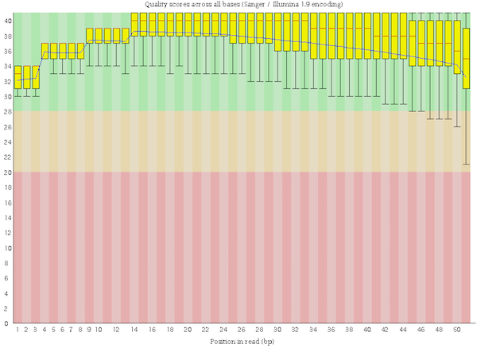
>    > >
>    > >     - The mean quality score over the reads is quite high
>    > >
>    > >        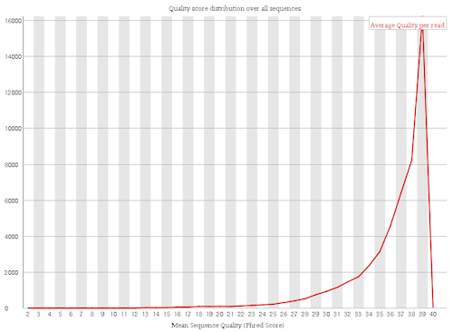
>    > >
>    > >     - Homogeneous percentage of the bases
>    > >
>    > >        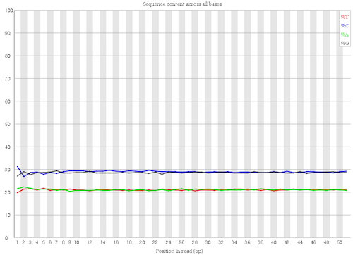
>    > >
>    > >     - No N in the reads
>    > >
>    > >        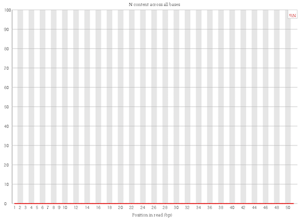
>    > >
>    > >     - No duplicated sequences
>    > >
>    > >        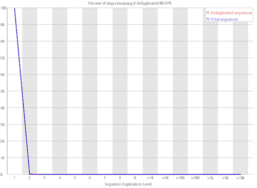
>    > >
>    > >     - No more known adapters
>    > >
>    > >        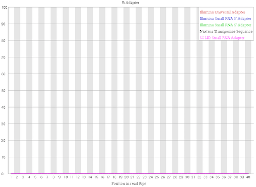
>    > >
>    > > 2. The reads in `wt_H3K4me3_read2` are a bit worse:
>    > >
>    > >     - The "Per base sequence quality" is decreasing more at the end of the sequences, but it stays correct
>    > >
>    > >        
>    > >
>    > >     - The sequence `NNNNNNNNNNNNNNNNNNNNNNNNNNNNNNNNNNNNNNNNNNNNNNNNNNN` is over represented
>    > >
>    > >     Despite these small things, the overall quality of the reads is really good.
>    > >
>    > > 3. If the quality of the reads is not good, we should:
>    > >    1. Check what is wrong and think about it: it may come from the type of sequencing or what we sequenced (high quantity of overrepresented sequences in transcriptomics data, biaised percentage of bases in HiC data)
>    > >    2. Ask the sequencing facility about it
>    > >    3. Perform some quality treatment (in a reasonable way to not loose too much information) with some trimming or removal of bad reads
>    > >
>    > {: .solution }
>    {: .question}
>
{: .hands_on}

It is often necessary to trim sequenced read, for example, to get rid of bases that were sequenced with high uncertainty (= low quality bases) at the read ends.



> <hands-on-title>Trimming low quality bases</hands-on-title>
>
> 1. Run **Trim Galore!**  with the following parameters
>    - *"Is this library paired- or single-end?"*: `Paired-end`
>       -  *"Reads in FASTQ format"*: `wt_H3K4me3_read1` (Input dataset)
>       -  *"Reads in FASTQ format"*: `wt_H3K4me3_read2` (Input dataset)
>
>       The order is important here!
>
>       > <tip-title>Not selectable files?</tip-title>
>       >
>       > If your FASTQ files cannot be selected, you might check whether their format is FASTQ with Sanger-scaled quality values (`fastqsanger`). You can edit the data type by clicking on the `pencil` symbol.
>       {: .tip}
>
>    - *"Trim Galore! advanced settings"*: `Full parameter list`
>       - *"Trim low-quality ends from reads in addition to adapter removal"*: `15`
>       - *"Overlap with adapter sequence required to trim a sequence"*: `3`
>       - *"Generate a report file"*: `Yes`
>
> 2. Inspect the generated txt file (`report file`)
>
>    > <question-title></question-title>
>    >
>    > 1. How many basepairs has been removed from the forwards reads because of bad quality?
>    > 2. And from the reverse reads?
>    > 3. How many sequence pairs have been removed because at least one read was shorter than the length cutoff?
>    >
>    > > <solution-title></solution-title>
>    > > 1. 32,198 bp (1.3%) (first `Quality-trimmed:`)
>    > > 2. 116,414 bp (4.6%) (second `Quality-trimmed:`). It is not a surprise: we saw that the quality was dropping more at the end of the sequences for the reverse reads thant for the forward reads.
>    > > 3. 1569 (3.14%) sequences (last line of the file)
>    > {: .solution }
>    {: .question}
{: .hands_on}

# Step 2: Mapping of the reads

With ChiP sequencing, we obtain sequences corresponding to a portion of DNA linked to the histone mark of interest, H3K4me3 in this case. As H3K4me3 opens the chromatime, nearby genes are gioing to be more transcribed. It would be interesting to know if there is a difference in the quantity of DNA impacted by H3K4me3 and the impacted genes between active and inactive X chromosome.



## Running Bowtie2

> <hands-on-title>Mapping</hands-on-title>
>
> 1. **Bowtie2**  with
>    - *"Is this single or paired library"*: `Paired-end`
>        -  *"FASTA/Q file #1"*: `trimmed reads pair 1` (output of **Trim Galore!** )
>        -  *"FASTA/Q file #2"*: `trimmed reads pair 2` (output of **Trim Galore!** )
>    - *"Will you select a reference genome from your history or use a built-in index?"*: `Use a built-in genome index`
>        - *"Select reference genome"*: `Mouse (Mus musculus): mm10`
>    - *"Save the bowtie2 mapping statistics to the history"*: `Yes`
>
> 2. Inspect the mapping stats
>
>    > <question-title></question-title>
>    >
>    > How many reads where mapped? Uniquely or several times?
>    >
>    > > <solution-title></solution-title>
>    > > The overall alignment rate is 98.64%. This score is quite high. If you have less than 70-80%, you should investigate the cause: contamination, etc.
>    > >
>    > > 43719 (90.27%) reads have been aligned concordantly exactly 1 time and 3340 (6.90%) aligned concordantly >1 times. The latter ones correspond to multiple mapped reads. Allowing for multiple  mapped reads increases the number of usable reads and the sensitivity of peak detection;
>    > > however, the number of false positives may also increase.
>    > {: .solution }
>    {: .question}
>
{: .hands_on}

The output of Bowtie2 is a BAM file.

## Inspection of a BAM file



## Visualization using a Genome Browser



# Step 3: ChIP-seq Quality Control

We already checked the quality of the raw sequencing reads in the first step.
Now we would like to test the quality of the ChIP-seq preparation, to know if our ChIP-seq samples are more enriched than the control (input) samples.

## Correlation between samples

To assess the similarity between the replicates of the ChIP and the input, respectively, it is a common technique to calculate the correlation of read counts on different regions for all different samples.
We expect that the replicates of the ChIP-seq experiments should be clustered more closely to each other than the replicates of the input sample. That is, because the input samples should not have enriched regions included - remember the immuno-precipitation step was skiped during the sample preparation.

To compute the correlation between the samples we are going to to use the QC modules of [deepTools](http://deeptools.readthedocs.io/), a software package for the QC, processing and analysis of NGS data. Before computing the correlation a time consuming step is required, which is to compute the read coverage (number of unique reads mapped at a given nucleotide) over a large number of regions from each of the inputed BAM files. For this we will use the tool **multiBamSummary** . Then, we use **plotCorrelation**  from deepTools to compute and visualize the sample correlation. This is a fast process that allows to quickly try different color combinations and outputs.

Since in this tutorial we are interested in assessing H3K4me3, H3K27me3 and CTCF ChIP samples, the previous steps (quality control and mapping) needs to be run on all the replicates of ChIP samples as well as the input samples. To save time, we have already done that and you can now work directly on the BAM files of the provided 8 samples. For simplicity, the files include only the ChrX.

> <hands-on-title>Correlation between samples</hands-on-title>
>
> 1. Create a new history
> 2. Import the 8 BAM files from [Zenodo](https://zenodo.org/record/1324070) or from the data library into the history
>
>    ```
>    https://zenodo.org/record/1324070/files/wt_CTCF_rep1.bam
>    https://zenodo.org/record/1324070/files/wt_CTCF_rep2.bam
>    https://zenodo.org/record/1324070/files/wt_H3K4me3_rep1.bam
>    https://zenodo.org/record/1324070/files/wt_H3K4me3_rep2.bam
>    https://zenodo.org/record/1324070/files/wt_H3K27me3_rep1.bam
>    https://zenodo.org/record/1324070/files/wt_H3K27me3_rep2.bam
>    https://zenodo.org/record/1324070/files/wt_input_rep1.bam
>    https://zenodo.org/record/1324070/files/wt_input_rep2.bam
>    ```
>
> 3. Rename the files
> 3. **multiBamSummary**  with the following parameters
>    - *"Sample order matters"*: `No`
>       -  *"BAM/CRAM file"*: the 8 imported BAM files
>    - *"Choose computation mode"*: `Bins`
>       - *"Bin size in bp"*: `1000`
>
>           This corresponds to the length of the fragments that were sequenced; it is not the read length!
>
>       - *"Distance between bins"*: `500`
>
>           It reduces the computation time for the tutorial
>
>    - *"Region of the genome to limit the operation to"*: `chrX`
>
>    Using these parameters, the tool will take bins of 1000 bp separated by 500 bp on the chromosome X. For each bin the overlapping reads in each sample will be computed and stored into a matrix.
>
> 4. **plotCorrelation**  with the following parameters
>    -  *"Matrix file from the multiBamSummary tool"*: `correlation matrix`(output of **multiBamSummary** )
>    - *"Correlation method"*: `Pearson`
>
>    Feel free to try different parameters for the configuration of the plot (colors, title, etc)
>
{: .hands_on}

> <question-title></question-title>
>
> 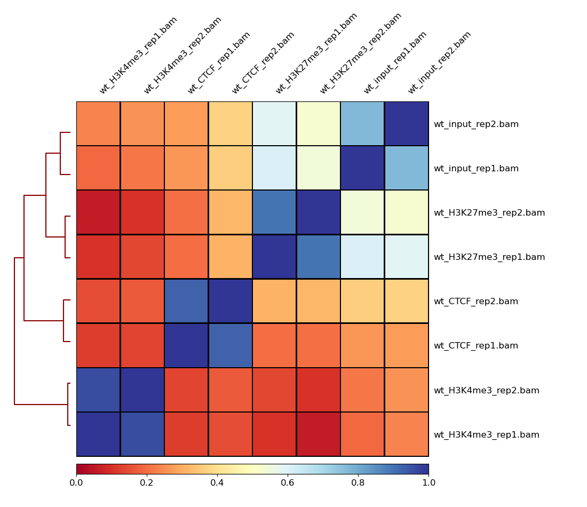
>
> How are your samples clustered? Does that correspond to your expectations?
>
> > <solution-title></solution-title>
> > As one could expect, the input replicates cluster together and the ChIP replicates cluster together. It confirms that the immuno-precipitation step worked on our ChIP replicates.
> >
> > Moreover, for each sample, there is a high correlation between the two replicates which confirms the validity of the experiments.
> >
> {: .solution }
{: .question}

## IP strength estimation

To evaluate the quality of the immuno-precipitation(IP) step, we can compute the IP strength. It determines how well the signal in the ChIP-seq sample can be differentiated from the background distribution of reads in the control sample ('input'). After all, around 90% of all DNA fragments in a ChIP experiment will represent the genomic background.

To do that we take the data from the `rep1` of the `wt_H3K4me3` ChIP-seq sample and compare it with its corresponding input sample, using **plotFingerprint**  of deepTools.

Similar to **multiBamSummary** , **plotFingerprint**  randomly samples genome regions of a specified length (bins) and sums the per-base coverage in the indexed BAM files that overlap with those regions. These coverage values are then sorted according to their rank and the cumulative sum of read counts is plotted.

> <hands-on-title>IP strength estimation</hands-on-title>
>
> 1. **plotFingerprint**  with the following parameters
>    - *"Sample order matters"*: `No`
>       -  *"BAM/CRAM file"*: `wt_input_rep1` and `wt_H3K4me3_rep1`
>    - *"Region of the genome to limit the operation to"*: `chrX`
>    - *"Show advanced options"*: `Yes`
>       - *"Number of samples"*: `10000`
{: .hands_on}

The plotFingerprint tool generates a fingerprint plot. You need to intepret it to know the IP strength.

An ideal 'input' with perfect uniform distribution of reads along the genome (i.e. without enrichments in open chromatin) and infinite sequencing coverage should generate a straight diagonal line. A very specific and strong ChIP enrichment will be indicated by a prominent and steep rise of the cumulative sum towards the highest rank. This means that a big chunk of reads from the ChIP sample is located in few bins which corresponds to high, narrow enrichments typically seen for transcription factors.

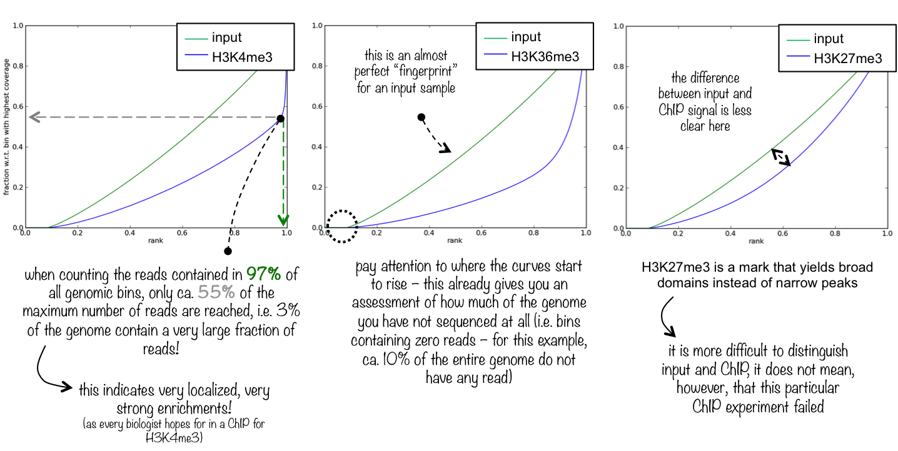

> <question-title></question-title>
>
> 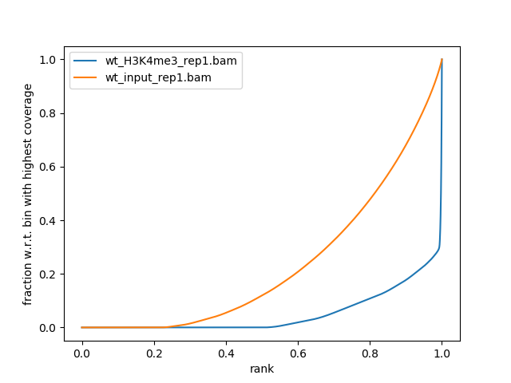
>
> What do you think about the quality of the IP for this experiment?
>
> > <solution-title></solution-title>
> > There is clear distinction between H3K4me3 and the input.
> >
> > A small percentage of the genome contain a very large fraction of the reads (>70%, point of change in the blue curve)
> >
> > The curves start to rise around 0.25. It means that almost 25% of the chromosome X is not sequenced at all.
> {: .solution }
{: .question}

> <hands-on-title>(Optional) IP strength estimation (other samples)</hands-on-title>
>
> Run the same analysis on the other ChIP-seq data along with their corresponding input and compare the output
{: .hands_on}

# Step 4: Normalization

One of the goals in ChIP-seq data analysis is finding regions on the genome which are enriched for the ChIP data of interest (regions with significantly higher read coverage for the ChIP data comparing to its corresponding input). In the following exercise we would like to know where the H3K4me3 sites are. For this we need to extract which parts of the genome have been enriched (i.e. more reads mapped) within the samples that underwent immunoprecipitation. However, to reach a reliable comparison the data needs to be normalized to remove any technical bias. For the normalization we have two steps:

1. Normalization by sequencing depth
2. Normalization by input file

To learn how to do the normalization, we will take the `wt_H3K4me3_rep1` sample as ChIP data and `wt_input_rep1` as input.

## Generation of coverage files normalized by sequencing depth

> <hands-on-title>Estimation of the sequencing depth</hands-on-title>
>
> 1. **IdxStats**  with the following parameters
>    -  *"BAM file"*: `wt_H3K4me3_rep1.bam` and `wt_input_rep1.bam`
>
> > <question-title></question-title>
> >
> > 1. What is the output of **IdxStats** ?
> > 2. How many reads has been mapped on chrX for the input and for the ChIP-seq samples?
> > 3. Why are the number of reads different? And what could be the impact of this difference?
> >
> > > <solution-title></solution-title>
> > > 1. This tool generates a table with 4 columns:  reference sequence identifier, reference sequence length, number of mapped reads and number of placed but unmapped reads. Here it estimates how many reads mapped to which chromosome. Furthermore, it tells the chromosome lengths and naming convention (with or without 'chr' in the beginning)
> > 2. 1,204,821 for ChIP-seq samples and 1,893,595 for the input
> > 3. The number of reads can be different because of  different sequencing depth. It can bias the interpretation of the number of reads mapped to a specific genome region and the identification of the H3K4me3 sites. Specially here, as the number of reads for the input is higher than the ChIP data less regions could be identified having a significantly higher read coverage for the ChIP data comparing to the corresponding input.
> > {: .solution }
> {: .question}
{: .hands_on}

The different samples have usually a different sequencing depth, i.e. a different number of reads. These differences can bias the interpretation of the number of reads mapped to a specific genome region. We first need to make the samples comparable by normalizing the coverage by the sequencing depth.

We are using **bamCoverage** . Given a BAM file, this tool generates coverages by first calculating all the number of reads (either extended to match the fragment length or not) that overlap each bin in the genome and then normalizing with various options. It produces a coverage file where for each bin the number of overlapping reads (possibly normalized) is noted.

> <hands-on-title>Coverage file normalization</hands-on-title>
>
> 1. **bamCoverage**  with the following parameters
>    -  *"BAM file"*: `wt_H3K4me3_rep1.bam` and `wt_input_rep1.bam`
>    - *"Bin size in bases"*: `25`
>    - *"Scaling/Normalization method"*: `Normalize coverage to 1x`
>       - *"Effective genome size"*: `GRCm38/mm10 (2308125349)`
>    - *"Coverage file format"*: `bedgraph`
>    - *"Region of the genome to limit the operation to"*: `chrX`
>
>    > <question-title></question-title>
>    >
>    > 1. What is a `bedgraph` file?
>    > 2. Which regions have the highest coverage in ChIP data and in the input?
>    >
>    > > <solution-title></solution-title>
>    > > 1. It is a tabular file with 4 columns: chrom, chromStart, chromEnd and a data value (coverage)
>    > > 2. We can run **Sort**  on the 4th column in descending order to get the regions with the highest (normalized) coverage. For `wt_H3K4me3_rep1`, the regions between 152,233,600	and 152,233,625	 are the most covered. For `wt_input_rep1`, between 143,483,000 and 143,483,100.
>    > {: .solution }
>    {: .question}
>
> 2. **bamCoverage**  with the same parameters but
>    - *"Coverage file format"*: `bigWig`
>
>    > <question-title></question-title>
>    >
>    > What is a `bigWig` file?
>    >
>    > > <solution-title></solution-title>
>    > > A `bigWig` file is a compressed `bedgraph` file. Similar in relation as BAM to SAM, but this time just for coverage data. This means bigWig and bedgraph files are much smaller than BAM or SAM files (no sequence or quality information).
>    > {: .solution }
>    {: .question}
>
> 3. **IGV**  to inspect both signal coverages (input and ChIP samples) in IGV
>
{: .hands_on}

> <question-title></question-title>
>
> If you zoom to `chrX:151,385,260-152,426,526`, what do you observe?
>
> 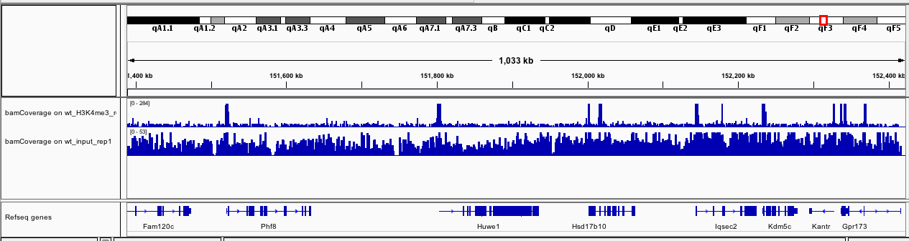
>
> > <solution-title></solution-title>
> > The track with the coverage for the input (`wt_input_rep1`) seems quite homogeneous. On the other hand, for `wt_H3K4me3_rep1`, we can observe some clear peaks at the beginning of the genes.
> {: .solution }
{: .question}

## Generation of input-normalized coverage files

To extract only the information induced by the immunoprecipitation, we normalize the coverage file for the sample that underwent immunoprecipitation by the coverage file for the input sample. Here we use the tool **bamCompare**  which compare 2 BAM files while caring for sequencing depth normalization.

> <hands-on-title>Generation of input-normalized coverage files</hands-on-title>
>
> 1. **bamCompare**  with the following parameters
>    -  *"First BAM file (e.g. treated sample)"*: `wt_H3K4me3_rep1.bam`
>    -  *"Second BAM file (e.g. control sample)"*: `wt_input_rep1.bam`
>    - *"Bin size in bases"*: `50`
>    - *"How to compare the two files"*: `Compute log2 of the number of reads ratio`
>    - *"Coverage file format"*: `bedgraph`
>    - *"Region of the genome to limit the operation to"*: `chrX`
>
>    > <question-title></question-title>
>    >
>    > 1. What does a positive value or a negative value mean in the 4th column?
>    > 2. Which regions have the highest coverage in the ChIP data? and the lowest?
>    >
>    > > <solution-title></solution-title>
>    > > 1. The 4th column contains the log2 of the number of reads ratio between the ChIP-seq sample and the input sample. A positive value means that the coverage on this portion of genome is higher in the ChIP-seq sample than in the input sample
>    > > 2. The highest: 152,233,800-152,233,850 (consistent with the most covered regions in `wt_H3K4me3_rep1` given by **bamCoverage** ). The lowest: 169,916,600-169,916,650
>    > {: .solution }
>    {: .question}
>
> 2. **bamCompare**  with the same parameters but:
>    - *"Coverage file format"*: `bigWig`
>
> 3. **IGV**  to inspect the log2 ratio
>
{: .hands_on}

> <question-title></question-title>
>
> How could you interpret the new track if you zoom to `chrX:151,385,260-152,426,526`?
>
> 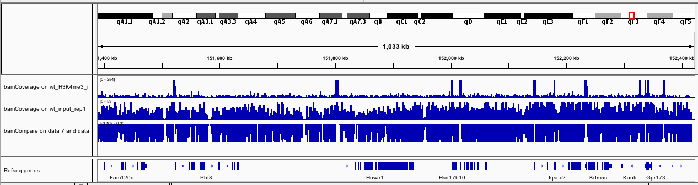
>
> > <solution-title></solution-title>
> > The new track is the difference between the first track (`wt_H3K4me3_rep1`) and the second track (`wt_input_rep1`)
> {: .solution }
{: .question}

# Step 5: Detecting enriched regions (peak calling)

We could see in the ChIP data some enriched regions (peaks). We now would like to call these regions to obtain their coordinates, using **MACS2 callpeak** 

> <hands-on-title>Peak calling</hands-on-title>
>
> 1. **MACS2 callpeak**  with the following parameters
>    - *"Are you pooling Treatment Files?"*: `No`
>       -  *"ChIP-Seq Treatment File"*: `wt_H3K4me3_rep1.bam`
>    - *"Do you have a Control File?"*: `Yes`
>       - *"Are you pooling Treatment Files?"*: `No`
>           -  *"ChIP-Seq Treatment File"*: `wt_input_rep1.bam`
>    - *"Format of Input Files"*: `Paired-end BAM`
>    - *"Effective genome size"*: `M.musculus (1.87e9)`
>    - *"Outputs"*: `Summary page (html)`
>
>    > <comment-title></comment-title>
>    > The advanced options may be adjusted, depending of the samples.
>    > If your ChIP-seq experiment targets regions of broad enrichment, *e.g.* non-punctuate histone modifications, select calling of broad regions.
>    > If your sample has a low duplication rate (*e.g.* below 10%), you might keep all duplicate reads (tags). Otherwise, you might use the 'auto' option to estimate the maximal allowed number of duplicated reads per genomic location.
>    {: .comment}
>
> 2. Inspect the  `(narrow Peaks)` file (output of **MACS2 callpeak** )
>
>    > <question-title></question-title>
>    >
>    > Which type of files were generated? What do they include?
>    >
>    > > <solution-title></solution-title>
>    > > **MACS2 callpeak**  has generated a bed file with the coordinates of the identified peaks: chromosome, start, stop, name, integer score, strand, fold-change, -log10pvalue, -log10qvalue and relative summit position to peak start, as well as a html report which contains links to additional bed and xls files.
>    > {: .solution }
>    {: .question}
>
> 3. **IGV**  to inspect with the signal coverage and log2 ratio tracks
>
{: .hands_on}

> <question-title></question-title>
>
> 1. How many peaks have been identified in `chrX:151,385,260-152,426,526` based on IGV?
>
>    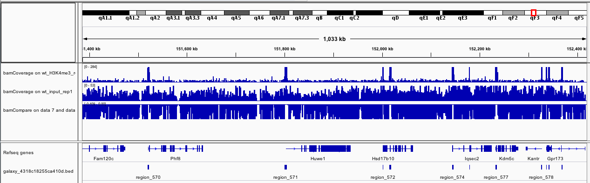
>
> 2. What are the fold change of the peaks identified in `chrX:151,385,260-152,426,526`? Hint: using the BED file
> 3. How many peaks have been identified on the full chromosome X? How many peaks have a fold change > 50?
>
> > <solution-title></solution-title>
> > 1. We can see 11 peaks (track below the genes).
> > 2. Using **Filter**  with `c2>151385260 and c3<152426526`, we found that the 11 peaks with fold changes between 3.81927 and 162.06572
> > 4. On the 656 peaks on the full chromosome (number of lines of the original BED file) there are 252 peaks with FC>50 (using **Filter**  with `c7>50`)
> {: .solution }
{: .question}

The called peak regions can be filtered by, *e.g.* fold change, FDR and region length for further downstream analysis.

# Step 6: Plot the signal between samples

So far, we have normalized the data and identified peaks. Now, we would like to visualize scores associated with certain genomic regions, for example ChIP enrichment values around the TSS of genes. Moreover, we would like to compare the enrichment of several ChIP samples (e.g. CTCF and H3K4me3 )on the regions of interest.

Since we already generated the required files for the H3K4me3 sample, let's make them only for the CTCF sample:

> <hands-on-title>Prepare the peaks and data for CTCF</hands-on-title>
>
> 1. **bamCompare**  with the following parameters
>    -  *"First BAM file (e.g. treated sample)"*: `wt_CTCF_rep1.bam`
>    -  *"Second BAM file (e.g. control sample)"*: `wt_input_rep1.bam`
>    - *"Bin size in bases"*: `50`
>    - *"How to compare the two files"*: `Compute log2 of the number of reads ratio`
>    - *"Coverage file format"*: `bigwig`
>    - *"Region of the genome to limit the operation to"*: `chrX`
> 2. Rename the output of **bamCompare**  with the name of the sample
> 3. **MACS2 callpeak**  with the following parameters
>    - *"Are you pooling Treatment Files?"*: `No`
>       -  *"ChIP-Seq Treatment File"*: `wt_CTCF_rep1.bam`
>    - *"Do you have a Control File?"*: `Yes`
>       - *"Are you pooling Treatment Files?"*: `No`
>           -  *"ChIP-Seq Treatment File"*: `wt_input_rep1.bam`
>    - *"Format of Input Files"*: `Paired-end BAM`
>    - *"Effective genome size"*: `M.musculus (1.87e9)`
>
{: .hands_on}

We can now concatenate the MACS2 outputs with the location of the peaks (concatenate the files and merge the overlapping regions) to obtain one BED file corresponding to the coordinates of the interesting regions to plot.

> <hands-on-title>Prepare the peak coordinates</hands-on-title>
>
> 1. **Concatenate two datasets into one dataset**  with the following parameters
>    -  *"Concatenate"*: output of **MACS2 callpeak**  for `wt_CTCF_rep1`
>    -  *"with"*: output of **MACS2 callpeak**  for `wt_H3K4me3_rep1`
> 2. **SortBED**  with the following parameters
>    -  *"Sort the following bed,bedgraph,gff,vcf file"*: output of **Concatenate** 
> 3. **MergeBED**  with the following parameters
>    -  *"Sort the following bed,bedgraph,gff,vcf file"*: output of **SortBED** 
>
{: .hands_on}

To plot the the peaks score on the region generated above (MergeBED output) two tools from the [deepTools](http://deeptools.readthedocs.io/) package are used:
- **computeMatrix** : it computes the signal on given regions, using the `bigwig` coverage files from different samples.
- **plotHeatmap** : it plots heatMap of the signals using the **computeMatrix**  output.

Optionally, we can also use **plotProfile**  to create a profile plot from **computeMatrix**  output.

> <hands-on-title>Plot the heatmap</hands-on-title>
>
> 1. **computeMatrix**  with the following parameters:
>    - *"Select regions"*:
>       -  *"Regions to plot"*: output of **MergeBED** 
>    - *"Sample order matters"*: `No`
>       -  *"Score file"*: the 2 `bigwig` files generated by **bamCompare**  and renamed
>    - *"computeMatrix has two main output options"*: `reference-point`
>       - *"The reference point for the plotting"*: `center of region`
>       - *"Distance upstream of the start site of the regions defined in the region file"*: `3000`
>       - *"Distance downstream of the end site of the given regions"*: `3000`
> 2. **plotHeatmap**  with the following parameters
>    -  *"Matrix file from the computeMatrix tool"*: `Matrix` (output of **computeMatrix** )
>    - *"Show advanced options"*: `yes`
>       - *"Reference point label"*: select the right label
>       - *"Did you compute the matrix with more than one groups of regions?"*: `No, I used only one group`
>           - *"Clustering algorithm"*: `Kmeans clustering`
>           - *"Number of clusters to compute"*: `2`
{: .hands_on}

It should generate an heatmap similar to:

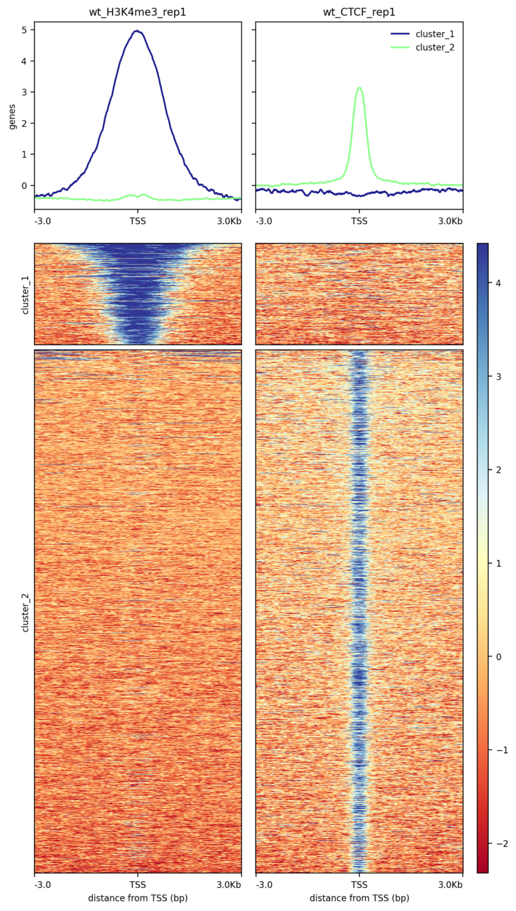

When we look at this graph, it seems that less but larger peaks are found for `H3K4me3_rep1` and that only few peaks are shared.

> <question-title></question-title>
>
> 1. How many peaks have been found for `CTCF_rep1` and for `H3K4me3_rep1`?
> 2. What are the mean width of the peaks for `CTCF_rep1` and for `H3K4me3_rep1`?
> 3. How many peaks are specific to `CTCF_rep1` or `H3K4me3_rep1`?
>
> > <solution-title></solution-title>
> > 1. 656 peaks for `H3K4me3_rep1` and 2,688 for `CTCF_rep1` (number of lines in the **MACS2 callpeak**  BED file)
> > 2. 1630.77 bp for `H3K4me3_rep1` and 404.55 for `CTCF_rep1` (**Compute**  with `c3-c2` and then **Datamash**  with `Mean` on `Column:11`)
> > 3. 443 peaks (over 656) are specific to `H3K4me3_rep1` and 2,464 (over 2,688) to `CTCF_rep1` (**Intersect intervals** ). Around 220 peaks are then overlapping.
> {: .solution }
{: .question}

So far, we have only analyzed 2 samples, but we can do the same for all the 6 samples:

> <hands-on-title>(Optional) Plot the heatmap for all the samples</hands-on-title>
>
> 1. **bamCompare**  for each combination input - ChIP data:
>     1. `wt_CTCF_rep1` - `wt_input_rep1` (already done)
>     2. `wt_H3K4me3_rep1` - `wt_input_rep1` (already done)
>     3. `wt_H3K27me3_rep1` - `wt_input_rep1`
>     4. `wt_CTCF_rep2` - `wt_input_rep2`
>     5. `wt_H3K4me3_rep2` - `wt_input_rep2`
>     6. `wt_H3K27me3_rep2` - `wt_input_rep2`
> 2. Rename the outputs of **bamCompare**  with the name of the ChIP data
> 3. **MACS2 callpeak**  for each combination input - ChIP data
> 4. **Concatenate datasets tail-to-head**  with the following parameters
>     -  *"Concatenate Dataset"*: one output of **MACS2 callpeak** 
>     - Click *"Insert Dataset"* and  *"Select"* one other output of **MACS2 callpeak** 
>     - Redo for the 6 outputs of **MACS2 callpeak** 
> 5. **SortBED**  with the following parameters
>    -  *"Sort the following bed,bedgraph,gff,vcf file"*: output of **Concatenate** 
> 6. **MergeBED**  with the following parameters
>    -  *"Sort the following bed,bedgraph,gff,vcf file"*: output of **SortBED** 
> 7. **computeMatrix**  with the same parameters but:
>    - *"Select regions"*:
>       -  *"Regions to plot"*: output of **MergeBED** 
>    - *"Sample order matters"*: `No`
>       -  *"Score file"*: the 6 `bigwig` files generated by **bamCompare**  and renamed
>    - *"computeMatrix has two main output options"*: `reference-point`
>       - *"The reference point for the plotting"*: `center of region`
>       - *"Distance upstream of the start site of the regions defined in the region file"*: `3000`
>       - *"Distance downstream of the end site of the given regions"*: `3000`
> 8. **plotHeatmap**  with the following parameters
>    -  *"Matrix file from the computeMatrix tool"*: `Matrix` (output of **computeMatrix** )
>    - *"Show advanced options"*: `yes`
>       - *"Reference point label"*: select the right label
>       - *"Did you compute the matrix with more than one groups of regions?"*: `No, I used only one group`
>           - *"Clustering algorithm"*: `Kmeans clustering`
>           - *"Number of clusters to compute"*: `2`
{: .hands_on}

> <question-title></question-title>
>
> 1. How many peaks are found for the different samples?
> 2. How are the peaks?
>
>    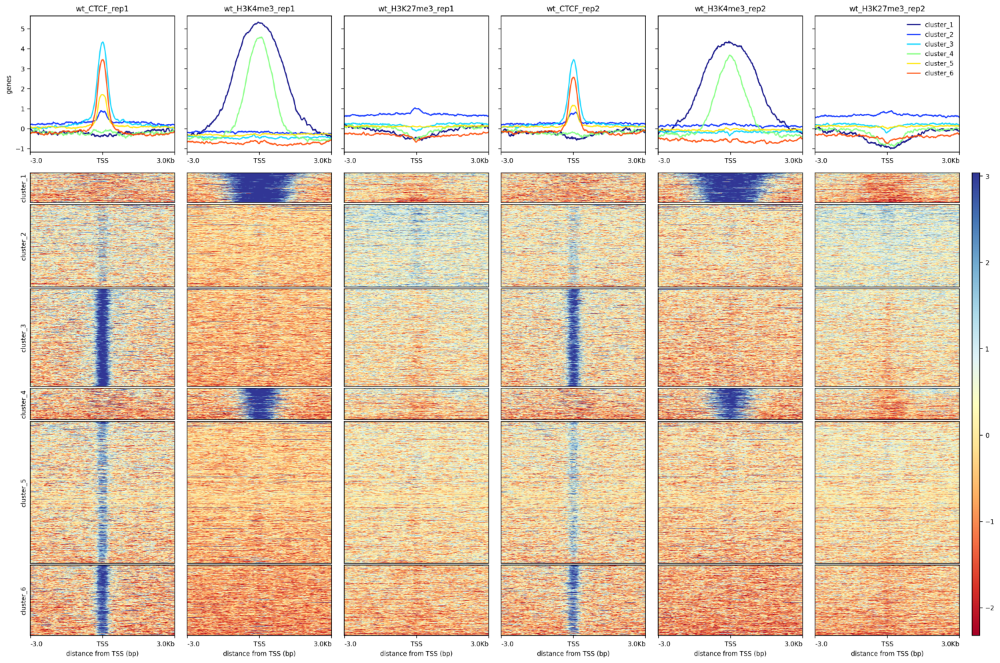
>
> 3. How could be interpreted the peaks and read coverage in the `chrX:151,385,260-152,426,526` region?
>
>    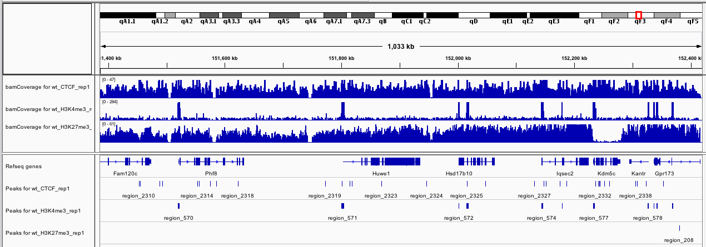
>
> > <solution-title></solution-title>
> > 1. Found peaks (number of lines in **MACS2 callpeak**  outputs):
> >
> >     Target | Rep 1 | Rep 2
> >     --- | --- | ---
> >     CTCF | 2,688 | 2,062
> >     H3K4me3 | 656 | 717
> >     H3K27me3 | 221 | 76
> >
> >    The tendencies are similar for both replicates: more peaks for CTCF, less for H3K4me3 and only few for H3K27me3.
> >
> > 2. As observed with the 2 samples, the peaks for H3K4me3 are wider than for CTCF. We also observe that the peaks found with one replicate are found with the other replicate.
> > 3. The H3K4me3 sample has clear and large regions in which the read coverage are enriched. H3K4me3 is one of the least abundant histone modifications. It is highly enriched at active promoters near transcription start sites (TSS) and positively correlated with transcription.
> >
> >    For H3K27me3, the coverage is more homogeneous. A gene is a broad domain of H3K27me3 enrichment across its body of genes corresponds to a gene with a transcription inhibited by H3K27me3. We can also identified some "bivalent" genes: gene with a peak around the TSS for H3K27me3(e.g. region_208 for gene Gpr173) but also H3K4me3. We also observe some H3K27me3-depleted regions sharply demarcated, with boundaries coinciding with gene borders (e.g. Kdm5c). This is a chromatin signature reminiscent of genes that escape XCI.
> >
> >    To reproduce, run **bamCoverage** , **IGV**  and **MACS2 callpeak**  outputs.
> {: .solution }
{: .question}

# Conclusion


Along this tutorial, we learn how to extract peaks and coverage information from raw data of ChIP experiments:

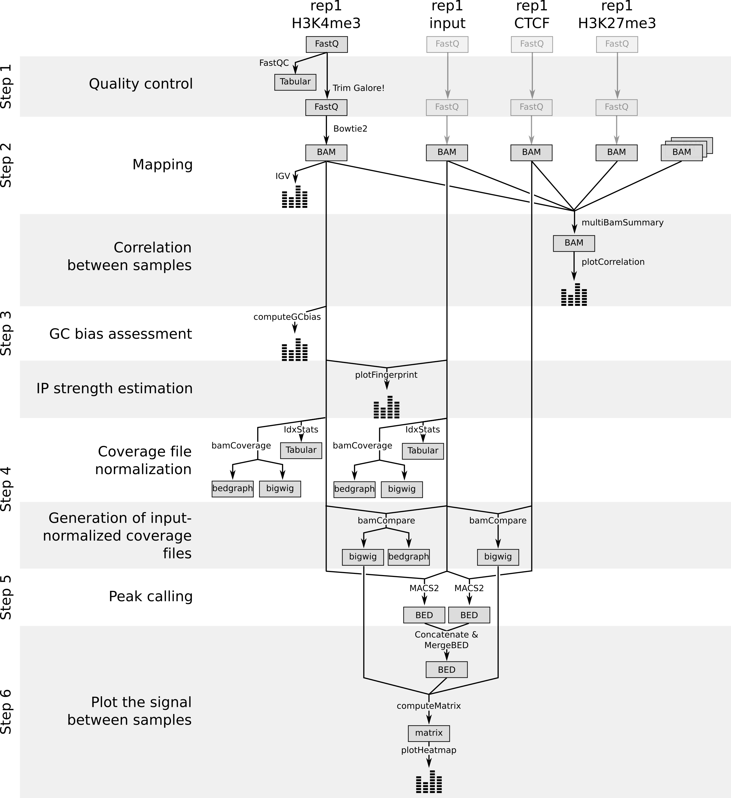

This information can be then related to the biology to answer the original question. We tried then to relate the observed differences of peak and read coverage between H3K27me3 and H3K4me3 to the known biology. We could go even further in the analysis to reproduce the results of the original paper (e.g. by looking at the bivalent genes, identifying the differences between Xa and Xi).
