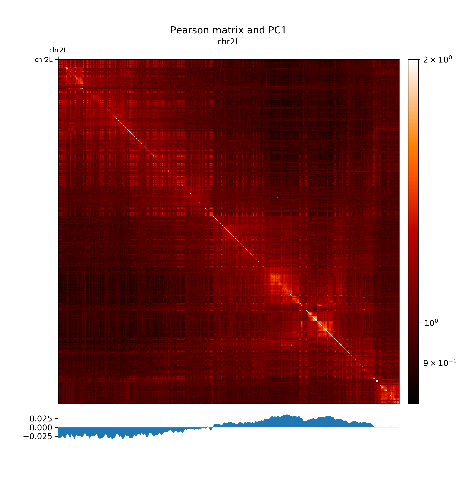
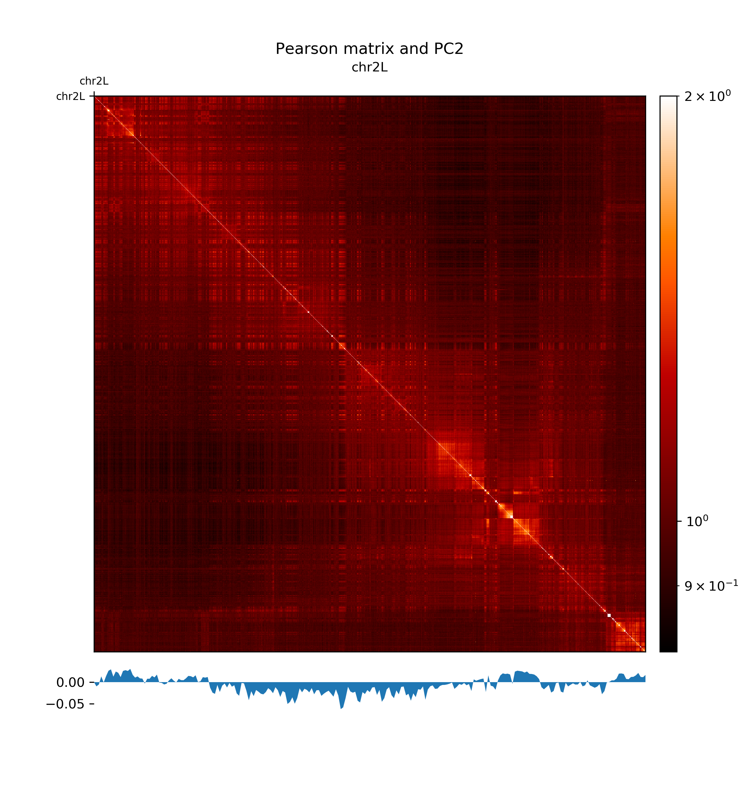
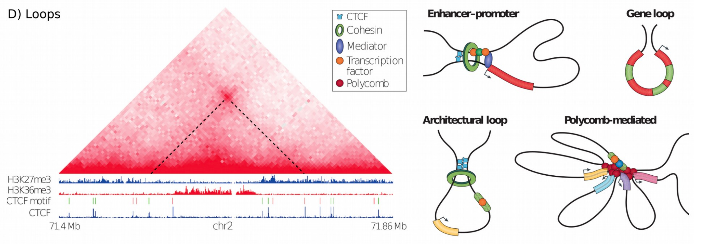
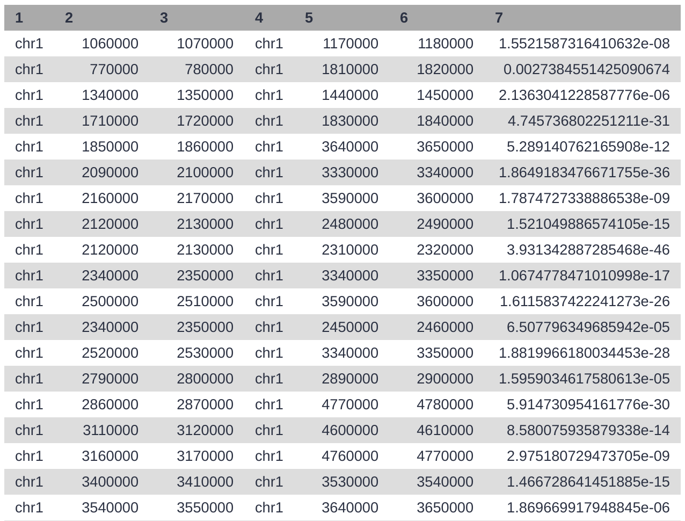
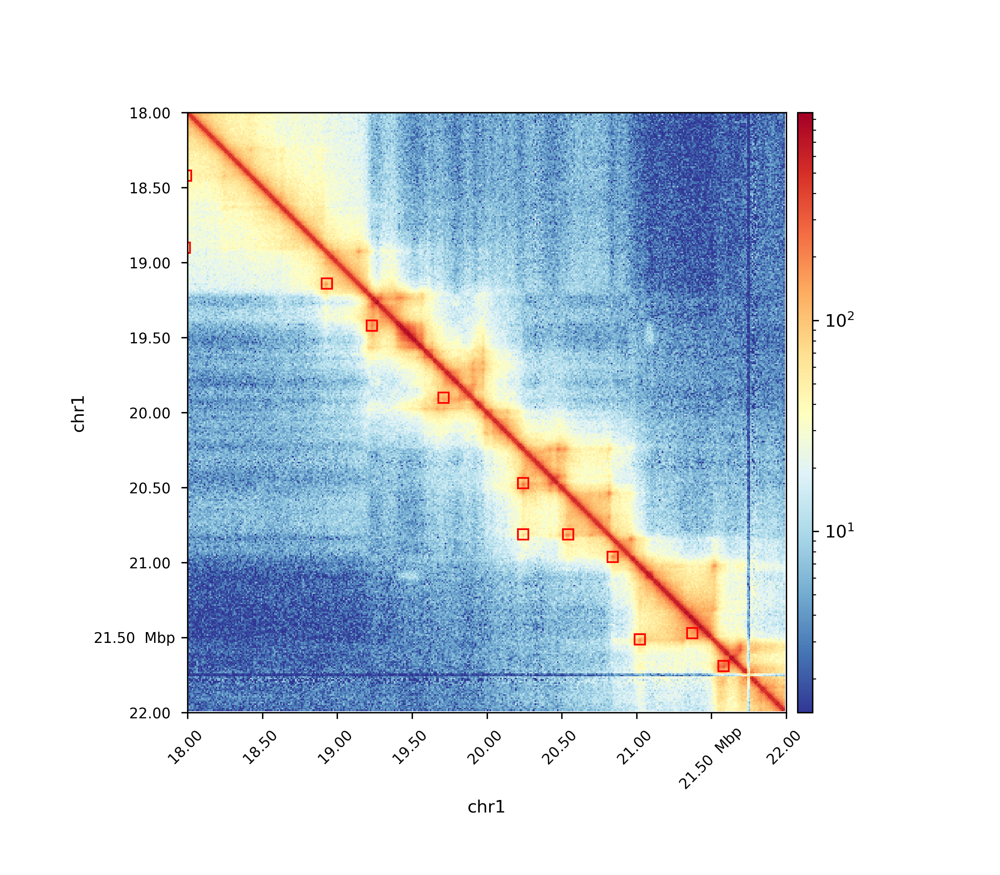

# Introduction


In this HiCExplorer tutorial we will generate and plot a Hi-C contact matrix.
For this the following steps are necessary to be performed:
1. Map the Hi-C reads to the reference genome
2. Creation of a Hi-C matrix
3. Plotting the Hi-C matrix
4. Correction of Hi-C matrix
5. TAD Calling
6. A/B compartments computation
7. pyGenomeTracks visualization
8. Loop detection


After a corrected Hi-C matrix is created other tools can be used to visualize it, call TADS or compare it with other matrices.

> <agenda-title></agenda-title>
>
> In this tutorial, we will deal with:
>
> 1. TOC
> {:toc}
>
{: .agenda}

# Data upload

> <hands-on-title>Data upload</hands-on-title>
>
> 1. Create a new history
>
>    
>
> 2. Import from [Zenodo](https://doi.org/10.5281/zenodo.1183661).
>
>    > <tip-title>Importing data via links</tip-title>
>    >
>    > 1. Copy the link location
>    > 2. Open the Galaxy Upload Manager
>    > 3. Select **Paste/Fetch Data**
>    >
>    >    Below are the links to the read files that can be copied and pasted in the upload manager.
>    >
>    >    ```
>    >    https://zenodo.org/record/1183661/files/HiC_S2_1p_10min_lowU_R1.fastq.gz
>    >    https://zenodo.org/record/1183661/files/HiC_S2_1p_10min_lowU_R2.fastq.gz
>    >    ```
>    >
>    > 4. Paste the links into the text field
>    > 5. Press **Start**
>    {: .tip}
>
> 3. Rename the data set to something meaningful, e.g. `HiC_S2_1p_10min_lowU_R1` and `HiC_S2_1p_10min_lowU_R2`.
> By default, when data is imported via its link, Galaxy names it with its URL.
>
> > <comment-title>Get data from public sources</comment-title>
> > HiCExplorer needs as input the forward and reverse strand of a pair end read which are mapped independently. A usual start point for a typical analysis is the given GSE number of a publication, e.g. GSE63525 for Rao 2014. To get the actual data, go to [NCBI](https://www.ncbi.nlm.nih.gov/geo/) and search for the [GSE number](https://www.ncbi.nlm.nih.gov/geo/query/acc.cgi?acc=GSE63525). In the section 'Samples' the GSM numbers of all samples are given. Select the correct one for you, and go to the [European Nucleotide Archive](https://www.ebi.ac.uk/ena) and enter the GSM number. Select a matching result e.g. [SRX764936](https://www.ebi.ac.uk/ena/data/view/SRX764936) and download the data given in the row 'FASTQ files (FTP)' the forward and reverse strand.
> > It is important to have the forward and reverse strand individual as a FASTQ file and to map it individually, HiCExplorer can not work with interleaved files.
> {: .comment}
>
{: .hands_on}

# Reads mapping

Mates have to be mapped individually to avoid mapper specific heuristics designed for standard paired-end libraries.

We have used the HiCExplorer successfully with bwa, bowtie2 and hisat2. In this tutorial we will be using **Map with BWA-MEM** tool. It is important to remember to:
- use local mapping, in contrast to end-to-end. A fraction of Hi-C reads are chimeric and will not map end-to-end thus, local mapping is important to increase the number of mapped reads
- tune the aligner parameters to penalize deletions and insertions. This is important to avoid aligned reads with gaps if they happen to be chimeric.
- If bowtie2 or hisat2 are used, `--reorder` option and as a file format `bam_native` needs to be used. Regular `bam` files are sorted by Galaxy and can not be used as an input for HiCExplorer.

> <hands-on-title>Mapping reads</hands-on-title>
>
> 1. **Map with Bowtie** : Run Bowtie on both strands `HiC_S2_1p_10min_lowU_R1` and `HiC_S2_1p_10min_lowU_R2` with:
>    - "Is this single or paired library" to `Single-end`
>    - Set multiple data sets
>    - "FASTQ file" to `HiC_S2_1p_10min_lowU_R1`and `HiC_S2_1p_10min_lowU_R2`
>    - "Will you select a reference genome from your history or use a built-in index?" to `Use a built-in index`
>    - "Select a reference genome" to `dm3`
>    - "Do you want to tweak SAM/BAM Options?" to `Yes`
>    - "Reorder output to reflect order of the input file" to `Yes`
>
> 2. Rename the output of the tool according to the corresponding files: `R1.bam` and `R2.bam`
>
{: .hands_on}

# Creation of a Hi-C matrix

Once the reads have been mapped the Hi-C matrix can be built.

For this step we will use [hicBuildMatrix](http://hicexplorer.readthedocs.io/en/latest/content/tools/hicBuildMatrix.html#hicbuildmatrix) tool, which builds the matrix of read counts over the bins in the genome, considering the sites around the given restriction site.

> <hands-on-title>hicBuildMatrix</hands-on-title>
>
> 1. **hicBuildMatrix** : Run hicBuildMatrix on the `R1.bam` and `R2.bam` from previous step with modifying the following parameters:
>    - "1: Sam/Bam files to process" to `R1.bam`
>    - "2: Sam/Bam files to process" to `R2.bam`
>    - "Choose to use a restriction cut file or a bin size" to `Bin size`
>    - "Bin size in bp" to `10000`
>    - "Sequence of the restriction site" to `GATC`
>
>       > <comment-title></comment-title>
>       >
>       > *hicBuildMatrix* creates two files, a bam file containing only the valid Hi-C read pairs and a matrix containing the Hi-C contacts at the given resolution. The bam file is useful to check the quality of the Hi-C library on the genome browser. A good Hi-C library should contain piles of reads near the restriction fragment sites. In the QC folder a html file is saved with plots containing useful information for the quality control of the Hi-C sample like the number of valid pairs, duplicated pairs, self-ligations etc. Usually, only 25%-40% of the reads are valid and used to build the Hi-C matrix mostly because of the reads that are on repetitive regions that need to be discarded.
>       {: .comment}
>
>       > <comment-title></comment-title>
>       >
>       > Normally 25% of the total reads are selected. The output matrices have counts for the genomic regions. The extension of output matrix files is .h5.
>       > A quality report is created in e.g. `hicMatrix/R1_10kb_QC`, have a look at the report hicQC.html.
>       {: .comment}
>
> 2. Rename the output to `10 kb contact matrix`.
>
{: .hands_on}

# Plotting the Hi-C matrix

A 10kb bin matrix is too large to plot, it's better to reduce the resolution. We usually run out of memory for a 1 kb or a 10 kb bin matrix and the time to plot it is very long (minutes instead of seconds). In order to reduce the resolution we use the tool [hicMergeMatrixBins](http://hicexplorer.readthedocs.io/en/latest/content/tools/hicMergeMatrixBins.html#hicmergematrixbins).

[hicMergeMatrixBins](http://hicexplorer.readthedocs.io/en/latest/content/tools/hicMergeMatrixBins.html#hicmergematrixbins) merges the bins into larger bins of given number (specified by –numBins). We will merge 100 bins in the original (uncorrected) matrix and then correct it. The new bin size is going to be 10.000 bp * 100 = 1.000.000 bp = 1 Mb

> <hands-on-title>hicMergeMatrixBins</hands-on-title>
>
> 1. **hicMergeMatrixBins** : Run hicMergeMatrixBins on the output from previous step setting the following parameter:
>    - "Number of bins to merge" to `100`
>
> 2. Rename the output to `1 MB contact matrix`.
>
> 3. **hicPlotMatrix** : Run hicPlotMatrix on the output from hicMergeMatrixBins `1 MB contact matrix` adjusting the parameters:
>    - "Plot title" to `Hi-C matrix for dm3`
>    - "Remove masked bins from the matrix" to `True`
>    - "Plot the log1p of the matrix values: `True`
>    - "Chromosomes to include (and order to plot in)" to `chr2L`
>    - "+ Insert Chromosomes to include (and order to plot in):" to `chr2R`
>    - "+ Insert Chromosomes to include (and order to plot in):" to `chr3L`
>    - "+ Insert Chromosomes to include (and order to plot in):" to `chr3R`
>    - "+ Insert Chromosomes to include (and order to plot in):" to `chrX`
>
>    > <tip-title>log1p</tip-title>
>    >
>    > Because of the large differences in counts found in the matrix, it is better to plot the counts using the *–log1p* option.
>    {: .tip}
>
{: .hands_on}

The resulting plot of the 1 Mb contact matrix should look like:


# Correction of Hi-C matrix


[hicCorrectMatrix](http://hicexplorer.readthedocs.io/en/latest/content/tools/hicCorrectMatrix.html#hiccorrectmatrix) corrects the matrix counts in an iterative manner. For correcting the matrix, it’s important to remove the unassembled scaffolds (e.g. NT_) and keep only chromosomes, as scaffolds create problems with matrix correction. Therefore we use the chromosome names (chr2R, chr2L, chr3R, chr3L, chrX) here.


Matrix correction works in two steps: first a histogram containing the sum of contact per bin (row sum) is produced. This plot needs to be inspected to decide the best threshold for removing bins with lower number of reads. The second steps removes the low scoring bins and does the correction.

> <hands-on-title>Matrix diagnostic</hands-on-title>
>
> 1. **hicCorrectMatrix** : Run hicCorrectMatrix on the output from hicBuildMatrix `10 kb contact matrix` adjusting the parameters:
>    - "Range restriction (in bp)" to `Diagnostic plot`
>    - "Chromosomes to include (and order to plot in)" to `chr2L`
>    - "+ Insert Chromosomes to include (and order to plot in):" to `chr2R`
>    - "+ Insert Chromosomes to include (and order to plot in):" to `chr3L`
>    - "+ Insert Chromosomes to include (and order to plot in):" to `chr3R`
>    - "+ Insert Chromosomes to include (and order to plot in):" to `chrX`
>
{: .hands_on}

The output of the program prints a threshold suggestion that is usually accurate but is better to revise the histogram plot. The threshold is visualized in the plot as a black vertical line.

In our case the distribution describes the counts per bin of a genomic distance. To remove all bins with a z-score threshold less / more than X means to remove all bins which have less / more counts than X of mean of their specific distribution in units of the standard deviation. Looking at the distribution, we can select the value of -1.6 (lower end) and 1.8 (upper end) to remove. This is given by the –filterThreshold option in hicCorrectMatrix set to 'correct matrix' mode.

> <hands-on-title>Matrix correction</hands-on-title>
>
> 1. **hicCorrectMatrix** : Run hicCorrectMatrix on the original matrix `10 kb contact matrix` adjusting the parameters:
>    - "Range restriction (in bp)" to `Correct matrix`
>    - "Normalize each chromosome separately" to `True`
>    - "Remove bins of low coverage" to `-1.6`
>    - "Remove bins of large coverage" to `1.8`
>    - "Chromosomes to include (and order to plot in)" to `chr2L`
>    - "+ Insert Chromosomes to include (and order to plot in):" to `chr2R`
>    - "+ Insert Chromosomes to include (and order to plot in):" to `chr3L`
>    - "+ Insert Chromosomes to include (and order to plot in):" to `chr3R`
>    - "+ Insert Chromosomes to include (and order to plot in):" to `chrX`
>
> 2. Rename the corrected matrix to `10 kb corrected contact matrix`.
>
{: .hands_on}

It can happen that the correction stops with:

```
ERROR:iterative correction:*Error* matrix correction produced extremely large values.
This is often caused by bins of low counts. Use a more stringent filtering of bins.
```

This can be solved by a more stringent z-score values for the filter threshold or by a look at the plotted matrix. For example, chromosomes with 0 reads in its bins can be excluded from the correction by not defining it for the set of chromosomes that should be corrected (parameter 'Include chromosomes').

### Plotting the corrected Hi-C matrix

We can now plot chromosome 2L with the corrected matrix.

> <hands-on-title>Plotting the corrected Hi-C matrix</hands-on-title>
>
> 1. **hicPlotMatrix** : Run hicPlotMatrix on `10 kb corrected contact matrix` adjusting the parameters:
>    - "Plot title" to `Hi-C matrix for dm3`
>    - "Plot per chromosome" to `False`
>    - "Plot only this region" to `chr2L`
>    - "Plot the log1p of the matrix values" to `True`
>
{: .hands_on}


### Load new data

The steps so far would have led to long run times if real data would have been used. We therefore prepared a new matrix for you, `corrected contact matrix dm3 large`. Please load it into your history.

# TAD calling

“The partitioning of chromosomes into topologically associating domains (TADs) is an emerging concept that is reshaping our understanding of gene regulation in the context of physical organization of the genome” [Ramirez et al. 2017](https://doi.org/10.1101/115063).

TAD calling works in two steps: First HiCExplorer computes a TAD-separation score based on a z-score matrix for all bins. Then those bins having a local minimum of the TAD-separation score are evaluated with respect to the surrounding bins to assign a p-value. Then a cutoff is applied to select the bins more likely to be TAD boundaries.

[hicFindTADs](http://hicexplorer.readthedocs.io/en/latest/content/tools/hicFindTADs.html#hicfindtads) tries to identify sensible parameters but those can be change to identify more stringent set of boundaries.

> <hands-on-title>Finding TADs</hands-on-title>
>
> 1. **hicFindTADs** : Run hicFindTADs on `corrected contact matrix dm3 large` adjusting the parameters:
>    - "Minimum window length (in bp) to be considered to the left and to the right of each Hi-C bin." to `30000`
>    - "Maximum window length (in bp) to be considered to the left and to the right of each Hi-C bin." to `100000`
>    - "Step size when moving from minDepth to maxDepth" to `10000`
>    - "Multiple Testing Corrections" to `False discovery rate`
>    - "q-value" to `0.05`
>    - "Minimum threshold of the difference between the TAD-separation score of a putative boundary and the mean of the TAD-sep. score of surrounding bins." to `0.001`
>
{: .hands_on}

As an output we get the boundaries, domains and scores separated files. We will use in the plot later only the TAD-score file.

# A/B compartments computation

> <hands-on-title>Computing A / B compartments</hands-on-title>
>
> 1. **hicPCA** : Run hicPCA adjusting the parameters:
>    - "Matrix to compute on" to `corrected contact matrix dm3 large`
>    - "Output file format" to `bigwig`
>    - "Return internally used Pearson matrix" to `Yes`
>
{: .hands_on}

> <hands-on-title>Plotting the pearson matrix and PCA track</hands-on-title>
>
> 1. **hicPlotMatrix** : Run hicPlotMatrix on `pearson_matrix from PCA computation` adjusting the parameters:
>    - "Plot title" to `Pearson matrix and PC1`
>    - "Chromosomes to include" to `chr2L`
>    - "Color map to use for the heatmap" to `gist_heat`
>    - "Datatype of eigenvector file" to `bigwig`
>    - "Eigenvector file" to `hicPCA on [...] PC1`
>
> 1. **hicPlotMatrix** : Run hicPlotMatrix on `pearson_matrix from PCA computation` adjusting the parameters:
>    - "Plot title" to `Pearson matrix and PC2`
>    - "Chromosomes to include" to `chr2L`
>    - "Color map to use for the heatmap" to `gist_heat`
>    - "Datatype of eigenvector file" to `bigwig`
>    - "Eigenvector file" to `hicPCA on [...] PC2`
>
{: .hands_on}







The first principal component correlates with the chromosome arms, while the second component correlates with A/B compartments.

# Integrating Hi-C and other data

We can plot the TADs for a given chromosomal region. For this we will use [pyGenomeTracks](http://hicexplorer.readthedocs.io/en/latest/content/tools/hicPlotTADs.html).

For the next step we need additional data tracks. Please load `dm3_genes.bed`, `H3K27me3.bw`, `H3K36me3.bw` and `H4K16ac.bw` to your history.

> <hands-on-title>Plotting TADs</hands-on-title>
>
> 1. **pyGenomeTracks** : Run pyGenomeTracks adjusting the parameters:
>    - "Region of the genome to limit the operation" to `chr2L:14500000-16500000`
>    - "Choose style of the track" to `TAD visualization`
>         - "Plot title" to `HiC dm3 chr2L:14500000-16500000`
>         - "Matrix to compute on." to the corrected matrix from hicCorrectMatrix step
>         - "Depth" to `750000`
>         - "Height" to `4`
>         - "Boundaries file" to `hicFindTads on data XX: TAD domains`
>         - "Show x labels" to `Yes`
>
>    - "+Insert Include tracks in your plot"
>        - "Choose style of the track" to `Bedgraph matrix track`
>        - "Plot title" to `TAD separation score`
>        - "Track file bedgraph format" to `hicFindTads on data XX: TAD information in bm file`
>        - "Height" to `4`
>        - "Set type to lines" to 'True'
>
>
>    - "+Insert Include tracks in your plot"
>        - "Choose style of the track" to `Bigwig track`
>        - "Plot title" to `PC1`
>        - "Track file bigwig format" the first computed `hicPCA` result
>        - "Height" to `1.5`
>        - "Color of track" to a color of your choice
>
>    - "+Insert Include tracks in your plot"
>        - "Choose style of the track" to `Bigwig track`
>        - "Plot title" to `PC2`
>        - "Track file bigwig format" the second computed `hicPCA` result
>        - "Height" to `1.5`
>        - "Color of track" to a color of your choice
>
>    - "+Insert Include tracks in your plot"
>        - "Choose style of the track" to `Bigwig track`
>        - "Plot title" to `H3K36me3`
>        - "Track file bigwig format" to `H3K36me3`
>        - "Height" to `1.5`
>        - "Color of track" to a color of your choice
>
>    - "+Insert Include tracks in your plot"
>        - "Choose style of the track" to `Bigwig track`
>        - "Plot title" to `H3K27me3`
>        - "Track file bigwig format" to `H3K27me3`
>        - "Height" to `1.5`
>        - "Color of track" to a color of your choice
>
>    - "+Insert Include tracks in your plot"
>        - "Choose style of the track" to `Bigwig track`
>        - "Plot title" to `H4K16ac`
>        - "Track file bigwig format" to `H4K16ac`
>        - "Height" to `1.5`
>        - "Color of track" to a color of your choice
>
>    - "+Insert Include tracks in your plot"
>        - "Choose style of the track" to `Gene track`
>        - "Plot title" to `dm3 genes`
>        - "Track file bedgraph format" the imported .bed file
>        - "Height" to `3`
>        - "Type" to `genes`
>        - "Gene rows" to `15`
>        - "Color of track" to a color of your choice
>
>    - "+Insert Include tracks in your plot"
>        - "Choose style of the track" to `Vlines track`
>        - "Track file bed format" to `hicFindTads on data XX: TAD domains`
{: .hands_on}

The resulting image should look like this one:


# Loop detection

In Hi-C data, the term `loop` refers to a 3D structure which represents enhancer-promoter, gene, architectural or polycomb-mediated interactions. These interactions have the characteristics to be enriched in a single region compared to the local background. These loops are also called long-range interactions with an expected maximum distance of 2 MB (see [Rao et al. 2014](https://doi.org/10.1016/j.cell.2014.11.021)).



To compute loops, we have to import a new data set from the shared library to our history: `GM12878-MboI-allreps-filtered.10kb.cool` or download it via the <a href="ftp://cooler.csail.mit.edu/coolers/hg19/Rao2014-GM12878-MboI-allreps-filtered.10kb.cool">FTP cool files server</a>. (FTP links seems to be blocked, therefore the full URL: `ftp://cooler.csail.mit.edu/coolers/hg19/Rao2014-GM12878-MboI-allreps-filtered.10kb.cool`)

This dataset is from the human cell GM12878, mapped to hg19 and of 10 kb resolution. We use a new file because to detect loop structures the read coverage is required to be in the hunderts of million; this was not the case for the previous used drosophila dataset.

> <hands-on-title>Matrix information</hands-on-title>
>
> 1. **hicInfo** : Run hicInfo adjusting the parameters:
>    - "Select" `Multiple datasets`
>    - "Matrix to compute on" to `corrected contact matrix dm3 large` and `GM12878-MboI-allreps-filtered.10kb.cool`
{: .hands_on}

We now investigate the result of hicInfo and see that the new imported file is having 1.2 billion non-zero elements, while the drosophila Hi-C interaction matrix has around 12 million non-zero elements.

> <hands-on-title>Computing loops</hands-on-title>
>
> 1. **hicDetectLoops** : Run hicDetectLoops adjusting the parameters:
>    - "Matrix to compute on" to `GM12878-MboI-allreps-filtered.10kb.cool`
>    - "Peak width" to `6`
>    - "Window size" to `10`
>    - "P-value preselection" to `0.01`
>    - "P-value" to `0.01`
>    - "Chromosomes to include" to `chr1`
>
{: .hands_on}


The detection of the loops is based on a pre-selection of interactions, a p-value given a continuous negative binomial distribution over all interactions of a relative distance is computed. All interactions are filtered with a threshold (`p-value preselection`) to retrieve loop candidates. In a second step, the selected peak candidate is compared against its background using a Wilcoxon rank-sum test.

As an output we get a loop file containing the positions of both anchor points of the loop and the p-value of the used statistical test.



> <hands-on-title>Plotting of loops</hands-on-title>
>
> 1. **hicPlotMatrix** : Run hicPlotMatrix adjusting the parameters:
>    - "Matrix to compute on" to `GM12878-MboI-allreps-filtered.10kb.cool`
>    - "Plot title" to `Loops`
>    - "Plot only this region" to `chr1:18000000-22000000`
>    - "Plot the log1p of the matrix values" to `Yes`
>    - "Add detected loops" to `Computed loops` of the previous step
>    - "DPI for image" to `300`
>
{: .hands_on}



# Conclusion


In this tutorial we used HiCExplorer to analyze drosophila melanogaster cells. We mapped chimeric reads and created a contact matrix, to reduce noise this contact matrix was normalized. We showed how to visualize a contact matrix and how we can investigate topological associating domains and relate them to additional data like gene tracks. Moreover, we used a human Hi-C interaction matrix to compute loop structures.


 To improve your learned skills we offer an additional tutorial based on mouse stem cells: [following work](http://hicexplorer.readthedocs.io/en/latest/content/example_usage.html).
