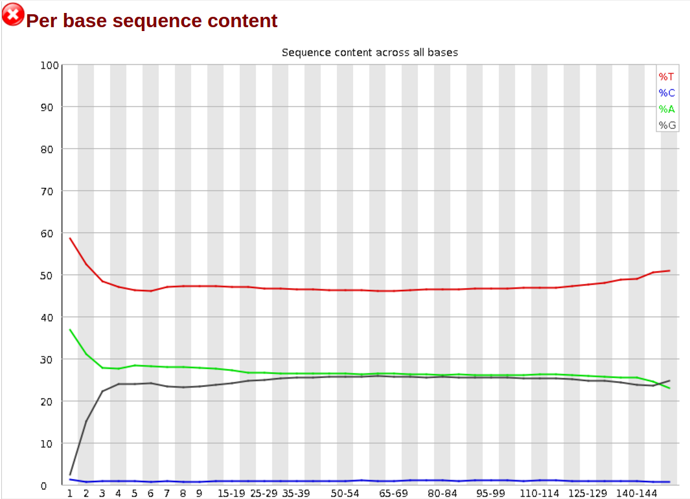
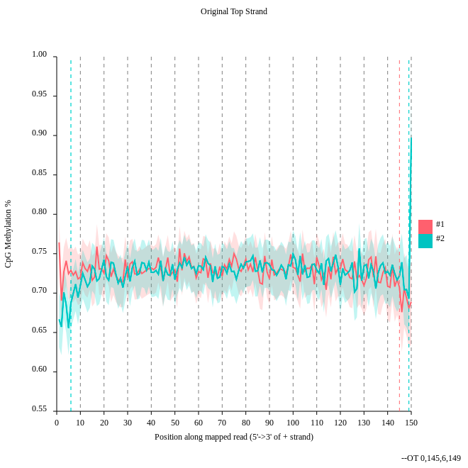
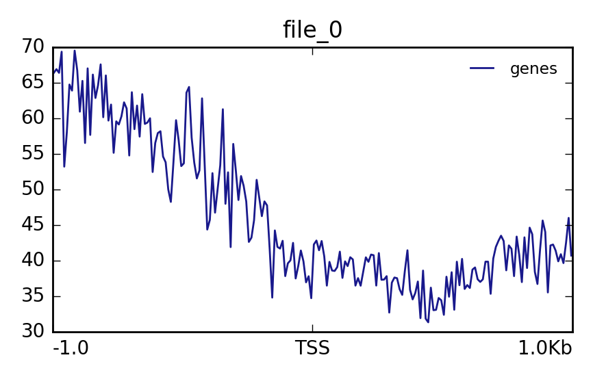
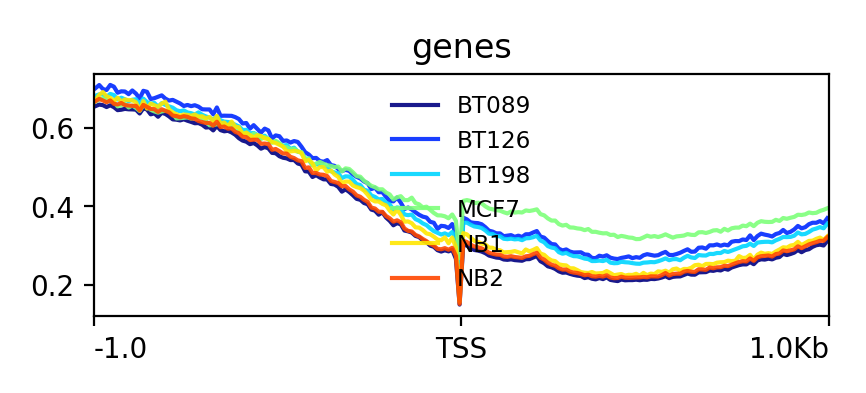

> ### Agenda
>
> In this tutorial we will do:
>
> 1. quality control
> 2. alignment
> 3. methylation extraction 
> 4. visualization of methylation levels
> 5. differentially methylated regions analysis
>
> We will use a small subset of the original data. If we would do the computation on the orginal data the computation time for a tutorial is too long. To show you all necessary steps for Methyl-Seq we decided to use a subset of the data set. In a second step we use precomputed data from the study to show you different levels of methylation. We will consider samples from normal breast cells (NB), fibroadenoma (noncancerous breast tumor, BT089), two invasive ductal carcinomas (BT126, BT198) and a breast adenocarcinoma cell line (MCF7).
>
>
{: .agenda}

This tutorial is based on [I-Hsuan Lin et al.: 'Hierarchical Clustering of Breast Cancer Methylomes Revealed Differentially Methylated and Expressed Breast Cancer Genes'](https://dx.doi.org/10.1371/journal.pone.0118453).

The data we use in this tutorial is available at [Zenodo](https://zenodo.org/record/557099).

# Load data and quality control
> ###  Hands-on: Get the data and look at the quality
>
> We load now the example dataset which will be used for the tutorial.
>
> 1. Load the two example datasets from our data library: subset_1.fastq.gz and subset_2.fastq.gz.
>
>    > ###  Tip: Get data from the library
>    >
>    > * Click on `Shared Data` --> `Data Libraries` and here `MethylSeq_2017`
>    > * Select the uploaded datasets `subset_1.fastq.gz` and `subset_2.fastq.gz` as the fastq files
>    {: .tip}
>
> 2. Quality control
>
>    > ###  Tip: Search for tools
>    >
>    > * **FastQC**  with the following parameters:
>    > - Select the uploaded datasets `subset_1.fastq.gz` and `subset_2.fastq.gz` as the fastq files
>    {: .tip}
>
> 3. Go to the web page result page and have a closer look at 'Per base sequence content'
>
>    
>
>    > ###  Questions
>    >
>    > - Note the GC distribution and percentage of "T" and "C". Why is this so weird?
>    > - Is everything as expected?
>    >
>    >
>    >    

>    >    
Click to view answers

>    >    <ol type="1">
>    >    <li>The attentive audience of the theory part knows: Every C-meth stays a C and every normal C becomes a T during the bisulfite conversion. </li>
>    >    <li>Yes it is. Always be careful and have the specific characteristics of your data in mind during the interpretation of FastQC results.</li>
>    >    </ol>
>    >    

>    {: .question}
>
{: .hands_on}

# Alignment

> ###  Hands-on: Mapping with bwameth
>
> We will map now the imported dataset against a reference genome.
>
> 1. **bwameth**  with the following parameters:
> - Select for the option `Select a genome reference from your history or a built-in index?` `Use a built-in index` and here the human `hg38` genome.
> - Choose for the option `Is this library mate-paired?` `Paired-end` and use the two imported datasets as an input.
> Compute now the alignment. Please notice that depending on your system this computation can take some time. If you want to skip this, we provide for you a precomputed alignment. Import `aligned_subset.bam` to your history.
>
>    > ###  Questions
>    >
>    > -  Why we need other alignment tools for bisulfite sequencing data?
>    >
>    >
>    >    

>    >    
Click to view answers

>    >    <ol type="1">
>    >    <li>You may have noticed that all the C's are C-meth's and a T can be a T or a C. A mapper for methylation data needs to find out what is what.</li>
>    >    </ol>
>    >    

>    {: .question}
>
{: .hands_on}

# Methylation bias and metric extraction

> ###  Hands-on: Methylation bias
> 
> In this step we will have a look at the distribution of the methylation and will look at a possible bias.
>
> 1. **MethylDackel**  with the following parameters: 
> - Choose at the first option `Load reference genome from` `Local cache` and for `Using reference genome` the value `hg38`.
> - Select for the option `sorted_alignments.bam` the computed bam file of step 4 of the `bwameth` alignment.
> - Use for `What do you want to do?` the value `Determine the position-dependent methylation bias in the dataset, producing diagnostic SVG images`.
> - Set the parameters `By default, if only one read in a pair aligns (a singleton) then it's ignored.` and `By default, paired-end alignments with the properly-paired bit unset in the FLAG field are ignored. Note that the definition of concordant and discordant is based on your aligner settings.` to `Yes`.
>
>    
>
>    > ###  Questions
>    >
>    > - Consider the `original top strand` output. Is there a methylation bias?
>    > - If we would trim, what would be the start and the end positions?
>    >
>    >
>    >
>    >    

>    >    
Click to view answers

>    >    <ol type="1">
>    >    <li>The distribution of the methylation is more or less equal. Only at the start and the end we could trim a bit but a +- 5% variation is acceptable. </li>
>    >    <li>To trim the reads we would include for the first strand only the positions 0 to 145, for the second 6 to 149.</li>
>    >    </ol>
>    >    

>    {: .question}
>
>
{: .hands_on}

> ###  Hands-on: Methylation extraction with MethylDackel
>
>
> We will extract the methylation on the resulting BAM file of the alignment step. We need this to create a methylation level plot in the next step.
>
> 1. **MethylDackel**  with the following parameters:
> - Choose at the first option `Load reference genome from` the value: `Local cache` and for `Using reference genome` the value: `hg38`.
> - Select for the option `sorted_alignments.bam` the computed bam file of step 4 of the `bwameth` alignment.
> - Use for `What do you want to do?` the value `Extract methylation metrics from an alignment file in BAM/CRAN format`.
> - Choose `Yes` for the option `Merge per-Cytosine metrics from CpG and CHG contexts into per-CPG or per-CHG metrics`.
> - Set the parameter `Extract fractional methylation (only) at each position. This is mutually exclusive with --counts, --logit, and --methylKit` to `Yes`.
> - All other options use the default value.
>
>
>
{: .hands_on}

# Visualization

> ###  Hands-on:
>
> In this step we want to visualize the methylation level around all TSS of our data. When located at gene promoters, DNA methylation is usually a repressive mark. 
>
> 1. **Wig/BedGraph-to-bigWig**  with the following parameters: 
>    - Use the result of MethylDackel to transform it to a bigWig file.
>    > ###  Tip: Database edit
>    >
>    > It can happen that you can not select the correct input file. In this case you have to add meta information about the used genome to the file.
>    > * Click on the pencil of the correct history item. 
>    > * Change `Database/Build:` to the genome you used.
>    > * In our case the correct genome is `Human Dec. 2013 (GRCh38/hg38) (hg38)`.
>    {: .tip}
>
> 2. **computeMatrix**  with the following parameters:
>    - Use the file `CpGIslands.bed`as `Regions to plot` and the in the previous step created bigwig file as the `score file`.
>    - Use for the option `computeMatrix has two main output options` the value `reference-point`.
> 3. **plotProfile**  with the following parameters:
>    - Choose for `Matrix file from the computeMatrix tool` the computed matrix from the tool `computeMatrix`.
>
> The output should look like this:
>
> 
>
> Lets see how the methylation looks for a few provided files:
> 1. **Galaxy** : Import the files `NB1_CpG.meth.bedGraph` from the data library
> 2. **Wig/BedGraph-to-bigWig**  with the following parameters:
>    - Use the imported file to transform it to a bigWig file.
>
>    > ###  Questions
>    >
>    > - The execution fails. Do you have an idea why?
>    >
>    >  
>    >    

>    >    
Click to view answers

>    >    <ol type="1">
>    >    <li>A conversion to bigWig would fail right now, probably with some error message like <code>hashMustFindVal: '1' not found</code>. The reason is the source of the reference genome which was used. There is ensembl and UCSC as sources which differ in naming the chromosomes. Ensembl is using just numbers e.g. 1 for chromosome one. UCSC is using chr1 for the same. Be careful with this especially if you have data from different sources. We need to convert this.</li>
>    >    </ol>
>    >    

>    {: .question}
>
>    > ###  Tip: UCSC - Ensembl convert
>    >
>    > * Download the `Replace information file` for hg38 chromosome: [Download](https://raw.githubusercontent.com/dpryan79/ChromosomeMappings/master/GRCh38_ensembl2UCSC.txt) and import it to Galaxy.
>    > * **Replace column** :
>    >    - Choose for `File in which you want to replace some values` the previous used `NB1_CpG.meth.bedGraph` file and for `Replace information file`  conversion file. For `Which column should be replaced?` choose `Column: 1`, for `Skip this many starting lines` a `1` and for `Delimited by` `Tab`.
>    {: .tip}
>
> 3. To save compute time we prepared the converted files for you. Import the files: `NB1_CpG.meth_ucsc.bedGraph`, `NB2_CpG.meth_ucsc.bedGraph`, `BT089_CpG.meth_ucsc.bedGraph`, `BT126_CpG.meth_ucsc.bedGraph`, `BT198_CpG.meth_ucsc.bedGraph` and `MCF7_CpG.meth_ucsc.bedgraph`.
> 4. Compute the matrix and plot the profile as described above.
>
> 
>
> More information about deepTools can be found here: https://deeptools.readthedocs.io
>
{: .hands_on}

# Metilene

> ###  Hands-on: Metilene
>
> With metilene it is possible to detect differentially methylated regions (DMRs) which is a necessary prerequisite for characterizing different epigenetic states.
>
> 1. **Galaxy** : Import from the data library the files `NB1_CpG.meth.bedGraph`, `NB2_CpG.meth.bedGraph` and `BT198_CpG.meth.bedGraph`.
> 2. **Metilene** : 
>    - Choose for the first option `Input group 1` the imported files starting with ``NB`` and for `Input group 2` the imported files `BT198_CpG.meth.bedGraph`.
>    - Select for the option `BED file containing regions of interest` the imported BED file CpGIslands.bed.
> 3. More information about metilene can be found here: https://www.bioinf.uni-leipzig.de/Software/metilene
>
>    > ###  Questions
>    >
>    > - Have a look at the produced pdf document. What is the data showing?
>    >
>    >
>    >
>    >    

>    >    
Click to view answers

>    >    <ol type="1">
>    >    <li>It shows the distribution of DMR differences, DMR length in nucleotides and number CpGs, DMR differences vs. q-values, mean methylation group 1 vs. mean methylation group 2 and DMR length in nucleotides vs. length in CpGs</li>
>    >    </ol>
>    >    

>    {: .question}
>
>
{: .hands_on}
