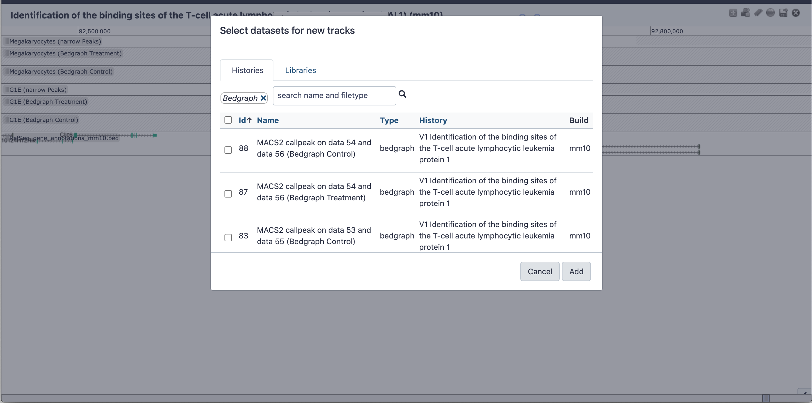

# Introduction

This tutorial uses ChIP-seq datasets from a study published by . The goal of this study was to investigate "the dynamics of occupancy and the role in gene regulation of the transcription factor TAL1, a critical regulator of hematopoiesis, at multiple stages of hematopoietic differentiation."

To this end, ChIP-seq experiments were performed in multiple mouse cell types including G1E - a GATA-null immortalized cell line derived from targeted disruption of GATA-1 in mouse embryonic stem cells - and megakaryocytes.

This dataset (GEO Accession: [GSE51338](https://www.ncbi.nlm.nih.gov/geo/query/acc.cgi?acc=GSE51338)) consists of biological replicate TAL1 ChIP-seq and input control experiments.
Input control experiments are used to identify and remove sampling bias, for example open/accessible chromatin or GC bias.

Because of the long processing time for the large original files, we have downsampled the original raw data files to include only reads that align to chromosome 19 and a subset of interesting genomic loci identified by .

**Table 1**: Metadata for ChIP-seq experiments in this tutorial. SE: single-end.

| Cellular state | Datatype | ChIP Ab | Replicate | SRA Accession | Library type | Read length | Stranded? | Data size (MB) |
| ---            | ---      | :-:     | :-:       | ---           | :-:          | :-:         | :-:       | ---            |
| G1E            | ChIP-seq | input   | 1         | SRR507859     | SE           | 36          | No        | 35.8           |
| G1E            | ChIP-seq | input   | 2         | SRR507860     | SE           | 55          | No        | 427.1          |
| G1E            | ChIP-seq | TAL1    | 1         | SRR492444     | SE           | 36          | No        | 32.3           |
| G1E            | ChIP-seq | TAL1    | 2         | SRR492445     | SE           | 41          | No        | 62.7           |
| Megakaryocyte  | ChIP-seq | input   | 1         | SRR492453     | SE           | 41          | No        | 57.2           |
| Megakaryocyte  | ChIP-seq | input   | 2         | SRR492454     | SE           | 55          | No        | 403.8          |
| Megakaryocyte  | ChIP-seq | TAL1    | 1         | SRR549006     | SE           | 55          | No        | 340.3          |
| Megakaryocyte  | ChIP-seq | TAL1    | 2         | SRR549007     | SE           | 48          | No        | 356.9          |

> <agenda-title></agenda-title>
>
> In this tutorial, we will deal with:
>
> 1. TOC
> {:toc}
>
{: .agenda}

# Quality control

As for any NGS data analysis, ChIP-seq data must be quality controlled before being aligned to a reference genome. For more detailed information on NGS quality control, check out the tutorial [here]({{site.baseurl}}/topics/sequence-analysis).

> <hands-on-title>Performing quality control</hands-on-title>
>
> 1. Create and name a new history for this tutorial.
>
>    
>
> 2. Import the ChIP-seq raw data (\*.fastqsanger) from [Zenodo](https://doi.org/10.5281/zenodo.197100).
>
>    
>
> 3. Examine the data in a FASTQ file by clicking on the  (eye) icon.
>
>    > <question-title></question-title>
>    >
>    > 1. What are four key features of a FASTQ file?
>    > 2. What is the main difference between a FASTQ and a FASTA file?
>    >
>    > > <solution-title></solution-title>
>    > > 1. A FASTQ file contains a sequence identifier and additional information, the raw sequence, information about the sequence again with optional information, and quality information about the sequence.
>    > > 2. A FASTA file contains only the description of the sequence and the sequence itself. A FASTA file does not contain any quality information.
>    > {: .solution }
>    {: .question}
>
> 4. : Run FastQC on each FASTQ file to assess the quality of the raw data. An explanation of the results can be found on the [FastQC web page](https://www.bioinformatics.babraham.ac.uk/projects/fastqc/).
>    -  *"Short read data from your current history"*: The uploaded fastqsanger files.
>
>    
>
>    > <question-title></question-title>
>    >
>    > 1. What does the y-axis represent in Figure 3?
>    > 2. Why is the quality score decreasing across the length of the reads?
>    >
>    > > <solution-title></solution-title>
>    > > 1. The phred-score. This score gives the probability of an incorrect base *e.g.* a score of 20 means that it is likely by 1% that one base is incorrect. See [here](https://en.wikipedia.org/wiki/Phred_quality_score) for more information.
>    > > 2. This is an unsolved technical issue of the sequencing machines. The longer the sequences are the more likely are errors. See [here](https://www.ecseq.com/support/ngs/why-does-the-sequence-quality-decrease-over-the-read-in-illumina) for more information.
>    > {: .solution }
>    {: .question}
{: .hands_on}

# Trimming and clipping reads

It is often necessary to trim a sequenced read to remove bases sequenced with high uncertainty (*i.e.* low-quality bases). In addition, artificial adaptor sequences used in library preparation protocols need to be removed before attempting to align the reads to a reference genome.

> <hands-on-title>Trimming and clipping reads</hands-on-title>
>
> 1. : Run Trimmomatic to trim low-quality reads.
>    - *"Single-end or paired-end reads?"*: `Single-end`
>    -  *"Input FASTQ file"*: Select all of the FASTQ files
>    - *"Perform initial ILLUMINACLIP?"*: `No`
>    - *"Select Trimmomatic operation to perform"*: `Sliding window trimming (SLIDINGWINDOW)`
>    - *"Number of bases to average across"*: `4`
>    - *"Average quality required"*: `20`
>
>    > <tip-title>Changing datatypes</tip-title>
>    >
>    > If the FASTQ files cannot be selected, check whether their format is FASTQ with Sanger-scaled quality values (*fastqsanger*). If not, you can edit the data type by clicking on the pencil symbol next to a file in the history, clicking the "Datatype" tab, and choosing *fastqsanger* as the "New Type".
>    {: .tip}
>
> 2. : Rerun FastQC on each trimmed/clipped FASTQ file to determine whether low-quality and adaptor sequences were correctly removed.
>    -  *"Short read data from your current history"*: The output of Trimmomatic.
>
>    > <question-title></question-title>
>    >
>    > 1. How did the range of read lengths change after trimming/clipping?
>    >
>    > > <solution-title></solution-title>
>    > > 1. Before trimming, all the reads were the same length, which reflected the number of rounds of nucleotide incorporation in the sequencing experiment. After trimming, read lengths span a range of values reflecting different lengths of the actual DNA fragments captured during the ChIP experiement.
>    > {: .solution }
>    {: .question}
>
>    
{: .hands_on}

# Aligning reads to a reference genome

To determine where DNA fragments originated from in the genome, the sequenced reads must be aligned to a reference genome. This is equivalent to solving a jigsaw puzzle, but unfortunately, not all pieces are unique. In principle, you could do a BLAST analysis to figure out where the sequenced pieces fit best in the known genome. Aligning millions of short sequences this way, however, can take a couple of weeks.
Nowadays, there are many read alignment programs for sequenced DNA, BWA being one of them. You can read more about the BWA algorithm and tool [here](https://academic.oup.com/bioinformatics/article-lookup/doi/10.1093/bioinformatics/btp324).

> <hands-on-title>Aligning reads to a reference genome</hands-on-title>
>
> 1. : Run BWA to map the trimmed/clipped reads to the mouse genome.
>    - *"Will you select a reference genome..."*: `Use a built-in genome index`
>    - *"Using reference genome"*: `Mouse (mus musculus) mm10`
>    - *"Select input type"*: `Single fastq`
>    -  *"Select fastq dataset"*: Select all of the trimmed FASTQ files
>
> 2. Rename files to reflect the origin and contents.
>
>    
>
> 3. Inspect a file produced by BWA.
>
>    > <question-title></question-title>
>    >
>    > 1. What datatype is the BWA output file?
>    > 2. How many reads were mapped from each file?
>    >
>    > > <solution-title></solution-title>
>    > > 1. The output is a BAM file.
>    > > 2. Check the number of lines for each file in your history. This gives you a rough estimate.
>    > {: .solution }
>    {: .question}
>
> 4. : Run idxstats to get statistics of the BWA alignments.
>     -  *"BAM file"*: Select all of the mapped BAM files
>
> 5. Examine the output ()
>
>    > <question-title></question-title>
>    >
>    > 1. What does each column in the output represent (**Tip**: look at the Tool Form)?
>    > 2. How many reads were mapped to chromosome 19 in each experiment?
>    > 3. If the mouse genome has 21 pairs of chromosomes, what are the other reference chromosomes (*e.g.* chr1_GL456210_random)?
>    >
>    > > <solution-title></solution-title>
>    > > 1. Column 1: Reference sequence identifier
>    > >    Column 2: Reference sequence length
>    > >    Column 3: Number of mapped reads
>    > >    Column 4: Number of placed but unmapped reads (typically unmapped partners of mapped reads)
>    > > 2. This information can be seen in column 3, *e.g.* for Megakaryocyte_Tal1_R1 2143352 reads are mapped. Your answer might be slightly different if different references or tool versions are used.
>    > > 3. Some of these other reference sequences are parts of chromosomes but it is unclear where exactly, *e.g.* chr1_GL456210_random is a part of chromosome 1. There are entries like `chrUn` that are not associated with a chromosome but it is believed that they are part of the genome.
>    > {: .solution }
>    {: .question}
{: .hands_on}

# Assessing correlation between samples

To assess the similarity between the replicates sequencing datasets, it is a common technique to calculate the correlation of read counts for the different samples.

We expect that the replicate samples will cluster more closely to each other than to other samples. We will be use tools from the package deepTools for the next few steps. More information on deepTools can be found [here](https://deeptools.readthedocs.io/en/latest/content/list_of_tools.html).

> <hands-on-title>Assessing correlation between samples</hands-on-title>
>
> multiBamSummary splits the reference genome into bins of equal size and counts the number of reads in each bin from each sample. We set a small bin size here because we are working with a subset of reads that align to only a fraction of the genome.
>
> 1. : Run multiBamSummary to get read coverage of the alignments.
>     - *"Sample order matters"*: `No`
>     -  *"Bam files"*: Select all of the aligned BAM files
>     - *"Bin size in bp"*: 1000
>
> 2. : Run plotCorrelation to visualize the results.
>     - *"Matrix file from the multiBamSummary tool"*: Select the multiBamSummary output file
>     - *"Correlation method"*: `Pearson`
>     - *"Plotting type"*: `Heatmap`
>     - *"Plot the correlation value"*: `Yes`
>     - *"Skip zeros"*: `Yes`
>     - *"Remove regions with very large counts"*: `Yes`
>
>     Feel free to play around with these parameter settings!
>
>     > <question-title></question-title>
>     >
>     > 1. Why do we want to skip zeros in **plotCorrelation**?
>     > 2. What happens if the Spearman's correlation method is used instead of the Pearson method?
>     > 3. What does the output of making a Scatterplot instead of a Heatmap look like?
>     >
>     > > <solution-title></solution-title>
>     > > 1. Large areas of zeros would lead to a correlation of these areas. The information we would get out of this computation would be meaningless.
>     > > 2. The clusters are different, *e.g.* Megakaryocyte_input_R2 and G1E_input_R2 are clustered together. [ More information about Pearson and Spearman's correlation. ](http://support.minitab.com/en-us/minitab-express/1/help-and-how-to/modeling-statistics/regression/supporting-topics/basics/a-comparison-of-the-pearson-and-spearman-correlation-methods/)
>     > > 3. Try making a Scatterplot to see for yourself!
>     > {: .solution }
>     {: .question}
>
>     
{: .hands_on}

Additional information on how to interpret plotCorrelation plots can be found [here](https://deeptools.readthedocs.io/en/latest/content/tools/plotCorrelation.html#background).

# Assessing IP strength

We will now evaluate the quality of the immunoprecipitation step in the ChIP-seq protocol.

> <hands-on-title>Assessing IP strength</hands-on-title>
>
> 1. : Run plotFingerprint to assess ChIP signal strength.
>    -  *"Bam files"*: Select all of the aligned BAM files for the G1E cell type
>    - *"Show advanced options"*: `yes`
>    - *"Bin size in bases"*: `100`
>    - *"Skip zeros"*: `Yes`
>
> 2. Rerun plotFingerprint for the Megakaryocyte cell type.
>
> 3. View the output images.
>
>    
>
>    > <question-title></question-title>
>    >
>    > 1. What does this graph in Figure 10 represent?
>    > 2. How do (or should) input datasets differ from IP datasets?
>    > 3. What do you think about the quality of the IP for this experiment?
>    > 4. How does the quality of the IP for megakaryocytes compare to G1E cells?
>    >
>    > > <solution-title></solution-title>
>    > > 1. It shows us how good the ChIP Signal compared to the control signal is. An ideal control (input) with perfect uniform distribution of reads along the genome (*i.e.* without enrichment in open chromatin etc.) and infinite sequencing coverage should generate a straight diagonal line. A very specific and strong ChIP enrichment will be indicated by a prominent and steep rise of the cumulative sum towards the highest rank.
>    > > 2. We expect that the control (input) signal is more or less uniform distributed over the genome (*e.g.* like the green line in the image above). The IP dataset should look more like the red line but it would be better if the values for IP start to increase at around 0.8 on the x-axis.
>    > > 3. The enrichment did not work as it should. Compare the blue line with the red one! For your future experiments: You can never have enough replicates!
>    > > 4. The quality of megakaryocytes is better then G1E.
>    > {: .solution }
>    {: .question}
{: .hands_on}

Additional information on how to interpret plotFingerprint plots can be found [here](https://deeptools.readthedocs.io/en/latest/content/tools/plotFingerprint.html#background).

# Determining TAL1 binding sites

Now that BWA has aligned the reads to the genome, we will use the tool MACS2 to identify regions of TAL1 occupancy, which are called "peaks". Peaks are determined from pileups of sequenced reads across the genome that correspond to where TAL1 binds.

MACS2 will perform two tasks:
1. Identify regions of TAL1 occupancy (peaks).
2. Generate bedGraph files for visual inspection of the data on a genome browser.

More information about MACS2 can be found in .

> <hands-on-title>Determining TAL1 binding sites</hands-on-title>
>
> 1. : Run MACS2 callpeak with the aligned read files from the previous step as Treatment (TAL1) and Control (input).
>    - *"Are you pooling Treatment Files?"*: `Yes`
>    -  *"ChIP-Seq Treatment File"*: Select all of the replicate ChIP-Seq treatment aligned BAM files for one cell type
>    - *"Do you have a Control File?"*: `Yes`
>    - *"Are you pooling Control Files?"*: `Yes`
>    -  *"ChIP-Seq Control File"*: Select replicate ChIP-Seq control aligned BAM files for the same cell type
>    - *"Format of Input Files"*: `Single-end BAM`
>    - *"Effective genome size"*: `M. musculus`
>    - *"Additional Outputs"*: Select `Peaks as tabular file (compatible wih MultiQC)`, `Peak summits`, `Scores in bedGraph files (--bdg)`
>
> 2. Rename files to reflect the origin and contents.
>
> 3. Repeat for the other cell type.
{: .hands_on}

# Inspection of peaks and aligned data

It is critical to visualize NGS data on a genome browser after alignment to evaluate the "goodness" of the analysis. Evaluation criteria will differ for various NGS experiment types, but for ChIP-seq data we want to ensure reads from a Treatment/IP sample are enriched at peaks and do not localize non-specifically (like the control/input condition).

MACS2 generates bedGraph and BED files that we will use to visualize read abundance and peaks, respectively, at regions MACS2 determines to be TAL1 peaks using Galaxy's in-house genome browser, Trackster.

## Inspection of peaks and aligned data with Trackster

We will import a gene annotation file so we can visualize aligned reads and TAL1 peaks relative to gene features and positions.

> <hands-on-title>Inspecting peaks and aligned data with Trackster</hands-on-title>
>
> 1. Import gene annotations file from Zenodo 
>
> 2. Click "Visualize" on the page header and select "Create Visualization"
>
>    
>
> 3. Set up Trackster
>    - Select Trackster
>    - *"Select a dataset to visualize"*: Select the imported gene annotation file (**Tip**: if this file doesn't appear as an option, go back to the history and edit the attribute Database/Build to be `mm10`)
>    - Click "Create Visualization"
>
> 4. Configure the visualization
>    - Select "View in new visualization"
>    - *"Browser name"*: Enter a name for your visualization
>    - *"Reference genome build (dbkey):"*: `mm10`
>    - Click "Create"
>
>    
>
> 5. Add tracks to Trackster
>    - Click the "Add tracks" (plus sign) button at the top right
>    - Using the search bar, search for and add the following tracks from MACS2 callpeak output to your view
>       - G1E Treatment bedGraph
>       - G1E Control bedGraph
>       - G1E narrow peaks
>       - Megakaryocytes Treatment bedGraph
>       - Megakaryocytes Control bedGraph
>       - Megakaryocytes narrow peaks
>    - Rename the tracks, if desired
>    - Play around with the track configurations, for example the color or the display mode
>
>    
>
> 6. Navigate to the *Runx1* locus (`chr16:92501466-92926074`) to inspect the aligned reads and TAL1 peaks.
>
>    > <question-title></question-title>
>    >
>    > 1. What do you see at the *Runx1* locus in Trackster?
>    >
>    > > <solution-title></solution-title>
>    > > 1. Directly upstream of the shorter *Runx1* gene models is a cluster of 3 TAL1 peaks that only appear in the G1E cell type, but not in Megakaryocytes. Further upstream, there are some shared TAL1 peaks in both cell types.
>    > {: .solution }
>    {: .question}
>
>    
{: .hands_on}

## Inspection of peaks and aligned data with IGV
We show here an alternative to Trackster, [IGV](http://software.broadinstitute.org/software/igv/).

> <hands-on-title>Inspecting peaks with IGV</hands-on-title>
>
> 1. Open IGV on your local computer.
> 2. Click on each narrow peaks result file from the MACS2 computations on "display with IGV" --> "local Mouse mm10"
> 3. For more information about IGV see [here]({{site.baseurl}}/topics/introduction/tutorials/igv-introduction/tutorial.html)
{: .hands_on}

# Identifying unique and common TAL1 peaks between stages

We have processed ChIP-seq data from two stages of hematopoiesis and have lists of TAL1-occupied sites (peaks) in both cellular states. The next analysis step is to identify TAL1 peaks that are *shared* between the two cellular states and peaks that are *specific* to either cellular state.

> <hands-on-title>Identifying unique and common TAL1 peaks between states</hands-on-title>
>
> 1. : Run bedtools Intersect intervals to find peaks that exist both in G1E and megakaryocytes.
>    -  *"File A to intersect with B"*: Select the TAL1 G1E narrow peaks BED file
>    -  *"File B to intersect with A"*: Select the TAL1 Megakaryocytes narrow peaks BED file
>    - Running this tool with the default settings will return overlapping peaks of both files.
>
> 2. : Run bedtools Intersect intervals to find peaks that exist only in G1E.
>    -  *"File A to intersect with B"*: Select the TAL1 G1E narrow peaks BED file
>    -  *"File B to intersect with A"*: Select the TAL1 Megakaryocytes narrow peaks BED file
>    - *"Report only those alignments that \*\*do not\*\* overlap the BED file"*: `Yes`
>
> 3. : Run bedtools Intersect intervals to find peaks that exist only in megakaryocytes.
>    -  *"File A to intersect with B"*: Select the TAL1 Megakaryocytes narrow peaks BED file
>    -  *"File B to intersect with A"*: Select the TAL1 G1E narrow peaks BED file
>    - *"Report only those alignments that \*\*do not\*\* overlap the BED file"*: `Yes`
>
> 4. Rename files to reflect the origin and contents.
>
>    > <question-title></question-title>
>    >
>    > 1. How many TAL1 peaks are common to both G1E cells and megakaryocytes?
>    > 2. How many are unique to G1E cells?
>    > 3. How many are unique to megakaryocytes?
>    >
>    > > <solution-title></solution-title>
>    > > 1. 1 peak (answer may vary depending on references and tool versions used)
>    > > 2. 407 peaks (answer may vary depending on references and tool versions used)
>    > > 3. 139 peaks (answer may vary depending on references and tool versions used)
>    > {: .solution }
>    {: .question}
{: .hands_on}

# Generating Input normalized coverage files

We will generate Input normalized coverage (bigWig) files for the ChIP samples, using the bamCompare tool from deepTools2. bamCompare provides multiple options to compare the two files (*e.g.* log2ratio, subtraction). We will use log2 ratio of the ChIP samples over Input.

> <hands-on-title>Generating input-normalized bigwigs</hands-on-title>
>
> 1. : Run bamCompare to get the log2 read ratios between treatment and control samples.
>    - *"First BAM/CRAM file (*e.g.* treated sample)"*: Select the Megakaryocyte TAL1 aligned BAM file for replicate 1 (R1)
>    - *"Second BAM/CRAM file (*e.g.* control sample)"*: Select the Megakaryocyte input aligned BAM file for replicate 1 (R1)
>    - *"How to compare the two files"*: `Compute log2 of the number of reads`
>
> 2. Repeat this step for all treatment and control samples:
>     - Megakaryocyte TAL1 aligned BAM R2 and Megakaryocyte input aligned BAM R2
>     - G1E TAL1 aligned BAM R1 and G1E input aligned BAM R1
>     - G1E TAL1 aligned BAM R2 and G1E input aligned BAM R2
>
> 3. Rename files to reflect the origin and contents.
{: .hands_on}

# Plot the signal on the peaks between samples

Plotting your region of interest will involve using two tools from the deepTools suite:
+ computeMatrix: Computes the signal on given regions, using the bigwig coverage files from different samples.
+ plotHeatmap: Plots heatMap of the signals using the computeMatrix output.

Optionally, you can use plotProfile to create a profile plot using to computeMatrix output.

> <hands-on-title>Calculating signal matrix on MACS2 output</hands-on-title>
>
> 1. : Run computeMatrix to prepare data for plotting a heatmap of TAL1 peaks.
>    -  *Select Regions* > *"Regions to plot"*: Select the MACS2 narrow peaks files for G1E cells (TAL1 over Input)
>    -  *"Score file"*: Select the bigWig files for the G1E cells (log2 ratios from bamCompare)
>    - *"computeMatrix has two main output options"*: `reference-point`
>    - *"The Reference point for plotting"*: `center of region`
>    - *"Distance upstream of the start site of the regions defined in the region file"*: `5000`
>    - *"Distance downstream of the end site of the given regions"*: `5000`
>    - *"Show advanced options"*: `Yes`
>    - *"Convert missing values ot zero"*: `Yes`
>    - *"Skip zeros"*: `Yes`
>
> 2. Repeat for Megakaryoctes.
{: .hands_on}

> <hands-on-title>Plotting a heatmap of TAL1 peaks</hands-on-title>
>
> 1. : Run plotHeatmap to create a heatmap for score distributions across TAL1 peak genomic regions in each cell type.
>    - *"Matrix file from the computeMatrix tool"*: Select the computeMatrix output for G1E cells
>    - *"Show advanced options"*: `Yes`
>    - *"Labels for the samples (each bigwig) plotted"*: Enter sample labels in the order you added them in computeMatrix, separated by spaces.
>
> 2. Repeat for Megakaryocytes.
>
> The outputs should look similar to this:
>
> 
{: .hands_on}

# Additional optional analyses

## Assessing GC bias

A common problem of PCR-based protocols is the observation that GC-rich regions tend to be amplified more readily than GC-poor regions.

We will now check whether the samples have more reads from regions of the genome with high GC.

> <hands-on-title>Assessing GC bias</hands-on-title>
>
> 1. : Run computeGCbias to determine the GC bias of the sequenced reads.
>    -  *"Bam file"*: Select an aligned BAM file
>    - *"Reference genome"*: `locally cached`
>    - *"Using reference genome"*: `mm10`
>    - *"Effective genome size"*: `user specified`
>    - *"Effective genome size"*: `10000000`
>    - *"Fragment length used for the sequencing"*: `50`
>
>    > <question-title></question-title>
>    >
>    > 1. Why would we worry more about checking for GC bias in an input file?
>    > 2. Does this dataset have a GC bias?
>    >
>    > > <solution-title></solution-title>
>    > > 1. In an input ChIP-seq file, the expectation is that DNA fragments are uniformly sampled from the genome. This is in contrast to an IP ChIP-seq file where it is expected that certain genomic regions contain more reads (*i.e.* regions that are bound by the protein that is immunopurified). Therefore, non-uniformity of reads in the input sample could be a result of GC-bias, whereby more GC-rich fragments are preferentially amplified during PCR.
>    > > 2. To answer this question, run the computeGCbias tool as described above and check out the results. What do YOU think? For more examples and information on how to interpret the results, check out the tool usage documentation [here](https://deeptools.readthedocs.io/en/latest/content/tools/computeGCBias.html#background).
>    > {: .solution }
>    {: .question}
>
> 2. : Run correctGCbias to generate GC-corrected BAM/CRAM files.
>
>    > <question-title></question-title>
>    >
>    > 1. What does the tool correctGCbias do?
>    > 2. What is the output of this tool?
>    > 3. What are some caveats to be aware of if using the output of this tool in downstream analyses?
>    >
>    > > <solution-title></solution-title>
>    > > 1. The correctGCbias tool removes reads from regions with higher coverage than expected (typically corresponding to GC-rich regions) and adds reads to regions with lower coverage than expected (typically corresponding to AT-rich regions).
>    > > 2. The output of this tool is a GC-corrected file in BAM, bigWig, or bedGraph format.
>    > > 3. The GC-corrected output file likely contains duplicated reads in low-coverage regions where reads were added to match the expected read density. Therefore, it is necessary to avoid filtering or removing duplicate reads in any downstream analyses.
>    > {: .solution }
>    {: .question}
{: .hands_on}

Additional information on how to interpret computeGCbias plots can be found [here](https://deeptools.readthedocs.io/en/latest/content/tools/computeGCBias.html).

# Conclusion

In this exercise you imported raw Illumina sequencing data, evaluated the quality before and after you trimmed reads with low confidence scores, aligned the trimmed reads, identified TAL1 peaks relative to the negative control (background), and visualized the aligned reads and TAL1 peaks relative to gene structures and positions. Additional, you assessed the "goodness" of the experiments by looking at metrics such as GC bias and IP enrichment.
