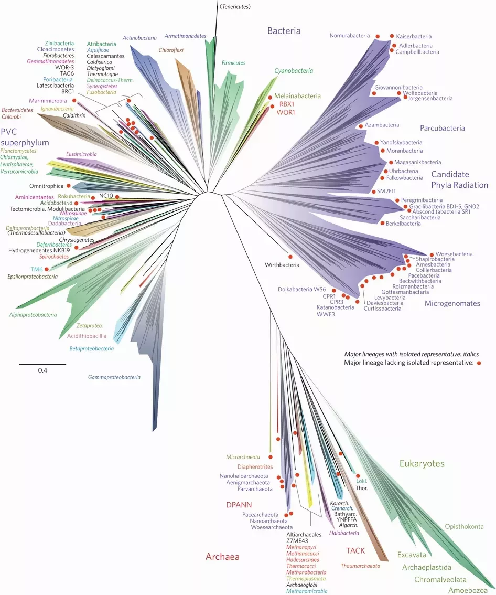
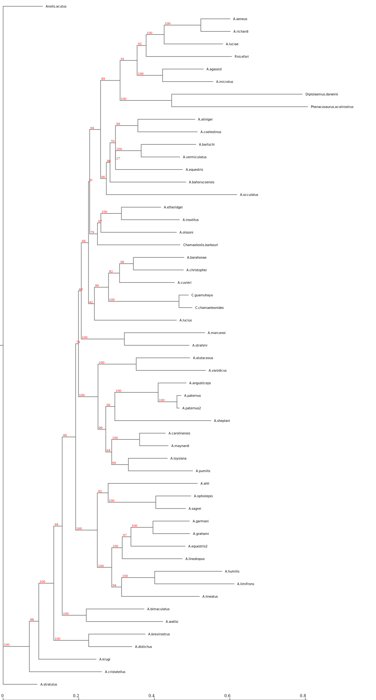

Phylogenetics is essential for comparing biological species and understanding biodiversity for conservation. This tutorial discusses the basic principles and methods of phylogenetic inference and what you can learn from phylogenetic estimation. It is intended to help you make informed decisions about which methods to use in your research.



Using real-life data and standard tools that are (mostly) available in Galaxy, the tutorial demonstrates the principles behind a variety of methods used to estimate phylogenetic trees from aligned sequence data or distance data.

This is not just a "how to" tutorial, but is instead aimed at giving you a better understanding of the principles of phylogenetics and how the methods work. Maybe you've even built phylogenetic trees before but want to know more about the principles behind the tools.

This tutorial does not cover workflows for taking read data to phylogeny or Bayesian methods. We've included recommended reading and tutorials on these topics in the resources section.

We’ve designed this tutorial with flexibility in mind and so that you can focus on the sections that are relevant to you. It includes videos that explore key concepts, written descriptions of each concept, and exercises that demonstrate the methods in action using tools (mostly) available in Galaxy. The exercises are beginner level, but you should know how molecular sequence data is produced and what it looks like. Depending on how you like to learn, you can choose to watch the videos, read the text, work through the exercises, or a combination of the three!

This tutorial is adapted from a 2019 workshop run by the Australian BioCommons and Professor Michael Charleston (University of Tasmania).

> <agenda-title></agenda-title>
>
> In this tutorial we will deal with:
>
> 1. TOC
> {:toc}
>
> **We will not cover:**
>
> * Workflows from read data to sequences
> * How to get an alignment (much: will use automated methods)
> * Bayesian phylogenetics: MCMC / BEAST / MrBayes
{: .agenda}

<!-- Original notes on scope. Now incorporated into the agenda box

## Scope:
We will cover:

* What a phylogeny is
* Motivation:
	* conservation / biodiversity,
	* fundamental knowledge,
	* designing vaccines
* Why it’s hard to find a phylogeny
	* How long it takes
	* We cannot go back and check
	* The role of simulation
	* The plethora of methods (nucleic acid sequence based, morphometric based (body shape)) making it hard to choose
* Data
	* What a sequence alignment is and how to interpret one;
	* What to do with difficult data (lots of gaps in the alignment)
	* The data we will use: an alignment of malaria sequences.
* Three different main approaches:
	* Distance-based
	* Parsimony
	* Likelihood (simple models only)
  * Phylogenetic networks
* Comparing phylogenies --- what to do when they aren't all the same
* Analysing robustness using bootstrapping
* A little on what can possibly (probably) go wrong?
* An overview of a workflow

We will not cover:

* Workflows from read data to sequences
* How to get an alignment (much: will use automated methods)
* Bayesian phylogenetics: MCMC / BEAST / MrBayes


## Overview

This tutorial has the following structure:

- Introduction and motivation: why is phylogenetic inference important?
- A general overview of phylogenetic inference: from sequence data onward.
- Obtaining the data for this tutorial + exercise
- Sequence alignment (including manual methods, automatic methods, complexity issues / heuristics) + exercise
- Distances based on sequence alignment
- The Neighbor-Joining method & Minimum Evolution, using FastTree2
- Building your first tree (on Galaxy)
- Models of sequence evolution: from the sublime to the ridiculous
- Phylogenetic Networks (**on your own computer, using SplitsTree**), Neighbor-Net
- Assessing the quality of the tree(s): Bootstrapping, branch lengths; conflict in the networks
- Maximum Likelihood with IQTree -->

## What is a Phylogeny?
{: width="20%"}

A *phylogenetic tree*, also called a *phylogeny*, is usually a tree-like structure, like [Darwin's famous sketch](#figure-1). The leaves or tips of the tree represent extant (living/existing) taxonomic entities like species, genera, or strains (in general called "taxa"). The lines connecting taxa describe the evolutionary relationships between them.
The intersections of lines correspond to hypothetical ancestral taxa. They represent branching events when species split into two new species, or a strain developed a phylogenetic important offshoot strain, etc.

The phylogeny of a group of taxa is the best representation of their evolutionary relationships.
It is also the main basis on which we can build statistics comparing species: without the phylogeny, comparing species (or strains, genera, etc.) is not meaningful.

As Theodosius Dobzhansky famously wrote, **"Nothing in biology makes sense except in the light of evolution"** .


## Why we need phylogenetics

There are many ways in which we can use phylogenetic analyses, from the most fundamental understanding of the evolutionary relationships that exist between a set of species, as in [Charles Darwin's famous sketch](#figure-1), to families:


and much bigger projects across all of life:

{: width="800"}

<!-- topics/evolution/tutorials/abc_intro_phylo/images/nmicrobiol201648_Fig1_HTML.webp -->

Aside from gaining a fundamental understanding of biology, other reasons for inferring phylogenetic relationships include:

- Designing vaccines, for example for SARS-CoV2 and influenza;
- Measuring phylogenetic diversity for guiding conservation efforts;
- Understanding coevolution; for example, around 70% of emergent human diseases have come from other species;
- Dating major evolutionary events to study the effects of environmental change on different species.

> <comment-title>Gene trees, species trees reconciliation problem</comment-title>
> It's worth noting that getting the phylogeny from a set of genes – what we often call a **gene tree** – might *not* give us the true phylogeny of the species that house those genes, *even if we get everything right!*
>
> This happens because there are other processes that can influence the so-called "gene tree" such as:
> - lateral gene transfer events
> - gene duplication
> - gene loss and incomplete lineage sorting
> - recombination
>
> **The situation where gene trees and species trees differ is often called the "gene tree / species tree reconciliation problem".**
>
> While it is a fascinating topic, it is beyond the scope of this tutorial. Today we will work under the assumption (which is reasonable for the dataset we will use) that the gene tree will reflect the species relationships.
>
{: .comment}

## Terminology
 From the root to the tips, watch the video to explore common features of phylogenetic trees. See how these features relate to evolutionary patterns and how outgroups can be used to find the root or common ancestor of extant species.



Before we start building trees, let's define some terms.

{: width="100%"}


It's common to call **phylogenetic tree** a **phylogeny**.

Mathematically, a **tree** is a kind of **graph**, which has objects called **nodes** or **vertices** (lavender, white, and blue boxes in the figure above), connected in pairs by things called **edges** (green and orange lines in the figure above).

Trees are a natural way to think about phylogenetic relationships. The nodes correspond to **taxa**, and the edges, also called **branches**, show the relationships between them, where taxa could be species, or lineages, genera, populations, or even individuals if we are considering something like a genealogy.

Nodes with only one edge attached to them are called **leaves** (or **tips**; in white above) and correspond to taxa with no descendant taxa in the tree. These taxa might be from fossils, or, be currently living, in which case they’re referred to as **extant**.

Internal nodes (in lavender above) correspond to hypothetical common ancestors of the extant taxa: the set of descendants that each one has determines the tree.

Many phylogenies have a special node assigned as the common ancestor of all the taxa represented by the leaves in the tree. This node is called the **root** (in blue above). When this is the case, a natural direction is implied from the root to the tips, going forward in time. We call such trees and phylogenies **rooted**; if there is no root, they are called **unrooted**.

*The majority of phylogenetic inference methods produce unrooted trees, but rooted trees are more useful.*

In a rooted phylogeny, all the leaves that are descendant from any given node form a **monophyletic clade**, or often just “**clade**” (monophyletic means “one tribe (of) origin” from the Greek).

One way to determine where the root of a tree belongs is to include an **outgroup** in the data, which is a set of taxa that are definitely not within the clade of interest (which is then called our **ingroup**) but which share a common ancestor with that clade. A good outgroup won’t be too distantly related to our ingroup, because if it’s too distant, choosing where it should connect to the ingroup will be hard, ultimately resulting in a guess.

You can see in the diagram above that the connection of the ingroup to the outgroup could be from multiple locations. Once the unrooted tree is created, using combined data from ingroup and outgroup taxa, we can confidently say that the root is on the branch connecting our ingroup to our outgroup:

{: width="100%"}

We can then imagine lifting up the unrooted tree at the branch connecting our outgroup and ingroup -- that is our best guess at the hypothetical ancestor of all our taxa and gives us a good indication of the branching order of our ingroup (and the outgroup):


Phylogeny estimation can be thought of as inferring a collection of compatible hypotheses about **monophyly** -- that is, statements that groups of taxa descendant from a common ancestor are each others' closest relatives in the tree.

The tree above is called a **binary tree**, because each internal node branches into *two* descendants. It is a very common assumption that trees are binary, and we make that assumption in this tutorial. In fact, it is often very hard to come to a means by which a phylogeny could be truly *non*-binary: in most cases, this is just due to our inability to resolve the tree completely.

# Building a tree
## Basic Methodology

So, how do we estimate phylogenetic trees?

We start with the leaves of the tree which can be living (extant) or older taxa:

 are the starting point for buidling phylogenies"){: width="100%"}

There are several ways to estimate a tree, such as:

1. Go with what we think is the case already (this is not recommended!)
2. Attempt to build a tree based on similarity and dissimilarity, with tools such as Neighbor-Joining (NJ) or FastME (we will do this later in the tutorial)
3. Use a score function, such as Parsimony or Maximum Likelihood, to build potential trees and find the best one (we will do this later too)
4. Something else entirely (Perhaps networks or even inferring evolution based on the parasites of your species of interest!).

**Warning**: Finding an optimal tree is *hard*!

First and foremost, **phylogenetic inference is a statistic _estimation_ process.**

Different estimates of the phylogenetic tree relating a given set of species may differ, even if no errors were made.

It is generally not possible to prove that any tree inferred is *correct* -- since we cannot go back in time and observe speciation events.

> <comment-title>Common evolutionary assumptions used in phylogenetic estimation</comment-title>
>
>  We will (mostly) make these assumptions in this tutorial!
>
> 1. Evolution is “memoryless.” This assumption is that the future evolutionary trajectory of an organism is not affected by its past. This means we can use the powerful mathematics of Markov processes.
>
> 2. Phylogenetic relationships can be correctly represented by a tree! This isn't *always* assumed, but it is very common. Trees are a very attractive representation of evolution, and it is part of our language: "The tree of life" is a common phrase.  However evolution is not always explained by a tree-like, "branching" process as other events such as hybridisation and sharing of genetic material can influence envolutionary processes.
> 3. The molecular clock assumption is that sequences in a clade evolve at about the same rate. This is known to be wrong, but is useful. For instance, there is variation in evolutionary rate between lineages, but if this variation is not significant, we can ignore it and use simpler models, to better leverage the phylogenetic information in the data.
> 4. Lineages don’t interact – once they have speciated, they are independent of each other. This isn't always the case and we know that biological lineages *do* interact with each other -- but our methods are generally not able to manage such complexity. The vast majority of methods make this assumption, particularly if the evolution is also assumed to be tree-like.
>
{: .comment}


### Challenges

Phylogenetic Inference is **Hard**.
One of the things that make it hard is the sheer number of possible trees that can describe relationships among species.

The number of rooted binary trees grows as 1, 3, 15, 105, 945, 10395... in fact the formula for this number for $$n$$ taxa (we use `taxa' in general, since not all phylogenetic inference is at the species level) is $$(2n-3)!! = (2n-3)(2n-5)...(3)(1),$$ which grows as fast as $$2^{n}n!$$.

The table below gives you an idea of the scale we are dealing with.

*The Number of Unrooted Binary Trees*

| *n*          | # trees    | notes       |
|--------------|------------|-------------|
| 3    | $$3$$       | trivial to check |
| 4    | $$15$$       | enumerable by hand |
| 5    | $$105$$       | enumerable by hand on a rainy day |
| 6    | $$945$$       | enumerable by hand during lockdown |
| 7    | $$10395$$       | easily searched by computer |
| 8    | $$135135$$       | a bit more than the number of hairs on your head |
| 9    | $$2027025$$       | population of Sydney living west of Paramatta |
| 10   | $$34459425$$                      | comparable with the number of possible tickets in a typical lottery |
| 20   | $$\approx 8.2\times 10^{21}$$       | getting slow for computers even with branch-and-bound |
| 48   | $$\approx 3.21\times 10^{70}$$       | number of particles in the universe-ish |
| 136  | $$\approx 2.11\times 10^{267}$$       | number of trees to choose from in the first "Out of Africa" data set |
|---|---|---|


## Calculating distances

Building a tree begins with a set of *distances*, which record how different the taxa are from each other.
Distances have very desirable properties, that can be summarised as follows: for any objects $$ x $$, $$y$$, $$z$$, writing $$d(x,y)$$ means the distance from $$x$$ to $$y$$ etc.  These properties are:
 * *non-negativity* -- distances can never be negative, and in fact we treat two things as identical if they have a distance of 0 between them.
 * *symmetry* -- the distance from $$x$$ to $$y$$ is the same as the distance from $$y$$ to $$x$$; that is, $$d(x,y) = d(y,x)$$.
 * the *triangle inequality* -- there are no short-cuts!  The distance from $$x$$ to $$z$$ is always *at most* the distance from $$x$$ to $$y$$ plus that from $$y$$ to $$z$$; that is, $$ d(x,y) + d(y,z) \leq d(x,z)$$.

 In phylogenetics terms, we like distances to represent something like time and we can assign lengths to branches (see the [Tree Anatomy diagram](#figure-4) above).

Distances can be calculated based on a variety of data. Here is a flow-chart of the process:

![Flow chart illustrating how sequence alignment data or dis/similarity measures are used to calculate and calculate phylogenetic distances. Colours and shapes are used to differentiate different sections of the flowchart, guiding the viewer through each step from left to right. The flowchart begins with Sequence Alignment or Dis/Similarity Measures. These are used to form a distance matrix (D) which is used to select two nodes (x and y) forming a new node z. The distance matrix is updated with the new node z until no further nodes can be formed.](images/TreeConstruction.drawio.png "Tree construction flow-chart"){:width="100%"}

The blue boxes on the left show some of the input data forms. The most commonly used kind of data in modern phylogenetics is *aligned molecular sequences* -- typically, DNA, RNA, or Amino Acids (AA) from equivalent (homologous) genes in the species of interest. We focus on this form of molecular phylogenetics in this tutorial.

Other input data forms are distances or dissimilarity measures based on molecular-based measures like DNA-DNA hybridisation, gene presence/absence, and morphology (physical dimensions). We will not discuss this kind of data in this tutorial.

Aligned sequences can be converted into distances (green box above), using models for how the sites (i.e. specific nucleotides or amino acids) have evolved.
These distances can be expressed as a matrix _D_, which becomes the input for distance-based methods.

Distance-based methods (orange boxes) use algorithms to select a pair of taxa, or clades, to join together to make a new clade. Once that decision is made, the two taxa / clades that have been joined are replaced with the clade that the two of them make together as seen in the [figure below](#figure-7).

{: width="60%"}


## Let's build our first tree

In this tutorial we will use a set of *Anolis* lizard DNA sequences, from  to trial some phylogenetic methods.
The sequences are from the mitochondrial NADH dehydrogenase subunit 2 gene (ND2) and five transfer RNA (tRNA) genes, with an average sequence length of 1419.109 and a range of [1329,1727].


<!-- I got the sequence lengths from the raw FASTA file using gawk:
gawk 'BEGIN {OFS=","} {print length,$1}' anolis-raw.fst > anolis-sequence-lengths.csv -->
<!-- In fact this is even cleverer:
gawk 'BEGIN {OFS=","} {if (length>100) print length; else print $1}' anolis-raw.fst -->
<!-- The ultimate in collating sequence lengths with the sequence names:
sed -r 'N;s/^(>[A-Za-z2\.]+)\n/\1,/g' anolis-sequence-lengths.txt -->


We are using a relatively small set of sequences to ensure the methods run quickly for the purposes of the tutorial.

In the real world, a phylogenetic analyses often span hundreds, or even thousands, of taxa. Phylogenetic estimation on this many sequences is computationally very intensive, and can take weeks of time even on a high-performance computer.

### Get the data

<!--
* Does it auto-detect ok?
*
 -->
<!-- One sequence is here: https://www.ncbi.nlm.nih.gov/nucleotide/AF055943.2?report=genbank&log$=nuclalign&blast_rank=1&RID=JEX49T9G013 -->

> <hands-on-title>Obtain your data</hands-on-title>
>
> 1. Make sure you have an empty analysis history. Give it a name.
>
>    
>
> 2. Import the file anolis-raw.fst from [Zenodo](https://zenodo.org/records/11089653/files/anolis-raw.fst) or from the shared data library.
>    ```
>    https://zenodo.org/records/11089653/files/anolis-raw.fst
>    ```
>    You may need to refresh your history to show the data.
>    If the paste/fetch link does not work for you, you can download it to your own computer and then upload it using the "Upload" button at the top of the left panel in Galaxy.
>
>    
>
{: .hands_on}

You can click on the 'eye' icon  on the right to see the unaligned data (go ahead!) but the view isn't very informative. This is the raw FASTA file, with the symbols A, C, G, T representing nucleotides. You can see that the sequences are different lengths.

**FASTA** or **Fasta** format (pronounced to rhyme with pasta) format is is commonly used as input to phylogenetic inference programs and has a very simple structure, as follows:

1. Each sequence has a name, which appears on its own line after a '>' sign
2. The next line(s) contain the sequence; continuing either until the next sequence name line, or the end of the file.

The example below has four sequences in it named Taxon_1, Taxon_2, etc, each with a short set of characters representing DNA sequences.


```
>Taxon_1
ACTGCGTTAGGTCTAGCC
>Taxon_2
GATCTACTGCTTTAGGTTGAGCC
>Taxon_3
ACTGCTCTAGCACTGAGCCCA
>Taxon_4
ACTTGGCGTAGCCGGAGGCC
```


<!-- A line beginning with the greater-than sign `>` holds the sequence name or identifier/ID; the other lines hold the sequence data for the sequence ID above. -->

> <tip-title>FASTA format for multiple sequence alignments</tip-title>
>
>The Fasta format can also include symbols such as a question mark '?' for missing data, or hyphen '-' to indicate an insertion or deletion events, collectively *indels*. It is common to represent a multiple sequence alignment in Fasta format with these symbols. It is also a common format for storing high-throughput read data, but *without quality scores* -- if you want to include read quality you would use FASTQ format.
{: .tip}

> <hands-on-title>View your data</hands-on-title>
> Let's view the unaligned sequence in a more understandable form.
>
> 1. Click on the title of your file to see the row of small icons for saving, linking etc:
> 
>
> 2. Click on the **visualise icon**  and then select the **Multiple Sequence Alignment tool**.
> You should see something like this:
>
> {:width="600"}
>
> Play around with the view. You can change colour schemes and add or remove various elements.  Good colour schemes for nucleotide data are "Clustal2" and "nucleotide".
>
> If you cannot see the slider at the top (for moving left or right in the view) you will need to check the "Show residues indices" in the "Vis. elements" drop-down menu.
>
> Do not adjust the scale slider!  Currently, this breaks the page.
{: .hands_on}

> <question-title>Understanding the FASTA file</question-title>
> 1. How many sequences are there in your data?
> 2. How long is the longest sequence, and what is it?
> 3. What about the shortest sequence?
>
> > <solution-title></solution-title>
> > There are 55 sequences.  The longest is from <i>Anolis paternus</i> with length 1729 nucleotides; the shortest is <i>A. luciae</i> with length 1252.
> {: .solution}
{: .question}

# Sequence Alignment

 Watch the video to find out
[0:00] What ‘alignment’ really means and why it is useful for phylogenetics; [6:22] What makes a good alignment; [12:15] How pairwise sequence alignment and dynamic programming work; [33:47] How the multiple sequence alignment algorithms work; and to
[40:00] explore multiple sequence alignment of the Anolis sequences with SeaView.




Molecular sequences must be aligned before they can be used to build phylogenies.

Aligning sequences amounts to finding the nucleotide positions (sites) that we can be confident have the same evolutionary history: they correspond to each other across species and can be considered to have evolved from the same common ancestor.
A good clue to identify these sites, which are called <em>homologous</em>, is that they are well conserved, with only a few changes.

Below is an example of an alignment. On the left are the sequences in Fasta format.
In the middle we see an alignment of those sequences, which has gaps in it that help line up the sites so that more of them agree.
A sign of a "good" alignment is one in which the colours line up vertically. The overhanging parts can be removed as seen in the "trimmed version" on the right.

![Table containing DNA sequence from four taxa arranged in rows. Three columns show the sequences in ‘Unaligned’, ‘Aligned’ and ‘Trimmed’ states. The nucletodies are colour coded A (green), T (pink), C (blue) and G (orange). In the “Unaligned” column, the sequences are continuous. In the ‘Aligned’ column gaps are introduced and represented as dashes so that the sequences align vertically. In the “Trimmed” column overhanging portions of the sequences are greyed out to indicate that they would be trimmed.](./images/ToyAlignmentAndTrim.png "Sequence alignment"){:width="700"}

While aligning *two* sequences is "easy", in the sense that an optimal alignment between two sequences can be found in a reasonable amount of time, optimally aligning multiple sequences is *computationally intractable*. Multiple sequence alignment is a complex process and many methods have been developed to tackle this challenge.

## Aligning sequences with MAFFT

Today you will be aligning sequences using a modern multiple alignment program called **MAFFT**, which is available on Galaxy.

<!-- ## Question: is there a format convention for program names, like Courier Bold or something? -->


> <hands-on-title>Sequence alignment with MAFFT</hands-on-title>
>
> 1. In Galaxy, search for and select the  from the tool finder on the left, and run it with the following parameters:
>    -  In the MAFFT tool, the **Sequences to align** field should already be filled with your unaligned data. If it isn't, select it using the drop-down menu.
>    - In the **Data type** field select "_Auto detection_".
>    - Leave the **MAFFT flavour** as "_fftns_". This is a good default.
>    - In the **Matrix selection** select "_No matrix_".
> 2. Click "**Run tool**".
{: .hands_on}

Here is a visualisation of the resulting alignment. Note that the colours are now vertically aligned:

{:width="600px"}

> <hands-on-title>Inspecting your alignment</hands-on-title>
>
> 1. Click on the title of the completed MAFFT job to show the row of small icons for saving, linking etc.
> {:align="center"}
> 2. Click on the **visualise icon** 
> 3. You will be presented with a couple of options. Select "**Multiple Sequence Alignment**".
> *Your alignment is displayed!*
> The colour scheme is horrible to start with because it's not automatically detecting the data as DNA sequences.  Click on the "Color scheme" button and select "**Clustal2**" for a nicer picture.
> 4. You can click and drag the display of nucleotides in the upper panel, and when you go far enough to the right you'll see some gaps have been introduced by MAFFT.  On either side of each gap you should see that the nucleotides match up pretty well.  This is because the MAFFT algorithm has identified that these site are homologous, and that either an insertion event has happened for a group of sequences, or a deletion happened in the others.
> 5. You may be tempted to play around with "Vis. elements" and show the scale slider - don't! It's currently broken and will crash your browser tab :(.
{: .hands_on}

You should ALWAYS visually check your alignment to see if it makes sense.
A tool you can use on your own computer is [SeaView](https://doua.prabi.fr/software/seaview).


# Distance-based phylogenetic inference
 Watch the video to delve into the mathematics of building phylogenetic trees from distances. [0:00] Why use distances and how they relate to the structure of a phylogenetic tree
[3:05] Types of distances and distance matrices
[11:31] The mathematics behind the Jukes-Cantor/JC69 and HKY85 models [16:04] An example of building a tree from ultrametric distances [21:01] Building a tree from non-clocklike distances with the Neighbour-joining method [25:59] Real life data and limitations for building trees from distances.



We are going to build our first tree, using a very common method called _Neighbor-Joining_. This method was created in the 1980s by Saitou & Nei ().

<!-- (Saitou, N. & Nei, M. _The Neighbor-Joining method: a new method for reconstructing phylogenetic trees_. 1987, *Molecular Biology and Evolution*  , Vol. **4**(4):406-425); see also Studier, J. A. & Keppler, K. J., _A Note on the Neighbor-Joining Algorithm of Saitou and Nei_, 1988. *Molecular Biology and Evolution* **5**(6): 729-731) -->

## Building a Neighbor-Joining Tree

The Neighbor-Joining (NJ) algorithm is a standard method that takes a set of distances between taxa as input, and sequentially connects them into larger and larger clusters until all taxa have been joined.

NJ is rarely used as a complete tool for phylogenetic analysis. Although it is quite accurate and fast, there are other fast methods that can be then applied to modify the NJ tree and create a better one.

The FastTree2 program that we are using does this. First it creates a "rough" NJ tree, and then modifies it to optimise a quantity called *Minimum Evolution* (ME) (more on this later).  A detailed description of how FastTree works is available from [Microbes online](http://www.microbesonline.org/fasttree/).

> <hands-on-title>Build a Neighbour-Joining Tree with FastTree</hands-on-title>
>
> 1. Search for the  in the tool finder on the left, and run it with the following parameters:
>
>    - *"Aligned sequences file (FASTA or Phylip format)"*: `fasta`
>        -  *"FASTA file"*: `outputAlignment` (output of **MAFFT** )
>    - *"Protein or nucleotide alignment"*: `Nucleotide`
>        - *"Nucleotide evolution model"*: `Jukes-Cantor + CAT`
>    - *"Show advanced options"*: `Yes`
>        - *"Use constant rates?"*: `Use constant rates.`
>        - *"Turn off maximum-likelihood."*: `Yes`
>
> 2. Click on "Run tool".
>
{: .hands_on}

<!--
> Removed and linked to the source instead
>**Heuristic Neighbor-Joining**
>
>First, FastTree uses a heuristic variant of neighbor joining to get a rough topology. During neighbor joining, FastTree stores profiles of internal nodes instead of a distance matrix, which reduces the memory required. FastTree uses a combination of three heuristics to speed up this phase: it remembers the best join for each node, as in fast neighbor-joining; it does a hill-climbing search for better joins from a candidate join, as in relaxed neighbor joining; and it uses the "top hits" heuristic to avoid computing all pairwise distances and to avoid considering all possible joins at every step. It also updates the best join for a node as it comes across them, which reduces the amount of hill-climbing. Another limitation of FastTree's neighbor-joining phase is that it does not correct the distances for multiple substitutions, which exacerbates long-branch attraction. However, this will be corrected in the next stage.
>
>**Minimum Evolution**
>
>FastTree then tries to reduce the length of the tree, using a mix of nearest-neighbor interchanges (NNIs) and subtree-prune-regraft moves (SPRs). These "balanced minimum-evolution" rearrangements are roughly the same as what FastME does, but because FastTree uses profiles instead of distances, it is much faster. By default, FastTree uses 4*log<sub>2</sub>(N) rounds of nearest-neighbor interchanges and 2 rounds of subtree-prune-regraft moves. In each round, it considers every possible NNI in the tree. Because there are too many (O(N<sup>2</sup>)) possible SPR moves, FastTree treats SPR moves as chains of NNIs and only extends the best choice in the chain for chains of length two or greater. In the minimum-evolution framework, if the distances are not too noisy, NNI and SPR moves suffice to reach optimal trees (Desper & Gascuel 2004, Bordewich et al. 2009).
>
>Distances: During these minimum evolution steps, FastTree needs to estimate distances between sequences or profiles. For protein sequences, FastTree estimates distances by using the BLOSUM45 amino acid similarity matrix, and it corrects for multiple substitutions by using the formula $-1.3 \times \log(1-d)$, where $d$ is weighted so that random sequences have an average value of 1. For nucleotide sequences, FastTree uses the Jukes-Cantor distance $-0.75\times\log(1 - \frac{4}{3} d)$, where $d$ is the proportion of positions that differ. When comparing two sequences, positions with gaps are ignored; when comparing two profiles, positions are weighted by their proportions of non-gaps.
>
{: .comment} -->


It won't take very long for FastTree to build your tree.
But when it's done, how can you see it?

Clicking on the 'eye' icon   of the output doesn't at first appear to be very illuminating: it's just a parenthesised list of taxon names and numbers.
This is **Newick Format**, and it's worth knowing at least a little of what it means.

* Each matched pair of parentheses denotes a **cluster** or **subtree**: "(A,B)" means that A and B are each others' closest relatives (also called _sister taxa_).
* A number after a cluster (so, after a closing parenthesis) is a **label** for that cluster.  In the output from FastTree, this label is an indicator of the support for that branch.
* If there is a colon ':' followed by a number, then this is the **branch length** for the subtree.


The rooted, 3-taxon trees above have three taxa, labelled A, B and C.  Two of the internal nodes have been labelled (x and y), but it isn't necessary to do so in general (for example, if you wanted to use the label for something like support of each branch, as does FastTree).

In both trees, A and B are sister taxa, and branch lengths are indicated near each branch: you can see how the branch lengths are above each cluster, including the individual taxa (the "leaves" of the tree), but not above the root.

The Newick format for the tree on the left is "((A:3, B:2)x:2, C:6)y;" and for the one on the right it is "((A:3, B:2)x:3, C:5)y;". The number after each colon is the length of the branch above it (closer to the root).

Note that these two trees are very similar: they only differ in the position of the root (y), either being distance 2 from node x, or being 3 from it.  The distance between any two nodes in the tree is the sum of the branch lengths on the path connecting them, so for the trees above, the distance matrix is

|     |  A   |   B  |  C   |
| --- | :--: | :--: | :--: |
|  A  |  0   |  5   |  11  |
|  B  |  5   |  0   |  10  |
|  C  |  11  |  10  |   0  |

Ideally, these will reflect the actual input distances, but such distances are based on messy real data, and do not necessarily obey this ideal.
That is why methods like FastTree are employed to find a tree with the best possible agreement between the distance inferred, and that calculated from sequence data.

> <hands-on-title>Visualising a tree</hands-on-title>
> To visualise your tree in Galaxy:
> 1. Search for the  in the tool finder on the left, and run it with the following parameters:
>
>    - *"Newick file"*: : `tree.nhx` (output of **FastTree** )
>    - *"Branch support"*: `Display branch support`
>    - *"Branch length"*: `Display branch length`
>    - *"Choose an ouput format"*: `PNG`
> 2. Click on the **display icon**  next to the title of the completed Newick Display job to display your tree.
>
> <!--1. Click on the title of the completed FastTree job to show the row of small icons for saving, linking etc.
> 
>
> 2. Click on the **Visualisation icon** 
> 3. You will be presented with a couple of options. Select **"Phylogenetic Tree Visualisation"** -- this seems to be the best one.
>
>    *Your tree is displayed!*
>
>    <!-- [SelectTreeVisualisation](./images/PhylogeneticTreeVisualisationOptions.png){:width="400"} -->
>
> <!--5. Open the settings panel via the **Visualisation Settings**  at the top right of the central panel. Click on these to reveal the settings and display options. Try out "Circular" and "Radial". -->
>   Notice that there are quite a lot of long branches adjacent to the extant taxa (leaves) and that these branches are much shorter near the centre of the tree.
> Note: **Short branches are much harder to get right.**
>
> Additional visualisation options
> 1. To build a radial tree, rerun Newick Display and choose the *"Draw a radial tree"*: `Yes` option.
> 2. Alternatively you can visualise your tree outside of Galaxy by downloading your FastTree output and using software such as [SplitsTree](https://software-ab.cs.uni-tuebingen.de/download/splitstree4/welcome.html) or [FigTree](http://tree.bio.ed.ac.uk/software/Figtree/). These tools provide additional options for interactively exploring and customising the appearance of your tree.
>
>(If you wish you may of course re-run FastTree and allow it to seek a Maximum Likelihood tree -- maybe once you've learned more about Maximum Likelihood.)
>
>
{: .hands_on}


# Searching for the "best" tree

The other way we can estimate a phylogeny is by choosing some kind of score of "goodness" and then searching the entire set of possible trees for the tree (or trees) that optimises this score.
Note that such scores are "surrogates for truth" in that we *hope* the optimal score will correspond to the true tree, but it is not necessarily the case. In many analyses we therefore use *multiple* methods, in the hope that they will give us the same answer. Minimum Evolution (ME), Maximum Parsimony (MP), and Maximum Likelihood (ML) are common such score functions.

> <comment-title>Data vs Method</comment-title>
> If your conclusion changes based on your reasonable choice of analytical method, then perhaps your data are not adequate.
{: .comment}


## Minimum Evolution (ME)

Minimum Evolution is the idea that the sum of the branch lengths should be as small as possible to still account for the distances between the leaves of the tree, in that the sum of squared differences between the distances implied by the tree and the observed distances from the data, is minimised.  You can read more about this in an article by [Rzhetsky and Nei](https://academic.oup.com/mbe/article/10/5/1073/1037508).

There are some variations on this ME criterion and FastTree uses an approximation of one of them to find good trees.

## Maximum Parsimony (MP) and Parsimony Length

Most tree estimation methods output trees with branch lengths that correspond to the amount of evolutionary "work" that has to be done to turn one sequence into another.

This can be given as the *minimum number of character state changes required* -- the so-called *parsimony length* -- to convert the (hypothetical) sequence at one end of a branch to that at the other end.
The Maximum Parsimony method is based on this approach.

<!--The parsimony length of a given site pattern in an alignment, given a particular tree, is the minimum number of changes of state that are required to account for the observed characters (e.g. nucleotides) at the leaves of that tree.-->
Finding the parsimony length of a site pattern is easy and fast due to a clever algorithm created by Walter Fitch; hence, finding the score (the "goodness") of a tree is fast. But finding the tree that minimises this score is still computationally intractable, because the space of trees is so huge.

The Maximum Parsimony method for finding the "best" tree is to search tree space for the tree (or trees) that *minimises* the parsimony length of any tree for that alignment. Note that when parsimony is *maximised*, this means the fewest possible changes required, so the *minimum* length.

We do not use the Maximum Parsimony method in this tutorial.

## Maximum Likelihood (ML)
 Watch the video to learn about [0:00] the concept of likelihood and how it lends statistic rigour to phylogenetic analysis as well as [26:45] how it is applied in models like Jukes-Cantor, HKY85 and GTR models to select the “best tree” from your data. [34:16] Wander through tree space to find the best tree using Nearest Neighbour Interchange, Subtree Pruning and Regrafting, and Tree Bisection and Reconnection tree perturbations and [45:40] go “hill climbing” with tree-search algorithms. [48:52] Finally, explore the output of IQTree for the Anolis dataset used in the tutorial.



Likelihood is the most statistically defensible phylogenetic inference method.
It is based on the idea that the tree that has the highest probability of producing the sequences at the tips of the tree is the tree that is the "most likely" to be correct: this is called the Maximum Likelihood (ML) Tree.

Likelihood is *not* the same as probability, though they are often confused with each other. However, it is *proportional* to the probability that the tree is correct, out of the set of possible trees and models you are considering.

One major, almost ubiquitous, assumption about molecular sequence data is that each site evolves independently of all other sites. Biologically, this isn't always the case, but in practice, this makes things much more tractable, and we still have a good chance of getting the tree(s) right.

Another assumption we make is that the substitution rate -- the rate at which changes of nucleotide at a given position in the sequence happen -- is only dependent on the current state, i.e., we do not care about how a sequence came to be what it is, only what the sequence is now, to determine what are the probable evolutions of it.
This seems much more biologically reasonable and makes this into a Markov process, which in turn enables a lot of calculations to be made simply.

### Searching for trees and their branch lengths

When dealing with nucleotides A, C, G, T, there are 4x4 rate matrices with different names: Jukes-Cantor (JC69) with one parameter, Hasegawa-Kishino-Yano (HKY85) with five parameters, and many more, that define the rates at which nucleotides change.
There are other 20x20 matrices for amino acids, and even 64x64 matrices for codons.

To convert from a rate to a probability, hence giving us a likelihood, requires that we have a branch length. Then, we can calculate the probability under a given model, and after a specific time interval, of going from one nucleotide to another. We multiply these site probabilities to calculate the probability of going from an entire sequence to another.
Thus, looking for the optimal tree under likelihood requires we also search for the best-fit **branch lengths**, as well as looking for the best **tree**.

Maximum Likelihood is therefore the **slowest** tree inference method we discuss in this tutorial.

### Models of sequence evolution

*If you are in a hurry to do the phylogenetic analysis you can skip this section and go to the next [Hands-on: running IQ Tree](#estimating-a-maximum-likelihood-tree-with-iqtree).*


> <details-title>Likelihood models</details-title>
> Likelihood is based on probability, so requires we choose a probabilistic model for the evolution of sequences.
> The simplest model for DNA is that each nucleotide has the same rate of change, and that all nucleotides appear with equal frequency (called the base frequencies) of 25%, 25%, 25%, 25%. This is the Jukes-Cantor (JC69) model published in 1969, and this model has just one parameter.
>
> More biological realism allows for different nucleotide proportions outside the uniform 25% rate. This is the Felsenstein 1981 model, known as F81, and it has three more parameters for the rates (not four: given the first three base frequencies, this defines the other one).
>
> A next level of sophistication is the Hasegawa-Kishino-Yano model (HKY85) published in 1985, which acknowledges that transitions (changes of state within the purines A, G or within the pyrimidines C, T) occur more readily than transversions (changes from purine to pyrimidine or vice versa).
> Hence the HKY85 model has an additional parameter of these different types of subtitution: it can be represented by the substitution rate matrix below:<!-- {: width="300px"}-->\
> \
> $$
> Q_{HKY} = \left[\begin{array}{c@{ }c@{ }c@{ }c}
> \ * & \kappa\pi_{G} & \pi_{C} & \pi_{T} \\
> \kappa\pi_{A} & * & \pi_{C} & \pi_{T} \\
> \pi_{A} & \pi_{G} & * & \kappa\pi_{T} \\
> \pi_{A} & \pi_{G} & \kappa\pi_{C} & * \\
> \end{array}\right] $$
>
> \
> In the above, the $$\pi$$ symbol is used for the base frequencies, and a $$\kappa$$ symbol is used for the transition/transversion ratio parameter.  The asterisk "*" is a short-hand to mean "the sum of everything else in the row."
>
> A more general model still is the *General Time-Reversible* model (GTR), in which each substitution type has its own rate.  It still keeps the property that a substitution from $$x$$ to $$y$$ has the same probability as one from $$y$$ to $$x$$ (this comes from the "reversible" property) but otherwise all rates are independent of each other:<!-- {: width="300px"}-->\
> \
> $$
> Q_{GTR} = \left[\begin{array}{c@{ }c@{ }c@{ }c}
> \ * & \alpha\pi_{G} & \beta\pi_{C} & \gamma\pi_{T} \\
> \alpha\pi_{A} & * & \delta\pi_{C} & \epsilon\pi_{T} \\
> \beta\pi_{A} & \delta\pi_{G} & * & \eta\pi_{T} \\
> \gamma\pi_{A} & \epsilon\pi_{G} & \eta\pi_{C} & * \\
> \end{array}\right]
> $$
>
> \
> A further level of sophistication is the recognition that some sites may be constrained from changing at all. For example, there may be some that have a critical role in fixing the correct amino acid for a protein to function. This addition to the above methods is known as "invariable" sites and is usually represented by a "+I" appended to the model name.
>
> The last level of sophistication is that some sites may evolve faster than others, even if they are under the same kind of model with the same parameters in the matrix $$Q$$.
> The most common way to allow for this is to imagine that the relative rate for a particular site is drawn from a Gamma $$\Gamma$$ probability distribution, which has some nice properties like allowing most sites to change very slowly and permitting some to change rapidly.
> This is usually denoted by a "+$$\Gamma$$" or "+G" appended to the model name.
>
> There are **many** more models, with many more parameters and constraints.  Finding the best one to fit a data set is a complex task!
>
> Fortunately there are tools that help determine the most appropriate model for a given data set, such as the Akaike Information Criterion (AIC) and some variations of that.
>
> The program IQTree, which we use later, performs a step to determine which model is most appropriate for your data set, based on AIC and other schemes to avoid over-fitting while still having as good a fit to your data as possible.
> In that step, trees, and their likelihoods based on your data, are estimated for many different models. Each yields a likelihood score but rather than simply take the model that maximises the likelihood, over-complex models are penalised, to avoid over-fitting. One such penalty function is the AIC; there are others.
>
> There are whole books describing this process, and it's clearly well beyond the scope of this tutorial to go into such depth, but now you should have some appreciation of what is going on behind the scenes when an Maximum Likelihood method is looking for the best model for your data.
>
{: .details}


# Assessing the Quality of trees

A tree-building method will, of course, build you a tree.

But what if your data are not even *from* a tree?  Or, what if the data are from sequences that are so distantly related that they are virtually independent of each other and are essentially random?

It is important that, once you have estimated a tree, you assess how reliable it is.

Remember that a phylogeny is a *collection of hypotheses of relatedness*. Each branch separates some of the taxa from the others, and if the branch is above a subtree it corresponds to a hypothesis that the taxa in that subtree are *monophyletic* with respect to the other taxa in the rest of the tree (as shown in [Figure 1](#figure-1).).

This means that it is meaningful to assess the reliability of *branches* of your tree, in addition to just assessing it overall.


## Resolution

A good phylogenetic tree is one that is *well resolved* -- that is, every time a lineage branches, it forms two new branches.
Equivalently, every internal node has three edges touching it.

An unresolved node *may* be a true representation of the branching pattern of a group of lineages. For example, this is generally the case for very rapid diversification, such as during an island radiation (species arrives in new place with lots of niches; diversifies incredibly quickly).

In phylogenetics unresolved nodes are more often due to a lack of resolving power in the data, so the phylogenetic method cannot choose the branch ordering:

{: width="400px"}

If there are many unresolved branches in the phylogeny, this is an indication that there is not enough information in your data: you'll need to obtain more.

## Bootstrapping

A very common (and useful) method for dealing with unresolved branches is called *bootstrapping*, which is a technique that has a solid basis in statistics (not just phylogenetics). The idea is that one resamples with a replacement data set to create a "pseudoreplicate" that is analysed in the same way as the original data. This process is then repeated many times to create a distribution. Bootstrapping is known to be a is a good way to measure the internal consistency of a data set, and its use in phylogenetics is well established.

The naive method for bootstrapping is called "non-parametric" and works by effectively resampling the patterns at each site in the alignment, creating a pseudo-alignment of the same total number of sites, then re-building the tree.

IQTree has a very - *ultra* - fast bootstrapping method that is cleverer and works a bit better than the naive method. When we use IQTree in the next part of the tutorial, we will also do bootstrapping on the tree.  See  for details on the method.

Bootstrapping can be done on any inference method. We will use the likelihood method that searches for the tree and branch lengths that maximises the likelihood for (1) our actual data, and then (2) for each of the pseudoreplicates, noting for each of these which branches occur in the best trees found.

By keeping track of which branches occur in the best trees found for each of the pseudoreplicates, we can note how often the branches in the best tree for our *actual* data occur in the resampled data.  If they occur a lot -- say, 80% of the time or more -- then we can be fairly sure that that branch is well supported by the data.

Bootstrap values therefore appear for each branch, and are most often expressed as a percentage or proportion. Branches at the leaves that occur in every possible tree so these would get 100% bootstrap values every time, and don't tell us anything.

(Note: FastTree does not do bootstrapping natively, but can in conjuction with other tools ([see details](http://meta.microbesonline.org/fasttree/ )). It's fiddly to do this so we will not try it in this tutorial.)

## Estimating a Maximum Likelihood tree with IQTree

IQTree is a state-of-the-art cross-platform program that uses maximum likelihood to find optimal phylogenetic trees.
It can perform model selection and bootstrapping.
And it's on Galaxy!

While this is running you might use your time to read the [Models of sequence evolution](#models-of-sequence-evolution) and [Bootstrapping](#bootstrapping) sections above.

> <hands-on-title>Estimating a Maximum Likelihood tree with IQTree</hands-on-title>
>
> 1. Find the  program in the tool finder, and run it with the following parameters:
>
>    - In *"General options"*:
>        -  *"Specify input alignment file in PHYLIP, FASTA, NEXUS, CLUSTAL or MSF format."*: your aligned sequence data (output of **MAFFT** )
>        - *"Specify sequence type as either of DNA, AA, BIN, MORPH, CODON or NT2AA for DNA, amino-acid, binary, morphological, codon or DNA-to-AA-translated sequences"*: `DNA`
>    - In *"Modelling Parameters"*:
>        - In *"Rate heterogeneity"*:
>            - *"Write maximum likelihood site ratios to .mlrate file"*: Yes
>    - In *"Bootstrap Parameters"*:
>        - In *"Ultrafast bootstrap parameters"*:
>            - *"Specify number of bootstrap replicates (>=1000)."*: `1000`
>
>    <!-- > 4. Ignore the Time Tree Reconstruction settings and Likelihood Mapping analysis settings. -->
>    <!-- > 8. Open the *Nonparametric bootstrapping* Leave all the Tree Parameters as they are. (Have a look at them and see if you can work out what they do). -->
>    <!-- > 9. For **Bootstrap Parameters** select "Ultrafast bootstrap parameters" and enter "1000" bootstrap replicates. -->
> 7. Click "Run tool".
> 8. To visualise your tree in Galaxy, search for the  in the tool finder on the left, and run it with the following parameters:
>
>    - *"Newick file"*: : `MaxLikelihoodTree` (output of **IQTree** )
>    - *"Branch support"*: `Display branch support`
>    - *"Choose an ouput format"*: `PNG`
> 9. Click on the **display icon**  next to the title of the completed Newick Display job to display your tree.
>
>	Alternatively you can visualise your tree outside of Galaxy by downloading your IQTree output and using software such as [SplitsTree](https://software-ab.cs.uni-tuebingen.de/download/splitstree4/welcome.html) or [FigTree](http://tree.bio.ed.ac.uk/software/Figtree/). These tools provide additional options for interactively exploring and customising the appearance of your tree.
><!-- 8. Click on the output of IQ-Tree and select the visualisation icon. Select 'Phyloviz' to view your tree. -->
><!-- -->
> 
>
>Observe that the bootstrap values (in red) in the IQTree output for deep branches are not as high.
>
>Note that bootstrap values for UFBoot (provided by IQTree) are actual estimates of the probability that the branch is correct, so are not quite the same as traditional "naive" bootstrap values.
{: .hands_on}

With the visualisation open answer the following questions:
> <question-title>How well supported is your tree?</question-title>
> 1. What are the bootstrap values near the root of the tree? Do you think those branches are well supported?
> 2. Which do you think is the biggest well-supported clade?
> 2. Are there some nodes that would be better left unresolved?
> 3. Is your tree "probably right"? -- or 80% right?
>
> > <solution-title></solution-title>
> > Near the base of the tree the bootstrap values are high: mostly around 100%.  These appear to be well supported. Since they're near the root, there are some very large well-supported clades, e.g., all the way from _A. disticus_ near the top, down to _A. lineatus_ near the bottom.  There are a number of poorly supported clades _within_ this clade though, with some low bootstrap values; the smallest of these is just 29% for the clade from _C. barbouri_ to _Diplolaemus darwinii_.
> > Overall the tree looks well supported, but it's probably wrong _somewhere_. It would be worth seeking more data, molecular or morphological, to resolve those poorly supported clades.
> >
> {: .solution}
{: .question}


### Report on the final tree

Look at the IQTree Report file.

In that you will see a *long* list of models that have been tested, with the favoured one at the top.

You will also see the Newick Format of the best tree found.  When I ran it, the best model was "GTR+F+R6", which means the General Time-Reversible

> <question-title>Understanding the IQ-Tree report</question-title>
> 1. What is the second-most favoured model?
> 2. How many relative rates of evolution have been estimated, and what are these rates?
>
> > <solution-title></solution-title>
> > 1. The second-best supported model is GTR + F + R7: it's almost identical to the first model, but with one more rate category.
> > 2. There are 6 relative rates, in the table with columns Category, Relative_rate and Proportion: the rates are 0.01936 (very slow), 0.1952, 0.6315, 1.365, 2.662, and the fastest, 7.146.  Very few sites are estimated to be in this category - about 2.3% - whereas about 27% of the sites are deemed to be in the slowest category.
> {: .solution}
{: .question}

> <details-title>Guide to the report</details-title>
> The report below shows a long list of models that have been tested, and these are sorted by their AIC score.
> The columns comprise the name of the model, the log-likelihood (that is, the log of the likelihood), of the best-fit tree using that model, then six more columns that are the penalised according to the number of parameters each model has, and an overall weighting of the posterior probability of each model.  In the table below, the GTR+F+R6 model has approximately 81.7% of the probability mass based on AIC, but in terms of BIC, it is about 2.37% (guide at the bottom of the table).
>
> It next shows details of the model selected, with relative rate parameters for the various substitutions (A-C is from A to C, etc.); estimated nucleotide frequencies, and then the rate categories.
> In this analysis the best-fit model is GTR+F+R6:
> "Model of rate heterogeneity: FreeRate with 6 categories"
> ... which allows for six categories of relative rates, and shows the proportion of sites estimated to be in each category.
>
> The last thing in the report is the tree!  First in the nostalgic ASCII-format "drawing," and then the same tree in Newick format.
>
> <pre>
> IQ-TREE 2.1.2 COVID-edition built Mar 30 2021
>
> Input file name: /mnt/pulsar/files/staging/7756321/inputs/dataset_6092bb0e-7934-473c-8e8f-77054b0192c5.dat
> Type of analysis: ModelFinder + tree reconstruction
> Random seed number: 204403
>
> REFERENCES
> ----------
>
> To cite IQ-TREE please use:
>
> Bui Quang Minh, Heiko A. Schmidt, Olga Chernomor, Dominik Schrempf,
> Michael D. Woodhams, Arndt von Haeseler, and Robert Lanfear (2020)
> IQ-TREE 2: New models and efficient methods for phylogenetic inference
> in the genomic era. Mol. Biol. Evol., in press.
> https://doi.org/10.1093/molbev/msaa015
>
> To cite ModelFinder please use:
>
> Subha Kalyaanamoorthy, Bui Quang Minh, Thomas KF Wong, Arndt von Haeseler,
> and Lars S Jermiin (2017) ModelFinder: Fast model selection for
> accurate phylogenetic estimates. Nature Methods, 14:587–589.
> https://doi.org/10.1038/nmeth.4285
>
> SEQUENCE ALIGNMENT
> ------------------
>
> Input data: 55 sequences with 1462 nucleotide sites
> Number of constant sites: 377 (= 25.7866% of all sites)
> Number of invariant (constant or ambiguous constant) sites: 377 (= 25.7866% of all sites)
> Number of parsimony informative sites: 913
> Number of distinct site patterns: 1138
>
> ModelFinder
> -----------
>
> Best-fit model according to AIC: GTR+F+R6
>
> List of models sorted by AIC scores:
>
> Model                  LogL         AIC      w-AIC        AICc     w-AICc         BIC      w-BIC
> GTR+F+R6         -37031.233   74312.465 +    0.817   74336.043 +    0.832   74973.410 -   0.0237
> GTR+F+R7         -37031.088   74316.176 +    0.128   74340.548 +   0.0875   74987.696 - 1.88e-05
> TIM2+F+R6        -37036.403   74318.806 -   0.0343   74341.604 +   0.0516   74969.176 +    0.197
> GTR+F+R5         -37037.210   74320.421 -   0.0153   74343.219 -    0.023   74970.791 +    0.088
> TIM2+F+R7        -37036.374   74322.749 -  0.00478   74346.327 -  0.00486   74983.694 - 0.000139
> TIM2+F+R5        -37042.437   74326.875 - 0.000607   74348.907 -  0.00134   74966.669 +    0.691
> TIM3+F+R6        -37070.405   74386.811 - 5.87e-17   74409.609 - 8.82e-17   75037.180 - 3.37e-16
> TIM3+F+R7        -37070.201   74390.401 - 9.74e-18   74413.979 - 9.92e-18   75051.346 - 2.83e-19
> GTR+F+R4         -37074.898   74391.795 - 4.85e-18   74413.828 - 1.07e-17   75031.590 - 5.52e-15
> TN+F+R6          -37075.376   74394.752 - 1.11e-18   74417.166 - 2.02e-18   75039.835 - 8.95e-17
> TIM+F+R6         -37074.693   74395.386 - 8.06e-19   74418.184 - 1.21e-18   75045.756 - 4.63e-18
> TIM3+F+R5        -37076.845   74395.690 - 6.92e-19   74417.723 - 1.53e-18   75035.485 - 7.88e-16
> TN+F+R7          -37075.196   74398.393 - 1.79e-19   74421.579 - 2.22e-19   75054.050 - 7.33e-20
> TIM+F+R7         -37074.525   74399.049 - 1.29e-19   74422.627 - 1.31e-19   75059.994 - 3.75e-21
> TN+F+R5          -37081.842   74403.685 - 1.27e-20   74425.340 - 3.38e-20   75038.192 - 2.03e-16
> TIM+F+R5         -37081.073   74404.146 - 1.01e-20   74426.179 - 2.22e-20   75043.941 - 1.15e-17
> GTR+F+I+G4       -37096.959   74427.917 - 6.95e-26   74448.462 - 3.23e-25   75046.562 -  3.1e-18
> TVM+F+R6         -37095.385   74438.769 - 3.06e-28   74461.955 - 3.79e-28   75094.427 - 1.25e-28
> TVM+F+R5         -37097.648   74439.297 - 2.35e-28   74461.711 - 4.28e-28   75084.379 -  1.9e-26
> TVM+F+R7         -37095.426   74442.853 - 3.97e-29   74466.826 - 3.32e-29   75109.085 - 8.21e-32
> TPM2+F+R6        -37100.987   74445.973 - 8.35e-30   74468.387 - 1.52e-29   75091.056 - 6.75e-28
> TPM2u+F+R6       -37100.987   74445.973 - 8.35e-30   74468.387 - 1.52e-29   75091.056 - 6.75e-28
> TPM2+F+R5        -37103.564   74447.128 - 4.68e-30   74468.784 - 1.25e-29   75081.636 - 7.49e-26
> TPM2u+F+R5       -37103.564   74447.128 - 4.68e-30   74468.784 - 1.25e-29   75081.636 - 7.49e-26
> TPM2+F+R7        -37100.997   74449.993 - 1.12e-30   74473.179 - 1.38e-30   75105.651 - 4.57e-31
> TPM2u+F+R7       -37100.997   74449.994 - 1.12e-30   74473.180 - 1.38e-30   75105.651 - 4.57e-31
> TPM3u+F+R6       -37126.615   74497.230 - 6.18e-41   74519.644 - 1.13e-40   75142.312 -    5e-39
> TPM3+F+R6        -37126.615   74497.230 - 6.18e-41   74519.644 - 1.13e-40   75142.312 -    5e-39
> TPM3u+F+R5       -37129.065   74498.131 - 3.94e-41   74519.786 - 1.05e-40   75132.638 - 6.31e-37
> TPM3+F+R5        -37129.065   74498.131 - 3.94e-41   74519.786 - 1.05e-40   75132.638 - 6.31e-37
> TPM3+F+R7        -37126.341   74500.682 -  1.1e-41   74523.868 - 1.36e-41   75156.340 -  4.5e-42
> TPM3u+F+R7       -37126.342   74500.683 -  1.1e-41   74523.869 - 1.36e-41   75156.341 -  4.5e-42
> HKY+F+R6         -37131.953   74505.906 - 8.08e-43   74527.938 - 1.78e-42   75145.700 - 9.19e-40
> K3Pu+F+R6        -37131.054   74506.107 -  7.3e-43   74528.521 - 1.33e-42   75151.190 - 5.91e-41
> HKY+F+R5         -37134.629   74507.258 - 4.11e-43   74528.540 - 1.32e-42   75136.478 - 9.25e-38
> K3Pu+F+R5        -37133.634   74507.269 - 4.09e-43   74528.924 - 1.09e-42   75141.776 - 6.54e-39
> HKY+F+R7         -37131.734   74509.468 - 1.36e-43   74532.266 - 2.05e-43   75159.838 - 7.82e-43
> K3Pu+F+R7        -37130.809   74509.619 - 1.26e-43   74532.805 - 1.56e-43   75165.276 - 5.16e-44
> GTR+F+G4         -37164.452   74560.904 - 9.22e-55   74581.085 - 5.13e-54   75174.261 - 5.77e-46
> GTR+F+R3         -37179.249   74596.499 - 1.72e-62   74617.780 - 5.51e-62   75225.718 - 3.87e-57
> SYM+R5           -37262.490   74764.980 - 4.47e-99   74786.635 - 1.19e-98   75399.487 - 7.15e-95
> SYM+R6           -37261.122   74766.244 - 2.37e-99   74788.658 - 4.33e-99   75411.326 - 1.92e-97
> TIM2e+R5         -37274.321   74784.641 - 2.4e-103   74805.553 - 9.27e-103   75408.573 - 7.61e-97
> TIM2e+R6         -37273.043   74786.086 - 1.17e-103   74807.741 - 3.1e-103   75420.593 - 1.87e-99
> GTR+F+R2         -37597.901   75429.802 - 1.93e-243   75450.347 - 8.95e-243   76048.447 - 8.6e-236
> TIM3e+R6         -37740.342   75720.684 - 1.32e-306   75742.339 - 3.52e-306   76355.191 - 2.12e-302
> TIM3e+R7         -37740.126   75724.252 - 2.22e-307   75746.665 - 4.05e-307   76369.334 - 1.8e-305
> TVMe+R6          -37741.704   75725.408 - 1.25e-307   75747.441 - 2.75e-307   76365.203 - 1.42e-304
> TVMe+R5          -37745.621   75729.242 - 1.83e-308   75750.524 - 5.88e-308   76358.462 - 4.13e-303
> TVMe+R7          -37741.937   75729.875 - 1.34e-308   75752.673 - 2.01e-308   76380.245 - 7.68e-308
> TIM3e+R5         -37747.544   75731.088 - 7.28e-309   75751.999 - 2.81e-308   76355.020 - 2.31e-302
> TIMe+R6          -37750.759   75741.518 - 3.96e-311   75763.173 - 1.05e-310   76376.025 - 6.33e-307
> TNe+R6           -37752.489   75742.978 - 1.91e-311   75764.260 - 6.12e-311   76372.198 - 4.29e-306
> TIMe+R7          -37750.536   75745.072 - 6.69e-312   75767.486 - 1.22e-311   76390.154 - 5.41e-310
> TNe+R7           -37752.255   75746.511 - 3.26e-312   75768.544 - 7.19e-312   76386.306 - 3.71e-309
> TIMe+R5          -37757.450   75750.900 - 3.63e-313   75771.811 - 1.4e-312   76374.832 - 1.15e-306
> TNe+R5           -37759.321   75752.642 - 1.52e-313   75773.187 - 7.05e-313   76371.287 - 6.77e-306
> K3P+R5           -38328.664   76891.327 -        0   76911.872 -        0   77509.972 -        0
> K2P+R5           -38330.281   76892.562 -        0   76912.744 -        0   77505.919 -        0
> K3P+R6           -38327.530   76893.060 -        0   76914.341 -        0   77522.279 -        0
> K2P+R6           -38329.207   76894.414 -        0   76915.326 -        0   77518.347 -        0
> F81+F+R5         -38740.095   77716.191 -        0   77737.102 -        0   78340.123 -        0
> F81+F+R6         -38739.434   77718.868 -        0   77740.523 -        0   78353.375 -        0
> GTR+F+I          -39252.699   78737.399 -        0   78757.580 -        0   79350.756 -        0
> JC+R5            -39408.095   79046.191 -        0   79066.012 -        0   79654.260 -        0
> JC+R6            -39407.610   79049.220 -        0   79069.765 -        0   79667.865 -        0
> GTR+F            -41407.684   83045.369 -        0   83065.190 -        0   83653.438 -        0
>
> AIC, w-AIC   : Akaike information criterion scores and weights.
> AICc, w-AICc : Corrected AIC scores and weights.
> BIC, w-BIC   : Bayesian information criterion scores and weights.
>
> Plus signs denote the 95% confidence sets.
> Minus signs denote significant exclusion.
>
> SUBSTITUTION PROCESS
> --------------------
>
> Model of substitution: GTR+F+R6
>
> Rate parameter R:
>
>   A-C: 1.4045
>   A-G: 4.3329
>   A-T: 1.6165
>   C-G: 0.7046
>   C-T: 7.4429
>   G-T: 1.0000
>
> State frequencies: (empirical counts from alignment)
>
>   pi(A) = 0.3392
>   pi(C) = 0.2607
>   pi(G) = 0.1184
>   pi(T) = 0.2817
>
> Rate matrix Q:
>
>   A   -0.6328    0.1737    0.2432    0.2159
>   C    0.2259     -1.26   0.03954    0.9942
>   G     0.697   0.08712   -0.9177    0.1336
>   T      0.26    0.9203   0.05613    -1.236
>
> Model of rate heterogeneity: FreeRate with 6 categories
> Site proportion and rates:  (0.2697,0.01936) (0.1987,0.1952) (0.1537,0.6315) (0.1929,1.365) (0.1619,2.662) (0.02305,7.146)
>
>  Category  Relative_rate  Proportion
>   1         0.01936        0.2697
>   2         0.1952         0.1987
>   3         0.6315         0.1537
>   4         1.365          0.1929
>   5         2.662          0.1619
>   6         7.146          0.02305
>
> MAXIMUM LIKELIHOOD TREE
> -----------------------
>
> Log-likelihood of the tree: -37024.7700 (s.e. 781.9510)
> Unconstrained log-likelihood (without tree): -9373.5747
> Number of free parameters (#branches + #model parameters): 125
> Akaike information criterion (AIC) score: 74299.5399
> Corrected Akaike information criterion (AICc) score: 74323.1178
> Bayesian information criterion (BIC) score: 74960.4850
>
> Total tree length (sum of branch lengths): 10.7102
> Sum of internal branch lengths: 2.7107 (25.3096% of tree length)
>
> NOTE: Tree is UNROOTED although outgroup taxon 'Anolis.acutus' is drawn at root
>
> +------Anolis.acutus
> |
> |                                              +-----A.aeneus
> |                                        +-----|
> |                                        |     +----A.richardi
> |                                     +--|
> |                                     |  +---------A.luciae
> |                                  +--|
> |                                  |  |      +------A.agassizi
> |                                  |  |   +--|
> |                                  |  |   |  +--------A.microtus
> |                                  |  +---|
> |                                  |      +--------------P.nicefori
> |                               +--|
> |                               |  |          +----------------------Diplolaemus.darwinii
> |                               |  +----------|
> |                               |             +----------------------Phenacosaurus.acutirostrus
> |                            +--|
> |                            |  |               +---------A.aliniger
> |                            |  |           +---|
> |                            |  |           |   +----------A.coelestinus
> |                            |  |        +--|
> |                            |  |        |  +-------------A.bahorucoensis
> |                            |  |     +--|
> |                            |  |     |  |    +---------A.bartschi
> |                            |  |     |  +----|
> |                            |  |     |       +------A.vermiculatus
> |                            |  |  +--|
> |                            |  |  |  +-----------A.equestris
> |                            |  +--|
> |                            |     +-----------------------A.occulatus
> |                         +--|
> |                         |  |        +------A.etheridgei
> |                         |  |     +--|
> |                         |  |     |  +---------A.insolitus
> |                         |  |  +--|
> |                         |  |  |  +-------------A.olssoni
> |                         |  +--|
> |                         |     +--------------Chamaeleolis.barbouri
> |                      +--|
> |                      |  |           +--------A.barahonae
> |                      |  |        +--|
> |                      |  |        |  +--------A.christophei
> |                      |  |     +--|
> |                      |  |     |  +--------A.cuvieri
> |                      |  |  +--|
> |                      |  |  |  |            +--C.guamuhaya
> |                      |  |  |  +------------|
> |                      |  |  |               +--C.chamaeleonides
> |                      |  +--|
> |                      |     +--------------A.lucius
> |                   +--|
> |                   |  |         +-------------A.marcanoi
> |                   |  +---------|
> |                   |            +-----------A.strahmi
> |                +--|
> |                |  |       +---------------A.ahli
> |                |  |    +--|
> |                |  |    |  |         +-----A.ophiolepis
> |                |  |    |  +---------|
> |                |  |    |            +----A.sagrei
> |                |  +----|
> |                |       |             +-----A.garmani
> |                |       |        +----|
> |                |       |        |    +-----A.grahami
> |                |       |     +--|
> |                |       |     |  +--------A.equestris2
> |                |       |  +--|
> |                |       |  |  +------------A.lineatopus
> |                |       +--|
> |                |          |          +-------------A.humilis
> |                |          |  +-------|
> |                |          |  |       +------------A.limifrons
> |                |          +--|
> |                |             +-------------A.lineatus
> |             +--|
> |             |  |           +--------A.alutaceous
> |             |  |  +--------|
> |             |  |  |        +-----------A.vanidicus
> |             |  +--|
> |             |     |                +----A.angusticeps
> |             |     |        +-------|
> |             |     |        |       |  +--A.paternus
> |             |     |        |       +--|
> |             |     |        |          +--A.paternus2
> |             |     |     +--|
> |             |     |     |  +----------------A.sheplani
> |             |     |  +--|
> |             |     |  |  |    +---A.carolinensis
> |             |     |  |  +----|
> |             |     |  |       +----A.maynardi
> |             |     +--|
> |             |        |  +------A.loysiana
> |             |        +--|
> |             |           +----------A.pumilis
> |          +--|
> |          |  |   +-----------A.bimaculatus
> |          |  +---|
> |          |      +------------A.wattsi
> |       +--|
> |       |  |     +---------A.brevirostrus
> |       |  +-----|
> |       |        +------A.distichus
> |    +--|
> |    |  +----------A.krugi
> +----|
> |    +------------A.cristatellus
> |
> +-----A.stratulus
>
> Tree in newick format:
>
> (Anolis.acutus:0.1010470578,((((((((((((((A.aeneus:0.0894217579,A.richardi:0.0771663752):0.0905009536,A.luciae:0.1452269292):0.0505637895,((A.agassizi:0.1016958548,A.microtus:0.1274705993):0.0466408653,P.nicefori:0.2174577338):0.0678983736):0.0434625375,(Diplolaemus.darwinii:0.3250757059,Phenacosaurus.acutirostrus:0.3269305219):0.1596746115):0.0466548353,(((((A.aliniger:0.1391142437,A.coelestinus:0.1557602669):0.0598840477,A.bahorucoensis:0.1976626377):0.0075156245,(A.bartschi:0.1398068405,A.vermiculatus:0.1026256093):0.0701730721):0.0088445438,A.equestris:0.1698075932):0.0120788802,A.occulatus:0.3404603086):0.0198461252):0.0251152781,(((A.etheridgei:0.0991665297,A.insolitus:0.1482517520):0.0540499255,A.olssoni:0.1910514865):0.0088098284,Chamaeleolis.barbouri:0.2095740155):0.0188459879):0.0077203037,((((A.barahonae:0.1260843543,A.christophei:0.1262731407):0.0348296954,A.cuvieri:0.1361832093):0.0309217949,(C.guamuhaya:0.0431099935,C.chamaeleonides:0.0257796446):0.1779877789):0.0345206566,A.lucius:0.2146844398):0.0147942476):0.0193880895,(A.marcanoi:0.1954668346,A.strahmi:0.1658659731):0.1384272979):0.0071850401,((A.ahli:0.2194974552,(A.ophiolepis:0.0874380486,A.sagrei:0.0746247231):0.1427321115):0.0307428243,((((A.garmani:0.0905499626,A.grahami:0.0943764186):0.0703118985,A.equestris2:0.1314905403):0.0198447353,A.lineatopus:0.1838950754):0.0232334317,((A.humilis:0.2006656769,A.limifrons:0.1903931082):0.1159932105,A.lineatus:0.2020567025):0.0284469354):0.0386892413):0.0788578675):0.0071420002,((A.alutaceous:0.1299690048,A.vanidicus:0.1769083322):0.1269197421,((((A.angusticeps:0.0766354706,(A.paternus:0.0125693305,A.paternus2:0.0058013518):0.0519908238):0.1128275458,A.sheplani:0.2418794624):0.0228102911,(A.carolinensis:0.0645999975,A.maynardi:0.0760546166):0.0733086724):0.0301309147,(A.loysiana:0.0985169696,A.pumilis:0.1631220132):0.0511013731):0.0207983825):0.0498971029):0.0462944857,(A.bimaculatus:0.1713426754,A.wattsi:0.1884789044):0.0574997330):0.0334141164,(A.brevirostrus:0.1442087439,A.distichus:0.1088311847):0.0833172684):0.0398851829,A.krugi:0.1583953901):0.0256700857,A.cristatellus:0.1827036810):0.0725247864,A.stratulus:0.0863000570);
>
> TIME STAMP
> ----------
>
> Date and time: Fri Dec  8 00:36:23 2023
> Total CPU time used: 243.654 seconds (0h:4m:3s)
> Total wall-clock time used: 56.1638 seconds (0h:0m:56s)
> </pre>
>
{: .details}


# Phylogenetic Networks

<!-- Intro to phylogenetic networks as an alternative to trees -->

 Watch the video to see how SplitsTree4 can be used to explore the evidence supporting different phylogenetic splits in data from Anolis species using networks built with uncorrected P, Jukes-Cantor and HKY85 models.




Perhaps surprisingly, phylogenetic estimation doesn't have to start with a tree. Instead you can start with a *phylogenetic network*.

Phylogenetic networks have two purposes:

1. to show an estimate of the evolutionary history that is not strictly branching, so, involving horizontal gene transfer or hybridisation events.

   or

2. to show conflicting phylogenetic signal in the data set, suggesting different possible trees.

In this tutorial we use networks for the second purpose because we are working under the assumption that there is a true tree, which is the actual evolutionary history of our species of interest.

To understand what this kind of phylogenetic network is, and how to interpret one, we need to think about what the branches of a tree _do_. Branches *split* the taxa into two groups: those on one side of the branch, and those on the other. We are thinking about unrooted trees in this context, so the two branches coming from the root constitute a single split.

Thus every branch of a tree can be thought of as a _split_ and a tree is a collection of *compatible* splits: where by "compatible" we just mean that they can be on the same tree.


So our tree search is an attempt to find a "best" set of _splits_ that are all compatible, and which together explain the evolutionary relationships among the taxa of interest.

However, the data may support multiple splits that are _not_ compatible. For example, we might have a set of nucleotide sequence data like this:

![A table displaying DNA sequences for four different taxa. Each row represents a taxon, and the columns ‘sequence’, ‘constant’, ‘singleton’, ‘12|34’, ‘23|14’, ‘13|24’ display portions of the DNA sequences at different sites. Constant: Contains shorter sequences that are consistent across all taxons at sites 1-4. Singleton: Displays unique sequences specific to each taxon at sites 5-8; 12|34: Displays differences in the sequence at sites 9-12; 23|14: Displays differences the sequence at sites 13 and 14; 13|24: Displays differences in sequence at site 15.](./images/tableOfSitesForSplits.png)

<!-- | Taxon | Sequence          | constant | singleton | 12,34  | 23,14 | 13,24 |
| ----- | ----------------- | -------- | --------- | ------ | ----- | ----- |
| 1     | `ACTGAGTTAGGTCTA` | `ACTG`   | `AGTT`    | `AGGT` | `CT`  | `A`   |
| 2     | `ACTGCTTTAGGTTGC` | `ACTG`   | `CTTT`    | `AGGT` | `TG`  | `C`   |
| 3     | `ACTGCGCTGCACTGA` | `ACTG`   | `CGCT`    | `GCAC` | `TG`  | `A`   |
| 4     | `ACTGCGTAGCCGAAG` | `ACTG`   | `CGTA`    | `GCCG` | `AA`  | `G`   |
|       | ----------------- | -------- | --------- | ------ | ----- | ----- |
| Site: | `123456789012345` | `1234`   | `5678`    | `9012` | `34`  | `5`   |
|       | `         1     ` |          |           | ` 1  ` |       |       | -->

In this table the sequence is listed in full in the second column, then broken up into different categories in subsequent columns.

The first four sites are _constant_, so don't tell us anything much about the phylogeny.

The next four _singleton_ sites segregate one taxon from the others (which is again not terribly useful in terms of resolving the branching in the phylogeny).

The so-called "parsimony informative" sites start at site 9. These sites tell us about the support for the _internal_ branches of the tree.

Sites 9-12 suggest splitting the taxa into (1,2) vs (3,4). We write this as a split $$12\vert34$$ for brevity, or even just 12.

The next two sites, numbers 13 and 14, suggest the split (2,3) vs (1,4), which we could write as $$23\vert14$$ or $$14\vert23$$ or just 14.

The last site suggests that taxa 1 and 3 should go together.

{: align="center"}

In the above figure we have four taxa 1,2,3,4, in a phylogenetic network.
The pairs of parallel lines correspond to two of the _splits_ that could separate taxa from each other, and which could (separately) appear in phylogenetic trees.

The green, horizontal branches separate taxa 1 and 2 from 3 and 4; the split $$12\vert34$$. These are longer than the blue, vertical ones, which separate taxa 1 and 3 from 2 and 4: the split $$13\vert24$$.

The beauty of the network is that both thes pieces of information can be shown on the same figure, despite them not being compatible -- they can't both be on the same tree.


## Building a Neighbor-Net phylogenetic network

> <hands-on-title>Build a Neighbor-Net with Splitstree</hands-on-title>
>
> 1. Download and install [SplitsTree 4](https://software-ab.cs.uni-tuebingen.de/download/splitstree4/welcome.html) or [SplitsTree 6 CE](https://software-ab.cs.uni-tuebingen.de/download/splitstree6/welcome.html) (Community Edition) on your own computer.
>
>    Note: SplitsTree 4 is an older version, but works well. SplitsTree 6 is in development but appears to work equally well (at the time of writing). They do the same thing, and we only use tools common to both versions. Installing either version takes a minute or two.
> 2. Download the aligned data .FASTA file (the output of MAFFT) to your own computer.
> 3. Start up SplitsTree and open the file.  Within moments you should see something like this (using SplitsTree 4):
>    
>    Click on some of the interior branches, which will highlight sets of parallel lines, that correspond to each split that is shown in the network.
>    This network shows a number of deep branches that are quite well resolved, in the sense that they have very long, thin parallelograms, but there is a jumble of very small parallelograms in the centre of the network, indicating that there is not a lot of information in the data to determine the early branching order of the _Anolis_ phylogeny.
>
> 4. Note that the initial distance measure is using "Uncorrected P" distance, which is simply the proportion of sites that differ between each pair of sequences. It is  possible to use more sophisticated models for maximum likelihood, such as Jukes-Cantor and HKY85.
>   Click on the **Distances menu** and select "HKY85".  A dialog box will appear with some options. Click "Apply" and get a network like this:
> 
>   The above shows you that the basic structure of the network does not change very much using different distance measures. This is a good thing because it means reasonable assumptions you make about your data are not drastically changing the results.
> 5. Finally, perform a bootstrap analysis on this network.  Click on the **Analysis menu** and select Bootstrap.  Leave the default number of replicates as 1000 and click "run".
>After a few seconds (less than a minute) you should see something like this:
> 
> This network shows the percentage of times out of those 1000 replicates that each split was in the network created for each replicate.
>Zoom in (there is a magnifying glass tool at the top) and scroll around the figure to see which are the strongly supported *splits*, which should correspond to the well supported bootstrap values in the trees you inferred above.
{: .hands_on}


# Troubleshooting

Here are a few things that can catch us out:

><tip-title>Long Branch Attraction (LBA):</tip-title>
 >Be wary of long branches that come out together in the estimated phylogeny. This can be the result pairs of sequences that are very different from the rest, so match each other “by chance” more than they match the rest.
>
>**Fix:** break up these long branches by adding in some taxa that are closely related to one or the other; remove one long branch at a time to see where the remaining one fits best; consider other methods that are more robust to LBA.
{: .tip}

><tip-title>Very “Gappy” Sequences:</tip-title>
>Sequences that are hard to align might contain many gaps and many equally “good” alignments.
>
>**Fix:** Try different multiple alignment programs; consider using “alignment-free” methods such as k-mer distances; remove very problematic regions using programs such as GBlocks (also available on Galaxy).
{: .tip}

><tip-title>Low resolution:</tip-title>
>Low bootstrap support or lots of conflict in a network.
>
>**Fix:** Look at which sites support which splits (internal branches); consider sliding window approaches to identify recombination, or check that your sequences don’t span regions with different selection pressures; consider using PartitionFinder or similar methods to work out which sets of sites have similar evolutionary dynamics.
{: .tip}

><tip-title>The gene trees are different!</tip-title>
>**Fix:** They might not need fixing: it might just be that the genes’ evolutionary histories aren’t the same as those of the species that host them. Look at all the gene trees and see what other events might have led to the differences between them.
{: .tip}

><tip-title>I can’t find an outgroup!</tip-title>
>**Fix:** Consider mid-point rooting: it is in most cases pretty good.
{: .tip}

# Summary

Phylogenetics provides the statistical framework that is essential for comparing biological organisms. A phylogenetic tree provides a best estimate of the evolutionary relationships between species (taxa) of interest, which is the framework we need to compare them.

A key component of molecular phylogenetics is creating an alignment -- this is a complex process that can have different outcomes using different methods. It is always a good idea to look at the alignment to see if it makes sense: has the alignment program included the insertion/deletion events which are consistent with a phylogenetic relationship between the species?

While estimating phylogenetic trees is computationally challenging, there are a range of well-validated methods to use, constructing them based on distances, molecular sequences, and other data; these can also be used to create phylogenetic networks that represent the complexities in the data. There is an extensive range of scoring functions by which we can compare trees, including: Minimum total distance (minimum evolution); the maximum amount of evolutionary "work" to account for the data (maximum parsimony); or by finding the model that has the highest probability of giving us the data we saw (maximum likelihood).

It's important to remember that these are all statistical estimates, so they may differ, and it is good advice to use multiple methods to confirm general phylogenetic relationships rather than choose a single method.

We can use Bootstrapping to calculate a measure of confidence for clades in trees based on molecular sequences. Bootstrapping involves representative independent re-samples of the input alignment which are analysed again using the same methods, 100s to 1000s of times, to gauge how reliable each branch is, in the sense of how often the branch is part of the best tree found for each re-sample. This isn't a measure of confidence in the statistical sense, but a rule of thumb of 80% or more being "good support" is common in the literature -- remembering that as sequences get longer and longer, bootstrap support values go up, no matter how poor the data are!

It's worth noting that this tutorial is only focusing on the estimation of individual best trees rather than taking a Bayesian approach in which a posterior probability of trees is created, using programs like [MyBayes](https://nbisweden.github.io/MrBayes/index.html) or [BEAST](http://www.beast2.org). These programs use even more computational resources and can run for many days or weeks as they wander around "tree space", building up a representative distribution of the probability that each tree is "right". This computational burden is one of the main reasons we have not gone into Bayesian methods in this tutorial. Still, many good examples are available online on the web pages for the above programs.

We hope that this tutorial and accompanying videos have given you a better understanding of the principles of phylogenetics and how these methods work, which will help you make informed decisions about the phylogenetic analyses you perform.

See the resources below to learn more about phylogenetics.

# Resources
To develop a deeper understanding of phylogenetic trees, there is no better way than estimating phylogenies yourself --- and work through a book on the topic at your own pace.

## Books
- *Phylogenetics in the genomics era*, 2020. An [open access book](https://hal.inria.fr/PGE) covering a variety of contemporary topics.
- *Tree Thinking*, 2013, by David A. Baum & Stacey D. Smith
- *Molecular Evolution*, 2014, by Ziheng Yang

## Useful links
- [MEGA Software](https://megasoftware.net/)
- [Tutorial on how to read a tree, with a virus example](https://artic.network/how-to-read-a-tree.html)
- [Tree Of Life web project](http://tolweb.org)
- [Phylogenetic Inference in the Stanford Encyclopedia](https://plato.stanford.edu/entries/phylogenetic-inference/)
- [MrBayes](https://nbisweden.github.io/MrBayes/index.html)
- [BEAST](http://www.beast2.org/)
- [SplitsTree](https://software-ab.cs.uni-tuebingen.de/download/splitstree4/welcome.html) or [FigTree](http://tree.bio.ed.ac.uk/software/Figtree/) can be used to visualise phylogenetic trees outside of Galaxy. These tools provide additional options for exploring and customising your trees.

## How to cite the tools used in this tutorial

If you use, extend or reference Galaxy in your published work, please [cite the Galaxy publication and acknowledge the public Galaxy platforms you use (e.g. Galaxy Australia)](https://galaxyproject.org/citing-galaxy/).

Citations for tools used in a Galaxy workflow can be downloaded from the  dropdown in your Galaxy history.


<!-- # Markdown hints
Internal link [Resources](#resources)
An external link[RAxML](https://cme.h-its.org/exelixis/web/software/raxml/)

example table

| Sample       | Cluster_id | DR profile | Clustering  |
|--------------|------------|------------|-------------|
| ERR5987352   | 10         | Pre-MDR    | Clustered   |
| ERR6362484   | 10         | Pre-MDR    | Clustered   |


> <question-title>Exercise 1</question-title>
>
> 1. question?
>
> > <solution-title>1</solution-title>
> >
> > 1. Solution
> >
> {: .solution}
>
{: .question}


> <question-title>Exercise 2</question-title>
>
> A question
>
> > <solution-title>4</solution-title>
> >
> > Solution
> >
> {: .solution}
>
{: .question}


This is a link [introduction to phylogenetics](https://www.ebi.ac.uk/training/online/courses/introduction-to-phylogenetics/).

> <details-title>Further reading</details-title>
> Here is a link to the PLoS article on Galaxy tutorials:
> - [Galaxy Training: A powerful framework for teaching!](https://journals.plos.org/ploscompbiol/article?id=10.1371/journal.pcbi.1010752)
{: .details} -->

