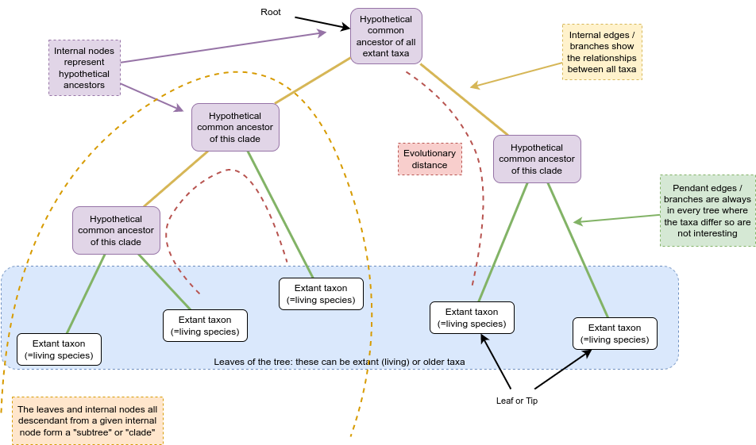
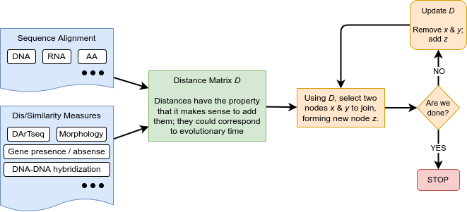

# Introduction

This tutorial is based on a workshop that was run in 2019 under the auspices of Australian BioCommons by Michael Charleston, and attended online by hundreds of people across Australia.

The title of that workshop was "Phylogenetics - Back To Basics" and it was aimed at helping you understand how phylogenetic inference works, some of the tools used, and what you can learn from phylogenetic estimation.

It has been adapted to work as a stand-alone, self-paced tutorial, which can run (almost) entirely within Galaxy.


## Scope:
**We will cover:**

* What a phylogeny is
* Motivation: 
	* conservation / biodiversity, 
	* fundamental knowledge, 
	* designing vaccines
* Why it’s hard to find a phylogeny
	* How long it takes
	* We cannot go back and check
	* The role of simulation
	* The plethora of methods (nucleic acid sequence based, morphometric based (body shape)) making it hard to choose
* Data
	* What a sequence alignment is and how to interpret one;
	* What to do with difficult data (lots of gaps in the alignment)
	* The data we will use: from OzMammals data set
* Three different main approaches:
	* Distance-based (NJ, BioNJ)
	* Parsimony
	* Likelihood (simple models only)
* Comparing phylogenies --- what do when they aren't all the same
* Analysing robustness
* Interpreting results, 
	* e.g. confidence interval on dates of divergence;
	* selection pressure dN/dS ratios.
* What can possibly (probably) go wrong?
* A sensible workflow

**We will not cover:**

* Workflows from read data to sequences
* How to get an alignment (much: will use automated methods)
* Phylogenetic networks
* MCMC / BEAST / MrBayes

## Learning Objectives

On successful completion of this workshop you will be able to:

* Estimate a phylogenetic tree based on a set of aligned molecular sequences;
* Assess the quality of a molecular sequence alignment and be able to modify it appropriately for phylogenetic analysis;
* Apply standard methods to aligned data to infer phylogenetic trees;
* Assess the reliability of estimated phylogenies.


> <details-title>Further reading</details-title>
> Here is a link to the PLoS article on Galaxy tutorials:
> - [Galaxy Training: A powerful framework for teaching!](https://journals.plos.org/ploscompbiol/article?id=10.1371/journal.pcbi.1010752)
{: .details}

## Overview

This tutorial has the following structure:

- Introduction and motivation: why is phylogenetic inference important?
- A general overview of phylogenetic inference: from sequence data onward.
- Obtaining the data for this tutorial + exercise
- Sequence alignment (including manual methods, automatic methods, complexity issues / heuristics) + exercise
- Distances based on sequence alignment
- The Neighbor-Joining method & FastME2.0 (https://doi.org/10.1093/molbev/msv150) **needs an update** **not sure that there is a FastME implementation in Galaxy; there is an R package though**
- Building your first tree (on Galaxy)
- Models of sequence evolution: from the sublime to the ridiculous
- Phylogenetic Networks (**SplitsTree needs install**), Neighbor-Net
- Assessing the quality of the tree(s): Bootstrapping, branch lengths; conflict in the networks
- Maximum Likelihood with IQTree


## Motivation

There are many ways in which we can use phylogenetic analyses: from the most fundamental understanding of the evolutionary relationships that exist between a set of species, as in Charles Darwin's famous sketch in Origin of Species

{:align="center", :width="400"}

**needs a reference**

all birds
{:align="center", :width="400"}
(from from Jetz *et al.* 2012, Nature (491):444–448)

and much bigger projects across all of life:

{:align="center", :width="500"}

(from Understanding Evolution. 2019. University of California Museum of Paleontology. 4th November 2019; http://evolution.berkeley.edu)

Aside from fundamental understanding, there are other strong motivators for inferring phylogenetic relationships:

- Designing vaccines, for example for SARS-CoV2 and influenza;
- Measuring phylogenetic diversity for guiding conservation efforts;
- Understanding coevolution: around 70% of emergent human diseases have come from other species;
- Dating major evolutionary events, to study the effects of environmental change on different species.

> <comment-title>Gene trees, species trees</comment-title>
> 
> It's worth noting that getting the phylogeny from a set of genes -- what we often call a *gene tree* -- might *not* > give us the phylogeny of the species that house those genes, *even if we get everything right!*
>
> This happens because there are other processes that can lead to the so-called "gene tree" not being the same as the species tree:
>	- lateral gene transfer events
>	- gene duplication
>	- gene loss and incomplete lineage sorting
>	- recombination
>
> This could send us off down a very deep and difficult rabbit-hole: that of the gene-tree / species tree problem: but today we will work under the assumption (which is reasonable in this case) that the gene tree will reflect the species relationships.
>
> **The situation where gene trees and species trees differ is often called the "gene tree / species tree reconciliation problem", and while it is very interesting and important, it is beyond the scope of this tutorial.**
>
{: .comment}

# Basic Methodology

First and foremost, **phylogenetic inferences is a statistic estimation process.**

It is not generally possible to prove that any tree inferred is *correct* -- since we cannot go back in time and observe speciation events.
One obvious consequence of this is that different estimates of the phylogenetic tree relating a given set of species may differ, even if no errors were made.  
Finding an optimal tree is *hard*!

All we start with is something like this:

{:align="center"}

So, how do we do it?

There are several ways to estimate a tree, such as:

1. Go with what we think is the case already (this is not recommended!)
2. Attempt to build a tree based on similarity and dissimilarity, with such tools as Neighbor-Joining (NJ) or FastME (we will do this first thing after getting the alignment!)
3. Choose some kind of score function, such as Parsimony or Maximum Likelihood, to potential trees and find the best one (we will do this second!)
4. Something else entirely (networks? inference based on their parasites?).


This is a link [introduction to phylogenetics](https://www.ebi.ac.uk/training/online/courses/introduction-to-phylogenetics/).

> <comment-title>Common Evolutionary Assumptions used in Phylogenetic Estimation</comment-title>
> 
>  These may help your understanding of why things are done this way:
>
> 1. Evolution is “memoryless” (which means we can use the powerful mathematics of Markov processes). 
This assumption means that the future evolutionary trajectory of an organism is not affected by its past: how we got here is not important, only how we adapt and evolve now.
> 
> 2. Phylogenetic relationships can be correctly represented by a tree! (This isn't *always* assumed, but it is very common.)  Trees are a very attractive representation of evolution, and it is part of our language: "The tree of life" is a common phrase.  However it is not always the case that evolution is best explained by a tree-like, "branching" process, as there can be hybridisation events, and species can share genetic material, or even envelop each other, creating organelles.
> 3. The *Molecular clock* assumption: sequences in a clade evolve at about the same rate as each other (this is easily tested). This is of those models that are known to be wrong, but which are useful. For instance, there is commonly variation in evolutionary rate between lineages, but if this variation is not significant, we can ignore it and use simpler models, to better leverage the phylogenetic information there is in the data.
> 4. Lineages don’t interact – once they have speciated, they are independent of each other.  Again, this isn't always the case, but the vast majority of methods assume this, particularly if the evolution is also assumed to be tree-like. We also know that biological lineages *do* interact with each other -- but our methods are not able to manage such complexity in general.
>
> We will (mostly) make *all* these assumptions in this tutorial!
> 
> 
{: .comment}

## Terminology

We need to define some terms, which may be new to you.

{:align="center"}

**how to get a figure label on this? Call it Fig 1. Tree Anatomy**

Mathematically a *Tree* is a kind of *graph*, which has objects called *nodes* or *vertices*, connected in pairs by things called *edges*.  
Trees are a natural way to think about phylogenetic relationships, where the nodes correspond to *taxa*, and the edges, also called *branches*, show the relationships between them. 
Taxa could be species, or lineages, genera, populations, or even individuals if we are considering something like a genealogy.
Nodes that only have one edge attached to them are called *leaves* (or *tips*), and these correspond to taxa with no descendant taxa in the tree. 
These taxa might be from fossils, or be currently living, in which case they're referred to as *extant*.

It's common to call *phylogenetic tree* just a *phylogeny*.

Many phylogenies have a special node assigned as the common ancestor of all the taxa represented by the leaves in the tree, and this node is called the *root*.
If that's the case then there is a natural direction implied from the root to the tips, going forward in time.
Such trees and phylogenies are called *rooted*; if there is no such root then they are called *unrooted*. 

In a rooted phylogeny, all the leaves that are descendant from any given node form a *monophyletic clade* (or often just "*clade*"). 
(Monophyletic means "one tribe (of) origin" from the Greek.)

Phylogeny estimation can be thought of as inferring a collection of compatible hypotheses about monophyly -- that is, statements that groups of taxa descendant from a common ancestor are each others' closest relatives in the tree.

The tree above is called a *binary* tree, because each internal node branches into *two* descendants.
It is a very common assumption that our trees will be binary, and we will make that assumption here.  In fact it is often very hard to come to a means by which a phylogeny could be truly *non*-binary: in most cases this is just due to our inability to resolve the tree completely.
In this tutorial we will only be considering trees that are binary.

## Building a Tree

The basic method of building a tree begins with a set of *distances*, which record how different the taxa are from each other.
Distances have very desirable properties, that can be summarised as follows, for any objects $$ x $$, $$y$$, $$z$$, and writing $$d(x,y)$$ to mean the distance from $$x$$ to $$y$$ etc.  These properties are:
 * *non-negativity* -- distances can never be negative, and in fact we treat two things as identical if they have a distance of 0 between them.
 * *symmetry* -- the distance from $$x$$ to $$y$$ is the same as the distance from $$y$$ to $$x$$; that is, $$d(x,y) = d(y,x)$$.
 * the *triangle inequality* -- there are no short-cuts!  The distance from $$x$$ to $$z$$ is always *at most* the distance from $$x$$ to $$y$$ plus that from $$y$$ to $$y$$; that is, $$ d(x,y) + d(y,z) \leq d(x,z)$$.

 In phylogenetics terms we like distances to represent something like time, and we can assign lengths to branches (see "Tree Anatomy" diagram above).

Here is a flow-chart of the process:

{:align="center"}

## Challenges

Phylogenetic Inference is **Hard**.
One of the many challenges that make it hard is the sheer number of possible trees that can describe relationships among species.

The number of rooted binary trees grows as 1, 3, 15, 105, 945, 10395... in fact the formula for this number for $$n$$ taxa (we use `taxa' in general, since not all phylogenetic inference is at the species level) is $$(2n-3)!! = (2n-3)(2n-5)...(3)(1),$$ which grows as fast as $$2^{n}n!$$.

### The Number of Rooted Binary Trees

> | *n*          | # trees    | notes       |
> |--------------|------------|-------------|
> | 3    | $$3$$       | trivial to check |
> | 4    | $$15$$       | enumerable by hand |
> | 5    | $$105$$       | enumerable by hand on a rainy day |
> | 6    | $$945$$       | enumerable by hand during lockdown |
> | 7    | $$10395$$       | easily searched by computer |
> | 8    | $$135135$$       | a bit more than the number of hairs on your head |
> | 9    | $$2027025$$       | population of Sydney living west of Paramatta |
> | 10   | $$34459425$$                      | comparable with the number of possible tickets in a typical lottery |
> | 20   | $$\approx 8.2\times 10^{21}$$       | getting slow for computers even with branch-and-bound |
> | 48  | $$\approx 3.21\times 10^{70}$$       | number of particles in the universe-ish |
> | 136  | $$\approx 2.11\times 10^{267}$$       | number of trees to choose from in the first "Out of Africa" data set |
> |---|---|---|


> <comment-title>This is a comment section</comment-title>
>
> This is a comment section
>
> 1. item 1
>
> 2. item 2
>
{: .comment}

## Data upload

Background on the data used in this workshop.

<!-- This workshop will use some recent SARS-CoV-2 nucleotide sequence data, from NCBI, the National Center for Biotechnology Information.

The SARS-CoV-2 virus has caused the largest pandemic in modern history (in absolute terms of population affected, in all history) and understanding its evolution is key to managing it.

{:width="500"}

*Source: /www.ncbi.nlm.nih.gov; CC BY-SA • Alexey Solodovnikov*

The sequences we have chosen for this workshop are complete SARS-CoV2 sequences, publicly available from nextStrain (http). -->

This workshop will use a set of malaria DNA sequences. [needs ref]

We are using a relatively small set of sequences because phylogenetic estimation on many sequences is computationally very intensive, and can take weeks of time on a high-performance computer.


## Get the data

> <hands-on-title>Obtain your data</hands-on-title>
>
> 1. Make sure you have an empty analysis history. Give it a name.
>
>    
>
> 2. Import the following files from [Zenodo](https://tinyurl.com/phylo-trees-1-data) or from the shared data library
>     Note: Current link is to google drive. Update to Zenodo for final release.  For testing use https://drive.google.com/file/d/1j96miOPD41no5S8BSqRNG1Ru_-p7w1gg/view?usp=share_link; upload to galaxy from computer.
>
>    ```
>    exon7-unaligned.fst
>    ```
>
>    
>  
> You can click on the `eye' icon on the right to see the unaligned data (go ahead!) but the view isn't very helpful.  This is just the raw FASTA file, with the case symbols A, C, G, T for the nucleotides.  You can see that the sequences are of different lengths though, since the last lines of each sequence are of different lengths.
>
This is a file in **FASTA** format, which has a very simple structure, as follows:

```
>SEQUENCE_1
GAGCTATACGACGT
>SEQUENCE_2
TTACTAGCTACTACT
```

The above toy file has two sequences in it named SEQUENCE_1 and SEQUENCE_2, each with a short set of characters which we can assume are DNA.

> Now let's view the unaligned sequence in a more understandable form.  Click on the green data on its name; the green bar will open up and show you more options, including the little "Visualise" one.  Click that and then select the Mulitple Sequence Alignment tool.
> You should see something like this:
>
> {:width="400"}
> 
> Play around with the view: you can change colour schemes and add or remove various elements.  Good colour schemes for nucleotide data are "Clustal2" and "nucleotide".  
> If you cannot see the slider at the top (for moving left or right in the view) you will need to check the "Show residues indices" in the "Vis. elements" drop-down menu.
> Do not adjust the scale slider!  Currently, this breaks the page.
{: .hands_on}

> <question-title>Understanding the FASTA file</question-title>
> 1. How many sequences are there in your data?
> 2. How long is the longest sequence, and what is it?
> 3. What about the shortest sequence? 
{: .question}

 (Answers: there should be 55 sequences.  The longest is from <i>Anolis paternus</i> with length 1729 nucleotides; the shortest is <i>A. luciae</i> with length 1252.)

FASTA format is very simple and is commonly used as input to phylogenetic inference programs.

> <comment-title>FASTA format</comment-title>
> The FASTA (pronounced like "faster" (not sounding the 'r'!) or Fast-Eh to rhyme with the first letter of the alphabet) format works as follows:
> 1. each sequence has a name, which appears one its own line after a "greater-than" sign '>'
> 2. the next line(s) contain the sequence for that name; continuing either until the next sequence name line, or the end of the file.
>
{: .comment}

> <question-title>Investigating the unaligned data</question-title>
> 1. How many sequences are there in your data?
> 2. How long is the longest sequence, and what is it?
> 3. What about the shortest sequence? 
{: .question}

# Sequence Alignment

Sequence alignment is a very well developed process, but there can still be some arbitrariness that can make it tricky.
For a start, while aligning just *two* sequences is "easy", in the sense that an optimal alignment between two sequences can be found in a reasonable amount of time, optimally aligning multiple sequences is *computationally intractable*.

### Aside on dynamic programming for interested readers...

## Aligning sequences with MAFFT

Today you will be aligning sequences using a modern multiple alignment program called **MAFFT**, which is available on Galaxy.

## Question: is there a format convention for program names, like Courier Bold or something?


> <hands-on-title>Sequence alignment with MAFFT</hands-on-title>
>
> 1. in Galaxy, search for and select the MAFFT tool from the tool finder on the left.
> 2. When you select it, the "Sequences to align" field should already be filled with your unaligned data.  If it isn't, select it using the drop-down menu.
> 3. Leave the "Data type" field as "auto detection" since MAFFT will recognise all the symbols are nucleotides.
> 4. Change the MAFFT flavour to "linsi" as this is a recommended setting for most accurate alignment of a relatively small data set such as this one, with fewer than 200 sequences.
{: .hands_on}

Here is an embedded image of the resulting alignment:

{:width="500"}

## Need to get image of alignment in

# Distance-based phylogenetic inference

Calculating distances from an alignment

## Building a Neighbor-Joining Tree 

> <hands-on-title>Build a Neighbour-Joining Tree with cleancut</hands-on-title>
>
> 1. Step 1
> 2. Step 2
>
{: .hands_on}

**IMAGE HERE: NJ Tree image**


# Phylogenetic Networks

Intro to phylogenetic networks as an alternative to trees

## Building a Neighbor-Net phylogenetic network

> <hands-on-title>Build a Neighbor-Net with Splitstree</hands-on-title>
>
> 1. Step 1
> 2. Step 2
>
{: .hands_on}


**IMAGE HERE: Neighbour net image**

# Basics of Maximum Likelihood

Background on ML. How it works. Software. Bootstrap values.

Info on models


##  Estimating a Maximum Likelihood tree 

> <hands-on-title>Estimating a Maximum Likelihood tree with IQTree</hands-on-title>
>
> 1. Step 1
> 2. Step 2
>
{: .hands_on}


**IMAGE HERE: ML tree with bootstrap values**


# Possible new section on formatting and exporting a pretty tree


# Summary 

- Phylogeny provides the statistical framework that is essential to comparing biological organisms
- There are so many trees, choosing the best one is very hard.
- There are many data options but one of the best is to use molecular
sequences.
- Optimality criteria (e.g., MP, ML) help us decide which trees are “good” – by how well they explain the data.
- We can search tree space for medium-sized problems with branch-and-bound, and bigger problems with heuristics.
- Bayesian analysis is a way of incorporating prior knowledge in ML analyses.
- Trees can be assessed for robustness by resampling. testing.


# Troubleshooting

Here are a few things that can still catch us out:

  - **Long Branch Attraction (LBA):** 
    Be wary of long branches that come out together in the estimated phylogeny: this can be the result pairs of sequences that are very different from the rest, so match each other “by chance” more than they match the rest.
    
    **Fix:** break up these long branches by adding in some taxa that are closely related to one or the other; remove one long branch at a time to see where the remaining one fits best; consider other methods that are more robust to LBA.

  - **Very “Gappy” Sequences:** 
    Sequences that are hard to align might contain many gaps and many equally “good” alignments.
  
    **Fix:** Try different multiple alignment programs; consider using “alignment-free” methods such as k-mer distances; remove very problematic regions using programs such as GBlocks.

  - **Low resolution:** 
    Low bootstrap support or lots of conflict in a network.
    
    **Fix:** Look at which sites support which splits (internal branches); consider sliding window approaches or check that your sequences don’t span regions with different selection pressures; consider using PartitionFinder or similar methods to work out which sets of sites have similar evolutionary dynamics.

  - **The gene trees are different!**
    
    **Fix:** Well they might not need fixing: it might just be that the genes’ evolutionary histories aren’t the same as those of the species that host them. Look at all the gene trees and see what other events might have led to the differences between them.

  - **I can’t find an outgroup!**

    **Fix:** Consider mid-point rooting: it is in most cases pretty good.


# Markdown hints
Internal link [Resources](#resources) 
An external link[RAxML](https://cme.h-its.org/exelixis/web/software/raxml/)

> example table
>
> | Sample       | Cluster_id | DR profile | Clustering  |
> |--------------|------------|------------|-------------|
> | ERR5987352   | 10         | Pre-MDR    | Clustered   |
> | ERR6362484   | 10         | Pre-MDR    | Clustered   |


> <question-title>Exercise 1</question-title>
>
> 1. question?
>
> > <solution-title>1</solution-title>
> >
> > 1. Solution
> >
> {: .solution}
>
{: .question}


> <question-title>Exercise 2</question-title>
>
> A question
>
> > <solution-title>4</solution-title>
> >
> > Solution
> >
> {: .solution}
>
{: .question}


# Resources
To develop a deeper understanding of phylogenetic trees, there is no better way than estimating phylogenies yourself --- and work through a book on the topic in your own mind's pace.

## Books
- *Phylogenetics in the genomics era*, 2020. An [open access book](https://hal.inria.fr/PGE) covering a variety of contemporary topics.
- *Tree Thinking*, 2013, by David A. Baum & Stacey D. Smith
- *Molecular Evolution*, 2014, by Ziheng Yang

## Useful links
- [MEGA Software](https://megasoftware.net/)
- [Tutorial on how to read a tree, with a virus example](https://artic.network/how-to-read-a-tree.html)
- [Tree Of Life web project](http://tolweb.org)
- [Phylogenetic Inference in the Stanford Encyclopedia](https://plato.stanford.edu/entries/phylogenetic-inference/)
