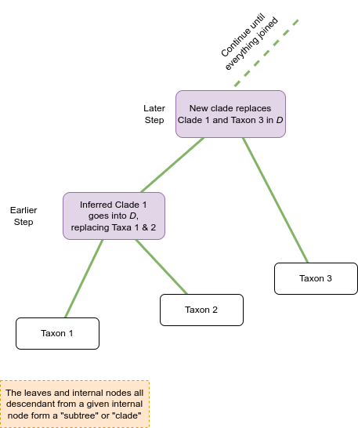
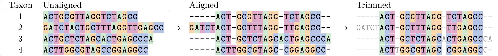
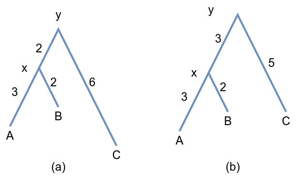
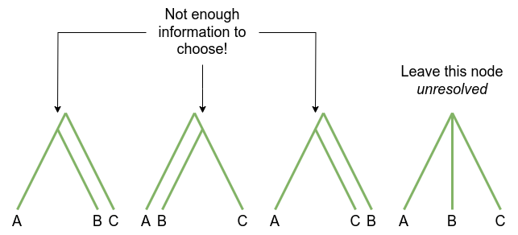
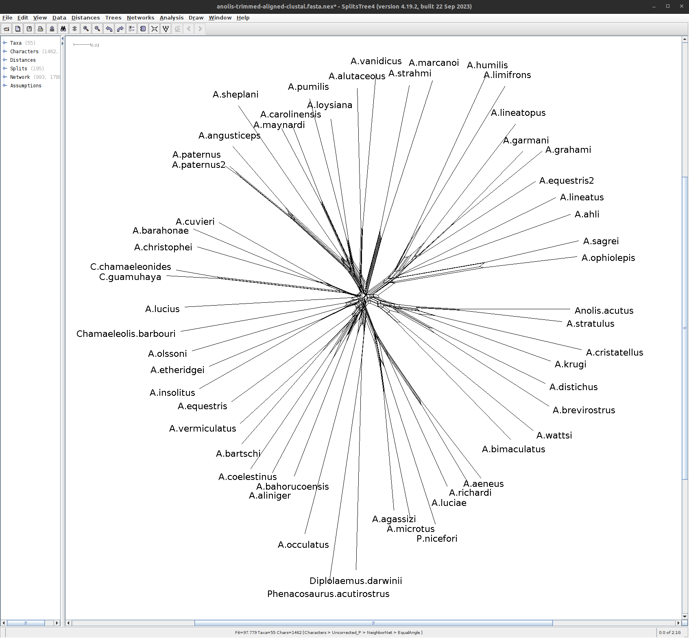
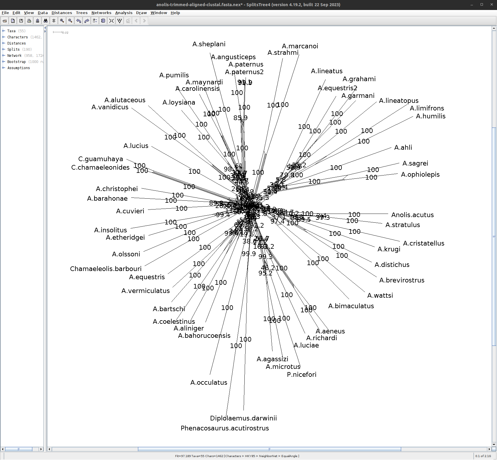

# Introduction

Phylogenetics is essential for comparing biological species and understanding biodiversity for conservation. This tutorial discusses the basic principles and methods of phylogenetic inference and what you can learn from phylogenetic estimation. It is intended to help you make informed decisions about which methods to use in your own research.  

Using real-life data and standard tools that are (mostly) available in Galaxy, the tutorial demonstrates the principles behind a variety of methods used to estimate phylogenetic trees from aligned sequence data or distance data. 

This is not a "how to" tutorial, but is instead aimed at giving you a better understanding of the principles of phylogenetics and how the methods work.

The exercises are beginner level, but you should know how molecular sequence data is produced and what it looks like. Maybe you've even built phylogenetic trees before but want to know more about the principles behind the tools.

This tutorial does not cover workflows for taking read data to phylogeny, multiple sequence alignment or Bayesian methods. We’ve included recommended reading and tutorials on these topics in the resources section.

This tutorial is adapted from a 2019 workshop that was run by Australian BioCommons and Michael Charleston from the University of Tasmania.

> <agenda-title></agenda-title>
>
> In this tutorial we will deal with:
>
> 1. TOC
> {:toc}
>**We will not cover:**
>
>* Workflows from read data to sequences
>* How to get an alignment (much: will use automated methods)
>* Bayesian phylogenetics: MCMC / BEAST / MrBayes
{: .agenda}

<!-- Original notes on scope. Now incorporated into the agenda box

## Scope:
**We will cover:**

* What a phylogeny is
* Motivation: 
	* conservation / biodiversity, 
	* fundamental knowledge, 
	* designing vaccines
* Why it’s hard to find a phylogeny
	* How long it takes
	* We cannot go back and check
	* The role of simulation
	* The plethora of methods (nucleic acid sequence based, morphometric based (body shape)) making it hard to choose
* Data
	* What a sequence alignment is and how to interpret one;
	* What to do with difficult data (lots of gaps in the alignment)
	* The data we will use: an alignment of malaria sequences.
* Three different main approaches:
	* Distance-based
	* Parsimony
	* Likelihood (simple models only)
  * Phylogenetic networks
* Comparing phylogenies --- what to do when they aren't all the same
* Analysing robustness using bootstrapping
* A little on what can possibly (probably) go wrong?
* A overview of a workflow

**We will not cover:**

* Workflows from read data to sequences
* How to get an alignment (much: will use automated methods)
* Bayesian phylogenetics: MCMC / BEAST / MrBayes


## Overview

This tutorial has the following structure:

- Introduction and motivation: why is phylogenetic inference important?
- A general overview of phylogenetic inference: from sequence data onward.
- Obtaining the data for this tutorial + exercise
- Sequence alignment (including manual methods, automatic methods, complexity issues / heuristics) + exercise
- Distances based on sequence alignment
- The Neighbor-Joining method & Minimum Evolution, using FastTree2
- Building your first tree (on Galaxy)
- Models of sequence evolution: from the sublime to the ridiculous
- Phylogenetic Networks (**on your own computer, using SplitsTree**), Neighbor-Net
- Assessing the quality of the tree(s): Bootstrapping, branch lengths; conflict in the networks
- Maximum Likelihood with IQTree -->


## What is a Phylogeny?
"){:align="center", width="400px"}

A *phylogenetic tree*, also called a *phylogeny*, is usually a tree-like structure, like [Darwin's famous sketch](#figure-1). The leaves or tips of the tree represent extant (living/existing) taxonomic entities like species, genera, or strains (in general called "taxa"). The lines connecting taxa describe the evolutionary relationships between them.
The intersections of lines correspond to hypothetical ancestral taxa. They represent branching events when species split into two new species, or a strain developed a phylogenetic important offshoot strain, etc.

The phylogeny of a group of taxa is the best representation of their evolutionary relationships.
It is also the main basis on which we can build statistics comparing species: without the phylogeny, comparing species (or strains, genera, etc.) is not meaningful.  

As Theodosius Dobzhansky famously wrote, **"Nothing in biology makes sense except in the light of evolution"** .


## Why we need phylogenetics

There are many ways in which we can use phylogenetic analyses: from the most fundamental understanding of the evolutionary relationships that exist between a set of species, as in [Charles Darwin's famous sketch](#figure-1), 
to families:

{: align="center"}


and much bigger projects across all of life:

{:align="center", width="500"}

Aside from gaining a fundamental understanding of biology, other reasons for inferring phylogenetic relationships include:

- Designing vaccines, for example for SARS-CoV2 and influenza
- Measuring phylogenetic diversity for guiding conservation efforts
- Understanding coevolution, for example around 70% of emergent human diseases have come from other species
- Dating major evolutionary events to study the effects of environmental change on different species.

> <comment-title>Gene trees, species trees reconcilitation problem</comment-title>
> It's worth noting that getting the phylogeny from a set of genes -- what we often call a **gene tree** -- might *not* give us the phylogeny of the species that house those genes, *even if we get everything right!*
>
> This happens because there are other processes that can influence the so-called "gene tree" such as:
> - lateral gene transfer events
> - gene duplication
> - gene loss and incomplete lineage sorting
> - recombination
>
> **The situation where gene trees and species trees differ is often called the "gene tree / species tree reconciliation problem".**
>
> While it is very interesting and important it is beyond the scope of this tutorial. Today we will work under the assumption (which is reasonable for the dataset we will use) that the gene tree will reflect the species relationships.
>
{: .comment}

## Terminology

Before we start building trees, let's define some terms.

{:align="center"}

It's common to call **phylogenetic tree** a **phylogeny**.

Mathematically a **tree** is a kind of **graph**, which has objects called **nodes** or **vertices** (purple and white boxes in the figure above), connected in pairs by things called **edges** (green and orange lines in the figure above).  

Trees are a natural way to think about phylogenetic relationships. The nodes correspond to **taxa**, and the edges, also called **branches**, show the relationships between them, where taxa could be species, or lineages, genera, populations, or even individuals if we are considering something like a genealogy.

Nodes that only have one edge attached to them are called **leaves** (or **tips**), and these correspond to taxa with no descendant taxa in the tree.  These taxa might be from fossils, or be currently living, in which case they're referred to as **extant**.

Many phylogenies have a special node assigned as the common ancestor of all the taxa represented by the leaves in the tree. This node is called the **root**. When this is the case there is a natural direction implied from the root to the tips, going forward in time. Such trees and phylogenies are called **rooted**; if there is no such root then they are called **unrooted**. 

*The majority of phylogenetic inference methods produce unrooted trees, but rooted trees are more useful.*

In a rooted phylogeny, all the leaves that are descendant from any given node form a **monophyletic clade**, or often just "**clade**" (monophyletic means "one tribe (of) origin" from the Greek).

One way to determine where the root of a tree is, is to include an **outgroup** in the data, which is a set of taxa that are definitely not within the clade of interest (which is then called our **ingroup**) but which share a common ancestor with that clade.
A good outgroup won't be too distantly related to our ingroup, because if it's too distant then the choice of where it should connect to the ingroup will be hard: ultimately resulting in a guess.
You can see in the diagram above that the connection of the ingroup to the outgroup could be from multiple locations.
Once the *unrooted* tree is created, using combined data from ingroup and outgroup taxa, we can confidently say that the root is on the branch connecting our ingroup to our outgroup:

{:align="center"}

We can then imagine lifting up the unrooted tree at the branch connecting our outgroup and ingroup -- that is our best guess at the hypothetical ancestor of all our taxa and gives us a good indication of the branching order of our ingroup (and the outgroup):

{:align="center"}

Phylogeny estimation can be thought of as inferring a collection of compatible hypotheses about **monophyly** -- that is, statements that groups of taxa descendant from a common ancestor are each others' closest relatives in the tree.

The tree above is called a **binary tree**, because each internal node branches into *two* descendants. It is a very common assumption that trees are binary, and we make that assumption in this tutorial. In fact it is often very hard to come to a means by which a phylogeny could be truly *non*-binary: in most cases this is just due to our inability to resolve the tree completely.

# Basic Methodology

So, how do we estimate phylogenetic trees?

All we start with is the leaves of the tree which can be living (extant) or older taxa:

 are the starting point for buidling phylogenies"){:align="center"}

There are several ways to estimate a tree, such as:

1. Go with what we think is the case already (this is not recommended!)
2. Attempt to build a tree based on similarity and dissimilarity, with tools such as Neighbor-Joining (NJ) or FastME (we will do this later in the tutorial)
3. Choose some kind of score function, such as Parsimony or Maximum Likelihood, to build potential trees and find the best one (we will do this later too)
4. Something else entirely (networks? inference based on their parasites?).

**Warning**: Finding an optimal tree is *hard*!

First and foremost, **phylogenetic inference is a statistic _estimation_ process.**

Different estimates of the phylogenetic tree relating a given set of species may differ, even if no errors were made.

It is generally not possible to prove that any tree inferred is *correct* -- since we cannot go back in time and observe speciation events. 

> <comment-title>Common evolutionary assumptions used in phylogenetic estimation</comment-title>
> 
>  These notes may help your understanding of why things are done this way. We will (mostly) make these assumptions in this tutorial!
>
> 1. Evolution is “memoryless” (which means we can use the powerful mathematics of Markov processes). 
This assumption means that the future evolutionary trajectory of an organism is not affected by its past: how we got here is not important, only how we adapt and evolve now.
> 
> 2. Phylogenetic relationships can be correctly represented by a tree! (This isn't *always* assumed, but it is very common.)  Trees are a very attractive representation of evolution, and it is part of our language: "The tree of life" is a common phrase.  However evolution is not always best explained by a tree-like, "branching" process as there can be hybridisation events, and species can share genetic material, or even envelop each other, creating organelles.
> 3. The **Molecular clock** assumption: sequences in a clade evolve at about the same rate as each other (this is easily tested). This is known to be wrong, but is useful. For instance, there is variation in evolutionary rate between lineages, but if this variation is not significant, we can ignore it and use simpler models, to better leverage the phylogenetic information in the data.
> 4. Lineages don’t interact – once they have speciated, they are independent of each other. This isn't always the case and we know that biological lineages *do* interact with each other -- but our methods are not able to manage such complexity in general. The vast majority of methods make this assumption, particularly if the evolution is also assumed to be tree-like. 
> 
{: .comment}


## Challenges

Phylogenetic Inference is **Hard**.
One of the things that make it hard is the sheer number of possible trees that can describe relationships among species.

The number of rooted binary trees grows as 1, 3, 15, 105, 945, 10395... in fact the formula for this number for $$n$$ taxa (we use `taxa' in general, since not all phylogenetic inference is at the species level) is $$(2n-3)!! = (2n-3)(2n-5)...(3)(1),$$ which grows as fast as $$2^{n}n!$$.

**The Number of Unrooted Binary Trees**

> | *n*          | # trees    | notes       |
> |--------------|------------|-------------|
> | 3    | $$3$$       | trivial to check |
> | 4    | $$15$$       | enumerable by hand |
> | 5    | $$105$$       | enumerable by hand on a rainy day |
> | 6    | $$945$$       | enumerable by hand during lockdown |
> | 7    | $$10395$$       | easily searched by computer |
> | 8    | $$135135$$       | a bit more than the number of hairs on your head |
> | 9    | $$2027025$$       | population of Sydney living west of Paramatta |
> | 10   | $$34459425$$                      | comparable with the number of possible tickets in a typical lottery |
> | 20   | $$\approx 8.2\times 10^{21}$$       | getting slow for computers even with branch-and-bound |
> | 48   | $$\approx 3.21\times 10^{70}$$       | number of particles in the universe-ish |
> | 136  | $$\approx 2.11\times 10^{267}$$       | number of trees to choose from in the first "Out of Africa" data set |
> |---|---|---|


## Building a Tree

Building a tree begins with a set of *distances*, which record how different the taxa are from each other.
Distances have very desirable properties, that can be summarised as follows: for any objects $$ x $$, $$y$$, $$z$$, writing $$d(x,y)$$ means the distance from $$x$$ to $$y$$ etc.  These properties are:
 * *non-negativity* -- distances can never be negative, and in fact we treat two things as identical if they have a distance of 0 between them.
 * *symmetry* -- the distance from $$x$$ to $$y$$ is the same as the distance from $$y$$ to $$x$$; that is, $$d(x,y) = d(y,x)$$.
 * the *triangle inequality* -- there are no short-cuts!  The distance from $$x$$ to $$z$$ is always *at most* the distance from $$x$$ to $$y$$ plus that from $$y$$ to $$y$$; that is, $$ d(x,y) + d(y,z) \leq d(x,z)$$.

 In phylogenetics terms, we like distances to represent something like time and we can assign lengths to branches (see the [Tree Anatomy diagram](#figure-4) above).

Distances can be calculated based on a variety of data. Here is a flow-chart of the process:

{:align="center"}

The blue boxes on the left show some of the input data forms. The most commonly used kind of data in modern phylogenetics is *aligned molecular sequences* -- typically, DNA, RNA, or Amino Acids (AA) from equivalent (homologous) genes in the species of interest. We focus on this form of molecular phylogenetics in this tutorial.

Other input data forms are distances or dissimilarity measures based on molecular-based measures like DNA-DNA hybridisation, gene presence/absence, and morphology (physical dimensions). We will not discuss this kind of data in this tutorial.

Aligned sequences can be converted into distances (green box above), using models for how the sites (i.e. specific nucleotides or amino acids) have evolved.
These distances can be expressed as a matrix _D_, which becomes the input to a distance-based method.

At each step in the distance-based methods (orange boxes) the algorithm selects a pair of taxa, or clades that have been created so far, to join together to make a new clade.
Once that decision is made, the two taxa / clades that have been joined are replaced with the clade that the two of them make together as seen in the [figure below](#figure-7).

{: align="center"}


## Let's build our first tree

In this tutorial we will use a set of *Anolis* lizard DNA sequences, from Jackman, Larson, de Queiroz & Losos  to trial some phylogenetic methods.
The sequences are from the mitochondrial NADH dehydrogenase subunit 2 gene (ND2) and five transfer RNA (tRNA) genes, with an average sequence length of 1419.109 and a range of [1329,1727].


<!-- I got the sequence lengths from the raw FASTA file using gawk:
gawk 'BEGIN {OFS=","} {print length,$1}' anolis-raw.fst > anolis-sequence-lengths.csv -->
<!-- In fact this is even cleverer:
gawk 'BEGIN {OFS=","} {if (length>100) print length; else print $1}' anolis-raw.fst -->
<!-- The ultimate in collating sequence lengths with the sequence names:
sed -r 'N;s/^(>[A-Za-z2\.]+)\n/\1,/g' anolis-sequence-lengths.txt -->


We are using a relatively small set of sequences to ensure the methods run quickly for the purposes of the tutorial. 

In the real world, a phylogenetic analyses often span hundreds, or even thousands, of taxa. Phylogenetic estimation on this many sequences is computationally very intensive, and can take weeks of time even on a high-performance computer.

## Get the data

<!-- One sequence is here: https://www.ncbi.nlm.nih.gov/nucleotide/AF055943.2?report=genbank&log$=nuclalign&blast_rank=1&RID=JEX49T9G013 -->

> <hands-on-title>Obtain your data</hands-on-title>
>
> 1. Make sure you have an empty analysis history. Give it a name.
>
>    
>
> 2. Import the following files from [GTN](./data/anolis-raw.fst) or from the shared data library.
>    ```
>    anolis-raw.fst
>    ```
>
>    
> 
{: .hands_on} 
> You can click on the 'eye' icon  on the right to see the unaligned data (go ahead!) but the view isn't very informative. This is the raw FASTA file, with the symbols A, C, G, T representing nucleotides. You can see that the sequences are of different lengths, since the last lines of each sequence are of different lengths.
>
**FASTA** or **Fasta** format (pronounced to rhyme with pasta) format is is commonly used as input to phylogenetic inference programs and has a very simple structure, as follows:

1. Each sequence has a name, which appears on its own line after a '>' sign 
2. The next line(s) contain the sequence; continuing either until the next sequence name line, or the end of the file.

The example below has four sequences in it named Taxon_1, Taxon_2, etc, each with a short set of characters representing DNA sequences.

<!-- ```
>SEQUENCE_1
GAGCTATACGACGT
>SEQUENCE_2
TTACTAGCTACTACT
``` -->

```
>Taxon_1
ACTGCGTTAGGTCTAGCC
>Taxon_2
GATCTACTGCTTTAGGTTGAGCC
>Taxon_3
ACTGCTCTAGCACTGAGCCCA
>Taxon_4
ACTTGGCGTAGCCGGAGGCC
```


<!-- A line beginning with the greater-than sign `>` holds the sequence name or identifier/ID; the other lines hold the sequence data for the sequence ID above. -->

*Note:* The Fasta format can also include symbols such as a question mark '?' for missing data, or hyphen '-' to indicate an insertion or deletion events, collectively *indels*. It is common to represent a multiple sequence alignment in Fasta format with these symbols.

 It is also a common format for storing high-throughput read data, but *without quality scores* -- if you want to include read quality you would use FASTQ format.

> <hands-on-title>View your data</hands-on-title>
> Now let's view the unaligned sequence in a more understandable form.
>
> 1. Click on the title of your file to see the row of small icons for saving, linking etc.: 
> {:align="center"} 
>
> 2. Click on the **visualise icon** that looks like a bar chart and then select the **Multiple Sequence Alignment tool**.
> You should see something like this:
>
> {:width="600"}
> 
> Play around with the view. You can change colour schemes and add or remove various elements.  Good colour schemes for nucleotide data are "Clustal2" and "nucleotide".  
>
> If you cannot see the slider at the top (for moving left or right in the view) you will need to check the "Show residues indices" in the "Vis. elements" drop-down menu.
> 
> Do not adjust the scale slider!  Currently, this breaks the page.
{: .hands_on}

> <question-title>Understanding the FASTA file</question-title>
> 1. How many sequences are there in your data?
> 2. How long is the longest sequence, and what is it?
> 3. What about the shortest sequence? 
>
> > <solution-title></solution-title>
> > There should be 55 sequences.  The longest is from <i>Anolis paternus</i> with length 1729 nucleotides; the shortest is <i>A. luciae</i> with length 1252.
> {: .solution}
{: .question}

# Sequence Alignment

Molecular sequences must first be aligned before they can be used to build phylogenies.

Aligning sequences amounts to finding the nucleotide positions (sites) that we can be confident have the same evolutionary history: they correspond to each other across species and can be considered to have evolved from the same common ancestor.
A good clue to identify these sites, which are called <em>homologous</em>, is that they are well conserved, with only a few changes.

Below is an example of an alignment. On the left are the sequences in Fasta format.
In the middle we see an alignment of those sequences, which has gaps in it that help line up the sites so that more of them agree.
A sign of a "good" alignment is one in which the colours line up vertically. The overhanging parts can be removed as seen in the "trimmed version" on the right.

{:width="700"}

While aligning *two* sequences is "easy", in the sense that an optimal alignment between two sequences can be found in a reasonable amount of time, optimally aligning multiple sequences is *computationally intractable*. Multiple sequence alignment is a complex process and many methods have been developed to tackle this challenge.

## Aligning sequences with MAFFT

Today you will be aligning sequences using a modern multiple alignment program called **MAFFT**, which is available on Galaxy.

<!-- ## Question: is there a format convention for program names, like Courier Bold or something? -->


> <hands-on-title>Sequence alignment with MAFFT</hands-on-title>
>
> 1. In Galaxy, search for and select the  from the tool finder on the left.
> 2. When you select it, the **Sequences to align** field should already be filled with your unaligned data.  If it isn't, select it using the drop-down menu.
> 3. In the **Data type** field select "Nucleic acids".
> 4. Change the **MAFFT flavour** to "linsi". This is a recommended setting for most accurate alignment of a relatively small data set such as this one, with fewer than 200 sequences.
> 5. Click "Run tool".
{: .hands_on}

Here is an image of the resulting alignment. Note that the colours are now vertically aligned:

{:width="600px"}

You should ALWAYS visually check your alignment to see if it makes sense.
A tool you can use on your own computer is [SeaView](https://doua.prabi.fr/software/seaview).

# Distance-based phylogenetic inference

Now we will build our first tree, using a very common method called _Neighbor-Joining_. This method was created in the 1980s by Saitou & Nei (). 

<!-- (Saitou, N. & Nei, M. _The Neighbor-Joining method: a new method for reconstructing phylogenetic trees_. 1987, *Molecular Biology and Evolution*  , Vol. **4**(4):406-425); see also Studier, J. A. & Keppler, K. J., _A Note on the Neighbor-Joining Algorithm of Saitou and Nei_, 1988. *Molecular Biology and Evolution* **5**(6): 729-731) -->

## Building a Neighbor-Joining Tree 

The Neighbor-Joining (NJ) algorithm is a standard method that takes a set of distances between taxa as input, and sequentially connects them into larger and larger clusters until all taxa have been joined.

NJ is rarely used as a complete tool for phylogenetic analysis. Although it is quite accurate and fast, there are other fast methods that can be then applied to modify the NJ tree and create a better one.

The FastTree2 program that we are using does this. First it creates a "rough" NJ tree, and then modifies it to optimise a quantity called *Minimum Evolution* (ME).  A detailed description of how FastTree works is available from [Microbes online](http://www.microbesonline.org/fasttree/).

> <hands-on-title>Build a Neighbour-Joining Tree with FastTree</hands-on-title>
>
> 1. Search for the  in the tool finder on the left.
> 2. Load your MAFFT output file as the input data for FastTree.
> 3. Under **protein or nucleotide alignment** select "Nucleotide" as it is DNA data
> 3. For **Nucleotide evolution model** select Jukes-Cantor + CAT
> 3. Select "Show Advanced Options"
> 4. Select "Use Constant Rates"
> 4. Turn **off** the Maximum Likelihood: we are not up to that bit yet.
> 5. Click on "Run tool".
>
{: .hands_on}


<!-- 
>
>**Heuristic Neighbor-Joining**
>
>First, FastTree uses a heuristic variant of neighbor joining to get a rough topology. During neighbor joining, FastTree stores profiles of internal nodes instead of a distance matrix, which reduces the memory required. FastTree uses a combination of three heuristics to speed up this phase: it remembers the best join for each node, as in fast neighbor-joining; it does a hill-climbing search for better joins from a candidate join, as in relaxed neighbor joining; and it uses the "top hits" heuristic to avoid computing all pairwise distances and to avoid considering all possible joins at every step. It also updates the best join for a node as it comes across them, which reduces the amount of hill-climbing. Another limitation of FastTree's neighbor-joining phase is that it does not correct the distances for multiple substitutions, which exacerbates long-branch attraction. However, this will be corrected in the next stage.
>
>**Minimum Evolution**
>
>FastTree then tries to reduce the length of the tree, using a mix of nearest-neighbor interchanges (NNIs) and subtree-prune-regraft moves (SPRs). These "balanced minimum-evolution" rearrangements are roughly the same as what FastME does, but because FastTree uses profiles instead of distances, it is much faster. By default, FastTree uses 4*log<sub>2</sub>(N) rounds of nearest-neighbor interchanges and 2 rounds of subtree-prune-regraft moves. In each round, it considers every possible NNI in the tree. Because there are too many (O(N<sup>2</sup>)) possible SPR moves, FastTree treats SPR moves as chains of NNIs and only extends the best choice in the chain for chains of length two or greater. In the minimum-evolution framework, if the distances are not too noisy, NNI and SPR moves suffice to reach optimal trees (Desper & Gascuel 2004, Bordewich et al. 2009).
>
>Distances: During these minimum evolution steps, FastTree needs to estimate distances between sequences or profiles. For protein sequences, FastTree estimates distances by using the BLOSUM45 amino acid similarity matrix, and it corrects for multiple substitutions by using the formula $-1.3 \times \log(1-d)$, where $d$ is weighted so that random sequences have an average value of 1. For nucleotide sequences, FastTree uses the Jukes-Cantor distance $-0.75\times\log(1 - \frac{4}{3} d)$, where $d$ is the proportion of positions that differ. When comparing two sequences, positions with gaps are ignored; when comparing two profiles, positions are weighted by their proportions of non-gaps. 
>
{: .comment} -->


It won't take very long for FastTree to build your tree.
But when it's done, how can you see it?

Clicking on the output doesn't at first appear to be very illuminating: it's just a parenthesised list of taxon names and numbers.
This is **Newick Format**, and it's worth knowing at least a little of what it means.  

* Each matched pair of parentheses denotes a **cluster** or **subtree**: "(A,B)" means that A and B are each others' closest relatives (also called _sister taxa_).
* A number after a cluster (so, after a closing parenthesis) is a **label** for that cluster.  In the output from FastTree, this label is an indicator of the support for that branch.
* If there is a colon ':' followed by a number, then this is the **branch length** for the subtree.


{:align="center"}

The rooted, 3-taxon trees above have three taxa, labelled A, B and C.  Two of the internal nodes have been labelled (x and y), but it isn't necessary to do so in general (for example, if you wanted to use the label for something like support of each branch, as does FastTree).

In both trees, A and B are sister taxa, and branch lengths are indicated near each branch: you can see how the branch lengths are above each cluster, including the individual taxa (the "leaves" of the tree), but not above the root.

The Newick format for the tree on the left is "((A:3, B:2)x:2, C:6)y;" and for the one on the right it is "((A:3, B:2)x:3, C:5)y;".

Note that these two trees are very similar; they only differ in the position of the root (y), either being distance 2 from node x, or being 3 from it.  The distance between any two nodes in the tree is the sum of the branch lengths on the path connecting them, so for the trees above, the distance matrix is

|     |  A   |   B  |  C   |
| --- | :--: | :--: | :--: |
|  A  |  0   |  5   |  11  |
|  B  |  5   |  0   |  10  |
|  C  |  11  |  10  |   0  |

Ideally, these will reflect the actual input distances, but such distances are based on messy real data, and do not necessarily obey this ideal.
That is why methods like FastTree are employed to find a tree with the best possible agreement between the distance inferred, and that calculated from sequence data.
<!--The Minimum Evolution criterion optimises... XXX Mike to complete.-->

> <hands-on-title>Visualising a tree</hands-on-title>
> 1. Click on the title of the completed FastTree job to show the row of small icons for saving, linking etc. 
> {:align="center"} 
>
> 2. Click the "Visualisation" icon that looks like a little bar chart.
> 3. You will be presented with a couple of options that look like this:

> {:width="400"}
> 
> 4. Select "Phylogenetic Tree Visualisation" -- this seems to be the best one.
>
> *Your tree is displayed!*
> 
> Find the angle brackets at the top right of the central panel. Clicking on these to reveal the settings, enabling you to alter the display options. Try out "Circular" and "Radial".
> Notice that there are quite a lot of long branches adjacent to the extant taxa (leaves), and that near the centre of the tree, these branches are much shorter.
> Note: **Short branches are much harder to get right.**
>
{: .hands_on}

# Searching for the "best" tree

The other main way we can estimate a phylogeny is by choosing some kind of score of "goodness" and then searching the entire set of possible trees for the tree (or trees) that optimises this score.
Note that such scores are "surrogates for truth" in that we *hope* the optimal score will correspond to the true tree, but it is not necessarily the case. In many analyses we therefore use *multiple* methods, in the hope that they will give us the same answer. Minimum Evolution (ME), Maximum Parsimony (MP), and Maximum Likelihood (ML) are common such score functions.

**Note: If your conclusion changes based on your analytical method, then perhaps your data are not adequate.**


## Minimum Evolution (ME)

Minimum Evolution is the idea that the sum of the branch lengths should be as small as possible to still account for the distances between the leaves of the tree, in that the sum of squared differences between the distances implied by the tree and the observed distances from the data, is minimised.  You can read more about this in an article by [Rzhetsky and Nei](https://academic.oup.com/mbe/article/10/5/1073/1037508).

There are some variations on this ME criterion, and FastTree uses an approximation of one of them to find good trees.

## Maximum Parsimony (MP) and Parsimony Length

Most tree estimation methods output trees with branch lengths that correspond to the amount of evolutionary "work" that has to be done to turn one sequence into another.

This can be given as the *minimum number of character state changes required* -- the so-called *parsimony length* -- to convert the (hypothetical) sequence at one end of a branch to that at the other end.
The Maximum Parsimony method is based on this approach.

<!--The parsimony length of a given site pattern in an alignment, given a particular tree, is the minimum number of changes of state that are required to account for the observed characters (e.g. nucleotides) at the leaves of that tree.-->
Finding the parsimony length of a site pattern is easy and fast due to a clever algorithm created by Walter Fitch; hence, finding the score (the "goodness") of a tree is fast. But finding the tree that minimises this score is still computationally intractable, because the space of trees is so huge.

The Maximum Parsimony method for finding the "best" tree is to search tree space for the tree (or trees) that *minimises* the parsimony length of any tree for that alignment. Note that when parsimony is *maximised*, this means the fewest possible changes required, so the *minimum* length.

We do not use the Maximum Parsimony method in this tutorial.

## Maximum Likelihood (ML) 

Likelihood is the most statistically defensible phylogenetic inference method.
It is based on the idea that the tree that has the highest probability of producing the sequences at the tips of the tree is the tree that is the "most likely" to be correct.

Likelihood is *not* the same as probability, though they are often confused with each other. However, it is *proportional* to the probability that the tree is correct, out of the set of possible trees and models you are considering.

One major assumption we make about molecular sequence data is that each site evolves independently  of the others. Biologically we know this isn't always the case, but in practice this makes things much more tractable, and we still have a very good chance of getting the tree(s) right.

Another assumption we make is that the substitution rate -- the rate at which changes of nucleotide at a given position in the sequence happen -- is only dependent on the current state, i.e., we do not care about how a sequence came to be what it is, only what the sequence is now, to determine what are the probable evolutions of it.
This seems much more biologically reasonable and makes this into a Markov process, which in turn enables a lot of calculations to be made simply.

### Models of sequence evolution

*If you are in a hurry to get stuck in to the phylogenetic analysis you can skip this section and go to the next [Hands-on: running IQ Tree](#estimating-a-maximum-likelihood-tree).*

> <details-title>More details on likelihood models</details-title>
> Likelihood is based on probability, so requires we choose a probabilistic model for the evolution of sequences.
> The simplest model for DNA is that each nucleotide has the same rate of change, and that all nucleotides appear with equal frequency (called the base frequencies) of 25%, 25%, 25%, 25%.  This is the Jukes-Cantor (JC) model published in 1969, and this model has just one parameter.
> 
> More biological realism allows for different nucleotide proportions outside the uniform 25% rate. This is the Felsenstein 1981 model, known as F81, and it has three more parameters for the rates (not four: given the first three base frequencies this defines the other one).
> 
> A next level of sophistication is the Hasegawa-Kishino-Yano model (HKY) published in 1985, which acknowledges that transitions (changes of state within the purines A, G or within the pyrimidines C, T) occur more readily than transversions (changes from purine to pyrimidine or vice versa).
> Hence the HKY85 model has an additional parameter of these different types of subtitution: it can be represented by the substitution rate matrix below:
> 
> {: align="center", width="300px"}
> 
> In the above, the $$\pi$$ symbol is used for the base frequencies, and a $$\kappa$$ symbol is used for the transition/transversion ratio parameter.  The asterisk "*" is a short-hand to mean "the sum of everything else in the row."
> 
> A more general model still is the *General Time-Reversible* model (GTR), in which each substitution type has its own rate.  It still keeps the property that a substitution from $$x$$ to $$y$$ has the same probability as one from $$y$$ to $$x$$ (this comes from the "reversible" property) but otherwise all rates are independent of each other:
> 
> {: align="center", width="300px"}
>
> A further level of sophistication is the recognition that some sites may be constrained from changing at all. For example, there may be some that have a critical role in fixing the correct amino acid for a protein to function. This addition to the above methods is known as "invariable" sites and is usually represented by a "+I" appended to the model name.
> 
> The last level of sophistication is that some sites may evolve faster than others, even if they are under the same kind of model with the same parameters in the matrix $$Q$$.
> The most common way to allow for this is to imagine that the relative rate for a particular site is drawn from a Gamma $$\Gamma$$ probability distribution, which has some nice properties like allowing most sites to change very slowly and permitting some to change rapidly.
> This is usually denoted by a "+$$\Gamma$$" or "+G" appended to the model name. 
> 
> There are **many** more models, with many more parameters and constraints.  Finding the best one to fit a data set is a complex task!
>
> Fortunately there are tools that help determine the most appropriate model for a given data set, such as the Akaike Information Criterion (AIC) and some variations of that.
> 
> The program IQTree, which we use later, performs a step to determine which model is most appropriate for your data set, based on AIC and other schemes to avoid over-fitting while still having as good a fit to your data as possible.
> In that step, trees, and their likelihoods based on your data, are estimated for many different models. Each yields a likelihood score but rather than simply take the model that maximises the likelihood, over-complex models are penalised, to avoid over-fitting. One such penalty function is the AIC; there are others.
> 
> There are whole books describing this process, and it's clearly well beyond the scope of this tutorial to go into such depth, but now you should have some appreciation of what is going on behind the scenes when an Maximum Likelihood method is looking for the best model for your data.
>
{: .details}

## Searching for trees and their branch lengths

The rate matrices above define the rates at which nucleotides change. 
There are other 20x20 matrices for amino acids, and even 64x64 matrices for codons.

To convert from a rate to a probability, hence giving us a likelihood, requires that we have a branch length. Then, we can calculate the probability under a given model and after a specific time interval of going from one nucleotide to another. We multiply these site probabilitues to calculate the probability of going from one sequence to another.
Thus looking for the optimal tree under likelihood requires we also search for the best-fit **branch lengths**, as well as looking for the best **tree**.

Maximum Likelihood is therefore the **slowest** tree inference method we discuss in this tutorial.

# Assessing the Quality of trees

A tree-building method will of course build you a tree.

But what if your data are not even *from* a tree?  Or, what if the data are from sequences that are so distantly related that they are virtually independent of each other and are essentially random?

It is important that, once you have estimated a tree, you assess how reliable it is.

Remember that a phylogeny is a *collection of hypotheses of relatedness*. Each branch separates some of the taxa from the others, and if the branch is above a subtree it corresponds to a hypothesis that the taxa in that subtree are *monophyletic* with respect to the other taxa in the rest of the tree (as shown in [Figure 1](#figure-1).).

This means that it is meaningful to assess the reliability of *branches* of your tree, in addition to just assessing it overall.


## Resolution

A good phylogenetic tree is one that is *well resolved* -- that is, every time a lineage branches, it forms two new branches.
Equivalently, every internal node has three edges touching it.

An unresolved node *may* be a true representation of the branching pattern of a group of lineages, as is generally in the case of very rapid diversification, such as during an island radiation (species arrives in new place with lots of niches; diversifies incredibly quickly).

In phylogenetics unresolved nodes are more often due to a lack of resolving power in the data, so the phylogenetic method cannot choose the branch ordering:

{: align="center", width="400px"}

If there are many unresolved branches in the phylogeny, this is an indication that there is not enough information in your data: you'll need to obtain more.

## Bootstrapping

A very common (and useful) method for dealing with unresolved branches is called *bootstrapping*, which is a technique that has a solid basis in statistics (not just phylogenetics). The idea is that one resamples with a replacement data set to create a "pseudoreplicate" that is analysed in the same way as the original data. This process is then repeated many times to create a distribution. Bootstrapping is known to be a is a good way to measure the internal consistency of a data set, and its use in phylogenetics is well established.

The naive method for bootstrapping is called "non-parametric" and works by effectively resampling the patterns at each site in the alignment, creating a pseudo-alignment of the same total number of sites, then re-building the tree.

IQTree has a very - *ultra* - fast bootstrapping method that is cleverer than the naive method and which works a bit better. When we use IQTree in the next part of the tutorial, we will also do bootstrapping on the tree.  See (% cite 10.1093/molbev/msaa015 %) for details on the method.

Bootstrapping can be done on any inference method. We will use the likelihood method, searching for the tree and branch lengths that maximises the likelihood for (1) our actual data, and then (2), for each of the pseudoreplicates, noting for each of these which branches occur in the best trees found.

By keeping track of which branches occur in the best trees found for each of the pseudoreplicates, we can note how often the branches in the best tree for our *actual* data occur in the resampled data.  If they occur a lot -- say, 80% of the time or more -- then we can be fairly sure that that branch is well supported by the data.

Bootstrap values therefore appear for each branch, and are most often expressed as a percentage or proportion. Branches at the leaves occur in every possible tree so these would get 100% bootstrap values every time, and don't tell us anything.

(Note: FastTree does not do bootstrapping natively, but can in conjuction with other tools ([see details](http://meta.microbesonline.org/fasttree/ )). It's fiddly to do this so we will not try it in this tutorial.)


<!-- ## How tree-like?

# Basics of Maximum Likelihood

Background on ML. How it works. Software. Bootstrap values.

## Likelihood as probability that observed data came from given tree -->

<!-- ## Searching for a tree means optimising its branch lengths too -->

## Estimating a Maximum Likelihood tree with IQTree

IQTree is a state-of-the-art cross-platform program that uses maximum likelihood to find optimal phylogenetic trees.
It can perform model selection and bootstrapping.
And it's on Galaxy!

> <hands-on-title>Estimating a Maximum Likelihood tree with IQTree</hands-on-title>
>
> 1. Find the  program in the tool finder.
> 2. Load your alignmed sequence data, i.e. the alignment from MAFFT.
> 3. Leave the selection of data type as DNA.
> 4. Ignore the Time Tree Reconstruciton settings and Likelihood Mapping analysis settings.
> 5. Under the **Modelling Parameters**, leave Automatic model selection ON, and the other parameters as they are except the last: Set **"Write maximum likelihood site ratios to .mlrate file"** to "Yes".
> 6. Leave all the Tree Parameters as they are. (Have a look at them and see if you can work out what they do).
> 7. For **Bootstrap Parameters** select "Ultrafast bootstrap parameters" and enter "1000" bootstrap replicates.
> 8. Click "Run tool"
>
{: .hands_on}

While this is running you might use your time to read the [Models of sequence evolution](#models-of-sequence-evolution) and [Bootstrapping](#bootstrapping) sections above.


> <hands-on-title>Visualising your tree</hands-on-title>
> 1. View your tree using 'Phyloviz'
> 2. What are the bootrap values near the root of the tree? Do you think those branches are well supported?
> 3. Which do you think is the biggest well-supported clade?
{: .hands_on}

Observe the bootstrap values in the IQTree output for deep branches are not as high.

Note that bootstrap values for UFBoot (provided by IQTree) are actual estimates of the probability that the branch is correct, so are not quite the same as traditional "naive" bootstrap values.

{:align="center"}

# Phylogenetic Networks

<!-- Intro to phylogenetic networks as an alternative to trees -->

<!-- Now, perhaps surprisingly, my go-to for phylogenetic estimation is _not_ to start with a tree but to start with a *phylogenetic network*.-->

Perhaps surprisingly, phylogenetic estimation doesn't have to start with a tree. Instead you can start with *phylogenetic networks*.

Phylogenetic networks have two purposes: 

(i) to show an estimate of the evolutonary history that is not strictly branching, so, involving horizontal gene transfer or hybridisation events.
 
 or 

 (ii) to show conflicting phylogenetic signal in the data set, suggesting different possible trees.

In this tutorial we use networks for the second purpose because we are working under the assumption that there is a true tree, which is the actual evolutionary history of our species of interest.

To understand what this kind of phylogenetic network is, and how to interpret one, we need to think about what the branches of a tree _do_. Branches *split* the taxa into two groups: those on one side of the branch, and those on the other. We are thinking about unrooted trees in this context, so the two branches coming from the root constitute a single split.

Thus every branch of a tree can be thought of as a _split_ and a tree is a collection of *compatible* splits: where by "compatible" we just mean that they can be on the same tree.

<!-- [diagram here of splits?] -->

So our tree search is an attempt to find a "best" set of _splits_ that are all compatible, and which together explain the evolutionary relationships among the taxa of interest.

However, the data may support multiple splits that are _not_ compatible. For example, we might have a set of nucleotide sequence data like this:

{:align="center"}

<!-- | Taxon | Sequence          | constant | singleton | 12,34  | 23,14 | 13,24 |
| ----- | ----------------- | -------- | --------- | ------ | ----- | ----- |
| 1     | `ACTGAGTTAGGTCTA` | `ACTG`   | `AGTT`    | `AGGT` | `CT`  | `A`   |
| 2     | `ACTGCTTTAGGTTGC` | `ACTG`   | `CTTT`    | `AGGT` | `TG`  | `C`   |
| 3     | `ACTGCGCTGCACTGA` | `ACTG`   | `CGCT`    | `GCAC` | `TG`  | `A`   |
| 4     | `ACTGCGTAGCCGAAG` | `ACTG`   | `CGTA`    | `GCCG` | `AA`  | `G`   |
|       | ----------------- | -------- | --------- | ------ | ----- | ----- |
| Site: | `123456789012345` | `1234`   | `5678`    | `9012` | `34`  | `5`   |
|       | `         1     ` |          |           | ` 1  ` |       |       | -->

In this table the sequence is listed in full in the second column, then broken up into different categories in subsequent columns.

The first four sites are _constant_, so don't tell us anything much about the phylogeny.

The next four _singleton_ sites segregate one taxon from the others (which is again not terribly useful in terms of resolving the branching in the phylogeny).

The so-called "parsimony informative" sites start at site 9. These sites tell us about the support for the _internal_ branches of the tree.

Sites 9-12 suggest splitting the taxa into (1,2) vs (3,4).  We write this as a split _12|34_ for brevity, or even just 12.

The next two sites, numbers 13 and 14, suggest the split (2,3) vs (1,4), which we could write as _23|14_ or 14|23 or just 14.

The last site suggests that taxa 1 and 3 should go together.

{: align="center"}

In the above figure we have four taxa 1,2,3,4, in a phylogenetic network.
The pairs of parallel lines correspond to two of the _splits_ that could separate taxa from each other, and which could (separately) appear in phylogenetic trees.

The green, horizontal branches separate taxa 1 and 2 from 3 and 4; the split "12|34". These are longer than the blue, vertical ones, which separate taxa 1 and 3 from 2 and 4: the split "13|24".

The beauty of the network is that both thes pieces of information can be shown on the same figure, despite them not being compatible -- they can't both be on the same tree.


## Building a Neighbor-Net phylogenetic network

> <hands-on-title>Build a Neighbor-Net with Splitstree</hands-on-title>
>
> 1. Download and install <a href="https://software-ab.cs.uni-tuebingen.de/download/splitstree4/welcome.html">SplitsTree 4</a> or <a href="https://software-ab.cs.uni-tuebingen.de/download/splitstree6/welcome.html">SplitsTree 6 CE</a> (Community Edition) on your own computer. 
Note: SplitsTree 4 is an older version, but works well; SplitsTree 6 is in development but appears to work equally well (at the time of writing this). They do the same thing, and we only use tools common to both versions. Installing either version takes a minute or two.
> 2. Download the aligned data .FASTA file (the output of MAFFT) to your own computer.
> 3. Start up SplitsTree and open the file.  Within moments you should see something like this (using SplitsTree 4):
> {: align="center"}
> Click on some of the interior branches, which will highlight sets of parallel lines, that correspond to each split that is shown in the network. 
>This network shows a number of deep branches that are quite well resolved, in the sense that they have very long, thin parallelograms, but there is a jumble of very small parallelograms in the centre of the network, indicating that there is not a lot of information in the data to determine the early branching order of the _Anolis_ phylogeny.
> 
> 4. Note that the initial distance measure is using "Uncorrected P" distance, which is simply the proportion of sites that differ between each pair of sequences. It is  possible to use more sophisticated models for maximum likelihood, such as Jukes-Cantor and HKY85. 
>   Click on the **Distances menu** and select "HKY85".  A dialog will appear with some options, but you can just click "Apply" and get a network like this:
> {: align="center"}
>   The above shows you that the basic structure of the network does not change very much using different distance measures, which is a good thing because it means reasonable assumptions you make about your data are not drastically changing the results.
> 5. Finally, perform a bootstrap analysis on this network.  Click on the **Analysis menu** and select Bootstrap.  Leave the default number of replicates as 1000 and click "run".
>After a few seconds (less than a minute) you should see something like this:
> {: align="center"}
> This network shows the percentage of times out of those 1000 replicates that each split was in the network created for each replicate. 
>Zoom in (there is a magnifying glass tool at the top) and scroll around the figure to see which are the strongly supported *splits*, which should correspond to the well supported bootstrap values in the trees you inferred above.
{: .hands_on}


<!-- ### Report on the final tree

Look at the IQTree Report file.

In that you will see a long list of models that have been tested, with the favoured one at the top.

You will also see the Newick Format of the best tree found.


XXX More to go here.
 -->


# Summary 

- Phylogeny provides the statistical framework that is essential for comparing biological organisms
- There are so many trees, choosing the best one is very hard.
- There are many data options but one of the best is to use molecular sequences.
- Optimality criteria (e.g., Maximum Parsimony, Maximum Likelihood) help us decide which trees are “good” – by how well they explain the data.
- We can search tree space for medium-sized problems with branch-and-bound, and bigger problems with heuristics.
- Trees can be assessed for robustness by comparing methods, resampling (bootstrap), and considering a phylogenetic network.


# Troubleshooting

Here are a few things that can catch us out:

  - **Long Branch Attraction (LBA):** 
    Be wary of long branches that come out together in the estimated phylogeny. This can be the result pairs of sequences that are very different from the rest, so match each other “by chance” more than they match the rest.
    
    **Fix:** break up these long branches by adding in some taxa that are closely related to one or the other; remove one long branch at a time to see where the remaining one fits best; consider other methods that are more robust to LBA.

  - **Very “Gappy” Sequences:** 
    Sequences that are hard to align might contain many gaps and many equally “good” alignments.
  
    **Fix:** Try different multiple alignment programs; consider using “alignment-free” methods such as k-mer distances; remove very problematic regions using programs such as GBlocks.

  - **Low resolution:** 
    Low bootstrap support or lots of conflict in a network.
    
    **Fix:** Look at which sites support which splits (internal branches); consider sliding window approaches or check that your sequences don’t span regions with different selection pressures; consider using PartitionFinder or similar methods to work out which sets of sites have similar evolutionary dynamics.

  - **The gene trees are different!**
    
    **Fix:** They might not need fixing: it might just be that the genes’ evolutionary histories aren’t the same as those of the species that host them. Look at all the gene trees and see what other events might have led to the differences between them.

  - **I can’t find an outgroup!**

    **Fix:** Consider mid-point rooting: it is in most cases pretty good.

# Resources
To develop a deeper understanding of phylogenetic trees, there is no better way than estimating phylogenies yourself --- and work through a book on the topic in your own mind's pace.

## Books
- *Phylogenetics in the genomics era*, 2020. An [open access book](https://hal.inria.fr/PGE) covering a variety of contemporary topics.
- *Tree Thinking*, 2013, by David A. Baum & Stacey D. Smith
- *Molecular Evolution*, 2014, by Ziheng Yang

## Useful links
- [MEGA Software](https://megasoftware.net/)
- [Tutorial on how to read a tree, with a virus example](https://artic.network/how-to-read-a-tree.html)
- [Tree Of Life web project](http://tolweb.org)
- [Phylogenetic Inference in the Stanford Encyclopedia](https://plato.stanford.edu/entries/phylogenetic-inference/)

## References

REFERENCES
----------

To cite IQ-TREE please use:

Bui Quang Minh, Heiko A. Schmidt, Olga Chernomor, Dominik Schrempf,
Michael D. Woodhams, Arndt von Haeseler, and Robert Lanfear (2020)
IQ-TREE 2: New models and efficient methods for phylogenetic inference
in the genomic era. Mol. Biol. Evol., in press.
https://doi.org/10.1093/molbev/msaa015

To cite ModelFinder please use: 

Subha Kalyaanamoorthy, Bui Quang Minh, Thomas KF Wong, Arndt von Haeseler,
and Lars S Jermiin (2017) ModelFinder: Fast model selection for
accurate phylogenetic estimates. Nature Methods, 14:587–589.
https://doi.org/10.1038/nmeth.4285

Since you used ultrafast bootstrap (UFBoot) please also cite: 

Diep Thi Hoang, Olga Chernomor, Arndt von Haeseler, Bui Quang Minh,
and Le Sy Vinh (2018) UFBoot2: Improving the ultrafast bootstrap
approximation. Mol. Biol. Evol., 35:518–522.
https://doi.org/10.1093/molbev/msx281


<!-- # Markdown hints
Internal link [Resources](#resources) 
An external link[RAxML](https://cme.h-its.org/exelixis/web/software/raxml/)

> example table
>
> | Sample       | Cluster_id | DR profile | Clustering  |
> |--------------|------------|------------|-------------|
> | ERR5987352   | 10         | Pre-MDR    | Clustered   |
> | ERR6362484   | 10         | Pre-MDR    | Clustered   |


> <question-title>Exercise 1</question-title>
>
> 1. question?
>
> > <solution-title>1</solution-title>
> >
> > 1. Solution
> >
> {: .solution}
>
{: .question}


> <question-title>Exercise 2</question-title>
>
> A question
>
> > <solution-title>4</solution-title>
> >
> > Solution
> >
> {: .solution}
>
{: .question}


This is a link [introduction to phylogenetics](https://www.ebi.ac.uk/training/online/courses/introduction-to-phylogenetics/).

> <details-title>Further reading</details-title>
> Here is a link to the PLoS article on Galaxy tutorials:
> - [Galaxy Training: A powerful framework for teaching!](https://journals.plos.org/ploscompbiol/article?id=10.1371/journal.pcbi.1010752)
{: .details} -->

