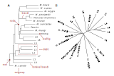
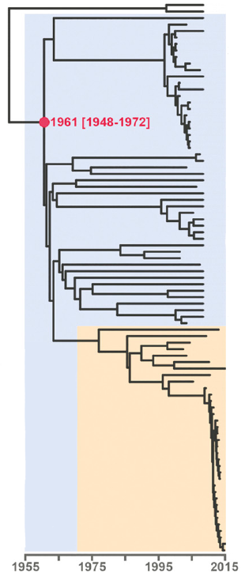
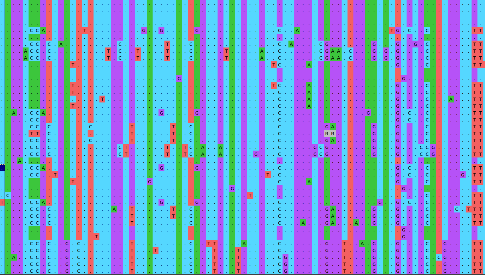
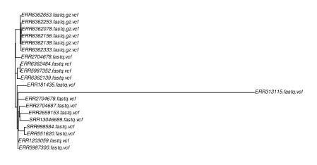
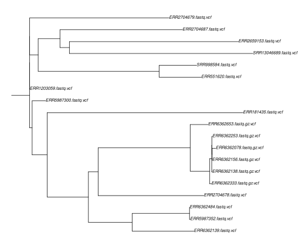
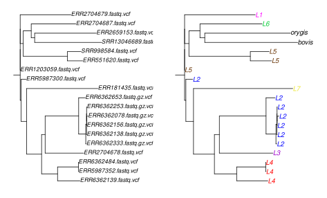
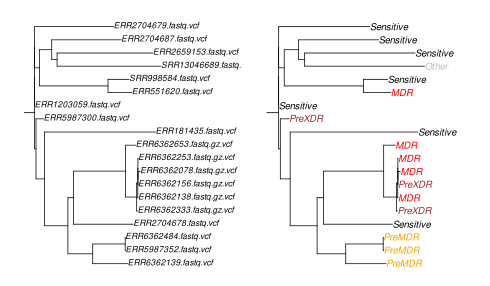
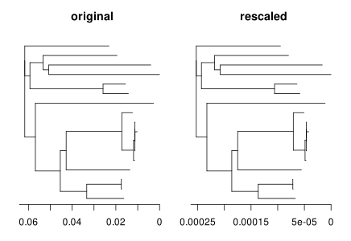
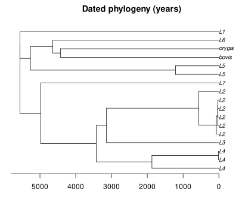

# Introduction


*"Nothing in biology makes sense except in the light of evolution."* --- Theodosius Dobzhansky, 1973

Phylogenetic trees are a tool for organizing biological diversity. Just as maps provide a spatial framework to the geographer, phylogenies provide an evolutionary context to the biologist: they capture the relationship among "things" (species, individuals, genes), represented as tips in the tree, based on common ancestry.

In evolutionary and epidemiological studies of *Mycobacterium tuberculosis*, it is now common to encounter large phylogenetic trees. Being able to read and critically examine them is extremely useful. Phylogenies can be used to understand the origin of a disease or the onset of an epidemic, to distinguish ongoing transmission from imported cases, to investigate how specific traits like antibiotic resistance evolve *et cetera et cetera*. Many research ideas originate from looking at and discussing patterns present in phylogenies.

This tutorial provides an introduction to phylogenetic trees in the context of whole genome sequencing of *Mycobacterium tuberculosis* strains. Phylogenetics is a vast topic, and we can only scratch its surface here. For those motivated to delve deeper into the topic, the [Resources section](#resources) contains links and reading suggestions.


# Basic concepts: How to read a phylogeny
Below are two phylogenies of the *Mycobacterium tuberculosis* complex (MTBC) to illustrate some basic vocabulary and concepts. If the following sounds a bit too esoteric, revisit the previous step of the course, the [introduction to phylogenetics](https://www.ebi.ac.uk/training/online/courses/introduction-to-phylogenetics/).

## Rooted trees and tree topology
These trees look rather different at a first glance, but they are identical except for one key aspect: tree A is **rooted** while tree B is not.

What is the difference between the two? First, let's state what is the same in the two trees: the tree **topology**, that is, the relative branching order. The same groupings are present in the two trees: they both contain the same information about the **relatedness** of strains. An example: TB isolated from Peruvian mummies is most similar to *M. pinnipedii* known from marine mammals; they share a most recent common ancestor. This can be seen in the rooted as well as in the unrooted tree.

The key difference between the rooted and the unrooted tree is that only the rooted tree shows the **direction** and sequence of branching events. The unrooted tree does not tell us, for example, whether *M. bovis* diverged early or late in the history of the MTBC. It is thus compatible with the old hypothesis that human TB evolved from animal TB. The rooted tree shows that this hypothesis is most likely wrong: animal-associated strains are not ancestral to human-associated strains.

The best way to root a tree is by including an **outgroup**: a species or lineage which we know *a priori* to lay outside the phylogeny we're interested in. *M. canettii* usually serves this purpose for studying the MTBC, but you can also root, for example, a phylogeny of lineage 2 by including a lineage 4 strain.

{:width="800"}


## Branch lengths
Besides relatedness and direction, a third important piece of information contained in a phylogeny is the branch length. When a phylogeny was estimated from DNA or protein sequences, branch lengths usually reflect the evolutionary distance between nodes in the tree. This information can be used to translate distance in terms of expected nucleotide changes into years, and thus to connect evolutionary change to historical events.

As branch lengths reflect evolutionary distances, they can also be used to identify transmission clusters and outbreaks. Below is a (rooted) tree of the Central Asian Clade (CAC), which is part of lineage 2 (). The orange color highlights the Afghan strain family within the CAC. At the bottom of the tree, note the clade with short branch lengths. This is how one would expect an outbreak to look in a phylogenetic tree: a set of strains clustering together and separated by extremely short branches, reflecting their almost identical genomes.

{:width="200"}


> <comment-title>Phylogenetics with <i>Mycobacterium tuberculosis</i></comment-title>
>
> Phylogenetics with MTB has some particularities rarely encountered with other organisms.
>
> 1. There seems to be **no horizontal gene transfer** (HGT) in the MTBC. HGT complicates phylogenetic inference in many bacteria because a piece of DNA introduced by HGT has a different history and thus phylogeny than genes not affected by HGT.
>
> 2. There is **little genetic diversity** in the MTBC: any two strains differ by only around 2,500 SNPs over the whole genome. To achieve a good resolution of recent evolution (e.g. during an outbreak), whole genome sequences are thus extremely useful.
>
> 3. A large proportion of DNA polymorphisms in the MTBC are **singletons**, that is, variants present only in a single strain. This adds to the problem of low diversity, since singletons are not informative about tree topology.
>
> 4. In this workshop, and indeed in many studies of the MTBC, SNPs are called not against the reference strain H37Rv, but against a reconstructed ancestral genome. This means that the number of SNPs identified does not reflect the evolutionary distance from some random strain like H37Rv, but from the most recent common ancestor of the MTBC. Take a look at Figure 3 in  to see how this affects the number of SNPs identified in a genome. Below we will see that this has implications for the interpretation of a tree.
>
{: .comment}


# The alignment
Aligned DNA or protein sequences are the starting material for phylogenetic inference with molecular data. Here we will make use of the single nucleotide polymorphisms (SNPs) you obtained in the previous [tutorial on transmission clusters](), reflecting the diversity of 19 MTBC strains and 1 strain of *M. canettii*. The latter is included as outgroup, allowing us to root the phylogeny.

Recall that the alignment here was generated using SNPs called from reference-aligned short reads. Below is a snapshot of a SNP alignment. Each row is a different strain, each column a position in the reference genome. Because this alignment is based on SNPs, it contains *only variable positions*. This is important to keep in mind. Genetic distances between strains will be hugely overestimated if we leave out all the positions which show no variation. In exercise 6 below, we will see a way to correct for this.

{:width="500"}

> <comment-title>The alternative approach: genome assembly</comment-title>
>
> A frequently used alternative approach to obtain a phylogeny from short read data is to a) assemble the genomes (see the numerous [Galaxy tutorials](https://training.galaxyproject.org/training-material/topics/assembly) on this topic), b) annotate genes, c) extract genes present in all strains (the "core" genes), d) align the core genes. This approach underlies core genome multilocus sequence typing (cgMLST), which is often used to genotype bacterial pathogens (e.g. ).
>
{: .comment}


## Get the data
> <hands-on-title>Obtain your data</hands-on-title>
>
> 1. Make sure you have an empty analysis history. Give it a name.
>
>    
>
> 2. Import the following files from [Zenodo](https://zenodo.org/record/6010176) or from the shared data library
>
>    ```
>    https://zenodo.org/record/6010176/files/SNP_alignment.fasta
>    ```
>
>    
>
> 3. Take a look at the alignment
>
>   Once the file is loaded, select it in the history on the right. Click on the 'Visualize' icon and and try both, the 'Editor' and the 'Multiple Sequence Alignment'. Can you see one of the MTBC particularities mentioned above, the predominance of singletons? How many sites are there in the alignment? Also take a look at the M. canettii sequence: being the outgroup, it has a large number of SNPs.
>
{: .hands_on}

# Estimate a phylogeny
There are numerous methods to infer phylogenetic trees, but the most frequently used with large-scale molecular data are based on maximum likelihood and Bayesian inference. The details of how these methods construct trees from an alignment are beyond the scope of this introductory course. To be able to read trees, it is not necessary to know the statistical and computational details of how the trees are estimated. The books listed in the [Resources](#resources) section provide in-depth introductions into the different principles of phylogenetic inference, in particular Baum & Smith 2013 and Yang 2014.

In this tutorial, we will use the maximum likelihood method [RAxML](https://cme.h-its.org/exelixis/web/software/raxml/) to estimate a phylogenetic tree for the 20 strains.

An aspect we ignore in this tutorial is the uncertainty involved in phylogenetic inference. While RAxML will deliver a single tree, not all aspects of this tree are equally well supported by the data. This uncertainty can be quantified through **bootstrapping**, a procedure where a large number of trees are estimated from random samples of the original data. If a certain split in the original tree is present in all the bootstrapped trees, then we can be confident about this split. Published phylogenies should always include a measure of uncertainty, while for this tutorial you will have to believe me that we are looking at a solid phylogeny...

## Hands-on
> <hands-on-title>Estimate a phylogeny for 20 MTBC strains</hands-on-title>
>
> 1.  with the following parameters:
>    -  *"Source file with aligned sequences"*: `output` (Input dataset)
>    - *"Model type"*: `Nucleotide`
>    - *"RAxML options to use"*: `Required options only`
>
> 2. The RAxML output we are interested in is the "Best-scoring ML tree". Select it in you Galaxy history and take a look at it with the different visualization options offered by Galaxy.
>
{: .hands_on}


# Visualize and manipulate the tree
Phylogenetic trees are great tools because they are at the same time quantitative (we can do calculations on branch lengths, estimate uncertainty of a tree topology etc.) and visually appealing, allowing to actually "see" biologically interesting patterns. Often this requires some tweaking of the tree, for example by coloring parts of the tree according to some background information we have about the samples.

We will use R to plot and manipulate the phylogeny obtained from RAxML. The code to produce the figures is shown in the boxes below. You can execute it by starting RStudio within Galaxy, as explained in the box below. This is **not required to finish this tutorial**, the different trees resulting from executing the code are shown below. But if you have used R before, it might be worthwhile to go through the code, modify it, and explore the numerous phylogenetics packages and functions in R.

> <hands-on-title>Starting RStudio</hands-on-title>
>
> 1. Note the history number of the "Best-scoring ML tree"
>
> 2.  in Galaxy provides some special functions such as `gx_get` to import and export files from your history.
>
>    
>
> 3. Install the [ape R package](https://cran.r-project.org/web/packages/ape/index.html)
>    - Click on the **Terminal** tab (top of the Rstudio window)
>         - Execute the command: `conda install r-ape`
>    - Once done, switch back to the **Console** tab
>         - Type: `library("ape")`
>         - You might get a warning about R versions, we can ignore that in our case.
>
{: .hands_on}

## Plot the RAxML output
The RAxML output includes the "Best-scoring ML tree" in your Galaxy history. The code below imports this tree into a Galaxy instance of RStudio and plots the tree.

```r
# Load ape, an R package for phylogenetics
library(ape)

# Load the tree from Galaxy: in the first line below, replace x with the number of the "Best-scoring ML tree" in your Galaxy history (see box above).
treefile <- gx_get(x)
tree <- read.tree(treefile)

# Plot the tree
plot(tree)

```
{:width="600"}

> <question-title>Exercise 1</question-title>
>
> 1. Take a look at the tree generated by RAxML. Is it rooted or unrooted? What is the strain far apart from all other strains?
>
> > <solution-title>1</solution-title>
> >
> > 1. The tree is unrooted, and the outlier strain is *M. canettii*, our outgroup. The much longer branch leading to this strange shows that many SNPs separate *M. canettii* from the common ancestor of the MTBC.
> >
> {: .solution}
>
{: .question}


## Root the tree
To make the phylogeny better interpretable, we will now root it and add some additional information. First, we root the tree and then exclude the canettii strain, such that patterns within the MTBC become more clear.

```r
# Root the tree
tree_rooted <- root(tree, "ERR313115.fastq.vcf")

# Remove the outgroup to make distances within MTB more clear
tree_rooted <- drop.tip(tree_rooted, "ERR313115.fastq.vcf")
tree_rooted$root.edge <- 0.005
plot(tree_rooted, root.edge = T, cex=0.6)
```

{:width="600"}

This already looks better, the tree topology stands out more clearly now, and we can identify groups of closely related strains.

## Show the different lineages present in the sample
A first piece of information we now want to add to the phylogeny is to which lineage the strains belong. This will allow us to assess whether our tree is consistent with the known phylogeny of the MTBC, shown in Figure 1A, and to visualize which lineages are present in our sample. The information to which lineage a strain belongs can be found in the output of TB-profiler, as obtained in the [tutorial on TB variant analysis]().

```r
# Assign lineages to samples, as identified by TB-profiler

mtbc_lineages <- c(
"ERR181435.fastq.vcf" = "L7",
"ERR313115.fastq.vcf" = "canettii",
"ERR551620.fastq.vcf" = "L5",
"ERR1203059.fastq.vcf" = "L5",
"ERR2659153.fastq.vcf" = "orygis",
"ERR2704678.fastq.vcf" = "L3",
"ERR2704679.fastq.vcf" = "L1",
"ERR2704687.fastq.vcf" = "L6",
"ERR5987300.fastq.vcf" = "L2",
"ERR5987352.fastq.vcf" = "L4",
"ERR6362078.fastq.gz.vcf" = "L2",
"ERR6362138.fastq.gz.vcf" = "L2",
"ERR6362139.fastq.vcf" = "L4",
"ERR6362156.fastq.gz.vcf" = "L2",
"ERR6362253.fastq.gz.vcf" = "L2",
"ERR6362333.fastq.gz.vcf" = "L2",
"ERR6362484.fastq.vcf" = "L4",
"ERR6362653.fastq.gz.vcf" = "L2",
"SRR998584.fastq.vcf" = "L5",
"SRR13046689.fastq.vcf" = "bovis"
)

# Create tree with lineage as tip label instead of strain name

tree_lineages <- tree_rooted
tree_lineages$tip.label <- as.character(mtbc_lineages[tree_rooted$tip.label])

# Define some colors for the lineages

color_code_lineages = c(
  L1 = "#ff00ff",
  L2 = "#0000ff",
  L3 = "#a000cc",
  L4 = "#ff0000",
  L5 = "#663200",
  L6 = "#00cc33",
  L7 = "#ede72e",
  bovis="black",
  orygis="black")

pal_lineages <- as.character(color_code_lineages[tree_lineages$tip.label])

par(mfrow = c(1, 2))
plot(tree_rooted,cex = 0.7, root.edge = T)
plot(tree_lineages,cex = 0.8, tip.color = pal_lineages, root.edge = TRUE)

```

{:width="600"}


> <question-title>Exercise 2</question-title>
>
> Looking at the different lineages present in the tree, does our phylogeny make sense? Or asked differently: does our phylogeny show the same branching patterns between lineages as the established phylogeny in Fig. 1A?
>
> > <solution-title>2</solution-title>
> >
> > There is indeed a problem with our phylogeny: one L2 and one L5 strain do not cluster with the other strains of these lineages. Instead, they appear near the root of the tree, with very short (ERR5987300) to non-existent (ERR1203059) branches. Other parts of the tree are consistent with Fig. 1A, suggesting that we can focus our first round of troubleshooting on these two strains.
> >
> {: .solution}
>
{: .question}

> <question-title>Exercise 3</question-title>
>
> An important part of bioinformatics consists in trying to find out whether a surprizing observation has biological significance --- or reflects a mistake somewhere in the numerous steps leading to the result. Have we just discovered two new lineages of MTB, or did we commit a stupid mistake? To find out, take a look a the TB-profiler and the VCF files for the two strange strains, which should be present in your Galaxy history from the previous tutorials. Compare them with "normal" strains. Do you notice something?
>
> > <solution-title>3</solution-title>
> >
> > The VCF files hold an important hint to explain our puzzling observation: ERR1203059.vcf contains not a single SNP, ERR5987300.vcf only 81 SNPs. By contrast, the other strains have between 750 and 1250 SNPs. What happened here? To find out, we would have to take a closer look at the steps leading from BAM to VCF files. One possibility is that the sequencing depth for these samples was so low that most SNPs were filtered out because they did not pass the quality filtering.
> >
> {: .solution}
>
{: .question}

> <question-title>Exercise 4</question-title>
>
> Recall the clusters identified in the previous tutorial, reproduced below. How do these clusters show up in the phylogenetic tree? What additional information does the tree contain?
>
> | Sample       | Cluster_id | DR profile | Clustering  |
> |--------------|------------|------------|-------------|
> | ERR5987352   | 10         | Pre-MDR    | Clustered   |
> | ERR6362484   | 10         | Pre-MDR    | Clustered   |
> | ERR6362138   | 12         | MDR        | Clustered   |
> | ERR6362156   | 12         | Pre-XDR    | Clustered   |
> | ERR6362253   | 12         | MDR        | Clustered   |
>
> > <solution-title>4</solution-title>
> >
> > Clusters 10 and 12 appear as clades of closely related strains in the phylogeny: cluster 12 being part of lineage 2, cluster 10 of lineage 4. The phylogeny additionally reveals that cluster 12 is part of a larger clade of rather closely related lineage 2 strains. While clustering with a fixed SNP threshold produces a binary outcome (clustered/unclustered), the phylogeny reveals the gradual nature of relatedness. With a more permissive SNP threshold for clustering, or a different pipeline to call SNPs, we might well identify a larger cluster of L2 strains.
> >
> {: .solution}
>
{: .question}


## Map a trait onto the tree

Phylogenies are particularly useful when combined with additional information. For our 19 MTB strains, for example, we might know such things as the country of origin, the sampling date, or various phenotypes determined in the lab, for example the virulence of the strains in an animal model. By mapping this additional information onto the phylogeny, we can gain insights into how, where and when these traits evolved.

For our 20 samples, a trait you previously identified is the DR profile. Let us map this trait onto the tree and see if we can learn something from the observed patterns.


```r
# Same as above, but with DR profiles instead of lineages

mtbc_dr <- c(
"ERR181435.fastq.vcf" = "Sensitive",
"ERR313115.fastq.vcf" = "Sensitive",
"ERR551620.fastq.vcf" = "MDR",
"ERR1203059.fastq.vcf" = "Sensitive",
"ERR2659153.fastq.vcf" = "Sensitive",
"ERR2704678.fastq.vcf" = "Sensitive",
"ERR2704679.fastq.vcf" = "Sensitive",
"ERR2704687.fastq.vcf" = "Sensitive",
"ERR5987300.fastq.vcf" = "PreXDR",
"ERR5987352.fastq.vcf" = "PreMDR",
"ERR6362078.fastq.gz.vcf" = "MDR",
"ERR6362138.fastq.gz.vcf" = "MDR",
"ERR6362139.fastq.vcf" = "PreMDR",
"ERR6362156.fastq.gz.vcf" = "PreXDR",
"ERR6362253.fastq.gz.vcf" = "MDR",
"ERR6362333.fastq.gz.vcf" = "PreXDR",
"ERR6362484.fastq.vcf" = "PreMDR",
"ERR6362653.fastq.gz.vcf" = "MDR",
"SRR998584.fastq.vcf" = "Sensitive",
"SRR13046689.fastq.vcf" = "Other"
)

tree_dr <- tree_rooted
tree_dr$tip.label <- as.character(mtbc_dr[tree_rooted$tip.label])

color_code_dr = c(
  Sensitive = "#ff00ff",
  PreXDR = "#0000ff",
  PreMDR = "#a000cc",
  MDR = "#ff0000",
  Other = "#663200")

pal_dr <- as.character(color_code_dr[tree_dr$tip.label])

par(mfrow = c(1, 2))
plot(tree_rooted,cex = 0.7, root.edge = T)
plot(tree_dr,cex = 0.8, tip.color = pal_dr, root.edge = TRUE)

```

{:width="600"}

> <question-title>Exercise 5</question-title>
>
> In the previous tutorial on clustering, you have come across the hypothesis that unclustered cases of DR represent *de novo* evolution of DR, while clustered cases of DR represent instances of DR transmission. Looking at lineage 2 in the phylogeny above, does this hypothesis hold? How many times would MDR have evolved independently in lineage 2? Is there an alternative explanation for the prevalence of MDR in lineage 2?
>
> > <solution-title>5</solution-title>
> >
> > MDR would have evolved three times according to the clustering perspective mentioned above: once in cluster 12, once in ERR6362078, and once in ERR6362653. The phylogeny suggest a simpler alternative: MDR could have been already present in the common ancestor of the six L2 strains in our sample; it could have evolved only once, along the long branch leading from the split from lineage 3 to the most recent common ancestor of the six samples. This picture, however, might change with a more extensive sampling of lineage 2. Six samples are hardly sufficient to make claims about the prevalence and evolution of MDR in lineage 2. As for the interpretation of clustering, sampling design is crucial for the interpretation of phylogenies and should always be kept in mind in order to avoid overinterpretation.
> >
> {: .solution}
>
{: .question}


## Date the phylogeny (advanced)

As a last exercise, we are going to put a timescale on our phylogeny, assuming that mutations accumulate in a regular, clock-wise manner. In the tree, phylogenetic distance = time*rate. As we know the phylogenetic distance, we can get an estimate of time by assuming a mutation rate. This sounds simple in theory, but will require some big assumptions:

- As noted above, the starting alignment only contains variable positions, phylogenetic distances in the trees are thus overestimated. To correct for this, we assume that all other sites in the genome are invariant, and rescale branch lengths according to ``rescaled branch lengths = (branch lengths * alignment length) / genome size``, as in .

- We assume that all strains were sampled at time point 0, in the present.

- We assume a mutation rate of 2.01e-10 mutations per site per generation ()

- To translate generations into years, we assume 200 generations per year.


```r
# Rescale branch lengths (here called edge lenghts)
genome_size = 4411532
alignment_length = 18077
invariant_sites = genome_size - alignment_length

tree_rescaled <- tree_rooted
tree_rescaled$edge.length <- ((tree_rescaled$edge.length * alignment_length) / genome_size )
tree_rescaled$root.edge <- ((tree_rescaled$root.edge * alignment_length) / genome_size )

par(mfrow = c(1, 2))
plot(tree_rooted,cex = 0.7, root.edge = T, main = "original")
axisPhylo()
plot(tree_rescaled,cex = 0.7,root.edge = T, main = "rescaled")
axisPhylo()
dev.off()

```
Look at the scale bars of the two trees. Accounting for invariable sites has a huge effect on phylogenetic distances!

{:width="600"}


```r
# Let's also remove the two outlier strains, they would cause troubles and are anyway useless
tree_rescaled <- drop.tip(tree_rescaled, c("ERR1203059.fastq.vcf", "ERR5987300.fastq.vcf"))

# Estimate dates: translate phylogenetic distance into years by assuming a mutation rate and the number of generations per year
mutation_rate = 2.01e-10
generations_per_year = 200

## Ape has a function, estimate.dates(), to date a tree by assuming a specific mutation rate
node.date <- estimate.dates(
  tree_rescaled,
  node.dates = rep(0, length(tree_rescaled$tip.label)), # set sampling dates to 0
  mu = (mutation_rate * generations_per_year) # mutation rate per year
  )

tree_rescaled$edge.length <- node.date[tree_rescaled$edge[, 2]] - node.date[tree_rescaled$edge[, 1]]
tree_rescaled$tip.label <- as.character(mtbc_lineages[tree_rescaled$tip.label])

plot(tree_rescaled, cex = 0.6, main = "Dated phylogeny (years)")
axisPhylo()
```

{:width="600"}

> <question-title>Exercise 6 (advanced)</question-title>
>
> 1. What could be the problem with the assumption that all sites in the reference genome which do not appear in our SNP alignment are invariable?
>
> 2. Imagine that a recent breakthrough study has found that the mutation rate in MTB is 10 times higher than we assumed. How would this change the estimated dates?
>
> > <solution-title>6</solution-title>
> >
> > 1. About 5 % of the MTB reference genome consists of repetitive or otherwise complicated regions where mapping and SNP calling cannot be done reliably. Most SNP calling pipelines exclude such regions, also the one used in this course. Rather than to assume that these regions are invariant, we should ignore them in our calculations. By not doing this, genomes seem more similar than they are; we underestimate phylogenetic distances.
> >
> > 2. A rate 10 times higher implies that there will be 10 times more mutations observed in the same time span, or, the other way around, that it will take a time span 10 times shorter to observe the same number of mutations. The timescale of the phylogeny would thus shift one order of magnitude, to hundreds rather than thousands of years. As this example shows, there are considerable uncertainties associated with molecular dating. This is also true for more sophisticated methods (see  for a recent discussion of molecular dating with MTB).
> >
> {: .solution}
>
{: .question}


# Resources
To develop a deeper understanding of phylogenetic trees, there is no better way than estimating phylogenies yourself --- and work through a book on the topic in your own mind's pace.

## Books
- *Phylogenetics in the genomics era*, 2020. An [open access book](https://hal.inria.fr/PGE) covering a variety of contemporary topics.
- *Tree Thinking*, 2013, by David A. Baum & Stacey D. Smith
- *Molecular Evolution*, 2014, by Ziheng Yang

## Useful links
- [MEGA Software](https://megasoftware.net/)
- [Tutorial on how to read a tree, with a virus example](https://artic.network/how-to-read-a-tree.html)
- [Tree Of Life web project](http://tolweb.org)
- [Phylogenetic Inference in the Stanford Encyclopedia](https://plato.stanford.edu/entries/phylogenetic-inference/)
