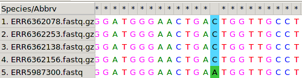
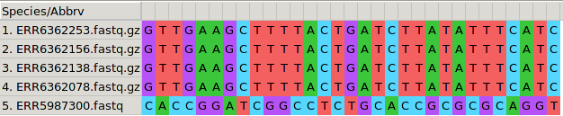
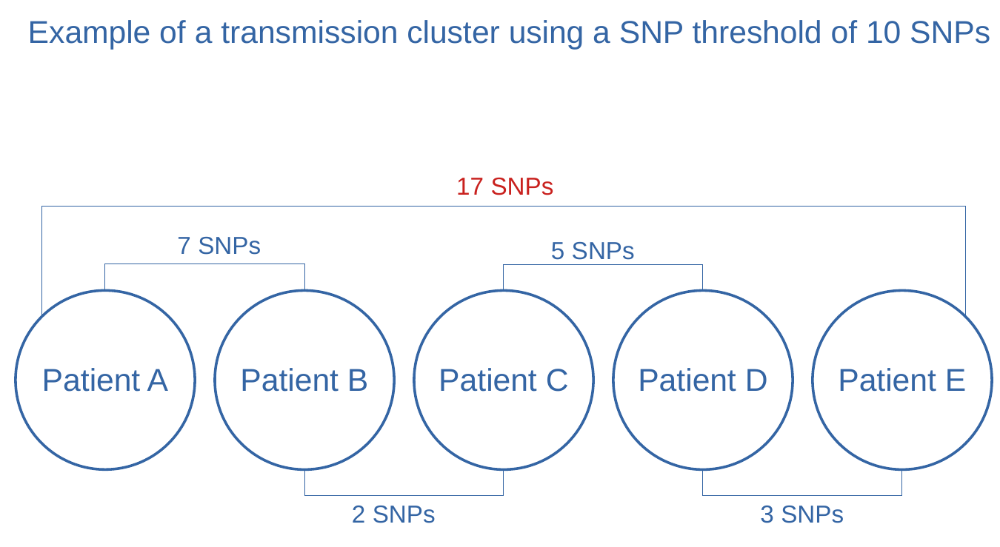

# Pre-requisites
This tutorial assumes that you have watched the respective webinars about ([Drug resistance prediction](https://youtu.be/Ddwt-_gQR2M), [Phylogenetic mutations](https://youtu.be/1ps_o5rpnmw), [The concept of clustering](https://youtu.be/l4cPUECJ7VU) and
  [Genetic distance thresholds](https://youtu.be/kKNgmpy1N94)) and therefore you understand 1) How genotypic drug susceptibility is determined
based on WGS analysis 2) The concept of clustering. It also assumes that you have completed the tutorial on [MTB variant analysis](https://training.galaxyproject.org/training-material/topics/variant-analysis/tutorials/tb-variant-analysis/tutorial.html).

# Introduction


Now you are familiar with the process of genome sequencing, quality control of sequencing data, mapping and
variant calling. Additionally, you know how to run `TB-profiler` in order to detect drug resistance-conferring
mutations and predict drug-resistant phenotypes. However you have only analyzed one sample unrelated to our study for the purpose of
learning. Before starting the transmission analysis, we would need to analyze the 20 samples that we
have been asked to analyze. The process to follow is exactly the same for any sample, meaning that
we would need to analyze the 20 samples following the same steps... twenty times??? Of course not.

The way you can perform the same analysis tasks on multiple samples at a a time in Galaxy (being it
a simple step like running Trimmomatic, or a complete analysis pipeline composed of many different steps)
is by using `Dataset collections`. To know more about dataset collections,
you can [have a look at the following material](https://galaxyproject.org/tutorials/collections/), however the idea is very simple:
all samples to be analyzed are merged into a "dataset collection", and then you analyze that "collection"
as you would analyze a single sample, with the difference that all steps will be performed for each
sample individually. Do not worry if you do not fully understand this right now, we will be creating
a dataset collection at the beginning of this tutorial and we will analyze it.

To save you some time, (and server load) we have run the pipeline that you used in the previous tutorial for
the 20 samples that we want to analyze. Thus, we now have 20 VCF files that describe the
mutations found for each of the samples. **These 20 VCFs files will be the starting point of this tutorial.**
 If you want to perform the mapping and variant calling for
all of the samples, feel free to do it. You can find the respective [FASTQ files here](https://zenodo.org/record/5911437), and
the [Galaxy workflows used here](./workflows/Galaxy-Workflow-From_Fastqs_to_VCFs_and_BAMs.ga). However this is completely optional,
and we suggest you to do it after you have finished all the tutorials of this workshop.

Before starting, bear in mind that this tutorial assumes that you watched the respective webinars of
this lesson

> <agenda-title></agenda-title>
>
> In this tutorial, we will cover:
>
> 1. TOC
> {:toc}
>
{: .agenda}

# Get the data
As mentioned in the introduction, we have performed mapping and variant calling for the 20 samples
that we need to analyze. The result are the respective 20 VCF files that describe the mutations found
for each of the samples. Before starting the analysis of such mutations, we will need to import them
into Galaxy:
> <hands-on-title>Data upload</hands-on-title>
>
> 1. Create a new history for this tutorial
> 2. Import the files from [Zenodo]({{ page.zenodo_link }}) or from
>    the shared data library (`GTN - Material` -> `{{ page.topic_name }}`
>     -> `{{ page.title }}`):
>    Import the VCF files containing the variants of each sample
>
>    ```
>    https://zenodo.org/record/6010176/files/ERR1203059.vcf
>    https://zenodo.org/record/6010176/files/ERR181435.vcf
>    https://zenodo.org/record/6010176/files/ERR2659153.vcf
>    https://zenodo.org/record/6010176/files/ERR2704678.vcf
>    https://zenodo.org/record/6010176/files/ERR2704679.vcf
>    https://zenodo.org/record/6010176/files/ERR2704687.vcf
>    https://zenodo.org/record/6010176/files/ERR313115.vcf
>    https://zenodo.org/record/6010176/files/ERR551620.vcf
>    https://zenodo.org/record/6010176/files/ERR5987300.vcf
>    https://zenodo.org/record/6010176/files/ERR5987352.vcf
>    https://zenodo.org/record/6010176/files/ERR6362078.vcf
>    https://zenodo.org/record/6010176/files/ERR6362138.vcf
>    https://zenodo.org/record/6010176/files/ERR6362139.vcf
>    https://zenodo.org/record/6010176/files/ERR6362156.vcf
>    https://zenodo.org/record/6010176/files/ERR6362253.vcf
>    https://zenodo.org/record/6010176/files/ERR6362333.vcf
>    https://zenodo.org/record/6010176/files/ERR6362484.vcf
>    https://zenodo.org/record/6010176/files/ERR6362653.vcf
>    https://zenodo.org/record/6010176/files/SRR13046689.vcf
>    https://zenodo.org/record/6010176/files/SRR998584.vcf
>    ```
>
>    We will also need the reference genome that was used for SNP calling
>
>    ```
>    https://zenodo.org/record/3497110/files/MTB_ancestor_reference.fasta
>    ```
>
> 3. Finally  Create a **Dataset List (Collection)** for all the VCFs.
>
>    Use a meaningful name, for example **MTB VCFs**.
{: .hands_on}

> <tip-title>Tip</tip-title>
> To create a dataset collection:
> - Click on the box under the history name (bottom right) that says "Operations on multiple datasets"
> - Tick all 20 VCFs files that we just imported.
> - In the "For all selected..." box, select "Build Dataset List"
> - You can also [watch this one minute video](https://www.youtube.com/watch?v=F3qNs1_675g) about how to create collections
{: .tip}


# Generate a SNP alignment

In this tutorial we aim to calculate the genetic differences (in SNPs) between pairs of MTB genomes.
To do so, we need to compare, between each pair of genomes (thus pairwise), the nucleotides that are
observed at each position. Each time we find a different nucleotide at a given position, we will sum
1 SNP of genetic distance. For example, if two strains have a genetic distance of 5 SNPs, that would
mean that their respective genomes are almost identical, except for 5 positions along all the genome
in which they have different nucleotides.

To do such calculation we need to first build an alignment of all the genomes (multiple-sequence
  alignment, or MSA). Afterwards, we will use specific software to analyze this MSA, count SNPs,
  and thus calculate the genetic distance between each pair of samples.



## Generate complete genomes
The first step to generate the genomes MSA will be... to get the complete genomes of our samples!
In the [MTB Variant Analysis tutorial]() we have analyzed short-read high-throughput sequencing data (Illumina) to
obtain the respective VCF files that describe the mutations found in each of our samples, as compared
to the reference genome. We can now use these VCF files to build the complete genome of each of our
samples.

### Filter VCF files for epidemiological/phylogenetic investigation
Interpreting **mixed calls** or **indels** in phylogenetic/epidemiological applications can be very
complicated. That is the reason why we tipically use alignments that only contain **fixed SNPs**.

Thus, the first step in this tutorial will be to filter the VCFs so we are sure that
they only contain **fixed SNPs**. As it was introduced in day 2 webinar [Mapping and Variant calling](https://youtu.be/38GUBKwWXv8), we will consider fixed
those variants at a frequency equal or greater than 90%. We will be using here the tool
**TB Variant Filter**.

*Note: TB variant Filter refers to SNPs as SNVs. These two short forms are interchangeable, meaning **S**ingle **N**ucleotide **P**olymorphism and **S**ingle **N**ucleotide **V**ariant, respectively.*

> <hands-on-title>Filter VCF files for epidemiological investigation</hands-on-title>
>
> 1.  with the following parameters:
>    -  *"VCF file to be filter"*: `MTB VCFs` (Select Dataset Collection instead of Single Dataset)
>    - *"Filters to apply"*: `Only accept SNVs`, `Filter variants by percentage alt allele`
>    - *"Show options for the filters"*: `Yes`
>    - *"Minimum alternate allele percentage to accept"*: `90.0`
>
{: .hands_on}

> <question-title></question-title>
>
> **`TB Variant Filter`** reads the VCF and output only SNPs that have, at least, 90% frequency.
> How can this sofware extract such information from the VCF files?
>
> > <solution-title></solution-title>
> >
> > That information is contained, for each mutation, in the VCF:
> > - The `TYPE` field within the INFO string will tell us if the mutation is a SNP (TYPE=snp)
> > - You can look for other types of mutations like insertions (TYPE=ins)
> > - The `AF` field within the INFO string describes the estimated **A**llele **F**requency
> > - An alterntive way to calculate it, would be to divide the number of observations of the
> > alternate allele (`AO`) by the total depth at that position (`DP`)
> {: .solution}
>
{: .question}

### Reconstruct the complete genome of each sample with **bcftools consensus**
Our VCF files now only contain **fixed SNPs** that were found in the genome of the respective strains.
Genomic positions not in the VCF mean that, at that particular position, the strain has the
same nucleotide than the reference genome. Knowing this information, one could reconstruct the
complete genome of each strain pretty easily. From the first to the last position in the genome,
one would put the same nucleotide than in the reference if that position is not in the VCF, or the
SNP described in the VCF otherwise. This is exactly what `bcftools consensus` will do for us,
given the reference genome and the VCF of the strain we want to reconstruct the genome for.

https://usegalaxy.eu/root?tool_id=toolshed.g2.bx.psu.edu/repos/iuc/bcftools_consensus/bcftools_consensus/1.9+galaxy2

> <hands-on-title>Reconstruct the complete genome of each sample</hands-on-title>
>
> 1.  with the following parameters:
>    -  *"VCF/BCF Data"*: `MTB VCFs filtered` (output of **TB Variant Filter** )
>    - *"Choose the source for the reference genome"*: `Use a genome from the history` (The reference genome that was used for SNP-calling)
>        -  *"Reference genome"*: `(MTB_ancestor_reference.fasta)`
>        -  *"Set output FASTA ID from name of VCF"*: `Yes`
>
{: .hands_on}

> <question-title></question-title>
>
> Imagine that we forgot to filter the VCFs to contain only fixed variants, and there are also
> SNPs with frequencies, of 15%, 30%, or 56.78%. Which allele do you think bcftools consensus would
> insert in the genome?
>
> > <solution-title></solution-title>
> > The behaviour of bcftools consensus in this case can be specified with the option `--haplotype`
> > For example, we can set `haplotype=2` so the second allele will be used... wait... what?
> {: .solution}
{: .question}

> <question-title>Second allelle!?</question-title>
>
> What do you think that things like "second allele" or "*The* alterntive allele" mean here?
>
> > <solution-title></solution-title>
> > Many of the bioinformatic programs are developed to analyze eukaryotic genomes, particularly
> > human genomes. That means that these programs have in mind that the genomes
> > are diploid and thus each posible position in the genome has two possible alleles. In
> > bacterial genomics, in contrast, we are **always sequencing a population** of cells with
> > potential genetic diversity (with the exception of single-cell sequencing).
> > That does not mean that we cannot use this type of software, we can (and we do!) but it is
> > good to know what they are ment for, and their possible limitations
> {: .solution}
{: .question}

## Multiple-sequence alignment (MSA) of all genomes
Multiple sequence alignment is a process in which multiple DNA, RNA or protein sequences are arranged
to find regions of similarity that are supposed to reflect the consequences of different evolutionary
processes (Figure 1). MSAs are used to test hypotheses about this evoluitionary processes and infer phylogenetic
relationships, and for these reasons we build MSA for sequences for which we already assume some sort
of evolutionary relationship. You will learn more on MSAs and phylogenetic inference in the next
tutorial.

Building MSAs of several complete genomes can be a complicated process and computationally demanding. To perform
such task there are many software packages available like `Muscle`, `MAFFT` or `Clustal` just to mention some.
Which one are we going to use in this tutorial? Well, we are going to use a trick. We are going to
just stack one genome on top of each other within a text file. (More on why we can do this below).

Our aim is to generate a **multifasta** file in which the genomes of our samples are aligned.
Something that looks like this:

```
>Sample 1
TTGACCGATGACCCCGGTTCAGGCTTCACCACAGTGTGGAACGC...
>Sample 2
ATGACCGATGACCCCGGTTCAGGCTTCACCACAGTGTGGAACGC...
>Sample 3
TTCGTTCGATGACCCCGGTTCAGGCTTCACCACAGTGTGGAACG...
```

This could be done manually, by copy-pasting all genomes in a single text file.
However we can do the same with a specific command that *concatenates* files.

### Build a multiple-sequence alignment from complete genomes with "**Concatenate datasets**"

> <hands-on-title>Concatenate genomes to build a MSA</hands-on-title>
>
> 1.  with the following parameters:
>    -  *"Datasets to concatenate"*: `Dataset collection` (output of **bcftools consensus** )
>
> 2. The output of **concatenate datasets** may be of type tabular. Make sure Galaxy sees this file as
>    a fasta file by editing its attributes. Click in the pencil icon, select "Datatypes" and then select fasta.
>
{: .hands_on}

Now we have a multifasta file, where **each position of each genome corresponds to the same position
of the rest of genomes in the file**. This can be seen and used as a multiple-sequence alignment of
all of our genomes! However, it is important that you understand the following question...

> <question-title></question-title>
>
> Generating multiple-sequence alignments can be complicated and computationally demanding, and there are
> many software packages to perform such task. How is then possible that we were able to build a MSA by just
> stacking genomes one on top of each other? Can you think about what makes our case special, so we can
> just use this "trick"?
>
> > <solution-title></solution-title>
> >
> > We have generated the complete genome of each sample by substituting in the reference genome
> > those **SNPs** that we found in that said sample (described in the VCF). Remember that **we
> > removed indels from the VCF when filtering!** Because the complete genomes we generated do not
> > contain insertions or deletions, ALL the genomes have the same length (the length of the
> > reference genome) and each nucleotide corresponds to the same genomic coordinate (the one
> > also in the reference genome). So we are not aligning genomes *per se* but, knowing this, we
> > can build a MSA by just stacking genomes that **are the same length >>AND<< have the same coordinates**.
> {: .solution}
>
{: .question}

### Remove invariant positions with **Finds SNP sites**

We have generated a MSA that is the basis for the transmission (clustering) and phylogenetic
analysis. Although we could already use this MSA for such analysis, it is common practice to remove
the invariant sites from the alignment. Think that our file now contains 20 genomes of 4.4 Mb each.
MTB genomes have a very low genetic diversity, meaning that in reality, there are only some hundreds or
thousands of SNPs *in total*, because the genomes are >99% identical between them. Identical positions
in a MSA provide no information, so we can remove those and
generate a **SNP alignment** that only contain variant positions with phylogenetic information. By
doing this, we will generate a much smaller file, that will be easier to handle by downstream applications.

We can exemplify this with a couple of pictures:

In the following picture, a polymorphic position in the alignment (SNP)
is highlighted in blue and green. Invariant positions are not highlighted and have an asterisc `*`
on the upper part of the alignment. Most of the MSA is composed of these invariant positions, making
our file larger than necessary.


After removing invariant positions, we end up with a SNP alignment like the following.



> <hands-on-title>Removing invariant sites from a MSA</hands-on-title>
>
> 1.  with the following parameters:
>    -  *"FASTA file"*: `Single dataset` (output of **Concatenate datasets** )
>    - *"Output"*: `Sequence alignment / VCF`
>        - *"Output formats"*: `Multi-FASTA alignment file`
>
{: .hands_on}

In SNP alignments you have to **bear in mind that positions do not longer correspond to genomic
coordinates**, meaning that two contiguous nucleotides may correspond to coordinates thousands of
positions apart.

# Identify transmission clusters

## Calculate pairwise SNP distances
Now we are all set to calculate pairwise SNP distances between samples and decide whether two
patients are within the same transmission cluster or not. Having a SNP alignment, this is fairly
easy. We will use **SNP distance matrix**, that will generate a matrix with pairwise SNP distances.

> <hands-on-title>Distance matrix from SNP alignment.</hands-on-title>
>
> 1.  with the following parameters:
>    -  *"FASTA multiple sequence alignment"*: `Single dataset` (output of **Finds SNP sites** )
>
>    > <comment-title></comment-title>
>    >
>    > Have a look at the distance matrix to make sure you understand the whole process. Given that
>    > we only have 20 samples, you could already spot some samples that are involved in the same
>    > transmission chain (samples with a small number of SNPs between them as explained below).
>    {: .comment}
>
{: .hands_on}

## Determine transmission clusters based on a SNP threshold
Now that we have a distance matrix that describes the SNP distance between each pair of samples, we
could already describe the transmission clusters based on a **SNP threshold**, as [explained in the
respective webinar](https://youtu.be/kKNgmpy1N94) . If two samples are at a distance below that threshold, we will say that they
belong to the same transmission cluster, because they are close enough genetically speaking. Again,
we could do this manually, but we are doing bioinformatics, and we want to be able to do the same
analysis regardless of whether we are analyzing two or two million samples. Also, **note that two samples
that are dozens of SNPs apart may belong to the same transmission cluster** if there are other samples
linking them in between as exemplified in the picture below.




> <question-title>Very Important Question</question-title>
>
> 1. In the image above exemplifying a transmission cluster, the distance between samples A and E is
> 17 SNPs. Being the other pairwise distances in the figure the same,
> would it be possible that the distance between A and E is different?
>
> > <solution-title></solution-title>
> >
> > 1. The figure used above as an example is a **flagrant oversimplification**. In the figure not all pairwise
> > distances are represented (for example between sample A and C).
> > Most importantly you have to remember that **transmission clusters do not reflect transmission
> > events**.
> > In fact it may happen that transmission does not happen within the cluster we are analyzing!
> > For example, when a patient that is not sampled is the source of infection of all the cases in
> > the cluster (may be a superspreading event). You have to consider that, taking into account the
> > same SNP distances, another possible (yet still oversimplified) scenario could be...
> > 
> {: .solution}
{: .question}


## Determine transmission clusters using Rscript

Currently there is not tool in Galaxy to perform the exact task that we need (although we plan to
include it!).  So far, we can use `R` and the library `cluster` within Galaxy to perform such task.
Again, don't worry about this, programming in `R` is beyong the scope of this workshop, but if you
have some `R` or other programming language knowledge, or if you plan to learn in the future, you could
also reuse this code for your own analyses.

First you will need to open Rstudio within Galaxy. To do this look for Rstudio in the tool panel,
click on it and click on `execute`. Rstudio will appear in your story as a job that is being continously
executed. This is the normal behaviour because, indeed, Rstudio is now being executed and will only
stop once we have finish using it.

To access your Rstudio instance within Galaxy, go to *User>Active Interactive Tools* in the top center
panel. Now click on the link `Rstudio` that appears below *Name*. The status below *Job Info* should be `running`.

Wait for Rstudio to open, and copy-paste the following code in the Console of Rstudio (left panel):

**IMPORTANT**: Note the third line of the next block of code, where it reads:
`distance <- gx_get(Galaxy history ID)`
In this part is where we are importing the SNP distance matrix generated in Galaxy into
R. You need to take note of the history ID of the step that generated the SNP distance
matrix. For example, imagine that in our story says *198: SNP distance matrix on data 197*.

Then the history ID is *198*, and the block of code should be:

```r
library(cluster)

# Get the SNP distance matrix object from Galaxy
distance <- gx_get(198)
# Read the SNP distance matrix
distance <- read.table(distance, header=T, sep="\t", row.names = 1)
distance <- as.dist(distance)

# Perform clustering based on SNP distances and a SNP threshold of 10 (h=10)
clusters <- agnes(distance, diss = TRUE, method = "average")
clusters <- as.data.frame(cutree(as.hclust(clusters), h = 10))
colnames(clusters) <- "cluster_id"

## Discard groups of only one patient by picking clusters with more than one entry
# Get cluster_ids that are "duplicated" (meaning they have more than one patient)
clusterIDs <- unique(subset(clusters, duplicated(clusters$cluster_id))$cluster_id)
# Get samples within these "duplicated" clusters
clusters <- subset(clusters, cluster_id %in% clusterIDs)
# Add proper Sample name column
clusters <- cbind(Sample = rownames(clusters), clusters)
write.table(clusters, file = "Transmission_clusters.tsv", sep="\t", quote = F, row.names = F)
```

This code has written the results to a file called *Transmission_clusters.tsv*. You can
check the results and/or download the file by clicking in the right bottom panel, under *Files*.

The output of the R script is a table containing, for samples that were found within a cluster,
their respective names and the cluster id (an arbitrary number) they belong to:

| Sample                  | cluster_id |
|-------------------------|------------|
| ERR6362484.vcf    | 10         |
| ERR6362138.vcf | 12         |
| ERR6362156.vcf | 12         |
| ERR6362253.vcf | 12         |
| ERR5987352.vcf    | 10         |

> <question-title></question-title>
>
> How many transmission clusters did we find? How many samples are linked to recent transmission in our dataset?
>
> > <solution-title>Answer</solution-title>
> > We have found two transmission clusters with respective IDs 10 and 12. Transmission cluster 10
> > is composed by two samples linked by recent transmission and transmission cluster 12 by three samples
> > linked by recent transmission. For example samples ERR6362484 and ERR5987352 are linked by
> > recent transmission.
> {: .solution}
{: .question}

> <question-title></question-title>
>
> Let's assume that we have the isolation dates of samples ERR6362484 and ERR5987352, which
> belong to the same transmission cluster. Sample ERR6362484 was isolated on January 2021, while sample
>  ERR5987352 was isolated on September 2021. Would you be able to determine who was the infector and who the infectee?
>
> > <solution-title></solution-title>
> > **NO**
> >
> >  Isolation dates have been used traditionally to define **index cases** within transmission clusters
> > under the assumption that the most likely scenario is the first isolated sample to be the
> > source of transmission. Today we know that this assumption often leads
> > to misidentification of index cases. **Remember:** we cannot rule out the possibility
> > that patients within the cluster were infected by an index case that was not sampled.
> >
> >  Read [Xu et al., 2019](https://doi.org/10.1371/journal.pmed.1002961) for more information on this topic.
> {: .solution}
{: .question}

# Using clustering to investigate the emergence of drug resistance

 Although we have stressed the fact that **clustering cannot be used to delineate
transmission events**, clustering is very useful to investigate outbreaks and determine which cases are
involved in the same transmission chain. We can leverage this information to investigate the relationship
between tuberculosis transmission and particular biological or clinical traits.

In this part of the tutorial, we will investigate the emergence and spread of drug resistance based
on our clustering analysis.

## Get the data

In the [MTB Variant Analysis tutorial](https://training.galaxyproject.org/training-material/topics/variant-analysis/tutorials/tb-variant-analysis/tutorial.html)
you have used **TB-profiler** to generate a report with determinants of drug resistance of a
particular MTB strain, and predict its genotypic drug susceptibility. We have done **exactly the same**
for the 20 samples that we used in the clustering analysis, so we have now the TB-profiler report for
all of them.

> <hands-on-title>Data upload</hands-on-title>
>
> 1. Import the files from [Zenodo]({{ page.zenodo_link }}) or from
>    the shared data library (`GTN - Material` -> `{{ page.topic_name }}`
>     -> `{{ page.title }}`):
>
>    Import the TB profiler report of each sample
>
>    ```
>    https://zenodo.org/record/6010176/files/ERR1203059.TBprof.txt
>    https://zenodo.org/record/6010176/files/ERR181435.TBprof.txt
>    https://zenodo.org/record/6010176/files/ERR2659153.TBprof.txt
>    https://zenodo.org/record/6010176/files/ERR2704678.TBprof.txt
>    https://zenodo.org/record/6010176/files/ERR2704679.TBprof.txt
>    https://zenodo.org/record/6010176/files/ERR2704687.TBprof.txt
>    https://zenodo.org/record/6010176/files/ERR313115.TBprof.txt
>    https://zenodo.org/record/6010176/files/ERR551620.TBprof.txt
>    https://zenodo.org/record/6010176/files/ERR5987300.TBprof.txt
>    https://zenodo.org/record/6010176/files/ERR5987352.TBprof.txt
>    https://zenodo.org/record/6010176/files/ERR6362078.TBprof.txt
>    https://zenodo.org/record/6010176/files/ERR6362138.TBprof.txt
>    https://zenodo.org/record/6010176/files/ERR6362139.TBprof.txt
>    https://zenodo.org/record/6010176/files/ERR6362156.TBprof.txt
>    https://zenodo.org/record/6010176/files/ERR6362253.TBprof.txt
>    https://zenodo.org/record/6010176/files/ERR6362333.TBprof.txt
>    https://zenodo.org/record/6010176/files/ERR6362484.TBprof.txt
>    https://zenodo.org/record/6010176/files/ERR6362653.TBprof.txt
>    https://zenodo.org/record/6010176/files/SRR13046689.TBprof.txt
>    https://zenodo.org/record/6010176/files/SRR998584.TBprof.txt
>    ```
> 2. Create a **Dataset List (Collection)** for all the report files.
>
>    Use a meaningful name, for example **TBprofiler reports**.
{: .hands_on}

## Summarize the data
TB-profiler reports are very useful and comprehensive, and we will use them to better investigate
drug resistance in our dataset. However, it is always useful to summarize the data on a per-sample basis,
on a table, so we can quickly check which strains are, for example, MDR, an which are pan-susceptible.
We would like to generate a table like the following:

| Sample                  | DR profile |
|-------------------------|------------|
| Sample A |    Sensitive      |
| Sample B | Sensitive         |
| Sample C | MDR        |
| Sample Z | XDR        |

If we have a look at a TB profiler report we can see that there is one line describing the genotypic drug susceptibility.
Let's have a look at the first part of the TB-profiler report for sample ERR6362653:

```

TBProfiler report
=================

The following report has been generated by TBProfiler.

Summary
-------
ID: tbprofiler
Date: Fri Jan 28 13:14:47 2022
Strain: lineage2.2.1
Drug-resistance: MDR

Lineage report
--------------
Lineage	Estimated Fraction	Family	Spoligotype	Rd
lineage2	1.000	East-Asian	Beijing	RD105
lineage2.2	0.996	East-Asian (Beijing)	Beijing-RD207	RD105;RD207
lineage2.2.1	0.999	East-Asian (Beijing)	Beijing-RD181	RD105;RD207;RD181
```

As you can see, this strain is multi-drug resistant as inficated by (`Drug-resistance: MDR`)
We could then look for this information in each TB-profiler report and generate this table manually,
for example in a spreadsheet. However this is not feasible when analyzing hundreds or thousands of samples
(and very **error-prone!**).

We are here to learn bioinformatics, so let's generate this table using Linux commands.

The process will consist of three steps:

1. Select the line containing the drug resistance profile with **grep**:

   ```
   Drug-resistance: MDR
   ```

2. Prepend the name of the sample with **Add input name as column**:

   ```
   ERR6362653.txt Drug-resistance: MDR
   ```

3. Concatenate results from all samples in a single file with **Concatenate datasets**:

   ```
   ERR6362653.txt Drug-resistance: MDR
   ERR313115.txt Drug-resistance: Sensitive
   ERR5987300.txt Drug-resistance: Pre-XDR
   .... etc
   ```

4. As an optional step, we can reformat the table with **sed** to get rid of the `.txt` and `Drug-resistance:`
   so the table looks like:

   ```
   ERR6362653 MDR
   ERR313115 Sensitive
   ERR5987300 Pre-XDR
   ```

#### Select the line containing the drug resistance profile with `grep`

**grep** is used to search patterns of text within text files. Each time **grep** finds that
pattern, it will print as a result **the complete line** containing such pattern.

If we use **grep** to search for the pattern "`Drug-resistance`", in a TB-profiler file, we will get
as output the complete line, for example `Drug-resistance: MDR`

#### *Search in textfiles (grep)*

> <hands-on-title>Search for `Drug-resistance` in TB-profiler files</hands-on-title>
>
> 1.  with the following parameters:
>    -  *"Select lines from"*: `Dataset collection` (Collection of the TB profiler reports we just imported) )
>    - *"Regular Expression"*: `Drug-Resistance`
{: .hands_on}


#### Prepend the sample name
We will add the name of the input file, to know to which sample the DR line refers to.
We will *prepend* the column with the sample name so it appears as the first column.
 This is arbitrary and just a matter of personal taste:

> <hands-on-title>Prepend the sample name to the DR profile</hands-on-title>
>
> 1.  with the following parameters:
>    -  *"to Dataset"*: `Dataset collection` (output of **Search in textfiles** )
>    - *"input contains a header line?"*: `No`
>    - *"Prepend the colum"*: `Yes`
>
> 2.  with the following parameters:
>    -  *"Datasets to concatenate"*: `Dataset collection` (output of **Add input name as column** )
>
{: .hands_on}

#### Cleanup the table (optional)
In this step we will use a simple tool that searches and replaces text. We want to remove the ".txt"
at the end of sample names, and the string "Drug-resistance:". So we will tell the tool to search
for these two *patterns* and to replace them with "*nothing*"

> <hands-on-title>Task description</hands-on-title>
>
> 1.  with the following parameters:
>    -  *"File to process"*: `Single file` (output of **Concatenate datasets** )
>    - In *"Replacement"*:
>        -  *"Insert Replacement"*
>            - *"Find pattern"*: `.txt`
>            - *"Replace with:" (leave this in blank)*:
>        -  *"Insert Replacement"*
>            - *"Find pattern"*: `Drug-resistance:`
>           - *"Replace with:"(leave this in blank)*:
>
{: .hands_on}


> <question-title></question-title>
>
> 1. How many MDR strains did we find in the dataset?
> 2. What does it mean to be Pre-MDR?
>
> > <solution-title></solution-title>
> > 1. Eight MDR strains, three of which are pre-XDR because they have additional resistance to fluoroquinolones. (You can look into details by looking into the TB profiler reports).
> > 2. As MDR means to be resistant to INH and RIF, pre-MDR means to be either INH-monoresistant or RIF-monoresistant.
> > If we have a look at the respective TB-profiler reports, we can see that these three strains are RIF-monoresistant.
> {: .solution}
{: .question}

# Put everything together
Now that we have performed a clustering analysis and know which DR mutations carry each strain,
let's try answer a series of questions about how DR may be emerging and spreading in our study
population.
We will be supporting our findings in the results of our analysis, and the concepts introduced in the webinars.

| Sample       | Cluster_id | DR profile | Clustering  |
|--------------|------------|------------|-------------|
| ERR1203059   | -          | Sensitive  | Unclustered |
| ERR181435    | -          | Sensitive  | Unclustered |
| ERR2659153   | -          | Sensitive  | Unclustered |
| ERR2704678   | -          | Sensitive  | Unclustered |
| ERR2704679   | -          | Sensitive  | Unclustered |
| ERR2704687   | -          | Sensitive  | Unclustered |
| ERR313115    | -          | Sensitive  | Unclustered |
| ERR551620    | -          | MDR        | Unclustered |
| ERR5987300   | -          | Pre-XDR    | Unclustered |
| ERR6362078   | -          | MDR        | Unclustered |
| ERR6362139   | -          | Pre-MDR    | Unclustered |
| ERR6362333   | -          | Pre-XDR    | Unclustered |
| ERR6362653   | -          | MDR        | Unclustered |
| SRR13046689  | -          | Other      | Unclustered |
| SRR998584    | -          | Sensitive  | Unclustered |
| ERR5987352   | 10         | Pre-MDR    | Clustered   |
| ERR6362484   | 10         | Pre-MDR    | Clustered   |
| ERR6362138   | 12         | MDR        | Clustered   |
| ERR6362156   | 12         | Pre-XDR    | Clustered   |
| ERR6362253   | 12         | MDR        | Clustered   |


> <question-title></question-title>
>
> Assuming that we have a very good sampling of the outbreak. Which strains **may** represent instances
> of *de novo* evolution of drug resistance and which ones instances of *transmitted* (primary) resistance?
> Remember that you can look at the TB-profiler reports of independent samples for detailed information.
>
> > <solution-title></solution-title>
> > In a simplistic scenario, we could consider clustered strains as instances of transmission and
> > unclustered strains as instances of de novo evolution of DR. Thus, we see that for example there
> > are three MDR strains (ERR551620, ERR6362078, ERR6362653) that are unclustered and therefore may
> > represent cases in which drug resistance evolved independently as response to treatment within the respective
> > patients. However you need to always bear in mind that, although **within our population** those MDR
> > strains doesn't seem to be linked to transmission, this does NOT rule out the possibility that
> > some of these patients were infected with an MDR strain somewhere else.
> >
> > When looking at clustered strains, distinguishing between transmitted and *de-novo* may be tricky. Note
> > that, for example, for the two RIF-monoresistant strains linked within the same transmission
> > cluster there are, at least, a couple of scenarios possibe: one in which a RIF-monoresistant strain
> > evolved in one patient and was transmitted to the other patient afterwards, and one in which both
> > were infected with the same RIF-monoresistant strain from a third patient that we have not sampled.
> > We need to note that, in the first scenario, drug resistance evolved *de novo* in one patient,
> > and was *transmitted* to the other patient, whereas in the second scenario drug resistance was
> > *transmitted* in both cases.
> {: .solution}
{: .question}


> <question-title></question-title>
>
> 1. The same principles than those explained above apply to the three MDR strains that are
>    within the same transmission cluster. However in this case there is one strain that shows clear
>    evidence of *de-novo* evolution of DR. Do you know which strain and why?
> 2. Are there possible scenarios other than *de-novo* evolution of DR for this strain?
>
> > <solution-title></solution-title>
> > 1. Within this cluster of MDR strains, there is one tagged as Pre-XDR by TB-profiler. If we have
> >    a look at the TB profiler report, we can see that this strain carries an additional mutation in
> >    *gyrA* that confers resistance to fluorioquinolones. This is compatible with an scenario in which
> >    fluoroquinolone resistance evolved independently within this patient after being infected with
> >    the MDR strain.
> {: .solution}
{: .question}


> <question-title></question-title>
>
> There is one strain with a DR profile "other", because it is only resistant to pyrazinamide. This
> strain is not within a transmission cluster. Therefore, we conclude that pyrazinamide resistance
> most likely evolved *de-novo* in this patient due to antibiotic treatment. But we are wrong. Do you know why?
>
> > <solution-title></solution-title>
> > The strain is indeed PZA-resistant. And indeed this is strain is NOT linked to transmission
> > within our population. However, if we have a look at the TB-profiler report, we observe that this
> > is a *M. bovis* strain, which are known to be intrinsically resistant to PZA.
> {: .solution}
{: .question}

> <question-title></question-title>
>
> 1. Is it possible to find in the same transmission cluster two RIF-monoresistant strains that
>    carry different rpoB mutations?
> 2. Is it possible to find in the same transmission cluster strains of different MTB sublineages?
>
> > <solution-title></solution-title>
> > 1. Yes, it is **possible**. In that scenario, both patiens were **recently**
> >    transmitted with the **same susceptible strain**, and RIF resistance evolved **independently** in both.
> > 2. No, by definition. Remember that clustering is based on a threshold that we set of genetic
> >    distance measured in SNPs. We want to cluster samples that are genetically so similar that we
> >    can consider them as the same genotype, that is to say, as the same strain. Two different
> >    sublineages, by definition, do not belong to the same genotype and will have a distance in SNPs
> >    between them well beyond any SNP threshold we could use.
> {: .solution}
{: .question}


# Conclusion


You have learned how to perform a clustering analysis to identify patients that are linked by events of
**recent transmission**. Clustering analysis is very useful in outbreak investigation and
can also be used to describe the emergence and spread of drug-resistance within a population. You have
also learned, however, that interpreting clustering results requires careful considerations, given the
limitations of the methodology. Clustering analysis is better complemented with phylogenetic analysis,
which may help overcome some of these limitations.

In the following tutorial you will perform a phylogenetic analysis of these same 20 strains.

# Bonus

You might have noticed that one of the strains analyzed presents thousands of differences (SNPs) to
the reference genome, standing out from the rest of strains. This strain is a *M. canettii* strain,
that was actually not part of the outbreak investigated. However we decided to include it here. Why? Let's find out
in the next tutorial.
