In this tutorial we will guide you through the process of creating your ARC (Annotated Research Context)
ARCs are a part of your Research Data Management (RDM) strategy, and are aimed specifically at plant research
data. ARCs are an [RO-crates](https://www.researchobject.org/ro-crate/) implementation developed by
[DataPLANT (NFDI4Plants)](https://www.nfdi4plants.org/). ARCs allow you to bundle and annotate
your research data in a standardized and [FAIR](https://www.go-fair.org/fair-principles/) (Findable, Accessible,
Interoperable, Reusable) manner.

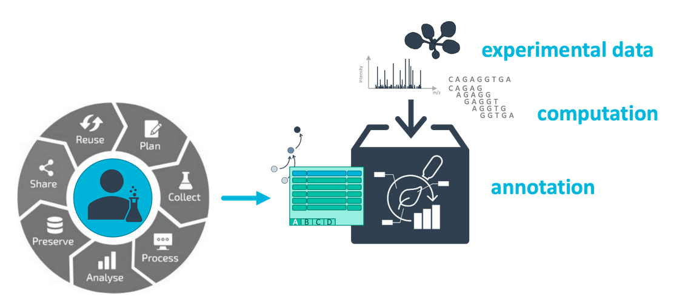


> <agenda-title></agenda-title>
>
> In this tutorial, we will cover:
>
> 1. TOC
> {:toc}
>
{: .agenda}


# Getting set up for the tutorial

For this tutorial you need three things:
 1. An account on [DataHUB](https://git.nfdi4plants.org)
 2. The [ARCitect](https://www.nfdi4plants.de/nfdi4plants.knowledgebase/docs/ARCitect-Manual/index.html) tool installed
 3. Example data to fill your ARC with

Below we will walk you through each of these 3 setup steps.

## Create a DataHUB account

DataHUB is a GitLab instance designed to hosts ARCs. Here you can work collaboratively to create your ARC, and once you are ready to publish your ARC, you can do this from here as well.

> <hands-on-title> Create a DataHUB account </hands-on-title>
>
> 1. Already have an account? Please [log in](https://git.nfdi4plants.org/])
> 2. New to DataHUB? Create an account: [https://git.nfdi4plants.org/](https://git.nfdi4plants.org/)
>    - If you are not familiar with Git or GitLab that is ok, ARCitect will take care of syncing to DataHub behind the scenes
>
{: .hands_on}


## Download demo data

In this tutorial we will create an ARC for an example research data. In this example investigation we grew Talinum plants under
drought conditions, with watered plants as control. Under these conditions the plants switch their type of photosynthesis
(water: C3, drought: CAM). To study this change, we profiled gene expression (Transcriptomics) using RNASeq, and metabolites
(Metabolomics) via GC-MS (Gas-Chromatography Mass Spectrometry)


> <hands-on-title> Download example ARC data </hands-on-title>
>
> 1. Download the zip file from Zenodo (<2MB) to your machine
>
>    ```
>    https://zenodo.org/records/13970369/files/GTN_ARC_tutorial_data.zip
>    ```
>
> 2. Unzip the file
>    - You can put the files wherever is most convenient for you
>
> 3. Have a quick look at the files and folders
>    - This example data mimics how you might have your project data organised on your computer
>    - In the next part we will show how to organise this data in an ARC-compatible way
>
{: .hands_on}


## Install ARCitect

Now we will install the ARCitect tool. This tool will help you create and fill your ARC.


> <hands-on-title> Install the ARCitect tool on Linux  </hands-on-title>
>
> 1. Follow the installation instructions on the [DataPLANT knowledgebase](https://nfdi4plants.org/nfdi4plants.knowledgebase/) for your OS:
>    - [Windows Installation Instructions](https://nfdi4plants.org/nfdi4plants.knowledgebase/docs/ARCitect-Manual/arcitect_installation_windows.html)
>    - [macOS Installation Instructions](https://nfdi4plants.org/nfdi4plants.knowledgebase/docs/ARCitect-Manual/arcitect_installation_macos.html)
>    - [Linux Installation Instructions](https://nfdi4plants.org/nfdi4plants.knowledgebase/docs/ARCitect-Manual/arcitect_installation_linux.html)
>
>    > <comment-title> ARCitect version </comment-title>
>    >
>    > This tutorial uses version {{page.extra.arcitect_version}} of ARCitect. Since this tool is still
>    > under rapid development, a newer version of ARCitect may already be available. Feel free to install
>    > the latest version of ARCitect, but be aware that some screenshots and instructions may be outdated.
>    >
>    {: .comment}
>
>
>
> 2. Start ARCitect to verify that everything is installed correctly. You should see a screen like this:
>
>    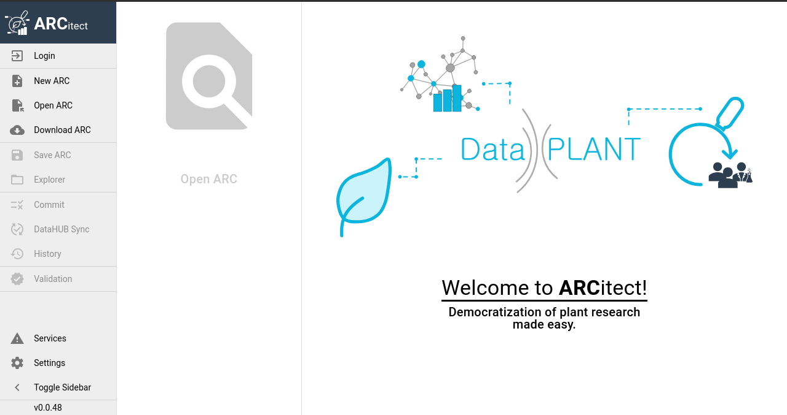
>
{: .hands_on}


# Initialize your ARC structure

Now that you have everything set up for the course, we can start creating our ARC. First we will organize our example data into the ARC structure, then we will add structured metadata describing our experiments and data.


## The ISA data model

ARCs build on the [ISA Abstract Model](https://isa-specs.readthedocs.io/en/latest/isamodel.html)
for metadata annotation.

The ISA model comes with a hierarchy (ISA: Investigation - Study - Assay)
that aligns well with most projects in (plant) biology labs. It allows grouping multiple assays (measurements) to one study,
and multiple studies to one investigation.

")

Your ARC has one isa.investigation.xlsx workbook at its root, where metadata about the investigataion is captured. Similarly, each study or assay that you add to your ARC contains one isa.study.xlsx or isa.assay.xlsx, respectively.


> <comment-title> Before you start </comment-title>
>
> Before creating your own ARC, invest some time to think about the following questions.
>
> - What is my **investigation**?
> - What is my **study**?
> - Which **assay** did I perform?
> - What is my (raw) **dataset**?
> - What **protocols** did I use?
>
{: .comment}


## The ARCitect interface

The ARCitect window consists of 4 main parts; on the left is the menu panel, next to it is a panel displaying the ARC folder structure, then the main panel where we will configure our ARC, and on the righ is (optionally) a help panel.

 menu panel, B) ARC folder structure, C) Main panel, D) Help panel (off by default).")

Let's have a closer look at the menu panel:

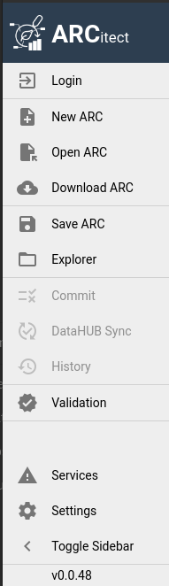

This menu bar allows you to:
1. **Login**: Log in to DataHUB (required to sync your ARC to DataHUB)
2. **New ARC**: Create a new ARC
3. **Open ARC**: Open an existing ARC from your machine
4.  **Download ARC**: From DataHUB to your machine (e.g. from a colleague or published)
5.  **Save ARC**: Save your changes to your machine
6. **Explorer**: Open the local ARC folder on your computer
7. **Commit**: prepare your ARC changes for sync to DataHUB
8. **DataHUB sync**: push your comitted changes to DataHUB
9. **History**: Show previous versions of your ARC
10. **Validation**: Configure validation (checks) for our ARC
11. **Services**: Check on the status of ARC services (e.g. is DataHUB down for maintenance?)
12. **Settings**: For example turn on tool tips or the help panel


## Creating a new ARC

Let's start by creating a new ARC.

> <hands-on-title> Create a new ARC in ARCitect </hands-on-title>
>
> 1. In the left-hand panel of ARCitect, select **New ARC**
>    - Navigate to a location on your machine where you would like to create the ARC folder
>    - Choose a descriptive name for your ARC, e.g. `TalinumPhotosynthesis`
>
>    > <comment-title>What's in a name?</comment-title>
>    >
>    > By default, the name give your ARC here will be used for:
>    >  - the ARC folder on your machine
>    >  - the ARC repository on DataHUB at `https://git.nfdi4plants.org/<YourUserName>/<YourARC>` (see next steps)
>    >  - the identifier for your investigation
>    >
>    > **Note:** Make sure that no ARC exists at `https://git.nfdi4plants.org/<YourUserName>/<YourARC>`. Otherwise you will sync to that ARC.
>    {: .comment}
>
> 2. If all went well, you should see the folder structure that was created for your ARC:
>    
>
> 3. Click on the **Explorer** button in the menu to see the files created on your machine
>
{: .hands_on}

The basic ARC structure is initialized for you, and looks something like this:

```bash
my-arc
├── studies
│   ├── study1              # subfolder for each study
│   │   ├── protocols       # folder for protocol documents
│   │   ├── resources       # folder for any other supporting information and files
│   │   isa.study.xlsx      # study-level metadata (e.g. sample sheet, culturing/harvesting conditions)
│   │   README.md           # Free-text description of your study
│   ├── assay2
│   │   ├── ...
├── assays
│   ├── assay1              # subfolder for each assay
│   │   ├── dataset         # assay result files (e.g. sequencing files)
│   │   ├── protocols       # assay protocol files
│   │   isa.assay.xlsx      # assay-level metadata (e.g. instrument)
│   │   README.md
│   ├── assay2
│   │   ├── ...
├── runs                    # analysis results
│   ├── ...
├── workflows               # analysis workflows (CWL, or any other scripts/code used)
│   ├── ...
├── isa.investigation.xlsx  # investigation-level metadata
└── README.md
```


## Add investigation-level metadata

We will start by adding some basic data about our ARC. We do this in the investigation-level metadata.

> <hands-on-title>Adding investigation information</hands-on-title>
>
> 1. In the ARC folder panel (second panel from the left), click on the investigation
>    - This is the root of the ARC folder structure (e.g. *TalinumPhotosynthesis*)
>    - This will bring up the investigation information in the main panel
>    - Notice that the Identifier has already been filled in for you (but you can still change it)
>    - Behind the scenes this information will be saved as an Excel sheet `isa.investigation.xlsx`
>
>    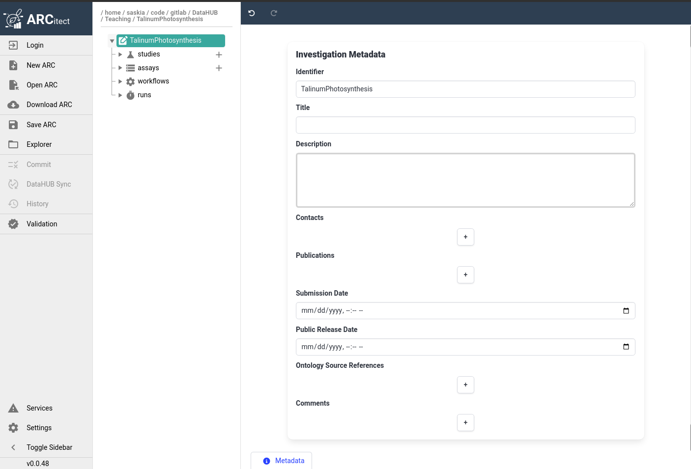
>
> 2. **Add a title** for your investigation
>    - This should be a concise but descriptive title
>    - Tip: think of what you would name your publication based on this investigation
>    - For this tutorial, you could set your title to `Effect of Drought on Talinum Photosynthesis`
>
> 3. **Add a description** for your investigation
>   - Here you can describe your main research questions and methods in a few sentences or paragraphs.
>   - Tip: think of this as a short abstract like you would provide in a publication
>   - For this tutorial you can add any text here
>
> 4. **Add an ARC Contact** (you)
>    - Click on the ** (plus) icon** under Contacts
>    - Click on the ** (dropdown) icon** on the right of the contact to expand it
>    - Fill in at least your First name, Last name, and email.
>    - **Tip:** if you have an [ORCiD](https://orcid.org) ID, fill that in and hit "Search" to autofill these fields
>
> 5. Your investigation tab should look something like this
>
>    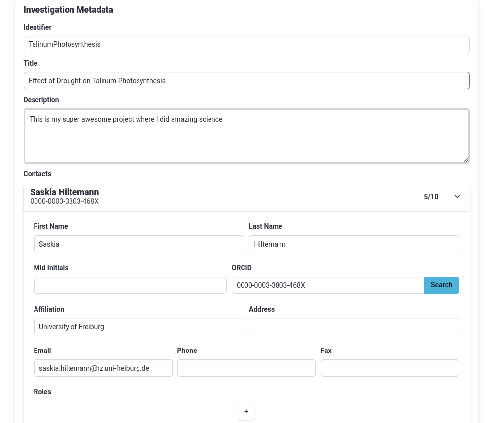
>
{: .hands_on}


## Saving your ARC

It is a good idea to frequently save your work. There are 2 levels of saving your ARC; you can:
1. Save it locally (to your computer)
2. Save it online to DataHUB (syncing)

By default your ARC on DataHUB is private to you, but you have the option of sharing it with your collaborators.

> <comment-title>Why and how often to sync to DataHUB?</comment-title>
>
> Syncing your ARC to DataHUB frequently has several advantages:
>  - It makes it easy to collaborate with colleagues on your ARC
>  - It is a backup of your ARC in case anything happens to your computer
>  - It is version controlled. This means you can always go back to any previous version your ARC if needed
>
> We advise you to save your ARC to your local machine as often as you can, and sync to DataHUB every time you have
> completed a unit of work (e.g. "added data files", "added culturing metadata", "added protocol documents" etc), this
> makes it easy for others (and future you) to see what you have changed.
>
{: .comment}

Since we have just completed our first unit of work (initialized our ARC and added basic investigation metadata), let's save and sync our ARC to DataHUB now.

> <hands-on-title>Save and Sync our ARC</hands-on-title>
>
> 1. Save locally simply by hitting the **Save ARC** button on the left
>    - That's it! Too easy!
>    - Do this as often as possible to avoid losing work
>
> 2. Click **Login** at the top of the menu panel
>    - Select `git.nfdi4plant.org` as your host
>    - Click the **Login** button
>    - Since you already logged into DataHub via your browser earlier, ARCitect should now automatically log you in
>
> 3. To check that you are successfully logged in, the Login button should now be replace with your DataHub username
>    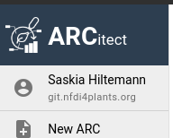
>
> 4. Click on **Commit** in the menu
>    - This screen will show you all files that have chanced since your last sync
>    - You can choose whether to sync all files, or only some
>    - Choosing which files to sync is called "committing" those file.
>    - In our case only one file has changed, `isa.investigation.xlsx`. By default it is already selected to be committed
>
> 5. Add a **commit message**
>    - in a few words, describe your changes
>    - this will help you and your colleagues
>    - For example, for this changes you can write `added investigation metadata`
>    - You can leave the rest of the fields to the default values
>
>    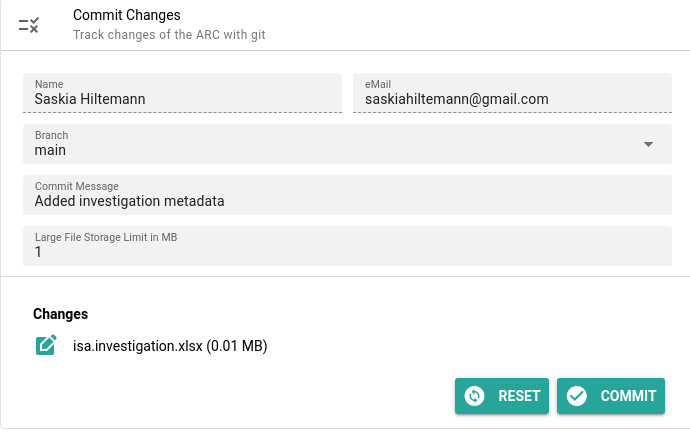
>
> 6. Click the **Commit** button
>    - There will be a confirmation screen like the one below
>    - Click the **Ok** button
>
>    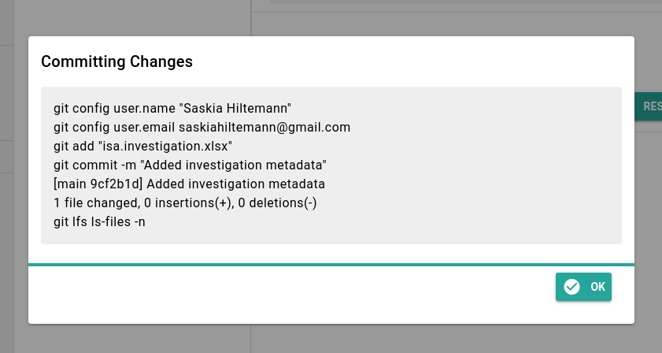
>
> 7. Click on **DataHUB Sync** in the menu
>
>    
>
> 8. Click on **+ (plus)** to add a 'remote' (DataHUB location to save your ARC)
>    - you only have to do this once
>    - you can keep all the default settings
>    - Click **Add**
>
>    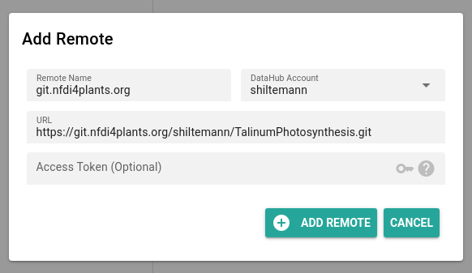
>
> 9. Click **Push** to sync from your computer to DataHUB
>    - **Pull** will do the reverse, it will 'pull' in changes from DataHUB into your local copy of the ARC,
>      for example if a collaborator made changes, or you worked on it from a different machine.
>
> 10. Check that the push was successfull
>     - Navigate to `https://git.nfdi4plants.org/YourUsername/TalinumPhotosynthesis`
>     - Replace 'YourUsername' with your DataHUB username in the URL
>     - If you used a different Identifier for your ARC, replace 'TalinumPhotosynthesis' with your ARC Identifier in the URL
>     - You should see your ARC on DataHUB:
>
>     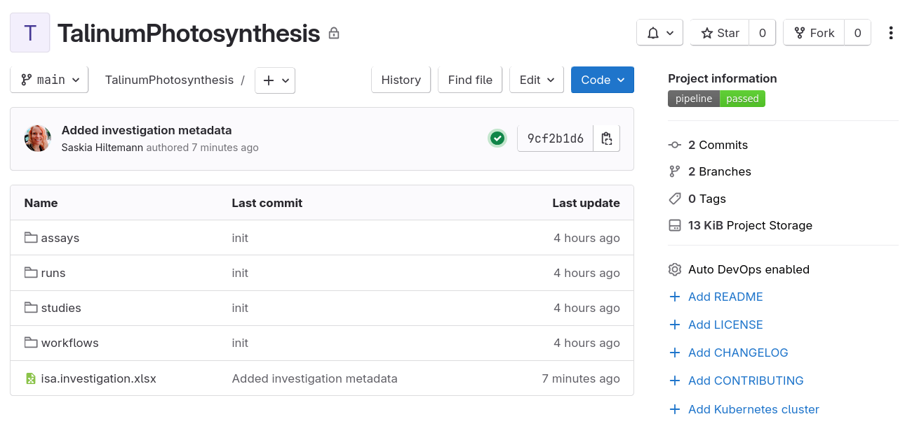
>
{: .hands_on}

Congrats! You have initialized, saved, and synced your ARC! Now let's continue with the good part, actually filling your ARC.


# Structure your data in the ARC

## Think about your data

Next we will divide our research into studies and assays. As a rule of thumb, create a study for every research question, and an assay for every measurement you performed (e.g. sequencing, mass-spec, imaging). An investigation can have one study, or several. A study can have one or more assays, and each assay can be associated with one or more studies.


> <hands-on-title> Evaluate the example data </hands-on-title>
>
> 1. Recall our example research:
>
>    *In this example investigation we grew Talinum plants under drought conditions, with watered plants as control.
>    Under these conditions the plants switch their type of photosynthesis (water: C3, drought: CAM). To study this
>    change, we profiled gene expression (Transciptomics) using RNASeq, and metabolites (Metabolomics) via GC-MS
>    (Gas-Chromatography Mass Spectrometry)*
>
> 2. Have a look at the demo data we downloaded
>
> > <question-title> Which studies and assays do we have? </question-title>
> >
> > 1. Which studies do we have?
> > 2. Which assays did we perform?
> >
> > > <solution-title></solution-title>
> > > 1. We had one research question, the effect of drought on photosynthesis, so we will create 1 study
> > > 2. We performed 2 measurements, RNA sequencing and GC-MS, so we will create 2 assays in our ARC
> > {: .solution}
> {: .question}
{: .hands_on}

## Create a study

Let's create our study now.

> <hands-on-title>Create an ARC study</hands-on-title>
>
> 1. Click on the ** (plus) icon** next to the studies folder
> 2. Provide a study identifier, e.g. `talinum_drought`
>    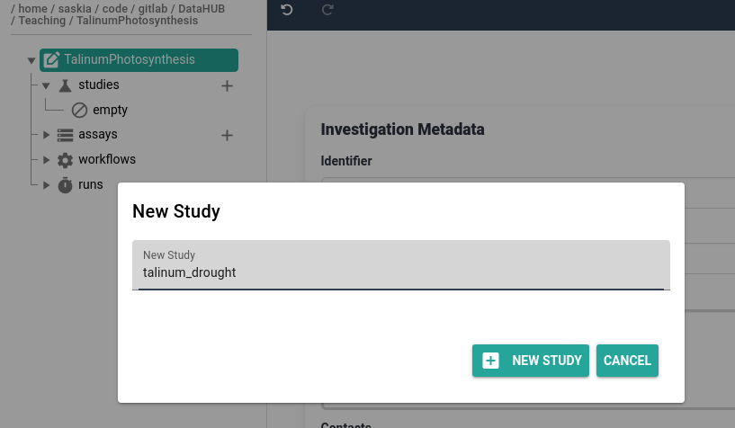
> 3. Click ** New Study** button to confirm
> 4. **Expand** the new study folder that was created in your ARC
>    - you should see the protocols and resources folders created
>      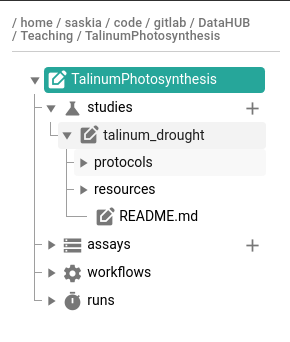
{: .hands_on}

As we did for the investigation, we can also add some basic study information

> <hands-on-title>Add basic study metadata</hands-on-title>
>
> 1. Click on your study `talinum_drought`
> 2. The main panel will now show study metadata, here you can add basic information about your study
>    such as description, contacts, associated publications.
>
>    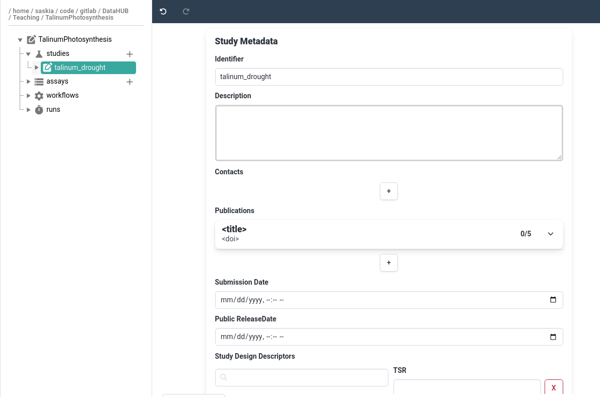
>
> 3. **Add a description** for the study
> 4. **Add yourself** as a contact
>    - Remember that you can use your ORCiD ID for a fast way to fill this data
> 5. **Add a publication**
>    - Normally you would add the paper you published based on the data in this ARC
>    - For this tutorial, add any publication (e.g. one of yours, or one you find interesting)
>    - The easiest way to do this, is to add the **DOI link** or **Pubmed ID**, then the information will be autofilled
>    - If you don't have a publication in mind, try one of the following papers:
>      - Pubmed ID: `7825135`
>      - DOI: `https://doi.org/10.1136/bmj.331.7531.1498`
>
>    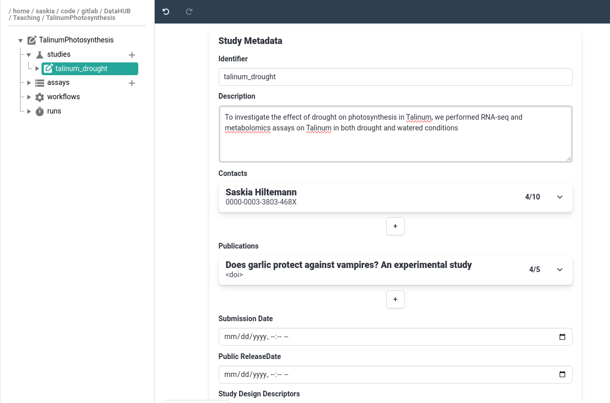
{: .hands_on}

Since we have once again completed a unit of work, let's save and sync our ARC again!

> <hands-on-title>Save & Sync</hands-on-title>
>
> 1. Save your ARC locally
>    - **Save ARC** button in menu
> 2. Sync your ARC to DataHUB
>    - **DataHub Sync** button in menu
>    - Commit all changed files
>    - Provide a good commit message (e.g. `added drought study`)
{: .hands_on}


## Create an assay

Next, we will create our 2 assays. Recall that we performed two measurements/assays, RNA sequencing, and metabolomics.

> <hands-on-title>Create the RNA-seq assay</hands-on-title>
>
> 1. Click on the ** (plus) icon** next to the assays folder
> 2. Give your assay a name, e.g. `rnaseq`
> 3. In **measurement type** field, choose `mRNA Sequencing`
>    - this field is **ontology based**
>    - as soon as you start typing, suggetions for known terms will pop up
>    - Notice the TSR and TAN fields are automatically filled in once you select a term. These fields help make your ARC machine readable.
>
> 4. Similarly, set the  **Technology Type** to `Next-generation Sequencing`
>
>    > <question-title></question-title>
>    > Look through our demo data, can you find out which sequencing machine was used?
>    > > <solution-title></solution-title>
>    > > In the example data, we've got a **methods** folder where we've stored notes on our assays,
>    > > In the file called **illumina_libraries** we see that the sequencer we used was a `Illumina HiSeq 2000`
>    > {: .solution}
>    {: .question}
>
> 5. Under **Technology platform**, fill in `Illumina HiSeq 2000`
>
>    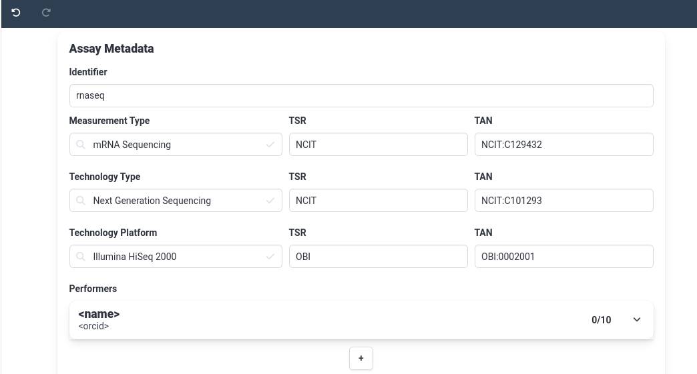
>
{: .hands_on}


Awesome, now let's repeat the process for our metabolomics assay.

> <hands-on-title>Create the metabolomics assay</hands-on-title>
>
> 1. Create a new assay called `metabolomics`
> 2. Under **measurement type** choose `Gas Chromatography Mass Spectrometry`
> 3. We can leave the Technology type/platform fields empty for now
>
>   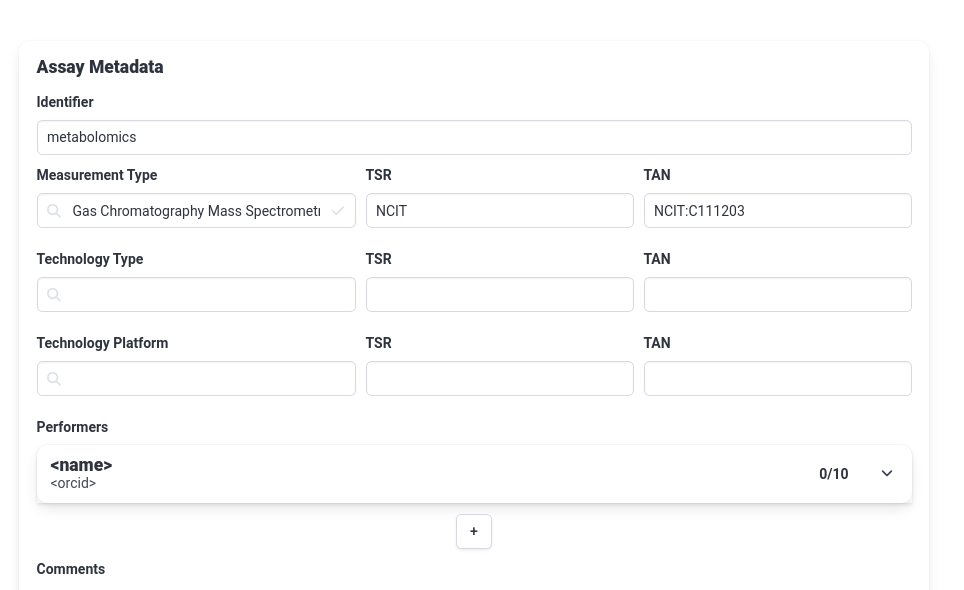
{: .hands_on}


And once again, let's save our ARC and sync it to DataHUB.

> <hands-on-title>Save & Sync</hands-on-title>
>
> 1. Save your ARC locally
>    - **Save ARC** button in menu
> 2. Sync your ARC to DataHUB
>    - **DataHub Sync** button in menu
>    - Commit all changed files
>    - Provide a good commit message (e.g. `added rnaseq and metabolomics assays`)
{: .hands_on}


# Adding files to your ARC

As our next step, let's add the files we have in our demo folder to our ARC.

## Add protocol documents

> <hands-on-title>Adding protocols</hands-on-title>
>
> 1. Open the folder with demo data on your computer
> 2. Look through the **methods** folder
>    - This contains files with notes about methods we used in our research
>    - In our ARC, these usually go in **protocols** folders
>    - Studies and assays both have protocols folders
>
>    > <question-title></question-title>
>    >
>    > Where should each of the 4 files in the methods folder go in our ARC?
>    >
>    > > <solution-title></solution-title>
>    > > - `plant_material.txt`: contains a general sample sheet, and should go in the study-level protocol folder
>    > > - `RNA_extraction.txt` and `Illumina_libraries.txt` are specific to the RNA sequencing assay, so should go in the protocols folder for the rnaseq assay
>    > > - `metabolite_extraction.txt` is specific to our metabolomics assay, so should go in the metabolomics protocol folder
>    > {: .solution}
>    {: .question}
>
> 3. There are two ways to add files to your ARC, we will do both now, in the future you can choose whichever option you prefer
>
> 4. **Adding files via ARCitect**
>    - Expand the `studies` folder
>    - Expand the `talinum_drought` folder
>    - Right-click on the `protocols` folder
>    - Choose `Import files` option
>    - Browse to the demo data and choose the `methods/plant_material.txt` file
>
>    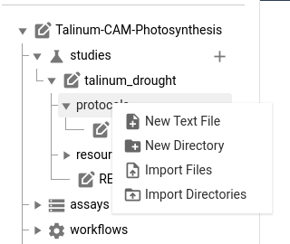
>
> 5. **Adding files via file explorer**
>    - Click on `Explorer` in the left-hand menu
>    - Open the `assays/metabolomics/protocols` folder of your ARC
>    - In another window, open the demo data folder
>    - Copy or drag the `metabolite_extraction.txt` file from the demo data folder to your ARC folder
>
> 6. **Add the two remaining protocol files** to the ARC in your preferred way
>    - Files `illumina_libraries.txt` and `RNA_extraction.txt`
>    - Both should go to `assays/rnaseq/protocols/` folder in your ARC
>
{: .hands_on}

Note that adding files via ARCitect import option will create a copy of the file, rather than moving it, so if you have large data files you might want to move the files via the explorer option.

## Add assay files

Next, let's add the RNA-seq data we have to the ARC structure.

> <hands-on-title>Add RNA-seq data</hands-on-title>
>
> 1. Look in the `rnaseq_data` folder of the demo data
>    - Files with the `.fastq.gz` suffix are raw sequencing files
>    - Raw data goes in the `assays/rnaseq/dataset/` folder
>    - `NGS_samplesheet.xlsx` can go into the assay's protocol folder
>
> 2. Move the files to the ARC in your preferred way
>
>    
>
{: .hands_on}

Finally, let's do the same for our metabolomics data

> <hands-on-title>Add Metabolomics data</hands-on-title>
>
> 1. Look in the `metabolomics_data` folder of the demo data
>    - Folders with the `.D` suffix are raw data files
>    - The rest of the files can go to the protocols folder
>
> 2. Move all the files to the ARC metabolomics assay folder
>    - Note that if you move them via ARCitect, you should use the **Import Directories** option for the raw data folders
>
>    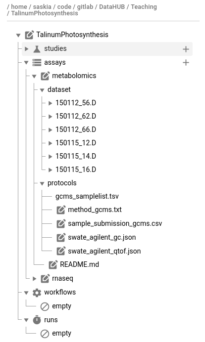
>
{: .hands_on}


Congrats! you have added data to your ARC! As always, let's make sure to save & sync our work before we continue.

> <hands-on-title>Save & Sync</hands-on-title>
>
> 1. Save your ARC locally
> 2. Sync your ARC to DataHUB
>    - Provide a good commit message (e.g. `added protocols and raw data files`)
{: .hands_on}


# Add your experimental metadata (SWATE)

Now that we have all our data in the ARC, we need to add metadata about our research in a structured way.
We already put a lot of information about our samples and experiments in the protocols folders,
but these are just free-text notes, like we would put in a methods section of a paper, or in our lab notebook.
The information is there but it is not **structured** yet.

In this section, we will show you how you can add structured metadata to your ARC. We do this by using a
standard format ([isa-tab](https://isa-specs.readthedocs.io/en/latest/isatab.html)), combined with
ontology-based annotations. We call these **annotation tables**, and these tables with metadata can be created
directly within the ARCitect tool.

> <comment-title>SWATE</comment-title>
>
> If you have previously already looked into ARCs, you may remember a tool called SWATE.
> SWATE helps you create these annotation tables. SWATE has now been integreted into ARCitect
>
{: .comment}

## Add sample information to the study metadata

First, we will add information about our samples (plants) to our study.

We took some notes about our samples in `plant_material.txt` file (now in our protocols folder)

```
Plant Material and Growth Conditions

Plants:
  - Species: Talinum fruticosum
  - Age: 28-d-old

Growth Chamber
  - 12 h light (30°C, 37% relative humidity)/12 h dark (22°C)
  - 425 µEinstein

Drought treatment:
  - no water for 12 days
  - re-water for 2 days

Sampling:
  - Leaves: topmost mature unshaded leaves, ca. 3–4.5 cm (see pictures)
  - shock-frozen in liquid N2

drought samples (CAM)
  - DB_097
  - DB_099
  - DB_103

re-watered samples (C3)
DB_161
DB_163
DB_165
```

> <tip-title> Viewing and editing text documents in ARCitect</tip-title>
>
> Text files that we added to our ARC, can also be viewed and edited from within ARCitect
>
> 1. Expand the talinum_drought study
> 2. Expand the protocols folder
> 3. Click on the `plant_material.txt` file
>
>    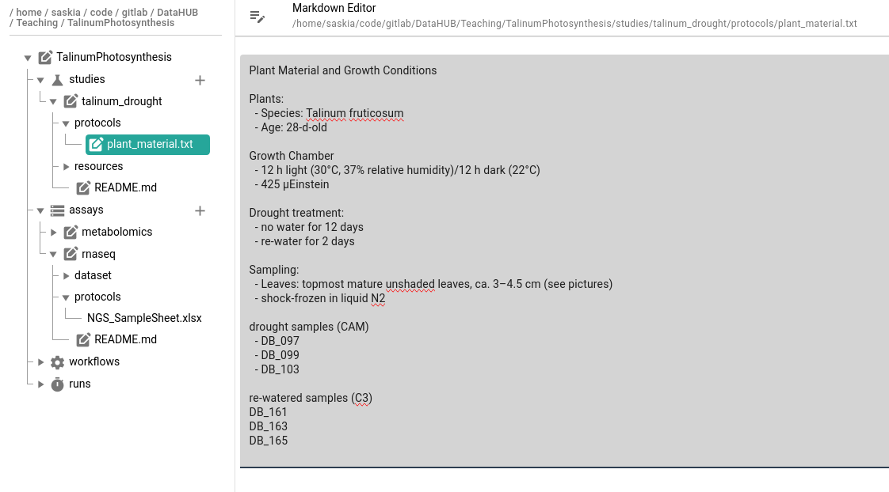
> 4. From this screen you can edit the text as needed.
>    - text files support [Markdown syntax](https://www.markdownguide.org/cheat-sheet/)
{: .tip}

### The ISA-Tab format

We will now take this free-text description of our samples, and turn them into a structured annotation table
using ARCitect.

At it's core, an annotation table often looks like:

Source Name | .. | .. | Sample Name
------------|----|----|-----------
plant 1     | .. | .. | sample1
plant 1     |    |    | sample2
plant 2     |    |    | sample3
...         |    |    | ...

The **Source Name** column and lists the sources (plants) you used in your experiments.
The final column, **Sample Name** describes the samples derived from the sources (plants).
Then there can be any number of columns in between describing characteristics of the plants (e.g. species, location, conditions, etc).
Which columns appear here depends on your experimental setup, and can be chosen by you.

These sample names you provide here can be referenced in other annotation tables in the study, or in assay-level annotation tables.
ARCitect uses these sample identifiers to put information from different annotation tables together, so make sure you use
consistent spelling and capitalization.

### Create an annotation table from scratch

There are 2 ways to add annotation tables, you can either:
1. build them up by hand, choosing the columns ("Building Blocks") yourself.
2. use a pre-defined template. These templates are either provided by the DataPLANT core team, or by other communities that use ARCs (or you!).

We will show both ways of adding annotation tables in this section of the tutorial.

First, let's add our sample information as an annotation table the manual way. Since this information pertains to the study as a whole,
not just a single assay, we will add our sample sheet information at the study level.

> <hands-on-title>Initialize smple information annotation table </hands-on-title>
>
> 1. Click on your study name in the ARC structure
>    - This should bring up the study metadata we filled in previously
> 2. At the bottom of the main panel, click on the ** (plus) icon**
>    - the icon is located next to the current tab named *Metadata*
>
>    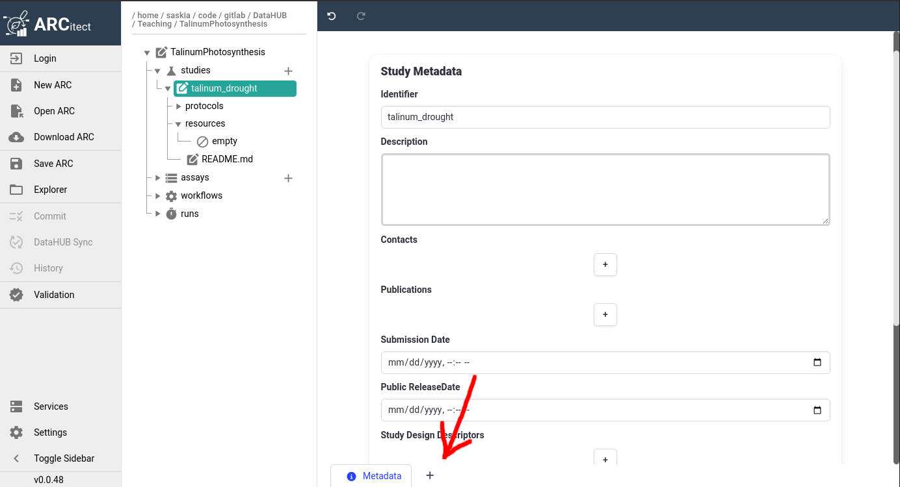
>
>    - You should then see a new tab named **NewTable0** appear
>
>    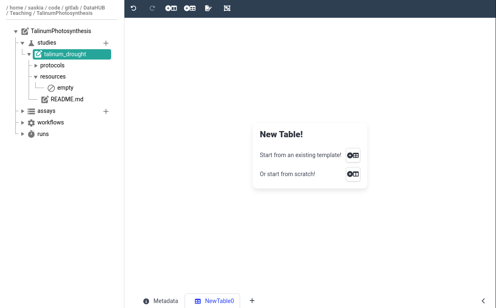
>
> 3. **Rename** the table to **Sample Information**
>    - by right-clicking on the tab name **NewTable0**
>    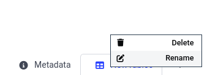
>
> 4. In the center panel, choose **Or start from Scratch!**
>
> 5. We fill first add our **Source Name** column
>    - In the dropdown, select **Input**
>    - Next select **Source Name**
>    - Click **Add Column**
> 6. Next, add an output column **Sample Name**
>    - Click on **Add building block** icon at the top of the table
>    - In the dropdown, select **Output**
>    - Next select **Sample Name**
>    - Click **Add Column**
>
>    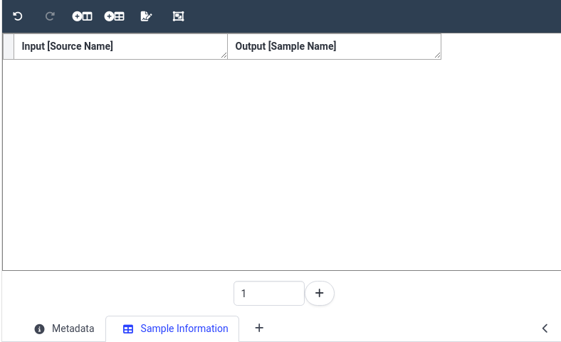
>
> 7. Let's add a column for the species as well
>    - Click on the **Add building block** button
>    - Change the dropdown to **Characteristic**
>    - In the search bar next to it, type **Species**
>    - Select the **NCIT** ontology term
>
> 8. The column probably appear on the right
>    - It is customary to keep the output column on the right
>    - Right-click on the species column
>    - Select **Move column**
>    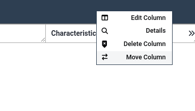
>    - Change the column to `1`
>    - Click **Apply** to get a preview of the new order
>    - Click **Submit** to apply the change
>    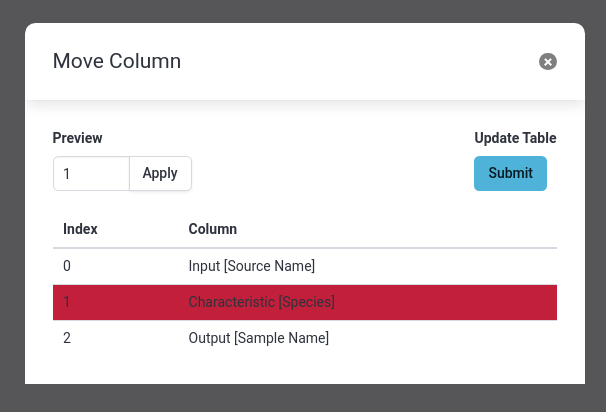
>    - You should now have 3 columns, with species column in the middle
>
> 9. To add data, we have to **add rows**
>    - We had 6 samples, so we will add 6 rows
>    - At the bottom, change the 1 to a 6, and click on the  (plus) button to add the rows
>    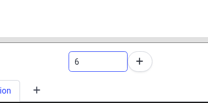
>    - You should now have 6 rows in your table
>    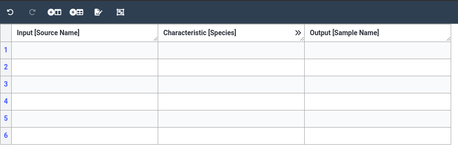
>
{: .hands_on}

Now that we have our basic table initialized, let's start adding some data. For our example study, we grew 6 plants
(we will label them `DB001` to `DB006`). We grew 3 plants in drought conditions, and 3 controls. From our `sample_information.txt`
file we see that the samples we derived from these plants had IDs DB_097, DB_099, DB_103 (drought/CAM), and DB_161, DB_163, DB_165
(controls/re-watered/C3). All plants are species *Talinum fruticosum*.

Let's fill all this information in our annotation table.

> <hands-on-title>Fill the annotation table</hands-on-title>
>
> 1. Fill the first column (**Source Name**) with our 6 plant names
>    ```
>    DB001
>    DB002
>    DB003
>    DB004
>    DB005
>    DB006
>    ```
>    > <tip-title>Copying a whole column at once </tip-title>
>    > You can copy the values one by one, but you can also copy the whole column at once.
>    > - Copy the IDs above
>    > - In your ARC table, Select the first cell of the *Source Name* column
>    > - Hold down the shift key
>    > - Select the last (6th) cell of your column
>    > - Paste the IDs (`CTRL+V`)
>    {: .tip}
>
> 2. Fill the last column (**Sample Name**) with our 6 sample names
>    ```
>    DB_097
>    DB_099
>    DB_103
>    DB_161
>    DB_163
>    DB_165
>    ```
> 3. Now we will fill in the Species column
>    - Select the first cell in the Species column
>    - Start typing the species name `Talinum fruticosum`
>    - Since this is an ontology column, you will get suggestions as you type.
>    - In our case, we see NCBI ontology term for our species, please select this value.
>    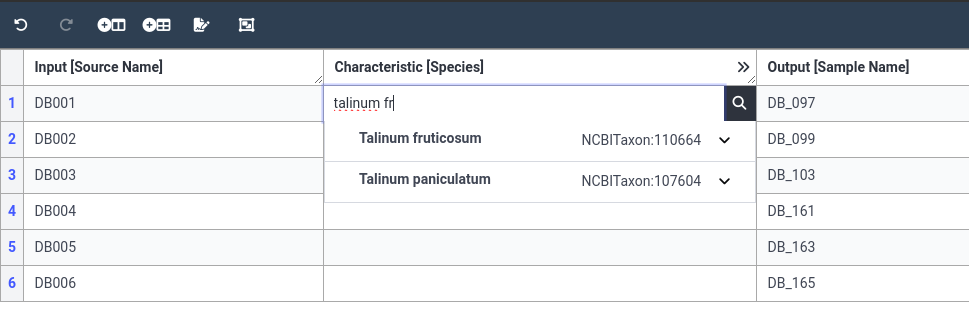
>
> 4. Copy the species value to the enitre column
>    - Right-click on the species term you just added in the firs row
>    - Select **Fill column** to apply this term to all 6 rows.
>    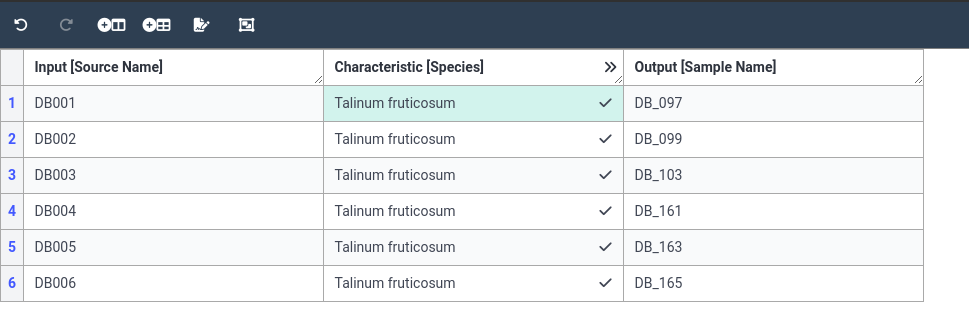
{: .hands_on}

This is the basic process of building our annotation table. We can now add more building blocks (columns) as needed,
for all the information we have about our plants that we wish to describe. In the next section, we will add more columns.

But first, let's have a closer look at our annotation table.

> <comment-title> Why do we call them Building Blocks?</comment-title>
>
> 1. Click on the (expand) icon next to the species column name
>    - You will now see additional hidden columns
>    - These columns provide information about the ontology term you chose (TSR and TAN)
>    - There is also a hidden unit column. (For species this column is unused)
>
>
> 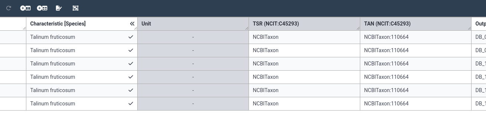
>
> This is why we use the term **Building Block** instead of **column**; behind the scenes there are actually more columns.
> We hide these columns in ARCitect, because most of the time these columns are not so interesting to humans, but they are
> what makes your ARC machine-readable.
>
> This machine readability is essential for example for ARC searching tools so that you can perform advanced
> searches such as *"Find all ARCs with data of Talinum Fruticosum that performed an RNA-seq assay"* and facilitate re-use
> of data. This will help people find your research, and will help you find data for your next study.
>
{: .comment}


Let's add some more building blocks for other information we have about our plants.
Based on our methods document, we know a few more characteristics of our plants:

- Light intensity of 425 µEinstein
- Plant age of 28 days
- Watering exposure of 12 days drought (for 3 of the samples) or 12 days drought followed by 2 days rewatering (for the other 3 samples)

Notice that the first two of these characteristics include a value (425, 28) and a unit (µEinstein, days).
In the next step we will show you how to deal with units in ARCitect

> <hands-on-title>Add building blocks with units</hands-on-title>
>
> 1. **Add a new building block** for plant age
>    - Select **Characteristic** from the dropdown
>    - Type **Plant Age**
>    - Select the DPBO term *Plant age*
>    - In the results, you can always click on the  (dropdown) icon to get more information about the term
>    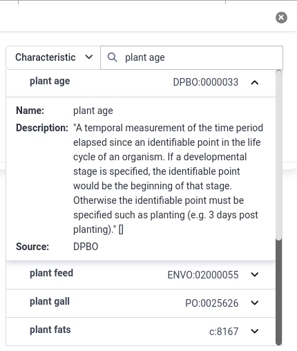
>
> 2. Before you add the column to the table, you can also **set the unit** for the column
>    - Click the button labelled **Unit**
>    - Search for **Day**
>    - Find an ontology term with a good description
>    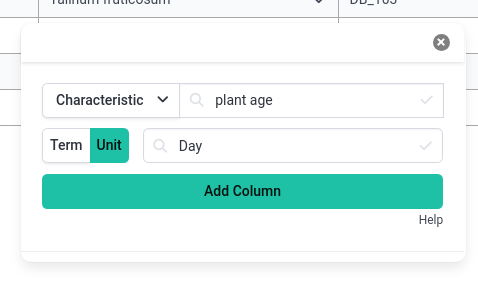
>    - Click **Add Column**
>    - Notice that the column is now already filled with the unit
>
> 3. The column will appear to the right of the column you were last on
>    - If you want your column in a different place, move it now in the same way we did before (right click the column)
>
> 4. Add the value **28** to the age column for all 6 samples
>    - You can see that your chosen unit is automatically added to the value you provide in the cell
>    - remember, you can fill in one cell, then use the "Fill Column" option from the right-click menu to apply the same value to all rows.
>
>    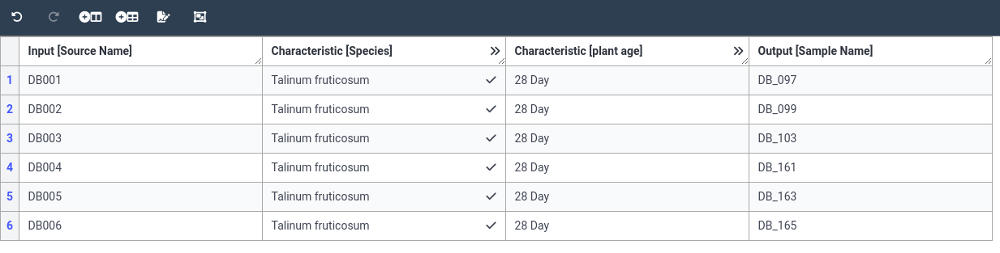
{: .hands_on}


> <comment-title>Characteristic vs Factor vs Parameter vs Component</comment-title>
>
> When adding building blocks, you may have noticed that a distinction is made between *characteristic*, *parameter*,
> *factor* and *component*. But when to use which?
>
> Have a look at this [Annotation Principles Guide](https://nfdi4plants.github.io/nfdi4plants.knowledgebase/docs/guides/isa_AnnotationPrinciples.html)
> For a more precise description, but in short:
>
> - **Characteristics columns** describe inherent properties of the source material, e.g., a certain strain or ecotype,
>   but also the temperature an organism was exposed to.
> - **Factor columns** describe independent variables that determine the specific output of your experiment when process and analysis were identical.
>   Most of the time, Factors are the most important building blocks for downstream computational analysis.
> - **Parameter columns** describe steps in your experimental workflow, e.g., the temperature or extraction buffer used for your assay.
>   Multiple Parameter columns form a protocol.
> - **Component columns** are used to list anything physical of a protocol, e.g. instrument names, software names, or reagents names.
>
{: .comment}

Keeping this in mind, let's add more building blocks

> <hands-on-title>Add more buiding blocks</hands-on-title>
>
> 1. Add a building block for **light intensity exposure** (PECO:0007224)
>    - Add it as a **Parameter column**
>    - Set the unit to *microeinstein per square meter per second* (UO:0000160)
>    - Fill the column with a value of 425 for all samples
>
> 2. Add a building block for **Watering exposure** (PECO:0007383)
>    - Add it as **Factor column**
>    - set the value to "12 days drought" for the drought samples (`DB_097,DB_099,DB_103`)
>    - set the value to "12 days drought + 2 days rewatered"* for the other 3 samples
>
>    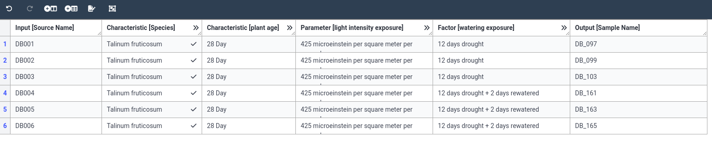
>
{: .hands-on}

As a final step, we can associate our protocol document (`plant_material.txt`) with our annotation table.

> <hands-on-title>Add more buiding blocks</hands-on-title>
>
> 1. Add a new building block
>    - Add it as a **ProtocolREF** column (under *More*)
>    - Click **Add column**
> 2. For the value, set the file name `plant_material.txt` for all columns
>    - ARCitect will know to look in the protocols folder for this file
>    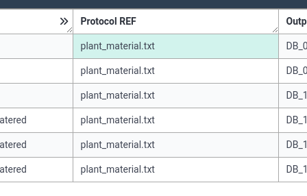
{: .hands_on}

Well done! You have added your first annotation table! You can add as many columns as you need in your annotation tables. The aim is always to capture as much information as you can in this way.

While we succeeded in creating our annotation table, it was quite a bit of work adding in our building blocks one by one. Luckily, there are a lot of templates available that can make your life easier! In the next section, we will show you how to do this.

## Add assay annotation

Building annotation tables from scratch can be a bit time consuming, especially if we have to repeat it for every ARC we create
Therefore, DataPLANT has also a way to share templates for annotation tables. For example, the metadata for RNA sequencing will be very similar for
everybody. So instead of creating this annoation table from scratch, we can load a pre-existing template. This is just a starting point, we can still
add and remove building blocks as needed, but it will save us a lot of time.

### Create RNA-Seq assay annotation tables from template

> <hands-on-title></hands-on-title>
>
> 1. Click on the RNA-seq assay in your ARC
> 2. Add a new annotation table
>    -  (plus) icon at the bottom
> 3. **Rename** the table to a better name
>    - e.g. "RNA extraction"
> 4. Choose **Start from an existing template!** in the center of the screen
> 5. Search for **RNA**
>    - The results will show a few options from the official DataPLANT templates
>    - You can also search other community templates by changing the **Select community** dropdown to **All** (or a specific community)
>    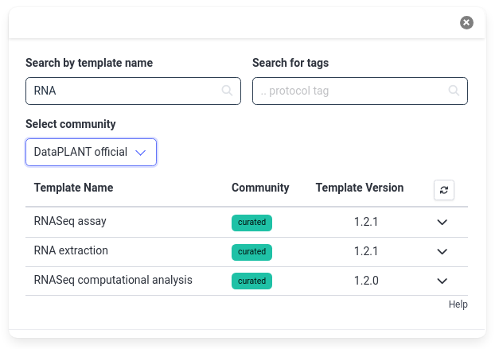
>
> 6. Choose the **RNASeq extraction** template
>    - Click **Select** to confirm
>    - This will give you a preview of the building blocks in the template
>    - Click **Add template**
> 7. Add 6 rows to the table
>    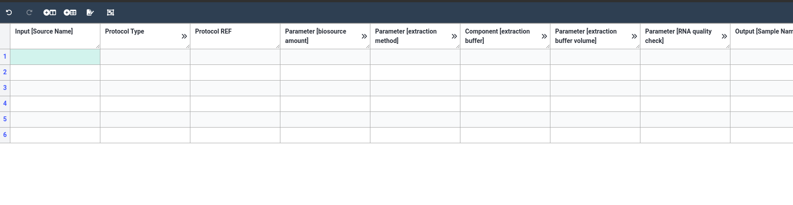
> 8. Try to add RNA extraction information to this table
>    - Open the `RNA_extraction.txt` file in your protocols folder to view the information to add.
>
> > <question-title></question-title>
> >
> > 1. How does your final annotation table look?
> >
> > > <solution-title>Some Hints</solution-title>
> > > 1. The **biosource amount** column does not have a unit set yet. To do so now, please:
> > >    - Search for *milligram* in the column
> > >    - Right-click on the term, and select `as unit cell`.
> > >    - Choose "Fill column" from the right-click menu to apply this to all rows
> > > 2. Set the unit for **buffer volume** column to **microliter** in the same way
> > {: .solution}
> >
> > > <solution-title> Full solution </solution-title>
> > > Below are screenshots of a filled annotation table. Note that there are often multiple ways to fill an ARC.
> > >
> > > 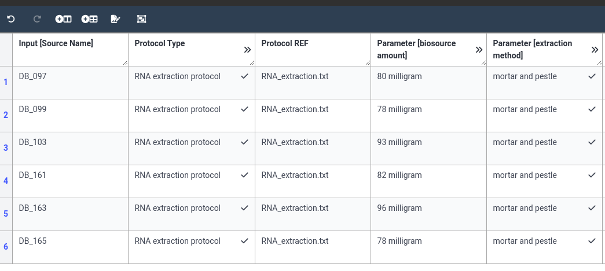
> > > 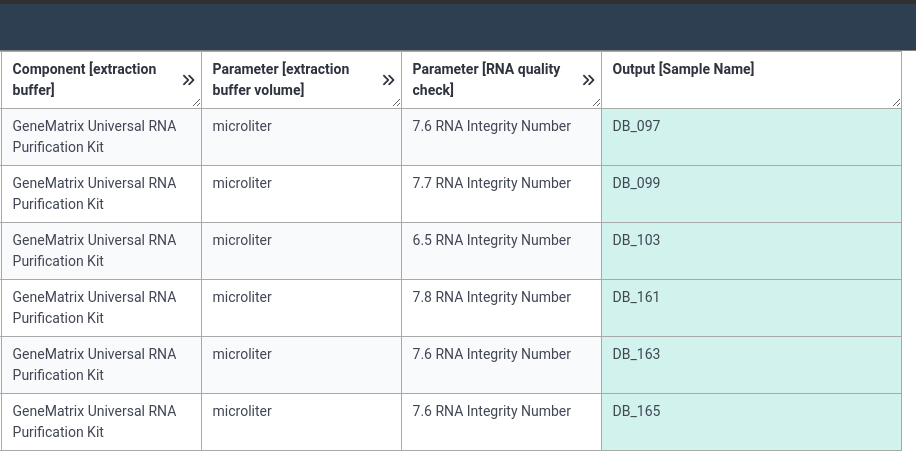
> > >
> > {: .solution}
> {: .question}
{: .hands_on}


As always, let's save and sync our ARC

> <hands-on-title>Save & Sync</hands-on-title>
>
> 1. Save your ARC locally
> 2. Sync your ARC to DataHUB
>    - Provide a good commit message
{: .hands_on}

# Adding computational workflows to your ARC

We have now added raw data, protocols, and annotation tables to our ARC. We can publish this *Data ARC* as-is,
but ARCs can also support addition of analysis workflows and results.

ARCs offer integrations for [CWL](https://www.commonwl.org/) (Common Workflow Language) workflows, but this is out of scope for this tutorial.
You can read more about adding CWL workflows to your ARC in the [DataPLANT knowledgebase](https://nfdi4plants.org/nfdi4plants.knowledgebase/docs/guides/ComputationalWorkflows/cwl_examples.html)

If you do not have CWL workflows, you can put any other scripts or code you used in the `workflows` folder, and
any analysis results in the `runs` folder. This will not be structured or statndardized, but better than nothing.

# Publishing your ARC

Once you have finished your ARC, you can choose to publish it. It will then become public for anybody to find and re-use.
Before you can do this, your ARC must pass some basic validation. This process checks if your ARC is in valid ARC format,
and if any files you reference are really included, etc.


## ARC validation

By default, the basic ARC validation is enabled in DataHUB

> <hands-on-title></hands-on-title>
>
> 1. Open your ARC repository on DataHUB. Tip: a quick way to get there is
>    - click on **DataHUB sync** in the ARCitect menu
>    - click on the **globe icon** to open the DataHUB repository in the browser
> 2. On the right of your DataHUB ARC repository, you should see a badge labelled **pipeline**
>    with either a green *passed* label or a red *failed* label
>
>    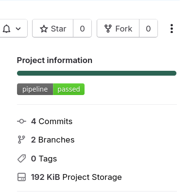
>
> 3. You can click on this badge to get more information about the tests
>    - you can also click on the green checkmark or red cross next to your latest commit see validation pipeline details
>    - if your tests are failing, this can give you more information about what is wrong
>    - if it is green, you usually don't need to look at the test details.
>    - We will cover testing in more detail in a different tutorial, for now, just know that it exists.
{: .hands_on}

This test performs some basic checks, but in order to publish our ARC, we need additional validation. This is not
enabled by default.

## Enabling Invenio testing

Publishing of ARCs uses [Invenio](https://inveniosoftware.org/). Before you can publish your ARC,
we must enable the *Invenio validation package*.

> <hands-on-title> Invenio Validation </hands-on-title>
>
> 1. Click on **Validation** in the ARCitect menu panel
> 2. Under **Custom Validation Packages**, select **Invenio**
>    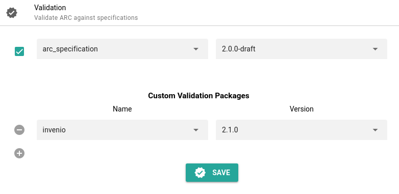
> 3. Click **Save**
> 4. Sync the change to DataHUB
>    - Remember to **commit** first
> 5. Open your ARC repository on DataHUB again
>    - You should see additional badges
>    - Note that it may take a few minutes for these badges to show up
>    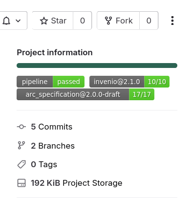
{: .hands_on}


## Publishing Process

Once all of the test pass, you can start the submission process for publishing your ARC.

> <hands-on-title></hands-on-title>
>
> 1. Open your ARC repository on DataHUB
> 2. Click on the invenio testing badge
>    - This can only be done if the badge is green
> 3. This will open a screen where you can preview the basic ARC information
>    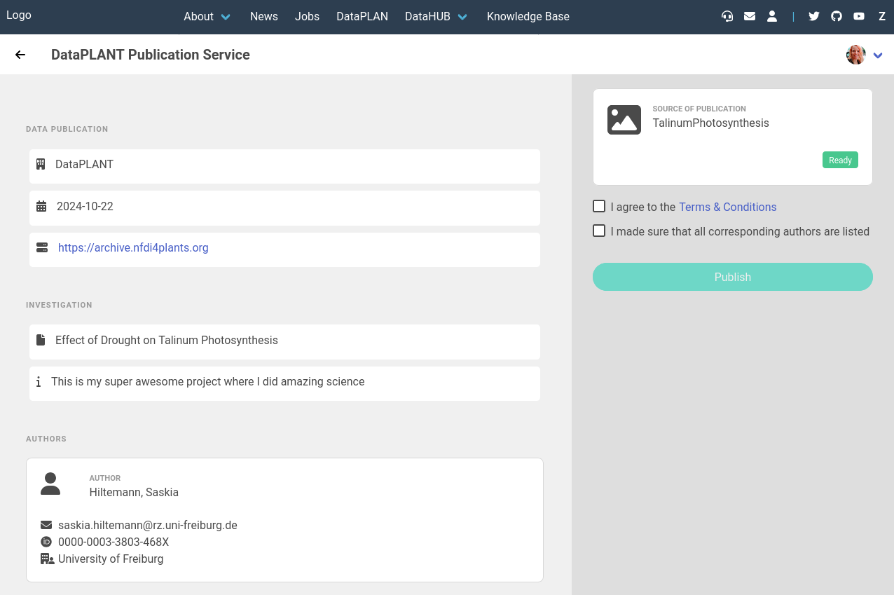
> 4. We will not publish this training ARC, but for your real ARC you would now check the boxes to agree to the terms, and then hit the **Publish** button.
{: .hands_on}


## Where is your ARC published to?

After publishing, your ARC will be public, and automatically included in several locations.

### ARChive

The DataPLANT [ARChive](https://archive.nfdi4plants.org/) will list all published ARCs

For example [this ARC](https://archive.nfdi4plants.org/records/9e5jx-75d83)

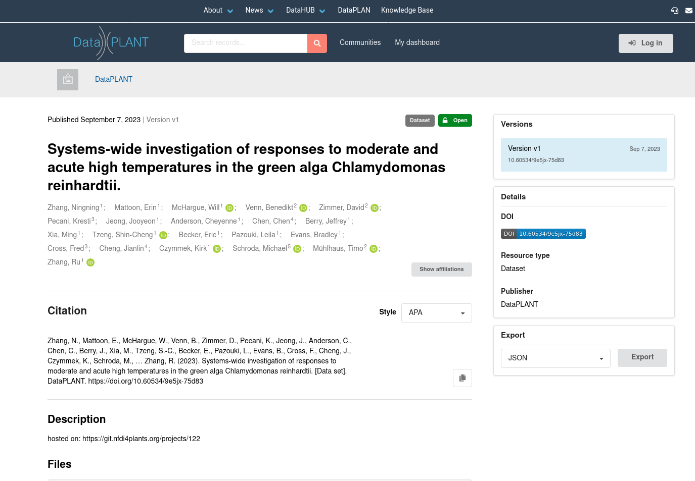

You see this looks a bit like a publication. Notice the DOI on the right. Every ARC will receive a DOI.
You can use this DOI in your publication to point readers to your ARC.

> <comment-title> Updating a published ARC </comment-title>
> Note that you can still update your ARC after publishing, and you can publish a newer version. You will
> receive a new DOI for the updated ARC, and the original version of your ARC will remain accessible
> with the original DOI.
{: .comment}

### ARC Registry

The [ARC registry](https://arcregistry.nfdi4plants.org/isasearch) is another place where your ARC will be listed.
The ARC registry can search across different institution's DataHUBs, and supports advanced searching of ARC metadata.


Many of these ARC searching and aggregation portals are still under active development, and may change/improve a lot in
the coming years.

# Next steps on your ARCification journey

You should now know the basics needed to create an ARC for your own data using the ARCitect tool.

For support during the process of creating an ARC for your own project(s), have a look at:
- The [DataPLANT knowledgebase](https://nfdi4plants.org/nfdi4plants.knowledgebase/).
- The [DataPLANT helpdesk](https://helpdesk.nfdi4plants.org/?topic=Documentation_KnowledgeBase)


# Conclusions

Congrats! You have now created your first ARC using ARCitect, you synced it to DataHUB, and saw the procedure for publishing
your ARC.

