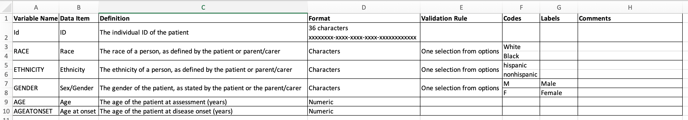

# Introduction

The life science community is generally very good at sharing omics data on platforms such as [GEO](https://www.ncbi.nlm.nih.gov/geo/) and [ArrayExpress](https://www.ebi.ac.uk/biostudies/arrayexpress).  However, the metadata and clinical data associated with the omics datasets are often incredibly sparse.  Tracking down the meta- and clinical data of omics datasets can be time-consuming for both data owner and researcher.  This also means exploration of enriched omics is overlooked at a time when there are so many tools in data analyses, machine learning and AI.

[comment]: <> (I wonder if "overlooked" could be replaced with "made difficult" or something similar?)

In this tutorial, you will learn the benefits of making clinical datasets FAIR and how to make them FAIR.

[comment]: <> (I know the definition of FAIR in the abbreviations list, but I wonder if it should be spelt out again the first time it is used in the main text.)

> <agenda-title></agenda-title>
>
> In this tutorial, we will cover:
>
> 1. TOC
> {:toc}
>
{: .agenda}

# Clinical datasets

> <hands-on-title>How would you describe what are clinical datasets? -  2 minutes - Silent reflection</hands-on-title>
>
> * consider in general terms
> * consider more specifically

{: .hands_on}

In general, clinical data are clinical reports (from trials and observational studies) and individual patient data.  In this section, we will explore some of the different types of clinical data.

[comment]: <> (Maybe change "In general, clinical data are..." to "In general, the most common clinical data used in research are...")

## Metadata that accompanies transcriptomic data
In GEO and ArrayExpress the elements that we are describing as clinical data are the Characteristics or Source Characteristics.

> <hands-on-title>Explore GEO and ArrayExpress for characteristics -  5 minutes</hands-on-title>
>
> 1. Click on the link below for ArrayExpress and open the section for Source Characteristics  
>    [ArrayExpress](https://www.ebi.ac.uk/biostudies/arrayexpress/studies/E-MTAB-12829 )
> 
> 2. Take a look at the Experimental Factors.  Notice that there are very few characteristics available for this dataset
>
> 3. Click on the link below for GEO  
>    [GEO](https://www.ncbi.nlm.nih.gov/geo/query/acc.cgi?acc=GSE65391)
>
> 4. Under the Samples section, click on one of the healthy controls.  Here you will see that this dataset has many characteristics.  Notice, however
>    that there is not much information gathered on the healthy controls
>
> 5. Click on one of the samples with systemic lupus erythematosus (SLE).  Notice here that there is more data collected on SLE subjects
>
> 6. Explore ArrayExpress and/or GEO for datasets within the domain(s) that you are familiar with.  Take note of the availability of characteristics data 
>    for the different datasets
>
{: .hands_on}

## Interventional clinical trials
In these trials, usually, the participants have a condition or disease, and the research question is related to the effectiveness of a treatment.  Some of the participants are given the treatment(s) under investigation, and the other participants are given either a placebo or non-treatment drug.  Usually, these are under double-blind conditions, both participant and doctor do not know whether they are receiving/dispensing treatment or a placebo.  In addition, there may also be a set of control participants who do not have the condition or disease.  Data is usually collected at baseline or screening before any treatment or placebo is given, and then at least one time point in the future.  The breadth and type of data collected can vary across trials, and this can be limiting when trying to pool data from different trials.  The data collected could be minimal, with basic metadata to accompany the sample or imagining data.  But the data collection could also could be quite extensive, including quality of life questionnaires filled out by the patient.

An example of an interventional clinical trial is [TRACTISS](https://bmcmusculoskeletdisord.biomedcentral.com/articles/10.1186/1471-2474-15-21), where the aim of the study was to establish whether the drug rituximab improves clinical outcomes for Primary Sjögren's Syndrome patients.

## Observational clinical trials
In these trials, data is collected at least once, there may not be a follow-up collection.  The research question is usually related directly to the disease or condition, for example, understanding the biomarkers of a disease.  As with interventional clinical trials, the breadth of data collected varies on the trial.  There is often a control group but not always.  

[PRECISEADS](https://www.imi.europa.eu/projects-results/project-factsheets/precisesads) is an example of an observational clinical trial where the study's aim is molecular reclassification to find clinically useful biomarkers for systemic autoimmune diseases.

## Registries
Registries usually record (over a period of time), the disease progression of patients with the same disease or condition.  Often referred to a hub/collection point once the diagnosis is confirmed.  Patients are continually added to the registries and therefore registries can provide a large pool of patients with relatively similar data collected.  As these are registries of patients with a particular condition, there are no control participants.

Here are links to two registry projects.  Both websites describe the projects, the aims and the outputs of the studies.

[UK Sjögren's registry](https://www.sjogrensregistry.org/index.php)  
[UK JIA Biologics Registers](https://www.sjogrensregistry.org/index.php) 

[comment]: <> (These two links are pointing to the same page.)

## Electronic health records (EHR)
These are generally the data collected when a person has contact with the health services.  In the UK, EHR data is either at the Trust level or at the country level, e.g. NHS England, and it is usually necessary to specify primary care (GP, pharmacy, dental and optometry) and/or secondary care (hospital and specialists) data.  This data is usually received as anonymised data, to avoid the ability to identify individuals from the data.

[comment]: <> (This part may need rewording. My understanding is that EHRs are provided by: 1) GPs (two main platforms are EMIS Web and TPP SystmOne) and, 2) NHS trusts (many different suppliers).  NHS England provides advice on accredited suppliers.)

In the UK, Clinical Practice Research Datalink ([CPRD](https://cprd.com)) collects anonymised patient data from a network of GP practices links this data to a range of other health-related data and provides a longitudinal, representative UK population health dataset. 

The [Health Data Research Innovation Gateway](https://www.healthdatagateway.org/) can help researchers to find and discover UK health datasets, tools and other resources to further health research.

> <hands-on-title>Explore HDRUK Innovation Gateway for datasets -  5 minutes</hands-on-title>
> 
> 1. Click on Datasets in the [Health Data Research Innovation Gateway](https://www.healthdatagateway.org/)
> 
> 2. In the filters, expand Publisher and in Search Filter type CPRD and enter  
> 
> 3. Select CPRD  
> 
> 4. Expand Phenotype and search for rheumatoid, and select Rheumatoid Arthritis  
> 
> 5. Take a look at the information about the two datasets  
> 
> 6. Clear the filters, and search for datasets related to your areas of interest  
>
{: .hands_on}

# The importance of making clinical datasets FAIR

## Associations between clinical features and omics
In some recent work in rheumatoid arthritis, it was demonstrated that simple patient demographics such as sex, ethnicity and age are all drivers of expression variation in addition to disease activity.  Principal component driver plots highlighted critical associations between diverse clinical features and omics.  This shows how rich clinical information may be key to analysis in some, if not, many diseases.  

[comment]: <> ("In some recent work in rheumatoid arthritis..." => is there a link you could add to this work?)

> <hands-on-title>Do the datasets have all these characteristics -  5 minutes</hands-on-title>
>
> For your domain, look at datasets on ArrayExpress and GEO and see how many of them have sex, age, ethnicity/race, and some measure of disease activity
>
{: .hands_on}

## Powering up cohorts for analyses and machine learning
For many diseases (or even pan-diseases), there is a need for well-powered cohorts with hundreds to thousands of participants, for analysis purposes.  FAIR principles have been widely promoted for omics datasets, but as shown, there are key challenges to meta-analysis.  This is illustrated by an example of collating 17 public rheumatoid arthritis studies.  The clinical data in most cases were sparse and incomplete.  For example, of the curated 17 studies, three did not include sex, 5 did not include age and only one study included ethnicity or race.  The limitations in the availability of clinical data substantially diminish the value of public data sets and violate FAIR principles.

[comment]: <> ("pan-diseases" may need defining.  Is there a link to the rheumatoid arthritis study example? The use of "violate FAIR principles" sounds harsh. Could this be reworded?)

Similarly, in order to make the most of machine learning techniques, datasets need to be reasonably large.  

## Time-saving
Usually, after finding potentially interesting datasets on GEO or ArrayExpress, the next step in trying to enrich these public datasets is to contact the PI of the study to request additional data.  From experience, the PI is usually happy to share additional data, especially if there have been previous collaborations.  However, even given the willingness to share, there is a time-consuming process of contacting the person who has the data and reaching agreement on what can and will be shared.  This at best will take weeks, but most likely months, especially if there is a lapse in communication between parties.

[comment]: <> (Maybe include a final sentence to bring this together with the time-savings made by initially releasing rich and FAIR (meta)data)

# Practical techniques to make clinical data FAIR
There are certain privacy concerns when making clinical data freely available through public libraries such as GEO and ArrayExpress. Data needs to be anonymised, or at least pseudo-anonymised.  

> <hands-on-title>What data would be problematic to share? -  5 minutes</hands-on-title>  
>
> Take a look at the data below and consider which columns and data may be problematic to share  
> 
>
> > <solution-title></solution-title>  
> > * Remove columns C (FIRST), D (LAST), H (ADDRESS) and L (ZIP) as these are clear identifiers of the person  
> > * In terms of location, it is preferable to keep this as broad as possible.  In this case, keep column J (STATE) but drop columns I (CITY) and 
> > K (COUNTY).  It is debatable whether to keep them or not  
> > * Column B (BIRTHDATE) is another clear identifier but could be replaced by age  
> > * It is preferable not to keep dates (Columns (DATEOFASSESSMENT) and N (DATEOFDISEASEONSET))  
> >
> > We will discuss date handling in the next section  
> {: .solution}  
{: .hands_on}  

## Converting dates to time periods 
Avoid including dates and convert these into time periods.  For example, use date of birth and date of assessment to calculate Age (at assessment or baseline).  Similarly, calculate Age at Diagnosis, and Age at Onset, if dates are given.

If there are more than one visits, and if these are not within roughly defined time periods, for example, 4 weeks, or 12 weeks, calculate the number of days between the visits.

> <hands-on-title>Which columns would you change to time periods from dates? -  10 minutes</hands-on-title>
> 
>  For the dataset below identify the columne you would change to time periods and convert them to time periods
> 
>
> > <solution-title></solution-title>  
> > * Replace BIRTHDATE with AGE at DATEOFASSESSMENT  
> > * Replace DATEOFDISEASEONSET with AGEATONSET 
> > * Remove BIRTHDATE, DATEOFASSESSMENT and DATEOFDISEASEONSET
> > 
> >   
> >
> {: .solution}  
{: .hands_on}  

## Comprehensive metadata for omics datasets
When publishing omics datasets to libraries such as GEO and ArrayExpress, consider at least including Age, Sex, Race/Ethnicity, and if possible some disease activity measure.  Publishing as much as possible is great for researchers to access enriched datasets, and also reduces fielding queries and requests to the PI.

## Data dictionaries
There are cases when PIs would rather not have the clinical datasets on free-to-access platforms.  In these situations, the clinical datasets can still be made FAIR.  By having clear documentation of the datasets, these documents can be published and attributed to the project or consortia.  For each individual clinical dataset, it is useful to have a data dictionary.

A data dictionary is the metadata of the dataset.  It should include details such as data type, value range or allowed values, any relationship to other data elements and their meaning or purpose.  The details of the data dictionary often originate from how the data was input either at the source or into the database.

Here’s an example of a data dictionary used on a project

> <tip-title>Key things to note</tip-title>  
>
> * The variable name is often the short form name of the data item  
> * The definition describes the data item more fully  
> * In the data dictionary example shown above, data items are encoded, and so their format is numeric, with constraints
> * The validation rule usually refers to instructions given when data was originally input, but it could be the calculation formula for the data item  
> * Codes and Labels here are the encoding definitions  
{: .tip}

> <hands-on-title>Create a data dictionary for the dataset below -  10 minutes</hands-on-title>
>
> 
>
> > <solution-title></solution-title>
> > Here is one example of a suitable data dictionary for the above dataset
> >
> > 
> >
> {: .solution}  
{: .hands_on}  

A key benefit of data dictionaries is that the information captured is generally not confidential or patient-sensitive and, therefore, there are few if any restrictions to sharing them.

[comment]: <> (This is an excellent exercise!)

## Data catalogues
Data catalogues are useful for teams, projects or consortia where there are many datasets being used and generated by the group.  Data catalogues are the metadata for the individual datasets, and they can provide context and provenance for each dataset within the group of datasets.

Here is an example of a data catalogue

You may not want to capture all these metadata, and you may want to include other items such as phenotype, links to any publications related to the dataset, and links to the published dataset.

Additionally, if there are complex data-sharing agreements, this information could be added to the catalogue (for internal use).

When projects and consortia are live, the corresponding data catalogue is a work in progress alongside the project and needs to be updated as required.  Although data catalogues can be somewhat time-consuming to set up, this is more than made up with the time saved looking for details about datasets, especially as people switch in and out of the team.

As with data dictionaries, data catalogues rarely capture any information that needs to be restricted access and usually can be shared in full.  The exception potentially may be the contact person's email address.  

[To add: More information about data catalogues can be found in these RDMbites (add links)]

## Publishing on Zenodo
Data dictionaries and data catalogues include a wealth of information about the clinical datasets they reference, and in general, contain no sensitive or confidential data.  [Zenodo](https://www.zenodo.org) is an open repository for research outcomes hosted by CERN.  It is free to use and each upload is citeable through a Digital Object Identifier (DOI).  Uploads are instantly available, with version control features.  Publishing on platforms such as Zenodo can help make your data findable.

Here, you can see published data dictionaries for a consortium

To upload, create a login using GitHub ID, ORCID, or email.  Click on Upload (at the top of the page, left of centre), and follow the instructions.

## Managing Data Access Requests
Regardless of whether or not you publish data dictionaries and data catalogues, it is worth considering the mechanisms when receiving data access requests.  

When a project is ongoing, if there is a Data Management Committee (DMC), the responsibility for data access requests would be with the DMC.  It is really helpful to have a centralised point to provide data governance including guidelines for data sharing.

It is really worthwhile clarifying the process of handling data access requests to minimise effort and delays for both the data holder and the data requester.  This process may need to be revised as the project ends.

> <tip-title>Points to consider when handling data access requests</tip-title>  
> * Who will be the point of contact and the email address (e.g. create a general project email that is handled by the project administration team)
> * Expected length of time before requester receives a response
> * Involve the institution's legal team 
>   - Terms and conditions of use of data and/or samples
>   - Publication guidelines
> * Standardise the process with a Data Access Request Form  
{: .tip}

An example of a data access process is shown below

This is an example of a data and sample access request form and contracts associated with data and samples
[To do: upload example Data access request form to Zenodo and add a link (check Sharepoint for authorship guidelines)]

In the UK, the HDRUK Innovation Gateway may also be a way to manage the data access request process. 

[comment]: <> (I understand that the process for centrally managing data access requests via the Innovation Gateway is a work in progress.  Currently, when registered users request access to datasets, this just pings an email to the local dataset contact.)

