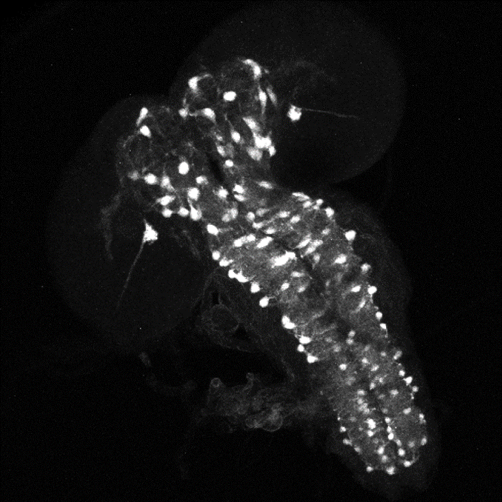
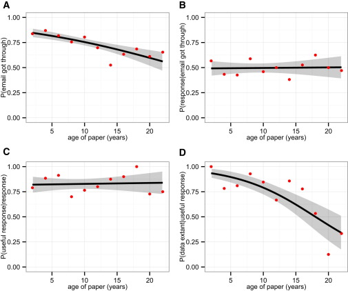

# Introduction

**You** are obviously too important to bother with this {RDM} nonsense. Just copy the {DMP} from a previous grant application and stop wasting time.
However, there might be some value in persuading your colleagues to do their {RDM} properly and to adhere to {FAIR} standards. In this tutorial, we explore the purely selfish reasons for encouraging good data management practices based on some real-life examples.

> <agenda-title></agenda-title>
>
> In this tutorial, we will cover:
>
> 1. TOC
> {:toc}
>
{: .agenda}

# Excercise 1: Find the experiment

## The Problem

Imagine the following situation: An undergrad student wants to do a lab-based project with you. This is great because your post-doc has recently left the lab and there are several promising leads from their work that can be followed up. You propose the following topic to the student: 

> Effect of mutations in the gene CHES-I-like on feeding behaviour in _Drosophila melanogaster_
{: .quote}

The only problem is, you can't remember what your post-doc has done so far. This is no problem, as you have followed your data management plan to the letter: _"lab books will be preserved for 10 years in the PI’s office"._ Let's see how effective this strategy actually is.

> <question-title></question-title>
> The PDF below contains a scan of the lab books in this example. Somewhere, there is an experiment to show the effect of the knock-down of a gene called CHES-I-like on the feeding behaviour of fruit flies. Try to find this information in the lab book.
> [5 years worth of lab books](Lab-book_excercise1.pdf)

> > <solution-title></solution-title>
> > The information can be found on page XXX of the pdf.
> {: .solution}
>
{: .question}

Too difficult? Maybe try something a bit more easy

> <question-title></question-title>

> The information can be found on page XXX of the lab book. Can you tell me how this experiment was designed?

> [5 years worth of lab books](Lab-book_excercise1.pdf)

> > <solution-title></solution-title>
> > No you can't. Neither can I. Obviously our {DMP} did not do us any favours here.
> {: .solution}
>
{: .question} 

## The solution

The problem descibed above could have been avoided by creating a {DMP} before the start of the project. A {DMP} is a document that describes how research data is going to be managed during and after the project. Importantly, A {DMP} is a living document that may need to be altered during the project. Any time the research plan changes, the {DMP} should be reviewed and updated.
Learn more about {DPM}s from these excellent resources:  and 

# Excercise 2: Reproduce the experiment

## The Problem

Imagine the following situation: You have got great data. The editors of Nature, Science and Cell are all knocking on your door to publish in their journals. The only thing standing between you and a Nobel prize is one picture of an immunostaining that is not publication quality and the immunostaining needs to be redone. 

> <question-title>2</question-title>
> This is an immunostaining of a fruitfly brain. Can you list 15 more pieces of information that you would need to be able to reproduce this image?
> > <solution-title></solution-title>
> > 1. Which fly strain
> > 2. Which developmental stage
> > 3. Which genotype
> > 4. Time of day
> > 5. Feeding conditions
> > 6. Sex
> > 7. Mating condition
> > 8. Fixation time and conditions
> > 9. Primary antibody
> > 10. Secondary antibody
> > 11. Dilutions of antibodies
> > 12. Staining protocol
> > 13. Which microscope
> > 14. Which laser lines
> > 15. What exposure time
> > 16. Filter settings
> > 17. Magnification
> > 18. Pinhole size
> > 19. Number of z slices
> > 20. ...
> > 
> {: .solution}
>
{: .question}

## The solution

This excercise illustrates how much information you need to keep to be able to reproduce experiments, be it your own data or that of other scientists.
More often than not, this level of detail is not recorded / published, which may explain part of the **reproducibility crisis** .

This information about the data is called **metadata** and is arguably as important as the data itself.  

# Excercise 3: Get the data

## The Problem

Imagine the following situation: it has been a slow couple of years in terms of publications and grant income. You really need to get papers out, but you are short of research money. No worries! There is tons of data pit there for you to re-analyse, interpret, and integrate with your own data. You have found a particularly useful study in a paper and you want to use the data to get your research going again. In the data sharing statement, you find the following sentence: 

> The data that support the findings of this study are available from the corresponding author upon reasonable request.
{: .quote}

> > The data that support the findings of this study are available from the corresponding author upon reasonable request.
{: .quote}
> 
> <question-title>3</question-title>
> Can you list a couple of reasons an author might have not to publish the data he is reporting?
> > <solution-title></solution-title>
> >
> > 1. Conflicts of privacy and confidentiality e.g. patient data
> > 2. Economically sensitive data e.g. patent applications
> {: .solution}
>
{: .question}

> <question-title>4</question-title>
> Since the authors will provide the data upon **reasonable** request, give an example of an **unreasonable** request
> > <solution-title></solution-title>
> > I don't think there are unreasonable requests?
> {: .solution}
>
{: .question}

Recently, the following has appeared in severeal journals: 

> Contact the authors for detailed protocol
{: .quote}

> <question-title>5</question-title>
> If the publisher won't accomodate lengthy protocols in the main paper, what would be a good place to publish detailed protocols?
> > <solution-title></solution-title>
> >
> > 1. Supplementary Data
> > 2. Github
> > 3. Dedicated Methods paper
> {: .solution}
>
{: .question}

You are resigned to the fact that you will have to contact the authors to get the data. Let's have a look at this paper  to get an idea how likely it is that you will actually be succesful.

Figure 1 in this paper is especially revealing:

In this figure, four obstacles to receiving data from the authors are identified
1. the probability that the paper had at least one apparently working e-mail. Worryingly, even in the first year, this is only 80 % and drops off as the paper ages. Academics usually put their university email address on the paper, but they also move around from institute to institute causing the emails to get lost.
2. probability of receiving a response, given that at least one e-mail was apparently working. This is disappointingly low to start with, but remains stable over the years
3. probability of receiving a response giving the status of the data, given that we received a response. This is also stable at around 80%
4. probability that the data were extant (either “shared” or “exist but unwilling to share”) given that we received a useful response.

> <question-title>6</question-title>
> From the previous graph, calculate the likelihood of getting hold of 10 year old data
> > <solution-title></solution-title>
> >
> > 0.75 x 0.5 x 0.8 x 0.75 = 0.225
> > You have a 22.5% chance of getting the data!
> {: .solution}
>
{: .question}

## The solution

The problems described above all relate to (lack of) data reuse possibilities by researchers. The {FAIR} principles of research data management have been established precicely to increase data reuse.
Learn more about the {FAIR} principles in these excellent GTN tutorials:  and 

# Conclusion

