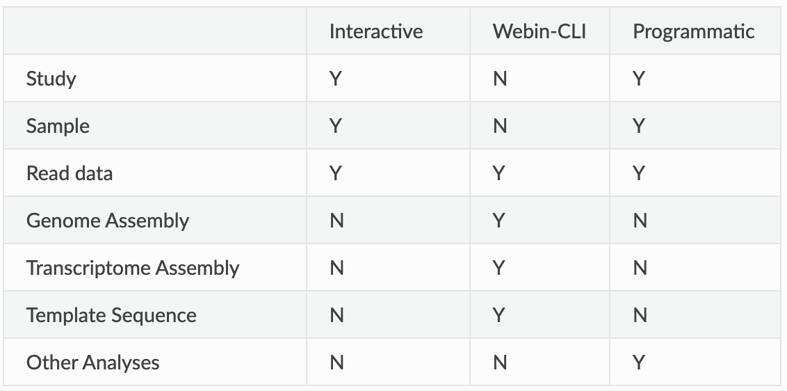

> <agenda-title></agenda-title>
>
> In this tutorial we will deal with:
>
> 1. TOC
> {:toc}
>
{: .agenda}

# 01. Introduction

Prior to publication many journals and funders require authors to submit their sequence data to one of the three INSDC member databases – ENA, NCBI or DDBJ – between which data is synchronised on a daily basis. INSDC is the core infrastructure for sharing nucleotide sequence data and metadata in the public domain. Data in INSDC member databases is available permanently, for free and with unrestricted access. For each submitted sequence a unique accession number is issued which can be reported in the publication. 

In this tutorial you will learn to upload read data and accompanying metadata to the ENA test server.  

## ENA Submission Routes

There are three routes via which one can submit data to ENA. 
1.	The Webin Interactive portal, which allows you to submit data by filling out forms on your browser. This is what we will cover in this RDMBite,
2.	Webin-command-line interface, which allows submissions through a terminal, and
3.	Programmatic submission, which requires the submissions to be prepared as XML documents and then uploaded using cURL or Webin portal. 



As you can see from the table, you can submit some data types only through a certain route. Read data can be submitted via all three routes. 

To submit reads to ENA you will need to have a Webin submission account. You can register an account free of cost through the Webin portal (https://www.ebi.ac.uk/ena/submit/webin/login).

ENA gives a detailed guide to data submission (guide - https://ena-docs.readthedocs.io/en/latest/submit/general-guide.html). ENA frequently changes its submission protocols, so you should check the ENA guide for updates.

## ENA Metadata Model

The metadata model represents how metadata for a submission is structured and linked. Different information pertaining to a submission is organised into objects. Therefore, understanding the metadata model will enable you to determine what you need to submit. 

### 1. Study
All submissions require the study object. This object defines study accession, ownership, affiliation and release date. It also binds together all related objects into one cohesive project.

Upon submission you will receive a BioProject accession (PRJEB*) which can be used for citing data submitted to ENA, and a study accession (ERP*).

### 2. Sample
Defines metadata about the sequenced biomaterial, e.g. bacteria, virus, etc. One sample should represent one sequencing library. 

To ensure that each sample is registered with sufficient metadata so as to provide enough context for the data to be easily interpreted, a mandatory, recommended and optional  set of attributes need to be provided for a sample. These sample checklists differ with the nature of the sample.

A registered sample will receive a BioSample accession (SAMEA*) and ENA sample accession (ERS*).

### 3. Raw reads
Metadata for raw reads is represented in 'experiment' and 'run' objects, where 'experiment' holds metadata on sequencing method and 'run' holds metadata about the read files and their location on an FTP server. 

Each read file submission will receive a run accession (ERR*) and an Experiment accession (ERX*). 

## Webin submissions portal
Making and manage submissions to ENA using this portal - https://www.ebi.ac.uk/ena/submit/webin/.

# 02. Submitting data
## 1. Webin login
Log in to ENA Webin portal https://www.ebi.ac.uk/ena/submit/webin/. If you don't have a login you will have to register for an account. Go ahead and do that - it is free.

## 2. Study metadata

###  Metadata preparation
To register a study you will need the following metadata:
1. Study Name
2. Short descriptive study title
3. Detailed study abstract
4. Release date (if before 2 years from now)

1-3 will be displayed in the Project entry page. Make it as detailed as possible so as to make it searchable. For example see the entry for [PRJEB55803](https://www.ebi.ac.uk/ena/browser/view/PRJEB55803).

> <hands-on-title>Register study</hands-on-title>
> Once you have the above information at hand register your study.
> 1. From the Webin dashboard click on 'Register Study' to bring up the study submission form. 
> 2. Complete the form to your best knowledge ensure attributes with '*' are completed. 
> 3. Click 'Submit' to create a new study. 
> 4. If successful, you will receive a confirmation message with two accession numbers - PRJEB* (BioProject accession) and ERP*. Save them as you will need them for read submission step.
>
> > <tip-title>Filling in study metadata</tip-title>
> >You may want to set the submission date to the maximum allowed - 2 years from today. You can change it when you are ready to release the data. 
> >Study Fields are editable after submission should you need to update any information.
> 
> {: .tip}
>
> ><question-title></question-title>
>
> >How can you confirm that your study has been successfully registered?
>
> > > <solution-title></solution-title>
> > >
> > > Click on the Dashboard icon, select 'Studies Report'. The accessions for your study should appear next to the Study title and other attributes. 
> >
> > {: .solution}
> {: .question}
>
{: .hands_on}


## 3. Sample metadata
Next, you should register the samples from which your sequence data is derived.  
###  Metadata preparation
Minimum metadata requirement for different checklists varies. Here we list only what is required for the ENA default checklist (ERC000011).
1. Taxonomy ID of the organism sequenced
2. Scientific name of the organism sequenced
3. Unique name of the sample (auto-generated unless provided)
4. Sample title
5. Sample description
6. Collection date
7. Geographic location

Other checklists include:
+ Pathogen checklist
+ Environmental checklist
+ Marine checklist 

Find the complete list of checklists [here](https://www.ebi.ac.uk/ena/submit/checklists).

> <hands-on-title>Download sample checklist</hands-on-title>
> 1. From the Dashboard, inside the 'Samples' box, click on 'Register Samples'.
> 2. Expand the 'Download spreadsheet to register samples' box and select 'Other Checklists'.
> 3. Click on 'ENA default sample checklist' (or the most appropriate checklist for your study). 
> 4. The mandatory attributes will be auto-selected. Expand the 'Optional Fields' box and select attributes you would like to include. 
>
Your checklist will look like below.  
| <!-- -->    | <!-- -->    | <!-- -->    | <!-- -->    | <!-- -->    | <!-- -->    | <!-- -->    |
|-------------|-------------|-------------|-------------|-------------|-------------|-------------|
| Checklist	| ERC000011	| ENA default sample checklist | | | |
| tax_id	| scientific_name |	sample_alias	| sample_title	| sample_description	| collection date	| geographic location (country and/or sea)
| #units | | | | | |
 

>
> > <tip-title>Optional Fields</tip-title>
> > When registering a sample, it is recommended that you provide as much metadata as possible so as to make your study more searchable and useable. 
> 
> {: .tip}
> > <question-title></question-title>
> >
> > What format should the collection date be in? Read descriptions for other attributes to get a clear understanding of the attributes and permitted values. 
> >
> > > <solution-title></solution-title>
> > >
> > > Date/time in any of these formats is acceptable:
> > > 2008-01-23T19:23:10+00:00; 2008-01-23T19:23:10; 2008-01-23; 2008-01; 2008
> > {: .solution}
> {: .question}

> 5. Click on 'Next' to get to the 'Download TSV Template' button.

{: .hands_on}

> <hands-on-title>Upload sample checklist</hands-on-title>
> 1. Open the Checklist_*.tsv file in a text editor of your choice e.g. MS Excel.  
> 2. Fill one sample per row, starting from row 4. Make sure you fill in all the columns. 
> 3. In the '#units' row specify the unit of measure, if required.
> 4. Make sure you save the checklist.tsv file in tab-delimited format with .tsv or .tab extension and not .xlsx or .csv.
> 5. In the Webin Portal, select 'Register Samples' and then 'Upload filled spreadsheet to register samples'. Upload your checklist.tsv file via 'Choose File' button. 
> 6. Click on 'Submit' to submit the checklist.
> 7. If the structure of your checklist is correct and the upload is successful you will receive a confirmation message and Sample accession numbers -  SAMEA* (BioSample) and ERS*. 

> <tip-title>Sample Alias</tip-title>
> Remember to enter sample aliases that correspond to what you use in related publications. This will enable readers to find sample-specific metadata and read files, even if you only state a Project accession number in your paper. Sample aliases can, furthermore, be optionally displayed as Unique name in the Sample report. 
> 
> {: .tip}

{: .hands_on}

## 4. Read metadata
###  Metadata preparation
Reads can be submitted in several formats, such as fastq, BAM, CRAM, fast5, etc. Here we will look at submitting paired-end fastq files.
Metadata required for this are:
1. Sample alias or accession (from Sample submission step)
2. Study alias or accession (from Study submission step)
3. Sequencing instrument model (e.g. Illumina MiSeq, Illumina NextSeq 500, MinION, etc.)
4. Library name (if any)
5. Type of source material sequenced (E.g. genomic, transcriptomic, etc.)
6. Library selection method used (e.g. PCR, cDNA, etc.)
7. Library sequence strategy (e.g. RNA-Seq, WGS, etc.)
8. Library layout i.e. single or paired-end
9. Forward fastq file name (must be compressed, and name to include subdirectory)
10. MD5 checksum of forward fastq file (if not using Webin file uploader)
11. Reverse fastq file name (must be compressed, and name to include subdirectory)
12. MD5 checksum of reverse fastq file (if not using Webin file uploader)

### Fastq file preparation
First, we need to confirm that your read files are in the correct format. Refer to [ENAs file format guidelines](https://ena-docs.readthedocs.io/en/latest/submit/fileprep/reads.html) if you are not sure.

> <hands-on-title>Linux or OSX</hands-on-title>
> #### On a Linux-based operating system
> **Step 1**:
> Compress the fastq files for the upload using gzip. 
>
>  Open the terminal on your machine then type the commands below. First move to the directory where fastq files are located, then compress the fastq files using gzip command.
> ```
> # In the command below replace '/path/to/fastq/directory' with the correct path
> cd /path/to/fastq/directory
> 
> gzip *.fastq
> ``` 
> **Step 2**: 
> To enable verification of the integrity of the uploaded fastq file, ENA requires md5 checksum for each file.
> 
> Type the command below to calculate and print md5 sums to tab-separated file (for easy cut-and-paste later).
> ```
> for f in *.gz; do md5 $f | awk '{ gsub(/\(|\)/,""); print $2"\t" $4 }'; done > md5sums.tsv
> ```
> md5sums.tsv will contain a tab-separated table of fastq.gz filenames and their md5sum. 

{: .hands_on}


<hands-on-title>Read checklist submission</hands-on-title>
> 1. From the 'Dashboard' select 'Submit Reads' from Raw Reads box. 
> 2. Similar to how you downloaded the sample checklist, download the Read submission template for 'paired reads using two fastq files'.
> 3. Select the relevant optional fields to be included in the spreadsheet.
> > <tip-title></tip-title>
> > + Tick the box next to 'Show Descriptions' to reveal text describing the attributes
> > + To find the sample alias and accession look in 'Sample Reports'
> > + To find the study accession look in 'Studies Reports'  
> {: .tip}
>
> 4. Click 'Next' and download the spreadsheet .tsv file.
> 5. Fill in the spreadsheet, paying particular attention to the following:
> >+ sample: same as you used in sample submission - alias or accession
> >+ study: use study accession
> >+ forward/reverse_file_name: make sure this is the same as what will be uploaded. It should be the compressed .gz file you created.
> >+ forward/reverse_file_md5: copy this from md5sums.tsv you generated earlier.
> 6. Uploaded the completed spreadsheet and submit.
> 7. If the upload is successful a run accession (ERR*) and experiment accesion (ERX*) will be issued for each read submission. 

> > <tip-title></tip-title>
> > The run submission holds information about the raw read files generated in a run of sequencing as well as their location on an FTP server. The experiment submission holds metadata that describe the methods used to sequence the sample.
> {: .tip}

{: .hands_on}

## 5. Read data upload
ENA offers [several methods](https://ena-docs.readthedocs.io/en/latest/submit/fileprep/upload.html) to achieve this. Please take a look at all the options should any suit your needs better than the one provided below.

If you are using a Linux-based system you can use the below commands without needing to install any software.

```
cd /path/to/fastq.gz
curl -T <<your_file>>.gz -u Webin-XXX:password ftp://webin2.ebi.ac.uk/
```
Note: The Webin upload area is a temporary transit location which is not backed up. Always ensure you retain a local copy of the data till the files have been successfully submitted and archived.

## 6. Post-submission editing
All reports can be edited by clicking on the box-arrow icon in the Action column. The underlying xml can be inspected/edited. 
