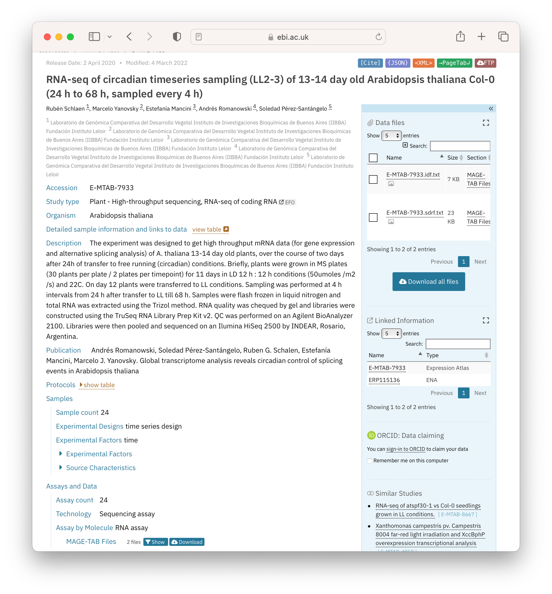

The term metadata is defined along with what constitutes rich metadata.  Learners will be able to recall examples of community/domain standards that apply to data and metadata.

> <agenda-title></agenda-title>
>
> In this tutorial, we will cover:
>
> 1. TOC
> {:toc}
>
{: .agenda}

# Metadata and the FAIR Principles
Metadata relates most directly to the following 10 FAIR Principles highlighted in Table 2.1.  We will discuss and signpost these in this episode.

| The FAIR Guiding Principles |                                                                                                                                                                                                                                                                                                                                       |
| --------------------------- | ------------------------------------------------------------------------------------------------------------------------------------------------------------------------------------------------------------------------------------------------------------------------------------------------------------------------------------- |
| To be Findable:             | F1. (meta)data are assigned a globally unique and persistent identifier **F2. data are described with rich metadata (defined by R1 below)** **F3. metadata clearly and explicitly include the identifier of the data it describes** F4. (meta)data are registered or indexed in a searchable resource                                   |
| To be Accessible:           | A1. (meta)data are retrievable by their identifier using a standardized communications protocol  A1.1 the protocol is open, free, and universally implementable A1.2 the protocol allows for an authentication and authorization procedure, where necessary  **A2. metadata are accessible, even when the data are no longer available** |
| To be Interoperable:        | **I1. (meta)data use a formal, accessible, shared, and broadly applicable language for knowledge representation**  **I2. (meta)data use vocabularies that follow FAIR principles I3. (meta)data include qualified references to other (meta)data**                                                                                         |
| To be Reusable:             | **R1. meta(data) are richly described with a plurality of accurate and relevant attributes**  **R1.1. (meta)data are released with a clear and accessible data usage license** **R1.2. (meta)data are associated with detailed provenance R1.3. (meta)data meet domain-relevant community standards**       |

Table 2.1: The 15 FAIR Guiding Principles. Principles relating directly to metadata are highlighted in **black**.

# What is metadata?

Metadata is information that describes your data - it is data about data.

The provision of ‘rich’ metadata is key to FAIR since it allows data to be found, and enables other researchers to interpret data appropriately. ‘Rich’ in this context refers to extensive metadata, often connecting data to other data or terms (even in other datasets), with **qualified references**, Qualified references: terms used to describe relationships to pieces of (meta)data., specifying how they are connected.

If a researcher is given access to a dataset (a spreadsheet in CSV format, for example), the data is not usable without meaningful column headings and context. For example, what is this data about?  Is it part of a larger dataset and, if so, how is it related?  What are the column headings representing, and what are the rows representing?  Additionally, if the values in the individual cells are device or assay measurements, what device was used, and what assay?  

If you look at the example of the spreadsheet below (Figure 2.1) the metadata are coloured blue and the data are in orange.  The data in this example are clinical observations for a cohort of patients and the metadata are the descriptive column headings and additional information about the origin of the data.  The column headings provide context for the data values in each cell.  The contact information enables a researcher to direct questions about data reuse and context.  This raises an interesting point though, because metadata should be rich enough to allow any person to reuse the underlying data without ambiguity (FAIR Principles F2, R1).  

Though  this Figure 2.1 shows the difference between metadata and data, it does not exemplify the use of rich metadata. 

 and metadata (blue)")

We are given only 2 pieces of **data provenance**, Data provenance: metadata describing the origin of a piece of data, including information such as version, original location of the data, and usually an audit trail up to the current version, in this example (i) the study name “LONDON DIABETES COHORT” which could help discover other documentation about the project; (ii) the name of the person who presumably led the study.  While these may help to search for further information, for a human user, this would still be fraught with issues since both names may not uniquely identify the study or its lead.  For a machine agent, such as a script, interpretation is made difficult because the metadata is not clearly marked-up (represented formally with tags).

To fix this, contact details for investigators could be included.  Often [ORCID IDs](https://info.orcid.org/what-is-orcid/) associated with names are used since they uniquely identify an individual and do not pose problems when an investigator moves institutions and the original (email) address changes.  Coupled with this, investigators can be formally assigned a role in the provenance metadata allowing people to contact the appropriate person, for example, “data producer”, “data manager”.

A project URL should be used where possible, ideally one that can act as a **persistent identifier**, Globally unique and persistent identifier: a permanent reference to a digital resource, usually given as a URL, that takes the user to that resource, for the dataset.  The landing page for that URL should provide more context for the dataset, and describe high-level information such as how the dataset relates to other project outputs, as well as providing other provenance information (dates, times, places, people).  This could include more metadata about the type of study, objectives, protocols, dates, release versioning and so on.  At the end of this episode, resources are given to help define metadata elements that could be included, including a project called [Dublin Core](https://www.dublincore.org/specifications/dublin-core/) which defines [15 such elements](https://www.dublincore.org/specifications/dublin-core/dcmi-terms/) or metadata fields.

Terms of access and reuse are missing which could be rectified by including a [data licence](https://rdmkit.elixir-europe.org/licensing#what-licence-should-you-apply-to-your-research-data), which often appears as part of the metadata, usually at the bottom of a webpage hosting data.
There could be ambiguity around the acronym, “BPM”, used in the third column header, so this should be defined within a glossary of acronyms and or ideally hyperlinked to a definition in an existing ontology.

There are issues too with the data, as well as the metadata. The second column DISEASE TYPE could be better designed. Two pieces of information (data) are depicted in the same column: disease type (diabetes) and disease stage (early/late).  Ideally, these should be in 2 separate columns allowing researchers to subset on stage and disease type independently for downstream analysis. There are also four different terms used for diabetes (“Diabetes Mellitus II”, “Diabetes”, “Diabetes Mellitus” and “Diabetes Mellitus I”), which again does not allow a researcher to subset data efficiently.  To fix this you would use defined terms within an existing vocabulary or ontology.  The following accesses a  we could use, where each term (for example, “type 2 diabetes mellitus”) is described and assigned a unique ID.  In the example above you would use this unique ID, or the associated descriptive  term, to tag all patients with the same disease, identically.  This then makes the data sub-setable and machine-readable.

> <question-title></question-title>
>
> Look at the final row of data in Figure 2.1.  There is a missing disease type.  What problems might this cause?
>
> > <solution-title></solution-title>
> >
> > This isn’t a metadata problem, but it is worth mentioning that missing data can cause more ambiguity.  Does the blank mean the data were not available, or that the data were available but not recorded, or that the individual has no disease? This has implications on how the data are interpreted, and it is likely this data row would be discarded from an analysis.  Here you would be looking to use terms to denote missing, for example, “no disease”, “not recorded”.
> >
> {: .solution}
{: .question}

# Writing FAIR metadata

We have discussed already how rich metadata enables a dataset to be reused and interpreted correctly.  In the context of the FAIR principles, the previous exercise illustrates two of these, namely that _“(Meta)data are richly described with a plurality of accurate and relevant attributes”_ (FAIR Principle R1) and that _“(Meta)data are associated with detailed provenance”_ (FAIR Principle R1,2).  Further to this, the suggested use of the published  for data, illustrates a further three principles, where _“(Meta)data use **vocabularies**,Vocabularies: (or controlled vocabulary) is a dictionary of terms you can use when producing (meta)data, that follow FAIR principles”_ (FAIR Principle I2), and _“(Meta)data meet domain-relevant **community standards**, Community standards: standard guidelines used to structure and exchange data, usually supported by community-developed resources and/or software, (FAIR Principle R1.3). The use of hyperlinks specifically to terms in the ontology means that Metadata includes *qualified references*, Qualified references: terms used to describe relationships to pieces of (meta)data. , to other Metadata (FAIR Principle I3).   From the previous exercise, the [disease ontology](https://disease-ontology.org/) provides the vocabulary for the different types of diabetes: type 1 diabetes mellits  and type 2 diabetes mellitus .   

The FAIR Guiding Principles also highlight the importance of providing rich metadata to enable researchers to **find** datasets such that _“Data are described with rich metadata”_ (FAIR Principle F2).  More often than not, a researcher will find data through searching its metadata, usually via an online or a database search.  Information on how this can be achieved is discussed in the next episode on data registration.

The use of vocabularies and cross-references is fundamental to data interoperability.  Interoperable (meta)data can be linked and combined across studies, aided by consistent,  compatible and machine-readable curation.  [FAIRsharing](https://fairsharing.org/search?fairsharingRegistry=Standard) is a useful registry of vocabularies, and standards, while more comprehensive ontology lists are maintained by [OLS (Ontology Lookup Service)](https://www.ebi.ac.uk/ols/index) and [BioPortal](https://bioportal.bioontology.org/).

The previous exercise also touches on **machine-readability**, Machine-readable: (meta)data is supplied in a structured format that can be read by a computer, of (meta)data through mention of using controlled terms in the “DISEASE TYPE” column to allow subsetting.  The [Open Data handbook](https://opendatahandbook.org/glossary/en/terms/machine-readable/) gives a nice overview of machine-readable (meta)data but in short, it is (meta)data supplied in a defined and structured format that can easily be read by an appropriate script or piece of software.  If we use our example of a spreadsheet in comma-separated value form (CSV format), the (meta)data will be organised into cells, in a format that is interoperable with many software.  This would not be true if the same data were made available as a screenshot, highlighting that human-readable data may not be machine-readable.

# Rich metadata in public data repositories

Help with rich metadata curation is often supported by public data repositories, and data deposition is one way you can improve its level of FAIRness.  During submission, metadata is composed and linked, making it understood, accessible and searchable.

The figure below shows a screenshot of a dataset hosted by the [BioStudies](https://www.ebi.ac.uk/biostudies/) (Figure 2.2).  BioStudies is a public database holding descriptions for biological studies and their (meta)data, and is often used by researchers to provide **primary identifiers** to supplementary information described in publications.

> <question-title></question-title>
>
> Look at the example given in Figure 2.2. What metadata is given?
>
> > <solution-title></solution-title>
> >
> > Metadata can be categorised into 3 basic types (i) descriptive (what the data is); (ii) structural (how the data was generated, i.e. provenance); (iii) administrative (data owners, contributors and funders).  In this example, all 3 are given.   **Administrative metadata**: authors and organisations underneath the dataset title, and the information in “Publication”   **Structural metadata**: “Protocols” and data links on the right-hand side of the page    **Descriptive metadata**: All other metadata on the left-hand side of the page, describing the study type through to “Samples” and “Assays and Data”.  Of note here is the use of controlled vocabularies for metadata such as Organism ([taxonomy database](https://www.ncbi.nlm.nih.gov/taxonomy)) and BioStudy-specific terms for fields such as Experimental Factors, Technology.  These allow a researcher to search for all experiments in the database around a theme or type: with queries of the type: “get me all Arabidopsis RNAseq data”.  
> >
> {: .solution}
{: .question}

# Using community standards for (meta)data 
Public databases often serve communities and specific types of data, and may often use community standards for metadata curation.  These standards include, usually,  open-access **ontologies** that can be used by researchers to annotate their (meta)data.  The [FAIRsharing](https://fairsharing.org/search?fairsharingRegistry=Standard) initiative provides a curated, searchable resource to help find many of these.  The [disease ontology](https://disease-ontology.org/) we have mentioned already in the first exercise has its [own page](https://fairsharing.org/FAIRsharing.8b6wfq) in FAIRsharing.
Another useful resource serving the data needs of specific communities is [RDMkit](https://rdmkit.elixir-europe.org/).  RDMkit is an online research data management toolkit for Life Sciences, and as part of its product hosts pages for domain-specific best practices and guidelines.  [Domain pages](https://rdmkit.elixir-europe.org/your_domain) signpost detail and promote relevant considerations, tools and resources.

> <question-title></question-title>
>
> Familiarise yourself with the [Bioimaging data](https://rdmkit.elixir-europe.org/bioimaging_data) domain page on RDMkit.  Read the section on “Standard (meta)data formats” about a third of the way down.   What 3 URLs are given to help a researcher gather appropriate metadata for their images?
>
> > <solution-title></solution-title>
> >
> > [OME model](https://docs.openmicroscopy.org/ome-model/6.3.1/) XML-based representation of microscopy data.   [Quality assessment working groups](https://quarep.org/)   REMBI   
> >
> {: .solution}
{: .question}

# Useful resources
- More about Metadata: [RDMkit](https://rdmkit.elixir-europe.org/metadata_management), [FAIR Cookbook](https://faircookbook.elixir-europe.org/content/recipes/introduction/metadata-fair.html)
- Definition of Machine readability: [Research Data Alliance (RDA)](https://www.rd-alliance.org/groups/long-tail-research-data-ig/wiki/enable-machine-readability.html)
- Definition of Qualified identifiers: [GO FAIR](https://www.go-fair.org/fair-principles/i3-metadata-include-qualified-references-metadata/)
- More about Data licensing: [RDMkit](https://rdmkit.elixir-europe.org/licensing),[ FAIR Cookbook](https://faircookbook.elixir-europe.org/content/recipes/reusability/ATI-licensing.html)
- Definition of Metadata community standards: [FAIRDOM](https://fair-dom.org/community_standards)
- Registry of FAIR metadata standards: [FAIRsharing](https://fairsharing.org/search?fairsharingRegistry=Standard)
- Making interoperable metadata: [Ed-DaSH](https://carpentries-incubator.github.io/fair-bio-practice/06-being-precise/index.html), [Ten simple rules for making a vocabulary FAIR](https://journals.plos.org/ploscompbiol/article?id=10.1371/journal.pcbi.1009041),  [EOSC Guidelines for research institutes to enable discoverability of research data](https://eosc-portal.eu/sites/default/files/Final-D4.4%20Guidelines%20for%20RIs%20to%20enable%20discoverability%20of%20research%20data-pdf.pdf)
- Useful metadata projects and tools: [Dublin Core](https://www.dublincore.org/specifications/dublin-core/dcmi-terms/), [ISA framework](https://isa-tools.org/index.html), [COPO](https://f1000research.com/articles/9-495)
