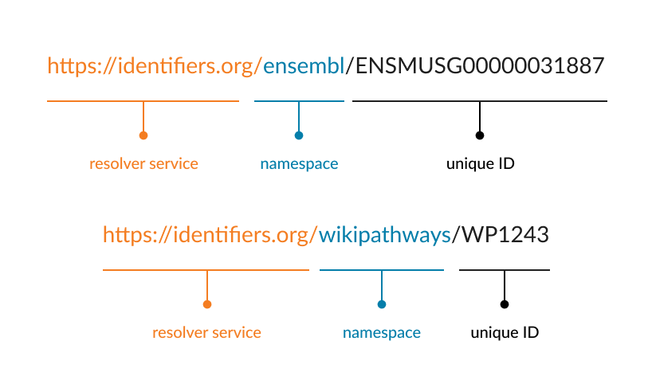

The persistent identifier is defined.  Learners will be able to define the structure of an identifier and explain its importance.  

> <agenda-title></agenda-title>
>
> In this tutorial, we will cover:
>
> 1. TOC
> {:toc}
>
{: .agenda}

# Persistent identifiers and the FAIR Principles
Data Identifiers relate to the following 5 FAIR Principles (Table 5.1).  We will discuss and signpost these in this episode.

| The FAIR Guiding Principles |                                                                                                                                                                                                                                                                                                                                       |
| --------------------------- | ------------------------------------------------------------------------------------------------------------------------------------------------------------------------------------------------------------------------------------------------------------------------------------------------------------------------------------- |
| To be Findable:             | **F1. (meta)data are assigned a globally unique and persistent identifier** F2. data are described with rich metadata (defined by R1 below) **F3. metadata clearly and explicitly include the identifier of the data it describes**  F4. (meta)data are registered or indexed in a searchable resource                                   |
| To be Accessible:           | **A1. (meta)data are retrievable by their identifier using a standardized communications protocol**  A1.1 the protocol is open, free, and universally implementable A1.2 the protocol allows for an authentication and authorization procedure, where necessary  **A2. metadata are accessible, even when the data are no longer available** |
| To be Interoperable:        | I1. (meta)data use a formal, accessible, shared, and broadly applicable language for knowledge representation.  I2. (meta)data use vocabularies that follow FAIR principles **I3. (meta)data include qualified references to other (meta)data**                                                                                         |
| To be Reusable:             | R1. meta(data) are richly described with a plurality of accurate and relevant attributes  R1.1. (meta)data are released with a clear and accessible data usage license R1.2. (meta)data are associated with detailed provenance R1.3. (meta)data meet domain-relevant community standards                                        

Table 5.1: The 15 FAIR Guiding Principles.  Principles relating to data identifiers are highlighted in **black**.

# Using persistent identifiers (PIDs)

Identifiers are an important theme within the FAIR principles, arguably being foundational; they are considered two of the pillars for the FAIR principles since they are crucial for Findable (F) and Accessible (A) principles.

Identifiers are an eternal reference to a digital resource such as a dataset and its metadata. They provide the information required to reliably identify, verify and locate your research data. 

Commonly, a persistent identifier is a unique record ID in a database, or a unique URL that takes a researcher to the data in question in a database. Persistent identifiers (PIDs) have to be unique so that only one dataset can be identified by this identifier. In addition to the identifier being unique, it needs to be persistent. When depositing or hosting data, you should ensure the longevity of this persistence meets your requirements, which may require reading specific database policies regarding identifier policy.  

Since FAIR permits the withdrawal of data, the FAIR Principles combat the potential for broken URLs by stating:  _“Metadata are accessible, even when the data are no longer available.”_  (FAIR Principle A2).  This means the link (PID) remains valid, displaying all the original metadata of the record even though the data is no longer available.

**It is important to note that when you upload your data to a public repository, the repository will create this ID for you automatically**.

Based on [how to FAIR](https://howtofair.dk/how-to-fair/persistent-identifiers/), many resources can help you find databases to assign PIDs to your data. One of these resources is [FAIRsharing](https://fairsharing.org/) something we’ve already encountered in the previous episodes. [FAIRsharing](https://fairsharing.org/), provides a list of databases grouped by domains and organisations.

# The structure of persistent identifiers

To ensure that a PID is globally unique, commonly it is supplied as a unique URL. For the case of a record in a biological database, the use of a URL ensures that the database record ID is associated with the database name or often some derivation of this. This is often enough to ensure the uniqueness of the PID for any future scenario. 

Commonly, for things like publications, a DOI is used for the PID, where DOI stands for Digital Object Identifier. An example is shown below where the PID is constructed from 3 pieces of information: the resolver service, the prefix (namespace) and the suffix (dataset ID).

**Resolver service**: the domain/service/institution hosting the PID e.g. [https://www.doi.org] (doi.org)

**Prefix**: a unique number referring to the publisher. This is also known as the namespace.

**Suffix**: the unique dataset number

For biological data, PIDs usually require a resolver that can deal with multiple resolving locations, which means that if a database changes its name or internal structure, the new and old variations of the PID remain valid and take the user to the (meta)data.  One commonly used resolver service is called [identifiers.org](https://docs.identifiers.org/) which maintains a list of database namespaces (prefix’s) as a persistent record.  If a database changes its name, it keeps the original namespace operational or alternatively arranges for redirection from the original.

Examples of using identifiers.org to construct a PID are given below for 2 different databases, [Ensembl](https://www.ensembl.org/Mus_musculus/Gene/Summary?g=ENSMUSG00000031887;r=8:105984918-105991241) and [WikiPathways](https://www.wikipathways.org/pathways/WP1243.html), respectively. The **namespace** is given as the database name in these examples.

> <question-title></question-title>
>
> Access the preprint for [Identifiers for the 21st century: How to design, provision, and reuse persistent identifiers to maximize utility and impact of life science data](https://www.google.com/url?q=https://doi.org/10.1101/117812&sa=D&source=docs&ust=1681921501619473&usg=AOvVaw0iHyEgvEzDniMbIcvhokQk).  This paper makes 10 recommendations for PID best practice. 
>
> 
 Locate the lesson for “Do not reassign or delete identifiers”.  Which PID is used as an example of a “tombstone page”?  Which FAIR Principle does this relate to? 

>
> > <solution-title></solution-title>
> >
> > Tombstone PID: [https://www.uniprot.org/uniprotkb/A0AV18](https://www.uniprot.org/uniprotkb/A0AV18/history)
> > 
 
 This relates directly to the FAIR Principle A2. _“Metadata are accessible, even when the data are no longer available”_ Note that other FAIR Principles are also illustrated.
> > 
  
 The Tombstone page is _“retrievable by their identifier using a standardised communications protocol”_(FAIR Principle A1), which in this case is http(s).  The page contains metadata which _“are assigned a globally unique and persistent identifier”_ (FAIR Principle F1).  Also the metadata _“clearly and explicitly includes the identifier of the data they describe”_ (FAIR Principle F3) noting that the identifier itself is featured on the webpage.
> > 
  
 Additionally, the webpage features a link to the updated UniProt record thereby _“metadata include qualified reference to other (meta)data”_ (FAIR Principle I3)
> >
> {: .solution}
{: .question}

# Useful Resources
- More on identifiers: [RDMkit](https://rdmkit.elixir-europe.org/identifiers.html) and [FAIR Cookbook](https://faircookbook.elixir-europe.org/content/recipes/findability/identifiers.html)
- Nick Juty, Sarala M. Wimalaratne, Stian Soiland-Reyes, John Kunze, Carole A. Goble, Tim Clark; Unique, Persistent, Resolvable: Identifiers as the Foundation of FAIR. Data Intelligence 2020; 2 (1-2): 30–39. 
