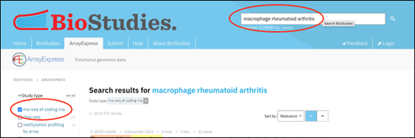
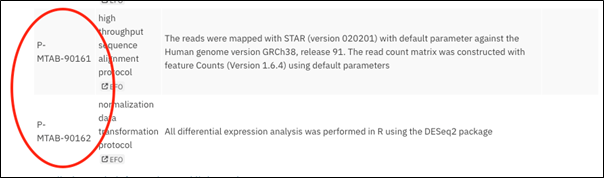
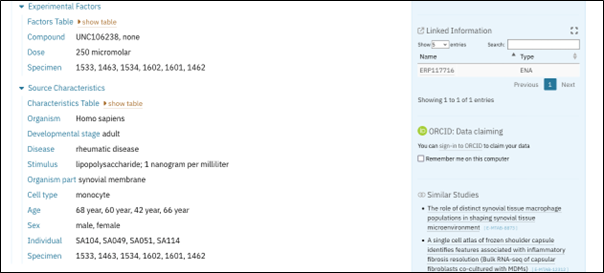
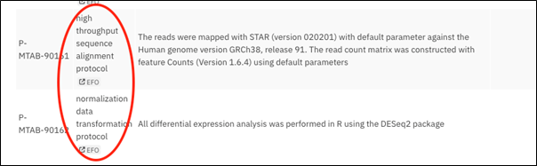
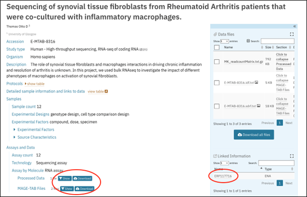
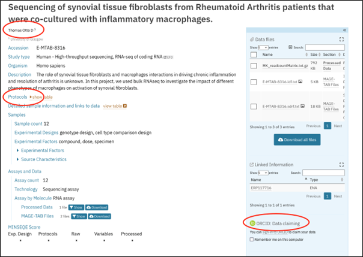

[RNA sequencing](https://en.wikipedia.org/wiki/RNA-Seq) is chosen here as an example of how to FAIRify data for a popular assay in the Life Sciences. RNAseq data can be shared and curated in designated public repositories using established ontologies (and controlled vocabularies) for describing protocols and biological material (metadata).

Two international repositories are commonly used to locate and download RNAseq (meta)data: [ArrayExpress](https://www.ebi.ac.uk/biostudies/arrayexpress) and [GEO](https://www.ncbi.nlm.nih.gov/geo/).  Other repositories for raw sequence data exist (e.g. SRA, ENA, DDBJ), but ArrayExpress and GEO specifically house and index expression data , including rich metadata detailing samples, data processing and final results files such as gene expression matrices.

By submitting data to a public repository, it becomes openly accessible, searchable and annotated with rich metadata, by the submitter and curation team. Note, both repositories belong to the [FAIRsharing database registry](https://fairsharing.org/search?fairsharingRegistry=Database), which can help you find public repositories for all types of Life Science data.

This lesson will take you through a publicly available RNAseq dataset in ArrayExpress and show you how it meets FAIR principles using the checklist published in 2016 .

> <agenda-title></agenda-title>
>
> In this tutorial, we will cover:
>
> 1. TOC
> {:toc}
>
{: .agenda}

# Example of FAIRification when data is uploaded to a public repository

We will use the following human RNAseq dataset for this learning material [ArrayExpress:E-MTAB-8316](https://www.ebi.ac.uk/biostudies/arrayexpress/studies/E-MTAB-8316). This link hosts all metadata and links to downloadable raw and transformed data, shown as a schematic below.

# Finding and accessing an RNAseq dataset
In this section, four of the FAIR Guiding Principles are put into practice:
- **(F1) (Meta)data are assigned a globally unique and persistent identifier**
- **(F4) (Meta)data are registered or indexed in a searchable resource**
- **(A1) (Meta)data are retrievable by their identifier using a standardised communications protocol**
- **(A1.1) The protocol is open, free, and universally implementable**

## (F1) (Meta)data are assigned a globally unique and persistent identifier

> <question-title></question-title>
>
>  The RNAseq dataset we are looking at belongs to a study published in Nature Medicine .  Can you find the globally unique and persistent identifier for the RNAseq data and data descriptions (metadata), within the text of the publication? 
>
> > <solution-title></solution-title>
> >
> > Under "Data and code availability', towards the end of the manuscript, we are told the following. 
> >
> > 
> >
> {: .solution}
{: .question}

Note that the dataset's unique and persistent (unchanging) identifier is E-MTAB-8316, (F1) and could also be expressed as the full [URL](https://www.ebi.ac.uk/biostudies/ArrayExpress/studies/E-MTAB-8316. Note that there are two other identifiers given to 2 single cell RNAseq datasets published as part of the same study. For this lesson, we are only considering the bulk RNAseq dataset.

Note also, the same record can be accessed using a resolution service, such as [identifiers.org](https://identifiers.org/),  that allows URLs to be regularised using a namespace (arrayexpress) and the identifier local to the database ([E-MTAB-8316](https://identifiers.org/arrayexpress:E-MTAB-8316))

## (A1) (Meta)data are retrievable by their identifier using a standardised communications protocol (A1.1) The protocol is open, free, and universally implementable 

> <question-title></question-title>
>
>  Use the following [URL](https://www.ebi.ac.uk/biostudies/ArrayExpress/studies/E-MTAB-8316) to access this dataset. The URL, in this case, is a concatenation of the URL of the data repository and the unique identifier: 
>
> > <solution-title></solution-title>
> >
> > You should see the following webpage hosted at the EBI (www.ebi.ac.uk). In the context of FAIR, you have now accessed this RNAseq data using a weblink employing https, where https is a standardised communications protocol or “data getting method” that is open, free and universally implementable (A1, A1.1).  Note that the title of this RNAseq record and the title of the companion publication are different, which means the two cannot be linked by title.  Instead, the accession (persistent ID) is used to connect the data and companion publication.
> >
> > Many databases, including ArrayExpress, also have programmatic ways to access and download data.  For advanced users, ArrayExpress [host a REST server](https://www.ebi.ac.uk/biostudies/arrayexpress/help#programmatic) for this purpose.  Other packages written by third parties, such as [ffq](https://github.com/pachterlab/ffq), also permit this function.
> > 
> >
> {: .solution}
{: .question}

## (F4) (Meta)data are registered or indexed in a searchable resource

> <question-title></question-title>
>
>  Location the dataset using the persistent ID in a different way.  Use the search menu in ArrayExpress to find the dataset again.   Use the following link to (access ArrayExpress)[https://www.ebi.ac.uk/biostudies/arrayexpress/studies/] and then type E-MTAB-8316 into the search bar.
>
> > <solution-title></solution-title>
> >
> > Note here that data access is gained through searching the database whereas previously we used a direct URL.  We are able to search ArrayExpress with the persistent ID  because the RNAseq dataset and its metadata are indexed (F4).
> >
> > 
> >
> {: .solution}
{: .question}

> <question-title></question-title>
>
> Alternatively, use the same search menu in ArrayExpress to search again using the words "macrophage rheumatoid arthritis" and selecting "rna-seq of coding rna" on the left-hand search bar. 
>
> > <solution-title></solution-title>
> >
> > Here, the dataset we want is not the first in the list but appears later in the search results. In this example, data access is gained through searching metadata (data about the experiment) (F4), and not the persistent ID as we did previously.
> >
> > 
> >
> {: .solution}
{: .question}

# Learning about the experiment and dataset from reading the metadata

In this section, the Findability Principles are put into practice:

- **(F1) (Meta)data are assigned a globally unique and persistent identifier**
- **(F2) Data are described with rich metadata**
- **(F3) Metadata clearly and explicitly include the identifier of the data they describe**

## (F1) (Meta)data are assigned a globally unique and persistent identifier (F3) Metadata clearly and explicitly include the identifier of the data they describe

> <question-title></question-title>
>
> Start looking at the metadata given on dataset webpage. Try to find the unique, persistent identifier in the [record](https://www.ebi.ac.uk/biostudies/ArrayExpress/studies/E-MTAB-8316) (F1) (Meta)data are assigned a globally unique and persistent identifier.  
>
> > <solution-title></solution-title>
> >
> > The persistent identifier is circled in red and is the first thing we see in the record (F1). All metadata (descriptions about the data) and the actual raw data files are linked from this page. Here metadata clearly and explicitly include the identifier of the data they describe (F3).
> >
> >  circled in red.")
> >
> > Here data are described with rich metadata (F2), which allows a person to reuse data appropriately by reducing ambiguity around what the data mean or how they are derived. This principle applies also to other principles in  FAIR such as (R1) Meta(data) are richly described with a plurality of accurate and relevant attributes.
> >
> {: .solution}
{: .question}

## (F2) Data are described with rich metadata
Indexing rich metadata allows a person to easily locate a dataset of interest, since it is made searchable within ArrayExpress. Metadata is added by the person submitting the data and is further curated by the ArrayExpress database. Metadata curation is performed via a web-based submission interface called [Annotare](https://www.ebi.ac.uk/fg/annotare/login/) which aids rich curation through using community ontologies and controlled vocabularies.

> <question-title></question-title>
>
> Familiarise yourself with the [page layout](https://www.ebi.ac.uk/biostudies/ArrayExpress/studies/E-MTAB-8316): there are links to all protocols, data, sample metadata and assay type. How many samples are in this dataset?
>
> > <solution-title></solution-title>
> >
> > There are 12 samples in this dataset.
> >
> >  circled in red.")
> >
> {: .solution}
{: .question}

> <question-title></question-title>
>
> What data provenance can you find? i.e. what processes have been performed to create the data linked from this page? Are there any metadata which might be absent?
>
> > <solution-title></solution-title>
> >
> > The final 2 protocols within the protocol table drawdown detail all data transformations for the raw and transformed data. 
> >
> > 
> >
> {: .solution}
{: .question}

When recording data provenance, ambiguities can be introduced.  True provenance can be achieved though through publishing scripts and software versions, enabling other researchers to repeat all data transformation processes. 

# Metadata and community standards

In this section, we will consider Interoperability and data Reuse:

- **(I1) (Meta)data use a formal, accessible, shared, and broadly applicable language for knowledge representation.**
- **(I2) (Meta)data use vocabularies that follow FAIR principles.**
- **(R1) (Meta)data are richly described with a plurality of accurate and relevant Attributes.**
- **(R1.3) (Meta)data meet domain-relevant community standards.**

Interoperability is mentioned in our companion (FAIR Pointers course)[https://fellowship.elixiruknode.org/latest/carpentries-course-fair-pointers]  where we consider merging datasets using a common controlled vocabulary.  

## (I1) (Meta)data use a formal, accessible, shared, and broadly applicable language for knowledge representation.
Commonly when adding metadata to a dataset a published ontology is used.  In its simplest form, an ontology is a dictionary of terms you use to annotate a piece of data. For example, the NCBI taxonomy database is something you may have used to annotate species within a dataset. An ontology, though, will also define relationships between terms. So in the taxonomy example, the term "Homo sapiens" will belong to parent terms such as Primate, Mammal and so on. Importantly, by using an ontology you can ensure you are using interoperable and searchable terms with your data.

## (I2) (Meta)data use vocabularies that follow FAIR principles.  (R1) (Meta)data are richly described with a plurality of accurate and relevant Attributes.
Published ontologies are linked from the ArrayExpress data submission tool, [Annotare](https://www.ebi.ac.uk/fg/annotare/login/), so this work is done for you. Although, if you wish to start using ontologies to annotate your data at the point it is produced, the [FAIRsharing Standards registry](https://fairsharing.org/search?fairsharingRegistry=Standard) is a place to start. Importantly, when an ontology is published it too becomes findable and reusable in the context of the FAIR principles **(I2)**.
Metadata using published ontologies permit interoperability since you can match identical annotations across data and databases **(I1 & I2)**. Additionally, they are created, refined and used by communities of practice **(R1, R1.3)**.

> <question-title></question-title>
>
> Look at the page again. Identify any metadata that belongs to an existing, published ontology. Note, we have mentioned one already: "Homo sapiens" as part of [taxonomy](https://www.ncbi.nlm.nih.gov/taxonomy).
>
> > <solution-title></solution-title>
> >
> > There are many.  There are ontologies used for Source Characteristics such as ‘Developmental stage’,  ‘Disease’, ‘Organism part’, ‘Cell type’, and so on. These annotations are curated at the point of data submission.
> >
> > 
> >
> > There are also others that are not so obvious. Under "Protocols', a protocol ontology is used under the column ‘Type’.  By selecting the EFO link-and-arrow following the protocol annotation, you are taken to the FAIR (Experimental factor ontology)[https://www.ebi.ac.uk/ols/ontologies/efo] at the EBI. 
> >
> >
> >
> {: .solution}
{: .question}

## (R1.3) (Meta)data meet domain-relevant community standards.

Notice that the "MINSEQE" star rating on the left hand banner, indicates a level of Community Compliance in terms of (meta)data submission.   The community  standard in this case is MINSEQE (Minimum Information about a Sequencing Experiment Checklist) which is recorded in FAIRsharing .  This example receives a maximum 5-star score demonstrating that data and metadata are available for experiential design, protocols and  variables as well as processed and raw data.

At a more advanced level of community compliance, the ArrayExpress database uses a domain specific metadata format: MAGE-TAB, also identified in [FAIRsharing](https://fairsharing.org/FAIRsharing.ak8p5g).  MAGE-Tab is a tab-delimited file containing all relevant metadata for the experiment.  This is a machine-readable version of the webpage we are looking at.

> <hands-on-title>Locate the MAGE-TAB file containing sample metadata, and open in Excel.</hands-on-title>
>
> Notice how all data on the webpage are also contained in this machine-readable format.  You are looking to download the SDRF file (Sample and Data Relationship Format).
>
> 
{: .hands_on}

Finally, this ArrayExpress record links to the raw sequence data housed in the ENA (European Nucleotide archive).  We see this in an exercise later in this course.  The ENA record in turn links to ENA SRA XML format (community recognised), which gives another machine-readable interoperability format.

> <hands-on-title>Machine Readable RNA XML formats</hands-on-title>
> 
> Have a quick look at the machine readable RNA XML formats.  Notice how data are contained within tags very similar to HTML.
>
> - [ENA:PRJEB34761](https://www.ebi.ac.uk/ena/browser/api/xml/PRJEB34761)
> - [ENA:ERP117716](https://www.ebi.ac.uk/ena/browser/api/xml/ERP117716)
>
{: .hands_on}

# Downloading data and metadata for reuse
- **(R1.1) (Meta)data are released with a clear and accessible data usage license.**
- **(R1.2) (Meta)data are associated with detailed provenance.**

## (R1.1) (Meta)data are released with a clear and accessible data usage license
Data licensing makes it clear to any person looking to reuse a dataset, who the data belongs to and how it can be used.  Open licences (available to all) are often used to maximise data reuse, though different stipulations can be applied to these licences to restrict/enforce certain downstream activities, such as reuse of data for commercial purposes.

The [Creative Commons](https://creativecommons.org/) licences are used commonly for life science data, of which there are 7: **CC0, CC BY, CC BY-SA, CC BY-NC, CC BY-ND, CC BY-NC-SA, CC BY-NC-ND**

CC0 is the most permissive licence where "no rights are reserved'.  This means the data creator releases the data without restriction to the public domain.

The second CC BY licence is often written as CC BY 4.0 to reflect the most current (4th) version of the licence.  Here, anyone can share and adapt data for any purpose, including commercial CC BY.

CC BY 4.0 is virtually identical to CC0, except by using CC BY, legal rights are retained to acknowledge the originator of the data.

> <question-title></question-title>
>
> Look at the following site detailing the (Creative Commons licences)[https://creativecommons.org/share-your-work/cclicenses/].  What is the effect of adding the following letters to the CC BY licence; SA, NC and ND?
>
> > <solution-title></solution-title>
> >
> > 
> >
> {: .solution}
{: .question}

> <question-title></question-title>
>
> Look for the licensing options for [arrayexpress](https://www.ebi.ac.uk/biostudies/arrayexpress) at the bottom of the page under [Licensing](https://www.ebi.ac.uk/licencing).  Which licence is used?
>
> 
>
> > <solution-title></solution-title>
> >
> > CC0 is used.
> >
> {: .solution}
{: .question}

> <question-title></question-title>
>
> How could I download the data or metadata  from this page?
>
> > <solution-title></solution-title>
> >
> > Machine-readable metadata can be downloaded from the “MAGE-TAB Files” link.  There are 2 files: Investigation Design Format (experimental overview) and the Sample/Data Relationship Format (sample/data descriptions).  Note this information can be accessed on the right hand banner as well.
> >
> > Processed data can be downloaded also, in this case there is a link to a read-count matrix.  Sequencing data from the NEA.
> >
> > Access to raw FASTQ data is given via the reference to the ENA database on the right hand banner under “Linked Information”.
> >
> > 
> >
> {: .solution}
{: .question}

## (R1.2) (Meta)data are associated with detailed provenance.
The term "data provenance" relates to information about how and why a piece of data was produced. Often the individual producing the data and details of its production (protocols) are recorded as part of provenance.

> <question-title></question-title>
>
> What provenance metadata can you find on [Arrayexpress:E-MTAB-8316](https://www.ebi.ac.uk/biostudies/ArrayExpress/studies/E-MTAB-8316)?
>
> > <solution-title></solution-title>
> >
> > We are looking for information that could help us understand how data have been created.  We have been given the name of the data creator noting that there is an option too for the author to submit an ORCID.  Data creation and transformations are detailed under Protocols.
> >
> > 
> >
> {: .solution}
{: .question}