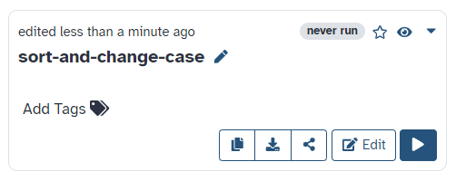

A workflow, just like any other piece of software, can be formally correct and runnable but still lack a number of additional features that might help its reusability, interoperability, understandability, etc.

One of the most useful additions to a workflow is a suite of tests, which help check that the workflow is operating as intended. A test case consists of a set of inputs and corresponding expected outputs, together with a procedure for comparing the workflow's actual outputs with the expected ones. It might be the case, in fact, that a test may be considered successful even if the actual outputs do not match the expected ones exactly, for instance because the computation involves a certain degree of randomness, or the output includes timestamps or randomly generated identifiers. Providing documentation is also important to help understand the workflow's purpose and mode of operation, its requirements, the effect of its parameters, etc. Even a single, well structured README file can go a long way towards getting users started with your workflow, especially if complemented by examples that include sample inputs and running instructions.

> <agenda-title></agenda-title>
>
> In this tutorial, you will learn how to create a git repo, and begin working with it.
>
> 1. TOC
> {:toc}
>
{: .agenda}


## Community best practices

Though the practices listed above can be considered general enough to be applicable to any kind of software, individual communities usually add their own specific sets of rules and conventions that help users quickly find their way around software projects, understand them more easily and reuse them more effectively. The Galaxy community, for instance, has a [guide on best practices for maintaining workflows](https://planemo.readthedocs.io/en/latest/best_practices_workflows.html).

The [Intergalactic Workflow Commission (IWC)](https://github.com/galaxyproject/iwc) is a collection of highly curated Galaxy workflows that follow best practices and conform to a specific GitHub directory layout, as specified in the [guide on adding workflows](https://github.com/galaxyproject/iwc/blob/main/workflows/README.md#adding-workflows). In particular, the workflow file must be accompanied by a [Planemo test file](https://planemo.readthedocs.io/en/latest/test_format.html) with the same name but a `-test.yml` extension, and a `test-data` directory that contains the datasets used by the tests described in the test file. The guide also specifies how to fulfill other requirements such as setting a license, a creator and a version tag. A new workflow can be proposed for inclusion in the collection by opening a pull request to the [IWC repository](https://github.com/galaxyproject/iwc): if it passes the review and is merged, it will be published to [iwc-workflows](https://github.com/iwc-workflows). The publication process also generates a metadata file that turns the repository into a [Workflow Testing RO-Crate](https://crs4.github.io/life_monitor/workflow_testing_ro_crate), which can be registered to [WorkflowHub](https://workflowhub.eu/) and [LifeMonitor](https://www.lifemonitor.eu/).


## Best practice repositories and RO-Crate

The [repo2rocrate](https://github.com/crs4/repo2rocrate) software package allows to generate a [Workflow Testing RO-Crate](https://crs4.github.io/life_monitor/workflow_testing_ro_crate) for a workflow repository that follows community best practices. It currently supports Galaxy (based on IWC guidelines), Nextflow and Snakemake. The tool assumes that the workflow repository is structured according to the community guidelines and generates the appropriate [RO-Crate](https://w3id.org/ro/crate/) metadata for the various entities. Several command line options allow to specify additional information that cannot be automatically detected or needs to be overridden.

To try the software, we'll clone one of the iwc-workflows repositories, whose layout is known to respect the IWC guidelines. Since it already contains an RO-Crate metadata file, we'll delete it before running the tool.

```bash
pip install repo2rocrate
git clone https://github.com/iwc-workflows/parallel-accession-download
cd parallel-accession-download/
rm -fv ro-crate-metadata.json
repo2rocrate --repo-url https://github.com/iwc-workflows/parallel-accession-download
```

This adds an `ro-crate-metadata.json` file at the top level with metadata generated based on the tool's knowledge of the expected repository layout. By specifying a zip file as an output, we can directly generate an RO-Crate in the format accepted by WorkflowHub and LifeMonitor:

```bash
repo2rocrate --repo-url https://github.com/iwc-workflows/parallel-accession-download -o ../parallel-accession-download.crate.zip
```


## Generating tests for your workflow

What if you only have a workflow, but you don't have the test layout yet? You can use Planemo to generate it.

```bash
pip install planemo
```

As an example we will use this [simple workflow](https://github.com/crs4/life_monitor/blob/50cdb790ff125613aa07e70cb439e3a36b82d0bf/interaction_experiments/workflow_examples/galaxy/sort-and-change-case/sort-and-change-case.ga), which has only two steps: it sorts the input lines and changes them to upper case. Follow these steps to generate a test layout for it:


> <hands-on-title>Generate Workflow Tests With Planemo</hands-on-title>
> 1. Download [the workflow](https://raw.githubusercontent.com/crs4/life_monitor/50cdb790ff125613aa07e70cb439e3a36b82d0bf/interaction_experiments/workflow_examples/galaxy/sort-and-change-case/sort-and-change-case.ga) to a `sort-and-change-case.ga` file.
> 1. Download [this input dataset](https://raw.githubusercontent.com/crs4/life_monitor/50cdb790ff125613aa07e70cb439e3a36b82d0bf/interaction_experiments/workflow_examples/galaxy/sort-and-change-case/input.bed) to an `input.bed` file.
> 1. Upload the workflow to Galaxy (e.g., [Galaxy Europe](https://usegalaxy.eu/)): from the upper menu, click on "Workflow" > "Import" > "Browse", choose `sort-and-change-case.ga` and then click "Import workflow".
> 1. Start a new history: click on the "+" button on the History panel to the right.
> 1. Upload the input dataset to the new history: on the left panel, go to "Upload Data" > "Choose local files" and select `input.bed`, then click "Start" > "Close".
> 1. Wait for the file to finish uploading (i.e., for the loading circle on the dataset's line in the history to disappear).
> 1. Run the workflow on the input dataset: click on "Workflow" in the upper menu, locate `sort-and-change-case`, and click on the play button to the right.
> 
>   
> 
> 1. This should take you to the workflow running page. The input slot should be already filled with `input.bed` since there is nothing else in the history. Click on "Run Workflow" on the upper right of the center panel.
> 
>    
> 
> 1. Wait for the workflow execution to finish.
> 1. On the upper menu, go to "User" > "Workflow Invocations", click on the invocation corresponding to the workflow just run and copy the invocation's ID. In my case it says "Invocation: a043e8c60873170b" on the right, where `a043e8c60873170b` is the ID.
>  
>    
> 
> 1. On the upper menu, go to "User" > "Preferences" > "Manage API Key". If you don't have an API key yet, click the button to create a new one. Under "Current API key", click the button to copy the API Key on the right.
> 
>    
> 
> 1. Run `planemo workflow_test_init --galaxy_url https://usegalaxy.eu --from_invocation INVOCATION_ID --galaxy_user_key API_KEY`, replacing `INVOCATION_ID` with the actual invocation ID and `API_KEY` with the actual API key. If you're not using the Galaxy Europe instance, also replace `https://usegalaxy.eu` with the URL of the instance you're using.
> 1. Rename `sort-and-change-case-(imported-from-uploaded-file).ga` to `sort-and-change-case.ga` and `sort-and-change-case-(imported-from-uploaded-file)-tests.yml` to `sort-and-change-case-tests.yml`. The rest of the files generated by Planemo are under `test-data`.
{: .hands_on}

```bash
planemo workflow_test_init --galaxy_url https://usegalaxy.eu --from_invocation INVOCATION_ID --galaxy_user_key API_KEY
```


## Adding a GitHub workflow

In the previous section, we have learned how to generate a test layout for an example Galaxy workflow. You can apply the same procedure to your workflow and get the file structure you need to populate the GitHub repository. One thing is still missing though: a GitHub workflow to test the Galaxy workflow automatically. At the top level of the repository, create a `.github/workflows` directory and place a `wftest.yml` file inside it with the following content:

```yaml
name: Periodic workflow test
on:
  schedule:
    - cron: '0 3 * * *'
  workflow_dispatch:
jobs:
  test:
    name: Test workflow
    runs-on: ubuntu-latest
    steps:
    - uses: actions/checkout@v2
      with:
        fetch-depth: 1
    - uses: actions/setup-python@v1
      with:
        python-version: '3.7'
    - name: install Planemo
      run: |
        pip install --upgrade pip
        pip install planemo
    - name: run planemo test
      run: |
        planemo test --biocontainers sort-and-change-case.ga
```

Replacing `sort-and-change-case.ga` with the name of your actual Galaxy workflow. You can find extensive [documentation on GitHub workflows](https://docs.github.com/en/actions/using-workflows) on the GitHub web site. Here we'll give some highlights:

 * the `on` field sets the GitHub workflow to run:
   * automatically every day at 3 AM
   * when manually dispatched
 * the steps do the following:
   * check out the GitHub repository
   * set up a Python environment
   * install Planemo
   * run `planemo test` on the Galaxy workflow

An example of a repository built according to the guidelines given here is [simleo/ccs-bam-to-fastq-qc-crate](https://github.com/simleo/ccs-bam-to-fastq-qc-crate), which realizes the Workflow Testing RO-Crate setup for [BAM-to-FASTQ-QC](https://workflowhub.eu/workflows/220).
