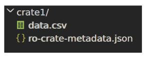
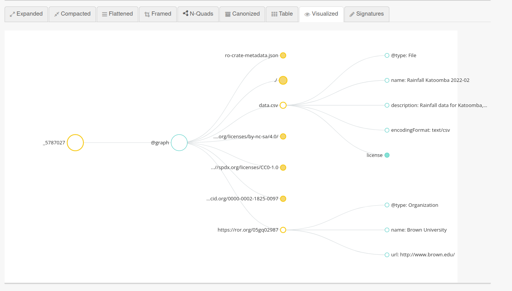
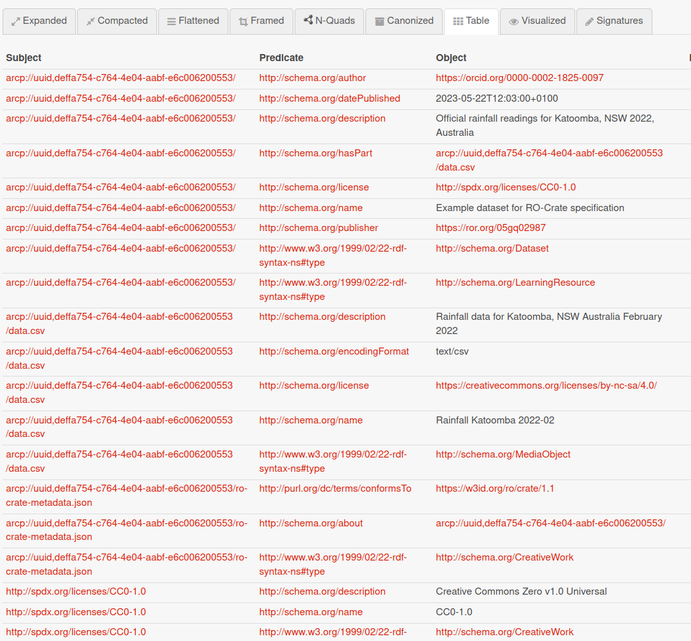
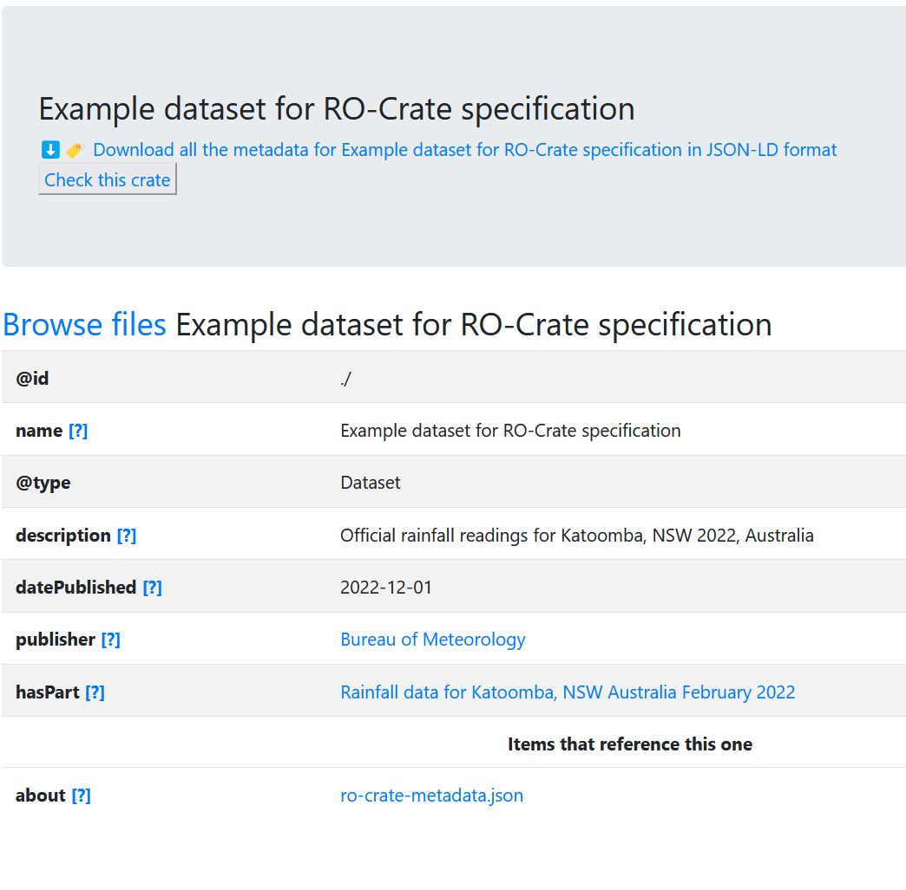

This tutorial assumes you have already completed [An overview of the RO-Crate concept and its implementations](https://gallantries.github.io/video-library/videos/ro-crates/intro/slides/) and have a basic understanding of working with JSON.

> <agenda-title></agenda-title>
>
> In this tutorial, we will cover:
>
> 1. TOC
> {:toc}
>
{: .agenda}


In this tutorial, meant to be read along with the [RO-Crate specification](https://www.researchobject.org/ro-crate/1.1/), we'll walk through the initial steps for creating a basic RO-Crate. You are invited to replicate the below steps on your local computer.


## Making a folder into an RO-Crate

In the simplest form, to describe some data on disk, an _RO-Crate Metadata File_ is placed in a folder alongside a set of files or folders. 

First create a new folder `crate1/` and add a single file `data.csv` to represent our dataset:

```
"Date","Minimum temperature (°C)","Maximum temperature (°C)","Rainfall (mm)"
2022-02-01,16.0,28.4,0.6
2022-02-02,16.3,17.2,12.4
```

Next, to turn this folder into an RO-Crate we need to add the _RO-Crate Metadata File_, which has a fixed filename.
Create the file `ro-crate-metadata.json` using [Visual Studio Code](https://code.visualstudio.com/) or your favourite editor, then add the following JSON:

```json
{
  "@context": "https://w3id.org/ro/crate/1.1/context",
  "@graph": [

  ]
}
```

Your folder should now look like this:



The presence of the reserved `ro-crate-metadata.json` filename means that `crate1` (and its children) can now be considered to be an **RO-Crate**. We call the top-level folder of the crate for the **RO-Crate Root** and can now refer to its content with relative file paths.

We also need to make some declaration within the JSON file to turn it into a valid _RO-Crate Metadata Document_, explained in the next session.


## JSON-LD preamble

The preamble of `@context` and `@graph` are JSON-LD structures that help provide global identifiers to the JSON keys and types used in the rest of the RO-Crate document. These will largely map to definitions in the [schema.org](http://schema.org/) vocabulary, which can be used by RO-Crate extensions to provide additional metadata beyond the RO-Crate specifications. It is this feature of JSON-LD that helps make RO-Crate extensible for many different purposes -- this is explored further in the specification's [appendix on JSON-LD](https://www.researchobject.org/ro-crate/1.1/appendix/jsonld.html). In short, only JSON keys (_properties_) and types defined this way can be used within the RO-Crate Metadata Document.

However, in the general case it should be sufficient to follow the RO-Crate JSON examples directly without deeper JSON-LD understanding. The RO-Crate Metadata Document contains a flat list of _entities_ as JSON objects in the `@graph` array. These entities are cross-referenced using `@id` identifiers, rather than being deeply nested. This is one major difference from JSON structures you may have experienced before.  The `@type` keyword associates an object with a predefined type from the JSON-LD context. Almost any property can alternatively be used with an `[]` array to provide multiple values.

The rest of this tutorial, and indeed most of the [RO-Crate specification](https://www.researchobject.org/ro-crate/1.1/), specify which entities can be added to the `@graph` array. 


## RO-Crate Metadata descriptor 

The first JSON-LD _entity_ to add has the `@id` value of `ro-crate-metadata.json` to describe the JSON file itself:


```json
{
    "@id": "ro-crate-metadata.json",
    "@type": "CreativeWork",
    "conformsTo": {"@id": "https://w3id.org/ro/crate/1.1"},
    "about": {"@id": "./"}
}
```

This required entity, known as the [RO-Crate Metadata Descriptor](https://www.researchobject.org/ro-crate/1.1/root-data-entity.html#ro-crate-metadata-file-descriptor), helps this file self-identify as an RO-Crate Metadata Document, which is conforming to (`conformsTo`) the RO-Crate specification version 1.1. Notice that the `conformsTo` URL corresponds to the `@context` URL version-wise, but they have two different functions. The context brings the defined terms into the metadata document, while the conformance declares which RO-Crate conventions of using those terms are being followed.


> <tip-title>RO-Crate versions</tip-title>
> This tutorial is written for RO-Crate 1.1, the RO-Crate website will list the [current specification version](https://www.researchobject.org/ro-crate/specification.html) -- RO-Crates can generally be upgraded to newer versions following [semantic versioning](https://semver.org/) conventions, but check the [change log](https://www.researchobject.org/ro-crate/1.1/appendix/changelog.html) for any important changes. The next development version of the specification, indicated with a `-DRAFT` status, may still be subject to changes and should only be used with caution.
{: .tip}


## RO-Crate Root

Next we'll add another entity to the `@graph` array, to describe the [RO-Crate Root](https://www.researchobject.org/ro-crate/1.1/root-data-entity.html#direct-properties-of-the-root-data-entity):


```json
{
    "@id": "./",
    "@type": "Dataset",
    "hasPart": [ 

    ]
}
```

By convention, in RO-Crate the `@id` value of  `./` means that this entity describes the folder in which the RO-Crate metadata file is located. This reference from `ro-crate-metadata.json` is therefore semantically marking the `crate1` folder as being the RO-Crate Root.


{: .note }
This example is a folder-based RO-Crate stored on disk, and therefore absolute paths are avoided, e.g. in case the root folder is moved or archived as a ZIP file. If the crate is being served from a Web service, such as a data repository or database where files are not organized in folders, then the `@id` might be an absolute URI instead of `./` -- this is one reason why we point to the root entity from the metadata descriptor, see section [Root Data Entity](https://www.researchobject.org/ro-crate/1.1/root-data-entity.html) for details.

## Describing the root entity

When describing the [root entity](https://www.researchobject.org/ro-crate/1.1/root-data-entity.html#direct-properties-of-the-root-data-entity), the properties generally apply to the whole of the crate. For instance it is a good idea to give a description of why these resources are gathered in a crate, as well as giving the crate a name and license for FAIR reuse and citation.

> <question-title></question-title>
> 
> Try to add the `name`, `description` and `datePublished` properties, and for `license` as a cross-reference, use [SPDX](https://spdx.org/licenses/) license list to find the identifier for Creative Commons Zero or another license of your choice:
> 
> > <solution-title></solution-title>
> > ```json
> > {
> >   "@id": "./",
> >   "@type": "Dataset",
> >   "hasPart": [ ],
> >   "name": "Example crate",
> >   "description": "I created this example by following the tutorial",
> >   "datePublished": "2023-05-22T12:03:00+0100",
> >   "license": { "@id": "http://spdx.org/licenses/CC0-1.0"}  
> > }
> > ```
> {: .solution}
{: .question}


> <tip-title>License identifiers</tip-title>
> In the above solution, the identifier for CC0-1.0 <http://spdx.org/licenses/CC0-1.0> is slightly 
> different from their listed web page URI <https://spdx.org/licenses/CC0-1.0.html> -- the former 
> is chosen to align with [SPDX JSON-LD identifiers](https://github.com/spdx/license-list-data/tree/main/jsonld),
> which unfortunately are not shown directly on their website as _permalinks_. 
> It is not a requirement in RO-Crate to use permalinks for `@id` of entities like licenses, 
> it is nevertheless best practice to propagate permalinks where known.
{: .tip}

> <tip-title>Choosing a license</tip-title>
> Choosing a license appropriate for your dataset can be non-trivial, particularly if third-party data/software and multiple organizations are involved. See [FAIR Cookbook on licensing](https://faircookbook.elixir-europe.org/content/recipes/reusability/ATI-licensing.html). It is worth noting that an RO-Crate permits data entities to have a `license` different from the overall Crate license. It is still recommended to choose an overall Crate license that can legally apply across all the content in the RO-Crate Root.
{: .tip}


## About cross-references

In a RO-Crate Metadata Document, entities are cross-referenced using `@id` reference objects, rather than using deeply nested JSON objects.
In short, this _flattened JSON-LD_ style (shown below) allows any entity to reference any other entity, and RO-Crate consumers can directly find all the descriptions of a given entity as a single JSON object. 


> <question-title></question-title>
> 
> Consider the root Data Entity `./`, and add such a cross-reference to the file `data.csv` using the _property_ called `hasPart`:
> 
> > <solution-title></solution-title>
> > ```json
> > {
> >     "@id": "./",
> >     "@type": "Dataset",
> >     "hasPart": [ 
> >       {"@id": "data.csv"} 
> >     ],
> >     "…": "…"
> > }
> > ```
> {: .solution}
{: .question}


The RO-Crate root is always typed `Dataset`, though `@type` may in some cases have additional types by using a JSON array instead of a single value.  Most entities can have such more specific types, e.g. chosen from [schema.org type list](https://schema.org/docs/full.html).

> <question-title></question-title>
> 1. Navigate the schema.org type list to find a subtype of `CreativeWork` that is suitable for a learning resource..
> 2. Modify the root entity's `@type` to be an array.
> 3. Add the type name for learning resource at the end of the array.
> 
> > <solution-title></solution-title>
> > ```json
> > {
> >     "@id": "./",
> >     "@type": ["Dataset", "LearningResource"],
> >     "hasPart": [ 
> >       {"@id": "data.csv"} 
> >     ],
> >     "…": "…"
> > }
> > ```
> {: .solution}
{: .question}

The root has several metadata properties that describe the RO-Crate as a whole, considering it as a Research Object of collected resources. The section on [root data entity](https://www.researchobject.org/ro-crate/1.1/root-data-entity.html) details further the required and recommended properties of the root `./`. 


## Data entities

A main type of resources collected in a Research Object is _data_ -- simplifying, we can consider data as any kind of file that can be opened in other programs. These are aggregated by the Root Dataset with the `hasPart` property. In this example we have an array with a single value, a reference to the entity describing the file `data.csv`. 

> <tip-title>Referencing external resources</tip-title>
> RO-Crates can also contain data entities that are folders and Web resources, as well as non-File data like online databases -- see section on [data entities](https://www.researchobject.org/ro-crate/1.1/data-entitites.html).
{: .tip}

We should now be able to follow the `@id` reference for the corresponding _data entity_ JSON block for our CSV file, which we need to add to the `@graph` of the RO-Crate Metadata Document. 


> <question-title></question-title>
> 
> 1. Add a declaration for the CSV file as new entity with `@type` declared as `File`.  
> 2. Give the file a human-readable `name` and `description` to detail it as _Rainfall data for Katoomba in NSW Australia, captured February 2022_. 
> 3. To add this is a CSV file, declare the `encodingFormat` as the appropriate [IANA media type](https://www.iana.org/assignments/media-types/#text) string. 
> 
> > <solution-title></solution-title>
> > ```json
> > {
> >     "@id": "data.csv",
> >     "@type": "File",
> >     "name": "Rainfall Katoomba 2022-02",
> >     "description": "Rainfall data for Katoomba, NSW Australia February 2022",
> >     "encodingFormat": "text/csv"
> > },  
> > ```
> > 
> {: .solution}
{: .question}


It is recommended that every entity has a human-readable `name`; as shown in the above example, this does not need to match the filename/identifier. The `encodingFormat` indicates the media file type so that consumers of the crate can open `data.csv` in an appropriate program, and can be particularly important for less common file extensions frequently encounted in outputs from research software and instruments.

For more information on describing files and folders, including their recommended and required attributes, see section on [data entities](https://www.researchobject.org/ro-crate/1.1/data-entitites.html).

> <question-title></question-title>
> 
> 1. Consider if the file content of `data.csv` is not covered by our overall license (CC0), but [Creative Commons BY-NC-SA 4.0](https://creativecommons.org/licenses/by-nc-sa/4.0/) (which only permits non-commercial use)
> 2. To override, add an  `license` cross-reference property on this particular data entity
> 
> > <solution-title></solution-title>
> > ```json
> > {
> >     "@id": "data.csv",
> >     "@type": "File",
> >     "name": "Rainfall Katoomba 2022-02",
> >     "description": "Rainfall data for Katoomba, NSW Australia February 2022",
> >     "encodingFormat": "text/csv",
> >     "license": { "@id": "https://creativecommons.org/licenses/by-nc-sa/4.0/" }
> > },  
> > ```
> {: .solution}
{: .question}


## Contextual entities

Entities that we have added under `hasPart` are considered _data entities_, while entities only referenced from those are considered _contextual entities_ -- they help explain the crate and its content.

> <tip-title>Adding entities to the JSON array</tip-title>
> You may have noticed we're adding incrementally to the `@graph` array. It is important to remember the `,` between each entity, **except** for the final entity in the JSON array; and likewise for the properties within the JSON object for each entity. This is an artefact of the strict [JSON](https://www.json.org/) file format rules to simplify parsing. The order of the entities within the `@graph` JSON-LD array and the order of the keys within a JSON object is _not significant_. The _graph_ content is given by the `@id` cross-references.
{: .tip}

You may notice the subtle difference between a _data entity_ that is conceptually part of the RO-Crate and is file-like (containing bytes), while a _contextual entity_ is a representation of a real-life organization that can't be downloaded: following the URL, we would only get its _description_. The section [contextual entities](https://www.researchobject.org/ro-crate/1.1/contextual-entities.html) explores several of the entities that can be added to the RO-Crate to provide it with a **context**, for instance how to link to authors and their affiliations.  Simplifying slightly, a data entity is referenced from `hasPart` in a `Dataset`, while a contextual entity is referenced using any other defined property.

## Detailing licenses

We have previously declared two different `license` cross-references. While following the URLs in this case explain the licenses well, it is also best practice to include a very brief summary of contextual entities in the RO-Crate Metadata Document. This is more important if the cross-reference do not use a permalink and may change over time. As a minimum, each referenced entity should have a `@type` and `name` property. It is also possible to add `url` for more information

> <question-title></question-title>
> 
> Add a contextual entity for each of the two licenses, see the [licensing](https://www.researchobject.org/ro-crate/1.1/contextual-entities.html#licensing-access-control-and-copyright) section for details:
> 
> > <solution-title></solution-title>
> > ```json
> > {
> >     "@id": "https://creativecommons.org/licenses/by-nc-sa/4.0/",
> >     "@type": "CreativeWork",
> >     "name": "CC BY-NC-SA 4.0 International",
> >     "description": "Creative Commons Attribution-NonCommercial-ShareAlike 4.0 International"
> > },    
> > {
> >     "@id": "http://spdx.org/licenses/CC0-1.0",
> >     "@type": "CreativeWork",
> >     "name": "CC0-1.0",
> >     "description": "Creative Commons Zero v1.0 Universal",
> >     "url": "https://creativecommons.org/publicdomain/zero/1.0/"
> > },  
> > ```
> {: .solution}
{: .question}


An additional exercise is to try to unify the two entites so that both use spdx identifiers, remembering to update the corresponding `license` cross-references when changing the `@id`. However, not all licenses have a direct SPDX identifier.


## Author

Moving back to the RO-Crate root `./`, let's specify who are the authors of the crate.

> <question-title></question-title>
> 
> 1. Add yourself as an [`author`](https://www.researchobject.org/ro-crate/1.1/contextual-entities.html#people) of the crate using the type `Person`
> 2. Include your preferred name. 
> 3. If you don't have an [ORCID](https://orcid.org/), you may use either the URL of your main home page at your institution, or a crate-local identifier like `#alice`.
> 4. Include your `affiliation` as a string value.
> 
> > <solution-title></solution-title>
> > ```json
> > {
> >   "@id": "./",
> >   "@type": "Dataset",
> >   "author": {"@id": "https://orcid.org/0000-0002-1825-0097"},
> >   "…": "…"
> > },
> > {
> >   "@id": "https://orcid.org/0000-0002-1825-0097",
> >   "@type": "Person", 
> >   "name": "Josiah Carberry",
> >   "affiliation": "Brown University"
> > }
> > ```
> {: .solution}
{: .question}


> <tip-title>Who can be authors of an RO-Crate?</tip-title>
> When we say someone is an author of a crate, it means they have contributed something substansively to its content (typically the data). Agreement on what is considered authorship on a dataset can be tricky; you may decide some people would be better represented as `contributor`. One advantage of RO-Crate is that authorship can be declared explicitly also on each data entity, so it can be clearer where each person have contributed (e.g. a statistician is author of an R script).  This means that generally the authors of the crate can be a broader, more inclusive list than perhaps traditionally recognized as academic authorship.
{: .tip}

> <question-title></question-title>
> 
> 1. "Unroll" your `affiliation` of the person as cross-reference to another contextual entity, typed as an `Organization`. 
> 2. You can use [ROR](https://ror.org/) to find an identifier for most educational/research institutions, or you can use the main web page of your organization as its `@id`.
> 
> > <solution-title></solution-title>
> > ```json
> > {
> >   "@id": "https://orcid.org/0000-0002-1825-0097",
> >   "@type": "Person", 
> >   "name": "Josiah Carberry"
> > },
> > {
> >   "@id": "https://ror.org/05gq02987",
> >   "@type": "Organization",
> >   "name": "Brown University",
> >   "url": "http://www.brown.edu/"
> > }
> > ```
> {: .solution}
{: .question}


The reuse of existing identifiers is important for both persons and organization from a FAIR perspective, as their names may not be globally unique.

> <question-title></question-title>
> 
> 1. Now imagine you are going to publish the RO-Crate on your institution's web pages. 
> 2. Cross-reference the same Organization entity with `publisher` from the RO-Crate Root entitity:
> 
> > <solution-title></solution-title>
> > ```json
> > {
> >     "@id": "./",
> >     "@type": "Dataset",
> >     "publisher": {"@id": "https://ror.org/05gq02987"},
> >     "…": "…"
> > }
> > ```
> {: .solution}
{: .question}


## Validating and visualizing

As we made this RO-Crate Metadata File by hand, it's good to check for any JSON errors, such as missing/extra `,` or unclosed `"` quotes. Try pasting the file content into the [JSON-LD Playground](https://json-ld.org/playground/). It should show up any errors, for example:

```
JSON markup - SyntaxError: JSON.parse: expected `','` or `']'` after array element 
at line 29 column 5 of the JSON data
```

Modify the JSON file in your editor to fix any such errors. You can also use editor commands such as _Format Document_ to ensure you have consistent spacing, indentation and brackets.

If the document passes without errors in the JSON-LD Playground, you should see output under _Expanded_ looking something like:

```json
[
  {
    "@id": "ro-crate-metadata.json",
    "@type": [
      "http://schema.org/CreativeWork"
    ],
    "http://schema.org/about": [
      {
        "@id": "./"
      }
    ],
    "http://purl.org/dc/terms/conformsTo": [
      {
        "@id": "https://w3id.org/ro/crate/1.1"
      }
    ]
  },
  {
    "@id": "./",
    "@type": [
      "http://schema.org/Dataset"
    ],
    "…": "…"
  }
]
```

This verbose listing of the JSON-LD shows how the `@context` has correctly expanded the keys, but is not particularly readable. Try the _Visualized_ tab to see an interactive rendering of the entities:



As the RO-Crate Metadata Document is valid JSON-LD it is also possible to process it using Linked Data technologies such as triple stores and SPARQL queries. It is beyond the scope of this tutorial to explain this aspect fully, but interested readers should consider how to [handle relative URI references](https://www.researchobject.org/ro-crate/1.1/appendix/relative-uris.html).
As an example, try the _Table_ button and notice that the entities with relative identifiers are not included. This is because when converting to RDF you need absolute URIs which do not readily exist when a crate is stored on disk, we've not decided where the crate is to be published yet.  

## Advanced: Converting JSON-LD to triples

Try modify the graph's `@context` within the [JSON-LD Playground](https://json-ld.org/playground/) (don't modify the `ro-crate-metadata.json` on disk), and revisit the _Table_ rendering.

```json
{
  "@context": [
    "https://w3id.org/ro/crate/1.1/context",
    { "@base": "arcp://uuid,deffa754-c764-4e04-aabf-e600c6200553/" }
  ],
  "…": "…"
}
```



Above `arcp://uuid,deffa754-c764-4e04-aabf-e600c6200553/` is a randomly generated identifier to represent the RO-Crate root, and now the JSON-LD Playground can show all the triples from the metadata file. You can likewise use the _N-Quads_ button to convert the metadata file to the [RDF N-Quads](http://www.w3.org/TR/n-quads/) format. Most RDF libraries and stores have JSON-LD support, but may need to specify a base URI as we did above, making a new UUID for each imported RO-Crate.


## HTML preview

An RO-Crate can be distributed on disk, in a packaged format such as a zip file or disk image, or placed on a static website. In any of these cases, an RO-Crate can have an accompanying HTML version (`ro-crate-metadata.html`) designed to be human-readable. 



> <question-title></question-title>
> 
> Try navigating the [preview of the running example](rainfall-1.2.1/ro-crate-preview.html) and find:
>
> 1. What is the license of the rainfall CSV?
> 2. What is the affiliation of the crate's author?
> 3. What does the Validity Check inspect
> 4. What is not covered by this check?
> 
> > <solution-title></solution-title>
> > 1. CC BY-NC-SA 4.0 International
> > 2. Brown University
> > 3. The context, and for root dataset: existance, valid identifier, name, description, license and date published.  
> > 4. The other entities were not checked, e.g. the `affiliation` of the author.
> {: .solution}
{: .question}


## Advanced: Generating HTML preview

If you have [Node JS](https://nodejs.org/) installed, you can install and try the [ro-crate-html](https://www.npmjs.com/package/ro-crate-html) tool on your `crate1` folder:

```bash
npm i -g ro-crate-html
rochtml crate1/ro-crate-metadata.json
```

Or if you have [Docker](https://www.docker.com/), something like:

```bash
docker pull simleo/rochtml
docker run -v $(pwd):/crate -it simleo/rochtml -c ro-crate-preview_files /crate/ro-crate-metadata.json
```

The above will generate a `ro-crate-preview.html` file within your RO-Crate Root. Experiment with modifying the Metadata file and re-generating the HTML preview to see how your rendering differs from the [running example](rainfall-1.2.1/ro-crate-preview.html).

## Next steps

You have completed making a basic RO-Crate. You may try any of the following:

- Add and describe additional data entities, adding additional properties for [data entities](https://www.researchobject.org/ro-crate/1.1/data-entities.html)
- Follow the RO-Crate specification for additional [contextual entities](https://www.researchobject.org/ro-crate/1.1/contextual-entities.html) you can add to the crate
- Try briefly describing [provenance](https://www.researchobject.org/ro-crate/1.1/provenance.html) or [software](https://www.researchobject.org/ro-crate/1.1/workflows.html) for any additional data entities you have added.

> <question-title>Complete RO-Crate Metadata Document</question-title>
> 
> The final RO-Crate Metadata Document constructed in this tutorial should look something like:
> 
> > <solution-title></solution-title>
> > ```json
> > {
> >   "@context": "https://w3id.org/ro/crate/1.1/context",
> >   "@graph": [
> >     {
> >       "@id": "ro-crate-metadata.json",
> >       "@type": "CreativeWork",
> >       "conformsTo": {"@id": "https://w3id.org/ro/crate/1.1"},
> >       "about": {"@id": "./"}
> >     },
> >     {
> >       "@id": "./",
> >       "@type": ["Dataset", "LearningResource"],
> >       "hasPart": [
> >         {"@id": "data.csv"}
> >       ],
> >       "name": "Example dataset for RO-Crate specification",
> >       "description": "Official rainfall readings for Katoomba, NSW 2022, Australia",
> >       "datePublished": "2023-05-22T12:03:00+0100",
> >       "license": {"@id": "http://spdx.org/licenses/CC0-1.0"},
> >       "author": { "@id": "https://orcid.org/0000-0002-1825-0097" },
> >       "publisher": {"@id": "https://ror.org/05gq02987"}
> >     },
> >     {
> >       "@id": "data.csv",
> >       "@type": "File",
> >       "name": "Rainfall Katoomba 2022-02",
> >       "description": "Rainfall data for Katoomba, NSW Australia February 2022",
> >       "encodingFormat": "text/csv",
> >       "license": {"@id": "https://creativecommons.org/licenses/by-nc-sa/4.0/"}
> >     },
> >     {
> >       "@id": "https://creativecommons.org/licenses/by-nc-sa/4.0/",
> >       "@type": "CreativeWork",
> >       "name": "CC BY-NC-SA 4.0 International",
> >       "description": "Creative Commons Attribution-NonCommercial-ShareAlike 4.0 International"
> >     },    
> >     {
> >       "@id": "http://spdx.org/licenses/CC0-1.0",
> >       "@type": "CreativeWork",
> >       "name": "CC0-1.0",
> >       "description": "Creative Commons Zero v1.0 Universal",
> >       "url": "https://creativecommons.org/publicdomain/zero/1.0/"
> >     },    
> >     {
> >       "@id": "https://orcid.org/0000-0002-1825-0097",
> >       "@type": "Person", 
> >       "name": "Josiah Carberry",
> >       "affiliation": {
> >         "@id": "https://ror.org/05gq02987"
> >       }
> >     },
> >     {
> >       "@id": "https://ror.org/05gq02987",
> >       "@type": "Organization",
> >       "name": "Brown University",
> >       "url": "http://www.brown.edu/"
> >     }
> >   ]
> > }
> > ```
> {: .solution}
{: .question}


# Copyright and license

© Copyright 2021-2023 University of Technology Sydney, The University of Manchester UK and RO-Crate contributors.

Licensed under the Apache License, Version 2.0 (the “License”); you may not use this file except in compliance with the License. You may obtain a copy of the License at

http://www.apache.org/licenses/LICENSE-2.0

Unless required by applicable law or agreed to in writing, software distributed under the License is distributed on an “AS IS” BASIS, WITHOUT WARRANTIES OR CONDITIONS OF ANY KIND, either express or implied. See the License for the specific language governing permissions and limitations under the License. 

## Changes

This tutorial has been adapted from the revised [RO-Crate introduction for 1.2](https://www.researchobject.org/ro-crate/1.2-DRAFT/introduction.html) by Stian Soiland-Reyes. Changes include:
* Rewriting to tutorial style with exercises
* Adaptation to Galaxy Training Material rendering
* Explicit links to RO-Crate specifications
* Example changed to different organization and license
