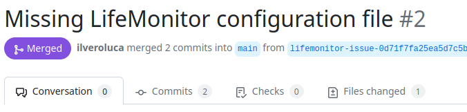

[{LM}](https://www.lifemonitor.eu/) is a service to support the
sustainability and reusability of published computational workflows. The
LifeMonitor helps alleviate the burden of maintaining workflows over time
through **automation**.

This document will show you **how to use the
[LifeMonitor](https://www.lifemonitor.eu/) service and its [GitHub
app](https://github.com/apps/lifemonitor)** on a workflow in a GitHub
repository.

> <agenda-title></agenda-title>
>
> In this tutorial, you will learn how to create a git repo, and begin working with it.
>
> 1. TOC
> {:toc}
>
{: .agenda}

## Why use the LifeMonitor?

Keeping workflows reusable takes work! Like all software, even the best
workflows can break over time if left unmaintained: for instance, there could be
a regression or an API change in an unpinned dependency, or an external resource
that the workflow relies upon might be moved to a different URL. Periodic
automated **testing** is a fundamental practice that helps expose such problems,
giving workflow maintainers a chance to intervene and fix them.  The
[LifeMonitor](https://www.lifemonitor.eu/) helps you monitor and periodically
execute the automated tests for your workflow.

Moreover, workflows should be findable to be reusable.
[LifeMonitor](https://www.lifemonitor.eu/) helps automate the generation of
[RO-Crate metadata](https://www.lifemonitor.eu/workflow_testing_ro_crate) as
well as registering new releases of your workflow with the
[WorkflowHub](https://workflowhub.eu).

Finally, [LifeMonitor](https://www.lifemonitor.eu/) can apply automated checks
to your workflow repository to help you follow [community best
practices]().


## Pre-conditions

We assume you **published a Galaxy workflow** to a GitHub repository following the
[*Galaxy Community best
practices*](#community-best-practices).

In addition, we assume you have followed the same best practices to [**create
tests** for your
workflow](#generating-tests-for-your-workflow) using
[Planemo](https://planemo.readthedocs.io/en/latest/best_practices_workflows.html#tests),
as well as configuring a [GitHub Actions
workflow](#adding-a-github-workflow) to automatically
run those tests.  Don't worry if this sounds like a lot: the [best
practices]() document provides straightforward
instructions.

### Running example

As a running example, we're going to use a simple "sort and change case"
workflow: it merely takes a text file, sorts the lines and swaps the case of all
the letters. You can access and inspect this example workflow, its tests and
its GitHub Action through [this link](https://github.com/by-covid/gtn/tree/main/docs/submitting-life-monitor/sort-and-change-case-workflow).


## Installing the LM GitHub App

The [{LM} GitHub App](https://github.com/apps/lifemonitor) provides the most
straightforward way to use {LM} with your GitHub-hosted workflow. The app can do
the following things.

* Examine your repository and apply a series of automated *checks*.
* Suggest pull requests (PRs) to make changes or additions to bring the workflow
  repository closer to conforming to best practices.
* Open issues to let you know about problems detected by the checks:
  * in some cases, you can interact with the LifeMonitor bot through the issues,
      to provide information or issue commands.
* Register new releases/versions of the workflow with both the [LifeMonitor
  service](https://app.lifemonitor.eu/) (for test monitoring) and the
  [WorkflowHub](https://workflowhub.eu/) workflow registry.


Follow the instructions provided by the [LifeMonitor
documentation](https://www.lifemonitor.eu/lm_wft_best_practices_github_app#installation)
to complete the app installation on your repository, and:

* we recommend that you enable the LifeMonitor "Issue Checks";
* we also recommend that you enable the automatic upload to the
    [WorkflowHub](https://workflowhub.eu/).

> <tip-title>Accounts Required</tip-title>
> Note that completing the installation steps may require you to create an
> account with both LifeMonitor and WorkflowHub.
> We recommend **using [LS Login](https://lifescience-ri.eu/ls-login/)** to authenticate with both
> services.
{: .tip}

> <tip-title>GitHub Connection Required</tip-title>
> You will also need to connect your GitHub account to your LifeMonitor account.
{: .tip}

## Configure your LifeMonitor account

To fully enable the features provided by LifeMonitor you need to enable some
optional settings in the LM configuration.

### Enable e-mail notifications

LifeMonitor can send you emails to notify you of important events related to
your workflows or the workflows you've [subscribed
to](https://www.lifemonitor.eu/lm_dashboard#subscribing-to-workflows).  We
recommend performing this step to -- among other things -- receive notifications
if your workflow tests start failing, or when a release of your workflow has
been registered with the LifeMonitor test monitoring service and with the
WorkflowHub registry.

[Click
here](https://www.lifemonitor.eu/lm_test_monitoring#enabling-e-mail-notifications)
to access the LifeMonitor documentation on how to perform this step.


### Configure GitHub integration

If you [installed the LM GitHub App](#installing-the-lm-github-app) on your
workflow repository your GitHub account should already be connected to
LifeMonitor. Verify this by accessing your account's [profile
page](https://app.lifemonitor.eu/account/profile) and checking that the
**Connected Accounts** table includes an entry for GitHub and it says
**CONNECTED**; if it says "CONNECT", then click on the button and follow the
procedure.  See the [LifeMonitor
documentation](https://www.lifemonitor.eu/faq#which-external-accounts-are-linked-with-my-lifemonitor-account)
for more details.

If you want, you can now check the LifeMonitor [GitHub integration
settings](https://app.lifemonitor.eu/account/profile?currentView=githubSettingsTab)
for your account. These are the default settings which will be applied unless
overridden with a repository-specific configuration file (we'll see how in a
later section).


### Connect your WorkflowHub account to LifeMonitor

Connecting your WorkflowHub identity to LifeMonitor allows LifeMonitor to
perform specific WorkflowHub actions on your behalf (using your identity).
These actions consist in registering and updating workflow entries as well as
querying the WorkflowHub for the workflows you have previously registered.

Check the *Account* tab on your [LifeMonitor account
profile](https://app.lifemonitor.eu/account/profile): if the buttons shown
in the image below say "**connected**", you're ok; else, click on the
appropriate "**connect** button and log into the WorkflowHub with the account
you'd like LifeMonitor to use.

The LifeMonitor documentation has [a more detailed explanation](https://www.lifemonitor.eu/faq#which-external-accounts-are-linked-with-my-lifemonitor-account).


### Enable WorkflowHub Integration for your account

Enabling registry integration for WorkflowHub enables the LM automations related
to workflow registry activities.


Go to the *Registry Integration* tab on your [LifeMonitor account
profile](https://app.lifemonitor.eu/account/profile?currentView=registrySettingsTab).
Enable the switches for both "wfhub" and "wfhubdev".  When you flip the switch,
you may be taken to the WorkflowHub authentication page; in that case, log into
the WorkflowHub with the same account credentials that you connected in the
previous step.


## LifeMonitor Checks

Once the LM GitHub app is installed, it starts working for you by running its automated
checks. The checks generally report one problem at a time, by opening an issue
or opening a PR with a suggested fix.  In the following subsections we'll show
the sequence of PR's and issues that are opened in our Sort and Change Case
workflow repository.

### RO-Crate metadata

LM might notice that we don't have an RO-Crate:


The LM app **automatically** executes
[repo2crate](https://github.com/crs4/repo2rocrate) as recommended by [best
practices](#best-practice-repositories-and-ro-crate) and
opens a pull request to propose the resulting RO-Crate for integration in our
repository.  Review the RO-Crate and integrate additional metadata or correct
it as necessary. Finally, merge the changes into your repository.  LifeMonitor with
automatically delete the PR branch once merged, to keep your repository tidy.


### LifeMonitor configuration file

Next, LM suggests that we add a [LifeMonitor configuration
file](https://www.lifemonitor.eu/lm_wft_best_practices_github_app#configuration-file)
to our repository.  Through this file in YAML format, we can customize some aspects of
LifeMonitor's behavior and provide it with additional metadata.


This time, we're going to make some changes to the default configuration before
accepting it.  The PR's "Conversation" tab on GitHub tells us to push changes to
a specific branch to make changes to the file:


So we'll go to the local copy of our workflow repository, fetch the remote and
checkout this branch:

```console
$ cd sort-and-change-case-workflow
$ git fetch origin
$ git checkout lifemonitor-issue-0d71f7fa25ea5d7c5b9f63e27b08b59fbc1b5349
Branch 'lifemonitor-issue-0d71f7fa25ea5d7c5b9f63e27b08b59fbc1b5349' set up to track remote branch 'lifemonitor-issue-0d71f7fa25ea5d7c5b9f63e27b08b59fbc1b5349' from 'origin'.
Switched to a new branch 'lifemonitor-issue-0d71f7fa25ea5d7c5b9f63e27b08b59fbc1b5349'
```

Now we can edit the file locally with our favorite text editor:

```console
$ nvim .lifemonitor.yaml
```

We're going to set the workflow name and make it public (which means that anyone
will be able to see it on LifeMonitor):

```yaml
name: "Sort and change case"
public: true
```

We're also going to enable automatic registration of workflow releases in
WorkflowHub and LifeMonitor.  We're going to edit the configuration so that:

1. workflow tag names that follow the [Semantic Versioning](https://semver.org/)
   convention are recognized as releases;
2. the WorkflowHub record is updated for each new release.

```yaml
    push:
      tags:
        - name: "*.*.*"  #  pattern to identify a release tag
          update_registries: ["wfhub"]  # Registry to be updated. "wfhub" == WorkflowHub
```

If you're just testing things, avoid dirtying your WorkflowHub collection.
Instead, point the LM app to the development instance of WorkflowHub by
specifying:

```yaml
update_registries: ["wfhubdev"]  # Registry to be updated. "wfhubdev" == WorkflowHub dev
```

Commit your changes now and push them to the repository:

```console
$ git commit -a -m "Update LifeMonitor settings"
[lifemonitor-issue-0d71f7fa25ea5d7c5b9f63e27b08b59fbc1b5349 0924ad7] Update LifeMonitor settings
1 file changed, 22 insertions(+), 52 deletions(-)
rewrite .lifemonitor.yaml (63%)
$ git push origin
```

Now you can go back to the Pull Request and merge it.


### New and changing checks

The set of automated checks provided by LifeMonitor is under active development.
This means that the exact sequence of issue and PR's you see may change over
time: this is normal.  Do feel free to [open an
issue](https://github.com/crs4/life_monitor/issues) if you notice something that
doesn't work as you expect or if you have a suggestion for a new automated
check.

## Automatic workflow registration to WorkflowHub


To have your workflow's WorkflowHub entry automatically updated, you
**must** [connect your WorkflowHub (or dev.WorkflowHub)
account](#connect-your-workflowhub-account-to-lifemonitor) to LifeMonitor
and [enable WorkflowHub (or dev.WorkflowHub)
integration](#enable-workflowhub-integration-for-your-account).

## Make a workflow release

Now you can make a release of your workflow. The LifeMonitor
[configuration](#lifemonitor-configuration-file) we specified for the workflow
repository specifies that we identify release by git tags matching the
expression.  You can tag the workflow as release "0.1.0" with the git CLI:

```console
$ git tag 0.1.0
$ git push --tags origin
Total 0 (delta 0), reused 0 (delta 0), pack-reused 0
To github.com:crs4/sort-and-change-case-workflow.git
* [new tag]         0.1.0 -> 0.1.0
```

The LifeMonitor now start working and automatically register the workflow with
both the LifeMonitor test monitoring functionality and the WorkflowHub registry
you enabled and selected.

> <tip-title>E-mail notifications</tip-title>
> If you enabled e-mail notifications, you should receive an email telling
> you that the registration happened and providing you with a direct link to the
> workflow on LifeMonitor (from which you'll be able to access the corresponding
> WorkflowHub entry).
> 
{: .tip}

The workflow should also appear on your [LifeMonitor
dashboard](https://app.lifemonitor.eu/dashboard).  If the GitHub Action that
tests your workflow has not been executed yet, then LM will report that the test
status is "unavailable" -- but this is normal.  After you execute your action
then the system will report its passing or failing status.

The workflow entry in LifeMonitor also has a link to the corresponding
WorkflowHub entry.  Follow the link to reach a page with your workflow's
metadata:


## Profit

Now that you've completed the setup, you'll be notified if your workflow's tests
start to fail. {LM} will also periodically try to trigger the execution of your
testing GitHub Action should there be no commits on the repository that would
trigger the tests on their own.  Also, any new workflow releases that you create
will be automatically be propagated to both LifeMonitor and WorkflowHub, keeping
your registry up to date and your workflow a little more FAIR.
