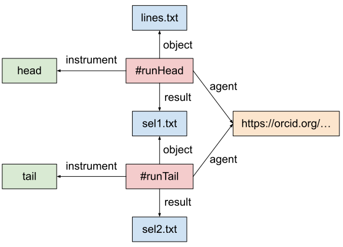

The [Workflow Run RO-Crate](https://www.researchobject.org/workflow-run-crate/) working group is developing a series of [RO-Crate profiles](https://www.researchobject.org/ro-crate/profiles.html) for representing the provenance of computational workflow executions. The set includes three profiles, which represent provenance with increasing level of detail:

* [Process Run Crate](https://w3id.org/ro/wfrun/process) can be used to describe the execution of one or more tools that contribute to a generic computation;
* [Workflow Run Crate](https://w3id.org/ro/wfrun/workflow) also describes computational processes, but in this case the execution is supposed to be orchestrated by a computational workflow (e.g., a Galaxy workflow);
* [Provenance Run Crate](https://w3id.org/ro/wfrun/provenance) is based on Workflow Run Crate, but provides additional specifications for describing the details of each step's execution.

> <agenda-title></agenda-title>
>
> In this tutorial, you will learn how to create a git repo, and begin working with it.
>
> 1. TOC
> {:toc}
>
{: .agenda}


## Process Run Crate

Consider a simple computation where we select the first four lines of a text file, and then we select the last three lines out of the initial selection. Suppose we start with the following input file, `lines.txt`:

```
one
two
three
four
five
```

Then we run:

```
head --lines 4 lines.txt >sel1.txt
```

The `sel1.txt` file will then be:

```
one
two
three
four
```

Now we run:

```
tail --lines 3 sel1.txt >sel2.txt
```

Obtaining the following `sel2.txt`:

```
two
three
four
```

A Process Run Crate that describes the above computation will contain the three text files, plus an `ro-crate-metadata.json` file structured as follows:

```json
{
    "@context": "https://w3id.org/ro/crate/1.1/context",
    "@graph": [
        {
            "@id": "ro-crate-metadata.json",
            "@type": "CreativeWork",
            "conformsTo": {"@id": "https://w3id.org/ro/crate/1.1"},
            "about": {"@id": "./"}
        },
        {
            "@id": "./",
            "@type": "Dataset",
            "conformsTo": {"@id": "https://w3id.org/ro/wfrun/process/0.1"},
            "hasPart": [
                {"@id": "lines.txt"},
                {"@id": "sel1.txt"},
                {"@id": "sel2.txt"}
            ],
            "mentions": [
                {"@id": "#runHead"},
                {"@id": "#runTail"}
            ]
        },
        {   "@id": "https://w3id.org/ro/wfrun/process/0.1",
            "@type": "CreativeWork",
            "name": "Process Run Crate",
            "version": "0.1"
        },
        {
            "@id": "https://www.gnu.org/software/coreutils/head",
            "@type": "SoftwareApplication",
            "name": "head",
            "softwareVersion": "8.30"
        },
        {
            "@id": "https://www.gnu.org/software/coreutils/tail",
            "@type": "SoftwareApplication",
            "name": "tail",
            "softwareVersion": "8.30"
        },
        {
            "@id": "#runHead",
            "@type": "CreateAction",
            "name": "Select first four lines",
            "description": "head --lines 4 lines.txt >sel1.txt",
            "endTime": "2023-04-27T15:02:56+02:00",
            "instrument": {"@id": "https://www.gnu.org/software/coreutils/head"},
            "object": {"@id": "lines.txt"},
            "result": {"@id": "sel1.txt"},
            "agent": {"@id": "https://orcid.org/0000-0002-1825-0097"}
        },
        {
            "@id": "#runTail",
            "@type": "CreateAction",
            "name": "Select first four lines",
            "description": "tail --lines 3 sel1.txt >sel2.txt",
            "endTime": "2023-04-27T15:04:02+02:00",
            "instrument": {"@id": "https://www.gnu.org/software/coreutils/tail"},
            "object": {"@id": "sel1.txt"},
            "result": {"@id": "sel2.txt"},
            "agent": {"@id": "https://orcid.org/0000-0002-1825-0097"}
        },
        {
            "@id": "lines.txt",
            "@type": "File"
        },
        {
            "@id": "sel1.txt",
            "@type": "File"
        },
        {
            "@id": "sel2.txt",
            "@type": "File"
        },
        {
            "@id": "https://orcid.org/0000-0002-1825-0097",
            "@type": "Person",
            "name": "Josiah Carberry"
        }
    ]
}
```

The RO-Crate describes two actions, `#runHead` and `#runTail`, which represent, respectively, the execution of the `head` and `tail` programs, referenced via the `instrument` property. Each action references its input(s) via `object` and its output(s) via `result`. Note how the two actions are connected by the fact that the output of `#runHead` is the input of `#runTail`: they form an "implicit workflow", whose steps have been executed manually rather than by a higher level software tool. The actions also refer to their executor via the `agent` property. The following diagram shows the relationships between the various entities:



For more information, you can see the [Process Run Crate](https://w3id.org/ro/wfrun/process) profile, which contains the full specification.


## Workflow Run Crate

Suppose now that we write a script to automate the above process:

```bash
#!/usr/bin/env bash

set -euo pipefail

die() {
    echo $1 1>&2
    exit 1
}

nargs=3
if [ $# -ne ${nargs} ]; then
    die "Usage: $0 input_file head_lines tail_lines"
fi
input_file=$1
head_lines=$2
tail_lines=$3

output_file="chunk.txt"

workdir=$(mktemp -d)
head_output="${workdir}/temp.txt"
head --lines ${head_lines} "${input_file}" >"${head_output}"
tail --lines ${tail_lines} "${head_output}" >"${output_file}"
rm -rf "${workdir}"
```

This script can be considered a workflow, since it orchestrates the execution of other applications, managing the flow of data between them, to get the final output. Note that the script is parametrized, so every time it is run we can choose a different input file and different values for the number of lines to extract with `head` and `tail`. If you name the script `head_tail.sh`, you can obtain the same result as above by running:

```
bash head_tail.sh lines.txt 4 3
```

The result will be stored in the `chunk.txt` file.

A Workflow Run Crate to represent a run of this workflow would contain the workflow itself (`head_tail.sh`), the input and output files (`lines.txt`, `chunk.txt`) and an ro-crate-metadata.json file like the following:

```json
{
    "@context": "https://w3id.org/ro/crate/1.1/context",
    "@graph": [
        {
            "@id": "ro-crate-metadata.json",
            "@type": "CreativeWork",
            "about": {"@id": "./"},
            "conformsTo": [
                {"@id": "https://w3id.org/ro/crate/1.1"},
                {"@id": "https://w3id.org/workflowhub/workflow-ro-crate/1.0"}
            ]
        },
        {
            "@id": "./",
            "@type": "Dataset",
            "conformsTo": [
                {"@id": "https://w3id.org/ro/wfrun/process/0.1"},
                {"@id": "https://w3id.org/ro/wfrun/workflow/0.1"},
                {"@id": "https://w3id.org/workflowhub/workflow-ro-crate/1.0"}
            ],
            "hasPart": [
                {"@id": "head_tail.sh"},
                {"@id": "lines.txt"},
                {"@id": "chunk.txt"}
            ],
            "license": {"@id": "http://spdx.org/licenses/CC0-1.0"},
            "mainEntity": {"@id": "head_tail.sh"},
            "mentions": {"@id": "#runHeadTail"}
        },
        {
            "@id": "https://w3id.org/ro/wfrun/process/0.1",
            "@type": "CreativeWork",
            "name": "Process Run Crate",
            "version": "0.1"
        },
        {
            "@id": "https://w3id.org/ro/wfrun/workflow/0.1",
            "@type": "CreativeWork",
            "name": "Workflow Run Crate",
            "version": "0.1"
        },
        {
            "@id": "https://w3id.org/workflowhub/workflow-ro-crate/1.0",
            "@type": "CreativeWork",
            "name": "Workflow RO-Crate",
            "version": "1.0"
        },
        {
            "@id": "head_tail.sh",
            "@type": ["File", "SoftwareSourceCode", "ComputationalWorkflow"],
            "name": "Head-Tail",
            "programmingLanguage": {"@id": "#bash"},
            "input": [
                {"@id": "#input_file-param"},
                {"@id": "#head_lines-param"},
                {"@id": "#tail_lines-param"}
            ],
            "output": [
                {"@id": "#output_file-param"}
            ]
        },
        {
            "@id": "#input_file-param",
            "@type": "FormalParameter",
            "additionalType": "File",
            "name": "input_file",
            "valueRequired": "True"
        },
        {
            "@id": "#head_lines-param",
            "@type": "FormalParameter",
            "additionalType": "Integer",
            "name": "head_lines",
            "valueRequired": "True"
        },
        {
            "@id": "#tail_lines-param",
            "@type": "FormalParameter",
            "additionalType": "Integer",
            "name": "tail_lines",
            "valueRequired": "True"
        },
        {
            "@id": "#output_file-param",
            "@type": "FormalParameter",
            "additionalType": "File",
            "name": "output_file"
        },
        {
            "@id": "#bash",
            "@type": "ComputerLanguage",
            "identifier": "https://www.gnu.org/software/bash/",
            "name": "Bash",
            "url": "https://www.gnu.org/software/bash/"
        },
        {
            "@id": "#runHeadTail",
            "@type": "CreateAction",
            "name": "Run of head_tail.sh",
            "endTime": "2023-05-04T17:02:01+02:00",
            "instrument": {"@id": "head_tail.sh"},
            "object": [
                {"@id": "lines.txt"},
                {"@id": "#head_lines-pv"},
                {"@id": "#tail_lines-pv"}
            ],
            "result": [
                {"@id": "chunk.txt"}
            ],
            "agent": {"@id": "https://orcid.org/0000-0002-1825-0097"}
        },
        {
            "@id": "lines.txt",
            "@type": "File",
            "exampleOfWork": {"@id": "#input_file-param"}
        },
        {
            "@id": "#head_lines-pv",
            "@type": "PropertyValue",
            "exampleOfWork": {"@id": "#head_lines-param"},
            "name": "head_lines",
            "value": "4"
        },
        {
            "@id": "#tail_lines-pv",
            "@type": "PropertyValue",
            "exampleOfWork": {"@id": "#tail_lines-param"},
            "name": "tail_lines",
            "value": "3"
        },
        {
            "@id": "chunk.txt",
            "@type": "File",
            "exampleOfWork": {"@id": "#output_file-param"}
        },
        {
            "@id": "https://orcid.org/0000-0002-1825-0097",
            "@type": "Person",
            "name": "Josiah Carberry"
        }
    ]
}
```

Note how the crate has a `mainEntity` that points to the workflow (`head_tail.sh`). This is in conformance with the [Workflow RO-Crate](https://w3id.org/workflowhub/workflow-ro-crate/1.0) profile. In addition to Workflow RO-Crate, Workflow Run Crates also conform to the [Process Run Crate](https://w3id.org/ro/wfrun/process) profile and to the [Workflow Run Crate](https://w3id.org/ro/wfrun/workflow) profile itself, as you can see from the `conformsTo` entries.

One of the main additions with respect to Process Run Crate is the representation of parameter "slots" (which can take different values according to the specific run) via `FormalParameter`. In this case we have three input parameters:

 * `#input_file-param`, corresponding to the input file
 * `#head_lines-param`, corresponding to the number of lines to select with the `head` program
 * `#tail_lines-param`, corresponding to the number of lines to select with the `tail` program

The `#runHeadTail` action has three `object` entries, which represent the actual values used for the parameters in this specific run. The first item is the `lines.txt` file, while the other two are represented via [PropertyValue](https://schema.org/PropertyValue) instances, where the `value` property provides the values taken by the parameters. Crucially, the `exampleOfWork` property connects each parameter value to the corresponding `FormalParameter`. Similarly, the `chunk.txt` file matches the output parameter `#output_file-param`.

An example of a Workflow Run Crate for a Galaxy workflow is available at [https://doi.org/10.5281/zenodo.7785860](https://doi.org/10.5281/zenodo.7785860).

You can export a Galaxy workflow invocation as a Workflow Run Crate by following [this tutorial](https://by-covid.github.io/gtn/ro-crate-in-galaxy/).


## Provenance Run Crate

[Provenance Run Crate](https://w3id.org/ro/wfrun/provenance) further extends Workflow Run Crate, specifying how to represent the actions corresponding to individual steps in the workflow. The extent to which this can be done may depend on how the workflow is written and how the workflow engine operates. For instance, the shell script we used in the previous section does not keep the intermediate output from the execution of `head`: it's stored in a temporary directory, which is deleted at the end of the script.

A workflow management system that supports Provenance Run Crate is [StreamFlow](https://streamflow.di.unito.it/), which executes [CWL](https://www.commonwl.org/) workflows. Let's write a CWL workflow that implements our head-tail application. We start by writing `headtool.cwl`, a wrapper for the `head` tool:

```yaml
class: CommandLineTool
cwlVersion: v1.0

baseCommand: head

inputs:
  lines:
    type: int
    inputBinding:
      position: 1
      prefix: "--lines"
  input:
    type: File
    inputBinding:
      position: 2
outputs:
  output:
    type: File
    outputBinding:
      glob: head_out.txt
stdout: head_out.txt
```

We then do the same for `tail`, calling the wrapper `tailtool.cwl`:

```yaml
class: CommandLineTool
cwlVersion: v1.0

baseCommand: tail

inputs:
  lines:
    type: int
    inputBinding:
      position: 1
      prefix: "--lines"
  input:
    type: File
    inputBinding:
      position: 2
outputs:
  output:
    type: File
    outputBinding:
      glob: tail_out.txt
stdout: tail_out.txt
```

Finally, we write the workflow, `head_tail.cwl`:

```yaml
class: Workflow
cwlVersion: v1.0

inputs:
  input_file:
    type: File
  head_lines:
    type: int
  tail_lines:
    type: int
outputs:
  output_file:
    type: File
    outputSource: tail/output

steps:
  head:
    in:
      lines: head_lines
      input: input_file
    out: [output]
    run: headtool.cwl
  tail:
    in:
      lines: tail_lines
      input: head/output
    out: [output]
    run: tailtool.cwl
```

Now that we have the workflow, let's write the file that contains the parameter settings for our specific run, `params.yml`:

```yaml
input_file:
  class: File
  location: lines.txt
head_lines: 4
tail_lines: 3
```

Now, install StreamFlow (we're going to need a version with RO-Crate support). To avoid possible conflicts, consider installing in a clean [virtual environment](https://docs.python.org/3/library/venv.html).

```
pip install 'streamflow==0.2.0.dev4'
```

Now run the workflow:

```
cwl-runner head_tail.cwl params.yml
```

To generate the RO-Crate, we're going to need the workflow's name in the StreamFlow database:

```console
$ streamflow list
NAME                                  TYPE EXECUTIONS 
f6b2273d-a945-4b27-aa98-dcfe0b778f4c  cwl  1
```

In your case, the name might be different. Now generate the RO-Crate with:

```
streamflow prov f6b2273d-a945-4b27-aa98-dcfe0b778f4c
```

taking care to replace the workflow name with the actual one you got from `streamflow list`. This will generate a zip archive containing the RO-Crate. Unzip the archive to get the RO-Crate directory:

```
unzip -d f6b2273d-a945-4b27-aa98-dcfe0b778f4c{,.crate.zip}
```

If you inspect `f6b2273d-a945-4b27-aa98-dcfe0b778f4c/ro-crate-metadata.json`, you will find a similar structure to the one seen for Workflow Run Crate, but with a lot more detail. Most notably, there will be three actions: in addition to the one representing the execution of the whole workflow, there will be two more, representing the execution of `headtool.cwl` and of `tailtool.cwl`. Each of this points to the corresponding tool via `instrument`, and to its inputs and outputs via `object` and `result`. The intermediate file resulting from the `head` run (`head_out.txt`) is included, and listed both as an output of the `head` run and as an input of the `tail` run. This situation is similar to what we've seen in the [Process Run Crate example](#process-run-crate), but this time everything has been orchestrated by a workflow engine on the basis of a formal workflow description.

More information on the entities represented in a Provenance Run Crate is available in the [specification](https://w3id.org/ro/wfrun/provenance).

An example a Provenance Run Crate representing an execution of a digital pathology image annotation workflow is available at [https://doi.org/10.5281/zenodo.7669622](https://doi.org/10.5281/zenodo.7669622).
