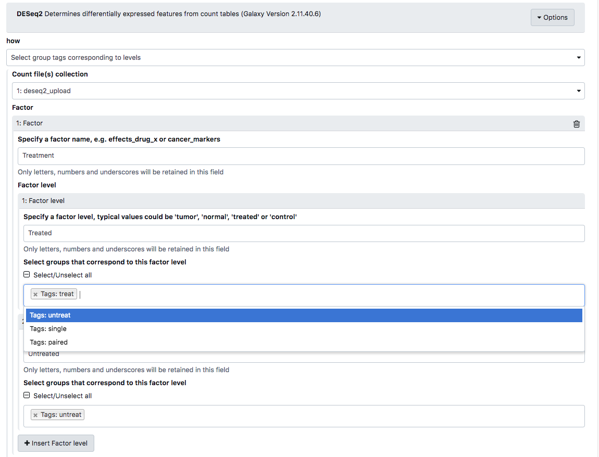

# Introduction
{:.no_toc}

Advanced uses of Galaxy often require the use of dataset collections,
which can contain between one and tens of thousands of datasets.
Grouping datasets in this way has numerous advantages:
  - It is easy to represent a single collection in the History
  - Dataset names ("Element Identifiers") are immutable and preserved
  - Collections can be split and nested in arbitrary ways

While collections can be split in any way, doing so for multi-factor analysis
quickly becomes cumbersome and messy. An alternative is to label collection
elements with special group tags. These tags can be displayed in the Tool form,
allowing users to select subsets of collections.

This tutorial outlines how to set and use group tags with the DESeq2 tool.
For a more detailed description and background for differential expression
testing see the [Reference-based RNA-Seq data analysis]({{ site.baseurl }}/topics/transcriptomics/tutorials/ref-based/tutorial.html).


> ### Agenda
>
> In this tutorial, we will cover:
>
> 1. TOC
> {:toc}
>
{: .agenda}

# Setting group tags using the apply rules tool

There are three ways to set group tags:
  - Using the rule builder / apply_rules tool
  - Using the "Tag elements from file" tool
  - Manually

We will use the first two methods in this tutorial.
The second method works at any step during the analysis.

## Set group tags during upload

> ###  Hands-on: Data upload
>
> 1. Create a new history for this tutorial
> 2. **Click** the upload icon toward the top left corner.
> 3. **Click** `Rule-based` as shown below.
>    
>    As you can see in this dialog, data can be selected from a history dataset or pasted in directly
> 4. Set the `Upload data as:` value to `Collection(s)`
> 5. Paste the following links into the text box
>
>    ```
>    https://zenodo.org/record/1185122/files/GSM461176_untreat_single.counts
>    https://zenodo.org/record/1185122/files/GSM461177_untreat_paired.counts
>    https://zenodo.org/record/1185122/files/GSM461178_untreat_paired.counts
>    https://zenodo.org/record/1185122/files/GSM461179_treat_single.counts
>    https://zenodo.org/record/1185122/files/GSM461180_treat_paired.counts
>    https://zenodo.org/record/1185122/files/GSM461181_treat_paired.counts
>    https://zenodo.org/record/1185122/files/GSM461182_untreat_single.counts
>    ```
>
> 6. **Click** Build
> 7. We will add a regex that creates 3 new columns with accession, treatment and library type:
>    - **Click** on the ``Columnn`` button -> ``Using a Regular Expression`` -> ``Create columns matching expression groups``
>    - Paste ``.*(GSM.*)_(.*)_(.*).counts`` set ``Number of Groups`` to 3
>    - **Click** on ``Apply``
>    - **Click** on ``Rules`` -> ``Add / Modify Column Definitions`` -> `Add Definition` and select:
>      - ``URL``: Column A
>      - ``List Identifiers``: Column B
>      - ``Group Tags``: Column C
>      - ``Group Tags``: Column D
>    - **Click** Apply
>    - Enter a name for the new collection and Click ``Build``

{: .hands_on}

## Set group tags using the "Tag elements from file" tool

> ###  Hands-on: Data upload
>
> 1. Create a new history for this tutorial
> 2. **Click** the upload icon toward the top left corner.
> 3. **Click** on ``Paste/Fetch data`` and paste the following URLs:
>
>    ```
>    https://zenodo.org/record/1185122/files/GSM461176_untreat_single.counts
>    https://zenodo.org/record/1185122/files/GSM461177_untreat_paired.counts
>    https://zenodo.org/record/1185122/files/GSM461178_untreat_paired.counts
>    https://zenodo.org/record/1185122/files/GSM461179_treat_single.counts
>    https://zenodo.org/record/1185122/files/GSM461180_treat_paired.counts
>    https://zenodo.org/record/1185122/files/GSM461181_treat_paired.counts
>    https://zenodo.org/record/1185122/files/GSM461182_untreat_single.counts
>    ```
>
> 4. **Click** Start
> 5. When the upload has finished select the ``Operations on multiple datasets`` button,
>     check all new datasets and click on ``For all selected ...`` -> ``Build Dataset List``,
>     enter a name for the new collection and **click** ``Create list``.
> 6. We can now either upload a tabular file containing the element identifiers and the tags we want to apply,
>    or we can extract the element identifiers and extract the tags using a Regular Expression. We will do the
>    latter.
> 7. Select the ``Extract element identifiers of a list collection`` tool and run it on the newly created Collection.
> 8. Use the ``Replace Text in entire line`` tool to add additional columns that can be used with the ``Tag elements from file`` tool:
>      - Select the text file as input and use ``(.*)_(.*)_(.*).counts`` to capture the treatment and library strategy.
>      - Enter ``\1_\2_\3.counts\group:2\tgroup:\3`` as replacement.
> 9. Select the ``Tag elements from file `` tool, select the newly created collection and choose the output file from the previous step
>    as ``Tag collection elements according to this file`` and **click** ``Execute``
{: .hands_on}

You should now have a properly tagged collection of tabular files that can be used in DESeq2.


# Using group tags in DESeq2


DESeq2 has two modes for specifying factors. One can either
select datasets corresponding to factors, or use group tags
to specify factors. We will use the grop tags present in
our collection to specify factors.


We can now select our groups from the tool form:


## Running **DESeq2** with group tags

> ###  Hands-on: Task description
>
> 1. **DESeq2**  with the following parameters:
>    - *"how"*: `Select group tags corresponding to levels`
>    -  *"Count file(s) collection"*: File
>    - *"Specify a factor name, e.g. effects_drug_x or cancer_markers"*: Treatment
>    - *"Specify a factor level, typical values could be 'tumor', 'normal', 'treated' or 'control'"*: Treated
>    - *"Select groups that correspond to this factor level"*: treat
>    - *"Specify a factor level, typical values could be 'tumor', 'normal', 'treated' or 'control'"*: Untreated
>    - *"Select groups that correspond to this factor level"*: untreat
>    - *"Specify a factor name, e.g. effects_drug_x or cancer_markers"*: Library
>    - *"Specify a factor level, typical values could be 'tumor', 'normal', 'treated' or 'control'"*: Single end
>    - *"Select groups that correspond to this factor level"*: single
>    - *"Specify a factor level, typical values could be 'tumor', 'normal', 'treated' or 'control'"*: Paired
>    - *"Select groups that correspond to this factor level"*: paired
>    - *"Files have header?"*: False
>

# Conclusion
{:.no_toc}

We can select a subset of Collections using the special group tag.
