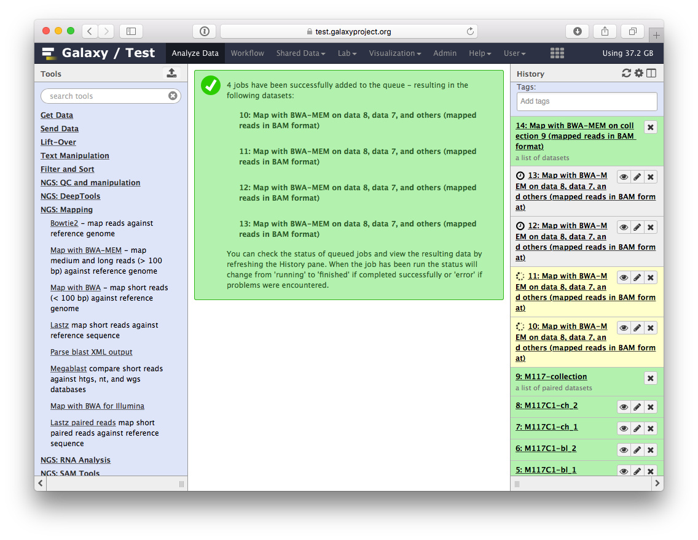
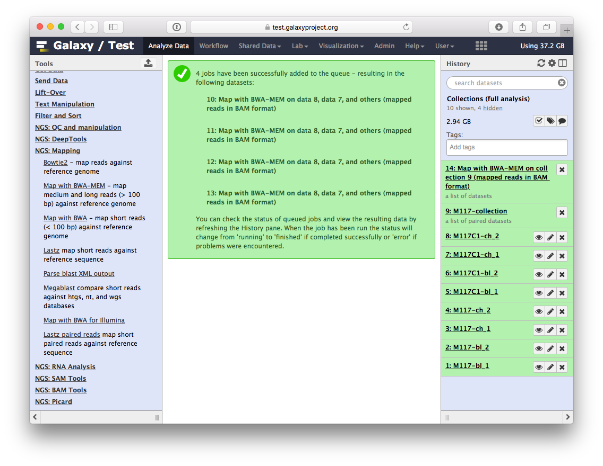
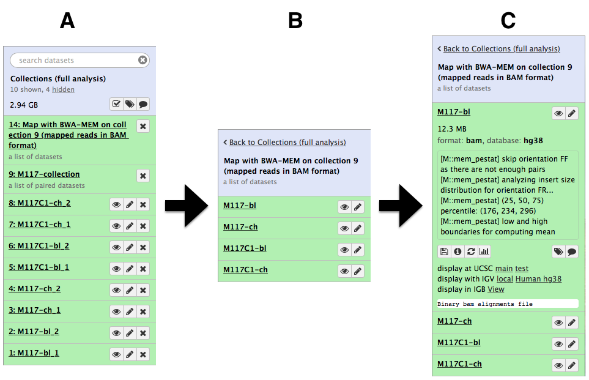
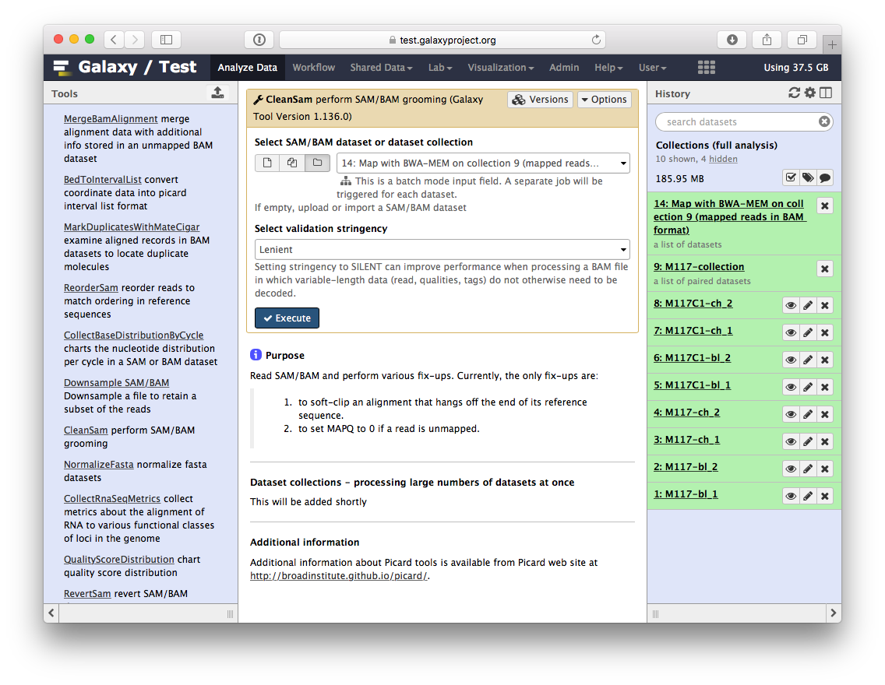
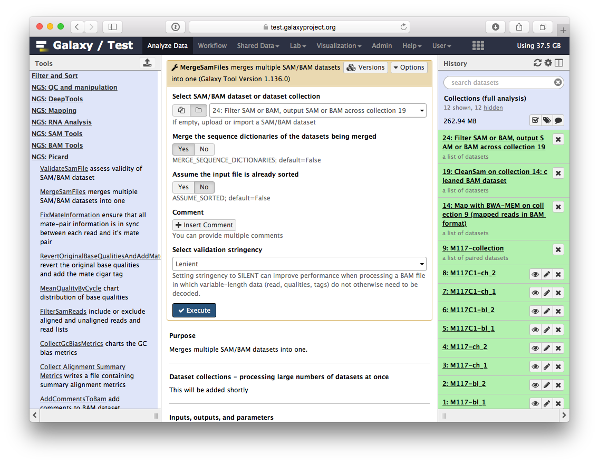

Here we will show Galaxy features designed to help with the analysis of large numbers of samples. When you have just a few samples - clicking through them is easy. But once you've got hundreds - it becomes very annoying. In Galaxy we have introduced **Dataset collections** that allow you to combine numerous datasets in a single entity that can be easily manipulated.

# Getting data

First, we need to upload datasets. Cut and paste the following URLs to Galaxy upload tool (see a  **Tip** on how to do this [below](#-tip-upload-fastqsanger-datasets-via-links)). 

```
https://zenodo.org/record/5119008/files/M117-bl_1.fq.gz
https://zenodo.org/record/5119008/files/M117-bl_2.fq.gz
https://zenodo.org/record/5119008/files/M117-ch_1.fq.gz
https://zenodo.org/record/5119008/files/M117-ch_2.fq.gz
https://zenodo.org/record/5119008/files/M117C1-bl_1.fq.gz
https://zenodo.org/record/5119008/files/M117C1-bl_2.fq.gz
https://zenodo.org/record/5119008/files/M117C1-ch_1.fq.gz
https://zenodo.org/record/5119008/files/M117C1-ch_2.fq.gz
```

> ###  Set format to `fastqsanger.gz`
> The above datasets are in `fastqsanger.gz` format. It is necessary to explicitly set format in Galaxy. The  **Tip** section below explains how to upload these data and set the correct format. There is a variety of [fastq format flavors](https://en.wikipedia.org/wiki/FASTQ_format) and it is difficult to guess them automatically.  
>
> 
{: .warning}

## About these datasets

These datasets represent genomic DNA (enriched for mitochondria via a long range PCR) isolated from blood (`bl`) and cheek (buccal swab, `ch`) of mother (`M117`) and her child (`M117C1`) that was sequenced on an Illumina miSeq machine as paired-read library (250-bp reads; see our [2014](http://www.pnas.org/content/111/43/15474.abstract) manuscript for **Methods**):

- `M117-bl_1` - family 117, mother, *forward* (**F**) reads from **blood**
- `M117-bl_2` - family 117, mother, *reverse* (**R**) reads from **blood**
- `M117-ch_1` - family 117, mother, *forward* (**F**) reads from **cheek**
- `M117-ch_1` - family 117, mother, *reverse* (**R**) reads from **cheek**
- `M117C1-bl_1`- family 117, child, *forward* (**F**) reads from **blood**
- `M117C1-bl_2`- family 117, child, *reverse* (**R**) reads from **blood**
- `M117C1-ch_1`- family 117, child, *forward* (**F**) reads from **cheek**
- `M117C1-ch_2`- family 117, child, *reverse* (**R**) reads from **cheek**

## Creating a paired dataset collection

You can see that there are eight datasets forming four pairs. Obviously, we can manipulate them one-by-one (e.g., start four mapping, jobs, call variants four times and so on), but this will unnecessarily tedious. Moreover, imagine if you have 100s or 1,000s of pairs: it will be impossible to process them individually. 

This is exactly why we developed collections. Dataset collections allow combining multiple datasets into a single entity. Thus instead of dealing with four, a hundred, or a thousand of individual datasets you have only one item in Galaxy history to deal with. 

Because our data is *paired* we need to create a hierarchical collection called **Paired Dataset Collection** or **Paired Collection**. In such collection there are two layers. The first layer corresponds to individual samples (e.g., `M117-bl`). The second layer represent `forward` and `reverse` reads corresponding to each sample:

-----


-----

To begin creating a collection we need to select datasets we would like to bundle. This is done using checkbox button of Galaxy's history menu. Fig. 2 below shows this process.

-----


-----

The above process ended with appearance of Galaxy collection wizard. In this case Galaxy automatically assigned pairs using the `_1` and `_2` endings of dataset names. Let's however pretend that this did not happen. Click on **Unpair all** (highlighted in red in the figure above) link and then on **Filters** link (see animation in Fig. 3). The interface will change into its unpaired state.

Here datasets containing the first (forward) and the second (reverse) read are differentiated by having `_1` and `_2` in the filename. We can use this feature in dataset collection wizard to pair our datasets.  Type `_1` in the left **Filter text** text box and `_2` in the right. You will see that the dataset collection wizard will automatically filter lists on each side of the interface. Now you can either click **Auto pair** if pairs look good to you (proper combinations of datasets are listed in each line) or pair each forward/reverse group individually by pressing **Pair these datasets** button separating each pair.

Now it is time to name the collection: type `M117-collection` in **Name** text box and create the collection by clicking **Create collection**. A new item will appear in the history.

------


------

Clicking on collection will expand it to show four pairs it contains (panel **B**). Clicking individual pairs will expand them further to reveal **forward** and **reverse** datasets (panel **C**). Expanding these further will enable one to see individual datasets (panel **D**).


{: .img-responsive}

## Using collections

By now we see that a collection can be used to bundle a large number of items into a single history item. This means that many Galaxy tools will be able to process all datasets in a collection transparently to you. Let's try to map these datasets to human genome using `bwa-mem` mapper. In the Tools pane on the left, use the `search-tools` to find `bwa-mem`. Click on `Map with BWA-MEM` in the search list.


{: .img-responsive}

In the central panel, provide the following parameters for `Map with BWA-MEM`:

- set **Using reference genome** to `hg38` (red outline);
- set **Single or Paired-end reads** to `Paired collection` (blue outline);
- select `M177-collection` from **Select a paired collection** dropdown (magenta outline);
- In **Set read groups information** select `Automatically assign ID` (green outline);
- scroll down and click **Execute**.

You will see jobs being submitted and new datasets appearing in the history. IN particular below you can see that Galaxy has started four jobs (two yellow and two gray). This is because we have eight paired datasets with each pair being processed separately by `bwa-mem`. As a result we have four `bwa-mem` runs:


{: .img-responsive}

Once these jobs are finished they will disappear from the history and all results will be represented as a new collection:


{: .img-responsive}

Let's look at this collection by clicking on it (panel **A** in the figure below). You can see that now this collection is no longer paired (compared to the collection we created in the beginning of this tutorial). This is because `bwa-mem` takes forward and reverse data as input, but produces only a single BAM dataset as the output. So what we have in the result is a *list* of four dataset (BAM files; panels **B** and **C**).


{: .img-responsive}

## Processing collection as a single entity

Now that `bwa-mem` has finished and generated a collection of BAM datasets we can continue to analyze the entire collection as a single Galaxy '*item*'.

### Ensuring consistency of BAM dataset

Let's perform cleanup of our BAM files with `cleanSam` utility from the **Picard** package:


{: .img-responsive}

If you look at the picture above carefully, you will see that the **Select SAM/BAM dataset or dataset collection** parameter is empty (it says `No sam or bam datasets available.`). This is because we do not have single SAM or BAM datasets in the history. Instead we have a collection. So all you need to do is to click on the  button and you will get our BAM collection selected:


{: .img-responsive}

Click **Execute**. As an output this tool will produce a collection contained cleaned data.

### Retaining 'proper pairs'

Now let's clean the dataset further by only preserving truly paired reads (reads satisfying two requirements: (1) read is paired, and (2) it is mapped as a proper pair). For this we will use `Filter SAM or BAM` tools from **SAMTools** collection:


{: .img-responsive}

parameters should be set as shown below. By setting mapping quality to `20` we avoid reads mapping to multiple locations and by using **Filter on bitwise flag** option we ensure that the resulting dataset will contain only properly paired reads. This operation will produce yet another collection containing now filtered datasets.


{: .img-responsive}

### Merging collection into a single dataset

The beauty of BAM datasets is that they can be combined in a single entity using so called *Read group*. This allows to bundle reads from multiple experiments into a single dataset where read identity is maintained by labelling every sequence with *read group* tags. So let's finally reduce this collection to a single BAM dataset. For this we will use `MergeSamFiles` tool for the `Picard` suite:


{: .img-responsive}

Here we select the collection generated by the filtering tool described above:


{: .img-responsive}

This operation will **not** generate a collection. Instead, it will generate a single BAM dataset containing mapped reads from our four samples (`M117-bl`, `M117-ch`, `M117C1-bl`, and `M117C1-ch`).

## Let's look at what we've got!

So we have one BAM dataset combining everything we've done so far. Let's look at the contents of this dataset using a genome browser. First, we will need to downsample the dataset to avoiding overwhelming the browser. For this we will use `Downsample SAM/BAM` tool:


{: .img-responsive}

Set **Probability (between 0 and 1) that any given read will be kept** to roughly `5%` (or `0.05`) using the slider control:


This will generate another BAM dataset containing only 5% of the original reads and much smaller as a result. Click on this dataset and you will see links to various genome browsers:


{: .img-responsive}

Click the **Human hg38** link in the **display with IGV** line as highlighted above (learn more about displaying Galaxy data in IGV with this [movie](https://vimeo.com/123442619#t=4m16s)). Below is an example generated with IGV on these data. In this screenshot, reads are colored by read group (four distinct colors). A yellow inset displays additional information about a single read. One can see that this read corresponds to read group `M117-bl`.


{: .img-responsive}

## We did not fake this:
The history described in this page is accessible directly from here:

* History [**Collections (full analysis)**](https://usegalaxy.org/u/aun1/h/collections-full-analysis)

From there you can import histories to make them your own.

## If things don't work...
...you need to complain. Use [Galaxy's Help Channel](https://help.galaxyproject.org/) to do this.
