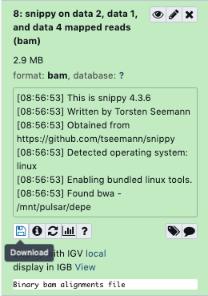
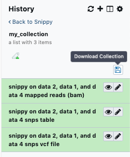
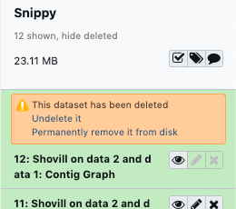
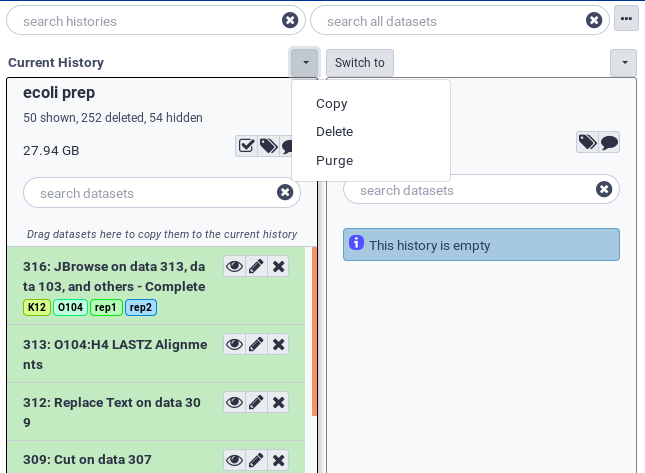

# Introduction

This tutorial outlines the process to get your data out of Galaxy and to delete it from Galaxy afterwards.

After you have completed your analysis on a Galaxy server, you may need to download the results for use in reports, papers, or other requirements. Galaxy has a myriad of methods for downloading data from individual datasets to a collection of data to an entire history along with all of its metadata. The first section of this tutorial will walk you through all of these methods.

On some Galaxy servers, user disk quotas have been enabled meaning that users are only able to store a certain amount of data on that particular Galaxy server. Quotas can differ on different servers. User disk quotas for the `usegalaxy.*` servers are shown in the table below:

| Galaxy Server    | Unregistered User   | Registered User                      |
| ---------------  | ------------------- | -----------------                    |
| usegalaxy.org    | 5 GB                | 250 GB                               |
| usegalaxy.eu     | 5 GB                | 250 GB or 500 GB for Elixir Members  |
| usegalaxy.org.au | 5 GB                | 100 GB or 600GB for Australian Users |

Other Galaxy servers may have different quota systems.

As you use a Galaxy server and upload data, perform analyses etc. you will use up your quota. If you have filled your quota and you want to do some new work, you can download your old work and delete it off the Galaxy server to free up quota space. Galaxy uses a two step process to delete user data from disk. The first step is to delete the data - this marks the data as deleted but it can be undeleted for a certain time[^1]. The second step is to purge the deleted data - this removes the deleted data from the disk and it is no longer recoverable. Note that any data that has been shared with another user will not be deleted from disk unless the other users also delete it.

The second section of this tutorial will outline how to delete data from your user space and to purge it from disk if you so desire.

> <agenda-title></agenda-title>
>
> In this tutorial, we will cover:
>
> 1. TOC
> {:toc}
>
{: .agenda}

# Downloading Data from Galaxy

There are multiple ways of downloading your data from Galaxy, the choice of which method to use depends on the amount of data you wish to download. You can download a single dataset, multiple datasets all the way to entire histories.

## Downloading a single file from Galaxy

The easiest way to get your data is to download a single dataset from a history.

The following example steps through the process using a generic history. The history pictured in the screenshots will most likely not appear in your Galaxy server but the process will be the same.

> <hands-on-title>Download a single file</hands-on-title>
>
> 1. In the History pane, click on the name of the file you wish to download. This will expand the file in the History to show more details about it.
>
>    
>
> 2. Click the  **Download** button. The dataset will now be downloaded to your computer.
>
>    
>
{: .hands_on}

Repeat this for any other data file you want in this or other histories.

## Download multiple datasets

Sometimes you may want to download multiple datasets at once and doing them one by one can be a pain. Luckily, Galaxy has a mechanism for creating Collections. For more details about collections and how to create them, see [this tutorial]() from the Galaxy Training Network.

The concept is very simple however, we are just going to lump together our files of interest and download them all at once.

> <hands-on-title>Download multiple datasets</hands-on-title>
>
> **Create a collection of the files you want**
>
> 1. Click on the **Collections** button at the top of the History pane (the little checkbox)
>
>    
>
>    This shows a different view of the History. Each file now has a checkbox next to it and there are some new buttons in the header section of the History.
>
> 2. Select the files you want by clicking on their checkboxes, you can also select all or none of them.
>
>    
>
> 3. Once you have selected everything you want, click the **for all selected** button and then **Build Dataset List**
>
> 4. A new interface opens, showing you the files you have selected. Give the list a name in the appropriate box and click **Create**
>
>    
>
> 5. A new collection item has now appeared in your History.
>
>    
>
> **Download the collection**
>
> 1. Click on the name of the collection to show its contents
> 2. Click the  **Download Collection** button to download the collection of files as a compressed archive to your computer.
>
>    
>
{: .hands_on}

You can repeat this process for other sets of files you want to download in other histories.

## Download (export) an entire history including its metadata

The third way to download data from Galaxy is by Exporting a history in its entirety. This will allow you to download all of the data in a history as well as all of the metadata associated with it such as the tools used, their versions, the parameters chosen etc. It is downloaded as a single file archive. Once downloaded, you can also Import this history into another Galaxy server.

Depending on the size of the files and the complexity of the history, it can take quite some time to create the archive before download. For example it can take over 24 hours to create an archive file of a 50GB history. It may be simpler just to download the individual files of interest as outlined above.

> <hands-on-title>Export an entire history</hands-on-title>
>
> 1. In the History pane, click on the  history menu, then select **Export History to File**
>
>    
>
> 2. Galaxy will now start archiving the history and making it available for download. In the main Galaxy pane, a message will appear with a download URL. Once the history has been completely archived, the URL can be used to download the history archive file.
>
>    
>
> 3. Click on the URL to start the download. If it isn’t ready yet, it will show you the following message. You will need to save the URL and try again later.
>
>    
>
{: .hands_on}

# Deleting Data from Galaxy

Once you have downloaded everything that you want to keep from your Galaxy account, you can delete the data and histories your no longer require.

Deletion in Galaxy is a two stage process. If you delete something, it actually only gets marked as deleted and then is hidden. To actually delete an object you must purge it from disk. The instructions for how to delete datasets and histories follow.

## Delete a single dataset

This section will show you how to delete and then purge a single dataset from a history. You can also delete multiple datasets and then purge them all at once.

> <hands-on-title>Delete a single dataset</hands-on-title>
>
> 1. Click on the  **Delete** button of the dataset you wish to delete
>
>    
>
> 2. The dataset has now disappeared from the history pane and the text `1 deleted` appears below the history name.
>
>    
>
> 3. You can see all of the deleted datasets by clicking on the `1 deleted` link at the top of the history pane. This will allow you to either: `Undelete it` OR `Permanently remove it from disk` by clicking on the appropriate link. **Note: Once you click on the permanently remove it from disk link you CANNOT undo it.**
>
>    
>
> 4. You can also delete and purge multiple datasets at a time by clicking on the **delete** button on all the datasets you want to remove and then purge them all at once by going to the history menu (the little cog wheel) and selecting **Purge Deleted Datasets**
>
>    
>
{: .hands_on}

## Delete an entire History

You can delete an entire history and purge it from disk.

> <hands-on-title>Delete an entire History</hands-on-title>
>
> 1. Open the **History List** display by clicking on the  history list button
>
>    
>
> 2. You will now see a list of all of your histories
>
>    
>
> 3. You can now delete a history by clicking on the  dropdown arrow at the top of the history, and then selecting **Delete** OR **Purge**.
>
>    > <warning-title>You can lose data</warning-title>
>    > **NOTE: Selecting Delete Permanently will remove the entire history and all of its non shared datasets from disk. It CANNOT be undone.**
>    {: .warning}
>
> 4. If you only selected **Delete**, the history will be available to un-delete for a certain time[^1]
>
{: .hands_on}

# Conclusion

This tutorial should have explained to you how to manage your data on Galaxy. Different Galaxy servers will have different policies regarding storage quotas and storage times. You should check with the Galaxy server you are using.

##### Footnotes:

[^1]: On some Galaxy servers, data and histories marked for deletion are periodically purged by the administrators. This period of time can vary between servers and you should check with the documentation or administrators of your server to know the exact amount of time.
