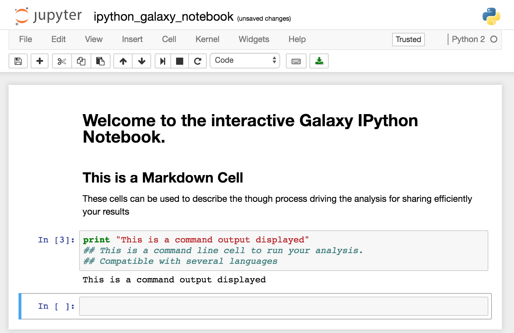
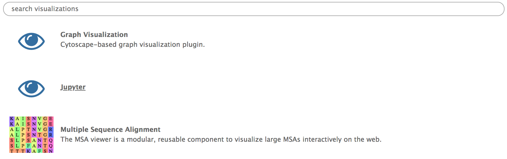
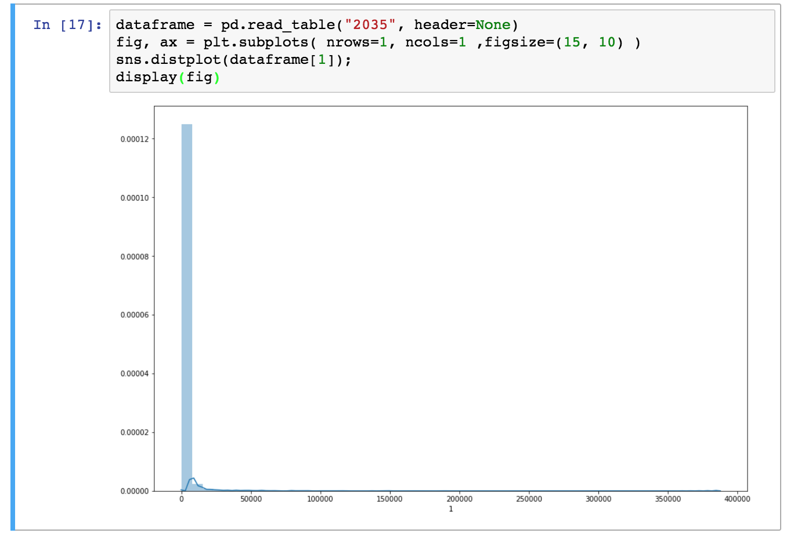

# Introduction

In this tutorial we are going to explore the basics of using Jupyter in Galaxy. We will use a RNA seq count file as a test set to get a hang of the Jupyter notebooks.
The file is available in [Zenodo](https://zenodo.org/record/1185122#.WzlCQNhKgWo) or in the *Tutorial* section of *Data Libraries*.
Select a file ending with `.count` and upload it in your history (If you want to know how to upload data in galaxy, see [Getting Data into Galaxy]() tutorial)

> <agenda-title></agenda-title>
>
> In this tutorial, we will see :
>
> 1. TOC
> {:toc}
>
{: .agenda}

# What is Jupyter ?

[Jupyter](http://jupyter.org/) in an interactive environment that mixes explanatory text, command line and output display for an interactive analysis environment. Its implementation in Galaxy facilitate the performance of additional analysis if there is no tool for it.

These notebooks allow you to replace any in-house script you might need to complete your analysis. You don't need to move your data out of Galaxy. You can describe each step of your analysis in the markdown cells for an easy understanding of the processes, and save it in your history for sharing and reproducibility. In addition, thanks to [Jupyter magic commands](https://ipython.readthedocs.io/en/stable/interactive/magics.html), you can use several different languages in a single notebook.

You can find the complete manual for Jupyter commands [on Read the Docs](http://jupyter-notebook.readthedocs.io/en/stable/).

# Use Jupyter notebook in Galaxy

## Open a Notebook
The Jupyter notebook can be started from different points. You can either open a Jupyter notebook from a dataset in your history or from the *Visualize* tab in the upper menu.

> <hands-on-title>Launching a Jupyter notebook from a dataset or a saved Jupyter notebook</hands-on-title>
> If you only need one dataset from your history to perform you analysis or want to open a Jupyter notebook that you previously saved in your history, you can launch a Jupyter from a single dataset.
> 1. Expand the dataset in you history by clicking on its name.
> 2. Click on the visualization icon  of the dataset `[...].count`.
> 3. Select the Jupyter visualization in the list. 
>
{: .hands_on}

> <hands-on-title>Lauching a Jupyter notebook from the <i>Visualize</i> tab</hands-on-title>
>
> 1. Click on the *Visualize* tab on the upper menu and select `Interactive Environments`
> 2. To open a notebook, set the parameters as follows :
>   - *"GIE"* : `Jupyter`
>   - *"Image"* : `quay.io/bgruening/docker-jupyter-notebook:17.09`
>   - *"Datasets"* : The datasets you want to work on, here your `[...].count` file. If the first dataset you select is a notebook from you history, it will be opened instead of a new notebook.
> 3. Click *Launch*
>
{: .hands_on}

## Install Libraries in Jupyter

You can install tools and libraries in Jupyter through conda and pip. In this tutorial we are going to use two libraries, [pandas](https://pandas.pydata.org/) and [seaborn](https://seaborn.pydata.org) respectively allowing to manipulate data as Dataframe and to create graphs.

> <hands-on-title>Install from a Conda recipe</hands-on-title>
>
> 1. Click on a cell of your notebook to edit it (verify that it is defined as a `Code` cell)
> 2. Enter the following lines : `!conda install -y pandas` and `!conda install -y seaborn`
>   - The `!` indicate you are typing a bash command line (alternatively you can use `%%bash` at the beginning of your cell )
>   - The `-y` option allows the installation without asking for confirmation  (The confirmation is not managed well by notebooks)
> 3. `shift`+`return` to run the cell or click on the run cell button.
>
{: .hands_on}

> <hands-on-title>Import Python libraries</hands-on-title>
>
> 1. Click on a cell of your notebook to edit it (verify that it is defined as a `Code` cell)
> 2. Enter the following lines : `import pandas as pd`, `import seaborn as sns`, `from IPython.display import display`, and `import matplotlib.pyplot as plt`.
> 3. `shift`+`return` to run the cell or click on the run cell button.
>
{: .hands_on}

## Graph Display in Jupyter

In this tutorial we are going to simply plot a distribution graph of our data.

> <hands-on-title>Draw a distribution plot</hands-on-title>
>
> 1. Open the dataset as a pandas Dataframe with the function `dataframe = pd.read_table("[file_number]", header=None)`
>    - The files are referenced in Jupyter by their number in the history.
> 2. Create your figure with the command `fig, ax = plt.subplots( nrows=1, ncols=1 ,figsize=(15, 10) )`
>   -  `nrows=1, ncols=1` means you will have one plot in your figure (one row and one column)
>   -  `figsize` parameter determine the size of the figure
> 3. Draw the distribution plot of the second column of our dataset with the command `sns.distplot(dataframe[1]);`
> 4. Show the figure in the Jupyter notebook with `display(fig)` 
>
{: .hands_on}

## Import / export Data

In addition of starting a Jupyter notebook with datasets included at the beginning , you can import them later using the `get(12)` command, with the number of your dataset in the history (If you are working on a collection, unhide datasets to see their numbers).
If you want to save a file you generated in your notebook, use the `put("file_name")` command. That is what we are going to do with our distribution plot.

> <hands-on-title>Save an Jupyter generated image into a Galaxy History</hands-on-title>
>
> 1. Create an image file with the figure you just draw with the command `fig.savefig('distplot.png')`
> 2. Export your image into your history with the command  `put('distplot.png')`
>
{: .hands_on}

## Save the Notebook in your history

Once you are done with you analysis or anytime during the editing process, you can save the notebook into your history by clicking on the *Save* icon.

This will create a new notebook `.pynb` file in your history every time you click on this icon. You can later re-open it to continue to use it as described in the [open a notebook section](#open-a-notebook)

# Conclusion

 You have just performed your first analysis in Jupyter notebook integrated environment in Galaxy. You generated an distribution plot that you saved in your history along with the notebook to generate it.
