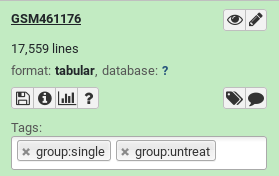
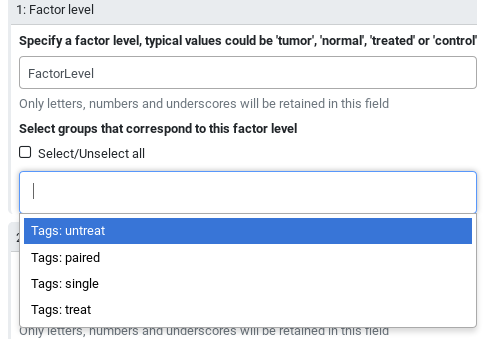

# Introduction


Advanced uses of Galaxy often require the use of dataset collections,
which can contain between one and tens of thousands of datasets.
Grouping datasets in this way has numerous advantages:
  - It is easy to represent a single collection in the History
  - Dataset names ("Element Identifiers") are immutable and preserved
  - Collections can be split and nested in arbitrary ways

While collections can be split in any way, doing so for multi-factor analysis
quickly becomes cumbersome and messy. An alternative is to label collection
elements with special group tags, i.e. tags prefixed by the string `group:`.
Note that group tags currently do not propagate, i.e. they are not inherited
to datasets resulting from analyses. These tags can be displayed in the Tool
form, allowing users to select subsets
of collections.

This tutorial outlines how to set and use group tags with the DESeq2 tool.
For a more detailed description and background for differential expression
testing see the [Reference-based RNA-Seq data analysis]({{ site.baseurl }}/topics/transcriptomics/tutorials/ref-based/tutorial.html).


> <agenda-title></agenda-title>
>
> In this tutorial, we will cover:
>
> 1. TOC
> {:toc}
>
{: .agenda}

# Setting group tags using the apply rules tool

There are several ways to set group tags:
  - Using the Rule Based Uploader
  - Using the "Tag elements from file" tool
  - Using the "Apply Rules" tool
  - Manually adding dataset tags with the prefix `group:`

We will use the first two methods in this tutorial.
The second and third methods work at any step during the analysis.
Note that the function of the "Apply Rules" tool is (nearly) identical
to the Rule Based Uploader. 

## Set group tags during upload

> <hands-on-title>Set group tags during upload</hands-on-title>
>
> 1. Create a new history for this tutorial
>
>    
>
> 2. Open the Galaxy Upload Manager ( on the top-right of the tool panel)
> 3. Click on **Rule-based** on the top
>
>    
>
>    As you can see in this dialog, data can be selected from a history dataset or pasted in directly
>
> 4. Set **Upload data as:** to `Collection(s)`
> 5. Paste the following links into the text box
>
>    ```
>    https://zenodo.org/record/1185122/files/GSM461176_untreat_single.counts
>    https://zenodo.org/record/1185122/files/GSM461177_untreat_paired.counts
>    https://zenodo.org/record/1185122/files/GSM461178_untreat_paired.counts
>    https://zenodo.org/record/1185122/files/GSM461179_treat_single.counts
>    https://zenodo.org/record/1185122/files/GSM461180_treat_paired.counts
>    https://zenodo.org/record/1185122/files/GSM461181_treat_paired.counts
>    https://zenodo.org/record/1185122/files/GSM461182_untreat_single.counts
>    ```
>
> 6. Click **Build**
> 7. We will add a regex that creates 3 new columns with accession, treatment and library type:
>    - Click on the **Column** button and then **Using a Regular Expression**
>    - Select **Create columns matching expression groups**
>    - Paste `.*(GSM.*)_(.*)_(.*).counts` in *"Regular Expression"*
>    - Set *"Number of Groups"* to 3
>    - Click on **Apply**
>
>       We should have now a table with 4 columns: link, sample name, treatment, sequencing type
>
>    - Click on **Rules** and then **Add / Modify Column Definitions**
>    - Click on **Add Definition** and select:
>      - *"URL"*: Column A (Note that this option is absent when using the "Apply rules tool")
>      - *"List Identifiers"*: Column B
>      - *"Group Tags"*: Columns C and D (Select Column C first and then add D by clicking on *"... Add another column"*)
>    - Click **Apply**
>    - Enter a name for the new collection
>    - Click **Upload**
>
> 8. Expand the generated collection and the files in it and check their names and tags
>
>    
{: .hands_on}

## Set group tags using the "Tag elements from file" tool

We now want to add group tags using the "Tag elements from file" tool.

> <hands-on-title>Upload and create a collection</hands-on-title>
>
> 1. Create a new history for this tutorial
> 2. Import the following files
>
>    ```
>    https://zenodo.org/record/1185122/files/GSM461176_untreat_single.counts
>    https://zenodo.org/record/1185122/files/GSM461177_untreat_paired.counts
>    https://zenodo.org/record/1185122/files/GSM461178_untreat_paired.counts
>    https://zenodo.org/record/1185122/files/GSM461179_treat_single.counts
>    https://zenodo.org/record/1185122/files/GSM461180_treat_paired.counts
>    https://zenodo.org/record/1185122/files/GSM461181_treat_paired.counts
>    https://zenodo.org/record/1185122/files/GSM461182_untreat_single.counts
>    ```
>
>    
>
> 3. Click on the  icon (**Operations on multiple datasets**)
> 4. Check all new datasets
> 5. Click on **For all selected...** and then **Build Dataset List**
> 6. Enter a name for the new collection and click **Create list**
{: .hands_on}

We have now a collection with our files. We can now either upload a tabular file containing the element identifiers
and the tags we want to apply, or we can extract the element identifiers and extract the tags using a Regular Expression.
We will do the latter.

> <hands-on-title>Set group tags using the "Tag elements from file" tool</hands-on-title>
> 1. **Extract element identifiers** 
>      -  *"Dataset collection"*: created collection
> 2. **Replace Text in entire line** 
>      -  *"File to process"*: output of **Extract element identifiers** 
>      - In *"Replacement"*:
>         - In *"1: Replacement"*
>            - *"Find pattern"*: `(.*)_(.*)_(.*).counts`
>            - *"Replace with"*: `\1_\2_\3.counts\tgroup:\2\tgroup:\3`
>
>     This step adds an additional columns that can be used with the ``Tag elements from file`` tool
>
> 3. Change the datatype to `tabular`
>
>    
>
> 4. **Tag elements from file** 
>      -  *"Input Collection"*: created collection
>      -  *"Tag collection elements according to this file"*: output of **Replace Text** 
{: .hands_on}

You should now have a properly tagged collection of tabular files that can be used in DESeq2.

# Using group tags in tool, e.g. DESeq2

DESeq2 has two modes for specifying factors. One can either
select datasets corresponding to factors, or use group tags
to specify factors. We will use the group tags present in
our collection to specify factors.

The tool interface will prompt you with the group tags that are available for your inputs:



> <hands-on-title>Running <b>DESeq2</b> with group tags</hands-on-title>
>
> 1. **DESeq2**  with the following parameters:
>    - *"how"*: `Select group tags corresponding to levels`
>       -  *"Count file(s) collection"*: Generated collection
>       - In *"Factor"*:
>          - In "1: Factor"
>              - *"Specify a factor name"*: `Treatment`
>              - In *"Factor level"*:
>                  - In *"1: Factor level"*:
>                      - *"Specify a factor level"*: `treat`
>                      - *"Select groups that correspond to this factor level"*: `Tags: treat`
>                  - In *"2: Factor level"*:
>                      - *"Specify a factor level"*: `untreat`
>                      - *"Select groups that correspond to this factor level"*: `Tags: untreat`
>          - Click on  *"Insert Factor"* (not on "Insert Factor level")
>          - In "2: Factor"
>              - "Specify a factor name" to `Sequencing`
>              - In *"Factor level"*:
>                  - In *"1: Factor level"*:
>                      - *"Specify a factor level"*: `paired`
>                      - *"Select groups that correspond to this factor level"*: `Tags: paired`
>                  - In *"2: Factor level"*:
>                      - *"Specify a factor level"*: `single`
>                      - *"Select groups that correspond to this factor level"*: `Tags: single`
>    - *"Files have header?"*: `No`
>    - *"Output normalized counts table"*: `Yes`
{: .hands_on}

# Conclusion


We can select a subset of Collections using the special group tag.
