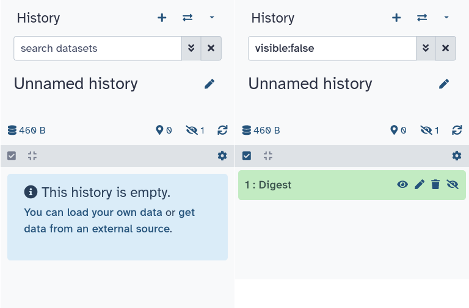
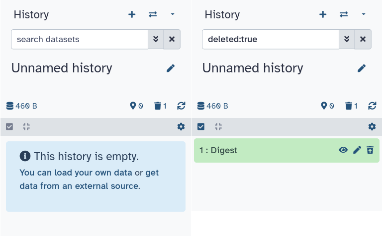
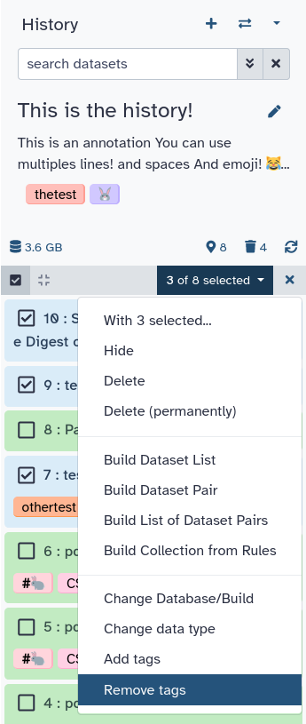



When data is uploaded from your computer or analysis is done on existing data using Galaxy, each output from those steps
generates a dataset. These datasets (and the output datasets from later analysis on them) are stored by Galaxy in
**Histories**.

# The history panel

All users have one 'current' history, which can be thought of as **a workspace** or **a current working directory** in
bioinformatics terms. Your current history is displayed in the right hand side of the main 'Analyze Data' Galaxy page in
what is called the history panel.

The history panel displays output datasets in the order in which they were created, with the oldest/first shown at the
bottom. As new analyses are done and new output datasets are generated, the newest datasets are added to the top of the
the history panel. In this way, the history panel displays the history of your **analysis over time**.

**Users that have registered an account and logged in can have many histories** and the history panel allows switching
between them and creating new ones. This can be useful to organize different analyses.

**Anonymous users** (if your Galaxy allows them) are users that have not registered an account. Anonymous users are
only allowed one history. Users are encouraged to register and log in with the benefit that they can work on many histories and switch between them.

> <warning-title>Anonymous Users: Beware</warning-title>
> The histories of anonymous users are only associated through your browser's session. **If you close the browser or
> clear you sessions - that history will be lost!** We can not recover it for you if it is.
{: .warning}

## Global history controls



###  "**Create new history**"



###  "**Switch to history**"



###  "**History options**" 



# History manipulation

## Renaming a history

All histories begin with the name 'Unnamed history'. Non-anonymous users can rename the history as they see fit:



## Tagging a history



## Annotating a history



## History size, storage selection, and views

The lower part of the history header contains a number of buttons:

> <warning-title>Some buttons are instance-specific</warning-title>
> The list of buttons shown above may vary depending on which Galaxy instance you are using. For example, at the time of writing the **Preferred storage**  button is only available on https://usegalaxy.org.
{: .warning}

-  **History size** - shows history storage overview in the central pane of the interface.
-  **Preferred storage location** - allows users to specify where history datasets will be stored. This button is only available on Galaxy instances with scratch storage such as usegalaxy.org. Scratch storage allows users to much larger storage allocation for a limited amount time.
-  **Show active** - shows active (non-deleted and non-hidden) datasets in the history.
-  **Include deleted** - include deleted datasets into the history view. If you delete a dataset is does not disappear unless you explicitly purge it.
-  **Include hidden** - include hidden datasets into the history view. Any dataset in history can be hidden. For example, workflow executions frequently hide intermediate datasets so that they do now complicate history view. It is a way to hide non-importnat datasets from the view. 

# History datasets

So far we only discussed functions and controls affecting the *entrire* history. Yet history is a collection of datasets. Now it is time to discuss interfacse elements of individual datasets.  

## Datasets can be individual or bundled into collections

A histiry dataset can exist by iteslf, as an independent entity, or as a part of a **collection**. Collections make it possible to analyze datasets with hundreds of thousands of samples.



## United Colors of Galaxy: Dataset states



## Dataset snippet in detail



## Managing Datasets Individually

### Hiding and unhiding datasets



Some procedures in Galaxy such as workflows will often **hide** history datasets in order to simplify the history
and hide intermediate steps of an automated analysis. These hidden datasets won't normally appear in the history panel
but theyre still mentioned in the history subtitle (the smaller, grey text that appears below the history name). If
your history has hidden datasets, the number will appear there (e.g. '3 hidden') as a clickable link. If you click this link,
the hidden datasets are shown. Each hidden dataset has a link in the top of the summary view that allows you to unhide
it. You can click that link again (which will now be 'hide hidden') to make them not shown again.

### Deleting and undeleting datasets

You can **delete** any dataset in your history by clicking the delete button. This does not immediately remove the
dataset's data from Galaxy and **it is reversible**. When you delete a dataset from the history, it will be removed
from the panel but (like hidden datasets) the total number of deleted datasets is shown in the history subtitle as a
link. Clicking this link (e.g. '3 deleted') will make the deleted datasets visible and each deleted dataset will have a
link for manually undeleting it, above its title. You can click that link again (which will now be 'hide deleted') to
make them not shown again.

### Admins may purge your deleted datasets

Depending on the policy of your Galaxy server, administrators will often run scripts that search for and purge the
datasets you've marked as deleted. Often, deleted datasets and histories are purged based on the age of the deletion
(e.g. datasets that have been marked as deleted for 90 days or more). Check with the administrators of your Galaxy instance to
find out the policy used.

### Tagging datasets

There are two types of tags that can be used as an additional level of labeling for datasets: **standard tags** and **hashtags**. The standard tags work similarly to history tags described above - they add another level of description to datasets making them easier to find. **Hashtags** (also known as **name tags** or **propagating tags**) are much more powerful as they **propagate** through the analysis:

For more information on name tags, a [dedicated nametag tutorial is available]().

## Managing Multiple Datasets Easily

### Multi-selection

You can also hide, delete, and purge multiple datasets at once by **multi-selecting datasets**:

1.  Click the multi-select button containing the checkbox just below the history size.
2. Checkboxes will appear inside each dataset in the history.
3. Scroll and click the checkboxes next to the datasets you want to manage.
4. Click the 'n of N selected' to choose the action. The action will be performed on all selected datasets, except for the ones that don't support the action. That is, if an action doesn't apply to a selected dataset - like deleting a deleted dataset - nothing will happen to that dataset, while all other selected datasets will be deleted.
5. You can click the multi-select button again to hide the checkboxes again.

<!-- Including search to deduplicate -->


### Undeleting ... deleted histories

If you have not purged a history and have only deleted it, it is possible to 'undelete' it and reverse or undo the deletion.
Since one of the purposes of deleting histories is to remove them from view, we'll use the interface to specifically
search for deleted histories and then to undelete the one we're interested in.

There is one way to do this currently: via the saved histories page.

1. Go to the "User" menu at the top
2. Select "Histories"
3. Click "Advanced Search" below the search box.
4. Click "Deleted"
5. Click on the title of the history you want to un-delete, and un-delete it.
