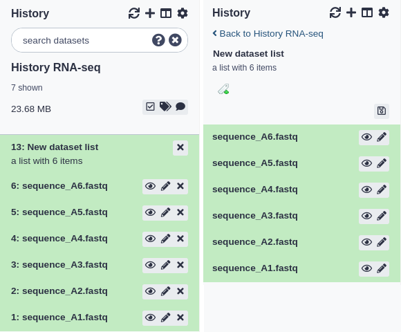

When data is uploaded from your computer or analysis is done on existing data using Galaxy, each output from those steps
generates a dataset. These datasets (and the output datasets from later analysis on them) are stored by Galaxy in
**Histories**.

## The Current History

All users have one 'current' history, which can be thought of as **a workspace** or **a current working directory** in
bioinformatics terms. Your current history is displayed in the right hand side of the main 'Analyze Data' Galaxy page in
what is called the history panel.

The history panel displays output datasets in the order in which they were created, with the oldest/first shown at the
bottom. As new analyses are done and new output datasets are generated, the newest datasets are added to the top of the
the history panel. In this way, the history panel displays the history of your **analysis over time**.

**Users that have registered an account and logged in can have many histories** and the history panel allows switching
between them and creating new ones. This can be useful to organize different analyses.

**Anonymous users** (if your Galaxy allows them) are users that have not registered an account. Anonymous users are
only allowed one history. On our main, public Galaxy server, users are encouraged to register and log in with the
benefit that they can work on many histories and switch between them.

The histories of anonymous users are only associated through your browser's session. **If you close the browser or
clear you sessions - that history will be lost!** We can not recover it for you if it is.
{: .alert .alert-warning}

### Current history controls

Above the current history panel are three buttons: the refresh, history options, and 'view all histories' button.

- The 'refresh' button will entirely reload the history being viewed. This can be helpful if you believe the history interface needs to be updated or isn't updating properly.
- The 'create new history' button will create an empty history.
- The 'view all histories' button sends you to the interface for managing multiple histories.
- The 'history options' button opens the history options menu which allows you to perform history-related tasks.

## History Information

Histories also store information in addition to the datasets they contain. They can be named/re-named, tagged, and
annotated.

### Renaming a history

All histories begin with the name 'Unnamed history'. Non-anonymous users can rename the history as they see fit:

1. Click the existing name. A text input field will appear with the current name.
2. Enter a new name or edit the existing one.
3. Press <kbd>Enter</kbd> to save the new name. The input field will disappear and the new history name will display.
4. To cancel renaming, press <kbd>Esc</kbd> or click outside the input field.

### Tagging a history

Tags are short pieces of text used to describe the thing they're attached to and many things in Galaxy can be tagged.
Each item can have many tags and you can add new tags or remove them at any time. Tags can be another useful way to
organize and search your data. For instance, you might tag a history with the type of analysis you did in it: 'assembly'
or 'variants'. Or you may tag them according to data sources or some other metadata: 'long-term-care-facility' or
'yellowstone park:2014'.

**Note:** It is recommended to replace spaces in tags with _ or -. Although spaces are allowed in tags for histories, they are removed from the tags for datasets.
{: .alert .alert-warning}

To tag a history:

1. Click the tag button at the top of the history panel. An input field showing existing tags (if any) will appear.
2. Begin typing your new tag in the field. Any tags that you've used previously will show below your partial entry -
  allowing you to use this 'autocomplete' data to re-use your previous tags without typing them in full.
3. Press enter or select one of the previous tags with your arrow keys or mouse.
4. To remove an existing tag, click the small 'X' on the tag or use the backspace key while in the input field.

### Annotating a history

Sometimes tags and names are not enough to describe the work done within a history. Galaxy allows you to create history
annotations: longer text entries that allow for more formatting options. The formatting of the text is preserved. Later, if
you publish or share the history, the annotation will be displayed automatically - allowing you to share additional
notes about the analysis.

To annotate a history:

1. Click the annotation button at the top of the history panel. A larger text section will appear displaying any
  existing annotation (or, if there's none, italic text saying you can click on the control to create an annotation).
2. Click the annotation section. A larger input field will appear.
3. Add your annotations. <kbd>Enter</kbd> will move the cursor to the next line. (Tabs cannot be
  entered since the 'Tab' button is used to switch between controls on the page - tabs can be pasted in however).
4. To save the annotation, click the 'Done' button.

### History size

As datasets are added to a history, Galaxy will store them on the server. The total size of these files,
for all the datasets in a history, is displayed underneath the history name. For example, if a history has 200 megabytes
of dataset data on Galaxy's filesystem, '200 MB' will be displayed underneath the history name.

If your Galaxy server uses quotas, the total combined size of all your histories will be compared to your quota. If you're using more than the quota allows, Galaxy will prevent you from running any new jobs until you've deleted some
datasets and brought that total below the quota.

## History Panel Datasets

Datasets in the history panel show the state of the job that has generated or will generate the data.

There are several different 'states' a dataset can be in:

1. When you first upload a file or run a tool, the dataset will be in the **queued** state. This indicates that the
  job that will create this dataset has not yet started and is in line to begin.
1. When the job starts, the dataset will be in the **running** state. The job that created these datasets is now
  running on Galaxy's cluster.
1. When the job has completed successfully, the datasets it generated will be in the **ok** state.
1. If there's been an error while running the tool, the datasets will be in the **error** state.
1. If a previously running or queued job has been paused by Galaxy, the dataset will be in the **paused** state.
  You can re-start/resume paused jobs using the options menu above the history panel and selecting 'Resume Paused Jobs'.

Datasets in the panel are initially shown in a 'summary' view, that only displays:

1. A **number** indicating in what order (or what step) this dataset was created,
2. The dataset **name**.
3. A **view** button: click this to view the dataset contents in raw format in the browser.
4. An **edit** button: click this to edit dataset properties.
5. A **delete** button: click this to delete the dataset from the history (*don't worry*, you can undo this action).

**Note:** some of the buttons above may be disabled if the dataset is in a state that doesn't allow the
action. For example, the 'edit' button is disabled for datasets that are still queued or running.
{: .alert .alert-warning}

 dataset view")

You can click the dataset name and the view will expand to show more details:

1. A short description of the data.
2. The file **format**.
3. The reference sequence (or **database**) for the data.
4. (Optionally) some information/output from the job that produced this dataset.
5. A row of buttons that allow further actions on the dataset.
6. A **peek** of the data: a couple of rows of data with the column headers (if available).

**Note:** many of these details are only displayed if the dataset has finished running, is in the 'ok' state, and
is not deleted. Otherwise, you may only see a shorter message describing the dataset's state (e.g. 'this dataset
is waiting to run')
{: .alert .alert-warning}

## Managing Datasets Individually

### Hiding and unhiding datasets

Some procedures in Galaxy such as workflows will often **hide** history datasets in order to simplify the history
and hide intermediate steps of an automated analysis. These hidden datasets won't normally appear in the history panel
but theyre still mentioned in the history subtitle (the smaller, grey text that appears below the history name). If
your history has hidden datasets, the number will appear there (e.g. '3 hidden') as a clickable link. If you click this link,
the hidden datasets are shown. Each hidden dataset has a link in the top of the summary view that allows you to unhide
it. You can click that link again (which will now be 'hide hidden') to make them not shown again.

### Deleting and undeleting datasets

You can **delete** any dataset in your history by clicking the delete button. This does not immediately remove the
dataset's data from Galaxy and **it is reversible**. When you delete a dataset from the history, it will be removed
from the panel but (like hidden datasets) the total number of deleted datasets is shown in the history subtitle as a
link. Clicking this link (e.g. '3 deleted') will make the deleted datasets visible and each deleted dataset will have a
link for manually undeleting it, above its title. You can click that link again (which will now be 'hide deleted') to
make them not shown again.

### Purging datasets and removing them permanently from Galaxy

If you are showing deleted datasets and *your Galaxy allows users to purge datasets*, you will see an additional link in the top of each deleted dataset titled **'Permanently remove it from disk**'. Clicking this will remove the file that contains that dataset's data and will decrease the disk space used by the history. **This action is not reversible and cannot be undone**.

If your Galaxy doesn't allow users to purge their datasets, you will not see that link.

### Admins may purge your deleted datasets

Depending on the policy of your Galaxy server, administrators will often run scripts that search for and purge the
datasets you've marked as deleted. Often, deleted datasets and histories are purged based on the age of the deletion
(e.g. datasets that have been marked as deleted for 90 days or more). Check with the administrators of your Galaxy instance to
find out the policy used.

### Tagging datasets

There are two types of tags that can be used as an additional level of labeling for datasets: **standard tags** and **hashtags** (also known as **name tags** or **propagating tags**). The standard tags work similarly to history tags described above - they add another level of description to datasets making them easier to find:

**Hashtags** are much more powerful as they are **displayed** in the history panel and **propagate** through the analysis:

For more information on name tags, [a video is available](https://player.vimeo.com/video/216884518) of their usage.

## Managing Multiple Datasets Easily

### Multi-selection

You can also hide, delete, and purge multiple datasets at once by **multi-selecting datasets**:

1. Click the multi-select button containing the checkbox to the right of the history size.
2. Checkboxes will appear inside each dataset in the history.
3. Scroll and click the checkboxes next to the datasets you want to manage. You can also 'shift+click' to select a
  range of datasets.
4. Click the 'All' button to select all datasets. Click the 'None' button to clear/remove all selections.
5. Click the 'For all selected...' to choose the action. The action will be performed on all selected datasets, except for the ones that don't support the action. That is, if an action doesn't apply to a selected dataset - like deleting a deleted dataset - nothing will happen to that dataset, while all other selected datasets will be deleted.
6. You can click the multi-select button again to hide the checkboxes again.

<!-- Including search to deduplicate -->


### Undeleting ... deleted histories

If you have not purged a history and have only deleted it, it is possible to 'undelete' it and reverse or undo the deletion.
Since one of the purposes of deleting histories is to remove them from view, we'll use the interface to specifically
search for deleted histories and then to undelete the one we're interested in.

There are two ways to do this currently: via the multi-history panel and through the saved histories page. The multi-
history method is presented here:

Click the multi-history icon at the top right of the 'Analyze Data' (home) page. Note: you must be logged in to
see the icon and use the multi-history page. You should see all the (non-deleted) histories that you've created.

Click the '...' icon button in the grey header at the top of the page. You should see a dialog that presents some options for viewing the histories. Click the 'include deleted histories' option.

The page should reload and now both non-deleted and deleted histories will be displayed. Deleted histories will
have a small message under their titles stating 'This history has been deleted'.

Now click the small button with the down arrow just above the deleted history you want to undelete. Then click
the 'Undelete' option there. Your history should now be undeleted.

Click the 'Switch to' button at the top of that history and then click 'done' at the very top left to return to
the 'Analyze Data' page.

## Dataset Collections

When you have multiple datasets that will be sent through the same analysis, it can often be useful to place those
datasets in a dataset collection. When collections are used as input when running a tool, you're telling Galaxy to run
that tool on each  dataset in the collection using the same settings. This happens automatically and there's no need to
fill in the tool form more than once.

It may be helpful to metaphorically think of dataset collections as containers (or directories) in which you place
datasets. To create a dataset collection from datasets in a history:

1. Use multiselect to select the datasets you'd like to put into a collection.
2. From the drop down menu labeled 'For all selected...', choose one of the collections types.
3. Depending on the type you chose, some configuration and options may be displayed, and when you've chosen those,
  the collection is created and will show in the current history panel.
4. Note: that your datasets are still shown in the history alongside the new collection. You can hide them if you like
  using the multiselect menu.

### Viewing a dataset collection

You can view what datasets were inside a collection by clicking on the collection title. The history panel will be
replaced by a list of the collection contents and each are expandable as a normal dataset in a history would be. You
can click the '< Back to (you history name)' link at the top to return to the history view (see below for examples).

The current collection types are: dataset pairs, dataset list, and list of dataset pairs - described below.

### Dataset pairs

A common pattern of dataset files are pairs of read files - often some form of fastq files - where one file contains
the forward reads and one file contains the reverse reads. Many bioinformatic tools accept these pairs and Galaxy can
further simplify this by placing both files into on 'Dataset Pair' collection. Only two files will be added to the
collection: forward and reverse.

### Dataset list

Choose 'Dataset List' when you have a set of files that are of the same type and will be run through some similar
analysis. The datasets in a dataset list must have unique names (e.g. you cannot have two datasets in a dataset list
with the name '1.bed').

### List of dataset pairs

Think of this as a collection of collections: multiple dataset pairs contained in a dataset list. The interface used
to create this is currently the most flexible and potentially most complicated. It will attempt to automatically pair
datasets sent to the interface based on the dataset names. You are free to select your own pairs, however, and change
the order of the collection. Click the help text at the top of the interface to see more information.

