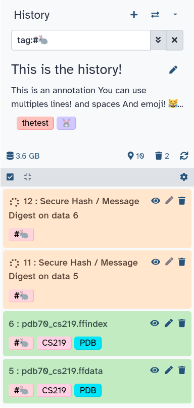



When data is uploaded from your computer or analysis is done on existing data using Galaxy, each output from those steps
generates a dataset. These datasets (and the output datasets from later analysis on them) are stored by Galaxy in
**Histories**.

# The history panel

All users have one 'current' history, which can be thought of as **a workspace** or **a current working directory** in
bioinformatics terms. Your current history is displayed in the right hand side of the main 'Analyze Data' Galaxy page in
what is called the history panel.

The history panel displays output datasets in the order in which they were created, with the oldest/first shown at the
bottom. As new analyses are done and new output datasets are generated, the newest datasets are added to the top of the
the history panel. In this way, the history panel displays the history of your **analysis over time**.

**Users that have registered an account and logged in can have many histories** and the history panel allows switching
between them and creating new ones. This can be useful to organize different analyses.

**Anonymous users** (if your Galaxy allows them) are users that have not registered an account. Anonymous users are
only allowed one history. Users are encouraged to register and log in with the benefit that they can work on many histories and switch between them.

> <warning-title>Anonymous Users: Beware</warning-title>
> The histories of anonymous users are only associated through your browser's session. **If you close the browser or
> clear you sessions - that history will be lost!** We can not recover it for you if it is.
{: .warning}

## Global history controls



###  "**Create new history**"



###  "**Switch to history**"



###  "**History options**" 



# History manipulation

## Renaming a history

All histories begin with the name 'Unnamed history'. Non-anonymous users can rename the history as they see fit:



## Tagging a history

Tags are short pieces of text used to describe the thing they're attached to and many things in Galaxy can be tagged.
Each item can have many tags and you can add new tags or remove them at any time. Tags can be another useful way to
organize and search your data. For instance, you might tag a history with the type of analysis you did in it: `assembly`
or `variants`. Or you may tag them according to data sources or some other metadata: `long-term-care-facility` or
`yellowstone park:2014`.

> <comment-title>Best Practices for Tagging</comment-title>
> It is strongly recommended to replace spaces in tags with `_` or `-`, as spaces will automatically be removed when the tag is saved.
{: .comment}

To tag a history:

1. Click the tag button at the top of the history panel. An input field showing existing tags (if any) will appear.
2. Begin typing your new tag in the field. Any tags that you've used previously will show below your partial entry -
  allowing you to use this 'autocomplete' data to re-use your previous tags without typing them in full.
3. Press enter or select one of the previous tags with your arrow keys or mouse.
4. To remove an existing tag, click the small 'X' on the tag or use the backspace key while in the input field.

## Annotating a history

Sometimes tags and names are not enough to describe the work done within a history. Galaxy allows you to create history
annotations: longer text entries that allow for more formatting options. The formatting of the text is preserved. Later, if
you publish or share the history, the annotation will be displayed automatically - allowing you to share additional
notes about the analysis.

To annotate a history:

1. Click the annotation button at the top of the history panel. A larger text section will appear displaying any
  existing annotation (or, if there's none, italic text saying you can click on the control to create an annotation).
2. Click the annotation section. A larger input field will appear.
3. Add your annotations. <kbd>Enter</kbd> will move the cursor to the next line. (Tabs cannot be
  entered since the 'Tab' button is used to switch between controls on the page - tabs can be pasted in however).
4. To save the annotation, click the 'Done' button.

## Checking history size

As datasets are added to a history, Galaxy will store them on the server. The total size of these files,
for all the datasets in a history, is displayed underneath the history name. For example, if a history has 200 megabytes
of dataset data on Galaxy's filesystem, ' 200 MB' will be displayed underneath the history name.

If your Galaxy server uses quotas, the total combined size of all your histories will be compared to your quota. If you're using more than the quota allows, Galaxy will prevent you from running any new jobs until you've deleted some
datasets and brought that total below the quota.

# History datasets

History is a collection of datasets. Datasets can either be uploaded or generated by analysis tools. 

## United Colors of Galaxy: Dataset states

There are several different "states" a dataset can be in. These states are shown in Fig. 7.

 <b>Ok</b>: Dataset is uploaded successfully, or the job that created this dataset finished successfully; (2) <b>Error</b>: The dataset is in error. It may be an error the occurred during the upload of the dataset or an error within the job that created this dataset; (3) <b>Running</b>: The dataset is being uploaded or the job creating this dataset is still executing; (4) <b>Paused</b>: The execution of a job generating this dataset is paused. This typically occurs when the upstream jobs (jobs generating datsets on which this particular job depends) are in error. You can re-start/resume paused jobs using the options menu above the history panel and selecting 'Resume Paused Jobs'; (5) <b>Queued</b>: Upload or job generating this dataset are waiting thier turn to be executed. Galaxy is a public service with hundreds or thousands of simultaneous jobs running at any given moment. As a result some jobs do not start immediately but wait their turn in the cluster queue.")

ob has completed successfully, the datasets it generated will be in this state")

Datasets in the panel are initially shown in a 'summary' view, that only displays:

1. A **number** indicating in what order (or what step) this dataset was created,
2. The dataset **name**.
3.  **view** button: click this to view the dataset contents in raw format in the browser.
4.   **edit** button: click this to edit dataset properties.
5.  **delete** button: click this to delete the dataset from the history (*don't worry*, you can undo this action).

 dataset view. From left to right: view, edit, delete.")

> <tip-title>Disabled buttons?</tip-title>
> some of the buttons above may be disabled if the dataset is in a state that doesn't allow the
> action. For example, the 'edit' button is disabled for datasets that are still queued or running
{: .tip}

You can click the dataset name and the view will expand to show more details:

1. A short description of the data.
2. The file **format** (Bed in this case) and the reference sequence (or **database**) for the data (`?` here)
4. (Optionally) some information/output from the job that produced this dataset.
5. A row of buttons that allow further actions on the dataset.
6. A **peek** of the data: a couple of rows of data with the column headers (if available).

> <tip-title>Where are the details?</tip-title>
> Many of these details are only displayed if the dataset has finished running, is in the 'ok' state, and
> is not deleted. Otherwise, you may only see a shorter message describing the dataset's state (e.g. 'this dataset
> is waiting to run')
{: .tip}

## Managing Datasets Individually

### Hiding and unhiding datasets

Some procedures in Galaxy such as workflows will often **hide** history datasets in order to simplify the history
and hide intermediate steps of an automated analysis. These hidden datasets won't normally appear in the history panel
but theyre still mentioned in the history subtitle (the smaller, grey text that appears below the history name). If
your history has hidden datasets, the number will appear there (e.g. '3 hidden') as a clickable link. If you click this link,
the hidden datasets are shown. Each hidden dataset has a link in the top of the summary view that allows you to unhide
it. You can click that link again (which will now be 'hide hidden') to make them not shown again.

### Deleting and undeleting datasets

You can **delete** any dataset in your history by clicking the delete button. This does not immediately remove the
dataset's data from Galaxy and **it is reversible**. When you delete a dataset from the history, it will be removed
from the panel but (like hidden datasets) the total number of deleted datasets is shown in the history subtitle as a
link. Clicking this link (e.g. '3 deleted') will make the deleted datasets visible and each deleted dataset will have a
link for manually undeleting it, above its title. You can click that link again (which will now be 'hide deleted') to
make them not shown again.

### Admins may purge your deleted datasets

Depending on the policy of your Galaxy server, administrators will often run scripts that search for and purge the
datasets you've marked as deleted. Often, deleted datasets and histories are purged based on the age of the deletion
(e.g. datasets that have been marked as deleted for 90 days or more). Check with the administrators of your Galaxy instance to
find out the policy used.

### Tagging datasets

There are two types of tags that can be used as an additional level of labeling for datasets: **standard tags** and **hashtags**. The standard tags work similarly to history tags described above - they add another level of description to datasets making them easier to find. **Hashtags** (also known as **name tags** or **propagating tags**) are much more powerful as they **propagate** through the analysis:

For more information on name tags, a [dedicated nametag tutorial is available]().

## Managing Multiple Datasets Easily

### Multi-selection

You can also hide, delete, and purge multiple datasets at once by **multi-selecting datasets**:

1.  Click the multi-select button containing the checkbox just below the history size.
2. Checkboxes will appear inside each dataset in the history.
3. Scroll and click the checkboxes next to the datasets you want to manage.
4. Click the 'n of N selected' to choose the action. The action will be performed on all selected datasets, except for the ones that don't support the action. That is, if an action doesn't apply to a selected dataset - like deleting a deleted dataset - nothing will happen to that dataset, while all other selected datasets will be deleted.
5. You can click the multi-select button again to hide the checkboxes again.

<!-- Including search to deduplicate -->


### Undeleting ... deleted histories

If you have not purged a history and have only deleted it, it is possible to 'undelete' it and reverse or undo the deletion.
Since one of the purposes of deleting histories is to remove them from view, we'll use the interface to specifically
search for deleted histories and then to undelete the one we're interested in.

There is one way to do this currently: via the saved histories page.

1. Go to the "User" menu at the top
2. Select "Histories"
3. Click "Advanced Search" below the search box.
4. Click "Deleted"
5. Click on the title of the history you want to un-delete, and un-delete it.
