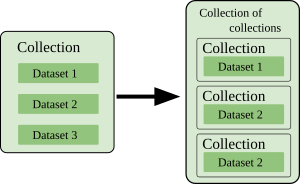

Galaxy tools process dataset(s). Here two cases need to be distiguished: 

1. The tool takes a single dataset
2. The tool processes a set of datasets

For the 2nd case we need to distinguish:

- Multiple datasets can be selected or a collection can be specified.
- Datasets must be given as a collection

Lets ignore the later case for now.

TODO Box: show batch processing remark in the tool form / screenshots of the tool forms
TODO examples of such tools and show how collections / multiple datasets can be selected

The interesting point here is that for both types of tools the user can
provide multiple datasets as input by selecting them one by one or by providing
a collection and Galaxy will treat the inputs appropriately: 

1. For a tool of type 1 Galaxy will create separete jobs, i.e. one for each dataset
   (in the collection). That is Galaxy will batch process the datasets. Sometimes
   the terminology map-over is used to describe this, i.e. Galaxy maps the tool
   over each of the datsets.
2. Galaxy creates a single job that jointly processes the datasets in a single job.

While it is possible to create a tool where the user can choose the processing mode,
this seldomly done and only the joint processing mode is provided. Reasons for this may be 
the main application is joint processing, the internal tool logic becomes more complex
and difficult to mange, and most importantly Galaxy has a mechanism that still allows
for batch processing with tools that jointly process datasets. 

Before this mechanism is explained we need to come back to the case of tools accepting
collections. There are three types of collections:

1. collection (sometimes called list)
2. paired collection (or just pair)
3. pair/dataset (sometimes called paired_or_unpaired) (available since Galaxy release 25.0) 

Here a paired collection is a collection of length two. A collection or paired collection
can consist of datasets and/or collections of any kind. This nesting can be done arbitrarily
often in theory. In practice more than 2-3 levels of nesting are seldom.
Since the main application of paired collections is to organize a set of two datasets (paired reads)
these mainly contain two datasets, i.e. paired collections containing collections are seldomly used.

Hence we maily have to consider

- collections of datasets,
- collections of pairs,
- collections of collections,
- collections of paired or unpaired datasets

A tool that consumes collections can consume only one specific type of collections.

TODO example of a tool processing a collection https://usegalaxy.org/?tool_id=toolshed.g2.bx.psu.edu%2Frepos%2Fnml%2Fspades%2Fspades%2F4.2.0%2Bgalaxy0&version=latest
TODO example of a tool processing a pair

Lets assume we have a tool that can consume a paired collection. Galaxy will allow the user
to provide a single paired collection or a collection of pairs. In the former case the pair
will be processed and in the later case Galaxy will map the tool over each pair in the collection, 
i.e. create a separate job for each of the pairs.

TODO the following could be a highlight box?

In general if a tool consumes X (where X is a dataset, or any collection type) then the
user can provide a single item X (which is processed) or a collection of X (where Galaxy maps
over the collection elements).

Now the the original problem can be considered: There is a tool that accepts a collection 
of datasets and it is desired that Galaxy maps the tool over the elements of the collection.
The trick is that the collection needs to be reorganized into a collection of collections,
where each of the inner collections conains one of the datasets

This can be achieved with the `Apply rules` tool. 

> <hands-on-title>Restucture collection to collection of collections</hands-on-title>
>
> Run  with the following parameters:
>    - *"Input Collection"*: Choose your input collection
>    - Click the Edit button
>      - You should see: 
>        - On the left under `Rules` there should be one listed: `Add column for identifier0`
>        - On the rigth: a table with a single column (A)
>    - Click `Column` -> `Basename of Path or URL` -> Choose column `A`
>      - This will add a column to the table (it duplicates the column) and the list of rules on the left should now contain two entries
>    - Click `Rules` -> `Add / Modify Column Definition` -> Add Definition  -> List Identifiers A
>    - In the next screen click `Assign another column` -> List Identifiers B
>    - Click `Apply`
>      - Now there should be 3 rules listed on the left, where the last is `Set columns A and B as List Identifier(s)`
>    - Click `Save`
>    - Click **Run Tool** button
>
{: .hands_on}

TODO: Batch processing Tools with multiple data input parameters 

<!-- GTN:IGNORE:002 -->
