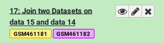

# Introduction


Long ad hoc data analysis sessions in Galaxy can leave you with a multitude of
datasets named things like "1724: Summarize taxa on data 1628 and data 1629" or "1853: Pick
OTUs Combined: OTUs". While these names are useful in smaller analysis sessions
with fewer datasets, as the size of your history grows, so does the amount of
time it takes to figure out where your datasets came from.

You have two options to deal with this:

- Re-name datasets constantly with more useful titles
- Use name tags once, on the inputs to your analysis

Name tags "propagate", they will follow your datasets throughout their analysis.
To more clearly see this, look at the simple workflow below. If the input datasets are tagged `TB8_R1` and `TB8_R2`, these tags will propagate to the outputs of any tools run on these datasets. If a tool has multiple inputs with tags, the outputs will have all of the tags like in the bowtie2 tool.


It can turn your histories from a complicated mess into an easier to follow analysis, as each step is clearly labelled with the original input sample corresponding to each analysis:

Bad | Good
--- | ---
| 
How would you identify which input sample corresponds with which featureCounts output? | With name tags applied before the start of analysis, each output is also tagged with the appropriate sample name

> <agenda-title></agenda-title>
>
> In this tutorial, we will cover:
>
> 1. TOC
> {:toc}
>
{: .agenda}

# Setting name tags manually

> <hands-on-title>Set name tags manually</hands-on-title>
>
> 1. Create a new history
>
>    
>
> 2. Using the **Upload**  tool select **Paste/Fetch data** and paste some data like "Hello, World"
>
> 3. When this is uploaded, click on the title of the dataset in your history panel to expand it
>
> 4. Add some name tags (hashtags) to your dataset:
>
>    - `#female`
>    - `#male`
>    - `#dmel6`
>    - `#ecoli`
>
>    
>
{: .hands_on}

These are example tags, but it is recommended that you use name tags to reflect the identity of the input sample, in some way that's important to you. If you're doing an analysis comparing wildtype and treated samples, you might tag things based on the condition. If you're processing NGS data you might want to tag based on the read set where each sample originated.

If you're using a Galaxy server newer than 19.01, you will notice that the tags each have different colours:


> <details-title>In depth: Colours</details-title>
>
> The colours are generated from a checksum of the text of each tag. Every time the same tag is used, the same colour will be generated. Different words will usually result in different colours.
>
> This allows tags with very similar lengths and word shapes (e.g. `peaks` and `genes`) which can be mistake at small font size if you aren't careful.
> While current evidence () doesn't support the "word shape" model of word recognition, it has still been seen to be beneficial to provide more contrast between words when mistakes can be costly (). In the context of Galaxy, mistakes are usually not incredibly costly, but can be annoying. This gives an easy additional signal on which you can mentally filter your datasets.
>
> You can read some of the discussion that went into implementing the tags [in the pull request to Galaxy](https://github.com/galaxyproject/galaxy/pull/7072).
{: .details}

# Setting name tags with the Rule Builder

In this section we will demonstrate how you can add name tags to datasets automatically using the rule-based uploader. This is especially useful when you have a large number of datasets you want to tag all at once.

For more information about the rule-based uploader, please see [this dedicated tutorial]()

> <hands-on-title>Set name tags during upload</hands-on-title>
>
> 1. Open the **Upload**  interface
> 2. Click on **Rule-based** at the top
>
>    
>
>    As you can see in this dialog, data can be selected from a history dataset or pasted in directly
>
> 4. Set **Upload data as:** to `Datasets`
> 5. Paste the following links into the text box
>
>    ```
>    https://zenodo.org/record/1185122/files/GSM461176_untreat_single.counts
>    https://zenodo.org/record/1185122/files/GSM461177_untreat_paired.counts
>    https://zenodo.org/record/1185122/files/GSM461178_untreat_paired.counts
>    https://zenodo.org/record/1185122/files/GSM461179_treat_single.counts
>    https://zenodo.org/record/1185122/files/GSM461180_treat_paired.counts
>    https://zenodo.org/record/1185122/files/GSM461181_treat_paired.counts
>    https://zenodo.org/record/1185122/files/GSM461182_untreat_single.counts
>    ```
>
> 6. Click **Build**
>
> 7. We will add a regex that creates 3 new columns with accession, treatment and library type:
>    - Click on the **Columnn** button and then **Using a Regular Expression**
>    - Select **Create columns matching expression groups**
>
>        - Paste `.*(GSM.*)_(.*)_(.*).counts` in *"Regular Expression"*
>        - Set *"Number of Groups"* to 3
>        - Click on **Apply**
>
>      We should have now a table with 4 columns: link, sample name, treatment, sequencing type
>
>    - Click on **Rules** and then **Add / Modify Column Definitions**
>        - Click on **Add Definition** and select:
>          - *"URL"*: Column A
>          - *"Name"*: Column B
>          - *"Name Tag"*: Column B
>          - *"General Purpose Tags(s)"*: Columns C and D
>    - Click **Apply**
>    - Click **Upload**
{: .hands_on}

This will add 7 new datasets to your history, each one tagged and named appropriately.


The datasets now have two types of tags: name tags and general purpose tags. General purpose tags, unlike name tags, will not propagate. They're mainly useful for searching through your datasets (Try entering `tag=paired` in your History search box).

> <question-title></question-title>
>
> 1. How many tags does the dataset named `GSM461177` have? Which ones?
> 2. How many of those tags are propagating name tags?
>
> > <solution-title></solution-title>
> >
> > 1. 3 tags. You can find all tags of a dataset by first clicking on it to expand it, and then clicking on the tags icon . The tags are `#GSM461177`, `paired`, and `untreat`
> > 2. 1 propagating name tag. Only hashtags (tags starting with a `#` symbol) will propagate to downstream results derived from it. So in this example only `#GSM461177` is a propagating name tag.
> >
> {: .solution}
{: .question}


# Name tags in Action

Now that we have our name tags in place, let's see them in action!

> <hands-on-title>Some analysis steps</hands-on-title>
> 1. **Select first**  lines from a dataset (head)
>      -  *"File to select"*: Select everything starting with `GSM`
> 2. Click **Execute**
{: .hands_on}

We can already see the benefits of name tags. Even though our outputs are named things like "Select first on data 8", they're also visibly tagged with the name of the original input.


Next we'll join two of these datasets together, to see the tagging behaviour on summaries of multiple datasets. In any box which allows selecting single files, you can also search on name tags.


> <hands-on-title>Multiple inputs</hands-on-title>
> 1. **Join two datasets**  side by side on a specified field
>      -  *"Join"*: Click the select box and type "461181" to filter the list and use the "Select first on data ..." file
>      -  *"With"*: Click the select box and type "461182" to filter the list and use the "Select first on data ..." file
> 2. Click **Execute**
{: .hands_on}

The output will include all of the name tags from all of the inputs:



If you compare the tags of the last output joining the two tables, and the original inputs, you will notice that the "General Purpose" tags were lost along the way. Only name tags are propagated with each analysis step.
