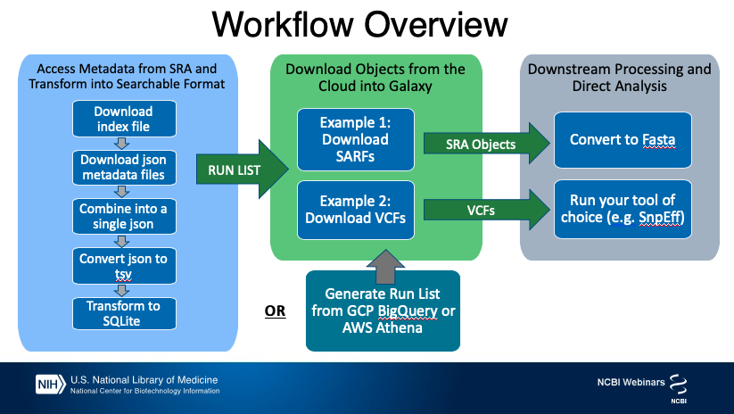

# Background

Traditionally, after a list of run accessions has been filtered on the NCBI website, the accessions are used to download and extract fastq using the SRA toolkit to enter into the next steps of the workflow. A newer compressed data type, generated from raw submitted data containing SARS-CoV-2 sequence, is also accessible to Galaxy users from SRA in the Cloud.

SRA Aligned Read Format (SARF) provides further output options beyond basic fastq format, for example:

1. contigs created from the raw reads in the run
2. reads aligned back to the contigs
3. reads with placeholder quality scores
4. VCF files can also be downloaded for these records relative to the SARS-CoV-2 RefSeq record

- These formats can speed up workflows such as assembly and variant calling.
- This data format is still referenced by the Run accession and accessed using the SRA toolkit.
- This workshop describes the SARF data objects along with associated searchable metadata, and demonstrates a few ways to enter them into traditional workflows.


> ### Agenda
>
> In this tutorial, we will cover:
>
> 1. TOC
> {:toc}
>
{: .agenda}

# Introduction

The aim of this tutorial is to introduce you to some of SRA's new SARS-CoV-2 cloud resources and data formats, then show you how to filter for Runs of interest to you and access that data in your format of choice in Galaxy to use in your analysis pipeline.

## SRA Aligned Read Format

All data submitted to SRA is scanned with our SARS-CoV-2 Detection Tool which uses a Kmer-based approach to identify Runs with Coronaviridae content. The initial scope of the project is limited to those runs deposited in SRA with at least 100 hits for SARS-CoV-2 via the SARS-CoV-2 Detection Tool, a read length of at least 75, and generated using the Illumina platform.

1. For these Runs, Saute was used to assemble contigs via guided assembly, with the SARS-CoV-2 refseq genomic sequence (NC_045512.2) used as the guide.

2. If contigs were successfully assembled, reads were mapped back to the contigs and coverage calculated. These contigs with the reads mapped back and with quality scores removed (to keep the object size small) are the aligned read format files.

3. The SRA toolkit can be used to dump just the contigs in fasta format, the reads aligned to the contigs in sam format or the raw reads in fastq format with placeholder quality scores.

4. The contigs were also assessed via megablast against the nucleotide blast database and the results made available for search.

5. In addition, to support investigation of viral evolution during the pandemic and after the introduction of vaccines, variants are identified relative to the SARS-CoV-2 RefSeq record for each processed run using BCFTools.

The SRA aligned reads, the VCF files, the results of these analyses (such as BLAST and VIGOR3 annotation), and the associated BioSample and sequencing library metadata are available for free access from cloud providers.


> ###  Comment
>
> These data can be dumped in `sam` format using the `sam-dump` tool in the SRA Toolkit, but this function doesn't work within Galaxy yet.
> We hope to include that functionality in a future update.
>
{: .comment}

# Workflow Diagram




# Finding SRA SARS-CoV-2 Runs of Interest

Metadata for SARS-CoV-2 submissions to the SRA includes submitted sample and library information, BLAST results, descriptive contig statistics, and variation and annotation information.  These metadata are updated daily and made available to query in the cloud using [Google's BigQuery](https://www.ncbi.nlm.nih.gov/sra/docs/sra-bigquery/) or [Amazon's Athena](https://www.ncbi.nlm.nih.gov/sra/docs/sra-athena/) services. However, the raw underlying information is also provided as a group of json files that can be **downloaded for free from the Open Data Platform** without logging in to the cloud. These json files can be imported to Galaxy and queried there to find **Runs of interest**.

> ###  Comment
>
> Some of these tables include complex data fields (array of values) that don't have a clean analogue in a classic SQL database or table and these can't be easily queried in Galaxy currently. If you require access to [cloud tables](https://www.ncbi.nlm.nih.gov/sra/docs/aligned-metadata-tables/) or fields not available in Galaxy we recommend accessing those natively in [BigQuery](https://www.ncbi.nlm.nih.gov/sra/docs/sra-bigquery/) or [Athena](https://www.ncbi.nlm.nih.gov/sra/docs/sra-athena/).
>
{: .comment}


We will import the JSON files into Galaxy to query them directory, however the files are split up for efficient querying in the cloud and updated daily, so we first need to get the most up-to-date list of files so we can import those to Galaxy. We'll just be using a couple of tables in this training, but the other tables can be imported in the same way, using the index files below.


> ###  Comment
>
> These metadata files are updated daily around 5:30pm EST. If you try to access the data around this time but encounter an error, trying again a short while later should resolve the issue. [Time Zone Converter](https://www.thetimezoneconverter.com)
>
{: .comment}


> ###  Loading SRA Aligned Read Format (SARF) Object Metadata URLs into Galaxy
>
>This step needs to be repeated at the beginning of an analysis to refresh the metadata to the latest daily version.
>
> 1. Go to your Galaxy instance of choice such as one of the [usegalaxy.org](https://usegalaxy.org/), [usegalaxy.eu](https://usegalaxy.eu), [usegalaxy.org.au](https://usegalaxy.org.au) or any other.
>
> 2. Create a new history
>
>    
>
> 3. Rename your history, *e.g.* "NCBI SARF"
>
>    
>
> 4. **Click** the upload icon toward the top left corner.
>
>    By default the familiar simple upload dialog should appear. This dialog has more advanced options as different tabs across the top of this dialog though.
>
> 5. **Click** `Rule-based` as shown below.
>
>    
>
>    1. Copy/**paste** the URLs into the provided box:
>
>       ```
>       https://storage.googleapis.com/nih-sequence-read-archive/SARS_COV_2/contigs.filelist
>       https://storage.googleapis.com/nih-sequence-read-archive/SARS_COV_2/annotated_variations.filelist
>       https://storage.googleapis.com/nih-sequence-read-archive/SARS_COV_2/blastn.filelist
>       https://storage.googleapis.com/nih-sequence-read-archive/SARS_COV_2/metadata.filelist
>       https://storage.googleapis.com/nih-sequence-read-archive/SARS_COV_2/peptides.filelist
>       https://storage.googleapis.com/nih-sequence-read-archive/SARS_COV_2/tax_analysis.filelist
>       https://storage.googleapis.com/nih-sequence-read-archive/SARS_COV_2/variations.filelist
>       ```
>
>    2. Click **Build**
>
>    3. From **Column** menu select `Basename of Path of URL`
>       - *"From Column?"*: `A`
>
>    4. From **Rules** menu select `Add / Modify Column Definitions`
>        - Click `Add Definition` button and select `URL`
>          - *"URL"*: `A`
>        - Click `Add Definition` button and select `Name` (not name tag!)
>          - *"Name"*: `B`
>
>    5. **Click** `Apply`. You should see a table with two columns, the left being the URL column, and the right being the Name column with just the filename.
>
>       You are now ready to start the upload.
>
>    6. **Click** the `Upload` button
>
{: .hands_on}

With that you should have 7 different files in your history. If you examine the files you'll see that they each have a list of filenames like the following table, with either today or yesterday's date in the filename, depending on your timezone offset from NCBI's offices. [Time zone converter](

```
2021-05-27.000000000000.json.gz
2021-05-27.000000000001.json.gz
2021-05-27.000000000002.json.gz
2021-05-27.000000000003.json.gz
2021-05-27.000000000004.json.gz
2021-05-27.000000000005.json.gz
2021-05-27.000000000006.json.gz
2021-05-27.000000000007.json.gz
```

> ###  Loading SRA Aligned Read Format (SARF) Contig Metadata into Galaxy
>
> Next we will convert this list of filenames to the HTTP URLs for easy import into Galaxy.
>
> 1. **Open** the `Rule-based` upload tab again, but this time:
>    1. *"Upload data as"*: `Collection(s)`
>    2. *"Load tabular data from"*: `History Dataset`
>    3. *"Select dataset to load"*: `contigs.filelist`
>
>    4. **Click** `Build` to bring up the rule builder.
>
>    5. Make the following changes in the Rule Builder
>
>       - From **Column** menu select `Fixed Value`
>           - *"Value"*: `https://storage.googleapis.com/nih-sequence-read-archive/SARS_COV_2/contigs/`
>           - Apply
>       - From **Column** menu select `Concatenate Columns`
>           - *"From Column"*: `B`
>           - *"From Column"*: `A`
>           - Apply
>       - From **Rules** menu, select `Add / Modify Column Definitions`
>           - `Add Definition`, `URL`, Select Column `C`
>           - `Add Definition`, `List Identifier(s)`, Column `A`
>           - Apply
>
>    6. Name the collection `contigs.json`
>
>    7. Click the `Upload` button.
>
>    **Once those download jobs have all turned green in the history list, we'll concatenate these into a single file.**
>
> 2.  tail to head (cat) files with the following parameters:
>
>    -  *"Datasets to Concatenate"*: `contigs.json` collection
>    - Click Execute
>
> 3. Rename this history item to `contigs.single.json`
>
>    
>
> 4.  process JSON files with the following parameters:
>
>    -  *"JSON Input"*: `contigs.single.json`
>    - *"jq filter"*: `[.[]]`
>    - *"Convert output to tabular"*: `yes`
>    - Click Execute
>
> 5. Rename this file `contigs.tsv`
>
>    
>
{: .hands_on}

> ###  Comment
>
> The conversion of the json files to tabular format takes some time, this is a good time to go make some tea.
>
{: .comment}

# Query SARF Metadata

Now that a table has been generated, we will query the table to find the runs of interest.  It is a good idea to save the table for future queries on the same dataset.  Rerunning the import steps above without filtration will provide a different set of metadata each day.

> ###  Query the SRA Metadata Table using SQLite
>
> Next we'll query this metadata using the `Query tabular` tool to get a list of all Runs containing contigs of greater than 20,000 nucleotides and average coverage of at least 100X.
>
> 1. Run  with the following parameters:
>
>    > ###  Can't find it?
>    > If you're not using the [GTN-in-Galaxy view](https://docs.galaxyproject.org/en/latest/admin/special_topics/gtn.html), you can search for 'sql' to find it.
>    {: .tip}
>
>    - In *"Database Table"*:
>      -  *"Insert Database Table"*
>        -  *"Tabular Dataset for Table"*: `contigs.tsv`
>        - In *"Table Options"*
>          - In *"Table Options"*
>             - *"specify name for table"*: `SARS_contigs`
>             - *"Specify Column Names"*: `name,run,coverage,tax_id,hits,length,md5`
>    - *"SQL Query to generate tabular output"*:
>
>       ```sql
>       SELECT DISTINCT run
>       FROM SARS_contigs
>       WHERE length > 20000 AND coverage > 100 AND run like '%SRR%'
>       ORDER BY run ASC
>       LIMIT 10
>       ```
>    - *"include query result column headers"*: `no`
>
>    > ###  Save SQlite Database for future queries
>    >
>    > If you plan to do multiple queries on the same SQL database or want to skip preprocessing the metadata for future work, it may be useful to set
>    >
>    >  -  *"Save the sqlite database in your history"* to `Yes`
>    >
>    {: .tip}
>
> 2. Click **Execute** and rename the output file to `Run_list`
>
>    
>
>    > ###  Need fastq?
>    > Use `Run_list` to bring in Fastq files with Submitted Quality Scores (+BQS format)
>    {: .tip}
>
>    > ###  Column Headers for the Other Metadata Tables
>    > We are not going to bring in the other metadata tables in this tutorial. Here is a list of column headers for contigs and the other tables.
>    > You can find full definitions for these columns here:
>    >
>    > [https://www.ncbi.nlm.nih.gov/sra/docs/sra-cloud-based-examples/](https://www.ncbi.nlm.nih.gov/sra/docs/sra-cloud-based-examples/)
>    >
>    > [https://www.ncbi.nlm.nih.gov/sra/docs/aligned-metadata-tables/](https://www.ncbi.nlm.nih.gov/sra/docs/aligned-metadata-tables/)
>    >
>    > **contigs**
>    > ```
>    > name,run,coverage,tax_id,hits,length,md5
>    > ```
>    > **annotated_variations**
>    > ```
>    > run,chrom,pos,id,ref,alt,qual,filter,info,format,sample_a,ac,an,bqb,dp,dp4,dp4_1,dp4_2,dp4_3,dp4_4,idv,imf,mq,mq0f,mqb,mqsb,rpb,sgb,vdb,g_gt,g_pl,g_pl_1,g_pl_2,g_dp,g_ad,g_ad_1,g_ad_2,protein_position,ref_codon,alt_codon,ref_aa,alt_aa,protein_name,protein_length,variation
>    > ```
>    > **blastn**
>    > ```
>    > acc,qacc,staxid,sacc,slen,length,bitscore,score,pident,sskingdom,evalue,ssciname
>    > ```
>    > **metadata**
>    > ```
>    > acc,assay_type,center_name,consent,experiment,sample_name,instrument,librarylayout,libraryselection,librarysource,platform,sample_acc,biosample,organism,sra_study,releasedate,bioproject,mbytes,loaddate,avgspotlen,mbases,insertsize,library_name,biosamplemodel_sam,collection_date_sam,geo_loc_name_country_calc,geo_loc_name_country_continent_calc,ena_first_public_run,ena_last_update_run,sample_name_sam,datastore_filetype,datastore_provider,datastore_region,attributes,jattr
>    > ```
>    > **peptides**
>    > ```
>    > name,contig,mat_peptide,run,location,gene,product,ref_db,ref_id,sequence
>    > ```
>    > **tax_analysis**
>    > ```
>    > run,contig,tax_id,rank,name,total_count,self_count,ilevel,ileft,iright
>    > ```
>    > **variations**
>    > ```
>    > run,chrom,pos,id,ref,alt,qual,filter,info
>    > ```
>    >
>    >
>    {: .tip}
>
{: .hands_on}

> ###  Download Fastq with Quality Scores
>
> If you would like to dump the raw, underlying data in fastq format with the original quality scores, you can stop here and use the  tool with the following parameters:
>
> - *"input type"*: `list of SRA accessions, one per line`
> -  *"sra accession list"*: `Run_list`
>
{: .tip}

> ###  Importing a list of SRR from Athena or BigQuery
>
> If you opted to conduct your metadata search in the cloud using AWS Athena or GCP BigQuery instead of importing the json file to Galaxy, you can save a list of your Run accessions from that search result and import that file as the `Run_list` to proceed with the rest of this tutorial.
{: .tip}

# Importing SARFs of Interest

Now that we have assembled a list of Runs that have contigs we are interested in, we'll construct the path to the **SARFS** in the cloud and import those to Galaxy so we can work with them.

> ###  Importing SARFs of Interest
>
> 1. Upload Data
>
>    1. **Open** the `Rule-based` upload tab again, but this time:
>       - *"Upload data as"*: `Collection(s)`
>       - *"Load tabular data from"*: `History Dataset`
>       - *"Select dataset to load"*: `Run_list`
>
>    2. **Click** `Build` to bring up the rule builder.
>
>    3. Make the following changes in the Rule Builder
>
>       - From **Column** menu select `Using a Regular Expression`
>           - Check *"Create column from expression replacement"*
>           - *"Regular Expression"*: `(.*)`
>           - *"Replacement Expression"*: `https://sra-pub-sars-cov2.s3.amazonaws.com/RAO/\1/\1.realign`
>           - Apply
>       - From **Rules** menu select `Add / Modify Column Definitions`
>          - Click `Add Definition` button and select `URL`
>            - *"URL"*: `B`
>          - Click `Add Definition` button and select `List Identifier`
>            - *"List Identifier"*: `A`
>            - Apply
>
>    4. Name the output collection `sarf_path` before clicking **Upload**
>
>       > ###  Comment
>       >
>       > Please note that there can be some lag in availability of SARF/VCF files in the cloud (particularly for newly submitted data). So it's possible to get a download error for a file that isn't yet present in the cloud. In these cases waiting ~24 hours will generally resolve the issue and allow you to access the file.
>       >
>       {: .comment}
>
> 2. **Now we will use the SRA toolkit to retrieve the contigs in fasta format**
>
>    Run  with the following parameters:
>
>    - *"Select input type"*: `SRA Archive in current history`
>    - *"sra archive"*: `sarf_path`
>    - In "Advanced Options":
>      - *"Table name within cSRA object"*: `REFERENCE`
>    - Click Execute
>
>    The resulting dataset includes the contigs generated from these runs with placeholder `?` for quality scores
>
>    - Rename this collection to `sarf_contigs`
>
>    Run 
>
>    - *"FASTQ file to convert"*: `sarf_contigs` (note: in the video this did not get renamed)
>    - Click Execute
>
>    The resulting dataset includes the contigs generated from these Runs in fasta format
>
>    > ###  Fastq format option
>    > If you prefer to dump the raw reads in fastq format with placeholder quality scores, leave the `Table name within cSRA object` field blank.
>    >
>    {: .tip}
{: .hands_on}

# Importing VCFs for SARS-Cov-2 Runs

This example starts with the same `Run_list` generated for importing SARFs.

A `Run_list` could also be imported after querying metadata in the cloud using  [Google's BigQuery](https://www.ncbi.nlm.nih.gov/sra/docs/sra-bigquery/) or [Amazon's Athena](https://www.ncbi.nlm.nih.gov/sra/docs/sra-athena/) services. Metadata about these runs includes submitted sample and library information, BLAST results, descriptive contig statistics, and variation and annotations. See the tutorial video for a short demo on how to search and download `Run_list` from the cloud.


> ###  Importing VCFs of Interest
>
> 1. Upload Data
>
>    1. **Open** the `Rule-based` upload tab again, but this time:
>       - *"Upload data as"*: `Collection(s)`
>       - *"Load tabular data from"*: `History Dataset`
>       - *"Select dataset to load"*: `Run_list`
>
>    2. **Click** `Build` to bring up the rule builder.
>
>    3. Make the following changes in the Rule Builder
>
>       - From **Column** menu select `Using a Regular Expression`
>           - Check *"Create column from expression replacement"*
>           - *"Regular Expression"*: `(.*)`
>           - *"Replacement Expression"*: `https://sra-pub-sars-cov2.s3.amazonaws.com/VCF/\1/\1.vcf`
>           - Apply
>       - From **Rules** menu select `Add / Modify Column Definitions`
>            - *"URL"*: `B`
>            - *"List Identifier"*: `A`
>            - Apply
>
>    4. Name the output collection `VCFs` before clicking **Upload**
>
>       > ###  Comment
>       >
>       > Please note that there can be some lag in availability of SARF/VCF files in the cloud (particularly for newly submitted data). So it's possible to get a download error for a file that isn't yet present in the cloud. In these cases waiting ~24 hours will generally resolve the issue and allow you to access the file.
>       >
>       {: .comment}
>
> 2. **Use VCFs in Another Galaxy Tool**. Once you have imported the VCF files, you can use them in your standard pipeline- here we will annotate them with SnpEff.
>
>    Run   with the following parameters:
>
>    -  *"Sequence changes (SNPs, MNPs, InDels)"*: the `VCFs` collection we just created
>
>    > ###  Comment
>    >
>    > Please note that there are 2 Snepff tools, please choose the one for SARS-CoV-2
>    >
>    {: .comment}
>
{: .hands_on}

# Feedback for NCBI

If you enjoyed this tutorial, please consider filling out this feedback link for NCBI: [https://nlmenterprise.co1.qualtrics.com/jfe/form/SV_0jQct4IQOgfYYaq](https://nlmenterprise.co1.qualtrics.com/jfe/form/SV_0jQct4IQOgfYYaq)

Note: the survey will stay open until July 31, 2021 (it may say it expires June 30, but we will extend the deadline at the end of the month)

(There is another survey link below for Galaxy).

# Other NCBI Resources
* [Getting started with SRA in the Cloud](https://www.ncbi.nlm.nih.gov/sra/docs/sra-cloud/)
* [NCBI SARS-CoV-2 Resources](https://www.ncbi.nlm.nih.gov/sars-cov-2/)
* [STAT tool](https://www.ncbi.nlm.nih.gov/sra/docs/sra-taxonomy-analysis-tool/)
* [SRA Aligned Read Format](https://www.ncbi.nlm.nih.gov/sra/docs/sra-aligned-read-format/)
* [VCF generation](https://www.ncbi.nlm.nih.gov/sra/docs/sars-cov-2-variant-calling/)

If you have questions or feedback you can email the SRA helpdesk: [sra@ncbi.nlm.nih.gov](mailto:sra@ncbi.nlm.nih.gov)

# Acknowledgements

 The authors would like to acknowledge the SRA Product Team at NCBI and the Community Outreach staff at Galaxy for their assistance on this tutorial.

# Affiliations

 Adelaide Rhodes & Jon Trow - Computercraft assigned to NCBI/NLM/NIH
