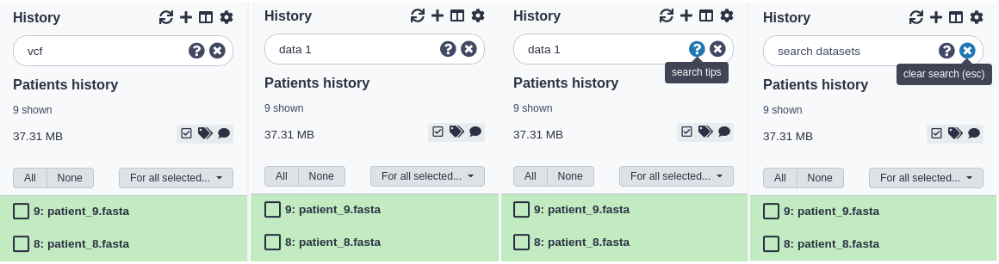
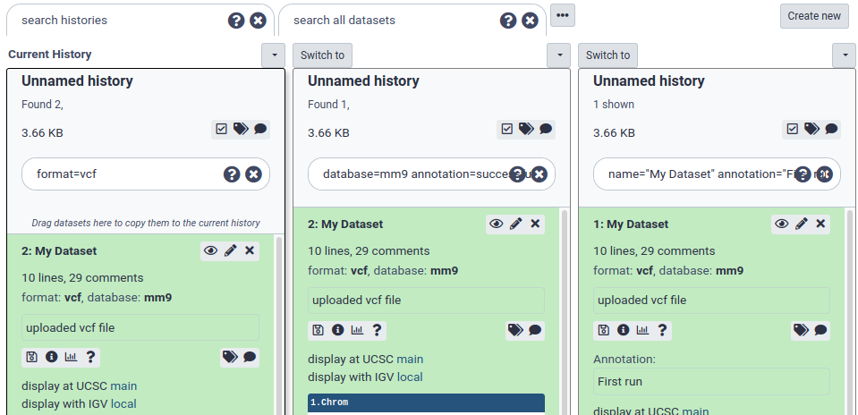

# Basic Searching

You can filter what datasets are shown and search for datasets using the search bar at the top of the panel. Enter
any text that a dataset you'd be looking for would contain, including:

* the name or part of the name
* any text (or partial text) from the info field
* the file format or reference database
* any text or partial text from the annotation or tags of a dataset

For example:

* To find all vcf files you might enter: `vcf` alone.
* To find all files whose names contain data 1, you can enter: `data 1`
* To search for a VCF file named 'VCF filter on data 1' and tagged with 'experiment_1', you could enter: `vcf filter on data 1 experiment_1`

> <comment-title>Do I search for VCF or vcf?</comment-title>
> Searches are case-insensitive. For example, `VCF` and `vcf` are equivalent.
{: .comment}

## Clearing a Search

You can clear a search and show all visible datasets by clicking the round 'X' button in the right of the search bar
or - while entering text in the search bar - hitting the escape key ('Esc').

# Advanced Searching

You can also specify dataset properties that you want to filter on. If you search with multiple properties, these are connected with ANDs, so datasets must match all provided attributes.

Query                                              | Results
-----                                              | ------
`name="FASTQC on"`                                 | Any datasets with "FASTQC on" in the title, but avoids items which have "FASTQC on" in other fields like the description or annotation.
`format=vcf`                                       | Datasets with a specific format. Some formats are hierarchical, e.g. searching for `fastq` will find fastq files but also fastqsanger and fastqillumina files. You can see more formats in the upload dialogue.
`database=hg19`                                    | Datasets with a specific reference genome
`annotation="first of five"`                       |
`description="This is data of a Borneo Orangutan"` | for dataset summary description
`info="started mapping"`                           | for searching on job's info field.
`tag=experiment1 tag=to_publish`                   | for searching on (a partial) dataset tag. You can repeat to search for more tags.
`hid=25`                                           | A specific history item ID (based on the ordering in the history)
`state=error`                                      | To show only datasets in a given state. Other options include `ok`, `running`, `paused`, and `new`.
`history_content_type=collection`                  | Filter for collections

> <comment-title>Combining Searches</comment-title>
> Keyword searches can be combined: `database=mm10 annotation=successful`
> You can enclose text with double quotes and include spaces: `name="My Dataset" annotation="First run"`.
> Only the datasets that meet ALL search criteria will be shown.
{: .comment}

If you find normal searching is showing too many datasets, and not what you're looking for, try the advanced, keyword
search.

### Search and multi-select

It's often useful to combine search and multi-select. Multi-selections will persist between searches, and the All/None buttons
will only apply to the datasets currently shown with the given search.

So, for example, to select and manipulate two different sets of datasets:

1. fastqsanger files tagged with 'low quality'
2. hg19 reference BAM files whose names contain "Output"

You can do the following steps:

1. In the search bar, enter: `format=fastqsanger tag="low quality"` and hit enter.
2. Click the multi-select button to show the checkboxes.
3. Click the 'All' button to select all the fastqsanger files
4. In the search bar, enter: `database=hg19 format=BAM name=output` and hit enter.
5. Click the 'All' button again to select all the BAM files.
6. Clear the search using the clear button. All datasets are shown and both fastqsanger and BAM files are still selected.
7. You can now perform some action on those two sets of datasets like building a collection or batch deleting them.
